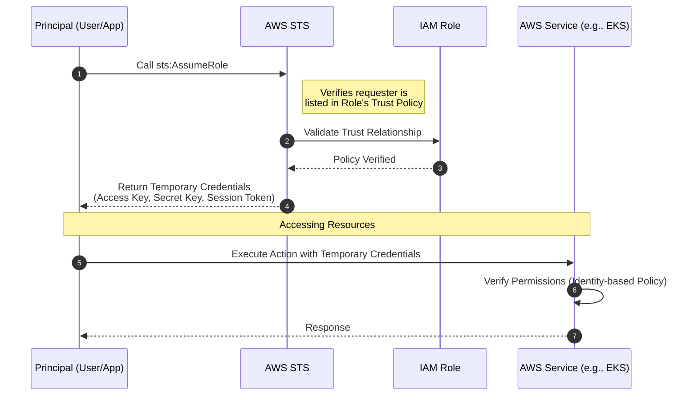
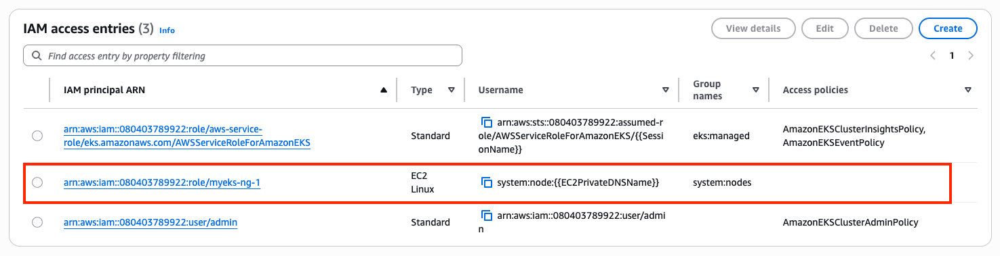
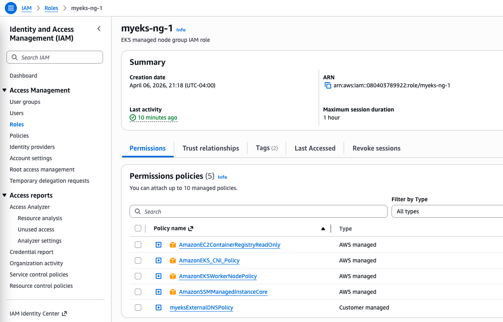

# IAM Role Assumption and Temporary Credentials

## 1. Understanding IAM AssumeRole

Previously, we examined the Amazon EKS authentication and authorization (AuthN/AuthZ) process using an IAM User (e.g., `arn:aws:iam::{account-id}:user/admin`). This method typically relies on **long-lived credentials**—a permanent Access Key ID and Secret Access Key—which remain valid until manually rotated or revoked. While convenient for local development, long-lived keys pose a significant security risk if compromised.

To mitigate these risks and adhere to the principle of least privilege, AWS provides the **AssumeRole** mechanism. This allows an authenticated identity (such as an IAM user, an application, or an AWS service) to dynamically acquire **temporary security credentials** with a predefined set of permissions.

### Key Concepts of Role Assumption

1.  **Temporary Credentials**: When an entity assumes a role, the AWS Security Token Service (STS) returns a set of temporary credentials consisting of an **Access Key ID**, a **Secret Access Key**, and a **Session Token**. These credentials automatically expire after a specified duration (defaulting to 1 hour).
2.  **Trust Relationships (Trust Policy)**: An IAM Role includes a **Trust Policy** that defines which principals (AWS accounts, users, or services) are authorized to assume it. This ensures that permissions are not granted arbitrarily.
3.  **Permission Policies**: Once assumed, the principal swaps its original identity for the role's identity. The actions they can perform are then governed by the **Identity-based policies** attached to the role, rather than their original user permissions.

### Why Use AssumeRole in EKS?

*   **Enhanced Security**: By eliminating long-lived keys, you reduce the blast radius of potential credential leaks.
*   **Cross-Account Access**: AssumeRole is the standard method for allowing users in one AWS account to manage resources in another EKS cluster located in a different account.
*   **Federated Identities**: It enables external identities (e.g., from an OIDC provider or SAML) to access the EKS API without requiring an IAM User for every person.
*   **Automated Workflows**: CI/CD pipelines (like GitHub Actions) can assume specialized roles to deploy applications securely without storing secrets.

### IAM Role Assumption Workflow

The following diagram outlines the standard process for assuming an IAM role and utilizing temporary credentials:



---

## 2. Lab: Accessing the Kubernetes API via Node IAM Role Assumption

### Verifying the IAM Role for the EC2 Instance

The EKS cluster is currently configured with **one IAM User** and **two IAM Roles** that have direct access to the Kubernetes API.

``` bash hl_lines="4-6" title="Checking current Access Entries for the EKS Cluster"
aws eks list-access-entries --cluster-name myeks | jq
{
  "accessEntries": [
    "arn:aws:iam::080403789922:role/aws-service-role/eks.amazonaws.com/AWSServiceRoleForAmazonEKS",
    "arn:aws:iam::080403789922:role/myeks-ng-1",
    "arn:aws:iam::080403789922:user/admin"
  ]
}
```

**Detailed Breakdown of the Access Entries:**

- **role/aws-service-role/.../AWSServiceRoleForAmazonEKS**: An AWS Service-Linked Role that allows EKS to manage other AWS services (like Load Balancers or ENIs) on your behalf.
- **role/myeks-ng-1**: The IAM Role assigned to your Worker Nodes (EC2 instances). This allows the kubelet and other node-level components to communicate with the API server.
- **user/admin**: The IAM User (likely your current identity) with administrative access.

In our [previous exploration of Authentication and Authorization (AuthN/AuthZ)](./10-auth.md), we examined the process using the **user/admin** principal. This section focuses on how EC2 instances utilize the **role/myeks-ng-1** IAM Role to authenticate and interact with the Kubernetes API server.

The `describe-access-entry` output provided below reveals that the `arn:aws:iam::080403789922:role/myeks-ng-1` IAM Role is explicitly mapped to the Kubernetes group `system:nodes` and assigned the username `system:node:{{EC2PrivateDNSName}}`. Kubernetes has built-in RBAC rules for the `system:nodes` group that allow the `kubelet` on the EC2 instance to perform essential tasks such as heartbeat reporting, pod status updates, and retrieving secrets required by pods.

``` bash hl_lines="4" title="Mapping role/myeks-ng-1 to the system:nodes group"
export CLUSTER_NAME=myeks
export ACCOUNT_ID=$(aws sts get-caller-identity --query "Account" --output text)

aws eks describe-access-entry --cluster-name $CLUSTER_NAME --principal-arn arn:aws:iam::$ACCOUNT_ID:role/myeks-ng-1 | jq # (1)!
```

1.  :octicons-code-review-16:
``` json hl_lines="6 13 14"
{
  "accessEntry": {
    "clusterName": "myeks",
    "principalArn": "arn:aws:iam::080403789922:role/myeks-ng-1",
    "kubernetesGroups": [
      "system:nodes"
    ],
    "accessEntryArn": "arn:aws:eks:us-east-1:080403789922:access-entry/myeks/role/080403789922/myeks-ng-1/24ceb2c8-2af3-72f6-c502-b8ad4da96b29",
    "createdAt": "2026-04-06T21:30:51.277000-04:00",
    "modifiedAt": "2026-04-06T21:30:51.277000-04:00",
    "tags": {},
    "username": "system:node:{{EC2PrivateDNSName}}",
    "type": "EC2_LINUX"
  }
}
```



### Validating IAM Permissions for Worker Nodes

We will now access a worker node and verify its current IAM identity and associated permissions.

``` bash hl_lines="12 15 16" title="Identifying and accessing target worker nodes"
aws ssm describe-instance-information \
  --query "InstanceInformationList[*].{InstanceId:InstanceId, Status:PingStatus, OS:PlatformName}" \
  --output text # table

export NODE1=i-0b64a233926c6200c
export NODE2=i-0e7d7b7325528e294

aws ssm start-session --target $NODE1
sudo su -

# Identify the current assumed identity
aws sts get-caller-identity --query Arn # (1)!

# Test identity-based permissions
aws s3 ls # (2)!
aws ec2 describe-vpcs --no-cli-pager # (3)!
```

1.  :octicons-code-review-16: **IAM Identity Check**:
    ``` text
    "arn:aws:sts::080403789922:assumed-role/myeks-ng-1/i-0b64a233926c6200c"
    ```
    The `assumed-role` ARN indicates that the current identity is a **temporary session** created by assuming an IAM Role. The ARN follows the structure:
    `arn:aws:sts::{account-id}:assumed-role/{role-name}/{session-name}`

    *   **Role Name (`myeks-ng-1`)**: Confirms the instance is utilizing the permissions defined in the node's IAM role.
    *   **Session Name (`i-0b64a233926c6200c`)**: When an EC2 instance assumes a role via an Instance Profile, it automatically uses its **Instance ID** as the session name, providing a clear audit trail.
2.  :octicons-code-review-16: **Expected Authorization Failure**:
    ``` text
    aws: [ERROR]: An error occurred (AccessDenied) when calling the ListBuckets operation: User: arn:aws:sts::080403789922:assumed-role/myeks-ng-1/i-0b64a233926c6200c is not authorized to perform: s3:ListAllMyBuckets because no identity-based policy allows the s3:ListAllMyBuckets action
    ```
3.  :octicons-code-review-16: **Successful EC2 Operation**: The command returns VPC information because the role has the necessary EC2 permissions.

While the `myeks-ng-1` IAM Role is authorized for Amazon EC2 operations through its attached policies, it lacks the required permissions for Amazon S3 access.



### Testing Kubernetes API Connectivity from Worker Nodes

Now, we will determine if the EC2 instance can access the Kubernetes API server using its current `myeks-ng-1` IAM Role.

``` bash hl_lines="5 9" title="Configuring kubectl access on the worker node"
# Generate the kubeconfig required for EKS API communication
aws eks --region us-east-1 update-kubeconfig --name myeks

# Inspect the generated kubeconfig
cat /root/.kube/config # (1)!

# Generate a temporary authentication token for the EKS API
export CLUSTER_NAME=myeks
aws eks get-token --cluster-name $CLUSTER_NAME | jq # (2)!
```

1.  :octicons-code-review-16: **Kubeconfig Context**:
    ``` yaml
    current-context: arn:aws:eks:us-east-1:080403789922:cluster/myeks
    ...
    ```
2.  :octicons-code-review-16: **Authentication Token**:
    ``` json
    {
      "kind": "ExecCredential",
      "apiVersion": "client.authentication.k8s.io/v1beta1",
      "spec": {},
      "status": {
        "expirationTimestamp": "2026-04-12T01:51:45Z",
        "token": "k8s-aws-v1.aHR0cHM6Ly9zdHMudXMtZ<REDACTED>
    ```

### Invoking the Kubernetes API from a Worker Node

We will now install `kubectl` and test the instance's ability to communicate with the cluster.

``` bash hl_lines="7 8 11" title="Installing kubectl and testing API access"
# Install kubectl
curl -O https://s3.us-west-2.amazonaws.com/amazon-eks/1.35.2/2026-02-27/bin/linux/amd64/kubectl
install -o root -g root -m 0755 kubectl /usr/local/bin/kubectl
kubectl version

# Attempt to retrieve cluster-wide information
kubectl get pod -A # (1)!
kubectl get node # (2)!

# Attempt to retrieve information for the local node
kubectl get node ip-192-168-15-14.ec2.internal -v=10 # (3)!
```

1.  :octicons-code-review-16: **Expected Failure (Cluster Scope)**:
    ``` text
    Error from server (Forbidden): pods is forbidden: User "system:node:ip-192-168-15-14.ec2.internal" cannot list resource "pods" in API group "" at the cluster scope: can only list/watch pods with spec.nodeName field selector
    ```
2.  :octicons-code-review-16: **Expected Failure (All Nodes)**:
    ``` text
    Error from server (Forbidden): nodes is forbidden: User "system:node:ip-192-168-15-14.ec2.internal" cannot list resource "nodes" in API group "" at the cluster scope: node 'ip-192-168-15-14.ec2.internal' cannot read all nodes, only its own Node object
    ```
3.  :information_source: **Specific Node Retrieval**: Use the node name retrieved from `kubectl get nodes` (if visible) or the EC2 private DNS name.

!!! info "Analysis: Why can a worker node access its own information but not the cluster-wide node list?"
    The ability of a worker node to retrieve and manage its own information is not derived from standard RBAC but is instead enforced by a specialized admission controller and authorizer in Kubernetes known as **Node Restriction**.

``` bash hl_lines="8 14" title="Directly invoking the Kubernetes API with the token"
# Retrieve the current authentication token
TOKEN_DATA=$(aws eks get-token --cluster-name myeks | jq -r '.status.token')

# Successful retrieval of local node information
curl -k -v -XGET \
  -H "Authorization: Bearer $TOKEN_DATA" \
  -H "Accept: application/json" \
  'https://<EKS_ENDPOINT>/api/v1/nodes/ip-192-168-15-14.ec2.internal' | jq # (1)!

# Failed retrieval of a different node (HTTP 403)
curl -k -v -XGET \
  -H "Authorization: Bearer $TOKEN_DATA" \
  -H "Accept: application/json" \
  'https://<EKS_ENDPOINT>/api/v1/nodes/ip-192-168-23-49.ec2.internal' | jq # (2)!
```

1.  :octicons-code-review-16: **Authorized Access**: Successfully returns the Node object for the local instance.
2.  :octicons-code-review-16: **Forbidden Access**: Returns a 403 Forbidden error, as nodes are restricted from viewing other nodes.

### Validating Authentication Tokens Across Environments

To demonstrate the portability of EKS authentication tokens, we can retrieve a token from the worker node and validate it via a `TokenReview` request from a different environment (e.g., your local machine).

``` bash hl_lines="20" title="Extracting and validating a Node token"
# 1. Retrieve the session token from the worker node via SSM
aws ssm start-session --target $NODE1
sudo su -
TOKEN_DATA=$(aws eks get-token --cluster-name myeks | jq -r '.status.token')
echo $TOKEN_DATA 

# 2. Transition to your local environment and store the token
TOKEN_DATA="<PASTE_TOKEN_FROM_NODE_HERE>"

# 3. Create and submit a TokenReview object to the API server
cat > token-review.yaml << EOF
apiVersion: authentication.k8s.io/v1
kind: TokenReview
metadata:
  name: node-token-review
spec:
  token: ${TOKEN_DATA}
EOF

kubectl create -f token-review.yaml -v=9 # (1)!
```

1.  :octicons-code-review-16: **TokenReview Result**:
    ``` json hl_lines="3 8"
    {
      "status": {
        "authenticated": true,
        "user": {
          "username": "system:node:ip-192-168-15-14.ec2.internal",
          "uid": "aws-iam-authenticator:080403789922:AROARFODQPBRPWFLGZFFM",
          "groups": [
            "system:nodes",
            "system:authenticated"
          ]
        }
      }
    }
    ```

!!! info "Analysis: Why is this validation successful across different environments?"
    The success of this `TokenReview` request illustrates two fundamental aspects of the Amazon EKS authentication model:

    1.  **Token Portability (Pre-signed URLs)**: The token generated by `aws eks get-token` is essentially a **pre-signed URL** for the AWS STS `GetCallerIdentity` action. It is a self-contained cryptographic proof of identity.
    2.  **Stateless Validation**: The Kubernetes API server (and the `aws-iam-authenticator` service) does not validate the source IP or the environment. It only verifies the **authenticity of the signature** by executing the pre-signed URL against AWS STS.

### Analyzing RBAC Permissions for the `system:nodes` Group

To understand the exact permissions granted to the worker node identity, we can analyze the Kubernetes RBAC bindings associated with the `system:nodes` group.

``` bash hl_lines="5 8 11" title="Inspecting RBAC bindings and permissions"
# 1. Install rbac-tool on the worker node for identity inspection
curl https://raw.githubusercontent.com/alcideio/rbac-tool/master/download.sh | bash

# 2. Verify the authenticated identity directly on the node
rbac-tool whoami # (1)!

# 3. Identify ClusterRoles bound to the system:nodes group
kubectl rbac-tool lookup system:nodes # (2)!

# 4. Summarize the effective permissions for the system:nodes group
kubectl rolesum -k Group system:nodes # (3)!
```

1.  :octicons-code-review-16: **Identity Verification**: Confirms that the token maps correctly to the `system:nodes` group.
2.  :octicons-code-review-16: **Binding Discovery**: Shows that the `system:nodes` group is bound to the **`eks:node-bootstrapper`** ClusterRole.
3.  :octicons-code-review-16: **Permission Summary**: The `eks:node-bootstrapper` role specifically allows nodes to create Certificate Signing Requests (CSRs), which is critical for node registration.

!!! note "The Role of `eks:node-bootstrapper`"
    While `eks:node-bootstrapper` handles initial certificate provisioning, the majority of a node's operational permissions (such as updating pod status or reporting heartbeats) are managed via the **Node Authorizer** rather than explicit RBAC roles. This explains the limited permissions shown in the `rolesum` output for a fully functional node.
