# EKS Networking Fundamentals

## Summary

This note explores how AWS EKS implements core Kubernetes networking requirements. We start with the **Pod Network**, explaining how unique IPs are assigned via network namespaces and how Pods communicate using `veth` pairs, bridges, and the AWS VPC CNI. We then dive into the **Service Network**, detailing how `Service` provides stable endpoints and load balancing for ephemeral Pods through `kube-proxy` (iptables and IPVS modes). We also examine the various **Service types**—ClusterIP, NodePort, LoadBalancer, and ExternalName—and their specific use cases. Finally, we introduce the **Gateway Network**, covering how external traffic enters the cluster via Ingress, the Gateway API, and the AWS Load Balancer Controller.

## 1. Kubernetes Networking Model
The [Services, Load Balancing, and Networking](https://kubernetes.io/docs/concepts/services-networking) page in the k8s official doc describes the following requirements for Kubernetes networking:

- `Pod`: All pods can communicate with all other pods, **whether they are on the same node or on different nodes**. Pods can communicate with each other directly, **without** the use of proxies or address translation (**NAT**).
- `Service`: The Service API lets you provide a stable (long lived) IP address or hostname for a service implemented by one or more backend pods, where the individual pods making up the service can change over time.
- `Gateway`: The Gateway API (or its predecessor, Ingress) allows you to make Services accessible to clients that are outside the cluster.
- `NetworkPolicy`: NetworkPolicy is a built-in Kubernetes API that allows you to control traffic between pods, or between pods and the outside world.

The following sections are about how AWS EKS implements these requirements. Let's dive in the pod network.

## 2. Pod Network
Let's revisit the requirement for the pod networking:

!!! quote

    All pods can communicate with all other pods, **whether they are on the same node or on different nodes**. Pods can communicate with each other directly, **without** the use of proxies or address translation (**NAT**).

### 2.1. Multiple IPs in a single node
In computer networking, if a host wants to talk to others, an IP address should be assigned to the host. Since a pod is the smallest unit for k8s networking, each pod should be assigned an IP address. But if you recall a networking 101 class you ever took in the past, a unit for the IP address is usually a single device(server, PC, router, etc), and thus programs in my laptop communicates each other by `localhost`(`127.0.0.1`). In k8s, a node is a single server and houses multiple pods. How could a single pod get assigned an IP and thus how does a single node end up with multiple IPs?

It turns out the smallest unit for the IP address assignment is not a single device but **Network Namespace**. Each network namespace has at least one network interface, an IP address, a port, and a routing table. In other words, **network namespace is the smallest networking unit**. Obviously, OS in a single node allows multiple network namespaces. In the k8s context, each pod is running under its own network namespace, with a set of network interface, IP addresses, ports, and routing tables.

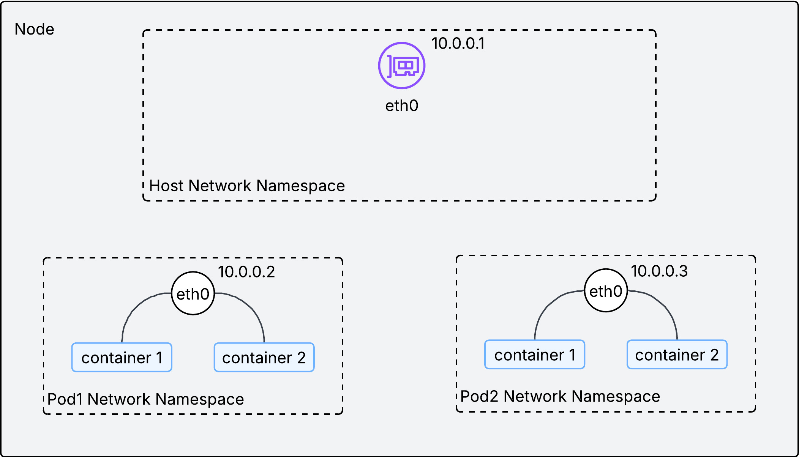

As described in the above image, a single IP address is assigned to each network namespace(or pod) in a node. With an IP address on each pod, how could we facilitate communications between them inside the node?

### 2.2. Communication within a node

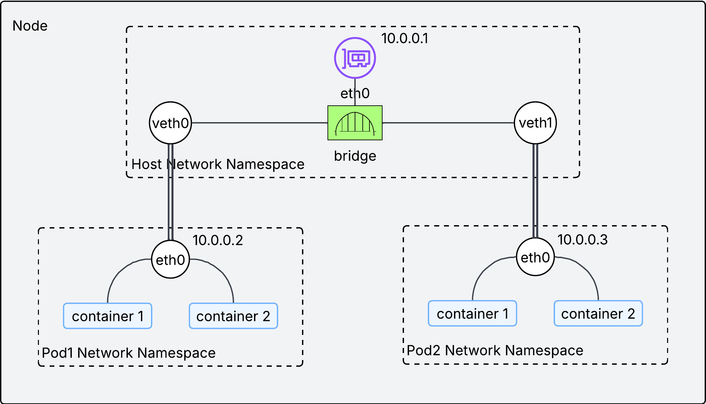

Two technologies are used to facilitate communication inside the node:

- `veth pair`: Think of it as a virtual ethernet cable. Each end is connected to a different network interface. If a packet comes into one end, it goes out the other end.
- `bridge interface`: It works as L2 switch, connecting pods within a single node. This is implemented by CNI plugins. 

If the above diagram looks confusing, try to understand it this way:

- each virtual network interface(`veth0` and `veth1`) is the representation of a pod in a node.
- the physical network interface in the node(`eth0`) is a router in a node.
- They are connected by the network switch(bridge interface).
- Overall, the entire diagram looks like a home network.

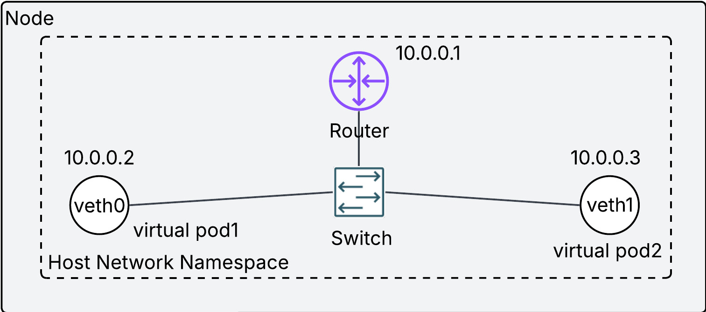

Each pod has its own IP address and they are connected via the bridge interface, which makes possible the communication between pods in the same node. We have confirmed the principle of pod networking on the same node. But kubernetes networking requires more than that. We need to ensure pod networking **on different nodes without Network Address Translation(NAT)**.

### 2.3. Communication between nodes
We need to understand the meaning of **without NAT** first. NAT is a technique to allow a host in a local network to talk to another host in the different network. Please refer to [05 Network Address Translation(NAT)](https://seyoungnam.github.io/network/05-nat/) page for more details. The way to avoid NAT is to assign each pod to non-overlapping IP address across nodes. If each pod has a unique IP address in the cluster, we can regard the entire cluster as a single local network, and thus NAT is not required.

Then how can we ensure a unique IP address for each pod across nodes in the same cluster? There are three ways:

#### 2.3.1. Overlay (Flannel, VXLAN)
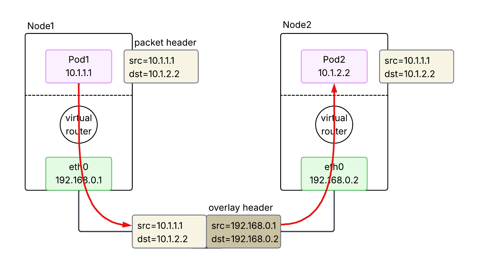
An overlay is used to bridge a routing gap between the Pod network and the physical network. Because the physical network doesn't know which node owns which pod IP, the traffic must be **encapsulated** to get across. When a Pod sends a packet, the node wraps it in a new packet (typically UDP/VXLAN) addressed to the destination node. The receiving node then unwraps it and delivers it to the destination Pod. This provides great flexibility but adds a small amount of CPU overhead and reduces the effective MTU.

#### 2.3.2. BGP (Calico)
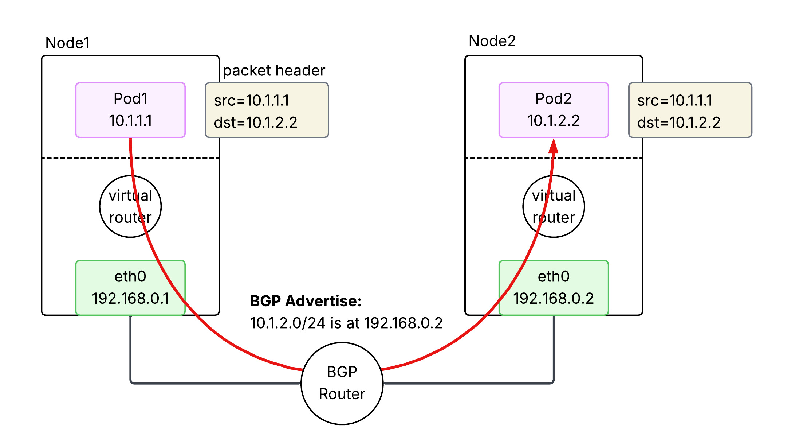
BGP-based networking **avoids encapsulation** by making the underlying network fabric aware of Pod IP addresses. Nodes use the Border Gateway Protocol (BGP) to **advertise the Pod IP ranges** they are currently hosting **to other nodes and routers**. This allows packets to be routed natively between nodes without being wrapped in extra headers. It offers high performance and easier debugging, but requires a network infrastructure that can handle a large number of dynamic routes and potentially support BGP.

#### 2.3.3. Cloud Native (AWS VPC CNI)
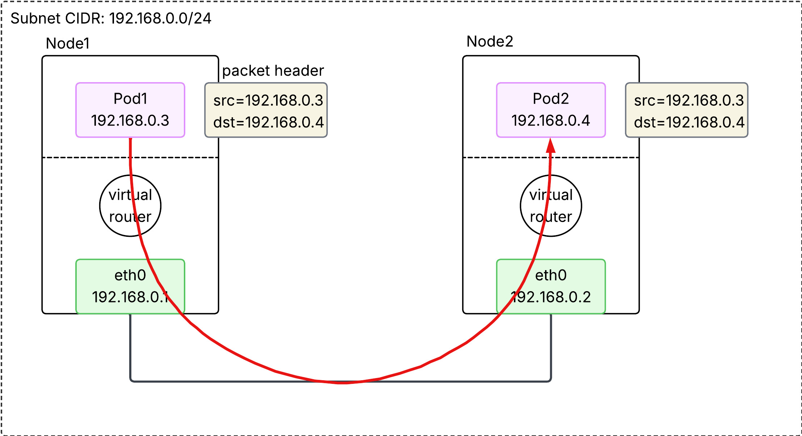
In AWS EKS, the default is the VPC CNI, which treats Pods as "first-class citizens" of the VPC. **Each Pod is assigned a real secondary private IP address from the VPC's own subnets**. Because the AWS VPC fabric natively understands these IPs, no overlays or BGP are required. Traffic is routed directly through the AWS infrastructure at native speeds. This also allows Pods to use VPC features like Security Groups and Flow Logs directly.

##### 2.3.3.1. Secondary IP mode
In this default mode, each Pod is assigned a single secondary private IP address from the VPC subnet. 

- **Mechanism:** Each Pod consumes one secondary IP "slot" on an ENI.
- **Bottleneck:** Every EC2 instance type has a hard limit on the number of ENIs and secondary IPs per ENI (e.g., a `t3.medium` supports 3 ENIs with 6 IPs each, limiting pod density).
- **Density:** Lower. The maximum number of Pods is roughly `(# of ENIs × (# of IPs per ENI - 1)) + 1`.

##### 2.3.3.2. Prefix mode
Introduced to solve the density problem, this mode allows AWS to assign **/28 IPv4 prefixes** (blocks of 16 IPs) to an ENI instead of individual secondary IPs.

- **Mechanism:** One "IP slot" on an ENI now holds a `/28` prefix, providing 16 IP addresses for Pods.
- **Density:** Much Higher. It virtually eliminates the IP-based capping per instance type, allowing nodes to support the Kubernetes standard of 110 or more pods.
- **Subnet Impact:** It can consume large chunks of subnet IP space quickly, so proper subnet sizing is critical.

## 3. Service Network
What we have learned so far is about pod-to-pod networking in a cluster, **with an important assumption - pods are persistent**. This assumption does not reflect the reality. Pods are in fact ephemeral, meaning it is often scraped and redeployed. Pods are changing, So is its IP address. From the source host point of view, it is a nightmare to keep following ever-changing destination IP address. That is where `Service` comes into play. 

### 3.1. What does `Service` do?
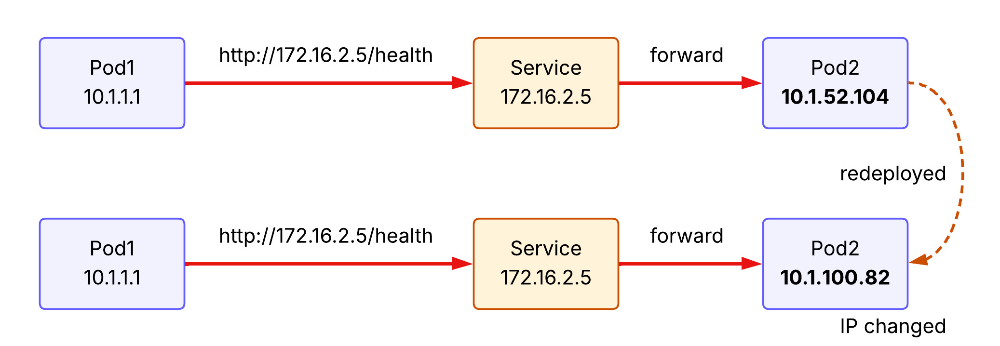

`Service` provides a **stable (long-lived) IP address** and **hostname** for a service. The source host now can make a request to the `Service` with the stable IP address and the `Service` forwards it to one of the backend pods. If a new pod is deployed behind the `Service`, `Service` learns its IP address and able to forward the receiving request to the backend pod.

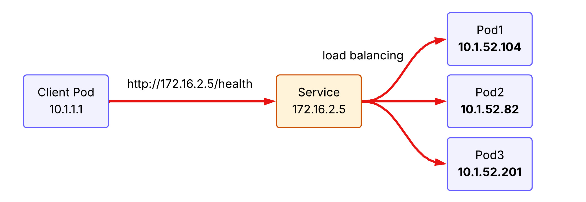
Another feature of `Service` is **load balancing**. Requests to `Service` are distributed across pods running behind. To illustrate, if the client pod make the same request to the service three times, the first request hits pod 1, the second request hits pod 2, and the third request hits pod 3 under the round-robin load balancing policy.

### 3.2. `kube-proxy` implements `Service` concept

`kube-proxy` is a network proxy that runs on each node as a daemon in your cluster, implementing part of the Kubernetes `Service` concept. It maintains network rules on nodes that allow network communication to your Pods. When you create a `Service` (like a `ClusterIP`), Kubernetes assigns it a virtual IP. `kube-proxy` is responsible for "realizing" this virtual IP. It does this by watching the API Server for new `Services` and `Endpoints`, then **updating the node's networking stack**.

It operats in three primary modes:

#### 3.2.1. iptables (default)

It creates `iptables` rules at `Netfilter` module in the node's **kernel** to redirect traffic destined for a `Service`'s virtual IP to one of the backend Pods. It is the default mode for k8s cluster and uses a randomized choice for load balancing. Note that `kube-proxy` is a control plane that modifies `iptables` rules at `Netfilter`. Thus, packets never hit `kube-proxy` pods located in user space, but rather gets through `Netfilter` in kernel. 

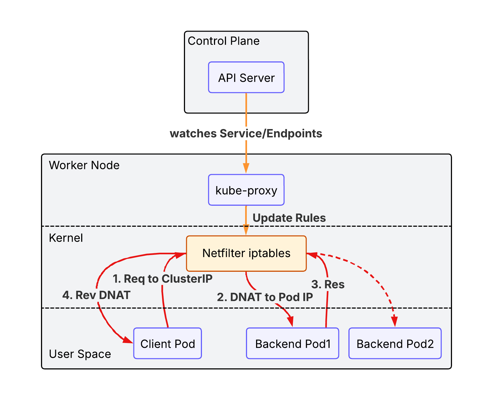

`iptables` mode has the following advantages over legacy user space mode:

- **Performance**: Packets are handled entirely in kernel space by `Netfilter`, avoiding expensive context switches between kernel and user space.
- **Reliability**: If `kube-proxy` crashes, existing traffic can still be routed via the established rules (though new services or endpoint changes won't be applied until it restarts).
- **Efficiency**: Lower CPU and memory overhead as `kube-proxy` only manages the rules rather than acting as a data-path proxy.

However the performance would be degraded as the number of `iptables` rules gets increased(the packet need to read rules one by one).

#### 3.2.2. IPVS (IP Virtual Server)
IPVS is Layer 4 load balancer working at `Netfilter`. It offers better performance for clusters with thousands of services. It supports more sophisticated load-balancing algorithms (least connection, shortest expected delay, etc.).

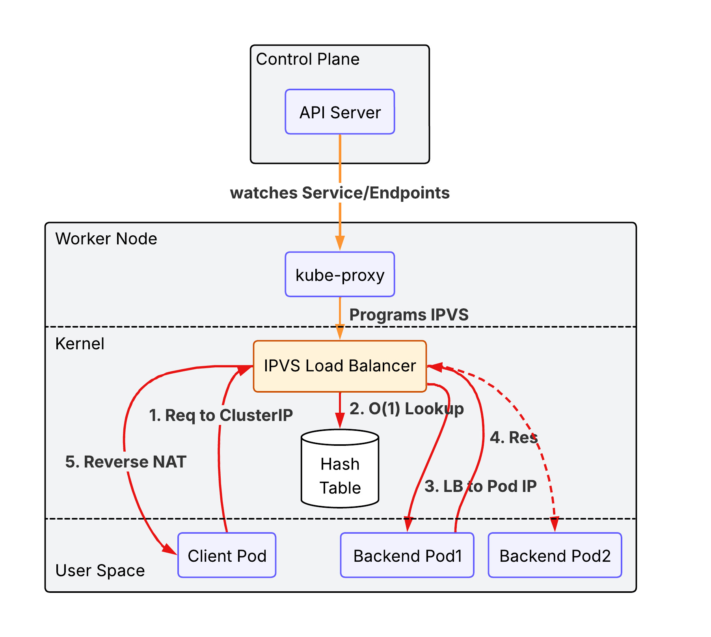

Unlike `iptables` which uses a sequential list of rules ($O(N)$), IPVS uses a **Hash Table** ($O(1)$), ensuring consistent performance even as the number of services grows into the thousands.

#### 3.2.3. nftables proxy
In this mode, `kube-proxy` configures packet forwarding rules using the **nftables API** of the kernel **netfilter subsystem**. For each endpoint, it installs nftables rules which, by default, select a backend Pod at random. The `nftables API` is the successor to the `iptables API` and is designed to provide better performance and scalability than `iptables`. The `nftables` proxy mode is able to process changes to service endpoints faster and more efficiently than the `iptables` mode, and is also able to more efficiently process packets in the kernel (though this only becomes noticeable in clusters with tens of thousands of services). _This proxy mode is only available on Linux nodes, and requires kernel 5.13 or later._ Please read [iptables: The two variants and their relationship with nftables](https://developers.redhat.com/blog/2020/08/18/iptables-the-two-variants-and-their-relationship-with-nftables) for more details.

#### 3.2.4. eBPF mode + XDP(eXpress Data Path)
While the previous modes rely on the fixed logic of the `Netfilter` subsystem, **eBPF (extended Berkeley Packet Filter)** allows for running custom, high-performance programs directly within the Linux kernel in response to various events (like packet arrival). 

- **eBPF-based Load Balancing:** Instead of using `iptables` or `IPVS` rules, specialized CNI plugins like **Cilium** use eBPF to implement service load balancing. It can bypass much of the standard Linux networking stack (like the `conntrack` table), significantly reducing latency and CPU overhead.
- **XDP (eXpress Data Path):** XDP is a specific type of eBPF hook that runs at the **earliest possible point** in the network driver, before the packet is even allocated into a kernel buffer (`sk_buff`). By processing packets directly at the NIC driver level, XDP can perform load balancing, DDoS protection, or packet dropping at near-line speeds.

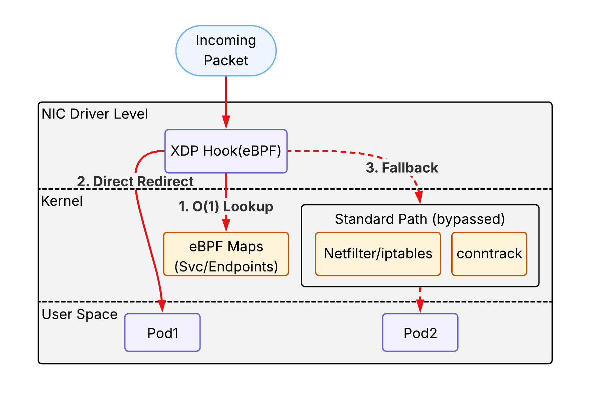

This combination represents the cutting edge of Kubernetes networking, providing the highest possible performance and observability, especially in massive-scale environments.

### 3.3. `Service` types

#### 3.3.1. ClusterIP
`ClusterIP` is the default type of the `Service` in the k8s cluster. It is accessible only within the same cluster. A client outside of the cluster cannot access to it.

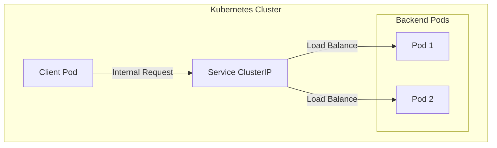

#### 3.3.2. NodePort
`NodePort` exposes the Service on each Node's IP at a static port (the `NodePort`). You can contact the `NodePort` Service, from outside the cluster, by requesting `<NodeIP>:<NodePort>`. 

- **Mechanism:** It builds upon `ClusterIP` by opening a specific port on all nodes.
- **Limitation:** You are responsible for managing the node IP addresses and load balancing across them if a node goes down.

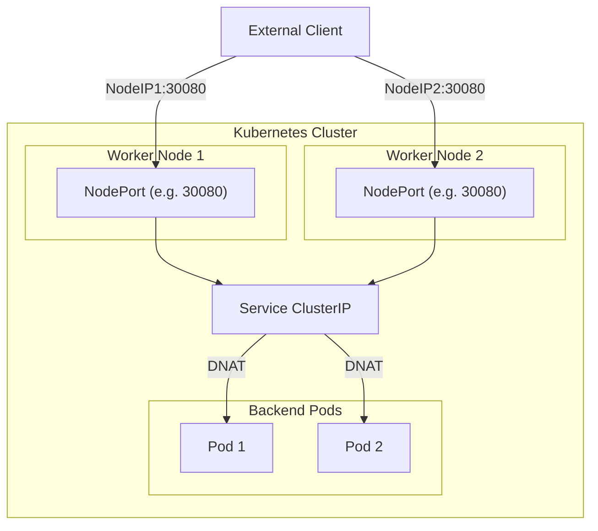

#### 3.3.3. LoadBalancer
`LoadBalancer` exposes the Service externally using a cloud provider's load balancer (e.g., AWS NLB/ALB). 
- **Mechanism:** It automatically creates a `NodePort` and `ClusterIP` Service to which the external load balancer routes.
- **EKS Integration:** In EKS, this typically triggers the creation of an AWS Network Load Balancer (NLB) or Classic Load Balancer (CLB) that directs traffic to the `NodePort` on your worker nodes.

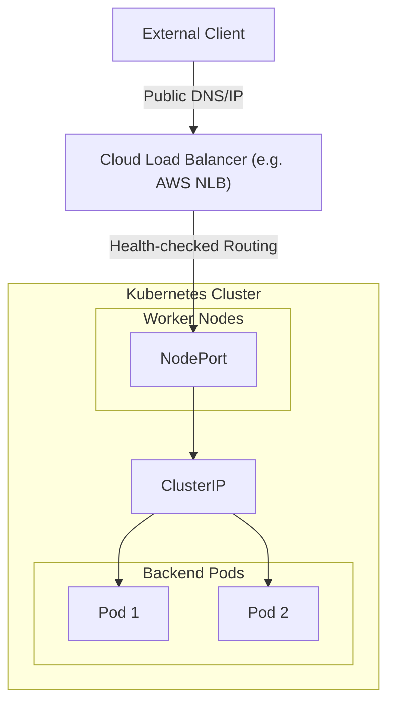

#### 3.3.4. ExternalName
`ExternalName` maps a Service to a DNS name instead of a pod selector.

- **Mechanism:** It returns a `CNAME` record with the value defined in the `externalName` field (e.g., `my.database.example.com`).
- **Use Case:** Useful for allowing Pods to reference external services (like an RDS instance) using a local Kubernetes DNS name.

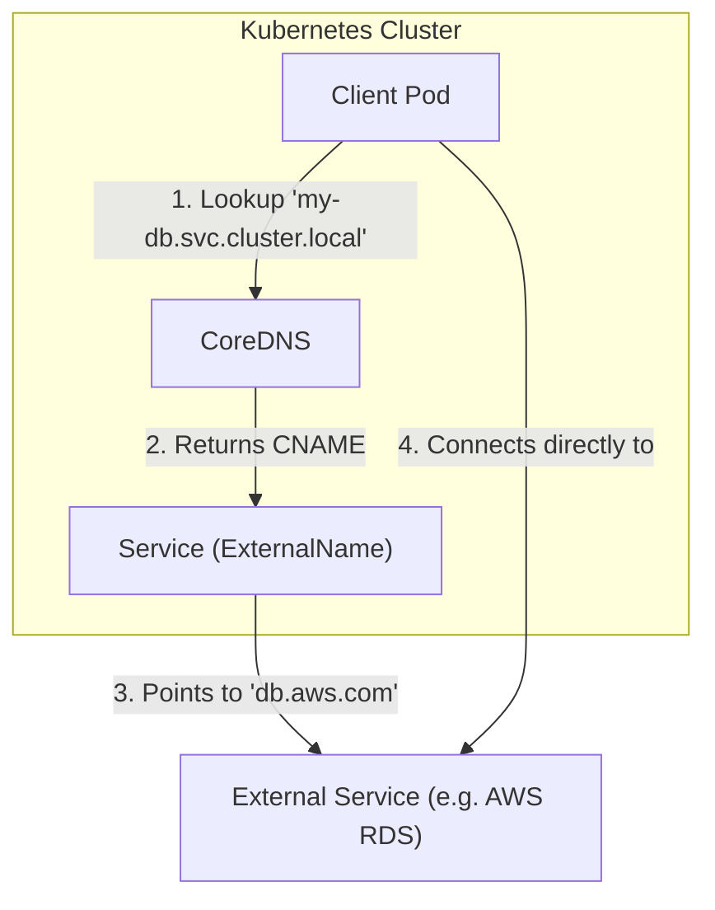

## 4. Exposing Kubernetes Applications
Now we have a clear picture of the request routing process between pods within a cluster. The next question popped up on my mind is how to expose applications running in the cluster to the outside world. 

## 5. Gateway Network
While `Service` handles connectivity and load balancing within the cluster, the **Gateway Network** (comprising the modern **Gateway API** and its predecessor, **Ingress**) defines how external traffic from the internet or a VPC enters the cluster. In EKS, this layer typically leverages the **AWS Load Balancer Controller** to provision and manage AWS Application Load Balancers (ALB) and Network Load Balancers (NLB), providing advanced routing, TLS termination, and security integration at the cluster edge.
