# Lab 3: AWS LBC, Ingress, and Gateway API

!!! warning

    This lab is the continuation of **03 EKS Networking Lab: Routing and Interfaces** and **04 EKS Networking Lab: Scaling Pod IPs with VPC CNI**. You need to provision an EKS cluster by following the instruction described [here](03-networking-lab.md). 


## 1. Provision AWS Load Balancer Controller

### 1.1. OIDC Provider Setting
Before provisioning the AWS Load Balancer Controller (LBC), you must set up an IAM OIDC provider for your cluster. This enables **IAM Roles for Service Accounts (IRSA)**, which allows the LBC (running as a Pod) to securely authenticate with AWS APIs to manage load balancers (ALB/NLB) using a specific IAM role, rather than relying on broad permissions attached to the worker nodes.

Check if an OIDC provider already exists for your cluster:
```bash
aws iam list-open-id-connect-providers | grep $(aws eks describe-cluster --name myeks --query "cluster.identity.oidc.issuer" --output text | cut -d '/' -f 5)
"Arn": "arn:aws:iam::080403789922:oidc-provider/oidc.eks.us-east-1.amazonaws.com/id/EB53DEAA7B25D7AC731E272CA0873C5A"
```

If it doesn't exist, create it:
```bash
eksctl utils associate-iam-oidc-provider --cluster myeks --approve
```

Search a public subnet to deploy ALB. `kubernetes.io/role/elb=1` tag is [already given to a public subnet](https://github.com/gasida/aews/blob/main/2w/vpc.tf#L39).
```bash
aws ec2 describe-subnets --filters "Name=tag:kubernetes.io/role/elb,Values=1" --output table
```

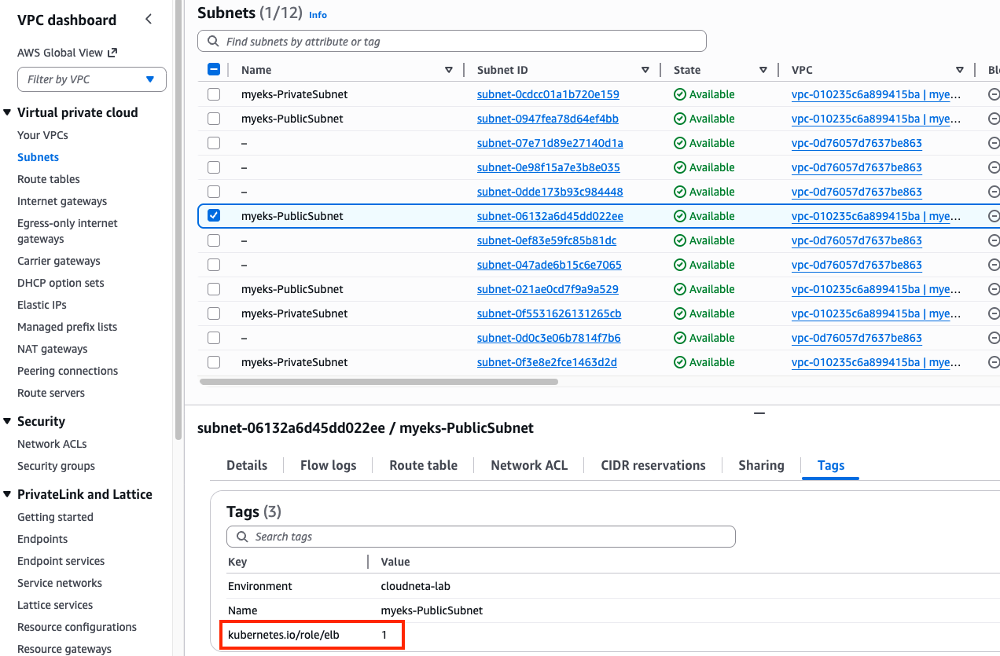

### 1.2. IAM Policy Setting

Download IAM Policy json file:
```bash
curl -o aws_lb_controller_policy.json https://raw.githubusercontent.com/kubernetes-sigs/aws-load-balancer-controller/refs/heads/main/docs/install/iam_policy.json
cat aws_lb_controller_policy.json | jq
```

Create an IAM policy using the downloaded policy:
```bash
aws iam create-policy \
    --policy-name AWSLoadBalancerControllerIAMPolicy \
    --policy-document file://aws_lb_controller_policy.json
```
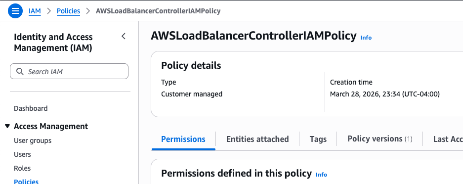

### 1.3. IRSA Setting

Confirm IRSA is not configured yet:
```bash
CLUSTER_NAME=myeks
eksctl get iamserviceaccount --cluster $CLUSTER_NAME
No iamserviceaccounts found

kubectl get serviceaccounts -n kube-system aws-load-balancer-controller
Error from server (NotFound): serviceaccounts "aws-load-balancer-controller" not found
```

Create two resources with the following command:

- aws-load-balancer-controller `ServiceAccount` in kube-system namespace
- IAM role for aws-load-balancer-controller `ServiceAccount`. This is an AWS IAM resource.

```bash
ACCOUNT_ID=$(aws sts get-caller-identity --query "Account" --output text)
eksctl create iamserviceaccount \
  --cluster=$CLUSTER_NAME \
  --namespace=kube-system \
  --name=aws-load-balancer-controller \
  --attach-policy-arn=arn:aws:iam::$ACCOUNT_ID:policy/AWSLoadBalancerControllerIAMPolicy \
  --override-existing-serviceaccounts \
  --approve
```


Confirm the aws-load-balancer-controller `ServiceAccount` is created: 
```bash
eksctl get iamserviceaccount --cluster $CLUSTER_NAME
NAMESPACE       NAME                            ROLE ARN
kube-system     aws-load-balancer-controller    arn:aws:iam::080403789922:role/eksctl-myeks-addon-iamserviceaccount-kube-sys-Role1-iMhfQoJcfrJZ

kubectl get serviceaccounts -n kube-system aws-load-balancer-controller -o yaml
apiVersion: v1
kind: ServiceAccount
metadata:
  annotations:
    eks.amazonaws.com/role-arn: arn:aws:iam::080403789922:role/eksctl-myeks-addon-iamserviceaccount-kube-sys-Role1-iMhfQoJcfrJZ
```

Confirm the above IAM role is created:
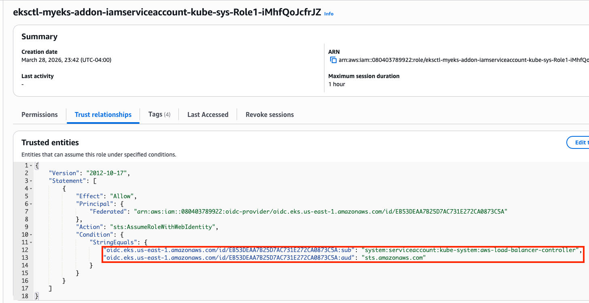

### 1.4. Install AWS Load Balancer Controller

Add helm chart repo:
```bash
helm repo add eks https://aws.github.io/eks-charts
helm repo update
```

Install AWS LBC using helm chart:
```bash
# https://artifacthub.io/packages/helm/aws/aws-load-balancer-controller
# https://github.com/aws/eks-charts/blob/master/stable/aws-load-balancer-controller/values.yaml
helm install aws-load-balancer-controller eks/aws-load-balancer-controller -n kube-system --version 3.1.0 \
  --set clusterName=$CLUSTER_NAME \
  --set serviceAccount.name=aws-load-balancer-controller \
  --set serviceAccount.create=false

NAME: aws-load-balancer-controller
LAST DEPLOYED: Sat Mar 28 23:57:55 2026
NAMESPACE: kube-system
STATUS: deployed
REVISION: 1
DESCRIPTION: Install complete
TEST SUITE: None
NOTES:
AWS Load Balancer controller installed!
```

Confirm:
```bash
helm list -n kube-system
NAME                            NAMESPACE       REVISION        UPDATED                                 STATUS          CHART                                   APP VERSION
aws-load-balancer-controller    kube-system     1               2026-03-28 23:57:55.894328 -0400 EDT    deployed        aws-load-balancer-controller-3.1.0      v3.1.0     
...
```

Confirm pods are crashed:
```bash
kubectl get pod -n kube-system -l app.kubernetes.io/name=aws-load-balancer-controller
NAME                                            READY   STATUS             RESTARTS      AGE
aws-load-balancer-controller-7875649799-bq2vs   0/1     CrashLoopBackOff   2 (21s ago)   61s
aws-load-balancer-controller-7875649799-zvbns   0/1     CrashLoopBackOff   2 (23s ago)   61s
```

Check logs to understand why pods are crashed:
```bash
kubectl logs -n kube-system deployment/aws-load-balancer-controller
Found 2 pods, using pod/aws-load-balancer-controller-7875649799-bq2vs
{"level":"info","ts":"2026-03-29T03:59:59Z","msg":"version","GitVersion":"v3.1.0","GitCommit":"250024dbcc7a428cfd401c949e04de23c167d46e","BuildDate":"2026-02-24T18:21:40+0000"}
{"level":"error","ts":"2026-03-29T04:00:04Z","logger":"setup","msg":"unable to initialize AWS cloud","error":"failed to get VPC ID: failed to fetch VPC ID from instance metadata: error in fetching vpc id through ec2 metadata: get mac metadata: operation error ec2imds: GetMetadata, canceled, context deadline exceeded"}
```

Keyword is **error in fetching vpc id through ec2 metadata**. To allow AWS LBC to acquire VPC ID, there are two options.
First, configure params for `helm install`

- `-set region=region-code`
- `-set vpcId=vpc-xxxxxxxx`

```bash
# get vpc id
terraform state show 'module.vpc.aws_vpc.this[0]'
terraform show -json | jq -r '.values.root_module.child_modules[] | select(.address == "module.vpc") | .resources[] | select(.address == "module.vpc.aws_vpc.this[0]") | .values.id'
vpc-010235c6a899415ba

# Don't run it. We will use the second option.
helm install aws-load-balancer-controller eks/aws-load-balancer-controller -n kube-system --version 3.1.0 \
  --set clusterName=myeks \
  --set serviceAccount.name=aws-load-balancer-controller \
  --set serviceAccount.create=false \
  --set region=us-east-1 \
  --set vpcId=vpc-vpc-010235c6a899415ba
```

Second, modify instance metadata options.
EC2 > Instances > Choose each instance > Actions > Instance settings > Modify instance metadata options > HTTP PUT response hop limit -> 2
Make sure the hop limit is changed for every instances.


Restart aws-load-balancer-controller and check pod status again:

```bash
kubectl rollout restart -n kube-system deploy aws-load-balancer-controller

kubectl get pod -n kube-system -l app.kubernetes.io/name=aws-load-balancer-controller
NAME                                           READY   STATUS    RESTARTS   AGE
aws-load-balancer-controller-8486bfd96-6crzr   1/1     Running   0          33s
aws-load-balancer-controller-8486bfd96-kf8lq   1/1     Running   0          17s
```

Check deployed CRDs:
```bash
kubectl get crd | grep -E 'elb|gateway'
albtargetcontrolconfigs.elbv2.k8s.aws           2026-03-29T03:57:55Z
ingressclassparams.elbv2.k8s.aws                2026-03-29T03:57:55Z
listenerruleconfigurations.gateway.k8s.aws      2026-03-29T03:57:55Z
loadbalancerconfigurations.gateway.k8s.aws      2026-03-29T03:57:55Z
targetgroupbindings.elbv2.k8s.aws               2026-03-29T03:57:55Z
targetgroupconfigurations.gateway.k8s.aws       2026-03-29T03:57:55Z

kubectl explain ingressclassparams.elbv2.k8s.aws
kubectl explain ingressclassparams.elbv2.k8s.aws.spec
kubectl explain ingressclassparams.elbv2.k8s.aws.spec.listeners
GROUP:      elbv2.k8s.aws
KIND:       IngressClassParams
VERSION:    v1beta1

FIELD: listeners <[]Object>


DESCRIPTION:
    Listeners define a list of listeners with their protocol, port and
    attributes.
    
FIELDS:
  listenerAttributes    <[]Object>
    The attributes of the listener

  port  <integer>
    The port of the listener

  protocol      <string>
    The protocol of the listener

kubectl explain targetgroupbindings.elbv2.k8s.aws.spec
kubectl explain albtargetcontrolconfigs.elbv2.k8s.aws.spec
```

Check AWS LBC:
```bash
kubectl get deployment -n kube-system aws-load-balancer-controller
kubectl describe deploy -n kube-system aws-load-balancer-controller
kubectl describe deploy -n kube-system aws-load-balancer-controller | grep 'Service Account'
  Service Account:  aws-load-balancer-controller
```

Check `ClusterRole`:
```bash
kubectl describe clusterrolebindings.rbac.authorization.k8s.io aws-load-balancer-controller-rolebinding
kubectl describe clusterroles.rbac.authorization.k8s.io aws-load-balancer-controller-role
...
  Resources                                              Non-Resource URLs  Resource Names  Verbs
  ---------                                              -----------------  --------------  -----
  targetgroupbindings.elbv2.k8s.aws                      []                 []              [create delete get list patch update watch]
...
  ingresses                                              []                 []              [get list patch update watch]
  services                                               []                 []              [get list patch update watch]
...
  ingresses.elbv2.k8s.aws/status                         []                 []              [update patch]
  pods.elbv2.k8s.aws/status                              []                 []              [update patch]
  services.elbv2.k8s.aws/status                          []                 []              [update patch]
  targetgroupbindings.elbv2.k8s.aws/status               []                 []              [update patch]
...
 ...
...
```

## 2. Deploy LoadBalancer Service and test app

Set up monitoring first:
```bash
watch -d kubectl get pod,svc,ep,endpointslices
```

Deploy `Deployment` and `Service` with the NLB IP type:
```bash
cat << EOF > echo-service-nlb.yaml
apiVersion: apps/v1
kind: Deployment
metadata:
  name: deploy-echo
spec:
  replicas: 2
  selector:
    matchLabels:
      app: deploy-websrv
  template:
    metadata:
      labels:
        app: deploy-websrv
    spec:
      terminationGracePeriodSeconds: 0
      containers:
      - name: aews-websrv
        image: k8s.gcr.io/echoserver:1.10  # open https://registry.k8s.io/v2/echoserver/tags/list
        ports:
        - containerPort: 8080
---
apiVersion: v1
kind: Service
metadata:
  name: svc-nlb-ip-type
  annotations:
    service.beta.kubernetes.io/aws-load-balancer-nlb-target-type: ip
    service.beta.kubernetes.io/aws-load-balancer-scheme: internet-facing
    service.beta.kubernetes.io/aws-load-balancer-healthcheck-port: "8080"
    service.beta.kubernetes.io/aws-load-balancer-cross-zone-load-balancing-enabled: "true"
spec:
  allocateLoadBalancerNodePorts: false  # K8s 1.24+ 무의미한 NodePort 할당 차단
  ports:
    - port: 80
      targetPort: 8080
      protocol: TCP
  type: LoadBalancer
  selector:
    app: deploy-websrv
EOF
kubectl apply -f echo-service-nlb.yaml
```


Check the DNS record:
```bash
kubectl get svc svc-nlb-ip-type
NAME              TYPE           CLUSTER-IP       EXTERNAL-IP                                                                    PORT(S)   AGE
svc-nlb-ip-type   LoadBalancer   10.100.251.170   k8s-default-svcnlbip-9aa6a0b40c-52a2a126c4232b67.elb.us-east-1.amazonaws.com   80/TCP    22m
```
`k8s-default-svcnlbip-9aa6a0b40c-52a2a126c4232b67.elb.us-east-1.amazonaws.com` is the DNS record for `deploy-echo` service. Its port number is 80.
 
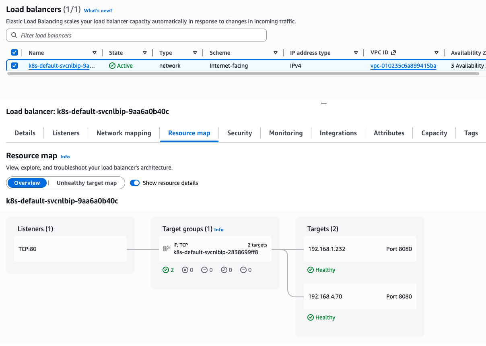

Note that two IP addresses on Targets are pod IP because we are using IP target mode(`service.beta.kubernetes.io/aws-load-balancer-nlb-target-type: ip`)


```bash
kubectl get targetgroupbindings
NAME                              SERVICE-NAME      SERVICE-PORT   TARGET-TYPE   AGE
k8s-default-svcnlbip-2838699ff8   svc-nlb-ip-type   80             ip            33m
```
`targetgroupbindings` indicates the `svc-nlb-ip-type` NLB sends **traffic directly to the Pod IPs**(TARGET-TYPE is ip).


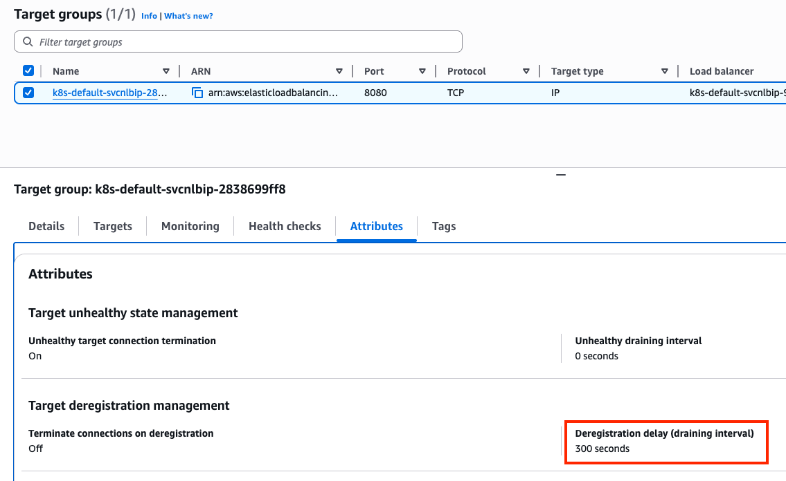

In a Network Load Balancer, the **Deregistration Delay** (also known as the draining interval) is the amount of time the balancer waits before it fully removes a target that has been marked as unhealthy or is being terminated. The default 300s is much longer than most Pods need to shut down. This can make your CI/CD pipelines feel "stuck" for 5 minutes during a rolling update as the old Pods wait to be fully removed from the NLB.

Let's change the default value. Add the following annotation to `svc-nlb-ip-type` Service in `echo-service-nlb.yaml` file:
```bash
service.beta.kubernetes.io/aws-load-balancer-target-group-attributes: deregistration_delay.timeout_seconds=60

kubectl apply -f echo-service-nlb.yaml
```
Check NLB:
```bash
aws elbv2 describe-load-balancers | jq
aws elbv2 describe-load-balancers --query 'LoadBalancers[*].State.Code' --output text
ALB_ARN=$(aws elbv2 describe-load-balancers --query 'LoadBalancers[?contains(LoadBalancerName, `k8s-default-svcnlbip`) == `true`].LoadBalancerArn' | jq -r '.[0]')
aws elbv2 describe-target-groups --load-balancer-arn $ALB_ARN | jq
TARGET_GROUP_ARN=$(aws elbv2 describe-target-groups --load-balancer-arn $ALB_ARN | jq -r '.TargetGroups[0].TargetGroupArn')
aws elbv2 describe-target-health --target-group-arn $TARGET_GROUP_ARN | jq
```

Check load balancing:
```bash
NLB=$(kubectl get svc svc-nlb-ip-type -o jsonpath='{.status.loadBalancer.ingress[0].hostname}')
curl -s $NLB
for i in {1..100}; do curl -s $NLB | grep Hostname ; done | sort | uniq -c | sort -nr
  55 Hostname: deploy-echo-7549f6d6d8-8bxkk
  45 Hostname: deploy-echo-7549f6d6d8-s89mv
```

Delete resources:
```bash
kubectl delete deploy deploy-echo; kubectl delete svc svc-nlb-ip-type
```

## 3. Ingress (L7: HTTP)
`Ingress` works as a **web proxy**, exposing cluster-internal services(`ClusterIP`, `NodePort`, `LoadBalancer`) to the internet.

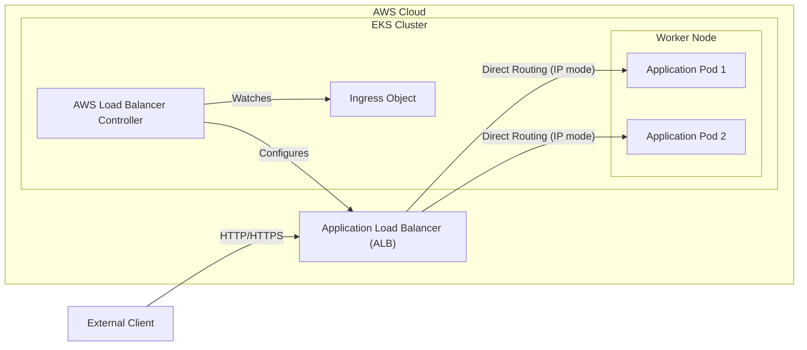

Deploy test service with Ingress(ALB):
```bash
cat <<EOF | kubectl apply -f -
apiVersion: v1
kind: Namespace
metadata:
  name: game-2048
---
apiVersion: apps/v1
kind: Deployment
metadata:
  namespace: game-2048
  name: deployment-2048
spec:
  selector:
    matchLabels:
      app.kubernetes.io/name: app-2048
  replicas: 2
  template:
    metadata:
      labels:
        app.kubernetes.io/name: app-2048
    spec:
      containers:
      - image: public.ecr.aws/l6m2t8p7/docker-2048:latest
        imagePullPolicy: Always
        name: app-2048
        ports:
        - containerPort: 80
---
apiVersion: v1
kind: Service
metadata:
  namespace: game-2048
  name: service-2048
spec:
  ports:
    - port: 80
      targetPort: 80
      protocol: TCP
  type: NodePort
  selector:
    app.kubernetes.io/name: app-2048
---
apiVersion: networking.k8s.io/v1
kind: Ingress
metadata:
  namespace: game-2048
  name: ingress-2048
  annotations:
    alb.ingress.kubernetes.io/scheme: internet-facing
    alb.ingress.kubernetes.io/target-type: ip
spec:
  ingressClassName: alb
  rules:
    - http:
        paths:
        - path: /
          pathType: Prefix
          backend:
            service:
              name: service-2048
              port:
                number: 80
EOF
```

Confirm the deployment:
```bash
kubectl get ingressclass
kubectl get ingress,svc,ep,pod -n game-2048
NAME                                     CLASS   HOSTS   ADDRESS                                                                   PORTS   AGE
ingress.networking.k8s.io/ingress-2048   alb     *       k8s-game2048-ingress2-70d50ce3fd-1193426033.us-east-1.elb.amazonaws.com   80      6m52s

NAME                   TYPE       CLUSTER-IP       EXTERNAL-IP   PORT(S)        AGE
service/service-2048   NodePort   10.100.138.110   <none>        80:31437/TCP   6m52s

NAME                     ENDPOINTS                         AGE
endpoints/service-2048   192.168.2.64:80,192.168.4.70:80   6m52s

NAME                                   READY   STATUS    RESTARTS   AGE
pod/deployment-2048-7bf64bccb7-8pw25   1/1     Running   0          6m52s
pod/deployment-2048-7bf64bccb7-tbpbg   1/1     Running   0          6m52s
```
From `Ingress` object, we learn that `game-2048` service is able to access with `k8s-game2048-ingress2-70d50ce3fd-1193426033.us-east-1.elb.amazonaws.com` hostname and port `80`. 

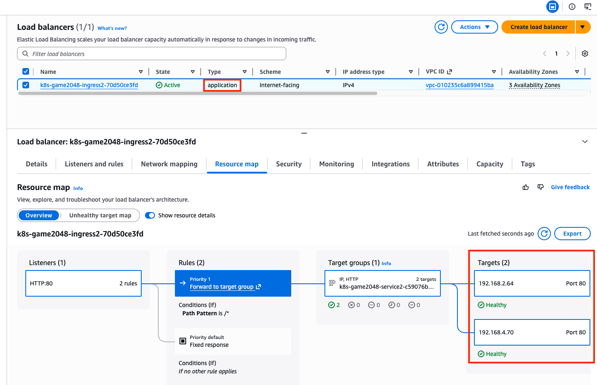

A new load balancer has appeared in the Load Balancers page in the AWS console, with `application` type, listening on port 80. The incoming requests are forwarded to one of the `game-2048` pods directly, due to `alb.ingress.kubernetes.io/target-type: ip` annotation dangling in the `Ingress` object.

```bash
kubectl describe ingress -n game-2048 ingress-2048
Name:             ingress-2048
Labels:           <none>
Namespace:        game-2048
Address:          k8s-game2048-ingress2-70d50ce3fd-1193426033.us-east-1.elb.amazonaws.com
Ingress Class:    alb
Default backend:  <default>
Rules:
  Host        Path  Backends
  ----        ----  --------
  *           
              /   service-2048:80 (192.168.4.70:80,192.168.2.64:80)
Annotations:  alb.ingress.kubernetes.io/scheme: internet-facing
              alb.ingress.kubernetes.io/target-type: ip
Events:
  Type    Reason                  Age   From     Message
  ----    ------                  ----  ----     -------
  Normal  SuccessfullyReconciled  24m   ingress  Successfully reconciled
```

Confirm the access to `game-2048` service with `http://k8s-game2048-ingress2-70d50ce3fd-1193426033.us-east-1.elb.amazonaws.com/` on your web browser.
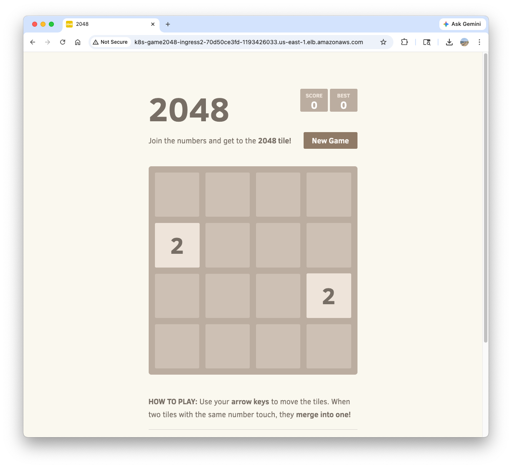


Delete resources:
```bash
kubectl delete ingress ingress-2048 -n game-2048
kubectl delete svc service-2048 -n game-2048 && kubectl delete deploy deployment-2048 -n game-2048 && kubectl delete ns game-2048
```

## 4. ExternalDNS
Managing DNS records manually whenever a new `Service` or `Ingress` is created is error-prone and inefficient. **ExternalDNS** automates this process by watching Kubernetes resources (`Services` and `Ingresses`) and automatically synchronizing their hostnames with external DNS providers like **AWS Route 53**. It allows you to control DNS records dynamically via Kubernetes annotations, making your infrastructure more agile and self-healing.

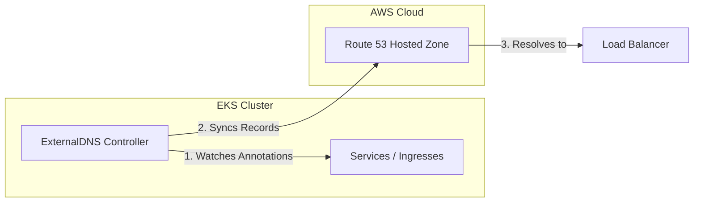

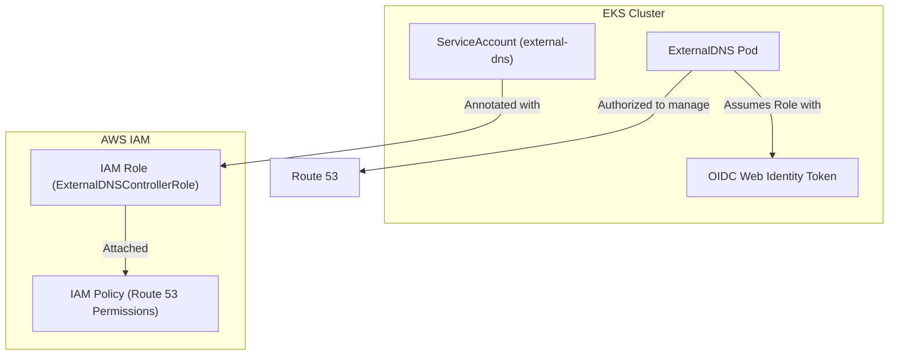

### 4.1. Deploy ExternalDNS controller
Create a policy file:
```bash
cat << EOF > externaldns_controller_policy.json
{
  "Version": "2012-10-17",
  "Statement": [
    {
      "Effect": "Allow",
      "Action": [
        "route53:ChangeResourceRecordSets",
        "route53:ListResourceRecordSets",
        "route53:ListTagsForResources"
      ],
      "Resource": [
        "arn:aws:route53:::hostedzone/*"
      ]
    },
    {
      "Effect": "Allow",
      "Action": [
        "route53:ListHostedZones"
      ],
      "Resource": [
        "*"
      ]
    }
  ]
}
EOF
```

Create the policy in AWS IAM:
```bash
aws iam create-policy \
  --policy-name ExternalDNSControllerPolicy \
  --policy-document file://externaldns_controller_policy.json
```

Confirm:
```bash
ACCOUNT_ID=$(aws sts get-caller-identity --query "Account" --output text)
aws iam get-policy --policy-arn arn:aws:iam::$ACCOUNT_ID:policy/ExternalDNSControllerPolicy | jq
```

Create IAM Role for ServiceAccount(IRSA) using cloud formation:
```bash
CLUSTER_NAME=myeks

eksctl create iamserviceaccount \
  --cluster=$CLUSTER_NAME \
  --namespace=kube-system \
  --name=external-dns \
  --attach-policy-arn=arn:aws:iam::$ACCOUNT_ID:policy/ExternalDNSControllerPolicy \
  --override-existing-serviceaccounts \
  --approve
```

Confirm the creation:
```bash
eksctl get iamserviceaccount --cluster $CLUSTER_NAME
NAMESPACE       NAME                            ROLE ARN
kube-system     aws-load-balancer-controller    arn:aws:iam::911283464785:role/eksctl-myeks-addon-iamserviceaccount-kube-sys-Role1-2REDIfJ9sfGa
kube-system     external-dns                    arn:aws:iam::911283464785:role/eksctl-myeks-addon-iamserviceaccount-kube-sys-Role1-F76qLAoueSgl

kubectl get serviceaccounts -n kube-system external-dns -o yaml
```

Create `external-dns-values.yaml` file that contains required values for `ExternalDNS`:
```bash
MyDomain={mydomain.com}

cat << EOF > external-dns-values.yaml
provider: aws

# use the ServiceAccount generated above
serviceAccount:
  create: false
  name: external-dns

# recommend for security
# allow to control the specified domain only (e.g. example.com)
domainFilters:
  - $MyDomain

# Record update policy
# sync: if deleted in k8s, the record is deleted in Route 53 too.
# upsert-only: create/modify is synced, but delete is not.
policy: sync

# target resources to watch
sources:
  - service
  - ingress

# (optional) add identifier in TXT record
txtOwnerId: "stduy-myeks-cluster"

registry: txt

logLevel: info
EOF
```

Helm repo add and update:
```bash
helm repo add external-dns https://kubernetes-sigs.github.io/external-dns/
helm repo update
```

Helm install:
```bash
helm install external-dns external-dns/external-dns \
  -n kube-system \
  -f external-dns-values.yaml
```

Confirm the creation:
```bash
helm list -n kube-system
kubectl get pod -l app.kubernetes.io/name=external-dns -n kube-system
```

### 4.2. Deploy a test service:

Set up monitoring in a separate terminal:
```bash
watch -d 'kubectl get pod,svc'
kubectl logs deploy/external-dns -n kube-system -f
```

Deploy `tetris` app:
```bash
cat <<EOF | kubectl apply -f -
apiVersion: apps/v1
kind: Deployment
metadata:
  name: tetris
  labels:
    app: tetris
spec:
  replicas: 1
  selector:
    matchLabels:
      app: tetris
  template:
    metadata:
      labels:
        app: tetris
    spec:
      containers:
      - name: tetris
        image: bsord/tetris
---
apiVersion: v1
kind: Service
metadata:
  name: tetris
  annotations:
    service.beta.kubernetes.io/aws-load-balancer-nlb-target-type: ip
    service.beta.kubernetes.io/aws-load-balancer-scheme: internet-facing
    service.beta.kubernetes.io/aws-load-balancer-cross-zone-load-balancing-enabled: "true"
    service.beta.kubernetes.io/aws-load-balancer-backend-protocol: "http"
    #service.beta.kubernetes.io/aws-load-balancer-healthcheck-port: "80"
spec:
  selector:
    app: tetris
  ports:
  - port: 80
    protocol: TCP
    targetPort: 80
  type: LoadBalancer
EOF
```

Confirm the deployment:
```bash
kubectl get deploy,svc,ep tetris
```

Add annotation to `tetris` Service to attach a DNS record(hostname):
```bash
kubectl annotate service tetris "external-dns.alpha.kubernetes.io/hostname=tetris.$MyDomain"
while true; do aws route53 list-resource-record-sets --hosted-zone-id "${MyDnzHostedZoneId}" --query "ResourceRecordSets[?Type == 'A']" | jq ; date ; echo ; sleep 1; done
```

Check `A record` is generated in Route 53:
```bash
aws route53 list-resource-record-sets --hosted-zone-id "${MyDnzHostedZoneId}" --query "ResourceRecordSets[?Type == 'A']" | jq
```

Confirm the access:
```bash
dig +short tetris.$MyDomain @8.8.8.8
dig +short tetris.$MyDomain

echo -e "My Domain Checker Site1 = https://www.whatsmydns.net/#A/tetris.$MyDomain"
echo -e "My Domain Checker Site2 = https://dnschecker.org/#A/tetris.$MyDomain"

echo -e "Tetris Game URL = http://tetris.$MyDomain"
```

Remove resources. Note that `A record` is also deleted by `ExternalDNS` controller.
```bash
kubectl delete deploy,svc tetris
```

## 5. Gateway API
The **Gateway API** is the next-generation of Kubernetes ingress and service networking. It provides a more expressive, extensible, and role-oriented set of APIs (`GatewayClass`, `Gateway`, and `HTTPRoute`) compared to the standard Ingress resource. In EKS, the AWS Load Balancer Controller supports the Gateway API to provision ALBs and NLBs with advanced routing capabilities.

### 5.1. Install supporting resources to use Gateway API
Make sure AWS LBC version is higher than v2.13.0:
```bash
kubectl describe pod -n kube-system -l app.kubernetes.io/name=aws-load-balancer-controller | grep Image: | uniq
    Image:         public.ecr.aws/eks/aws-load-balancer-controller:v3.1.0
```

Install Gateway API CRDs:
```bash
kubectl apply -f https://github.com/kubernetes-sigs/gateway-api/releases/download/v1.3.0/standard-install.yaml     # [REQUIRED] # Standard Gateway API CRDs
kubectl apply -f https://github.com/kubernetes-sigs/gateway-api/releases/download/v1.3.0/experimental-install.yaml # [OPTIONAL: Used for L4 Routes] # Experimental Gateway API CRDs
```

Confirm the CRDs are installed:
```bash
kubectl get crd  | grep gateway.networking
backendtlspolicies.gateway.networking.k8s.io          2026-03-29T20:35:25Z
gatewayclasses.gateway.networking.k8s.io              2026-03-29T20:34:59Z
gateways.gateway.networking.k8s.io                    2026-03-29T20:34:59Z
grpcroutes.gateway.networking.k8s.io                  2026-03-29T20:34:59Z
httproutes.gateway.networking.k8s.io                  2026-03-29T20:35:00Z
referencegrants.gateway.networking.k8s.io             2026-03-29T20:35:01Z
tcproutes.gateway.networking.k8s.io                   2026-03-29T20:35:26Z
tlsroutes.gateway.networking.k8s.io                   2026-03-29T20:35:27Z
udproutes.gateway.networking.k8s.io                   2026-03-29T20:35:27Z
xbackendtrafficpolicies.gateway.networking.x-k8s.io   2026-03-29T20:35:27Z
xlistenersets.gateway.networking.x-k8s.io             2026-03-29T20:35:27Z

kubectl api-resources | grep gateway.networking
backendtlspolicies                  btlspolicy        gateway.networking.k8s.io/v1alpha3     true         BackendTLSPolicy
gatewayclasses                      gc                gateway.networking.k8s.io/v1           false        GatewayClass
gateways                            gtw               gateway.networking.k8s.io/v1           true         Gateway
grpcroutes                                            gateway.networking.k8s.io/v1           true         GRPCRoute
httproutes                                            gateway.networking.k8s.io/v1           true         HTTPRoute
referencegrants                     refgrant          gateway.networking.k8s.io/v1beta1      true         ReferenceGrant
tcproutes                                             gateway.networking.k8s.io/v1alpha2     true         TCPRoute
tlsroutes                                             gateway.networking.k8s.io/v1alpha2     true         TLSRoute
udproutes                                             gateway.networking.k8s.io/v1alpha2     true         UDPRoute
xbackendtrafficpolicies             xbtrafficpolicy   gateway.networking.x-k8s.io/v1alpha1   true         XBackendTrafficPolicy
xlistenersets                       lset              gateway.networking.x-k8s.io/v1alpha1   true         XListenerSet

kubectl explain gatewayclasses.gateway.networking.k8s.io.spec
kubectl explain gateways.gateway.networking.k8s.io.spec
kubectl explain httproutes.gateway.networking.k8s.io.spec
```

Install LBC Gateway API specific CRDs:
```bash
kubectl apply -f https://raw.githubusercontent.com/kubernetes-sigs/aws-load-balancer-controller/refs/heads/main/config/crd/gateway/gateway-crds.yaml
```

Confirm: 
```bash
kubectl get crd | grep gateway.k8s.aws
listenerruleconfigurations.gateway.k8s.aws            2026-03-29T03:57:55Z
loadbalancerconfigurations.gateway.k8s.aws            2026-03-29T03:57:55Z
targetgroupconfigurations.gateway.k8s.aws             2026-03-29T03:57:55Z

kubectl api-resources | grep gateway.k8s.aws
listenerruleconfigurations                            gateway.k8s.aws/v1beta1                true         ListenerRuleConfiguration
loadbalancerconfigurations                            gateway.k8s.aws/v1beta1                true         LoadBalancerConfiguration
targetgroupconfigurations                             gateway.k8s.aws/v1beta1                true         TargetGroupConfiguration

kubectl explain loadbalancerconfigurations.gateway.k8s.aws.spec
kubectl explain listenerruleconfigurations.gateway.k8s.aws.spec
kubectl explain targetgroupconfigurations.gateway.k8s.aws.spec
```

The current `aws-load-balancer-controller` is not configured to use Gateway API(required args are not set):
```bash
helm list -n kube-system 
helm get values -n kube-system aws-load-balancer-controller
kubectl describe deploy -n kube-system aws-load-balancer-controller | grep Args: -A2
    Args:
      --cluster-name=myeks
      --ingress-class=alb
```

Set monitoring:
```bash
kubectl get pod -n kube-system -l app.kubernetes.io/name=aws-load-balancer-controller --watch
```

Add a feature flag to enable Gateway API:
```bash
kubectl edit deploy -n kube-system aws-load-balancer-controller
...
      - args:
        - --cluster-name=myeks
        - --ingress-class=alb
        - --feature-gates=NLBGatewayAPI=true,ALBGatewayAPI=true ##### add
...
```

Confirm:
```bash
kubectl describe deploy -n kube-system aws-load-balancer-controller | grep Args: -A3
    Args:
      --cluster-name=myeks
      --ingress-class=alb
      --feature-gates=NLBGatewayAPI=true,ALBGatewayAPI=true
```

Add additional resources to watch in `external-dns-values.yaml` file:
```bash
--------------------------
sources:
  - service
  - ingress
  - gateway-httproute
  - gateway-grpcroute
  - gateway-tlsroute
  - gateway-tcproute
  - gateway-udproute
--------------------------
```

Update `external-dns` controller:
```bash
# ExternalDNS 에 gateway api 지원 설정
helm upgrade -i external-dns external-dns/external-dns -n kube-system -f external-dns-values.yaml
```

Confirm:
```bash
kubectl describe deploy -n kube-system external-dns | grep Args: -A15
    Args:
      --log-level=info
      --log-format=text
      --interval=1m
      --source=service
      --source=ingress
      --source=gateway-httproute
      --source=gateway-grpcroute
      --source=gateway-tlsroute
      --source=gateway-tcproute
      --source=gateway-udproute
      --policy=sync
      --registry=txt
      --txt-owner-id=stduy-myeks-cluster
      --domain-filter=gasida.link
      --provider=aws
```

### 4.2. Deploy a sample service

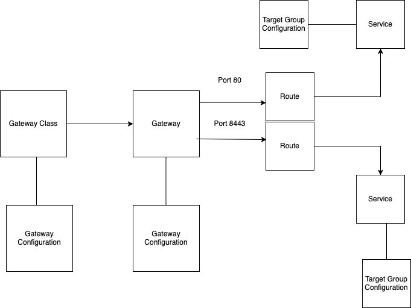

> Please refer to [How customizations works](https://kubernetes-sigs.github.io/aws-load-balancer-controller/latest/guide/gateway/customization/) page in the AWS Load Balancer Controller official doc.

Create `LoadBalancerConfiguration`:
```bash
kubectl explain loadbalancerconfigurations.gateway.k8s.aws.spec
...
  scheme        <string>
  enum: internal, internet-facing
    scheme defines the type of LB to provision. If unspecified, it will be
    automatically inferred.
...

cat << EOF | kubectl apply -f -
apiVersion: gateway.k8s.aws/v1beta1
kind: LoadBalancerConfiguration
metadata:
  name: lbc-config
  namespace: default
spec:
  scheme: internet-facing
EOF
```

Confirm:
```bash
kubectl get loadbalancerconfiguration -owide
NAME         AGE
lbc-config   8s
```

Deploy `GatewayClass`:
```bash
kubectl explain gatewayclasses.spec
kubectl explain gatewayclasses.spec.parametersRef
cat << EOF | kubectl apply -f -
apiVersion: gateway.networking.k8s.io/v1
kind: GatewayClass
metadata:
  name: aws-alb
spec:
  controllerName: gateway.k8s.aws/alb
  parametersRef:
    group: gateway.k8s.aws
    kind: LoadBalancerConfiguration
    name: lbc-config
    namespace: default
EOF

# confirm
kubectl get gatewayclasses -o wide  # k get gc
NAME      CONTROLLER            ACCEPTED   AGE   DESCRIPTION
aws-alb   gateway.k8s.aws/alb   True       63s
```

Deploy `Gateway`:
```bash
kubectl explain gateways.spec
cat << EOF | kubectl apply -f -
apiVersion: gateway.networking.k8s.io/v1
kind: Gateway
metadata:
  name: alb-http
spec:
  gatewayClassName: aws-alb
  listeners:
  - name: http
    protocol: HTTP
    port: 80
EOF

# confirm gateways
kubectl get gateways
NAME       CLASS     ADDRESS                                                                     PROGRAMMED   AGE
alb-http   aws-alb   k8s-default-albhttp-8d7d6da11f-126923743.ap-northeast-2.elb.amazonaws.com   Unknown      24s

# confirm ALB is created
aws elbv2 describe-load-balancers | jq 
aws elbv2 describe-target-groups

# log monitoring
kubectl logs -l app.kubernetes.io/name=aws-load-balancer-controller -n kube-system -f
kubectl stern -l app.kubernetes.io/name=aws-load-balancer-controller -n kube-system
```

Deploy the sample app:
```bash
cat <<EOF | kubectl apply -f -
apiVersion: apps/v1
kind: Deployment
metadata:
  name: deployment-2048
spec:
  selector:
    matchLabels:
      app.kubernetes.io/name: app-2048
  replicas: 2
  template:
    metadata:
      labels:
        app.kubernetes.io/name: app-2048
    spec:
      containers:
      - image: public.ecr.aws/l6m2t8p7/docker-2048:latest
        imagePullPolicy: Always
        name: app-2048
        ports:
        - containerPort: 80
---
apiVersion: v1
kind: Service
metadata:
  name: service-2048
spec:
  ports:
    - port: 80
      targetPort: 80
      protocol: TCP
  type: ClusterIP
  selector:
    app.kubernetes.io/name: app-2048
EOF

# confirm
kubectl get svc,ep,pod
```

Create `HTTPRoute`:
```bash
GWMYDOMAIN={gwapi.mydomain.com}

# httproute 생성
kubectl explain httproutes.spec
kubectl explain httproutes.spec.parentRefs
kubectl explain httproutes.spec.hostnames
kubectl explain httproutes.spec.rules

cat << EOF | kubectl apply -f -
apiVersion: gateway.networking.k8s.io/v1
kind: HTTPRoute
metadata:
  name: alb-http-route
spec:
  parentRefs:
  - group: gateway.networking.k8s.io
    kind: Gateway
    name: alb-http
    sectionName: http
  hostnames:
  - $GWMYDOMAIN
  rules:
  - backendRefs:
    - name: service-2048
      port: 80
EOF

# confirm
kubectl get httproute       

# ALB
aws elbv2 describe-load-balancers | jq 
aws elbv2 describe-target-groups | jq

# log
kubectl logs -l app.kubernetes.io/name=aws-load-balancer-controller -n kube-system -f
kubectl stern -l app.kubernetes.io/name=aws-load-balancer-controller -n kube-system
```

Access test:
```bash
dig +short $GWMYDOMAIN @8.8.8.8
dig +short $GWMYDOMAIN

# domain check
echo -e "My Domain Checker Site1 = https://www.whatsmydns.net/#A/$GWMYDOMAIN"
echo -e "My Domain Checker Site2 = https://dnschecker.org/#A/$GWMYDOMAIN"

echo -e "GW Api Sample URL = http://$GWMYDOMAIN"
```

Remove resources:
```bash
kubectl delete httproute,targetgroupconfigurations,Gateway,GatewayClass --all
```

## 5. Clean Up Deployed Resources

Remove IRSA:
```bash
CLUSTER_NAME=myeks
eksctl delete iamserviceaccount --cluster=$CLUSTER_NAME --namespace=kube-system --name=external-dns
eksctl delete iamserviceaccount --cluster=$CLUSTER_NAME --namespace=kube-system --name=aws-load-balancer-controller

# confirm
eksctl get iamserviceaccount --cluster $CLUSTER_NAME
```

Remove AWS infra deployed by terraform:
```bash
terraform destroy -auto-approve && rm -rf ~/.kube/config
```

