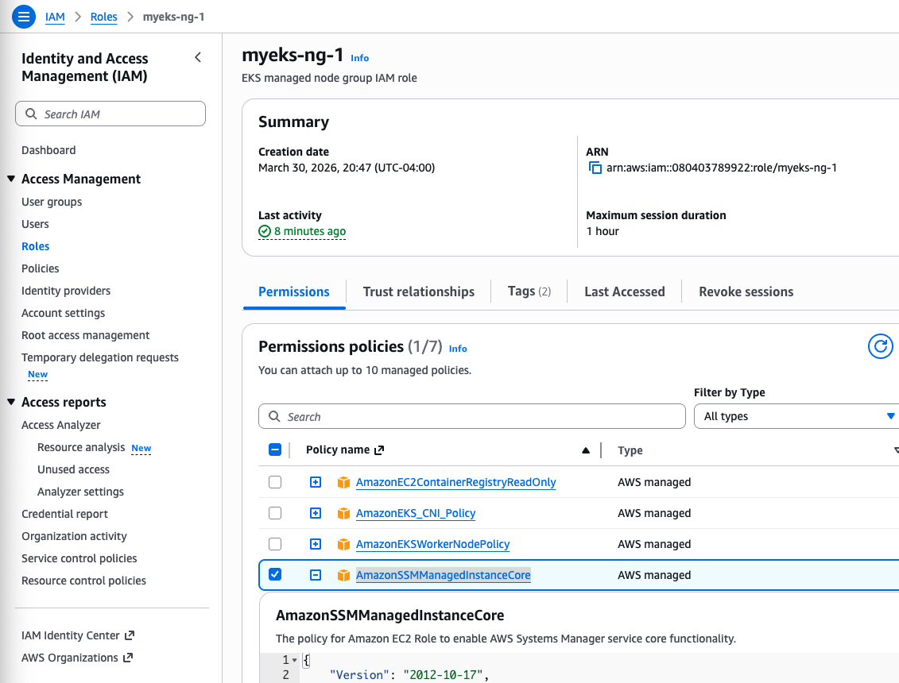
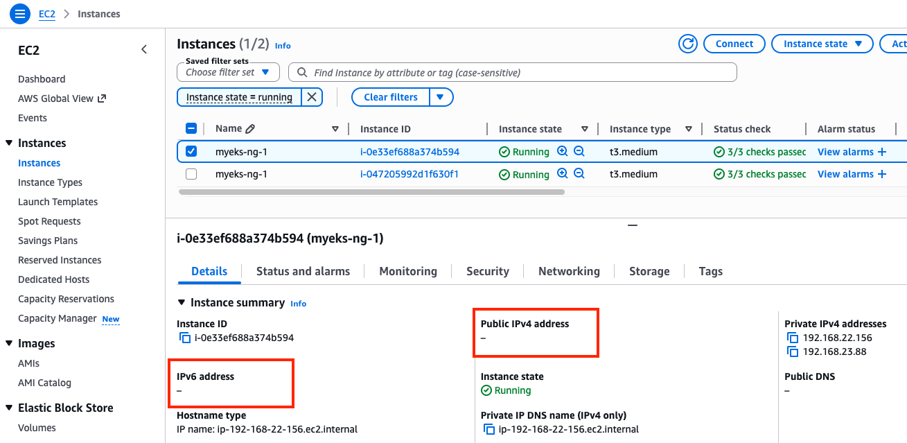
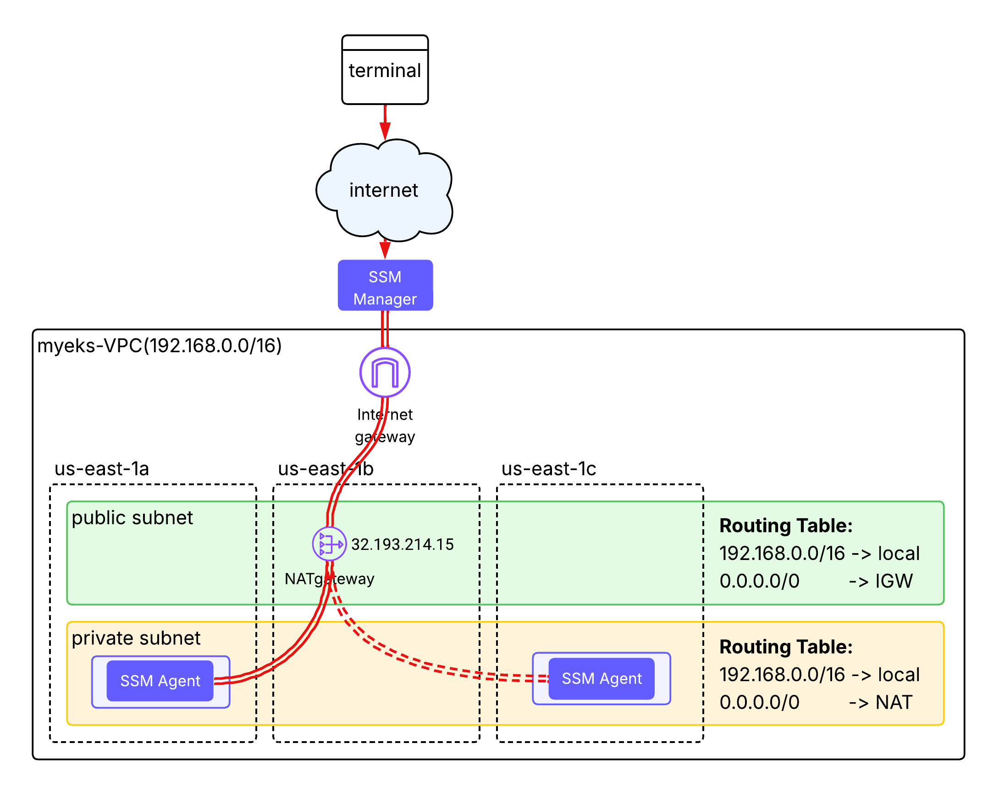
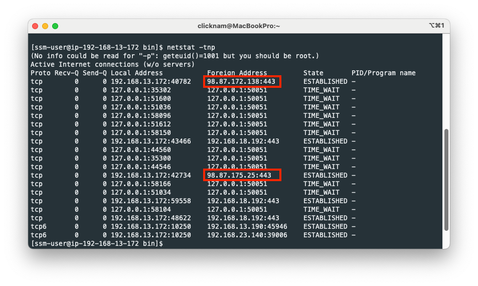
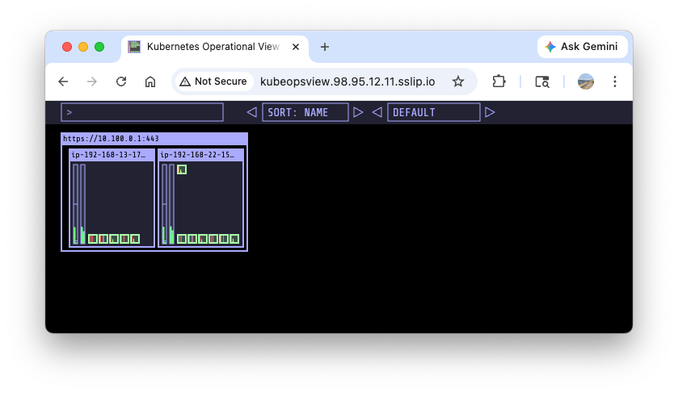
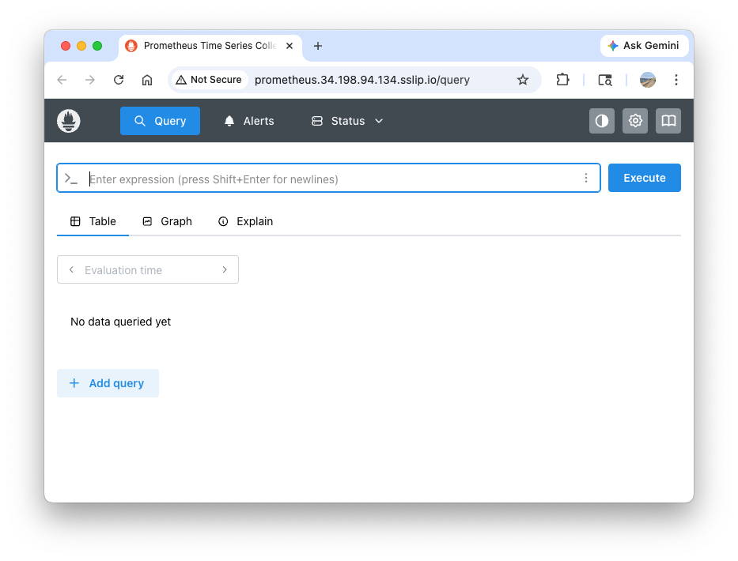
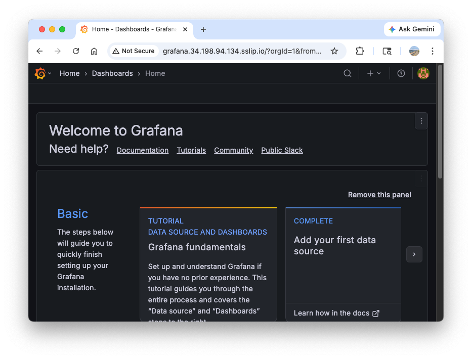
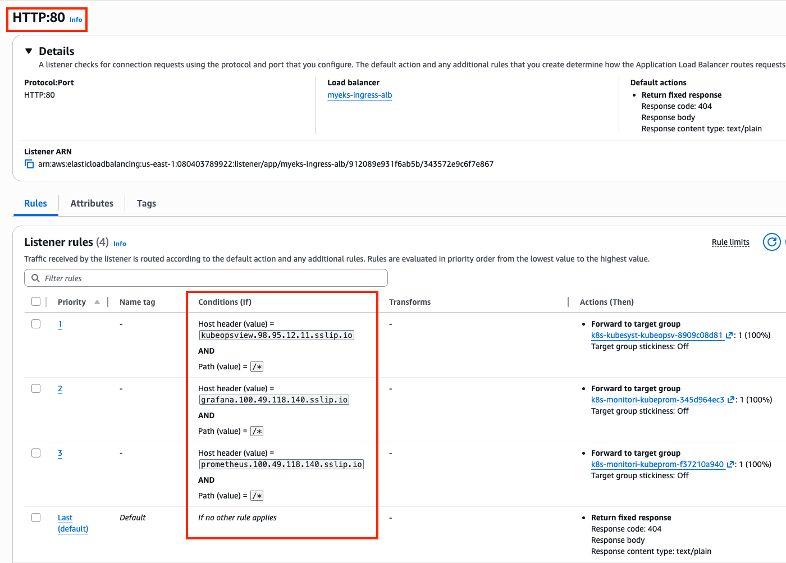
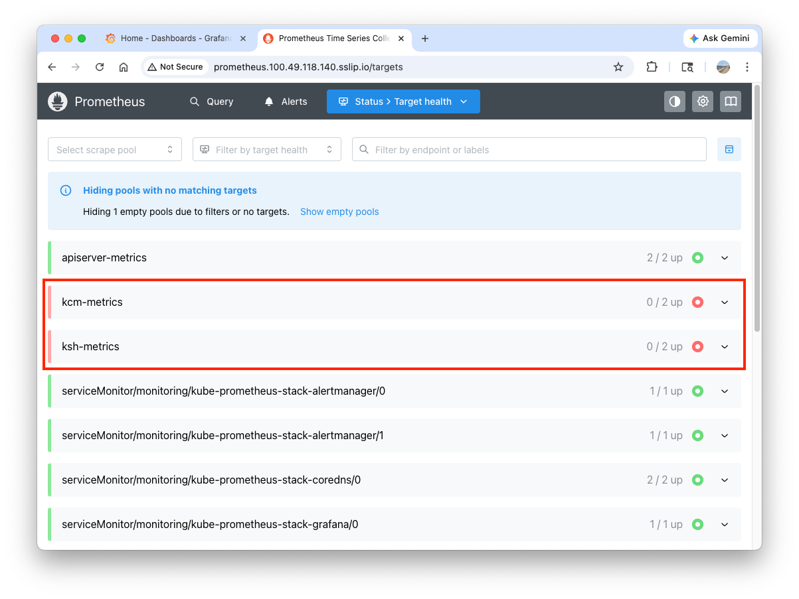
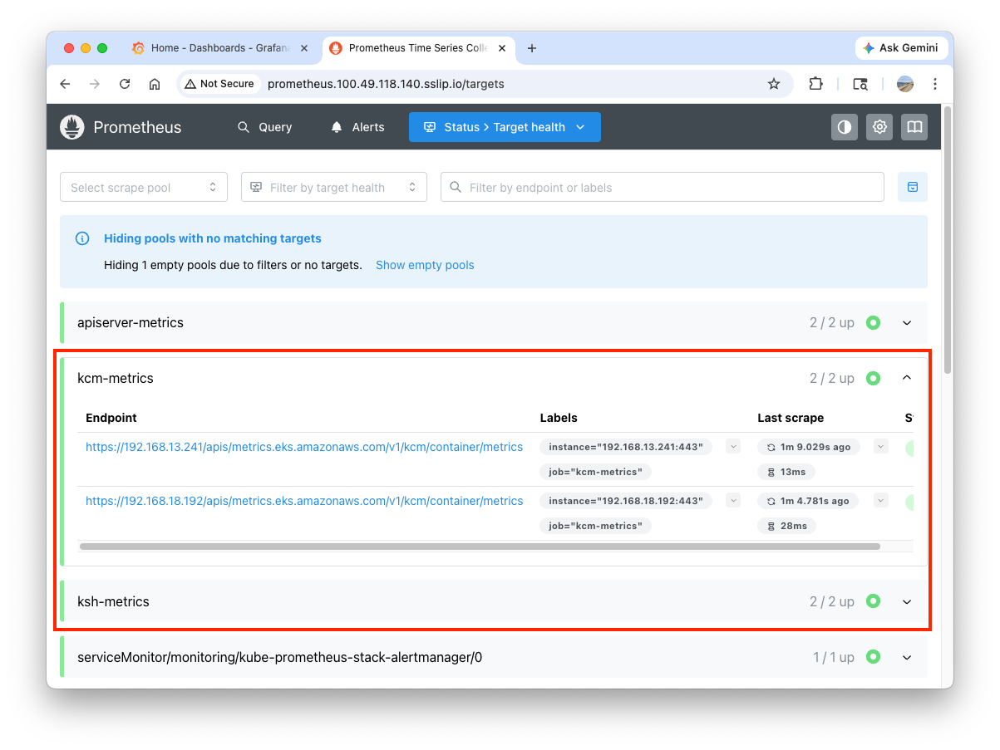

# Lab 1: SSM, ALB, Prometheus, Grafana

## 1. Cluster Provisioning

``` bash title="Clone the aews repo and move to 3w directory"
git clone https://github.com/gasida/aews.git
cd aews/3w
```

??? note "What's changed compared to w2"

    - EKS version upgraded to [v1.35](https://github.com/gasida/aews/blob/main/3w/var.tf#L23) to support in-place pod resource(CPU/memory) upgrades.
    - Add [additional IAM roles](https://github.com/gasida/aews/blob/main/3w/eks.tf#L113-L118) to EC2 instance profile to allow SSM Session Manager to access EC2 instances.
    - Add [metrics-server, external-dns](https://github.com/gasida/aews/blob/main/3w/eks.tf#L286-L297) to addons

!!! warning
    Modify [TargetRegion](https://github.com/gasida/aews/blob/main/3w/var.tf#L47) and [availability_zones](https://github.com/gasida/aews/blob/main/3w/var.tf#L53) in `var.tf` to wherever you want to deploy.

``` bash title="Download lb controller IAM policy file"
curl -o aws_lb_controller_policy.json https://raw.githubusercontent.com/kubernetes-sigs/aws-load-balancer-controller/refs/heads/main/docs/install/iam_policy.json
```

``` bash title="Create external-dns controller IAM policy"
cat << EOF > externaldns_controller_policy.json
{
  "Version": "2012-10-17",
  "Statement": [
    {
      "Effect": "Allow",
      "Action": [
        "route53:ChangeResourceRecordSets",
        "route53:ListResourceRecordSets",
        "route53:ListTagsForResources"
      ],
      "Resource": [
        "arn:aws:route53:::hostedzone/*"
      ]
    },
    {
      "Effect": "Allow",
      "Action": [
        "route53:ListHostedZones"
      ],
      "Resource": [
        "*"
      ]
    }
  ]
}
EOF
```

``` bash title="Create auto-scaling controller IAM policy"
cat << EOF > cas_autoscaling_policy.json
{
  "Version": "2012-10-17",
  "Statement": [
    {
      "Effect": "Allow",
      "Action": [
        "autoscaling:DescribeAutoScalingGroups",
        "autoscaling:DescribeAutoScalingInstances",
        "autoscaling:DescribeLaunchConfigurations",
        "autoscaling:DescribeScalingActivities",
        "ec2:DescribeImages",
        "ec2:DescribeInstanceTypes",
        "ec2:DescribeLaunchTemplateVersions",
        "ec2:GetInstanceTypesFromInstanceRequirements",
        "eks:DescribeNodegroup"
      ],
      "Resource": ["*"]
    },
    {
      "Effect": "Allow",
      "Action": [
        "autoscaling:SetDesiredCapacity",
        "autoscaling:TerminateInstanceInAutoScalingGroup"
      ],
      "Resource": ["*"]
    }
  ]
}
EOF
```

``` bash title="Confirm three IAM policies"
ls *.json
aws_lb_controller_policy.json      cas_autoscaling_policy.json        externaldns_controller_policy.json
```

These policy files are supplied into [`aws_iam_policy` resources](https://github.com/gasida/aews/blob/main/3w/eks.tf#L42-L60)


``` bash title="Deploy EKS cluster resources via terraform"
terraform init
terraform plan
nohup sh -c "terraform apply -auto-approve" > create.log 2>&1 &
tail -f create.log
```

It will take about 12 minutes to provision the entire cluster resources. After the deployment is done, check the state of key resources.

``` bash title="Check the terraform state"
cat terraform.tfstate
terraform show
terraform state list
```

Update myeks cluster with the new context.
``` bash title="Add a new context to ~/.kube/config and update myeks cluster with the new context"
$(terraform output -raw configure_kubectl)
kubectl config rename-context $(cat ~/.kube/config | grep current-context | awk '{print $2}') myeks
# Context "arn:aws:eks:us-east-1:080403789922:cluster/myeks" renamed to "myeks".
```

``` bash title="check the eks version"
kubectl get node -o wide
```

## 2. Access Instance with SSM

In addition to `ssh`, Session Manager(SSM) provides a way to access the instance cli.

``` bash title="Look up the instance list managed by SSM"
aws ssm describe-instance-information \
  --query "InstanceInformationList[*].{InstanceId:InstanceId, Status:PingStatus, OS:PlatformName}" \
  --output text # table

i-047205992d1f630f1     Amazon Linux    Online
i-0e33ef688a374b594     Amazon Linux    Online
```

``` bash title="Install session-manager-plugin"
# https://docs.aws.amazon.com/ko_kr/systems-manager/latest/userguide/install-plugin-macos-overview.html
brew install --cask session-manager-plugin # macOS - Disable date: 2026-09-01
```

``` bash title="Access to the instance cli"
aws ssm start-session --target i-047205992d1f630f1

Starting session with SessionId: admin-h32jgdpoznvu4n9d7lktisl3ie
sh-5.2$ bash
[ssm-user@ip-192-168-13-172 bin]$
```

??? info "What enables to access the instance using sesson manager?"

    `AmazonSSMManagedInstanceCore` policy is added to EKS managed node group IAM role.
    

??? info "How could my terminal access the instance with no public IP?"

    
    Public IP is not attached to each instance. Then how can the external traffic reach to the instance? 

    
    
    When the SSM Agent starts up on your EC2 instance (usually at boot), it immediately initiates an **outbound HTTPS (TLS) connection** to the Systems Manager service endpoints in the AWS Cloud. It uses a technology similar to WebSockets or Long Polling. When you start a session via the console or CLI, here's what happens:

    1. AWS Console/CLI sends a request to the Session Manager service.
    2. Session Manager looks at its list of active tunnels and finds the one belonging to your instance.
    3. It sends a **Start Session** signal down that existing outbound tunnel.
    4. SSM Agent receives the signal, spawns a local shell process (like `/bin/bash`), and begins streaming the input/output of that shell back through the same tunnel.

    

    **Why does this matter?**

    * No Inbound Rules: Because the agent initiates the connection, your Security Group can have zero inbound rules and still work perfectly.
    * Private Subnets: This is why SSM works for instances in private subnets (provided they have a route to the internet via NAT Gateway or [VPC Endpoints](https://docs.aws.amazon.com/systems-manager/latest/userguide/setup-create-vpc-endpoints.html)).
    * Identity-Based: The connection is only allowed if the Instance's IAM Role has the `AmazonSSMManagedInstanceCore` policy, which gives the agent permission to check-in with the AWS service.


## 3. Confirm Addons

``` bash title="List up installed addons"
aws eks list-addons --cluster-name myeks | jq
{
  "addons": [
    "coredns",
    "external-dns",
    "kube-proxy",
    "metrics-server",
    "vpc-cni"
  ]
}
```

``` bash title="Check metrics-server"
kubectl get deploy -n kube-system metrics-server
kubectl describe deploy -n kube-system metrics-server
kubectl get pod -n kube-system -l app.kubernetes.io/instance=metrics-server -o wide
kubectl get pdb -n kube-system metrics-server
kubectl get svc,ep -n kube-system metrics-server
```

``` bash title="Check metrics-server api"
kubectl api-resources | grep -i metrics
kubectl explain NodeMetrics
kubectl explain PodMetrics
kubectl api-versions | grep metrics
kubectl get apiservices |egrep '(AVAILABLE|metrics)'
```

``` bash title="Check cpu/mem usage"
kubectl top node
kubectl top pod -A
kubectl top pod -n kube-system --sort-by='cpu'
kubectl top pod -n kube-system --sort-by='memory'
```

``` bash title="Check external-dns"
kubectl get deploy,pod,svc,ep,sa -n external-dns 
kubectl get sa -n external-dns external-dns -o yaml

kubectl describe deploy -n external-dns external-dns
...
    Args:
      --log-level=info
      --log-format=text
      --interval=1m
      --source=service
      --source=ingress
      --policy=upsert-only # record should be manually deleted in route 53
      --registry=txt
      --txt-owner-id=myeks
      --provider=aws
...
```

## 4. Install AWS Load Balancer Controller

``` bash title="Add helm chart repo"
helm repo add eks https://aws.github.io/eks-charts
helm repo update
```

``` bash title="Install AWS LBC using helm chart"
helm install aws-load-balancer-controller eks/aws-load-balancer-controller -n kube-system --version 3.1.0 \
  --set clusterName=myeks \
  --set region=us-east-1
```
??? info "http_put_response_hop_limit = 2 in metadata options"

    **Why is [http_put_response_hop_limit set to 2](https://github.com/gasida/aews/blob/main/3w/eks.tf#L124) in metadata options for eks_managed_node_groups?**

    In EKS, this setting is crucial for **Pods being able to access the EC2 instance metadata**.


    **What it does:**

    The Hop Limit controls how many network hops a packet is allowed to make before it is discarded.

    * `Hop Limit = 1`: The packet can only reach the Host (the EC2 node). It cannot cross any additional network boundaries.
    * `Hop Limit = 2`: The packet can reach the Host AND jump one more step into another network namespace—like a Docker container or a Kubernetes Pod.


    **Why it's necessary:**

    Modern AWS security uses **IMDSv2**, which requires a `PUT` request to get a session token. 

    * Because Kubernetes Pods run in their own network namespace, a request from a Pod to the metadata service (`169.254.169.254`) is seen as 2 hops away. 
    * If you leave it at the default of `1`, your Pods (like the AWS Load Balancer Controller or ExternalDNS) will **fail to get credentials** because their requests will be blocked before reaching the metadata service.

``` bash title="Check deployed resources"
helm list -n kube-system
kubectl get pod -n kube-system -l app.kubernetes.io/name=aws-load-balancer-controller
kubectl logs -n kube-system deployment/aws-load-balancer-controller -f
```

## 5. Install EKS Node Viewer

``` bash title="Macos"
brew tap aws/tap
brew install eks-node-viewer
```

``` bash title=" Windows"
sudo apt install golang-go
go install github.com/awslabs/eks-node-viewer/cmd/eks-node-viewer@latest  # take 2~3 mins
echo 'export PATH="$PATH:/root/go/bin"' >> /etc/profile
```

``` bash title="Download binary directly from github"
wget -O eks-node-viewer https://github.com/awslabs/eks-node-viewer/releases/download/v0.7.4/eks-node-viewer_Linux_x86_64
chmod +x eks-node-viewer
sudo mv -v eks-node-viewer /usr/local/bin
```

``` bash title="Useful commands"
# Standard usage
eks-node-viewer

# Display both CPU and Memory Usage
eks-node-viewer --resources cpu,memory
eks-node-viewer --resources cpu,memory --extra-labels eks-node-viewer/node-age

# Display extra labels, i.e. AZ : node 에 labels 사용 가능
eks-node-viewer --extra-labels topology.kubernetes.io/zone
eks-node-viewer --extra-labels kubernetes.io/arch

# Sort by CPU usage in descending order
eks-node-viewer --node-sort=eks-node-viewer/node-cpu-usage=dsc

# Karenter nodes only
eks-node-viewer --node-selector "karpenter.sh/provisioner-name"

# Specify a particular AWS profile and region
AWS_PROFILE=myprofile AWS_REGION=us-west-2


Computed Labels : --extra-labels
# eks-node-viewer/node-age - Age of the node
eks-node-viewer --extra-labels eks-node-viewer/node-age
eks-node-viewer --extra-labels topology.kubernetes.io/zone,eks-node-viewer/node-age

# eks-node-viewer/node-ephemeral-storage-usage - Ephemeral Storage usage (requests)
eks-node-viewer --extra-labels eks-node-viewer/node-ephemeral-storage-usage

# eks-node-viewer/node-cpu-usage - CPU usage (requests)
eks-node-viewer --extra-labels eks-node-viewer/node-cpu-usage

# eks-node-viewer/node-memory-usage - Memory usage (requests)
eks-node-viewer --extra-labels eks-node-viewer/node-memory-usage

# eks-node-viewer/node-pods-usage - Pod usage (requests)
eks-node-viewer --extra-labels eks-node-viewer/node-pods-usage
```


!!! note "eks-node-viewer does not display actual resource usage"

    It displays the scheduled pod resource requests against the allocatable capacity on the node. It **does not display the actual pod resource usage**.
    If you look at [the codebase](https://github.com/awslabs/eks-node-viewer/blob/main/pkg/model/pod.go#L82) in `/pkg/model/pod.go`, it returns **the sum of the resources requested by the pod**. This **doesn't include any init containers**.
    ``` go 
    func (p *Pod) Requested() v1.ResourceList {
      p.mu.RLock()
      defer p.mu.RUnlock()
      requested := v1.ResourceList{}
      for _, c := range p.pod.Spec.Containers {
        for rn, q := range c.Resources.Requests {
          existing := requested[rn]
          existing.Add(q)
          requested[rn] = existing
        }
      }
      requested[v1.ResourcePods] = resource.MustParse("1")
      return requested
    }
    ```

## 6. Install kube-ops-view + ALB Ingress

``` bash title="Install kube-ops-view"
helm repo add geek-cookbook https://geek-cookbook.github.io/charts/
helm install kube-ops-view geek-cookbook/kube-ops-view \
--version 1.2.2 \
--set service.main.type=ClusterIP \
--set env.TZ="America/New_York" \
--namespace kube-system
```

``` bash title="Confirm the installation"
kubectl get deploy,pod,svc,ep -n kube-system -l app.kubernetes.io/instance=kube-ops-view
```

The following step is to deploy ALB Ingress. In case you do not have your domain registered in AWS Route 53, you can use [`nip.io` or `sslip.io`](https://sslip.io/). Please click **without your domain** tab below to explore it:

=== "with your domain"

    ``` bash title="Confirm cert arn and domain"
    CERT_ARN=$(aws acm list-certificates --query 'CertificateSummaryList[].CertificateArn[]' --output text)
    echo $CERT_ARN

    MyDomain={your-domain}
    echo $MyDomain
    ```

    ``` bash title="Deploy ALB Ingress"
    cat <<EOF | kubectl apply -f -
    apiVersion: networking.k8s.io/v1
    kind: Ingress
    metadata:
      annotations:
        alb.ingress.kubernetes.io/certificate-arn: $CERT_ARN
        alb.ingress.kubernetes.io/group.name: study
        alb.ingress.kubernetes.io/listen-ports: '[{"HTTPS":443}, {"HTTP":80}]'
        alb.ingress.kubernetes.io/load-balancer-name: myeks-ingress-alb
        alb.ingress.kubernetes.io/scheme: internet-facing
        alb.ingress.kubernetes.io/ssl-redirect: "443"
        alb.ingress.kubernetes.io/success-codes: 200-399
        alb.ingress.kubernetes.io/target-type: ip
      labels:
        app.kubernetes.io/name: kubeopsview
      name: kubeopsview
      namespace: kube-system
    spec:
      ingressClassName: alb
      rules:
      - host: kubeopsview.$MyDomain
        http:
          paths:
          - backend:
              service:
                name: kube-ops-view
                port:
                  number: 8080
            path: /
            pathType: Prefix
    EOF

    ```

    ``` bash title="Confirm the access"
    open "https://kubeopsview.$MyDomain/#scale=1.5"
    ```

=== "without your domain"

    **1. Deploy ALB Ingress.** 

    Since you do not own the `sslip.io` domain, you cannot get a public certificate for it directly through ACM. Not having a public certificate means we can't make a TLS connection. Thus,

    - remove `{"HTTPS":443}` entry from `alb.ingress.kubernetes.io/listen-ports` annotation
    - remove `alb.ingress.kubernetes.io/ssl-redirect: "443"` annotation

    ``` bash title="Deploy ALB Ingress"
    cat <<EOF | kubectl apply -f -
    apiVersion: networking.k8s.io/v1
    kind: Ingress
    metadata:
      annotations:
        alb.ingress.kubernetes.io/group.name: study
        alb.ingress.kubernetes.io/listen-ports: '[{"HTTP":80}]'
        alb.ingress.kubernetes.io/load-balancer-name: myeks-ingress-alb
        alb.ingress.kubernetes.io/scheme: internet-facing
        alb.ingress.kubernetes.io/success-codes: 200-399
        alb.ingress.kubernetes.io/target-type: ip
      labels:
        app.kubernetes.io/name: kubeopsview
      name: kubeopsview
      namespace: kube-system
    spec:
      ingressClassName: alb
      rules:
      - host: kubeopsview.3.1.2.3.sslip.io
        http:
          paths:
          - backend:
              service:
                name: kube-ops-view
                port:
                  number: 8080
            path: /
            pathType: Prefix
    EOF
    ```

    **2. Get the ALB DNS name and resolve it to an IP address.**

    ``` bash title="Get IP address"
    ALB_DNS=$(kubectl get ingress -n kube-system kubeopsview -o jsonpath='{.status.loadBalancer.ingress[0].hostname}')
    echo $ALB_DNS
    myeks-ingress-alb-1216686509.us-east-1.elb.amazonaws.com

    ALB_IP=$(dig +short $ALB_DNS | head -n 1)
    echo $ALB_IP
    98.95.12.11

    MyDomain=${ALB_IP}.sslip.io
    echo $MyDomain
    98.95.12.11.sslip.io
    ```

    **3. Update your Ingress with the actual sslip.io hostname**

    ``` bash title="Update Ingress"
    kubectl patch ingress -n kube-system kubeopsview --type='json' -p="[{\"op\": \"replace\", \"path\": \"/spec/rules/0/host\",
        \"value\":\"kubeopsview.$ALB_IP.sslip.io\"}]"

    # confirm the host
    kubectl get ingress kubeopsview -n kube-system -o jsonpath='{.spec.rules[0].host}'
    kubeopsview.98.95.12.11.sslip.io
    ```

    **4. Confirm the access**

    ``` bash
    open "https://kubeopsview.$MyDomain/#scale=1.5"
    ```

    


## 7. Install Prometheus and Grafana

### Deploy resources

=== "with your domain"

    ``` bash title="Add helm repo and create helm values file"
    helm repo add prometheus-community https://prometheus-community.github.io/helm-charts

    cat <<EOT > monitor-values.yaml
    prometheus:
      prometheusSpec:
        podMonitorSelectorNilUsesHelmValues: false
        serviceMonitorSelectorNilUsesHelmValues: false
        additionalScrapeConfigs:
          # apiserver metrics
          - job_name: apiserver-metrics
            kubernetes_sd_configs:
            - role: endpoints
            scheme: https
            tls_config:
              ca_file: /var/run/secrets/kubernetes.io/serviceaccount/ca.crt
              insecure_skip_verify: true
            bearer_token_file: /var/run/secrets/kubernetes.io/serviceaccount/token
            relabel_configs:
            - source_labels:
                [
                  __meta_kubernetes_namespace,
                  __meta_kubernetes_service_name,
                  __meta_kubernetes_endpoint_port_name,
                ]
              action: keep
              regex: default;kubernetes;https
          # Scheduler metrics
          - job_name: 'ksh-metrics'
            kubernetes_sd_configs:
            - role: endpoints
            metrics_path: /apis/metrics.eks.amazonaws.com/v1/ksh/container/metrics
            scheme: https
            tls_config:
              ca_file: /var/run/secrets/kubernetes.io/serviceaccount/ca.crt
              insecure_skip_verify: true
            bearer_token_file: /var/run/secrets/kubernetes.io/serviceaccount/token
            relabel_configs:
            - source_labels:
                [
                  __meta_kubernetes_namespace,
                  __meta_kubernetes_service_name,
                  __meta_kubernetes_endpoint_port_name,
                ]
              action: keep
              regex: default;kubernetes;https
          # Controller Manager metrics
          - job_name: 'kcm-metrics'
            kubernetes_sd_configs:
            - role: endpoints
            metrics_path: /apis/metrics.eks.amazonaws.com/v1/kcm/container/metrics
            scheme: https
            tls_config:
              ca_file: /var/run/secrets/kubernetes.io/serviceaccount/ca.crt
              insecure_skip_verify: true
            bearer_token_file: /var/run/secrets/kubernetes.io/serviceaccount/token
            relabel_configs:
            - source_labels:
                [
                  __meta_kubernetes_namespace,
                  __meta_kubernetes_service_name,
                  __meta_kubernetes_endpoint_port_name,
                ]
              action: keep
              regex: default;kubernetes;https

      # Enable vertical pod autoscaler support for prometheus-operator
      #verticalPodAutoscaler:
      #  enabled: true

      ingress:
        enabled: true
        ingressClassName: alb
        hosts: 
          - prometheus.$MyDomain
        paths: 
          - /*
        annotations:
          alb.ingress.kubernetes.io/scheme: internet-facing
          alb.ingress.kubernetes.io/target-type: ip
          alb.ingress.kubernetes.io/listen-ports: '[{"HTTPS":443}, {"HTTP":80}]'
          alb.ingress.kubernetes.io/certificate-arn: $CERT_ARN
          alb.ingress.kubernetes.io/success-codes: 200-399
          alb.ingress.kubernetes.io/load-balancer-name: myeks-ingress-alb
          alb.ingress.kubernetes.io/group.name: study
          alb.ingress.kubernetes.io/ssl-redirect: '443'

    grafana:
      defaultDashboardsTimezone: Asia/Seoul
      adminPassword: prom-operator

      ingress:
        enabled: true
        ingressClassName: alb
        hosts: 
          - grafana.$MyDomain
        paths: 
          - /*
        annotations:
          alb.ingress.kubernetes.io/scheme: internet-facing
          alb.ingress.kubernetes.io/target-type: ip
          alb.ingress.kubernetes.io/listen-ports: '[{"HTTPS":443}, {"HTTP":80}]'
          alb.ingress.kubernetes.io/certificate-arn: $CERT_ARN
          alb.ingress.kubernetes.io/success-codes: 200-399
          alb.ingress.kubernetes.io/load-balancer-name: myeks-ingress-alb
          alb.ingress.kubernetes.io/group.name: study
          alb.ingress.kubernetes.io/ssl-redirect: '443'

    kubeControllerManager:
      enabled: false
    kubeEtcd:
      enabled: false
    kubeScheduler:
      enabled: false
    prometheus-windows-exporter:
      prometheus:
        monitor:
          enabled: false
    EOT
    cat monitor-values.yaml
    ```

=== "without your domain"

    ``` bash title="Add helm repo and create helm values file"
    helm repo add prometheus-community https://prometheus-community.github.io/helm-charts

    cat <<EOT > monitor-values.yaml
    prometheus:
      prometheusSpec:
        podMonitorSelectorNilUsesHelmValues: false
        serviceMonitorSelectorNilUsesHelmValues: false
        additionalScrapeConfigs:
          # apiserver metrics
          - job_name: apiserver-metrics
            kubernetes_sd_configs:
            - role: endpoints
            scheme: https
            tls_config:
              insecure_skip_verify: true
            bearer_token_file: /var/run/secrets/kubernetes.io/serviceaccount/token
            relabel_configs:
            - source_labels:
                [
                  __meta_kubernetes_namespace,
                  __meta_kubernetes_service_name,
                  __meta_kubernetes_endpoint_port_name,
                ]
              action: keep
              regex: default;kubernetes;https
          # Scheduler metrics
          - job_name: 'ksh-metrics'
            kubernetes_sd_configs:
            - role: endpoints
            metrics_path: /apis/metrics.eks.amazonaws.com/v1/ksh/container/metrics
            scheme: https
            tls_config:
              ca_file: /var/run/secrets/kubernetes.io/serviceaccount/ca.crt
              insecure_skip_verify: true
            bearer_token_file: /var/run/secrets/kubernetes.io/serviceaccount/token
            relabel_configs:
            - source_labels:
                [
                  __meta_kubernetes_namespace,
                  __meta_kubernetes_service_name,
                  __meta_kubernetes_endpoint_port_name,
                ]
              action: keep
              regex: default;kubernetes;https
          # Controller Manager metrics
          - job_name: 'kcm-metrics'
            kubernetes_sd_configs:
            - role: endpoints
            metrics_path: /apis/metrics.eks.amazonaws.com/v1/kcm/container/metrics
            scheme: https
            tls_config:
              ca_file: /var/run/secrets/kubernetes.io/serviceaccount/ca.crt
              insecure_skip_verify: true
            bearer_token_file: /var/run/secrets/kubernetes.io/serviceaccount/token
            relabel_configs:
            - source_labels:
                [
                  __meta_kubernetes_namespace,
                  __meta_kubernetes_service_name,
                  __meta_kubernetes_endpoint_port_name,
                ]
              action: keep
              regex: default;kubernetes;https

      # Enable vertical pod autoscaler support for prometheus-operator
      #verticalPodAutoscaler:
      #  enabled: true

      ingress:
        enabled: true
        ingressClassName: alb
        hosts: 
          - prometheus.$MyDomain
        paths: 
          - /*
        annotations:
          alb.ingress.kubernetes.io/scheme: internet-facing
          alb.ingress.kubernetes.io/target-type: ip
          alb.ingress.kubernetes.io/listen-ports: '[{"HTTP":80}]'
          alb.ingress.kubernetes.io/success-codes: 200-399
          alb.ingress.kubernetes.io/load-balancer-name: myeks-ingress-alb
          alb.ingress.kubernetes.io/group.name: study

    grafana:
      defaultDashboardsTimezone: America/New_York
      adminPassword: prom-operator

      ingress:
        enabled: true
        ingressClassName: alb
        hosts: 
          - grafana.$MyDomain
        paths: 
          - /*
        annotations:
          alb.ingress.kubernetes.io/scheme: internet-facing
          alb.ingress.kubernetes.io/target-type: ip
          alb.ingress.kubernetes.io/listen-ports: '[{"HTTP":80}]'
          alb.ingress.kubernetes.io/success-codes: 200-399
          alb.ingress.kubernetes.io/load-balancer-name: myeks-ingress-alb
          alb.ingress.kubernetes.io/group.name: study

    kubeControllerManager:
      enabled: false
    kubeEtcd:
      enabled: false
    kubeScheduler:
      enabled: false
    prometheus-windows-exporter:
      prometheus:
        monitor:
          enabled: false
    EOT
    cat monitor-values.yaml
    ```

``` bash title="Deploy Prometheus Stack"
helm install kube-prometheus-stack prometheus-community/kube-prometheus-stack \
--version 80.13.3 \
-f monitor-values.yaml --create-namespace --namespace monitoring
```

``` bash title="Confirm the deployment"
helm list -n monitoring
kubectl get sts,ds,deploy,pod,svc,ep,ingress -n monitoring
kubectl get prometheus,servicemonitors -n monitoring
kubectl get crd | grep monitoring
kubectl get-all -n monitoring
```

**For `sslip.io` domain only**, fix the host in Ingress:

``` bash title="Get IP address assigend to the ALB"
GRAF_HOST=$(kubectl get ingress -n monitoring kube-prometheus-stack-grafana -o jsonpath='{.status.loadBalancer.ingress[0].hostname}')
PROM_HOST=$(kubectl get ingress -n monitoring kube-prometheus-stack-prometheus -o jsonpath='{.status.loadBalancer.ingress[0].hostname}')

echo $GRAF_HOST $PROM_HOST
myeks-ingress-alb-1216686509.us-east-1.elb.amazonaws.com myeks-ingress-alb-1216686509.us-east-1.elb.amazonaws.com

GRAF_IP=$(dig +short $GRAF_HOST | head -n 1)
PROM_IP=$(dig +short $PROM_HOST | head -n 1)
echo $GRAF_IP $PROM_IP
100.49.118.140 100.49.118.140

GrafDomain=${GRAF_IP}.sslip.io
PromDomain=${PROM_IP}.sslip.io
echo $GrafDomain $PromDomain
100.49.118.140.sslip.io 100.49.118.140.sslip.io
```

``` bash title="Update Ingress"
kubectl patch ingress -n monitoring kube-prometheus-stack-grafana --type='json' -p="[{\"op\": \"replace\", \"path\": \"/spec/rules/0/host\",
    \"value\":\"grafana.$GrafDomain\"}]"

kubectl patch ingress -n monitoring kube-prometheus-stack-prometheus --type='json' -p="[{\"op\": \"replace\", \"path\": \"/spec/rules/0/host\",
    \"value\":\"prometheus.$PromDomain\"}]"

# confirm the host
kubectl get ingress kube-prometheus-stack-grafana -n monitoring -o jsonpath='{.spec.rules[0].host}'
grafana.100.49.118.140.sslip.io

kubectl get ingress kube-prometheus-stack-prometheus -n monitoring -o jsonpath='{.spec.rules[0].host}'
prometheus.100.49.118.140.sslip.io
```

Check the access:

=== "with your domain"

    ``` bash title="Check the access"
    echo -e "https://prometheus.$MyDomain"
    open "https://prometheus.$MyDomain" # macOS

    # grafana : admin / prom-operator
    echo -e "https://grafana.$MyDomain"
    open "https://grafana.$MyDomain" # macOS
    ```

=== "without your domain"

    ``` bash title="Check the access"
    echo -e "http://prometheus.$PromDomain"
    open "http://prometheus.$PromDomain" # macOS

    # grafana : admin / prom-operator
    echo -e "http://grafana.$GrafDomain"
    open "http://grafana.$GrafDomain" # macOS
    ```

    
    

In console, you can find in the Load Balancer's section that multiple rules are registered to a single listener(`HTTP:80`) in the application load balancer(`myeks-ingress-alb`).



### kcm and ksh metrics failed to scrape

If you visits the `targets` path in prometheus, you will find **Kube Controller Manager** and **Kube Scheduler** metrics fail to scrape.



metrics endpoints for both services are accessible without any errors.

``` bash title="Access to kcm and ksh metrics"
kubectl get --raw "/apis/metrics.eks.amazonaws.com/v1/ksh/container/metrics"
kubectl get --raw "/apis/metrics.eks.amazonaws.com/v1/kcm/container/metrics"
```

The main blocker is the authority to access the above endpoints is missing in the cluster role binding to the service account for both pods.

``` bash title="Look up role binding to kube-prometheus-stack-prometheus service account"
kubectl rbac-tool lookup kube-prometheus-stack-prometheus

# install krew
brew install krew

# append to .zshrc
echo 'export PATH="${KREW_ROOT:-$HOME/.krew}/bin:$PATH"' >> ~/.zshrc

# reload shell configuration
source ~/.zshrc

# install rbac-tool
kubectl krew install rbac-tool

# look up role binding to kube-prometheus-stack-prometheus sa
kubectl rbac-tool lookup kube-prometheus-stack-prometheus
  SUBJECT                          | SUBJECT TYPE   | SCOPE       | NAMESPACE | ROLE                             | BINDING                           
-----------------------------------+----------------+-------------+-----------+----------------------------------+-----------------------------------
  kube-prometheus-stack-prometheus | ServiceAccount | ClusterRole |           | kube-prometheus-stack-prometheus | kube-prometheus-stack-prometheus 

# install rolesum
kubectl krew install rolesum

# look up policies
kubectl rolesum kube-prometheus-stack-prometheus -n monitoring
ServiceAccount: monitoring/kube-prometheus-stack-prometheus
Secrets:

Policies:

• [CRB] */kube-prometheus-stack-prometheus ⟶  [CR] */kube-prometheus-stack-prometheus
  Resource                         Name  Exclude  Verbs  G L W C U P D DC  
  endpoints                        [*]     [-]     [-]   ✔ ✔ ✔ ✖ ✖ ✖ ✖ ✖   
  endpointslices.discovery.k8s.io  [*]     [-]     [-]   ✔ ✔ ✔ ✖ ✖ ✖ ✖ ✖   
  ingresses.networking.k8s.io      [*]     [-]     [-]   ✔ ✔ ✔ ✖ ✖ ✖ ✖ ✖   
  nodes                            [*]     [-]     [-]   ✔ ✔ ✔ ✖ ✖ ✖ ✖ ✖   
  nodes/metrics                    [*]     [-]     [-]   ✔ ✔ ✔ ✖ ✖ ✖ ✖ ✖   
  pods                             [*]     [-]     [-]   ✔ ✔ ✔ ✖ ✖ ✖ ✖ ✖   
  services                         [*]     [-]     [-]   ✔ ✔ ✔ ✖ ✖ ✖ ✖ ✖   
```

`kube-prometheus-stack-prometheus` cluster role does not contains `metrics.eks.amazonaws.com` in the resource target for `get` action. `metrics.eks.amazonaws.com` is the resource name for `ksh` and `kcm` metrics. Let's add the missing resource and action to the cluster role.

``` bash title="Add resource/action to the cluster role and review"
kubectl patch clusterrole kube-prometheus-stack-prometheus --type=json -p='[
  {
    "op": "add",
    "path": "/rules/-",
    "value": {
      "verbs": ["get"],
      "apiGroups": ["metrics.eks.amazonaws.com"],
      "resources": ["kcm/metrics", "ksh/metrics"]
    }
  }
]'

kubectl rolesum kube-prometheus-stack-prometheus -n monitoring
ServiceAccount: monitoring/kube-prometheus-stack-prometheus
Secrets:

Policies:

• [CRB] */kube-prometheus-stack-prometheus ⟶  [CR] */kube-prometheus-stack-prometheus
  Resource                               Name  Exclude  Verbs  G L W C U P D DC  
  ... 
  kcm.metrics.eks.amazonaws.com/metrics  [*]     [-]     [-]   ✔ ✖ ✖ ✖ ✖ ✖ ✖ ✖   
  ksh.metrics.eks.amazonaws.com/metrics  [*]     [-]     [-]   ✔ ✖ ✖ ✖ ✖ ✖ ✖ ✖   
  ... 
```

Now `kcm-metrics` and `ksh-metrics` is accessible by prometheus.



### Add grafana dashboard

``` bash title=""
# download json dashboard file
curl -O https://raw.githubusercontent.com/dotdc/grafana-dashboards-kubernetes/refs/heads/master/dashboards/k8s-system-api-server.json

# change variable to actual string(prometheus)
sed -i '' -e 's/${DS_PROMETHEUS}/prometheus/g' k8s-system-api-server.json

# create my-dashboard configmap
kubectl create configmap my-dashboard --from-file=k8s-system-api-server.json -n monitoring
# add label
kubectl label configmap my-dashboard grafana_dashboard="1" -n monitoring
# confirm k8s-system-api-server.json is added in /tmp/dashboards directory
kubectl exec -it -n monitoring deploy/kube-prometheus-stack-grafana -- ls -l /tmp/dashboards
total 436
-rw-r--r--    1 grafana  472           5928 Apr  2 01:44 alertmanager-overview.json
...
-rw-r--r--    1 grafana  472          11773 Apr  2 01:44 namespace-by-pod.json
...
```
