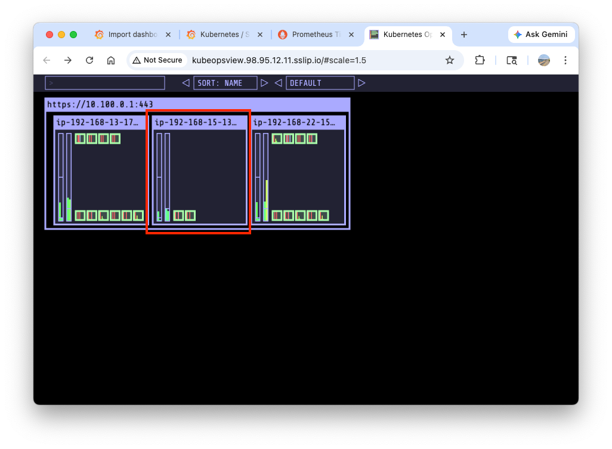
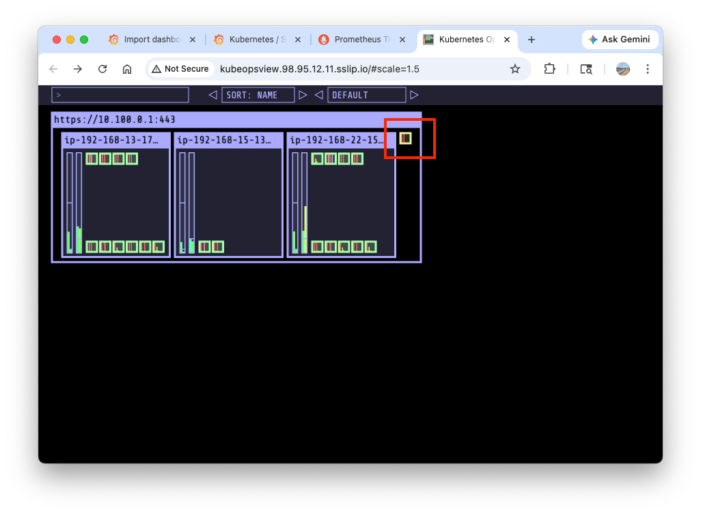
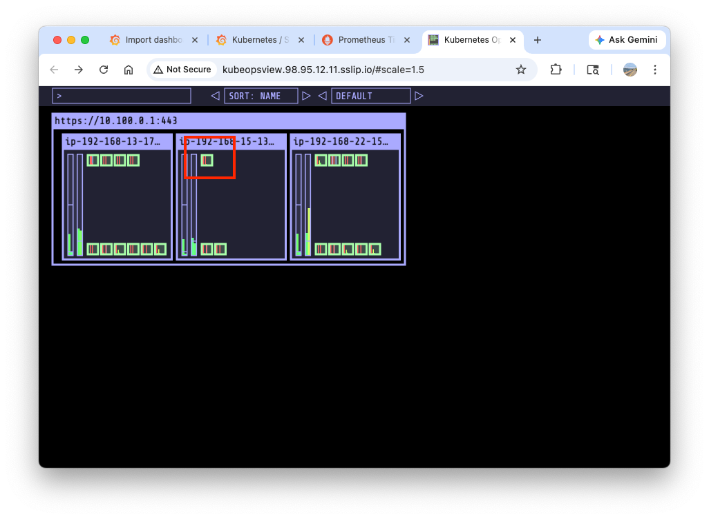
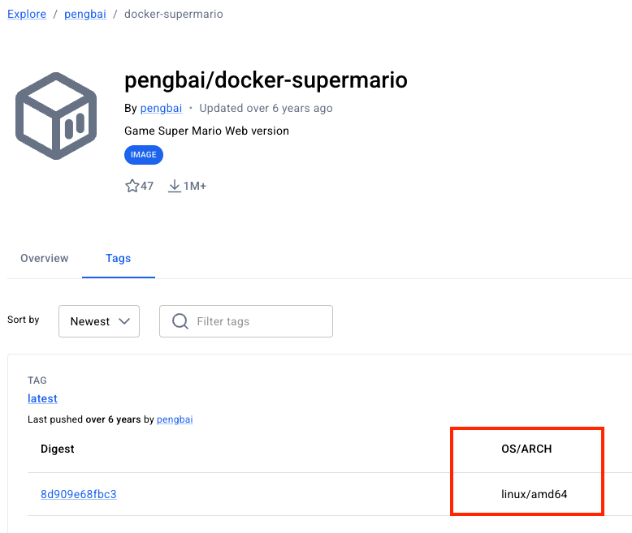

# Lab 2: Managed Node Group & Autoscaler


## 1. Managed Node Group

### On-demand node
``` bash title="Check myeks-ng-1 (on-demand)"
kubectl get nodes --label-columns eks.amazonaws.com/nodegroup,kubernetes.io/arch,eks.amazonaws.com/capacityType
NAME                             STATUS   ROLES    AGE    VERSION               NODEGROUP    ARCH    CAPACITYTYPE
ip-192-168-13-172.ec2.internal   Ready    <none>   2d3h   v1.35.2-eks-f69f56f   myeks-ng-1   amd64   ON_DEMAND
ip-192-168-22-156.ec2.internal   Ready    <none>   2d3h   v1.35.2-eks-f69f56f   myeks-ng-1   amd64   ON_DEMAND


eksctl get nodegroup --cluster myeks --region us-east-1
CLUSTER NODEGROUP       STATUS  CREATED                 MIN SIZE        MAX SIZE        DESIRED CAPACITY        INSTANCE TYPE   IMAGE ID                ASG NAME                                                TYPE
myeks   myeks-ng-1      ACTIVE  2026-03-31T00:58:14Z    1               4               2                       t3.medium       AL2023_x86_64_STANDARD  eks-myeks-ng-1-92cea0b2-f793-fc43-14b3-676a74d9e187     managed

aws eks describe-nodegroup --cluster-name myeks --nodegroup-name myeks-ng-1 | jq
```

### Arm-based node

!!! note "AWS Graviton(ARM) Processor"

    AWS Graviton processors are custom-built by Amazon Web Services using 64-bit Arm Neoverse cores to deliver the best price performance for your cloud workloads running in Amazon EC2. They offer significantly better performance per watt and lower costs compared to x86-based instances for many modern cloud applications.

Let's add the second node group with arm-based instances. First, unblock [the terraform code for the second node group](https://github.com/gasida/aews/blob/main/3w/eks.tf#L161-L216). Then run the following commands:

``` bash title="Add second node group"
terraform plan
terraform apply -auto-approve

# The aws eks wait nodegroup-active command can be used to wait until a specific EKS node group is active and ready for use.
aws eks wait nodegroup-active --cluster-name myeks --nodegroup-name myeks-ng-2
```

`kube-ops-view` shows a new node is added.



``` bash title="Confirm the new node group"
kubectl get nodes --label-columns eks.amazonaws.com/nodegroup,kubernetes.io/arch,eks.amazonaws.com/capacityType
NAME                             STATUS   ROLES    AGE    VERSION               NODEGROUP    ARCH    CAPACITYTYPE
ip-192-168-13-172.ec2.internal   Ready    <none>   2d5h   v1.35.2-eks-f69f56f   myeks-ng-1   amd64   ON_DEMAND
ip-192-168-15-136.ec2.internal   Ready    <none>   50m    v1.35.2-eks-f69f56f   myeks-ng-2   arm64   ON_DEMAND
ip-192-168-22-156.ec2.internal   Ready    <none>   2d5h   v1.35.2-eks-f69f56f   myeks-ng-1   amd64   ON_DEMAND

eksctl get nodegroup --cluster myeks --region us-east-1
CLUSTER NODEGROUP       STATUS  CREATED                 MIN SIZE        MAX SIZE        DESIRED CAPACITY        INSTANCE TYPE   IMAGE ID                ASG NAME                                                TYPE
myeks   myeks-ng-1      ACTIVE  2026-03-31T00:58:14Z    1               4               2                       t3.medium       AL2023_x86_64_STANDARD  eks-myeks-ng-1-92cea0b2-f793-fc43-14b3-676a74d9e187     managed
myeks   myeks-ng-2      ACTIVE  2026-04-02T05:18:09Z    1               1               1                       t4g.medium      AL2023_ARM_64_STANDARD  eks-myeks-ng-2-34cea650-5022-b3d4-7c21-2e75855309e3     managed

aws eks describe-nodegroup --cluster-name myeks --nodegroup-name myeks-ng-2 | jq .nodegroup.taints
[
  {
    "key": "cpuarch",
    "value": "arm64",
    "effect": "NO_EXECUTE" # taint
  }
]

# node info
kubectl get node -l kubernetes.io/arch=arm64
kubectl get node -l tier=secondary -owide
kubectl describe node -l tier=secondary | grep -i taint
Taints:             cpuarch=arm64:NoExecute


aws ec2 describe-instances \
  --instance-ids $(aws ssm describe-instance-information \
    --query "InstanceInformationList[?PingStatus=='Online'].InstanceId" \
    --output text) \
  --query "Reservations[].Instances[].{
    InstanceId:InstanceId,
    Type:InstanceType,
    Arch:Architecture,
    AMI:ImageId,
    State:State.Name
  }" \
  --output table

-------------------------------------------------------------------------------------
|                                 DescribeInstances                                 |
+------------------------+---------+-----------------------+----------+-------------+
|           AMI          |  Arch   |      InstanceId       |  State   |    Type     |
+------------------------+---------+-----------------------+----------+-------------+
|  ami-0dafeb02304897431 |  x86_64 |  i-0e33ef688a374b594  |  running |  t3.medium  |
|  ami-0dafeb02304897431 |  x86_64 |  i-047205992d1f630f1  |  running |  t3.medium  |
|  ami-0a8650f342e81b165 |  arm64  |  i-02a1a5e3d752e237a  |  running |  t4g.medium |
+------------------------+---------+-----------------------+----------+-------------+

# start ssm session and check the arch
aws ssm start-session --target i-02a1a5e3d752e237a

Starting session with SessionId: admin-5cg7niur55cxqrt5thkensh7ki
sh-5.2$ arch
aarch64
```

``` bash title="Deploy sample-app"
cat <<EOF | kubectl apply -f -
apiVersion: apps/v1
kind: Deployment
metadata:
  name: sample-app
  labels:
    app: sample-app
spec:
  replicas: 1
  selector:
    matchLabels:
      app: sample-app
  template:
    metadata:
      labels:
        app: sample-app
    spec:
      nodeSelector:
        kubernetes.io/arch: arm64
      containers:
      - name: sample-app
        image: nginx:alpine
        ports:
        - containerPort: 80
        resources:
          requests:
            cpu: 100m
            memory: 128Mi
EOF
```
Because of the taints and selector, the pod is not scheduled on any nodes.


``` bash title="Confirm the pod is not scheduled due to the taints"
kubectl describe pod -l app=sample-app
Events:
  Type     Reason            Age   From               Message
  ----     ------            ----  ----               -------
  Warning  FailedScheduling  36s   default-scheduler  0/3 nodes are available: 1 node(s) had untolerated taint(s), 2 node(s) didn't match Pod's node affinity/selector. no new claims to deallocate, preemption: 0/3 nodes are available: 3 Preemption is not helpful for scheduling.
```

Let's add `tolerations` to the Deployment and 

``` bash title="Set up tolerations"
cat <<EOF | kubectl apply -f -
apiVersion: apps/v1
kind: Deployment
metadata:
  name: sample-app
  labels:
    app: sample-app
spec:
  replicas: 1
  selector:
    matchLabels:
      app: sample-app
  template:
    metadata:
      labels:
        app: sample-app
    spec:
      nodeSelector:
        kubernetes.io/arch: arm64
      tolerations:
      - key: "cpuarch"
        operator: "Equal"
        value: "arm64"
        effect: "NoExecute"
      containers:
      - name: sample-app
        image: nginx:alpine
        ports:
        - containerPort: 80
        resources:
          requests:
            cpu: 100m
            memory: 128Mi
EOF
```

Now the pod is scheduled on the `myeks-ng-2` node.



``` bash title="Confirm the pod is scheduled"
kubectl get events -w --sort-by '.lastTimestamp' 
kubectl get pod -l app=sample-app
kubectl describe pod -l app=sample-app
```

``` bash title="Delete sample-app"
kubectl delete deploy sample-app
```

In the following, we will attempt to deploy `mario` app on the arm-based `myeks-ng-2` node, with the `amd64` based image.




``` bash hl_lines="20-24 27" title="Deploy mario app"
cat << EOF | kubectl apply -f -
apiVersion: apps/v1
kind: Deployment
metadata:
  name: mario
  labels:
    app: mario
spec:
  replicas: 1
  selector:
    matchLabels:
      app: mario
  template:
    metadata:
      labels:
        app: mario
    spec:
      nodeSelector:
        kubernetes.io/arch: arm64
      tolerations:
      - key: "cpuarch" #
        operator: "Equal"
        value: "arm64"
        effect: "NoExecute"
      containers:
      - name: mario
        image: pengbai/docker-supermario
        ports:
        - containerPort: 80
        resources:
          requests:
EOF
kubectl get events -w --sort-by '.lastTimestamp'
```

!!! note

    - This Kubernetes toleration allows a Pod to be scheduled on (or remain running on) [nodes tainted with `cpuarch=arm64:NoExecute`](https://github.com/gasida/aews/blob/main/3w/eks.tf#L195-L201).
    - Like mentioned above, `pengbai/docker-supermario` image is baked to run on the `amd64` CPU architecture.

``` bash title="Confirm the app is not deployed"
kubectl get events -w --sort-by '.lastTimestamp'

kubectl get pod -l app=mario
kubectl stern -l app=mario 
```
{== Due to the mismatch of the cpu architecture between the image and node, the pod is not scheduled on the `myeks-ng-2` node. ==}

!!! warning

    Remove the second node group by commenting out [the secondary block](https://github.com/gasida/aews/blob/main/3w/eks.tf#L161-L216) in `eks.tf` and running the following commands:

    ``` bash
    terraform plan
    terraform apply -auto-approve
    ```


### Spot instances

To briefly introduce spot instances,

- enable you to request unused EC2 instances at steep discounts
- the spot price of each instance type is adjusted gradually based on the long-term supply of and demand for Spot Instances
- a good fit for stateless, fault-tolerant, flexible applications, including batch and machine learning training workloads, big data ETLs such as Apache Spark, queue processing applications, and stateless API endpoints

Let's add the spot instance node group. First, unblock [the terraform code for the third node group](https://github.com/gasida/aews/blob/main/3w/eks.tf#L220-L268). Then run the following commands:

``` bash title="Add spot instance node group"
terraform plan
terraform apply -auto-approve

# The aws eks wait nodegroup-active command can be used to wait until a specific EKS node group is active and ready for use.
aws eks wait nodegroup-active --cluster-name myeks --nodegroup-name myeks-ng-3
```

``` bash title="Confirm the new node group"
kubectl get nodes --label-columns eks.amazonaws.com/nodegroup,kubernetes.io/arch,eks.amazonaws.com/capacityType # (1)
kubectl get nodes -L eks.amazonaws.com/capacityType # (2)
```

1.  NAME                             STATUS   ROLES    AGE    VERSION               NODEGROUP    ARCH    CAPACITYTYPE
    ip-192-168-13-172.ec2.internal   Ready    <none>   3d4h   v1.35.2-eks-f69f56f   myeks-ng-1   amd64   ON_DEMAND
    ip-192-168-13-202.ec2.internal   Ready    <none>   3m3s   v1.35.2-eks-f69f56f   myeks-ng-3   amd64   SPOT
    ip-192-168-22-156.ec2.internal   Ready    <none>   3d4h   v1.35.2-eks-f69f56f   myeks-ng-1   amd64   ON_DEMAND
2.  NAME                             STATUS   ROLES    AGE     VERSION               CAPACITYTYPE
    ip-192-168-13-172.ec2.internal   Ready    <none>   3d4h    v1.35.2-eks-f69f56f   ON_DEMAND
    ip-192-168-13-202.ec2.internal   Ready    <none>   3m12s   v1.35.2-eks-f69f56f   SPOT
    ip-192-168-22-156.ec2.internal   Ready    <none>   3d4h    v1.35.2-eks-f69f56f   ON_DEMAND