# Auto Scalers

## 1. Horizontal Pod Autoscaler

### Import dashboard

First, import the [Horizontal Pod Autoscaler (HPA)](https://grafana.com/grafana/dashboards/22128-horizontal-pod-autoscaler-hpa/) dashboard. In the grafana main UI, go to **Dashboards > New > Import**, type `22128` and click **Load** button. 

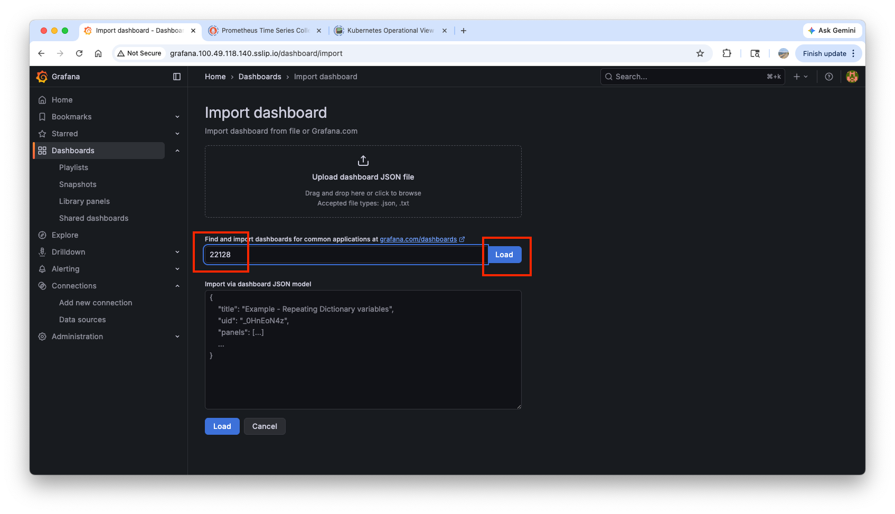

In the next page, choose **prometheus** and click **Import** button.

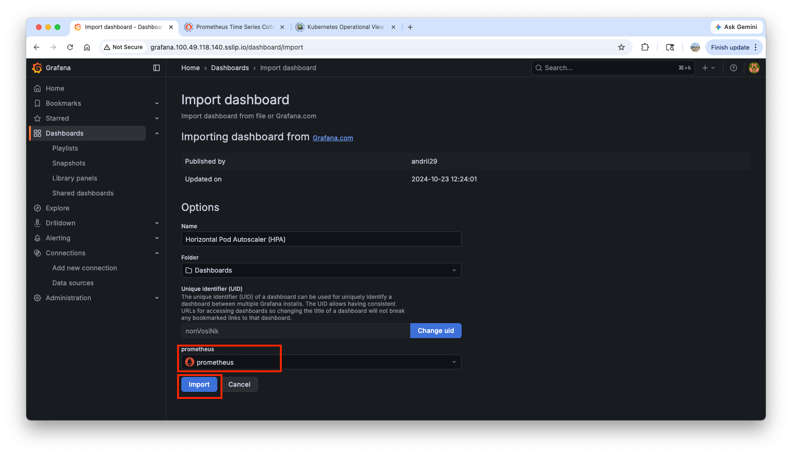

Since we haven't added any HPA policies, **No data** will appear on the dashboard:

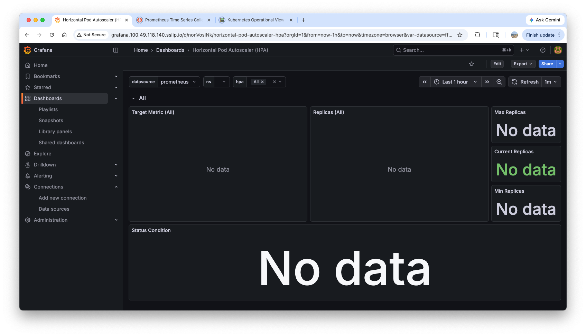

### Deploy a sample application

``` bash title="Deploy a sample application"
kubectl apply -f https://k8s.io/examples/application/php-apache.yaml
```

!!! note ""
    cpu requests and limits are applied in the `hpa-example` image.

    ``` yaml hl_lines="20-23" title="php-apache.yaml"
    apiVersion: apps/v1
    kind: Deployment
    metadata: 
      name: php-apache
    spec: 
      selector: 
        matchLabels: 
          run: php-apache
      template: 
        metadata: 
          labels: 
            run: php-apache
        spec: 
          containers: 
          - name: php-apache
            image: registry.k8s.io/hpa-example
            ports: 
            - containerPort: 80
            resources: 
              limits: 
                cpu: 500m
              requests: 
                cpu: 200m
    ---
    apiVersion: v1
    kind: Service
    metadata: 
      name: php-apache
      labels: 
        run: php-apache
    spec: 
      ports: 
      - port: 80
      selector: 
        run: php-apache
    ```

    In Dockerfile of the `hpa-example` image, it essentially contains 1,000,000 summation logic to generate load on the CPU.

    ``` docker
    FROM php:5-apache
    COPY index.php /var/www/html/index.php
    RUN chmod a+rx index.php
    ```

    ``` bash hl_lines="1" title="index.php"
    kubectl exec -it deploy/php-apache -- cat /var/www/html/index.php # (1)!
    ```

    1.  
        ``` php title="index.php"
        <?php
        $x = 0.0001;
        for ($i = 0; $i <= 1000000; $i++) {
              $x += sqrt($x);
        }
        echo "OK!";
        ?>
        ```

Open two separate terminals and run the following commands on each terminal:

``` bash hl_lines="1 3" title="monitoring"
watch -d \
'kubectl get hpa,pod;echo;kubectl top pod;echo;kubectl top node' # (1)!

kubectl exec -it deploy/php-apache -- top # (2)!
```

1.  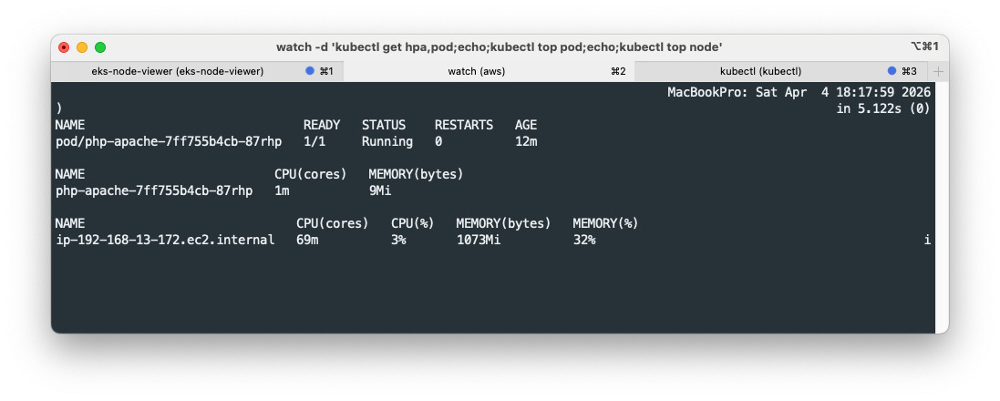
2.  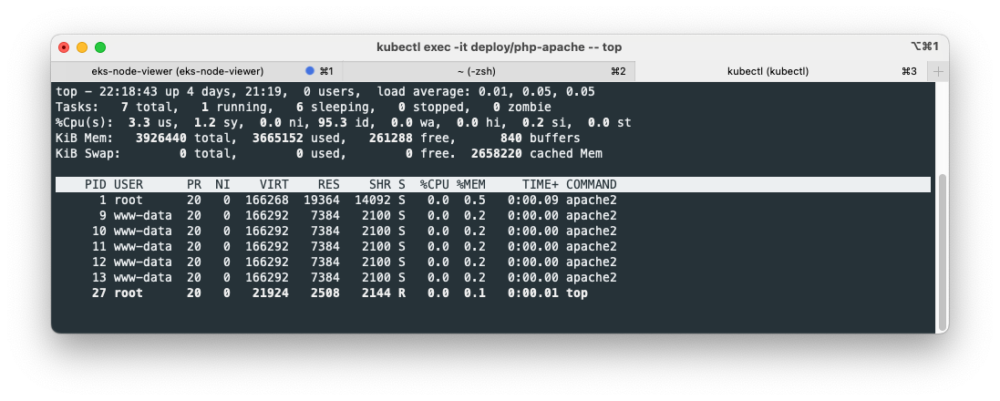

### Deploy a client pod and make load

``` bash title="Deploy a client pod"
cat <<EOF | kubectl apply -f -
apiVersion: v1
kind: Pod
metadata:
  name: curl
spec:
  containers:
  - name: curl
    image: curlimages/curl:latest
    command: ["sleep", "3600"]
  restartPolicy: Never
EOF
```

``` bash title="Create load on the app"
kubectl exec curl -- sh -c 'while true; do curl -s php-apache; sleep 0.01; done'
```

Making load on the app constantly increases cpu/mem usages:

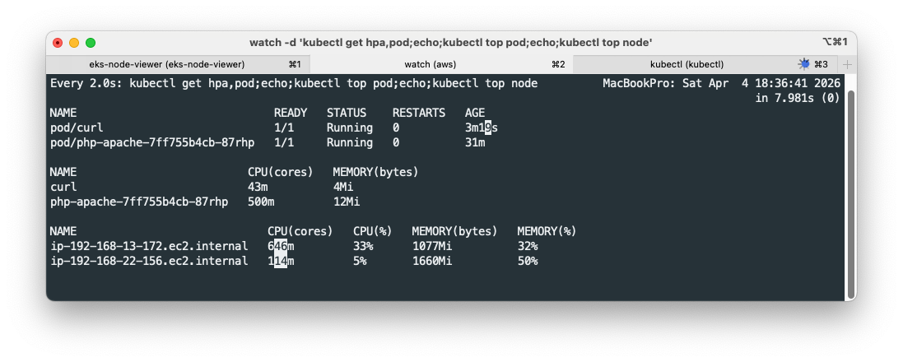


### Create HPA policy

=== "yaml"

    ``` bash title="Create HPA policy"
    cat <<EOF | kubectl apply -f -
    apiVersion: autoscaling/v2
    kind: HorizontalPodAutoscaler
    metadata:
      name: php-apache
    spec:
      scaleTargetRef:
        apiVersion: apps/v1
        kind: Deployment
        name: php-apache
      minReplicas: 1
      maxReplicas: 10
      metrics:
      - type: Resource
        resource:
          name: cpu
          target:
            averageUtilization: 50
            type: Utilization
    EOF
    ```

=== "kubectl command"

    ``` bash title="Create HPA policy"
    kubectl autoscale deployment php-apache --cpu-percent=50 --min=1 --max=10
    ```

``` bash hl_lines="1" title="Confirm the HPA resource"
kubectl get hpa # (1)!

kubectl get hpa php-apache -o yaml # (2)!
```

1.  
    ``` text
    Metrics:                                               ( current / target )
      resource cpu on pods  (as a percentage of request):  250% (501m) / 50%
    Min replicas:                                          1
    Max replicas:                                          10
    Deployment pods:                                       4 current / 5 desired
    ```
2.
    ``` yaml
    spec:
      maxReplicas: 10
      metrics:
      - resource:
          name: cpu
          target:
            averageUtilization: 50
            type: Utilization
        type: Resource
      minReplicas: 1
      scaleTargetRef:
        apiVersion: apps/v1
        kind: Deployment
        name: php-apache
    ```

### Monitor HPA

With the load increased, the number of pods increases to process the increased load in the grafana dashboard:

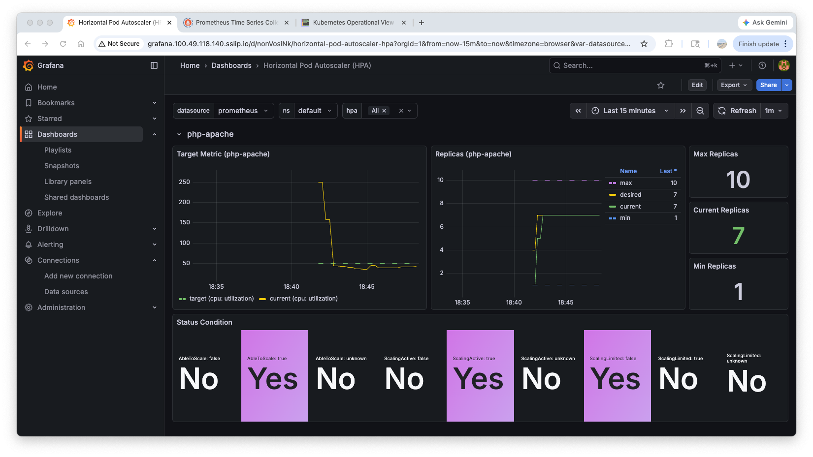

Query HPA metrics in prometheus:

``` bash hl_lines="1" title="Query HPA metrics"
kube_horizontalpodautoscaler_status_current_replicas # (1)!
kube_horizontalpodautoscaler_status_desired_replicas
kube_horizontalpodautoscaler_status_target_metric
kube_horizontalpodautoscaler_status_condition

kube_horizontalpodautoscaler_spec_target_metric
kube_horizontalpodautoscaler_spec_min_replicas
kube_horizontalpodautoscaler_spec_max_replicas
```

1.  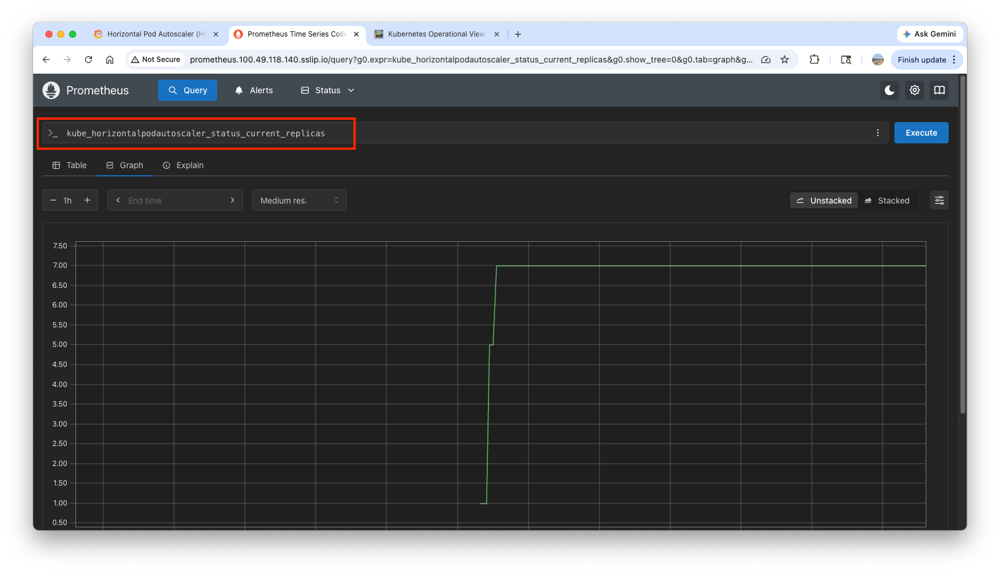


``` bash hl_lines="3"  title="Check prometheus metrics endpoint"
kubectl exec -it curl -- curl -s kube-prometheus-stack-kube-state-metrics.monitoring.svc:8080/metrics
kubectl exec -it curl -- curl -s kube-prometheus-stack-kube-state-metrics.monitoring.svc:8080/metrics \
| grep -i horizontalpodautoscaler | grep HELP # (1)!
```

1.  
    ``` text
    # HELP kube_horizontalpodautoscaler_info Information about this autoscaler.
    # HELP kube_horizontalpodautoscaler_metadata_generation [STABLE] The generation observed by the HorizontalPodAutoscaler controller.
    # HELP kube_horizontalpodautoscaler_spec_max_replicas [STABLE] Upper limit for the number of pods that can be set by the autoscaler; cannot be smaller than MinReplicas.
    # HELP kube_horizontalpodautoscaler_spec_min_replicas [STABLE] Lower limit for the number of pods that can be set by the autoscaler, default 1.
    # HELP kube_horizontalpodautoscaler_spec_target_metric The metric specifications used by this autoscaler when calculating the desired replica count.
    # HELP kube_horizontalpodautoscaler_status_target_metric The current metric status used by this autoscaler when calculating the desired replica count.
    # HELP kube_horizontalpodautoscaler_status_current_replicas [STABLE] Current number of replicas of pods managed by this autoscaler.
    # HELP kube_horizontalpodautoscaler_status_desired_replicas [STABLE] Desired number of replicas of pods managed by this autoscaler.
    # HELP kube_horizontalpodautoscaler_annotations Kubernetes annotations converted to Prometheus labels.
    # HELP kube_horizontalpodautoscaler_labels [STABLE] Kubernetes labels converted to Prometheus labels.
    # HELP kube_horizontalpodautoscaler_status_condition [STABLE] The condition of this autoscaler.
    # HELP kube_horizontalpodautoscaler_created Unix creation timestamp
    # HELP kube_horizontalpodautoscaler_deletion_timestamp Unix deletion timestamp
    ```

!!! warning "Delete resources"

    ``` bash 
    kubectl delete deploy,svc,hpa,pod --all
    ```


## 2. Kubernetes Event-Driven Autoscaling(KEDA)

### How KEDA works

While the traditional **Horizontal Pod Autoscaler (HPA)** scales workloads based on resource metrics like CPU and Memory usage, **KEDA (Kubernetes Event-Driven Autoscaling)** enables scaling based on **specific events**.

For example, a tool like Apache Airflow can monitor its metadata database to determine the number of tasks currently running or waiting in the queue. By leveraging these event-driven metrics, KEDA can scale workers more proactively and rapidly during sudden spikes in task volume compared to resource-based autoscaling.


/// caption
https://keda.sh/docs/2.10/concepts/
///

KEDA performs three key roles within Kubernetes:

1. **Agent** — KEDA activates and deactivates Kubernetes Deployments to scale to and from zero on no events. This is one of the primary roles of the `keda-operator` container that runs when you install KEDA.
1. **Metrics** — KEDA acts as a `Kubernetes metrics server` that exposes rich event data like queue length or stream lag to the Horizontal Pod Autoscaler to drive scale out. It is up to the Deployment to consume the events directly from the source. This preserves rich event integration and enables gestures like completing or abandoning queue messages to work out of the box. The metric serving is the primary role of the `keda-operator-metrics-apiserver` container that runs when you install KEDA.
1. **Admission Webhooks** - Automatically validate resource changes to prevent misconfiguration and enforce best practices by using an `admission controller`. As an example, it will prevent multiple ScaledObjects to target the same scale target.

The following specification describes the `kafka` trigger for an Apache Kafka topic:
``` yaml hl_lines="7 8"
triggers:
- type: kafka
  metadata:
    bootstrapServers: kafka.svc:9092
    consumerGroup: my-group
    topic: test-topic
    lagThreshold: '5' # (1)!
    activationLagThreshold: '3' # (2)! 
    offsetResetPolicy: latest
    allowIdleConsumers: false
    scaleToZeroOnInvalidOffset: false
    excludePersistentLag: false
    limitToPartitionsWithLag: false
    version: 1.0.0
    partitionLimitation: '1,2,10-20,31'
    sasl: plaintext
    tls: enable
    unsafeSsl: 'false'
```

1.  :information_source:  Target value for the total lag (sum of all partition lags) to trigger scaling actions. (Default: `10`, Optional)
2.  :information_source:  Target value for activating the scaler. (Default: `0`, Optional)

### Deploy KEDA with Helm

Before deploying KEDA, check metrics API:
```bash
kubectl get --raw "/apis/metrics.k8s.io" | jq # (1)!
```

1.  
    ``` json
    {
      "kind": "APIGroup",
      "apiVersion": "v1",
      "name": "metrics.k8s.io",
      "versions": [
        {
          "groupVersion": "metrics.k8s.io/v1beta1",
          "version": "v1beta1"
        }
      ],
      "preferredVersion": {
        "groupVersion": "metrics.k8s.io/v1beta1",
        "version": "v1beta1"
      }
    }
    ```

Save KEDA variable values in `keda-values.yaml`:
``` bash
cat <<EOT > keda-values.yaml
metricsServer:
  useHostNetwork: true

prometheus:
  metricServer:
    enabled: true
    port: 9022
    portName: metrics
    path: /metrics
    serviceMonitor:
      # Enables ServiceMonitor creation for the Prometheus Operator
      enabled: true
  operator:
    enabled: true
    port: 8080
    serviceMonitor:
      # Enables ServiceMonitor creation for the Prometheus Operator
      enabled: true
  webhooks:
    enabled: true
    port: 8020
    serviceMonitor:
      # Enables ServiceMonitor creation for the Prometheus webhooks
      enabled: true
EOT
```

``` bash title="Deploy KEDA"
helm repo add kedacore https://kedacore.github.io/charts
helm repo update
helm install keda kedacore/keda --version 2.16.0 --namespace keda --create-namespace -f keda-values.yaml
```

``` bash hl_lines="6 7" title="Confirm the deployment"
kubectl get crd | grep keda
kubectl get all -n keda
kubectl get validatingwebhookconfigurations keda-admission -o yaml
kubectl get podmonitor,servicemonitors -n keda
kubectl get apiservice v1beta1.external.metrics.k8s.io -o yaml
kubectl get pod -n keda -l app=keda-operator-metrics-apiserver # (1)!
kubectl get --raw "/apis/external.metrics.k8s.io/v1beta1" | jq # (2)!
```

1.  :information_source: `cpu` and `memory` metrics are pulled from the existing `metrics-server`, while external metrics are supplied by `keda-operator-metrics-apiserver`([reference](https://keda.sh/docs/2.16/operate/metrics-server/)). 
2.  :octicons-code-review-16:
    ``` json hl_lines="4"
    {
      "kind": "APIResourceList",
      "apiVersion": "v1",
      "groupVersion": "external.metrics.k8s.io/v1beta1",
      "resources": [
        {
          "name": "externalmetrics",
          "singularName": "",
          "namespaced": true,
          "kind": "ExternalMetricValueList",
          "verbs": [
            "get"
          ]
        }
      ]
    }
    ```

### Deploy an app and ScaledObject

``` bash title="Deploy an app"
kubectl apply -f https://k8s.io/examples/application/php-apache.yaml -n keda
kubectl get pod -n keda
```

``` bash title="Deploy a ScaledObject"
cat <<EOT > keda-cron.yaml
apiVersion: keda.sh/v1alpha1
kind: ScaledObject
metadata:
  name: php-apache-cron-scaled
spec:
  minReplicaCount: 0
  maxReplicaCount: 2  # Specifies the maximum number of replicas to scale up to (defaults to 100).
  pollingInterval: 30  # Specifies how often KEDA should check for scaling events
  cooldownPeriod: 300  # Specifies the cool-down period in seconds after a scaling event
  scaleTargetRef:  # Identifies the Kubernetes deployment or other resource that should be scaled.
    apiVersion: apps/v1
    kind: Deployment
    name: php-apache
  triggers:  # Defines the specific configuration for your chosen scaler, including any required parameters or settings
  - type: cron
    metadata:
      timezone: America/New_York
      start: 00,15,30,45 * * * *
      end: 05,20,35,50 * * * *
      desiredReplicas: "1"
EOT
kubectl apply -f keda-cron.yaml -n keda
```

!!! note "Understand the cron policy in the ScaledObject"

    ``` yaml
      - type: cron
        metadata:
          timezone: America/New_York
          start: 00,15,30,45 * * * *
          end: 05,20,35,50 * * * *
          desiredReplicas: "1"
    ```
    The above cron policy controls when to create and delete a pod. It is created at `00`, `15`, `30`, and `45` minutes of every hour, while deleted at `05`, `20`, `35`, and `50` minutes of every hour.


### Add KEDA dashboard and monitoring

In the grafana UI, go to **Dashboards > New > Import**. Copy the json code from [https://github.com/kedacore/keda/blob/main/config/grafana/keda-dashboard.json](https://github.com/kedacore/keda/blob/main/config/grafana/keda-dashboard.json) and paste it in the **Import via dashboard JSON model** box. Click **Load** button and **Import** button in the following page.

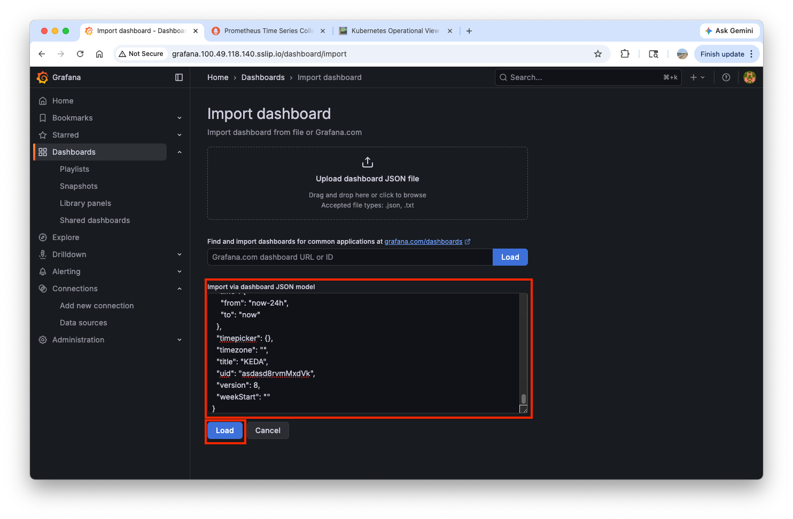

Make sure `keda` is chosen as the target **namespace**:
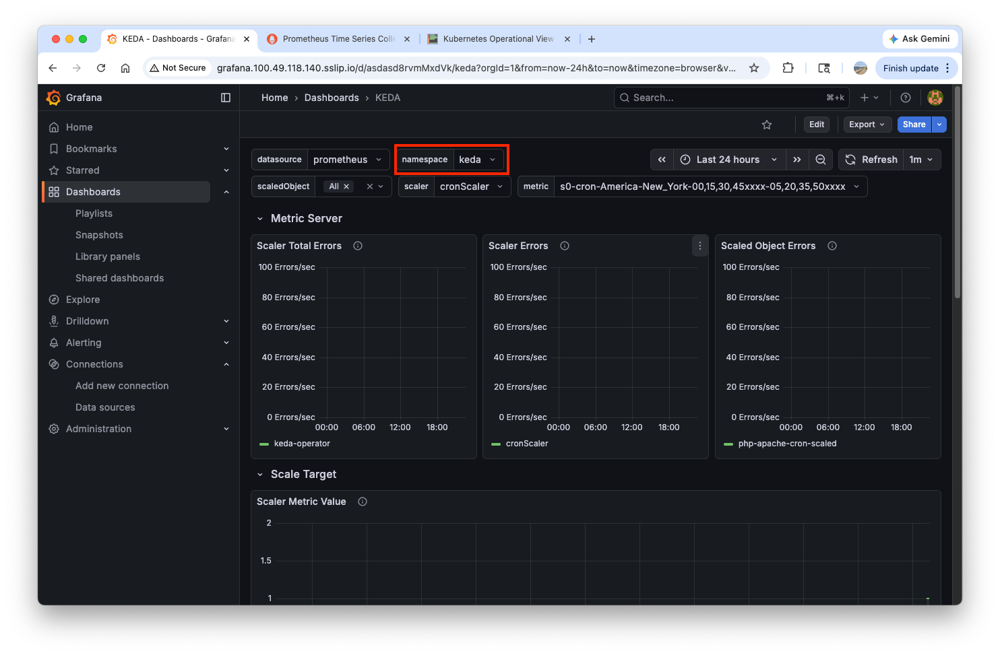

Next, open two terminals and run the following commands on each terminal:
``` bash
watch -d 'kubectl get ScaledObject,hpa,pod -n keda'
kubectl get ScaledObject -w
```

In the dashboard, you can see the pod is up and down periodically:

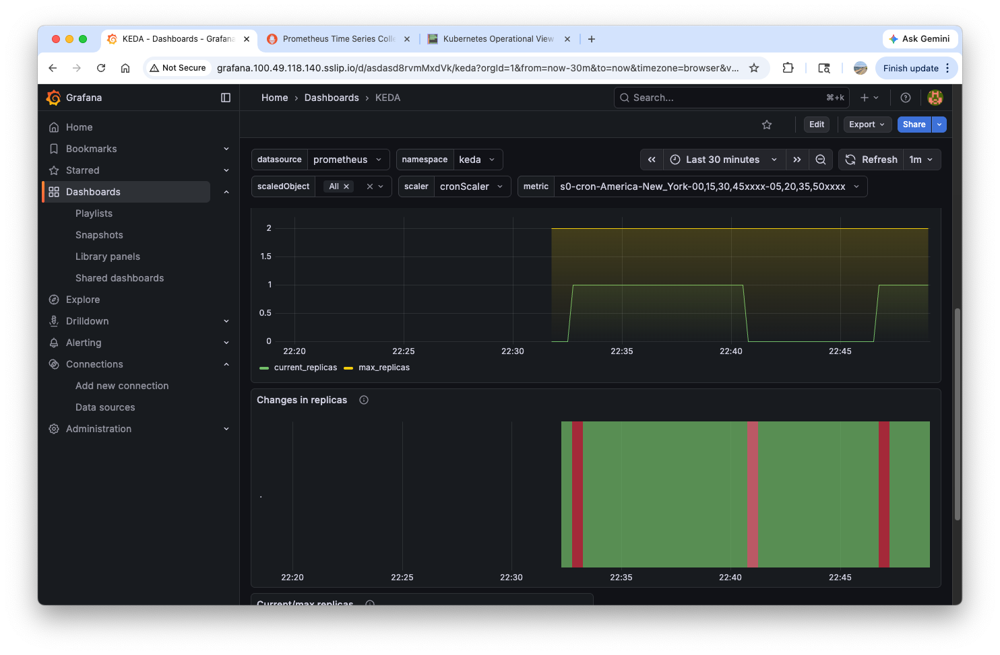

!!! warning "Delete resources"
    ``` bash
    kubectl delete ScaledObject -n keda php-apache-cron-scaled && \
    kubectl delete deploy php-apache -n keda && \
    helm uninstall keda -n keda

    kubectl delete namespace keda
    ```


## 3. Cluster Proportional Autoscaler(CPA)

The **Cluster Proportional Autoscaler (CPA)** is a Kubernetes autoscaler that scales the number of replicas for a workload proportionally to the size of the cluster. Unlike HPA, which scales based on resource metrics like CPU or memory, CPA scales based on the total number of **nodes** or **CPU cores** available in the cluster.

This is particularly useful for cluster-level services that must handle increased demand as the infrastructure grows, such as **CoreDNS**, **kube-state-metrics**, or other supporting controllers.

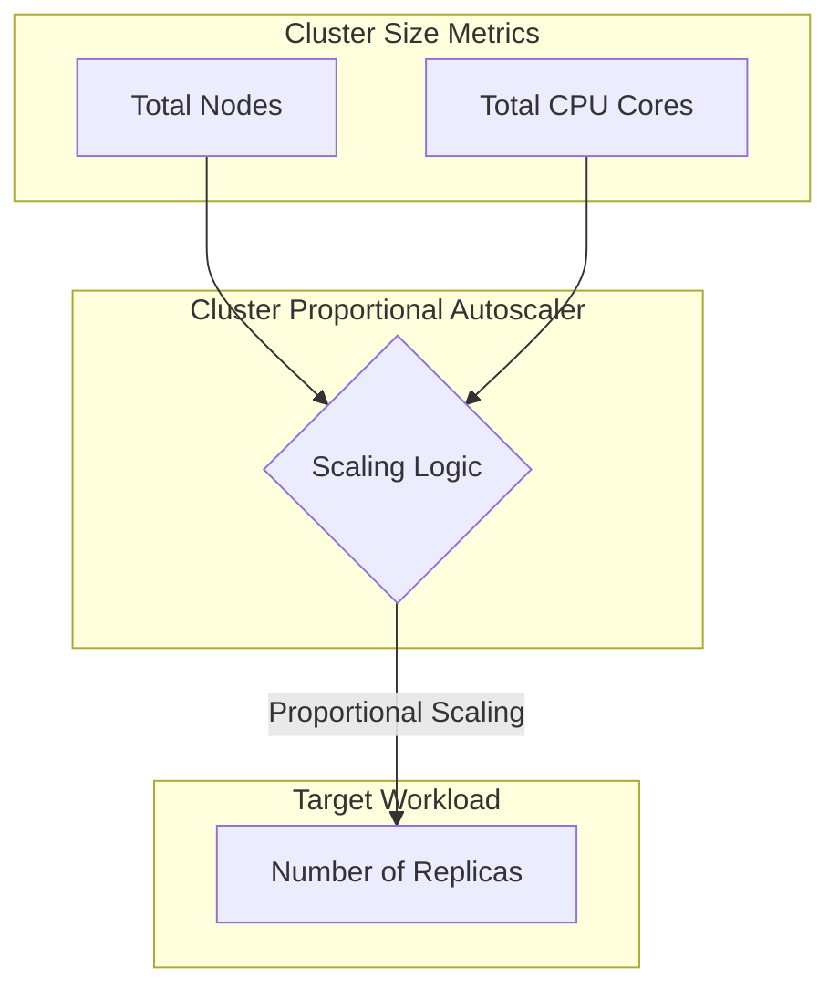

### Install cluster-proportional-autoscaler and a test app

``` bash title="Install cluster-proportional-autoscaler by helm"
helm repo add cluster-proportional-autoscaler https://kubernetes-sigs.github.io/cluster-proportional-autoscaler
helm upgrade --install cluster-proportional-autoscaler cluster-proportional-autoscaler/cluster-proportional-autoscaler
```

``` bash title="Deploy nginx-deployment app"
cat <<EOT > cpa-nginx.yaml
apiVersion: apps/v1
kind: Deployment
metadata:
  name: nginx-deployment
spec:
  replicas: 1
  selector:
    matchLabels:
      app: nginx
  template:
    metadata:
      labels:
        app: nginx
    spec:
      containers:
      - name: nginx
        image: nginx:latest
        resources:
          limits:
            cpu: "100m"
            memory: "64Mi"
          requests:
            cpu: "100m"
            memory: "64Mi"
        ports:
        - containerPort: 80
EOT
kubectl apply -f cpa-nginx.yaml
```

``` bash hl_lines="5-9" title="Configure rules to scale replicas"
cat <<EOF > cpa-values.yaml
config:
  ladder:
    nodesToReplicas:
      - [1, 1]
      - [2, 2]
      - [3, 3]
      - [4, 3]
      - [5, 5]
options:
  namespace: default
  target: "deployment/nginx-deployment"
EOF
```

``` bash title="Upgrade helm"
helm upgrade --install cluster-proportional-autoscaler -f cpa-values.yaml cluster-proportional-autoscaler/cluster-proportional-autoscaler
```

``` bash title="monitoring pods"
watch -d kubectl get pod
```

### Add nodes

``` bash hl_lines="3" title="Increase the number of nodes to five"
export ASG_NAME=$(aws autoscaling describe-auto-scaling-groups --query "AutoScalingGroups[? Tags[? (Key=='eks:cluster-name') && Value=='myeks']].AutoScalingGroupName" --output text)
aws autoscaling update-auto-scaling-group --auto-scaling-group-name ${ASG_NAME} --min-size 5 --desired-capacity 5 --max-size 5
aws autoscaling describe-auto-scaling-groups --query "AutoScalingGroups[? Tags[? (Key=='eks:cluster-name') && Value=='myeks']].[AutoScalingGroupName, MinSize, MaxSize,DesiredCapacity]" --output table # (1)!
```

1.  :octicons-code-review-16:
    ``` text
    ------------------------------------------------------------------------
    |                       DescribeAutoScalingGroups                      |
    +-------------------------------------------------------+----+----+----+
    |  eks-myeks-ng-1-92cea0b2-f793-fc43-14b3-676a74d9e187  |  5 |  5 |  5 |
    +-------------------------------------------------------+----+----+----+
    ```

As the number of nodes has increased, the number of `nginx-deployment` pods also increases accordingly:
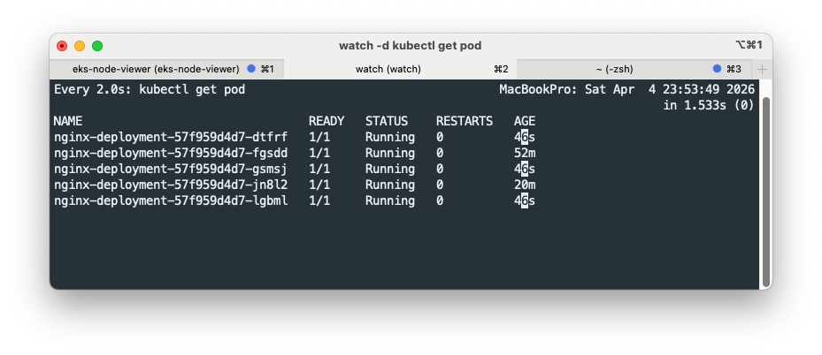


``` bash hl_lines="2" title="Scale down the number of nodes to four"
aws autoscaling update-auto-scaling-group --auto-scaling-group-name ${ASG_NAME} --min-size 4 --desired-capacity 4 --max-size 4
aws autoscaling describe-auto-scaling-groups --query "AutoScalingGroups[? Tags[? (Key=='eks:cluster-name') && Value=='myeks']].[AutoScalingGroupName, MinSize, MaxSize,DesiredCapacity]" --output table # (1)!
```

1.  :octicons-code-review-16:
    ``` text
    ------------------------------------------------------------------------
    |                       DescribeAutoScalingGroups                      |
    +-------------------------------------------------------+----+----+----+
    |  eks-myeks-ng-1-92cea0b2-f793-fc43-14b3-676a74d9e187  |  4 |  4 |  4 |
    +-------------------------------------------------------+----+----+----+
    ```


!!! warning "Delete resources"

    ``` bash
    helm uninstall cluster-proportional-autoscaler && kubectl delete -f cpa-nginx.yaml
    ```

## 4. Cluster Autoscaler(CA/CAS)

The **Cluster Autoscaler (CA)** is a tool that automatically adjusts the size of a Kubernetes cluster (the number of nodes) based on the presence of **pending pods**. Unlike HPA or CPA which scale workloads (pods), CA scales the **infrastructure** itself.

CA works in two directions:

- **Scale Up**: When there are pods that cannot be scheduled due to insufficient resources, CA adds new nodes to the cluster by interacting with the cloud provider (e.g., AWS Auto Scaling Groups).
- **Scale Down**: When nodes are consistently underutilized for a certain period and their pods can be moved to other existing nodes, CA removes those nodes to optimize costs.

``` mermaid
graph LR
    subgraph Kubernetes_Cluster [Kubernetes Cluster]
        Pods[Pending Pods]
        Scheduler{Scheduler}
        Nodes[Nodes]
    end

    subgraph CA [Cluster Autoscaler]
        Monitor{Monitor Pending Pods}
    end

    subgraph Cloud_Provider [Cloud Provider (AWS)]
        ASG[Auto Scaling Group]
        EC2[EC2 Instances]
    end

    Pods -- Cannot Schedule --> Scheduler
    Scheduler -- Pending Status --> Monitor
    Monitor -- Increase Capacity --> ASG
    ASG -- Launch Node --> EC2
    EC2 -- Join Cluster --> Nodes
```

### Current autoscaling(ASG) setup

To enable cluster autoscaler, ensure the following tags are attached on each node:

- `k8s.io/cluster-autoscaler/myeks : owned`
- `k8s.io/cluster-autoscaler/enabled : true`

``` bash title="Look up tags on node"
aws ec2 describe-instances  --filters Name=tag:Name,Values=myeks-ng-1 --query "Reservations[*].Instances[*].Tags[*]" --output json | jq
```

You can browse tags on node in the aws console:

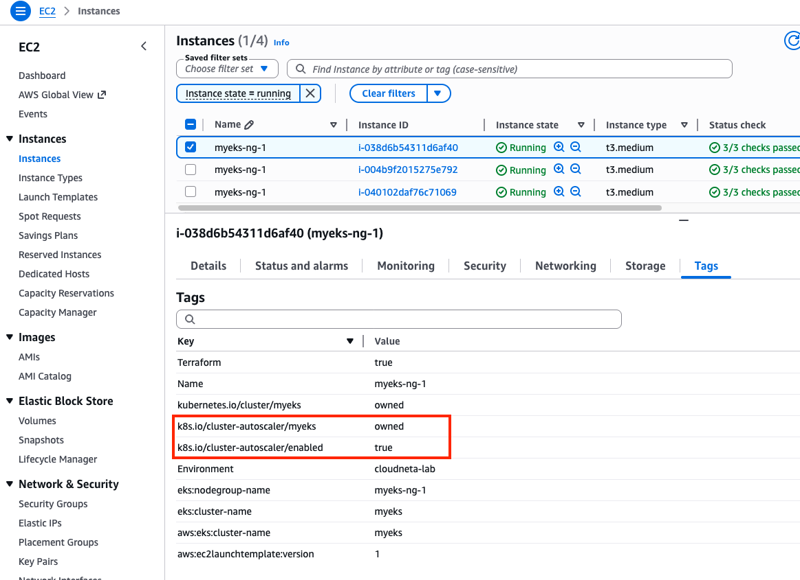

``` bash title="Check autoscaling setup"
aws autoscaling describe-auto-scaling-groups \
    --query "AutoScalingGroups[? Tags[? (Key=='eks:cluster-name') && Value=='myeks']].[AutoScalingGroupName, MinSize, MaxSize,DesiredCapacity]" \
    --output table # (1)!
```

1.  :octicons-code-review-16:
    ``` text
    ------------------------------------------------------------------------
    |                       DescribeAutoScalingGroups                      |
    +-------------------------------------------------------+----+----+----+
    |  eks-myeks-ng-1-92cea0b2-f793-fc43-14b3-676a74d9e187  |  4 |  4 |  4 |
    +-------------------------------------------------------+----+----+----+
    ```

``` bash title="Change MaxSize to 6"
export ASG_NAME=$(aws autoscaling describe-auto-scaling-groups --query "AutoScalingGroups[? Tags[? (Key=='eks:cluster-name') && Value=='myeks']].AutoScalingGroupName" --output text)
aws autoscaling update-auto-scaling-group --auto-scaling-group-name ${ASG_NAME} --min-size 3 --desired-capacity 3 --max-size 6
```

``` bash title="Check the change"
aws autoscaling describe-auto-scaling-groups \
    --query "AutoScalingGroups[? Tags[? (Key=='eks:cluster-name') && Value=='myeks']].[AutoScalingGroupName, MinSize, MaxSize,DesiredCapacity]" \
    --output table # (1)!
```

1.  :octicons-code-review-16:
    ``` text
    ------------------------------------------------------------------------
    |                       DescribeAutoScalingGroups                      |
    +-------------------------------------------------------+----+----+----+
    |  eks-myeks-ng-1-92cea0b2-f793-fc43-14b3-676a74d9e187  |  3 |  6 |  3 |
    +-------------------------------------------------------+----+----+----+
    ```

### Deploy the Cluster Autoscaler (CAS)

``` bash title="Download cluster-autoscaler-autodiscover.yaml"
curl -s -O https://raw.githubusercontent.com/kubernetes/autoscaler/master/cluster-autoscaler/cloudprovider/aws/examples/cluster-autoscaler-autodiscover.yaml # (1)!
```

1.  :octicons-code-review-16: 
    ``` yaml
          command:
            - ./cluster-autoscaler
            - --v=4
            - --stderrthreshold=info
            - --cloud-provider=aws
            - --skip-nodes-with-local-storage=false
            - --expander=least-waste
            - --node-group-auto-discovery=asg:tag=k8s.io/cluster-autoscaler/enabled,k8s.io/cluster-autoscaler/<YOUR CLUSTER NAME>
    ```

``` bash hl_lines="1" title="Deploy cluster-autoscaler"
sed -i -e "s|<YOUR CLUSTER NAME>|myeks|g" cluster-autoscaler-autodiscover.yaml # (1)!
kubectl apply -f cluster-autoscaler-autodiscover.yaml
```

1.  :information_source: Change the occurance of `<YOUR CLUSTER NAME>` to `myeks` in `cluster-autoscaler-autodiscover.yaml`

``` bash hl_lines="3" title="Check the deployment"
kubectl get pod -n kube-system | grep cluster-autoscaler
kubectl describe deployments.apps -n kube-system cluster-autoscaler
kubectl describe deployments.apps -n kube-system cluster-autoscaler | grep node-group-auto-discovery # (1)!
```

1.  :octicons-code-review-16:
    ``` bash
      --node-group-auto-discovery=asg:tag=k8s.io/cluster-autoscaler/enabled,k8s.io/cluster-autoscaler/myeks
    ```

``` bash title="Block nodes with cluster-autoscaler pods from being evicted"
kubectl -n kube-system annotate deployment.apps/cluster-autoscaler cluster-autoscaler.kubernetes.io/safe-to-evict="false"
```

### Scale nodes by adding pods

``` bash title="Set up monitoring"
kubectl get nodes -w
```

``` bash title="Deploy a sample app"
cat << EOF > nginx.yaml
apiVersion: apps/v1
kind: Deployment
metadata:
  name: nginx-to-scaleout
spec:
  replicas: 1
  selector:
    matchLabels:
      app: nginx
  template:
    metadata:
      labels:
        service: nginx
        app: nginx
    spec:
      containers:
      - image: nginx
        name: nginx-to-scaleout
        resources:
          limits:
            cpu: 500m
            memory: 512Mi
          requests:
            cpu: 500m
            memory: 512Mi
EOF
kubectl apply -f nginx.yaml
kubectl get deployment/nginx-to-scaleout
```

``` bash title="Scale our ReplicaSet"
kubectl scale --replicas=15 deployment/nginx-to-scaleout && date
```

``` bash hl_lines="8" title="confirm"
kubectl get pods -l app=nginx -o wide --watch
kubectl -n kube-system logs -f deployment/cluster-autoscaler

kubectl get nodes
aws autoscaling describe-auto-scaling-groups \
    --query "AutoScalingGroups[? Tags[? (Key=='eks:cluster-name') && Value=='myeks']].[AutoScalingGroupName, MinSize, MaxSize,DesiredCapacity]" \
    --output table # (1)!
```

1.  :octicons-code-review-16:
    ``` text
    ------------------------------------------------------------------------
    |                       DescribeAutoScalingGroups                      |
    +-------------------------------------------------------+----+----+----+
    |  eks-myeks-ng-1-92cea0b2-f793-fc43-14b3-676a74d9e187  |  3 |  6 |  6 |
    +-------------------------------------------------------+----+----+----+
    ```

`kube-ops-view` and `eks-node-viewer` confirm the incrased nunber of nodes:

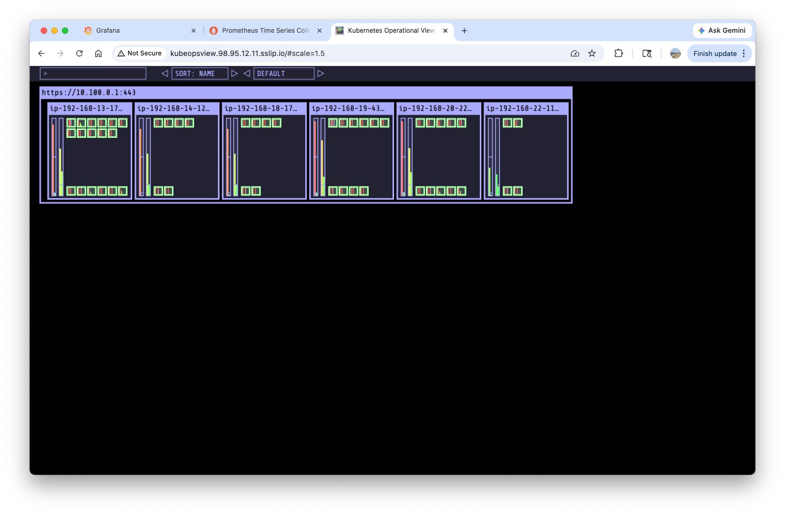

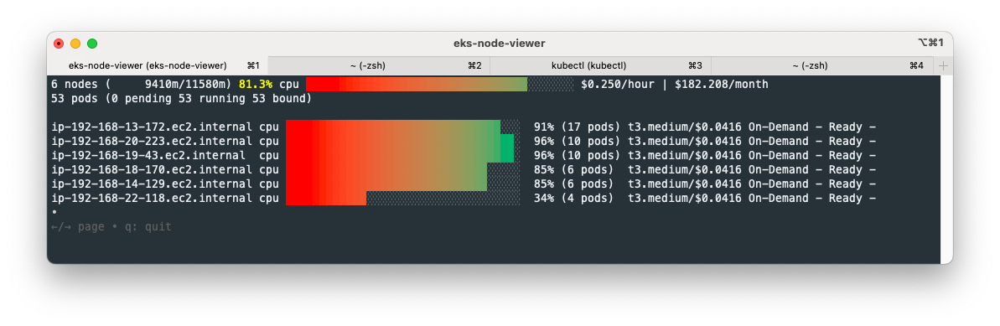


### Delete resources

``` bash title="Delete the sample app"
kubectl delete -f nginx.yaml && date
```

!!! note

    Nodes are not scaled down for the first 10 minutes, which can be configured by the `--scale-down-delay-after-add=5m` flag.
    After 10 mins have passed, nodes are scaled down to four.
    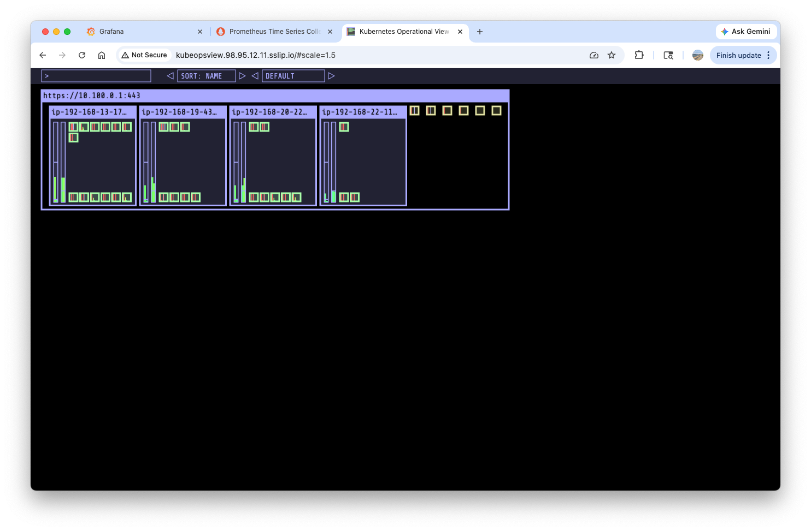


``` bash hl_lines="2" title="Change min/max/desired size"
aws autoscaling update-auto-scaling-group --auto-scaling-group-name ${ASG_NAME} --min-size 3 --desired-capacity 3 --max-size 3
aws autoscaling describe-auto-scaling-groups --query "AutoScalingGroups[? Tags[? (Key=='eks:cluster-name') && Value=='myeks']].[AutoScalingGroupName, MinSize, MaxSize,DesiredCapacity]" --output table # (1)!
kubectl delete -f cluster-autoscaler-autodiscover.yaml
```

1.  :octicons-code-review-16:
    ``` text
    ------------------------------------------------------------------------
    |                       DescribeAutoScalingGroups                      |
    +-------------------------------------------------------+----+----+----+
    |  eks-myeks-ng-1-92cea0b2-f793-fc43-14b3-676a74d9e187  |  3 |  3 |  3 |
    +-------------------------------------------------------+----+----+----+
    ```

### Problems with CA

While Cluster Autoscaler (CA) is a powerful tool, it has several limitations and challenges:

- **Reliance on Cloud Provider (ASG)**: CA does not directly manage node instances. It relies on **Auto Scaling Groups (ASG)** to create and delete instances, meaning it doesn't have direct control over the node lifecycle.
- **Node vs. Instance Lifecycle**: In EKS, deleting a node object from Kubernetes does not automatically terminate the underlying EC2 instance. The ASG must be the one to terminate the instance to ensure the node count is correctly reduced.
- **Difficulty in Targeting Specific Nodes**: It is very difficult to force CA to scale down a **specific node**. CA typically scales down underutilized nodes, but ensuring that a specific node (e.g., one that has already been drained) is terminated first is complex.
- **Scale-in Policy Limitations**: It is challenging to delete a specific node while simultaneously reducing the total node count. Scaling policies are often not flexible enough to handle specific node removal during a scale-in event.
    - *Example Workaround*: In a 100-node cluster, you might need to enable "instance protection" for 99 nodes, migrate pods from the target node, trigger a scale-in by reducing the desired capacity, and then restore protection to all nodes.
- **API Rate Limits**: CA operates on a **polling mechanism**. If the polling interval is set too low (checking for scaling opportunities too frequently), it can quickly reach cloud provider **API rate limits**, leading to throttling and delayed scaling actions.

!!! warning
    ``` bash title="Delete the entire resources"
    # delete prometheus
    helm uninstall -n monitoring kube-prometheus-stack

    # delete kube-ops-view
    kubectl delete ingress -n kube-system kubeopsview
    helm uninstall kube-ops-view --namespace kube-system

    # delete terraform resources
    terraform destroy -auto-approve
    ```