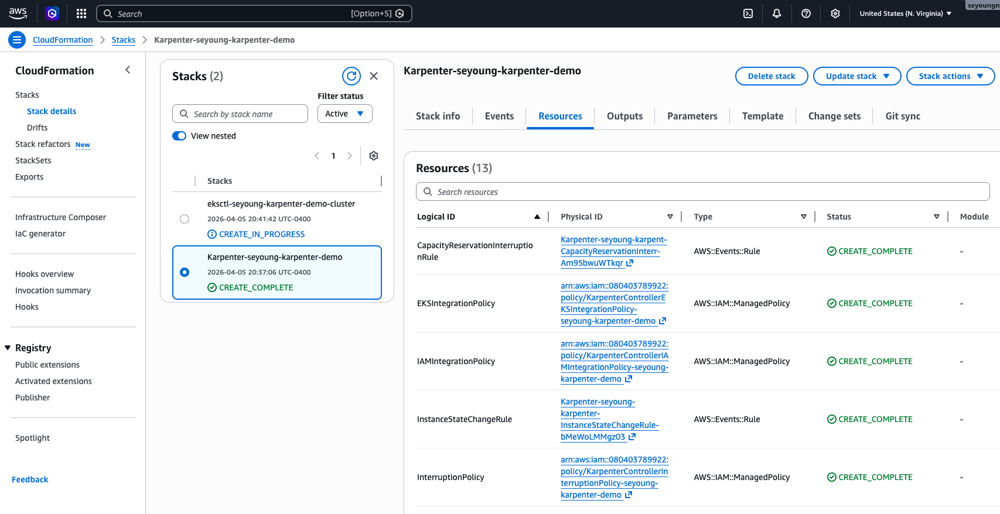
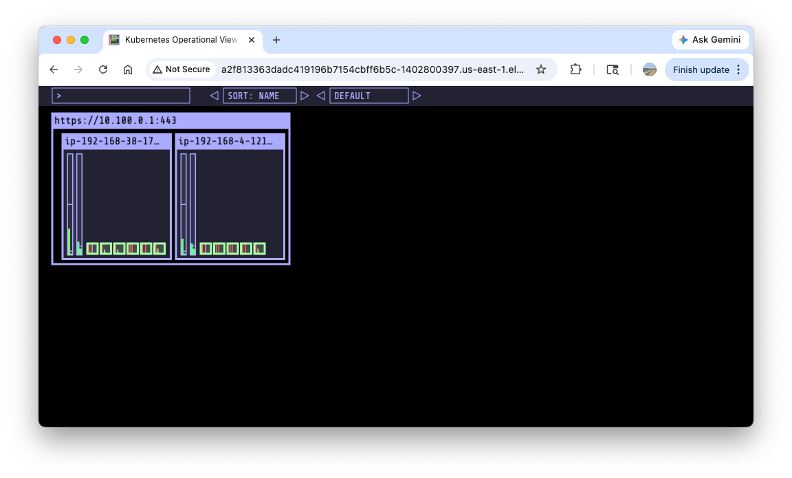
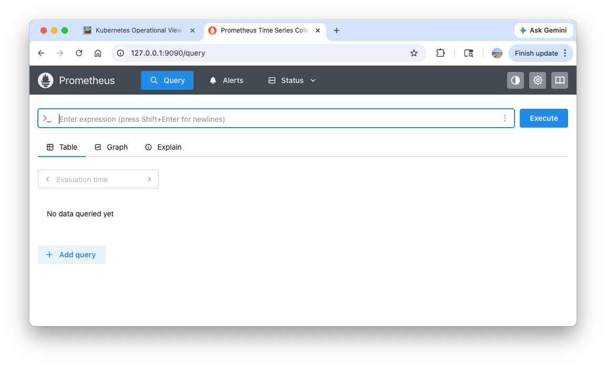
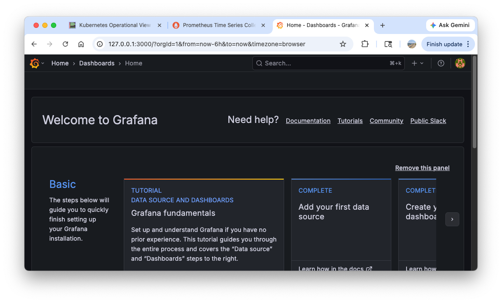
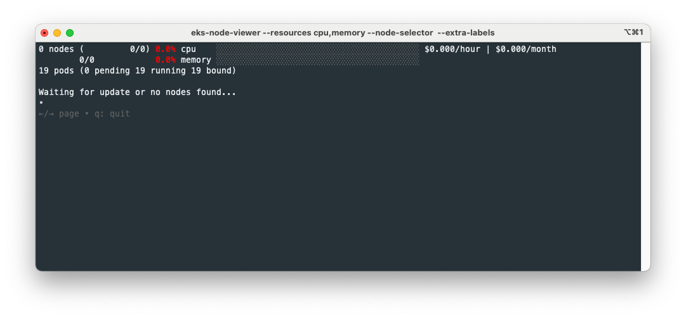
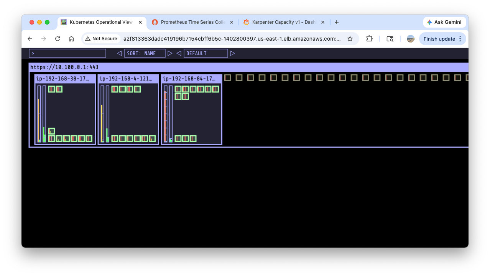
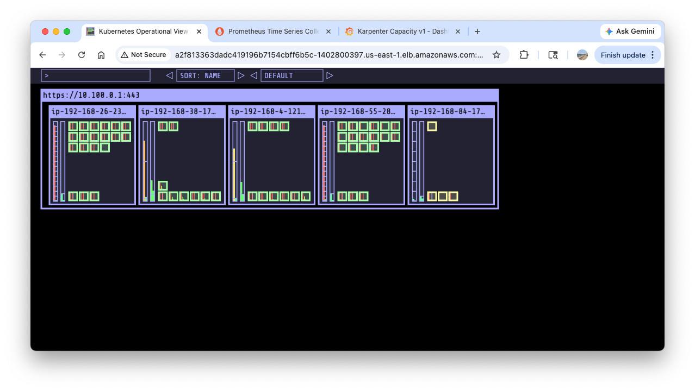
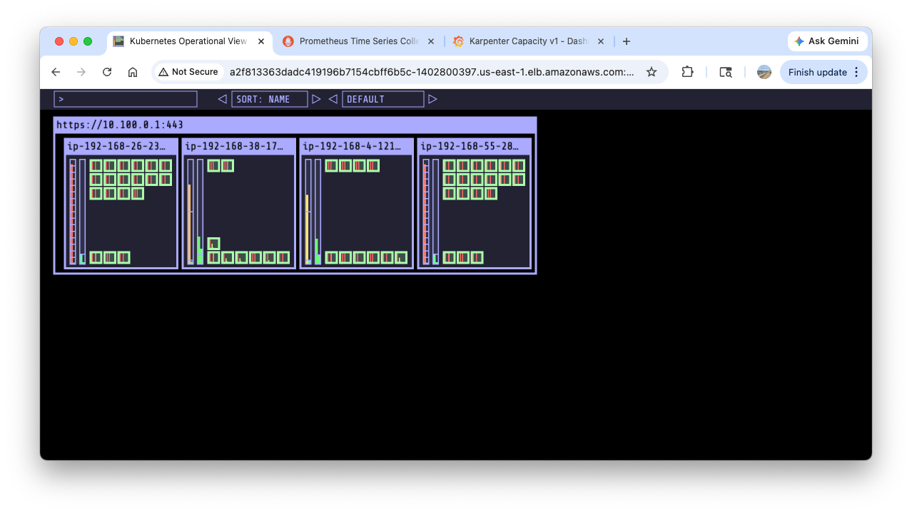
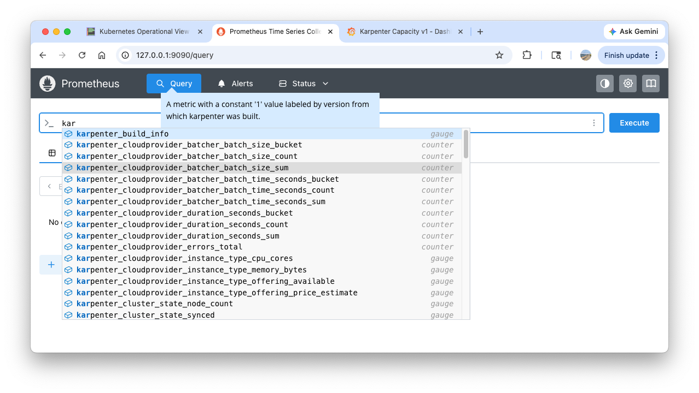
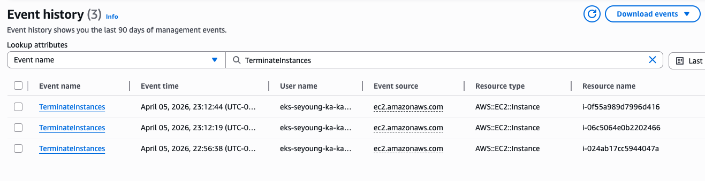

# Karpenter

**Karpenter** is an open-source, flexible, high-performance Kubernetes node provisioner. It helps improve application availability and cluster efficiency by rapidly launching right-sized computing resources in response to changing application load. Unlike the traditional Cluster Autoscaler, Karpenter works directly with the cloud provider's fleet (e.g., Amazon EC2) to provision nodes without the need for pre-configured node groups, significantly reducing scheduling latency and infrastructure overhead.

The following guide is an abbreviated version of [Getting Started with Karpenter](https://karpenter.sh/docs/getting-started/getting-started-with-karpenter/)

## 1. Install utilities

Install these tools before proceeding:

1. [AWS CLI](https://docs.aws.amazon.com/cli/latest/userguide/install-cliv2-linux.html): [configure the AWS CLI](https://docs.aws.amazon.com/cli/latest/userguide/cli-chap-configure.html) with a user that has sufficient privileges to create an EKS cluster
2. `kubectl` - [the Kubernetes CLI](https://kubernetes.io/docs/tasks/tools/install-kubectl-linux/)
3. `eksctl` (>= v0.202.0) - [the CLI for AWS EKS](https://eksctl.io/installation)
4. `helm` - [the package manager for Kubernetes](https://helm.sh/docs/intro/install/)
5. `eks-node-view`

## 2. Set environment variables

``` bash title="Create a new working directory"
cd ..
mkdir -p karpenter && cd karpenter
```

``` bash title="Set variables"
export KARPENTER_NAMESPACE="kube-system"
export KARPENTER_VERSION="1.10.0"
export K8S_VERSION="1.34"

export AWS_PARTITION="aws" # if you are not using standard partitions, you may need to configure to aws-cn / aws-us-gov
export CLUSTER_NAME="seyoung-karpenter-demo" # ${USER}-karpenter-demo
export AWS_DEFAULT_REGION="us-east-1"
export AWS_ACCOUNT_ID="$(aws sts get-caller-identity --query Account --output text)"
export TEMPOUT="$(mktemp)"
export ALIAS_VERSION="$(aws ssm get-parameter --name "/aws/service/eks/optimized-ami/${K8S_VERSION}/amazon-linux-2023/x86_64/standard/recommended/image_id" --query Parameter.Value | xargs aws ec2 describe-images --query 'Images[0].Name' --image-ids | sed -r 's/^.*(v[[:digit:]]+).*$/\1/')"

# final check
echo "${KARPENTER_NAMESPACE}" "${KARPENTER_VERSION}" "${K8S_VERSION}" "${CLUSTER_NAME}" "${AWS_DEFAULT_REGION}" "${AWS_ACCOUNT_ID}" "${TEMPOUT}" "${ALIAS_VERSION}"
```

## 3. Create a Cluster

``` bash title="Create IAM Policy/Role, SQS, Event/Rule using CloudFormation stack"
curl -fsSL https://raw.githubusercontent.com/aws/karpenter-provider-aws/v"${KARPENTER_VERSION}"/website/content/en/preview/getting-started/getting-started-with-karpenter/cloudformation.yaml  > "${TEMPOUT}" \
&& aws cloudformation deploy \
  --stack-name "Karpenter-${CLUSTER_NAME}" \
  --template-file "${TEMPOUT}" \
  --capabilities CAPABILITY_NAMED_IAM \
  --parameter-overrides "ClusterName=${CLUSTER_NAME}"
```

The above command creates a CloudFormation stack equipped with prerequisite resources to run Karpenter.



``` bash title="Create a cluster"
eksctl create cluster -f - <<EOF
---
apiVersion: eksctl.io/v1alpha5
kind: ClusterConfig
metadata:
  name: ${CLUSTER_NAME}
  region: ${AWS_DEFAULT_REGION}
  version: "${K8S_VERSION}"
  tags:
    karpenter.sh/discovery: ${CLUSTER_NAME}

iam:
  withOIDC: true
  podIdentityAssociations:
  - namespace: "${KARPENTER_NAMESPACE}"
    serviceAccountName: karpenter
    roleName: ${CLUSTER_NAME}-karpenter
    permissionPolicyARNs:
    - arn:${AWS_PARTITION}:iam::${AWS_ACCOUNT_ID}:policy/KarpenterControllerNodeLifecyclePolicy-${CLUSTER_NAME}
    - arn:${AWS_PARTITION}:iam::${AWS_ACCOUNT_ID}:policy/KarpenterControllerIAMIntegrationPolicy-${CLUSTER_NAME}
    - arn:${AWS_PARTITION}:iam::${AWS_ACCOUNT_ID}:policy/KarpenterControllerEKSIntegrationPolicy-${CLUSTER_NAME}
    - arn:${AWS_PARTITION}:iam::${AWS_ACCOUNT_ID}:policy/KarpenterControllerInterruptionPolicy-${CLUSTER_NAME}
    - arn:${AWS_PARTITION}:iam::${AWS_ACCOUNT_ID}:policy/KarpenterControllerResourceDiscoveryPolicy-${CLUSTER_NAME}

iamIdentityMappings:
- arn: "arn:${AWS_PARTITION}:iam::${AWS_ACCOUNT_ID}:role/KarpenterNodeRole-${CLUSTER_NAME}"
  username: system:node:{{EC2PrivateDNSName}}
  groups:
  - system:bootstrappers
  - system:nodes
  ## If you intend to run Windows workloads, the kube-proxy group should be specified.
  # For more information, see https://github.com/aws/karpenter/issues/5099.
  # - eks:kube-proxy-windows

managedNodeGroups:
- instanceType: m5.large
  amiFamily: AmazonLinux2023
  name: ${CLUSTER_NAME}-ng
  desiredCapacity: 2
  minSize: 1
  maxSize: 10

addons:
- name: eks-pod-identity-agent
EOF
```

``` bash title="Confirm the cluster deployment"
eksctl get cluster
eksctl get nodegroup --cluster $CLUSTER_NAME
eksctl get iamidentitymapping --cluster $CLUSTER_NAME
eksctl get iamserviceaccount --cluster $CLUSTER_NAME
eksctl get addon --cluster $CLUSTER_NAME
```

``` bash hl_lines="1 2"" title="Change the cluster name"
kubectl ctx # (1)!
kubectl config rename-context "admin@seyoung-karpenter-demo.us-east-1.eksctl.io" "karpenter-demo" # (2)!
```

1.  :information_source: choose `admin@seyoung-karpenter-demo.us-east-1.eksctl.io`
2.  :information_source: `Context "admin@seyoung-karpenter-demo.us-east-1.eksctl.io" renamed to "karpenter-demo".`

``` base title="Browse resources"
kubectl ns default
kubectl cluster-info
kubectl get node --label-columns=node.kubernetes.io/instance-type,eks.amazonaws.com/capacityType,topology.kubernetes.io/zone
kubectl get pod -n kube-system -owide
kubectl get pdb -A
kubectl describe cm -n kube-system aws-auth
```

``` bash title="Install kube-ops-view"
helm repo add geek-cookbook https://geek-cookbook.github.io/charts/
helm install kube-ops-view geek-cookbook/kube-ops-view --version 1.2.2 --set service.main.type=LoadBalancer --set env.TZ="America/New_York" --namespace kube-system
echo -e "http://$(kubectl get svc -n kube-system kube-ops-view -o jsonpath="{.status.loadBalancer.ingress[0].hostname}"):8080/#scale=1.5"
open "http://$(kubectl get svc -n kube-system kube-ops-view -o jsonpath="{.status.loadBalancer.ingress[0].hostname}"):8080/#scale=1.5"
```

It may take a few miniutes to be able to access the `kube-ops-view` UI.




## 4. Install Karpenter

Logout of helm registry to perform an unauthenticated pull against the public ECR repository.

``` bash
helm registry logout public.ecr.aws
```

``` bash title="Set up variables for Karpenter"
export CLUSTER_ENDPOINT="$(aws eks describe-cluster --name "${CLUSTER_NAME}" --query "cluster.endpoint" --output text)"
export KARPENTER_IAM_ROLE_ARN="arn:${AWS_PARTITION}:iam::${AWS_ACCOUNT_ID}:role/${CLUSTER_NAME}-karpenter"
echo "${CLUSTER_ENDPOINT} ${KARPENTER_IAM_ROLE_ARN}"

``` bash title="Install Karpenter"
helm upgrade --install karpenter oci://public.ecr.aws/karpenter/karpenter --version "${KARPENTER_VERSION}" --namespace "${KARPENTER_NAMESPACE}" --create-namespace \
  --set "settings.clusterName=${CLUSTER_NAME}" \
  --set "settings.interruptionQueue=${CLUSTER_NAME}" \
  --set controller.resources.requests.cpu=1 \
  --set controller.resources.requests.memory=1Gi \
  --set controller.resources.limits.cpu=1 \
  --set controller.resources.limits.memory=1Gi \
  --wait
```
``` bash hl_lines="1 3" title="Confirm the installation"
helm list -n kube-system # (1)!
kubectl get all -n $KARPENTER_NAMESPACE
kubectl get crd | grep karpenter # (2)!
```

1.  :octicons-code-review-16:
    ``` text
    NAME                 NAMESPACE        REVISION UPDATED                                  STATUS   CHART                    APP VERSION
    karpenter       kube-system      1               2026-04-05 21:33:01.336656 -0400 EDT    deployed karpenter-1.10.0        1.10.0     
    kube-ops-view   kube-system      1               2026-04-05 21:27:08.326922 -0400 EDT    deployed kube-ops-view-1.2.2     20.4.0   
    ```
2.  :octicons-code-review-16:
    ``` text
    ec2nodeclasses.karpenter.k8s.aws                2026-04-06T01:33:00Z
    nodeclaims.karpenter.sh                         2026-04-06T01:33:00Z
    nodeoverlays.karpenter.sh                       2026-04-06T01:33:01Z
    nodepools.karpenter.sh                          2026-04-06T01:33:01Z
    ```

## 5. Install Prometheus/Grafana

Below steps come from [Monitoring with Grafana (optional)](https://karpenter.sh/docs/getting-started/getting-started-with-karpenter/#monitoring-with-grafana-optional)

``` bash title="Add helm repos"
helm repo add grafana-charts https://grafana.github.io/helm-charts
helm repo add prometheus-community https://prometheus-community.github.io/helm-charts
helm repo update
kubectl create namespace monitoring
```

``` bash title="Install Prometheus"
curl -fsSL https://raw.githubusercontent.com/aws/karpenter-provider-aws/v"${KARPENTER_VERSION}"/website/content/en/preview/getting-started/getting-started-with-karpenter/prometheus-values.yaml | envsubst | tee prometheus-values.yaml
helm install --namespace monitoring prometheus prometheus-community/prometheus --values prometheus-values.yaml # (1)!
extraScrapeConfigs: |
    - job_name: karpenter
      kubernetes_sd_configs:
      - role: endpoints
        namespaces:
          names:
          - kube-system
      relabel_configs:
      - source_labels:
        - __meta_kubernetes_endpoints_name
        - __meta_kubernetes_endpoint_port_name
        action: keep
        regex: karpenter;http-metrics
```

1.  :octicons-code-review-16:
    ``` yaml
    alertmanager:
      persistentVolume:
        enabled: false

    server:
      fullnameOverride: prometheus-server
      persistentVolume:
        enabled: false

    extraScrapeConfigs: |
        - job_name: karpenter
          kubernetes_sd_configs:
          - role: endpoints
            namespaces:
              names:
              - kube-system
          relabel_configs:
          - source_labels:
            - __meta_kubernetes_endpoints_name
            - __meta_kubernetes_endpoint_port_name
            action: keep
            regex: karpenter;http-metrics
    ```

``` bash title="Remove prometheus-alertmanager StatefulSet as it's not used"
kubectl delete sts -n monitoring prometheus-alertmanager
```

``` bash title="Access the prometheus UI"
kubectl port-forward --namespace monitoring svc/prometheus-server 9090:80 &
open http://127.0.0.1:9090
```




``` bash hl_lines="2" title="Install Grafana"
curl -fsSL https://raw.githubusercontent.com/aws/karpenter-provider-aws/v"${KARPENTER_VERSION}"/website/content/en/preview/getting-started/getting-started-with-karpenter/grafana-values.yaml | tee grafana-values.yaml
helm install --namespace monitoring grafana grafana-charts/grafana --values grafana-values.yaml # (1)!
```

1.  :octicons-code-review-16:
    ``` yaml
    datasources:
      datasources.yaml:
        apiVersion: 1
        datasources:
        - name: Prometheus
          type: prometheus
          version: 1
          url: http://prometheus-server:80
          access: proxy
    dashboardProviders:
      dashboardproviders.yaml:
        apiVersion: 1
        providers:
        - name: 'default'
          orgId: 1
          folder: ''
          type: file
          disableDeletion: false
          editable: true
          options:
            path: /var/lib/grafana/dashboards/default
    dashboards:
      default:
        capacity-dashboard:
          url: https://karpenter.sh/preview/getting-started/getting-started-with-karpenter/karpenter-capacity-dashboard.json
        performance-dashboard:
          url: https://karpenter.sh/preview/getting-started/getting-started-with-karpenter/karpenter-performance-dashboard.json
    ```


``` bash title="Get admin password"
kubectl get secret --namespace monitoring grafana -o jsonpath="{.data.admin-password}" | base64 --decode ; echo
```

``` bash title="Access the grafana UI"
kubectl port-forward --namespace monitoring svc/grafana 3000:80 &
open http://127.0.0.1:3000
```




## 6. Create NodePool (ex-Provisioner)


/// caption
https://karpenter.sh/docs/concepts/nodeclaims/
///

Karpenter interacts with `NodeClaims` and related components when creating a node:

1. Watches for pods and monitors `NodePools` and `NodeClasses`.
1. Computes the shape and size of a `NodeClaim` (or `NodeClaims`) to create in the cluster to fit the set of pods from step 1.
1. Creates the `NodeClaim` object in the cluster.
1. Finds the new `NodeClaim` and translates it into an API call to create a cloud provider instance, logging the response of the API call.
1. Karpenter watches for the instance to register itself with the cluster as a node, and updates the node's labels, annotations, taints, owner refs, and finalizer to match what was defined in the NodePool and NodeClaim. Once this step is completed, Karpenter will remove the karpenter.sh/unregistered taint from the Node.
1. Karpenter continues to watch the node, waiting until the node becomes ready, has all its startup taints removed, and has all requested resources registered on the node.

``` bash title="Check var"
echo $ALIAS_VERSION
v20260318
```

``` bash hl_lines="12 15 18 19 21 22-24 27-28 44-49" title="Create NodePool, EC2NodeClass"
cat <<EOF | envsubst | kubectl apply -f -
apiVersion: karpenter.sh/v1
kind: NodePool
metadata:
  name: default
spec:
  template:
    spec:
      requirements:
        - key: kubernetes.io/arch
          operator: In
          values: ["amd64"]
        - key: kubernetes.io/os
          operator: In
          values: ["linux"]
        - key: karpenter.sh/capacity-type
          operator: In
          values: ["on-demand"]
        - key: karpenter.k8s.aws/instance-category
          operator: In
          values: ["c", "m", "r"]
        - key: karpenter.k8s.aws/instance-generation
          operator: Gt
          values: ["2"]
      nodeClassRef:
        group: karpenter.k8s.aws
        kind: EC2NodeClass
        name: default
      expireAfter: 720h # 30 * 24h = 720h
  limits:
    cpu: 1000
  disruption:
    consolidationPolicy: WhenEmptyOrUnderutilized
    consolidateAfter: 1m
---
apiVersion: karpenter.k8s.aws/v1
kind: EC2NodeClass
metadata:
  name: default
spec:
  role: "KarpenterNodeRole-${CLUSTER_NAME}"       # replace with your cluster name
  amiSelectorTerms:
    - alias: "al2023@${ALIAS_VERSION}"            # ex) al2023@latest 
  subnetSelectorTerms:
    - tags:
        karpenter.sh/discovery: "${CLUSTER_NAME}" # replace with your cluster name
  securityGroupSelectorTerms:
    - tags:
        karpenter.sh/discovery: "${CLUSTER_NAME}" # replace with your cluster name
EOF
```

``` bash title="Cofirm the deployment"
kubectl get nodepool,ec2nodeclass,nodeclaims
```

### 7. Scale up

``` bash title="open up eks-node-viewer"
eks-node-viewer --resources cpu,memory
eks-node-viewer --resources cpu,memory --node-selector "karpenter.sh/registered=true" --extra-labels eks-node-viewer/node-age
```



``` bash hl_lines="25-26" title="Scale up"
cat <<EOF | kubectl apply -f -
apiVersion: apps/v1
kind: Deployment
metadata:
  name: inflate
spec:
  replicas: 0
  selector:
    matchLabels:
      app: inflate
  template:
    metadata:
      labels:
        app: inflate
    spec:
      terminationGracePeriodSeconds: 0
      securityContext:
        runAsUser: 1000
        runAsGroup: 3000
        fsGroup: 2000
      containers:
      - name: inflate
        image: public.ecr.aws/eks-distro/kubernetes/pause:3.7
        resources:
          requests:
            cpu: 1
        securityContext:
          allowPrivilegeEscalation: false
EOF

kubectl get pod
kubectl scale deployment inflate --replicas 5
```

!!! note 

    `requests: cpu: 1` ensures a pod requires 1 CPU.

``` bash title="Browse logs"
kubectl logs -f -n "${KARPENTER_NAMESPACE}" -l app.kubernetes.io/name=karpenter -c controller
kubectl logs -f -n "${KARPENTER_NAMESPACE}" -l app.kubernetes.io/name=karpenter -c controller | jq '.'
kubectl logs -n "${KARPENTER_NAMESPACE}" -l app.kubernetes.io/name=karpenter -c controller | grep 'launched nodeclaim' | jq '.' # (1)!
```

1.  :octicons-code-review-16:
    ``` json
    {
      "level": "INFO",
      "time": "2026-04-06T02:37:30.607Z",
      "logger": "controller",
      "message": "launched nodeclaim",
      "commit": "d80cb86",
      "controller": "nodeclaim.lifecycle",
      "controllerGroup": "karpenter.sh",
      "controllerKind": "NodeClaim",
      "NodeClaim": {
        "name": "default-rjglh"
      },
      "namespace": "",
      "name": "default-rjglh",
      "reconcileID": "f3c05d35-d464-4db6-a286-1c0597f8ad38",
      "provider-id": "aws:///us-east-1c/i-024ab17cc5944047a",
      "instance-type": "c6a.2xlarge",
      "zone": "us-east-1c",
      "capacity-type": "on-demand",
      "allocatable": {
        "cpu": "7910m",
        "ephemeral-storage": "17Gi",
        "memory": "14162Mi",
        "pods": "58",
        "vpc.amazonaws.com/pod-eni": "38"
      }
    }
    ```

``` bash title="Check resources"
kubectl get nodeclaims # (1)!
kubectl describe nodeclaims # (2)!
```

1.  :octicons-code-review-16:
    ``` text
    NAME            TYPE          CAPACITY    ZONE         NODE                             READY   AGE
    default-rjglh   c6a.2xlarge   on-demand   us-east-1c   ip-192-168-84-177.ec2.internal   True    2m35s
    ```
2.  :octicons-code-review-16: select a node that meets the requirements below.
    ``` text
      Requirements:
        Key:       karpenter.k8s.aws/ec2nodeclass
        Operator:  In
        Values:
          default
        Key:       node.kubernetes.io/instance-type
        Operator:  In
        Values:
          c3.2xlarge
          c3.4xlarge
          c3.8xlarge
    ...
    ...
        Key:       kubernetes.io/os
        Operator:  In
        Values:
          linux
        Key:       karpenter.k8s.aws/instance-category
        Operator:  In
        Values:
          c
          m
          r
        Key:       karpenter.sh/nodepool
        Operator:  In
        Values:
          default
        Key:       kubernetes.io/arch
        Operator:  In
        Values:
          amd64
        Key:       karpenter.k8s.aws/instance-generation
        Operator:  Gte
        Values:
          3
        Key:       karpenter.sh/capacity-type
        Operator:  In
        Values:
          on-demand
    ```

``` bash title="Scale up to 30"
kubectl scale deployment inflate --replicas 30
kubectl logs -f -n "${KARPENTER_NAMESPACE}" -l app.kubernetes.io/name=karpenter -c controller | jq '.'
kubectl get nodeclaims # (1)!
kubectl describe nodeclaims # (2)!
```

1.  :octicons-code-review-16:
    ``` text
    NAME            TYPE          CAPACITY    ZONE         NODE                             READY   AGE
    default-8bq97   c6a.4xlarge   on-demand   us-east-1d   ip-192-168-55-28.ec2.internal    True    3m54s
    default-b472z   c6a.4xlarge   on-demand   us-east-1c   ip-192-168-26-231.ec2.internal   True    3m54s
    ```


`kube-ops-view` captures the process of provisioning a new node and scheduling pods:






In the `CloudTrail` page, you can find bunch of `CreateFleet` event logs. In the below log, we can learn that Karpenter is able to create a node with `arn:aws:iam::080403789922:role/seyoung-karpenter-demo-karpenter` role and looks for the cheapest node.


Karpenter produces bunch of metrics:



### 8. Scale down

``` bash title="Scale down"
kubectl delete deployment inflate && date
```

``` bash title="Check logs"
kubectl logs -f -n "${KARPENTER_NAMESPACE}" -l app.kubernetes.io/name=karpenter -c controller | jq '.' # (1)!
kubectl get nodeclaims # (2)!
```

1.  :octicons-code-review-16:
    ``` json
    {
      "level": "INFO",
      "time": "2026-04-06T03:12:13.364Z",
      "logger": "controller",
      "message": "disrupting node(s)",
      "commit": "d80cb86",
      "controller": "disruption",
      "namespace": "",
      "name": "",
      "reconcileID": "14e4707c-2821-4b3b-8b37-2705c29fff60",
      "command": "Empty/4db0fd72-b518-4b88-a69a-b62eb912192b: delete: nodepools=[default]: [ip-192-168-55-28.ec2.internal] (savings: $0.61)",
      "decision": "delete",
      "disrupted-node-count": 1,
      "replacement-node-count": 0,
      "pod-count": 0,
      "disrupted-nodes": [
        {
          "Node": {
            "name": "ip-192-168-55-28.ec2.internal"
          },
          "NodeClaim": {
            "name": "default-8bq97"
          },
          "capacity-type": "on-demand",
          "instance-type": "c6a.4xlarge"
        }
      ],
      "replacement-nodes": []
    }
    ```
2.  :octicons-code-review-16: `No resources found`

Confirm events for the last one hour in [the CloudTrail AWS console](https://us-east-1.console.aws.amazon.com/cloudtrailv2/home?region=us-east-1#/events?EventName=TerminateInstances&CustomTime=3600000).



### 9. Delete resources

``` bash
# uninstall Karpenter helm
helm uninstall karpenter --namespace "${KARPENTER_NAMESPACE}"

# remove Service(CLB)
kubectl delete svc -n kube-system kube-ops-view

# remove EC2 Launch Template
aws ec2 describe-launch-templates --filters "Name=tag:karpenter.k8s.aws/cluster,Values=${CLUSTER_NAME}" |
    jq -r ".LaunchTemplates[].LaunchTemplateName" |
    xargs -I{} aws ec2 delete-launch-template --launch-template-name {}

# remove cluster
eksctl delete cluster --name "${CLUSTER_NAME}"

# remove cloudformation stack
aws cloudformation delete-stack --stack-name "Karpenter-${CLUSTER_NAME}"
```