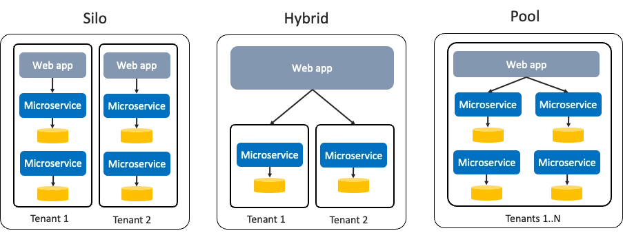
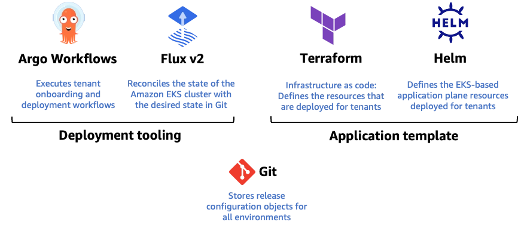

# SaaS Platform Engineering by GitOps

**"Platform Engineering with Amazon EKS," presented at re:Invent 2023**

<iframe width="560" height="315" src="https://www.youtube.com/embed/eLxBnGoBltc?si=tr1EfRfnzmYt6bIa" title="YouTube video player" frameborder="0" allow="accelerometer; autoplay; clipboard-write; encrypted-media; gyroscope; picture-in-picture; web-share" referrerpolicy="strict-origin-when-cross-origin" allowfullscreen></iframe>

> slides deck: [https://d1.awsstatic.com/events/Summits/reinvent2023/CON311_Platform-engineering-with-Amazon-EKS.pdf](https://d1.awsstatic.com/events/Summits/reinvent2023/CON311_Platform-engineering-with-Amazon-EKS.pdf)

---

## Evolving Concepts: From DevOps to GitOps and Platform Engineering

### Platform Engineering: Definition and Core Concepts

Platform engineering is a technical practice that provides **abstractions** to reduce the burden of infrastructure management, allowing development teams to focus on application development.

- **Value of Abstraction:** Instead of requiring developers to assemble complex engine parts (cloud-native services), it provides a completed engine (platform abstraction) so they can start driving (developing) immediately.
- **Internal Developer Platform (IDP):** It should be treated as a single, **compelling internal product** that combines self-service APIs, tools, knowledge, and support.

### Three Benefits of Platform Engineering

- **Velocity:** Accelerates the time from idea to production deployment through self-service deployment capabilities.
- **Governance:** Enforces requirements such as security, reliability, and scalability in an automated manner at the platform level.
- **Efficiency:** Optimizes costs by reducing infrastructure expenses through multi-tenancy and centralizing human expertise.

### Platform Implementation Patterns (AWS Perspective)

There is no single "right answer" to platform engineering, and various service models can be chosen based on an organization's requirements:

- **Account as a Service:** Provides flexibility at the account level.
- **Template as a Service:** Provides standardized templates.
- **Cluster as a Service:** Provides EKS clusters themselves as a service.
- **Namespace as a Service:** Provides isolated spaces within a shared cluster (utilized by companies like Salesforce).
- **Platform as a Service (PaaS):** Provides complete abstraction.

---

## GitOps Principles

GitOps is a method for managing infrastructure and application configurations by defining them declaratively and managing them through version control tools (primarily Git). The following four principles are emphasized at https://opengitops.dev:

1. **Declarative**
    - Define the system state declaratively by specifying "what" the state should be, rather than "how" to achieve it.
    - For example, specify the final desired state in a YAML file, such as "run 3 server instances."
2. **Versioned and Immutable**
    - All declarative configurations must be stored in a version control system such as Git.
    - This maintains a history of all changes, making it easy to roll back to a specific point in time if issues arise.
3. **Pulled Automatically**
    - The "Desired State" stored in Git must be automatically reflected in the cluster or system.
    - Rather than manual deployments using commands, the system detects changes in Git and performs updates autonomously.
4. **Continuously Reconciled**
    - Software agents continuously monitor whether the "Actual State" of the system matches the "Desired State" defined in Git.
    - If a discrepancy (Drift) is detected between the two states, the system automatically corrects it to match the state defined in Git.

### Why GitOps is Necessary in SaaS DevOps

Utilizing GitOps is essential to respond to complex business requirements.

The core of SaaS is agility. In a SaaS model, as we run and manage software for customers, a DevOps process that supports continuous change and innovation is required.

- **Frequent Releases:** Enables rapid feedback and feature delivery.
- **Operational Efficiency:** Manages all tenants consistently through the same process.
- **Automated Onboarding:** Maximizes efficiency by ensuring rapid and consistent tenant creation.

A successful SaaS architecture must improve agility, innovation, growth, and cost-efficiency. SaaS applications use various deployment models such as Silo, Hybrid, and Pool, and the requirements for provisioning resources during the tenant onboarding process vary accordingly.

**Isolation Level, Cost, and Representative Tier Examples by SaaS Model**

| Model | Description | Isolation Level | Cost | Representative Usage |
| :--- | :--- | :--- | :--- | :--- |
| Silo | Dedicated infrastructure per tenant | High | High | Premium Tier |
| Pool | Shared infrastructure | Low | Low | Basic Tier |
| Hybrid | Mixed operation by tier | Medium | Medium | (Mostly used in mixed forms in actual SaaS) |

### Useful Toolings

- **Terraform**: 애플리케이션 인프라 패키징을 위해 [Terraform ](https://www.terraform.io/) 모듈을 사용 - 데이터베이스 및 큐와 같이 애플리케이션 작동에 필요한 모든 구성 요소를 활용하여 사용.
- **Helm Chart**:  [Helm ](https://helm.sh/) 차트를 사용하여 Kubernetes 리소스를 애플리케이션 이미지 및 정의와 함께 패키징하며 [Terraform ](https://www.terraform.io/) 버전을 통합하여 페넌트 배포 전반에 걸쳐 패키지의 무결성을 유지하기 위해 애플리케이션 버전을 관리.
- **Flux Tofu Controller**: [Flux Tofu Controller ](https://github.com/flux-iac/tofu-controller) 를 사용하여 Helm을 사용한 모든 리소스 패키징 및 기존 Terraform 모듈 수정 없이 재사용
- **Flux v2**: 환경 일관성을 유지하기 위해  [Flux v2 ](https://fluxcd.io/) 를 활용한 [Git ](https://git-scm.com/) 프로세스를 구현. Git를 활용하는 선언적 인프라 및 애플리케이션 구성을 위한 단일 정보 소스로서 자동화된 배포 파이프라인과 안정적인 배포를 지원. [Flux v2 ](https://fluxcd.io/) 를 통해 immutable 방화벽으로 활용하여 모든 테넌트 간 균일성을 보장

