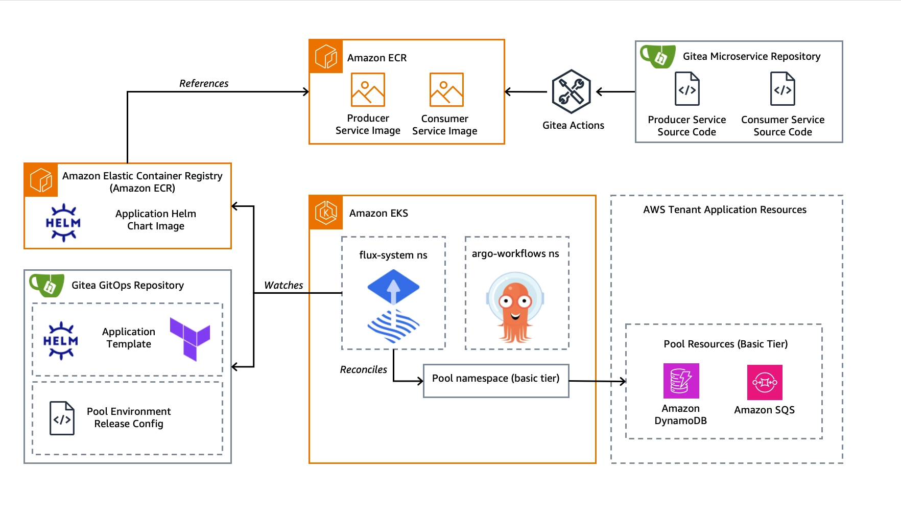
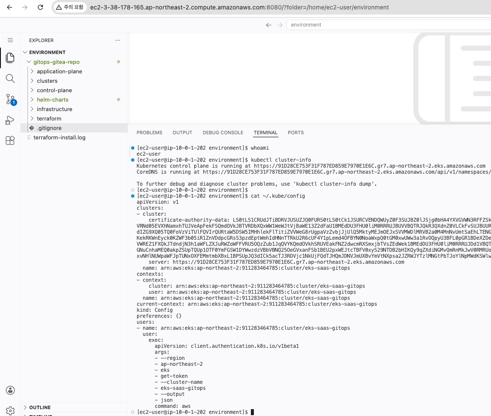

# CICD Lab Environment

## Lab Environment Overview

**GitOps**

- Terraform source code is managed via [**Gitea**](https://about.gitea.com/)
- Container images are managed using Helm charts and deployed to Amazon ECR.
- The environment is continuously monitored by **Flux**, utilizing the [Tofu Controller](https://github.com/flux-iac/tofu-controller) on Amazon EKS.
- Workflow execution is verified using [**Argo Workflows**](https://argoproj.github.io/workflows/) (Lab 3).

**SaaS-hosted Microservices**

- **Applications**
    - Producer
    - Consumer
- Microservice Git repositories are managed through Gitea.
- Container images uploaded to Amazon ECR—orchestrated and managed via GitOps—are executed using [Gitea Actions](https://docs.gitea.com/usage/actions/overview).

---

## Lab Environment Setup

You can configure the lab environment using the [Implementation Guide](https://aws-solutions-library-samples.github.io/compute/building-saas-applications-on-amazon-eks-using-gitops.html#deploy-the-guidance) found at https://github.com/ianychoi/eks-saas-gitops.

??? Abstract "Lab Environment Setup in your personal AWS account"

    For manual deployment to your personal AWS account, deploy VSCode server instance (takes about 24 mins) - [Link](https://github.com/ianychoi/eks-saas-gitops/blob/main/README.md)

    - Go to the **AWS CloudFormation** console in your AWS account
    - Click **Create stack** and select **With new resources (standard)**
    - Select **Upload a template file** and upload the `helpers/vs-code-ec2.yaml` file from this repository
    - Click Next" and enter a stack name (e.g., "**eks-saas-gitops-vscode**")
    - Configure the required parameters and click "Next"
      - **Note**: The default allowed IP is set to 0.0.0.0/0 (all IP addresses). For production deployment, consider restricting it to a specific IP range (e.g., your home public IP) for enhanced security.
    - Review the configuration and click "Create stack"
    - Wait for the CloudFormation stack deployment to complete (takes about 30 mins)
    - Terraform infrastructure is automatically deployed as part of the VSCode server instance setup
    - The VSCode instance comes pre-installed with all required tools (AWS CLI, Terraform, Git, kubectl, Helm, Flux CLI)
    - Access to VS Code for the Web     
      
        
---

## Clean-up Resources

(After Lab Completion) For deletion when using manual deployment to your personal AWS account: [Link](https://github.com/ianychoi/eks-saas-gitops?tab=readme-ov-file#%EC%82%AD%EC%A0%9C-%EC%8A%A4%ED%81%AC%EB%A6%BD%ED%8A%B8-%EC%8B%A4%ED%96%89)

- Run the deletion script: **`cd /home/ec2-user/eks-saas-gitops/terraform** && **sh destroy.sh ap-northeast-2**`
- Delete **aws cloudformation** stack `eks-saas-gitops-vscode` (once the EKS is deleted and the VPC deletion begins)
- If there are remaining resources, manually remove them: ELB Target Groups, SQS, DynamoDB Table, Parameter Store, VPC, S3, IAM Role

---

## References

Reference Links for the Lab Environment:

- https://catalog.workshops.aws/eks-saas-gitops/en-US
- https://github.com/aws-solutions-library-samples/eks-saas-gitops
- https://github.com/ianychoi/eks-saas-gitops
- https://docs.aws.amazon.com/prescriptive-guidance/latest/eks-gitops-tools/introduction.html