# Lab 1: Application and Infrastructure Blueprint

<!-- !!! info "Source Attribution"

    The primary source and original content for this debugging guide originate from the **Engineering Playbook** by DevFloor9.

    *   **Website:** [devfloor9.github.io/engineering-playbook](https://devfloor9.github.io/engineering-playbook/)
    *   **Repository:** [github.com/devfloor9/engineering-playbook](https://github.com/devfloor9/engineering-playbook) -->

## App Architecture

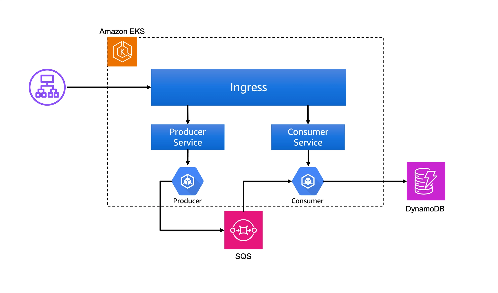

The sample tenant application comprises two primary microservices:

- **Producer**: Processes incoming API requests, generates messages, and dispatches them to a message queue.
- **Consumer**: Retrieves messages from the queue and persists the data into an Amazon DynamoDB table.

---

## Infrastructure Components

The following infrastructure components are pre-provisioned and ready for use:

| Component | Description |
| :--- | :--- |
| **Amazon EKS Cluster** | Includes essential add-ons such as **Flux CD** and **Argo Workflows**. |
| **Amazon ECR** | Centralized repository for application container images and **Helm charts**. |
| **Gitea Repositories** | Hosts GitOps release manifests, application templates, and microservices source code. |
| **AWS Resources** | Supporting infrastructure including networking and IAM required for operations. |

### Check namespaces

Access the web-based VS Code IDE, open the integrated terminal, and verify the cluster configuration by listing the available namespaces:

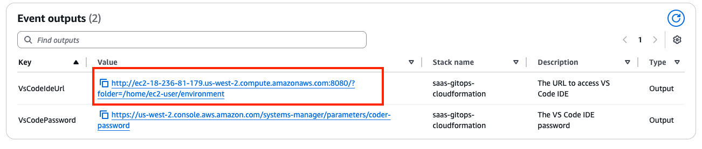

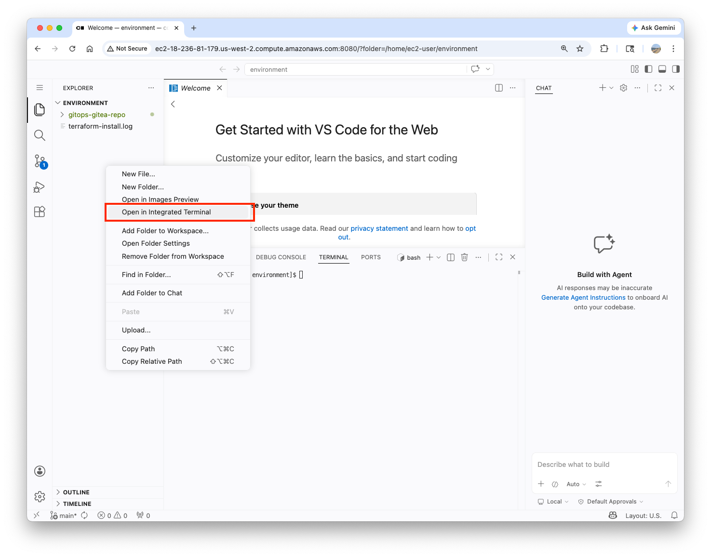

``` bash
kubectl get namespaces
NAME                 STATUS   AGE
argo-events          Active   38h
argo-workflows       Active   38h
aws-system           Active   38h
default              Active   38h
flux-system          Active   38h
karpenter            Active   38h
kube-node-lease      Active   38h
kube-public          Active   38h
kube-system          Active   38h
kubecost             Active   38h
onboarding-service   Active   38h
pool-1               Active   38h
```

### Check flux resources 

Next, browse flux resources. As the core engine of this solution, **Flux is responsible for monitoring changes in Git and ECR**, ensuring the cluster state remains synchronized with the declared configuration. Execute the following command to verify all Flux resources:

``` bash
flux get all
NAME                    REVISION                SUSPENDED       READY   MESSAGE                                             
ocirepository/capacitor v0.4.8@sha256:1efcb443  False           True    stored artifact for digest 'v0.4.8@sha256:1efcb443'

NAME                            REVISION                        SUSPENDED       READY   MESSAGE                                                      
gitrepository/flux-system       refs/heads/main@sha1:fc8b86df   False           True    stored artifact for revision 'refs/heads/main@sha1:fc8b86df'
gitrepository/terraform-v0-0-1  v0.0.1@sha1:2d19a84a            False           True    stored artifact for revision 'v0.0.1@sha1:2d19a84a'         

NAME                                    REVISION        SUSPENDED       READY   MESSAGE                                     
helmrepository/argo                     sha256:77d58f2f False           True    stored artifact: revision 'sha256:77d58f2f'
helmrepository/eks-charts               sha256:d5d7cd31 False           True    stored artifact: revision 'sha256:d5d7cd31'
helmrepository/helm-application-chart                   False           True    Helm repository is Ready                   
helmrepository/helm-tenant-chart                        False           True    Helm repository is Ready                   
helmrepository/karpenter                                False           True    Helm repository is Ready                   
helmrepository/kubecost                                 False           True    Helm repository is Ready                   
helmrepository/metrics-server           sha256:ba69c5bb False           True    stored artifact: revision 'sha256:ba69c5bb'
helmrepository/tf-controller            sha256:1fcad0f6 False           True    stored artifact: revision 'sha256:1fcad0f6'

NAME                                                    REVISION        SUSPENDED       READY   MESSAGE                                                          
helmchart/flux-system-argo-events                       2.4.3           False           True    pulled 'argo-events' chart with version '2.4.3'                 
helmchart/flux-system-argo-workflows                    0.40.11         False           True    pulled 'argo-workflows' chart with version '0.40.11'            
helmchart/flux-system-aws-load-balancer-controller      1.6.2           False           True    pulled 'aws-load-balancer-controller' chart with version '1.6.2'
helmchart/flux-system-karpenter                         1.4.0           False           True    pulled 'karpenter' chart with version '1.4.0'                   
helmchart/flux-system-kubecost                          2.1.0           False           True    pulled 'cost-analyzer' chart with version '2.1.0'               
helmchart/flux-system-metrics-server                    3.11.0          False           True    pulled 'metrics-server' chart with version '3.11.0'             
helmchart/flux-system-onboarding-service                0.0.1           False           True    pulled 'application-chart' chart with version '0.0.1'           
helmchart/flux-system-pool-1                            0.0.1           False           True    pulled 'helm-tenant-chart' chart with version '0.0.1'           
helmchart/flux-system-tf-controller                     0.16.0-rc.4     False           True    pulled 'tf-controller' chart with version '0.16.0-rc.4'         

NAME                                            LAST SCAN               SUSPENDED       READY   MESSAGE                                                
imagerepository/consumer-image-repository       2026-04-25T19:42:22Z    False           True    successful scan: found 2 tags with checksum 1926039262
imagerepository/payments-image-repository       2026-04-25T19:42:22Z    False           True    successful scan: found 2 tags with checksum 1929447139
imagerepository/producer-image-repository       2026-04-25T19:42:22Z    False           True    successful scan: found 2 tags with checksum 1927481056

NAME                                    IMAGE                                                   TAG                  READY   MESSAGE                                                                                                     
imagepolicy/consumer-image-policy       752138384284.dkr.ecr.us-west-2.amazonaws.com/consumer   prd-20260424T052402Z True    Latest image tag for 752138384284.dkr.ecr.us-west-2.amazonaws.com/consumer resolved to prd-20260424T052402Z
imagepolicy/payments-image-policy       752138384284.dkr.ecr.us-west-2.amazonaws.com/payments   prd-20260424T052344Z True    Latest image tag for 752138384284.dkr.ecr.us-west-2.amazonaws.com/payments resolved to prd-20260424T052344Z
imagepolicy/producer-image-policy       752138384284.dkr.ecr.us-west-2.amazonaws.com/producer   prd-20260424T052422Z True    Latest image tag for 752138384284.dkr.ecr.us-west-2.amazonaws.com/producer resolved to prd-20260424T052422Z

NAME                                                            LAST RUN                SUSPENDED   READY    MESSAGE               
imageupdateautomation/consumer-update-automation-pooled-envs    2026-04-25T19:38:31Z    False       True     repository up-to-date
imageupdateautomation/consumer-update-automation-tenants        2026-04-25T19:38:31Z    False       True     repository up-to-date
imageupdateautomation/payments-update-automation-pooled-envs    2026-04-25T19:41:47Z    False       True     repository up-to-date
imageupdateautomation/payments-update-automation-tenants        2026-04-25T19:38:31Z    False       True     repository up-to-date
imageupdateautomation/producer-update-automation-pooled-envs    2026-04-25T19:41:47Z    False       True     repository up-to-date
imageupdateautomation/producer-update-automation-tenants        2026-04-25T19:38:31Z    False       True     repository up-to-date

NAME                                            REVISION        SUSPENDED       READY   MESSAGE                                                                                                                     
helmrelease/argo-events                         2.4.3           False           True    Helm install succeeded for release argo-events/argo-events.v1 with chart argo-events@2.4.3                                 
helmrelease/argo-workflows                      0.40.11         False           True    Helm install succeeded for release argo-workflows/argo-workflows.v1 with chart argo-workflows@0.40.11                      
helmrelease/aws-load-balancer-controller        1.6.2           False           True    Helm install succeeded for release aws-system/aws-load-balancer-controller.v1 with chart aws-load-balancer-controller@1.6.2
helmrelease/karpenter                           1.4.0           False           True    Helm install succeeded for release karpenter/karpenter.v1 with chart karpenter@1.4.0                                       
helmrelease/kubecost                            2.1.0           False           True    Helm install succeeded for release kubecost/kubecost.v1 with chart cost-analyzer@2.1.0                                     
helmrelease/metrics-server                      3.11.0          False           True    Helm install succeeded for release kube-system/metrics-server.v1 with chart metrics-server@3.11.0                          
helmrelease/onboarding-service                  0.0.1           False           True    Helm install succeeded for release onboarding-service/onboarding-service.v1 with chart application-chart@0.0.1             
helmrelease/pool-1                              0.0.1           False           True    Helm upgrade succeeded for release pool-1/pool-1.v2 with chart helm-tenant-chart@0.0.1                                     
helmrelease/tf-controller                       0.16.0-rc.4     False           True    Helm install succeeded for release flux-system/tf-controller.v1 with chart tf-controller@0.16.0-rc.4                       

NAME                                    REVISION                        SUSPENDED       READY   MESSAGE                                         
kustomization/capacitor                 v0.4.8@sha256:1efcb443          False           True    Applied revision: v0.4.8@sha256:1efcb443       
kustomization/controlplane              refs/heads/main@sha1:fc8b86df   False           True    Applied revision: refs/heads/main@sha1:fc8b86df
kustomization/dataplane-pooled-envs     refs/heads/main@sha1:fc8b86df   False           True    Applied revision: refs/heads/main@sha1:fc8b86df
kustomization/dataplane-tenants         refs/heads/main@sha1:fc8b86df   False           True    Applied revision: refs/heads/main@sha1:fc8b86df
kustomization/dependencies              refs/heads/main@sha1:fc8b86df   False           True    Applied revision: refs/heads/main@sha1:fc8b86df
kustomization/flux-system               refs/heads/main@sha1:fc8b86df   False           True    Applied revision: refs/heads/main@sha1:fc8b86df
kustomization/infrastructure            refs/heads/main@sha1:fc8b86df   False           True    Applied revision: refs/heads/main@sha1:fc8b86df
kustomization/sources                   refs/heads/main@sha1:fc8b86df   False           True    Applied revision: refs/heads/main@sha1:fc8b86df
```

!!! note

    Key resource types and roles to identify in the output:

    | **Resource Type** | **Role** |
    | --- | --- |
    | `gitrepository` | The Git repository monitored by Flux for changes. |
    | `helmrepository` | The storage location for Helm charts (including ECR). |
    | `helmchart` | Helm charts retrieved from their respective sources. |
    | `helmrelease` | The actual deployment unit; allows a single chart to be deployed across multiple tenants. |
    | `kustomization` | A pointer to a `GitRepository` that manages Kubernetes configurations. |
    | `imagerepository` / `imagepolicy` | Automatically detects new container image tags and applies defined policies. |
    | `imageupdateautomation` | Performs automated Git commits when a new image is detected (Image Automation). |

### Configure Gitea access

Run the following script to configure Gitea-associated environment variables:
``` bash
# Get Gitea IPs from the configuration
export GITEA_PRIVATE_IP=$(kubectl get configmap saas-infra-outputs -n flux-system -o jsonpath='{.data.gitea_url}')
export GITEA_PUBLIC_IP=$(kubectl get configmap saas-infra-outputs -n flux-system -o jsonpath='{.data.gitea_public_url}')
export GITEA_PORT="3000"

# Get Gitea admin password from Systems Manager Parameter Store
export GITEA_ADMIN_PASSWORD=$(aws ssm get-parameter --name "/eks-saas-gitops/gitea-admin-password" --with-decryption --query 'Parameter.Value' --output text)

# Display access information for web browser login
echo "=== Gitea Web Interface Access ==="
echo "Public URL (for browser access): $GITEA_PUBLIC_IP"
echo "Username: admin"
echo "Password: $GITEA_ADMIN_PASSWORD"
echo "=================================="
echo ""
echo "Use the PUBLIC URL above to access Gitea from your web browser."
```

Try to access the Gitea UI with the `Public URL` in the browser.

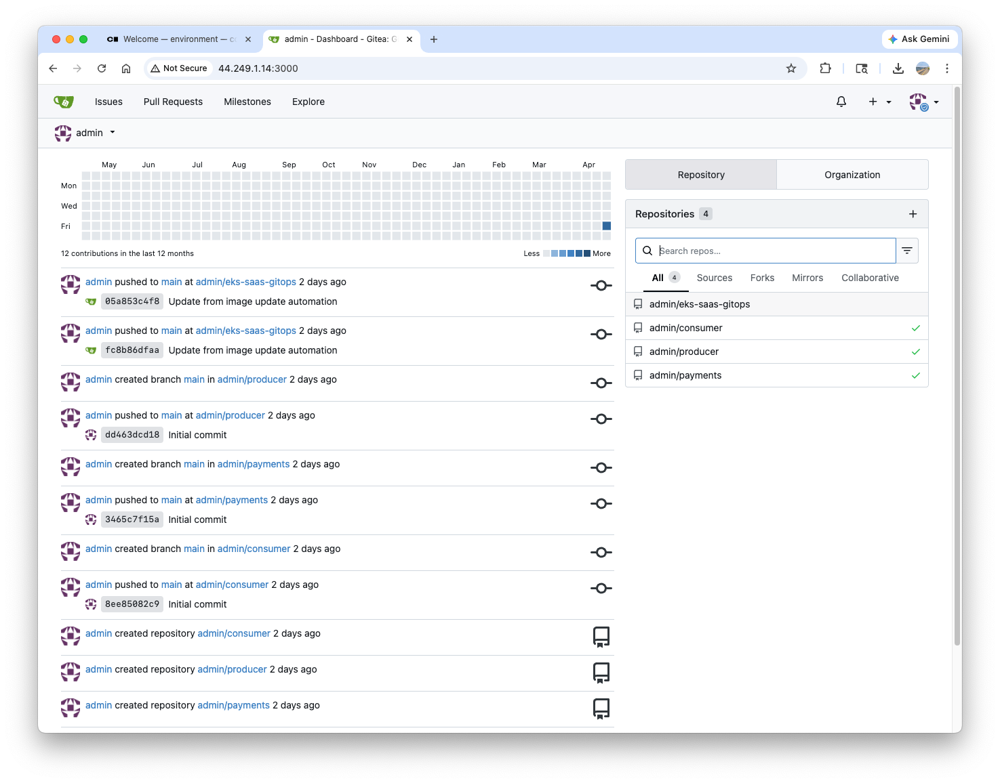

Configure additonal environment variables to access the Gitea repositories:

``` bash
# Extract Gitea configuration from ConfigMap
export GITEA_TOKEN=$(kubectl get configmap saas-infra-outputs -n flux-system -o jsonpath='{.data.gitea_token}')
# Set up the repository paths used throughout the workshop
export REPO_PATH="/home/ec2-user/environment/microservice-repos"
export GITOPS_REPO_PATH="/home/ec2-user/environment/gitops-gitea-repo"
mkdir -p $REPO_PATH
```

Clone the repositories:
``` bash
cd $REPO_PATH

# Clone the microservice repositories
git clone http://admin:${GITEA_TOKEN}@${GITEA_PRIVATE_IP}:${GITEA_PORT}/admin/producer.git
git clone http://admin:${GITEA_TOKEN}@${GITEA_PRIVATE_IP}:${GITEA_PORT}/admin/consumer.git
git clone http://admin:${GITEA_TOKEN}@${GITEA_PRIVATE_IP}:${GITEA_PORT}/admin/payments.git

tree
.
├── consumer
│   ├── Dockerfile
│   ├── consumer.py
│   └── requirements.txt
├── payments
│   ├── Dockerfile
│   ├── payments.py
│   └── requirements.txt
└── producer
    ├── Dockerfile
    ├── producer.py
    └── requirements.txt

# Verify the repositories were cloned successfully
echo "Microservice repositories:"
ls -la $REPO_PATH
echo ""
echo "GitOps repository:"
ls -la $GITOPS_REPO_PATH
```

For reference, Flux is configured to monitor changes in the Gitea repository and synchronize the cluster state accordingly:

``` bash hl_lines="3 4"
kubectl -n flux-system get gitrepository
NAME               URL                                                  AGE   READY   STATUS
flux-system        http://10.35.48.151:3000/admin/eks-saas-gitops.git   38h   True    stored artifact for revision 'refs/heads/main@sha1:fc8b86dfaad83c676afe2367d42a5c0810010344'
terraform-v0-0-1   http://10.35.48.151:3000/admin/eks-saas-gitops.git   38h   True    stored artifact for revision 'v0.0.1@sha1:2d19a84a88a6ded7c9aa8ac76508452e3f1d48b2'
```

!!! note

    1. `10.35.48.151` is `$GITEA_PRIVATE_IP`
    1. Verify both `flux-system` and `terraform-v0-0-1` are in `READY` state.

---

## Terraform & OpenTopu Controller

The application infrastructure is defined and managed using Terraform modules. The module structure within the repository is as follows:
``` bash hl_lines="6-9"
tree /home/ec2-user/environment/gitops-gitea-repo/terraform/modules/ -L 1

/home/ec2-user/environment/gitops-gitea-repo/terraform/modules/
├── codebuild
├── codepipeline
├── flux_cd           # resources to install Flux in EKS
├── gitea             # Gitea resources
├── gitops-saas-infra # resources associated with this lab
└── tenant-apps       # resources for the app
```

The focal point of this section is the `tenant-apps` module, which enables the comprehensive provisioning of **all infrastructure required for new tenant onboarding**—including **SQS queues, DynamoDB tables, and IRSA (IAM Role for Service Account)**—within a single module.

### Terraform Module Test

We will begin by manually executing the module to verify its operation. Create a test Terraform file:
``` bash
cd /home/ec2-user/environment/gitops-gitea-repo/

cat << EOF > terraform_test.tf
terraform {
  required_providers {
    aws = {
      source  = "hashicorp/aws"
      version = "5.100.0"
    }
  }
}

provider "aws" {}

module "test_tenant_apps" {
  source          = "./terraform/modules/tenant-apps"
  tenant_id       = "test"
  enable_producer = true
  enable_consumer = true
}
EOF
```

After initialization, verify the deployment plan by executing the following command:
``` bash
terraform init
terraform plan | tee -a tfplan-1.txt
...
Plan: 11 to add, 0 to change, 0 to destroy.
...
```

You can verify that 11 resources (including SQS, DynamoDB, and IAM roles) are slated for creation. Now, modify `enable_producer` to `false` and re-execute the command:
``` bash
cat << EOF > terraform_test.tf
terraform {
  required_providers {
    aws = {
      source = "hashicorp/aws"
      version = "5.100.0"
    }
  }
}

provider "aws" {}

module "test_tenant_apps" {
  source          = "./terraform/modules/tenant-apps"
  tenant_id       = "test"
  enable_producer = false
  enable_consumer = true
}
EOF
```

Execute `terraform plan`:
``` bash
terraform plan | tee -a tfplan-2.txt
...
Plan: 10 to add, 0 to change, 0 to destroy.
...
```

Compare the plan outcomes:
``` bash
diff tfplan-1.txt tfplan-2.txt 
```
!!! Question 

    How does the number of resources to be created change when `enable_producer` is set to `false`? Which specific resources were excluded from the plan?

{++

By using Terraform modules, the creation of multiple resources can be abstracted into a single module, allowing the deployment scope to be controlled via a single variable. This demonstrates the practical implementation of the **Value of Abstraction** in platform engineering.

++}

Remove the test file:
``` bash
rm -rf /home/ec2-user/environment/gitops-gitea-repo/tfplan-1.txt /home/ec2-user/environment/gitops-gitea-repo/tfplan-2.txt
```

### Tofu Controller Integration: Executing Terraform via GitOps

Up to this point, we have manually executed Terraform. We will now explore **how to fully automate this process using GitOps**. Central to this is the Terraform CRD, the Tofu controller's operational workflow is detailed below:

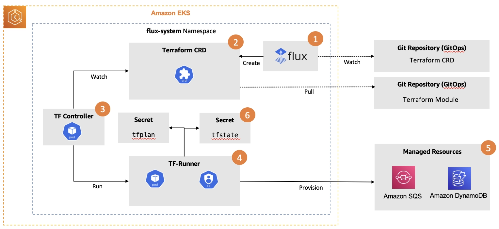

1. Add the Terraform CRD file to the Git repository (via `git push`)
1. Flux detects the change and initiates reconciliation.
1. `tf-controller` detects the Terraform CRD
1. The `tf-runner` Pod is executed and retrieves the Terraform module from Git
1. Terraform apply is performed, creating SQS, DynamoDB, and IRSA resources
1. The execution status and plan are persisted as a Kubernetes Secret

Verify that the `tf-controller` is currently running correctly:
``` bash
kubectl get pod -n flux-system -l app.kubernetes.io/instance=tf-controller
NAME                           READY   STATUS    RESTARTS   AGE
tf-controller-7b8cb5d4-59hmg   1/1     Running   0          40h
```

Create and deploy the Terraform CRD: Generate the Terraform CRD file for `example-tenant`:
``` yaml hl_lines="12 14-15 17-21"
cat << EOF > /home/ec2-user/environment/gitops-gitea-repo/application-plane/production/tenants/example-tenant-terraform-crd.yaml
---
apiVersion: infra.contrib.fluxcd.io/v1alpha2
kind: Terraform
metadata:
  name: example-tenant
  namespace: flux-system
spec:
  path: ./terraform/modules/tenant-apps
  interval: 1m
  approvePlan: auto
  destroyResourcesOnDeletion: true # (1)!
  sourceRef: # (2)!
    kind: GitRepository
    name: terraform-v0-0-1
  vars: # (3)!
    - name: tenant_id
      value: example-tenant
    - name: "enable_producer"
      value: true
    - name: "enable_consumer"
      value: true
  writeOutputsToSecret:
    name: example-tenant-infra-output
EOF
```

1.  :information_source: Associated AWS resources will be automatically decommissioned upon the deletion of this Custom Resource (CR).
2.  :information_source: The `sourceRef` attribute references the `GitRepository` object containing the Terraform resource definitions managed by the `example-tenant` Custom Resource (CR).
3.  :information_source: The `vars` section defines the input variables required by the `example-tenant` Terraform module, as illustrated in the following configuration:
    ``` terraform
    module "example-tenant" {
      source          = "./terraform/modules/tenant-apps"
      tenant_id       = "example-tenant"
      enable_producer = true
      enable_consumer = true
    }
    ```

Verify the `terraform-v0-0-1` GitRepository referenced by `sourceRef`:
``` bash hl_lines="16 20"
kubectl get GitRepository terraform-v0-0-1 -n flux-system -o yaml | grep -i spec -C10

  finalizers:
  - finalizers.fluxcd.io
  generation: 1
  labels:
    kustomize.toolkit.fluxcd.io/name: sources
    kustomize.toolkit.fluxcd.io/namespace: flux-system
  name: terraform-v0-0-1
  namespace: flux-system
  resourceVersion: "3550"
  uid: 6f08322b-c783-4523-891e-3d732502c370
spec:
  interval: 300s
  ref:
    tag: v0.0.1 # (1)!
  secretRef:
    name: flux-system
  timeout: 60s
  url: http://10.35.48.151:3000/admin/eks-saas-gitops.git # (2)!
status:
  artifact:
    digest: sha256:00cbf55dd85a7516b9a2cf826182830cfa25a8c9317670066588a8fb431921ea
```

1.  :information_source: The `v0.0.1` tag identifies the specific version of the repository to be synchronized, ensuring that infrastructure deployments are based on a stable, verified release rather than a dynamic branch.
2.  :information_source: The `eks-saas-gitops` repository serves as the source for the Terraform resource definitions referenced by the `terraform-v0-0-1` GitRepository Custom Resource (CR).


The `terraform-v0-0-1` GitRepository object references the specific `v0.0.1` tag within the `eks-saas-gitops` repository:

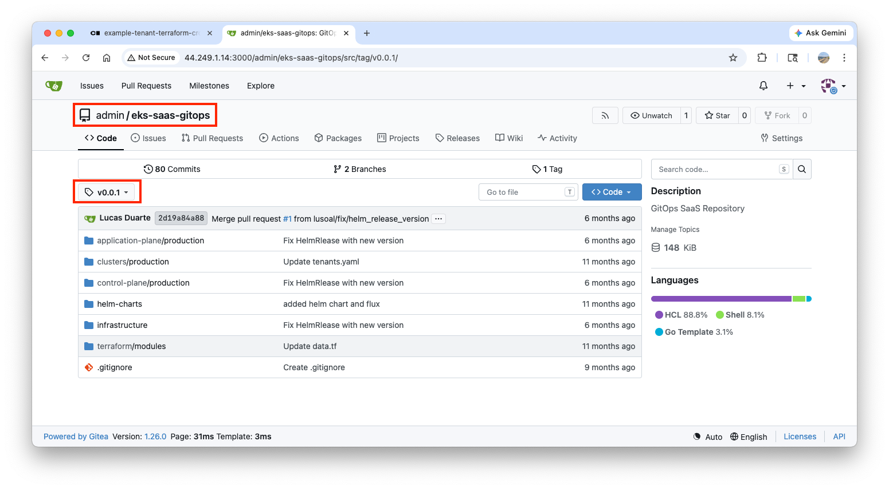

Register the new file in `kustomization.yaml` to ensure **it is recognized and managed by Flux**:
``` yaml hl_lines="8"
cat << EOF > /home/ec2-user/environment/gitops-gitea-repo/application-plane/production/tenants/kustomization.yaml
apiVersion: kustomize.config.k8s.io/v1beta1
kind: Kustomization
resources:
  - basic
  - advanced
  - premium
  - example-tenant-terraform-crd.yaml
EOF
```

Commit and push the changes:
``` bash
cd /home/ec2-user/environment/gitops-gitea-repo/
git pull origin main
git status
git add .
git commit -am "Added example terraform CRD for testing"
git push origin main
```

Verify that the commit has been successfully registered within the remote repository:

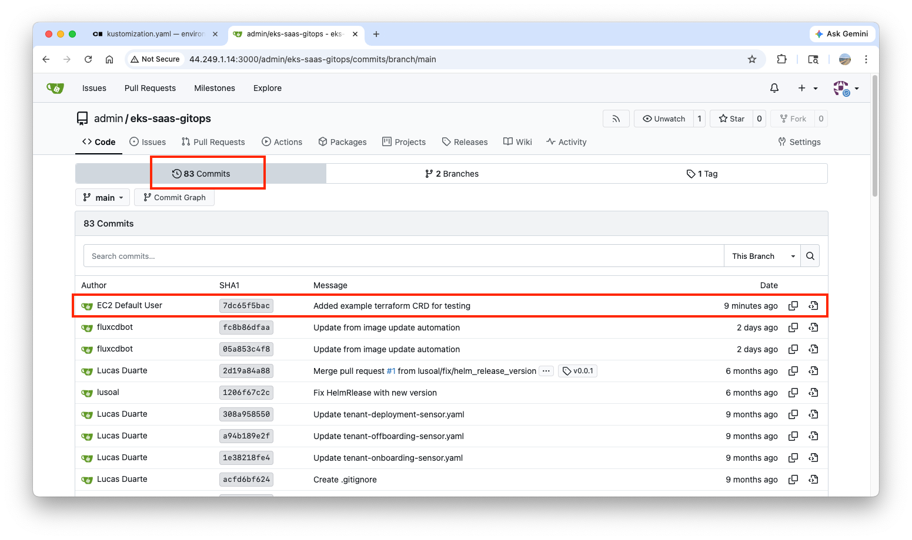


Manually trigger a synchronization to expedite the detection of changes:
``` bash
flux reconcile source git flux-system

► annotating GitRepository flux-system in flux-system namespace
✔ GitRepository annotated
◎ waiting for GitRepository reconciliation
✔ fetched revision refs/heads/main@sha1:7dc65f5bacefda28b2262b7b1aec392d7b6d025e
```

Verify that the `tf-runner` Pod has been created and is running, and monitor the execution logs:
``` bash hl_lines="7"
kubectl get po -n flux-system
NAME                                           READY   STATUS      RESTARTS       AGE
capacitor-dc778678d-x5vpq                      1/1     Running     34 (30m ago)   43h
ecr-credentials-sync-29619435-hrvxd            0/1     Completed   0              5m14s
ecr-credentials-sync-29619440-jfmqz            0/1     Init:0/1    0              14s
...
pool-1-tf-runner                               1/1     Running     0              31s
...

kubectl logs -n flux-system -l app.kubernetes.io/name=tf-runner -f
...
Apply complete! Resources: 11 added, 0 changed, 0 destroyed.
...
```

- [x] Confirm the successful creation of **DynamoDB tables** and **SQS queues** following the `consumer-example-tenant-*` naming convention:

=== "DynamoDB"

    ``` bash hl_lines="4"
    aws dynamodb list-tables
    {
        "TableNames": [
            "consumer-example-tenant-zkh",
            "consumer-pool-1-rr5"
        ]
    }
    ```

    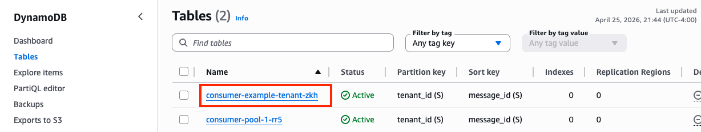
  
=== "SQS"

    ``` bash hl_lines="7"
    aws sqs list-queues
    {
        "QueueUrls": [
            "https://sqs.us-west-2.amazonaws.com/752138384284/argoworkflows-deployment-queue",
            "https://sqs.us-west-2.amazonaws.com/752138384284/argoworkflows-offboarding-queue",
            "https://sqs.us-west-2.amazonaws.com/752138384284/argoworkflows-onboarding-queue",
            "https://sqs.us-west-2.amazonaws.com/752138384284/consumer-example-tenant-zkh",
            "https://sqs.us-west-2.amazonaws.com/752138384284/consumer-pool-1-rr5",
            "https://sqs.us-west-2.amazonaws.com/752138384284/eks-saas-gitops"
        ]
    }
    ```

    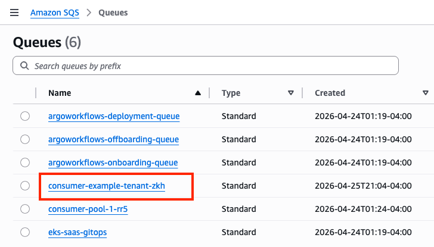

Now, remove `example-tenant-terraform-crd.yaml` from the Flux-managed resource list to initiate the decommissioning process:
``` bash
cat << EOF > /home/ec2-user/environment//gitops-gitea-repo/application-plane/production/tenants/kustomization.yaml
apiVersion: kustomize.config.k8s.io/v1beta1
kind: Kustomization
resources:
    - basic
    - advanced
    - premium
EOF
```

Commit and push the changes:
``` bash
cd /home/ec2-user/environment/gitops-gitea-repo/
git pull origin main
git add .
git commit -m "Removed Terraform CRD and reference from kustomization.yaml"
git push origin main
```

Monitor the `tf-runner` Pod logs to observe the `terraform destroy` execution process:
``` bash
flux reconcile source git flux-system

► annotating GitRepository flux-system in flux-system namespace
✔ GitRepository annotated
◎ waiting for GitRepository reconciliation
✔ fetched revision refs/heads/main@sha1:2fbbb6862dc7449099a0a43de27b85c12997dfd6

kubectl logs po/example-tenant-tf-runner -nflux-system -f
...
Apply complete! Resources: 0 added, 0 changed, 11 destroyed.
...
```

Verify the destruction of the resources:
``` bash
aws dynamodb list-tables
{
    "TableNames": [
        "consumer-pool-1-rr5"
    ]
}

aws sqs list-queues
{
    "QueueUrls": [
        "https://sqs.us-west-2.amazonaws.com/752138384284/argoworkflows-deployment-queue",
        "https://sqs.us-west-2.amazonaws.com/752138384284/argoworkflows-offboarding-queue",
        "https://sqs.us-west-2.amazonaws.com/752138384284/argoworkflows-onboarding-queue",
        "https://sqs.us-west-2.amazonaws.com/752138384284/consumer-pool-1-rr5",
        "https://sqs.us-west-2.amazonaws.com/752138384284/eks-saas-gitops"
    ]
}
```

!!! note "The execution results of the `terraform plan` and `terraform apply` operations are persisted within a Kubernetes Secret."

    ``` bash
    kubectl get secret -n flux-system | grep -E 'tfplan|tfstate'
    tfplan-default-pool-1                      Opaque                                1      44h
    tfstate-default-example-tenant             Opaque                                1      73m
    tfstate-default-pool-1                     Opaque                                1      44h
    ```

### Summary

The following points summarize the key concepts covered in this lab:

| **Phase** | **Tools** | **Core Concept** | **Key Takeaways** |
| --- | --- | --- | --- |
| **Terraform Module Testing** | Terraform | Infrastructure Abstraction | Controlling resource provisioning scope via module variables. |
| **Tofu Controller Integration** | Flux + Terraform CRD | IaC Automation with GitOps | Automating AWS infrastructure provisioning through Git file updates. |
| **Helm Chart Testing** | Helm | Application Packaging | Managing deployment configurations using `values.yaml`. |
| **HelmRelease Deployment** | Flux + HelmRelease | App Deployment with GitOps | Enabling declarative deployment management based on ECR-hosted charts. |

💡 **Core Pattern:** Every process follows a consistent workflow.

*   **Add/Modify file in Git** → `git push` → Flux detects change → Automatic application
*   **Delete file in Git** → `git push` → Flux detects change → Automatic resource cleanup

This is exactly how "**Self-Service Infrastructure**" operates within the realm of Platform Engineering!

---

## Helm Chart

### Helm Chart Structure

Helm charts serve as the standard packaging tool for defining, installing, and managing Kubernetes applications. The directory structure for the charts utilized in this lab is as follows:

``` bash
tree /home/ec2-user/environment/gitops-gitea-repo/helm-charts/

/home/ec2-user/environment/gitops-gitea-repo/helm-charts/
├── application-chart           # Common infrastructure components (tenant-agnostic)
└── helm-tenant-chart           # Tenant-specific services (Producer + Consumer)
    ├── Chart.yaml              # Chart metadata, including versioning and description
    ├── templates               # Kubernetes manifest templates for resource generation
    │   ├── deployment.yaml
    │   ├── hpa.yaml
    │   ├── ingress.yaml
    │   ├── service.yaml
    │   ├── serviceaccount.yaml
    │   └── terraform.yaml
    ├── values.yaml             # Default configuration values
    └── values.yaml.template
```

### Executing the Helm Chart for tenant-specific services

The `helm template` command allows for the preview of generated Kubernetes manifests without initiating an actual deployment. Create a test values file:
``` yaml
cat << EOF > /home/ec2-user/environment/gitops-gitea-repo/helm-charts/helm-tenant-chart/test-values.yaml
tenantId: "example-tenant"

apps:
  producer:
    enabled: true

  consumer:
    enabled: true
EOF
```

Render the manifests:
``` bash
helm template example-tenant ./helm-charts/helm-tenant-chart --values ./helm-charts/helm-tenant-chart/test-values.yaml

---
# Source: helm-tenant-chart/templates/serviceaccount.yaml
apiVersion: v1
kind: ServiceAccount
...
---
# Source: helm-tenant-chart/templates/serviceaccount.yaml
apiVersion: v1
kind: ServiceAccount
...
---
# Source: helm-tenant-chart/templates/service.yaml
apiVersion: v1
kind: Service
...
```

Change `producer.enabled` to `false`:
``` yaml
cat << EOF > /home/ec2-user/environment/gitops-gitea-repo/helm-charts/helm-tenant-chart/test-values.yaml
tenantId: "example-tenant"

apps:
  producer:
    enabled: false

  consumer:
    enabled: true
EOF
```

Render the manifests:
``` bash
helm template example-tenant ./helm-charts/helm-tenant-chart --values ./helm-charts/helm-tenant-chart/test-values.yaml

---
# Source: helm-tenant-chart/templates/serviceaccount.yaml
apiVersion: v1
kind: ServiceAccount
...
---
# Source: helm-tenant-chart/templates/service.yaml
apiVersion: v1
kind: Service
...
```

!!! warning

    Even when `producer.enabled` is set to `false`, the Ingress routing rules remain active. This is an intentional design choice: {++ if a tenant does not have a dedicated Producer, requests are automatically routed to a shared Pool Producer. This routing strategy—providing a fallback mechanism to shared or pooled producer services even when a tenant-specific producer is disabled ++}—will be explored in greater detail in the subsequent section on SaaS tiering strategies.


Remove the `test-values.yaml`:
``` bash
rm -rf /home/ec2-user/environment/gitops-gitea-repo/helm-charts/helm-tenant-chart/test-values.yaml
```

---

## Helm Chart and Flux Integration

### Verifying Helm Charts Packaged in ECR

Helm deployments managed by Flux are based on packaged charts stored in Amazon ECR. We will first verify the charts that have already been packaged:
``` bash hl_lines="17"
# Get values from configmap
AWS_ACCOUNT_ID=$(kubectl get configmap saas-infra-outputs -n flux-system -o jsonpath='{.data.account_id}')
ECR_HELM_CHART_URL=$(kubectl get configmap saas-infra-outputs -n flux-system -o jsonpath='{.data.ecr_helm_chart_url}')
ECR_REGISTRY=$(echo $ECR_HELM_CHART_URL | cut -d'/' -f1)
ECR_REPOSITORY=$(echo $ECR_HELM_CHART_URL | cut -d'/' -f2-)
AWS_REGION=$(echo $ECR_HELM_CHART_URL | cut -d'.' -f4)

# Authenticate Docker to ECR
aws ecr get-login-password --region $AWS_REGION | docker login --username AWS --password-stdin $ECR_REGISTRY

# List artifacts (images) in the ECR repository
aws ecr list-images --repository-name $ECR_REPOSITORY --region $AWS_REGION
{
    "imageIds": [
        {
            "imageDigest": "sha256:1105a889ceecf91e7609187b4013824cb99d57d2b5700a09472e6197d6871e2e",
            "imageTag": "0.0.1" # (1)!
        }
    ]
}
```

1.  :information_source: Following the ECR authentication, you can verify that the Helm chart with the `0.0.1` tag has been successfully packaged.


??? Example "Packaging the local Helm chart"

    1. Move to the chart directory:
    ``` bash
    cd $GITOPS_REPO_PATH//helm-charts/helm-tenant-chart
    ```

    2. Packaging the chart:
    ``` bash
    helm package . --version 0.0.1-test
    ```

    3. Configure environment variables using values from ConfigMap:
    ``` bash
    AWS_ACCOUNT_ID=$(kubectl get configmap saas-infra-outputs -n flux-system -o jsonpath='{.data.account_id}')
    ECR_HELM_CHART_URL=$(kubectl get configmap saas-infra-outputs -n flux-system -o jsonpath='{.data.ecr_helm_chart_url}')
    ECR_REGISTRY=$(echo $ECR_HELM_CHART_URL | cut -d'/' -f1)
    ECR_REPOSITORY=$(echo $ECR_HELM_CHART_URL | cut -d'/' -f2-)
    AWS_REGION=$(echo $ECR_HELM_CHART_URL | cut -d'.' -f4)
    ```

    4. ECR Authentication
    ``` bash
    # aws ecr get-login-password --region $AWS_REGION | docker login --username AWS --password-stdin $ECR_REGISTRY
    aws ecr get-login-password --region $AWS_REGION | helm registry login --username AWS --password-stdin $ECR_REGISTRY
    ```

    5. Push the packaged chart to ECR
    ``` bash
    helm push ./helm-tenant-chart-0.0.1-test.tgz oci://$(echo $ECR_HELM_CHART_URL | cut -d'/' -f1)/gitops-saas
    Pushed: 752138384284.dkr.ecr.us-west-2.amazonaws.com/gitops-saas/helm-tenant-chart:0.0.1-test
    Digest: sha256:c7f8f538809458fee9c6d4a04d8de65c42859b269dd7a7e6004055934770a32c
    ```

    6. Verify the upload:
    ``` bash
    aws ecr list-images --repository-name $ECR_REPOSITORY --region $AWS_REGION
    {
        "imageIds": [
            {
                "imageDigest": "sha256:1105a889ceecf91e7609187b4013824cb99d57d2b5700a09472e6197d6871e2e",
                "imageTag": "0.0.1"
            },
            {
                "imageDigest": "sha256:c7f8f538809458fee9c6d4a04d8de65c42859b269dd7a7e6004055934770a32c",
                "imageTag": "0.0.1-test"
            }
        ]
    }
    ```

    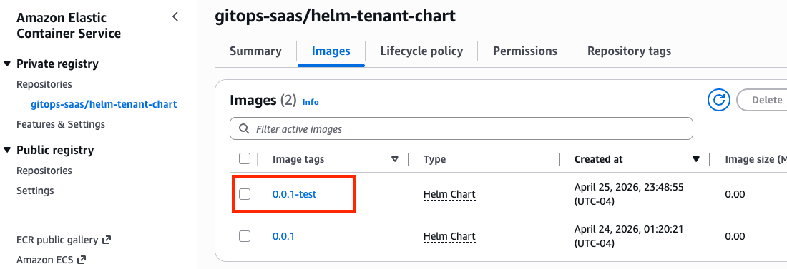

### HelmRelease Concept

`HelmRelease` is a Custom Resource Definition (CRD) provided by Flux that enables the declarative management of Helm releases. By defining a Helm release within a YAML file, Flux can automatically orchestrate the deployment and subsequent update processes.

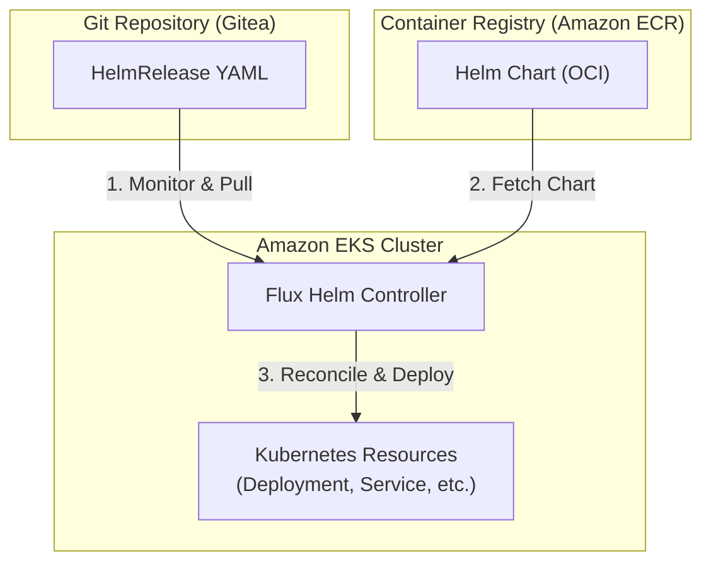

Verify the deployed `HelmRepository` resources:
``` bash
kubectl get HelmRepository -n flux-system | grep -i helm-tenant-chart
helm-tenant-chart        oci://752138384284.dkr.ecr.us-west-2.amazonaws.com/gitops-saas/   46h  
```

Create a new `HelmRelease`:
``` yaml
cat << EOF > /home/ec2-user/environment/gitops-gitea-repo/application-plane/production/tenants/example-tenant-helmrelease.yaml
apiVersion: v1
kind: Namespace
metadata:
  name: example-tenant
---
apiVersion: helm.toolkit.fluxcd.io/v2
kind: HelmRelease
metadata:
  name: example-tenant-premium
  namespace: flux-system
spec:
  releaseName: example-tenant-premium
  targetNamespace: example-tenant
  storageNamespace: example-tenant
  interval: 1m0s
  chart:
    spec:
      chart: helm-tenant-chart
      version: "0.x"
      sourceRef:
        kind: HelmRepository
        name: helm-tenant-chart
  values:
    tenantId: example-tenant
    apps:
      producer:
        enabled: true
      consumer:
        enabled: true
EOF
```

Configure the kustomization.yaml file to reference the newly added files:
``` bash
cat << EOF >> /home/ec2-user/environment/gitops-gitea-repo/application-plane/production/tenants/kustomization.yaml
    - example-tenant-helmrelease.yaml
EOF
```

Commit and push:
``` bash
cd /home/ec2-user/environment/gitops-gitea-repo/
git pull origin main
git add .
git commit -m "Added HelmRelease for example-tenant"
git push origin main
```

Flux Reconcilication:
``` bash
flux reconcile source git flux-system
```

Verify logs:
``` bash
kubectl logs po/example-tenant-tf-runner -n flux-system -f

...
Apply complete! Resources: 11 added, 0 changed, 0 destroyed.
...
```

Verify the outcomes:

- [x] a new `secret` is deployed:
  ``` bash
  kubectl get secret -n flux-system -w
  ...
  tfplan-default-example-tenant              Opaque                                1      103s
  ...
  ```

- [x] `example-tenant` namespace is created:
  ``` bash hl_lines="7"
  kubectl get namespaces
  NAME                 STATUS   AGE
  argo-events          Active   46h
  argo-workflows       Active   46h
  aws-system           Active   46h
  default              Active   47h
  example-tenant       Active   5m14s
  ...
  ```

- [x] Producer and Consumer workloads are running:
  ``` bash
  kubectl get all -n example-tenant

  NAME                                           READY   STATUS    RESTARTS   AGE
  pod/example-tenant-consumer-bbf477498-8glj9    1/1     Running   0          6m45s
  pod/example-tenant-consumer-bbf477498-pn59p    1/1     Running   0          6m44s
  pod/example-tenant-consumer-bbf477498-r9k72    1/1     Running   0          6m44s
  pod/example-tenant-producer-5c84579c54-6nw26   1/1     Running   0          6m44s
  pod/example-tenant-producer-5c84579c54-pz4br   1/1     Running   0          6m45s
  pod/example-tenant-producer-5c84579c54-xgt5z   1/1     Running   0          6m44s

  NAME                              TYPE        CLUSTER-IP       EXTERNAL-IP   PORT(S)   AGE
  service/example-tenant-consumer   ClusterIP   172.20.115.119   <none>        80/TCP    6m45s
  service/example-tenant-producer   ClusterIP   172.20.221.110   <none>        80/TCP    6m45s

  NAME                                      READY   UP-TO-DATE   AVAILABLE   AGE
  deployment.apps/example-tenant-consumer   3/3     3            3           6m45s
  deployment.apps/example-tenant-producer   3/3     3            3           6m45s

  NAME                                                 DESIRED   CURRENT   READY   AGE
  replicaset.apps/example-tenant-consumer-bbf477498    3         3         3       6m45s
  replicaset.apps/example-tenant-producer-5c84579c54   3         3         3       6m45s
  ```

Remove the `helmRelease` file and update `kustomization.yaml`:

``` bash
rm /home/ec2-user/environment/gitops-gitea-repo/application-plane/production/tenants/example-tenant-helmrelease.yaml
sed -i '/example-tenant-helmrelease.yaml/d' /home/ec2-user/environment/gitops-gitea-repo/application-plane/production/tenants/kustomization.yaml
```

Git commit and push:
``` bash
cd /home/ec2-user/environment/gitops-gitea-repo/
git pull origin main
git add .
git commit -m "Removed HelmRelease for example-tenant"
git push origin main
```

Flux reconciliation and watch logs:
``` bash
flux reconcile source git flux-system
kubectl logs po/example-tenant-tf-runner -n flux-system -f
```

Verify the resources are removed:
``` bash
kubectl get namespaces
kubectl get all -n example-tenant
aws dynamodb list-tables
aws sqs list-queues
```

## Summary

The following points summarize the key concepts covered in this lab:

| **Phase** | **Tools** | **Core Concept** | **Key Takeaways** |
| --- | --- | --- | --- |
| **Terraform Module Testing** | Terraform | Infrastructure Abstraction | Controlling resource provisioning scope via module variables. |
| **Tofu Controller Integration** | Flux + Terraform CRD | IaC Automation with GitOps | Automating AWS infrastructure provisioning through Git file updates. |
| **Helm Chart Testing** | Helm | Application Packaging | Managing deployment configurations using `values.yaml`. |
| **HelmRelease Deployment** | Flux + HelmRelease | App Deployment with GitOps | Enabling declarative deployment management based on ECR-hosted charts. |

💡 **Core Pattern:** Every process follows a consistent workflow.

*   **Add/Modify file in Git** → `git push` → Flux detects change → Automatic application
*   **Delete file in Git** → `git push` → Flux detects change → Automatic resource cleanup

This is exactly how "**Self-Service Infrastructure**" operates within the realm of Platform Engineering!