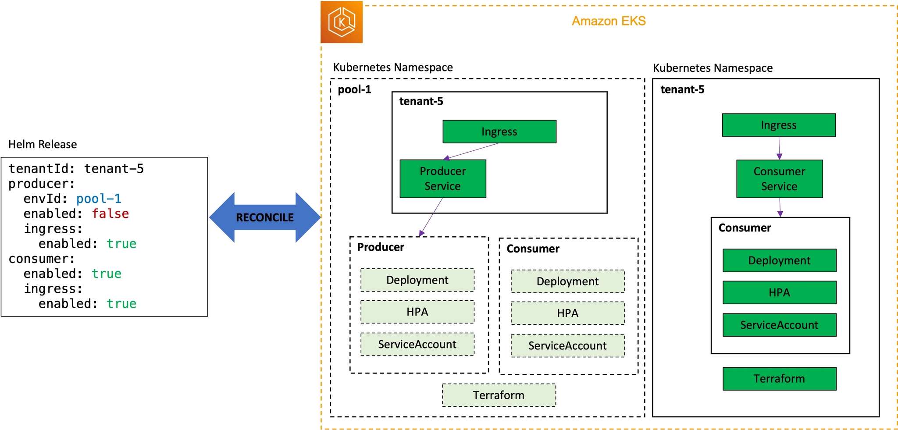
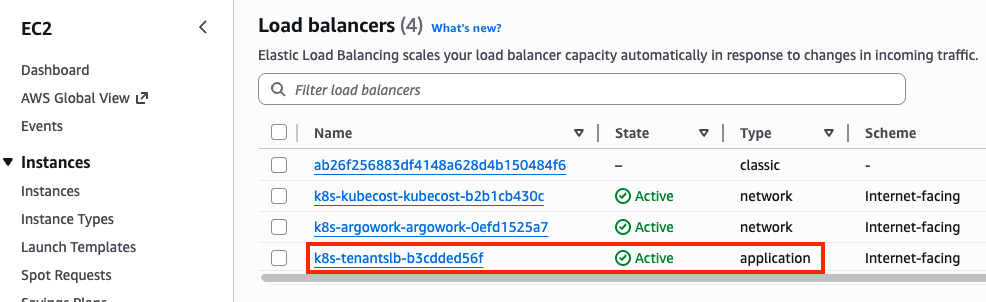
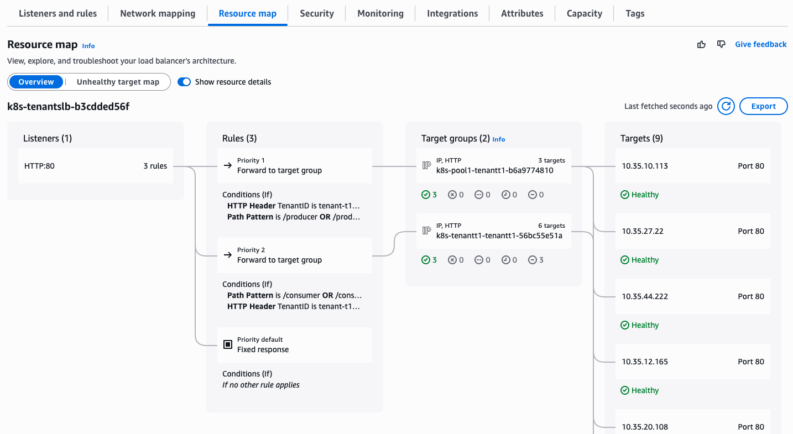

# Lab 2: Saas Tier Strategy

<!-- !!! info "Source Attribution"

    The primary source and original content for this debugging guide originate from the **Engineering Playbook** by DevFloor9.

    *   **Website:** [devfloor9.github.io/engineering-playbook](https://devfloor9.github.io/engineering-playbook/)
    *   **Repository:** [github.com/devfloor9/engineering-playbook](https://github.com/devfloor9/engineering-playbook) -->

SaaS applications typically adopt a **Tier** structure to support diverse customer segments. Each tier provides distinct pricing and service experiences, and this tiering strategy directly impacts the cost, operations, management, and stability of the SaaS solution.

In this lab, we will explore how to implement a tiering strategy tailored to each tenant's service level using **Helm Release templates**. By utilizing the same Helm chart while configuring different `values` for each tier, we ensure that each tenant's Kubernetes resources are deployed precisely according to their service level requirements.

---

## Browse Tier Template

Tenant applications are packaged into a single Helm chart and leverage the Tofu controller and Terraform CRDs to deploy the necessary microservices and infrastructure. Depending on the tenant's tier, specific components are deployed in different ways; these variations are defined by the **Tier Templates**.

`tier-template` directory structure:
``` bash
tree /home/ec2-user/environment/gitops-gitea-repo/application-plane/production/tier-templates

/home/ec2-user/environment/gitops-gitea-repo/application-plane/production/tier-templates
├── advanced_tenant_template.yaml
├── basic_env_template.yaml
├── basic_tenant_template.yaml
└── premium_tenant_template.yaml
```

### Basic vs Premium Tier Comparison
Distinct tier characteristics are implemented by applying different `values` configurations to the same Helm chart:

| Component | Basic Tier | Premium Tier |
| :--- | :--- | :--- |
| **Deployment Model** | Pool (Shared) | Silo (Dedicated) |
| **Kubernetes Namespace** | `pool-1` (Shared) | Tenant-specific |
| **Producer** | Shared (`pool-1`) | Dedicated deployment |
| **Consumer** | Shared (`pool-1`) | Dedicated deployment |
| **SQS Queue** | Shared | Dedicated |
| **DynamoDB Table** | Shared | Dedicated |
| **Ingress** | Tenant-specific routing only | Dedicated |
| **Cost** | Low | High |
| **Isolation Level** | Low | High |

---

## Advanced Tier Definition

We will now design and implement an **Advanced Tier** to accommodate the requirements of a new customer segment.

**Advanced Tier Design Principles:**

- **Producer**: Shared (leveraging the `pool-1` environment) → Ideal for workloads with relatively uniform request patterns.
- **Consumer**: Dedicated (deployed in a tenant-specific namespace) → Necessary for data processing isolation.
- **Goal**: Effectively combine the advantages of the Silo (Dedicated) and Pool (Shared) models to align with specific usage patterns.



### Advanced Tier Template

Generate the **Advanced Tier Template** by applying the following three modifications to the **Premium Tier Template**:

- `releaseName`: Change from `premium` to `advanced`.
- `producer.enabled`: Change from `true` to `false` (to leverage the shared resource pool).
- `producer.envId`: Set to `pool-1` (to designate the routing target for the pooled producer).

``` bash hl_lines="26-30"
cat << EOF > /home/ec2-user/environment/gitops-gitea-repo/application-plane/production/tier-templates/advanced_tenant_template.yaml
apiVersion: v1
kind: Namespace
metadata:
  name: {TENANT_ID}
---
apiVersion: helm.toolkit.fluxcd.io/v2
kind: HelmRelease
metadata:
  name: {TENANT_ID}-advanced
  namespace: flux-system
spec:
  releaseName: {TENANT_ID}-advanced
  targetNamespace: {TENANT_ID}  # Deploying into the tenant-specific namespace
  interval: 1m0s
  chart:
    spec:
      chart: helm-tenant-chart
      version: "{RELEASE_VERSION}.x"
      sourceRef:
        kind: HelmRepository
        name: helm-tenant-chart
  values:
    tenantId: {TENANT_ID}
    apps:
      producer:
        envId: pool-1
        enabled: false # Pool deployment -- advanced tier shares resources with other tenants
        ingress:
          enabled: true
      consumer:
        enabled: true  # Silo deployment -- advanced tier has a dedicated deployment for each tenant
        ingress:
          enabled: true
        image:
          tag: "0.1" # {"\$imagepolicy": "flux-system:consumer-image-policy:tag"}
EOF
```

Create `advanced` directory to add a new tenant:
``` bash
mkdir -p /home/ec2-user/environment/gitops-gitea-repo/application-plane/production/tenants/advanced
```

### Manual Tenant onboarding Process

We will first examine the manual tenant onboarding process. Create a new tenant configuration file by duplicating `advanced_tenant_template.yaml` and replacing the placeholder variables with their actual values:

``` bash
export TENANT_ID=tenant-t1d6c
export RELEASE_VERSION=0.0

cd /home/ec2-user/environment/gitops-gitea-repo/application-plane/production/
cp tier-templates/advanced_tenant_template.yaml tenants/advanced/$TENANT_ID.yaml

sed -i "s|{TENANT_ID}|$TENANT_ID|g" "tenants/advanced/$TENANT_ID.yaml"
sed -i "s|{RELEASE_VERSION}|$RELEASE_VERSION|g" "tenants/advanced/$TENANT_ID.yaml"
```

Create a `kustomization.yaml` file that references the Helm release for the new tenant:
``` yaml
cat << EOF > tenants/advanced/kustomization.yaml
apiVersion: kustomize.config.k8s.io/v1beta1
kind: Kustomization
resources:
  - $TENANT_ID.yaml
EOF
```

Git commit and push:
``` bash
cd /home/ec2-user/environment/gitops-gitea-repo/
git pull origin main
git add .
git commit -am "Adding tenant-t1d6c with Advanced Tier"
git push origin main
```

Flux reconcile:
``` bash
flux reconcile source git flux-system
```

Verify `consumer` Deployment in `tenant-t1d6c` namespace:
``` bash
kubectl get deployment -n tenant-t1d6c
NAME                    READY   UP-TO-DATE   AVAILABLE   AGE
tenant-t1d6c-consumer   0/3     3            0           79s
```

Verify the new DynamoDB table and SQS queue:
``` bash
aws dynamodb list-tables | grep tenant-t1d6c
aws sqs list-queues | grep tenant-t1d6c

        "consumer-tenant-t1d6c-j53"
        "https://sqs.us-west-2.amazonaws.com/752138384284/consumer-tenant-t1d6c-j53",
```

Verify that the application is running correctly by sending a sample request:
``` bash hl_lines="5-11 13-19"
APP_LB=http://$(kubectl get ingress -n tenant-t1d6c -o json | jq -r .items[0].status.loadBalancer.ingress[0].hostname)
echo $APP_LB # ALB access domain
http://k8s-tenantslb-b3cdded56f-1100564342.us-west-2.elb.amazonaws.com

curl -s -H "tenantID: tenant-t1d6c" $APP_LB/producer | jq
{
  "environment": "pool-1",
  "microservice": "producer",
  "tenant_id": "tenant-t1d6c",
  "version": "0.0.1"
}

curl -s -H "tenantID: tenant-t1d6c" $APP_LB/consumer | jq
{
  "environment": "tenant-t1d6c",
  "microservice": "consumer",
  "tenant_id": "tenant-t1d6c",
  "version": "0.0.1"
}
```

!!! success 

The `environment` field confirms that the core characteristics of the Advanced Tier have been accurately implemented:

- Producer → `pool-1` (shard environment)
- Consumer → `tenant-t1d6c` (isolated environment)





## Summary

In this lab, we have demonstrated that **Helm Release templates** serve as a pivotal mechanism for implementing a SaaS tiering strategy. The configurations for the three tiers are summarized as follows:

| Tier | Producer | Consumer | Infrastructure | Cost | Isolation Level |
| :--- | :--- | :--- | :--- | :--- | :--- |
| **Basic** | Shared (`pool-1`) | Shared (`pool-1`) | Shared | Low | Low |
| **Advanced** | Shared (`pool-1`) | Dedicated | Dedicated Consumer | Medium | Medium |
| **Premium** | Dedicated | Dedicated | Dedicated | High | High |

💡 **Core Pattern:** All tiers leverage the **exact same Helm chart**, with the specific deployment model determined solely through `values` configurations. Consequently, adding a new tier is as simple as defining a single new template file.