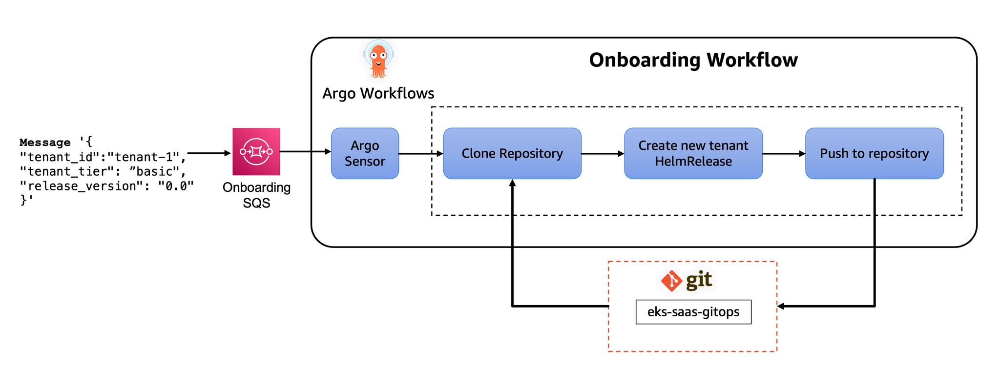
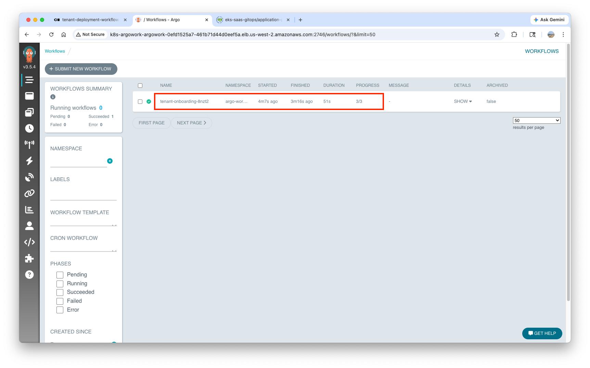
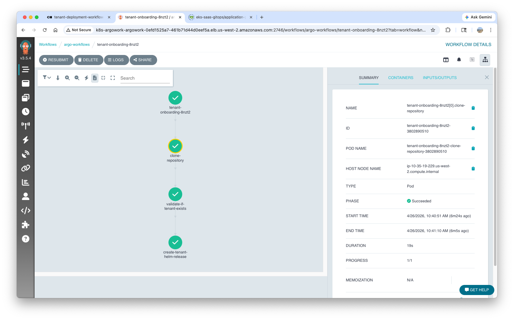
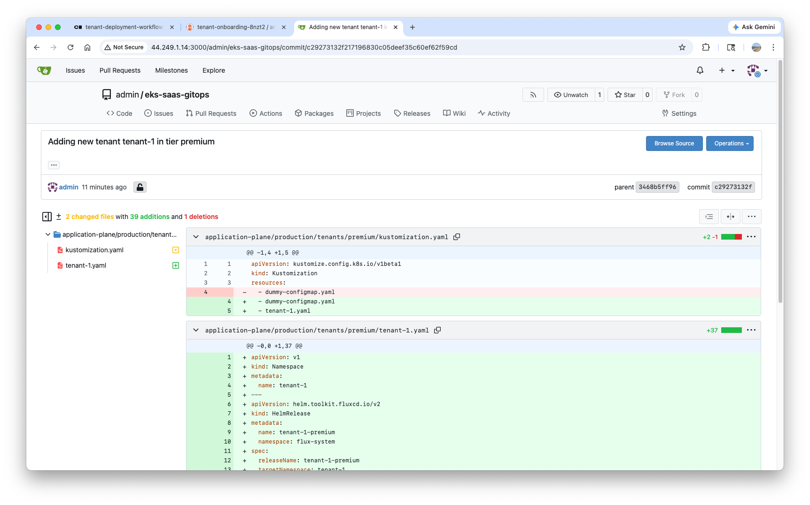
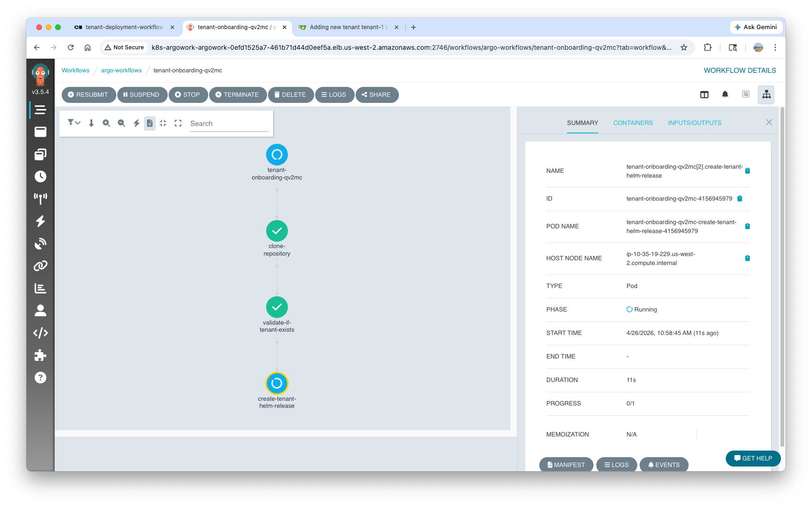
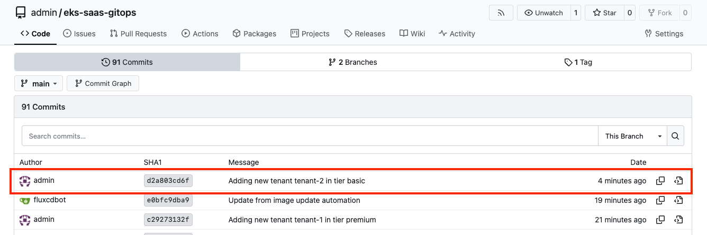
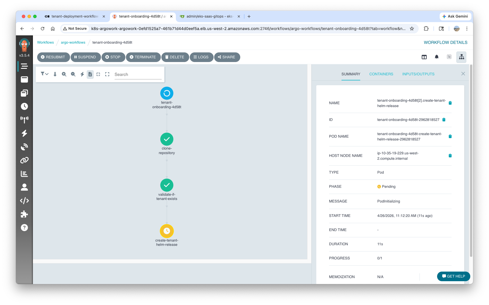
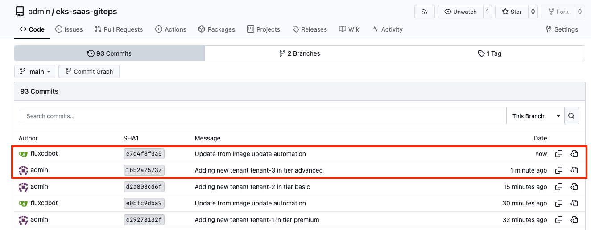
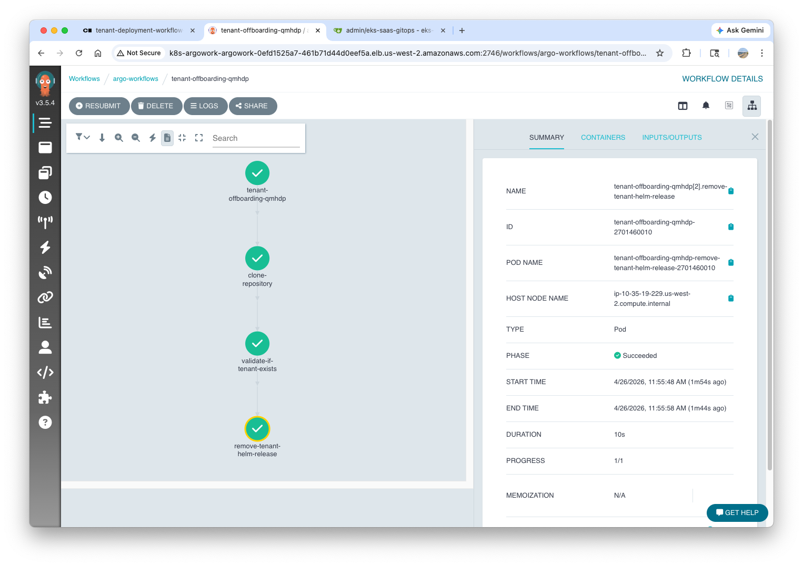
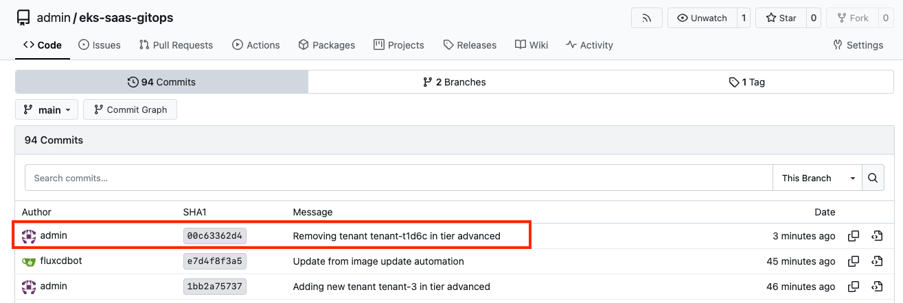

# Lab 3: Automatic Tenant Onboarding

<!-- !!! info "Source Attribution"

    The primary source and original content for this debugging guide originate from the **Engineering Playbook** by DevFloor9.

    *   **Website:** [devfloor9.github.io/engineering-playbook](https://devfloor9.github.io/engineering-playbook/)
    *   **Repository:** [github.com/devfloor9/engineering-playbook](https://github.com/devfloor9/engineering-playbook) -->

In this lab, we will explore how to fully automate this process using **Argo Workflows**. The core of this automation is an **event-driven architecture**, where the entire onboarding pipeline is triggered by a single SQS message.


!!! Abstract "The Role of Argo Workflows"

    Its primary function is to automate the manual steps demonstrated in Lab 1: duplicating templates, performing variable substitution, and executing Git commits and pushes. Once the changes are committed to Git, **Flux v2** continues to manage the subsequent deployment of resources to the EKS cluster.

## Argo Workflows Templates

Three workflow templates have been pre-configured:
``` bash
kubectl get workflowtemplates -n argo-workflows
NAME                          AGE
tenant-deployment-template    2d8h
tenant-offboarding-template   2d8h
tenant-onboarding-template    2d8h
```

| **Workflow Template** | **Role** |
| :--- | :--- |
| `onboarding` | Provisions new tenants into the environment. |
| `offboarding` | Decommissions existing tenants from the environment. |
| `deployment` | Orchestrates version updates for tenant `HelmRelease` objects. |

### Onboarding Workflows




1. Receive SQS Message (Argo Events + Sensor)
1. Trigger Onboarding Workflow
1. Clone Gitea Repository
1. Generate Tenant `HelmRelease` File based on Tier Template
  - (Basic / Advanced / Premium)
1. Git Commit & Push
1. `Flux v2` Detects Changes → Deploy Resources to EKS

The complete workflow definition files can be found at the following path:
``` bash
tree /home/ec2-user/environment/gitops-gitea-repo/control-plane/production/workflows/

/home/ec2-user/environment/gitops-gitea-repo/control-plane/production/workflows/
├── event-bus.yaml
├── kustomization.yaml
├── tenant-deployment-sensor.yaml
├── tenant-deployment-workflow-template.yaml
├── tenant-offboarding-sensor.yaml
├── tenant-offboarding-workflow-template.yaml
├── tenant-onboarding-sensor.yaml
└── tenant-onboarding-workflow-template.yaml
```

!!! Note

    The **SSH private key has been pre-loaded** as a Kubernetes Secret during installation, enabling the **Argo Workflows runner to perform Git commits** to the Gitea repository.

---

## Premium Tier Tenant Onboarding

### Argo Events Sensor Structure

The tenant provisioning workflow is triggered by an **Argo Events Sensor**. The Sensor CRD monitors the SQS queue and, upon receipt of a message, initiates the workflow based on the defined `WorkflowTemplate`.

### Premium Tenant Provisioning

To initiate the onboarding of a new tenant, simply dispatch a message containing the required metadata (`tenant_id`, `tenant_tier`, and `release_version`) to the SQS queue:
``` yaml hl_lines="7"
export ARGO_WORKFLOWS_ONBOARDING_QUEUE_SQS_URL=$(kubectl get configmap saas-infra-outputs -n flux-system -o jsonpath='{.data.argoworkflows_onboarding_queue_url}')

aws sqs send-message \
    --queue-url $ARGO_WORKFLOWS_ONBOARDING_QUEUE_SQS_URL \
    --message-body '{
        "tenant_id": "tenant-1",
        "tenant_tier": "premium", # (1)!
        "release_version": "0.0"
    }'
```

1.  :information_source: The configuration `tenant_tier: premium` specifies the dedicated provisioning of **Producer** and **Consumer** microservices, along with infrastructure resources (SQS and DynamoDB), all within a tenant-specific Kubernetes namespace.

Verify the creation of the onboarding workflow:
``` bash
kubectl -n argo-workflows get workflow
NAME                      STATUS    AGE   MESSAGE
tenant-onboarding-8nzt2   Running   14s
```

The execution progress of the workflow can be visually monitored within the **Argo Workflows Web UI**:

``` bash
ARGO_WORKFLOW_URL=$(kubectl -n argo-workflows get service/argo-workflows-server -o json | jq -r '.status.loadBalancer.ingress[0].hostname')
echo http://$ARGO_WORKFLOW_URL:2746/workflows
```





### Validating GitOps Changes

Upon the successful completion of the workflow, you can verify that the `HelmRelease` file for the new Premium tenant has been automatically committed to the Gitea repository. Gitea Web UI credentials and access information are as follows:

> If access is restricted, manually add your current IP address to the security group (firewall) rules within the AWS Console.

``` bash
export GITEA_PUBLIC_IP=$(kubectl get configmap saas-infra-outputs -n flux-system -o jsonpath='{.data.gitea_public_url}')
export GITEA_ADMIN_PASSWORD=$(aws ssm get-parameter --name "/eks-saas-gitops/gitea-admin-password" --with-decryption --query 'Parameter.Value' --output text)

echo "=== Gitea Web Interface Access ==="
echo "Public URL (for browser access): $GITEA_PUBLIC_IP"
echo "Username: admin"
echo "Password: $GITEA_ADMIN_PASSWORD"
echo "=================================="
```

Navigate to the `eks-saas-gitops` repository in your browser to verify the automatically generated commit and the resulting HelmRelease file. From this stage forward, Flux v2 will detect the changes and proceed to register the new tenant with the platform:



---

## Basic Tier Tenant Onboarding

As explored in Lab 2, **Basic Tier tenants utilize a shared infrastructure model**. A pooled environment, based on the `basic_env_template.yaml`, accommodates multiple Basic tenants, optimizing costs through collective resource utilization.

Dispatch the message with the `tenant_tier` updated to `basic`:
``` bash
aws sqs send-message \
    --queue-url $ARGO_WORKFLOWS_ONBOARDING_QUEUE_SQS_URL \
    --message-body '{
        "tenant_id": "tenant-2",
        "tenant_tier": "basic",
        "release_version": "0.0"
    }'
```



Although the workflow stages remain identical to the Premium Tier, the deployment outcome differs. **This variation is governed by the Tier Templates** established in Labs 1 and 2. The workflow itself remains agnostic to the specific tier; all tier-specific configurations are encapsulated within the templates.

Monitor the `tenant-2` onboarding workflow in the Argo Workflows Web UI, and verify the automatically generated commit in the Gitea repository upon its completion:



---

## Advanced Tier Tenant Onboarding

The **Advanced Tier follows the hybrid model defined in Lab 2 (Shared Producer + Dedicated Consumer)**. This architecture is particularly well-suited for customer segments that require enhanced compliance or mitigation of "Noisy Neighbor" issues.

Onboard `tenant-3` by updating the `tenant_tier` configuration to `advanced`:
``` bash
aws sqs send-message \
    --queue-url $ARGO_WORKFLOWS_ONBOARDING_QUEUE_SQS_URL \
    --message-body '{
        "tenant_id": "tenant-3",
        "tenant_tier": "advanced",
        "release_version": "0.0"
    }'
```



Upon completion of the workflow, verify the generated configuration files for `tenant-3` in the Gitea repository to confirm the implementation of Advanced Tier-specific characteristics:

- `enable_producer: false` → The Producer leverages the shared `pool-1` environment.
- `enable_consumer: true` → The Consumer is deployed within the dedicated `tenant-3` namespace.
- The creation of the dedicated `tenant-3` namespace provides **isolated resources for the Consumer microservice**.



---

## Verifying Resources

### Verifying the Git Repository State

Retrieve the changes automatically committed by Argo Workflows during the onboarding process to your local environment:

``` bash
cd /home/ec2-user/environment/gitops-gitea-repo
git pull origin main
```

Verify the structure of the generated tenant `HelmRelease` files:
``` bash
tree application-plane/production/tenants/

application-plane/production/tenants/
├── advanced
│   ├── dummy-configmap.yaml
│   ├── kustomization.yaml
│   ├── tenant-3.yaml
│   └── tenant-t1d6c.yaml
├── basic
│   ├── dummy-configmap.yaml
│   ├── kustomization.yaml
│   └── tenant-2.yaml
├── example-tenant-terraform-crd.yaml
├── kustomization.yaml
└── premium
    ├── dummy-configmap.yaml
    ├── kustomization.yaml
    └── tenant-1.yaml
```

### Verifying Flux `HelmRelease`

``` bash hl_lines="6-8"
flux get helmreleases

NAME                            REVISION        SUSPENDED       READY   MESSAGE                                                                                                                     
...          
pool-1                          0.0.1           False           True    Helm upgrade succeeded for release pool-1/pool-1.v2 with chart helm-tenant-chart@0.0.1                                     
tenant-1-premium                0.0.1           False           True    Helm upgrade succeeded for release tenant-1/tenant-1-premium.v2 with chart helm-tenant-chart@0.0.1                         
tenant-2-basic                  0.0.1           False           True    Helm install succeeded for release pool-1/tenant-2-basic.v1 with chart helm-tenant-chart@0.0.1                             
tenant-3-advanced               0.0.1           False           True    Helm upgrade succeeded for release tenant-3/tenant-3-advanced.v2 with chart helm-tenant-chart@0.0.1                        
tenant-t1d6c-advanced           0.0.1           False           True    Helm upgrade succeeded for release tenant-t1d6c/tenant-t1d6c-advanced.v2 with chart helm-tenant-chart@0.0.1  
...   
```

Confirm that all three tenants have achieved a `READY=True` status. If a tenant is not yet listed, manually trigger a Flux reconciliation:
``` bash
flux reconcile source git flux-system
```

Verify that all tenants are utilizing the same `helm-tenant-chart` and have been deployed with version `0.0.1`:
``` bash
flux get sources chart

NAME                                            REVISION        SUSPENDED       READY   MESSAGE                                                          
...           
flux-system-onboarding-service                  0.0.1           False           True    pulled 'application-chart' chart with version '0.0.1'           
flux-system-pool-1                              0.0.1           False           True    pulled 'helm-tenant-chart' chart with version '0.0.1'           
flux-system-tenant-1-premium                    0.0.1           False           True    pulled 'helm-tenant-chart' chart with version '0.0.1'           
flux-system-tenant-2-basic                      0.0.1           False           True    pulled 'helm-tenant-chart' chart with version '0.0.1'           
flux-system-tenant-3-advanced                   0.0.1           False           True    pulled 'helm-tenant-chart' chart with version '0.0.1'           
flux-system-tenant-t1d6c-advanced               0.0.1           False           True    pulled 'helm-tenant-chart' chart with version '0.0.1'           
...
```

{==

**Key takeaway**: While all tiers utilize the same base chart (`helm-tenant-chart`), their deployment architectures are completely differentiated through specific values configurations.

==}

### Verifying Cluster Resources

Compare the actual Kubernetes resource deployment outcomes across the different tiers:

=== "Premium Tier"

    **Premium Tier**: Dedicated Producer + Consumer provisioning

    ``` bash
    kubectl -n tenant-1 get deployment
    NAME                READY   UP-TO-DATE   AVAILABLE   AGE
    tenant-1-consumer   3/3     3            3           49m
    tenant-1-producer   3/3     3            3           49m
    ```

=== "Basic Tier"

    **Basic Tier**: No dedicated Deployments (sharing `pool-1`)

    ``` bash
    kubectl -n tenant-2 get deployment
    No resources found in tenant-2 namespace.
    ```

=== "Advanced Tier"

    **Advanced Tier**: Dedicated Consumer only

    ``` bash
    kubectl -n tenant-3 get deployment
    NAME                READY   UP-TO-DATE   AVAILABLE   AGE
    tenant-3-consumer   1/3     3            1           20m
    ```

=== "Pool-1"

**Pool-1**: Resources shared by Basic + Advanced tenants

``` bash
kubectl -n pool-1 get deployment
NAME              READY   UP-TO-DATE   AVAILABLE   AGE
pool-1-consumer   3/3     3            3           2d10h
pool-1-producer   3/3     3            3           2d10h
```

By inspecting the **Ingress** in the `pool-1` namespace, you can verify that the **Basic Tier** (`tenant-2`) includes routing for both Producer and Consumer, while the **Advanced Tier** (`tenant-3`) only requires Producer routing:
``` bash
kubectl get ingress -n pool-1

NAME                            CLASS   HOSTS   ADDRESS                                                           PORTS   AGE
tenant-2-ingress-consumer       alb     *       k8s-tenantslb-b3cdded56f-1100564342.us-west-2.elb.amazonaws.com   80      36m
tenant-2-ingress-producer       alb     *       k8s-tenantslb-b3cdded56f-1100564342.us-west-2.elb.amazonaws.com   80      36m
tenant-3-ingress-producer       alb     *       k8s-tenantslb-b3cdded56f-1100564342.us-west-2.elb.amazonaws.com   80      23m
tenant-t1d6c-ingress-producer   alb     *       k8s-tenantslb-b3cdded56f-1100564342.us-west-2.elb.amazonaws.com   80      10h
```

### Verifying Infra Resources

Verify the Terraform state files generated by the **Tofu controller**:
``` bash
kubectl get secrets -n flux-system | grep -i state

tfstate-default-example-tenant                Opaque                                1      14h
tfstate-default-pool-1                        Opaque                                1      2d10h
tfstate-default-tenant-1                      Opaque                                1      55m
tfstate-default-tenant-2                      Opaque                                1      37m
tfstate-default-tenant-3                      Opaque                                1      24m
tfstate-default-tenant-t1d6c                  Opaque                                1      10h
```

!!! Note

    Even Basic Tier tenants (`tenant-2`) maintain a dedicated Terraform state. While Kubernetes resources are shared, specific infrastructure configurations—such as tenant identification metadata—continue to be managed independently.

---

## Validating Tenant Deployment

### Microservice Endpoint Test

A shared ALB is utilized for all tenants, with traffic routed to tenant-specific environments based on the `tenantID` header.

``` bash
export APP_LB=http://$(kubectl get ingress -n tenant-1 -o json | jq -r .items[0].status.loadBalancer.ingress[0].hostname)
echo $APP_LB
http://k8s-tenantslb-b3cdded56f-1100564342.us-west-2.elb.amazonaws.com
```

=== "`tenant-1` (Premium Tier) test"

``` json hl_lines="4-5 10-11"
curl -s -H "tenantID: tenant-1" $APP_LB/producer | jq
curl -s -H "tenantID: tenant-1" $APP_LB/consumer | jq
{
  "environment": "tenant-1",
  "microservice": "producer",
  "tenant_id": "tenant-1",
  "version": "0.0.1"
}
{
  "environment": "tenant-1",
  "microservice": "consumer",
  "tenant_id": "tenant-1",
  "version": "0.0.1"
}
```

=== "`tenant-2` (Basic Tier) test"

``` json hl_lines="4-5 10-11"
curl -s -H "tenantID: tenant-2" $APP_LB/producer | jq
curl -s -H "tenantID: tenant-2" $APP_LB/consumer | jq
{
  "environment": "pool-1",
  "microservice": "producer",
  "tenant_id": "tenant-2",
  "version": "0.0.1"
}
{
  "environment": "pool-1",
  "microservice": "consumer",
  "tenant_id": "tenant-2",
  "version": "0.0.1"
}
```

=== "`tenant-3` (Advanced Tier) test"

``` json hl_lines="4-5 10-11"
curl -s -H "tenantID: tenant-3" $APP_LB/producer | jq
curl -s -H "tenantID: tenant-3" $APP_LB/consumer | jq
{
  "environment": "pool-1",
  "microservice": "producer",
  "tenant_id": "tenant-3",
  "version": "0.0.1"
}
{
  "environment": "tenant-3",
  "microservice": "consumer",
  "tenant_id": "tenant-3",
  "version": "0.0.1"
}
```

The `environment` field confirms that the deployment strategy for each tier has been accurately implemented:

| **Tenant** | **Tier** | **Producer** | **Consumer** |
| --- | --- | --- | --- |
| tenant-1 | Premium | `tenant-1`(dedicated) | `tenant-1`(dedicated) |
| tenant-2 | Basic | `pool-1`(shared) | `pool-1`(shared) |
| tenant-3 | Advanced | `pool-1`(shared) | `tenant-3`(dedicated) |

### End-to-End Infrastructure Validation

Send a POST request to the Producer and verify that the Consumer successfully persists the data within DynamoDB:
``` bash
# make POST request
curl --location --request POST "$APP_LB/producer" \
--header 'tenantID: tenant-3' \
--header 'tier: advanced'

# query DynamoDB table name for tenant-3
TABLE_NAME=$(aws dynamodb list-tables --region $AWS_REGION --query "TableNames[?contains(@, 'tenant-3')]" --output text)

# verify DynamoDB data
aws dynamodb scan --table-name $TABLE_NAME --region $AWS_REGION

{
    "Items": [
        {
            "consumer_environment": {
                "S": "tenant-3"
            },
            "producer_environment": {
                "S": "pool-1"
            },
            "message_id": {
                "S": "b005052b-a2e9-45fc-b856-c5b79384fab2"
            },
            "tenant_id": {
                "S": "tenant-3"
            },
            "timestamp": {
                "S": "2026-04-26T15:51:10+0000"
            }
        }
    ],
    "Count": 1,
    "ScannedCount": 1,
    "ConsumedCapacity": null
}
```

The concurrent records of `producer_environment: pool-1` and `consumer_environment: tenant-3` provide data-level confirmation that the hybrid model of the **Advanced Tier** is operating correctly.

---

## Tenant Offboarding

The offboarding process is managed using the same event-driven methodology as the onboarding workflow. We will now decommission `tenant-t1d6c`, which was manually established during Lab 2.

Dispatch the message to the offboarding SQS queue:
``` bash
export ARGO_WORKFLOWS_OFFBOARDING_QUEUE_SQS_URL=$(kubectl get configmap saas-infra-outputs -n flux-system -o jsonpath='{.data.argoworkflows_offboarding_queue_url}')

aws sqs send-message \
    --queue-url $ARGO_WORKFLOWS_OFFBOARDING_QUEUE_SQS_URL \
    --message-body '{
        "tenant_id": "tenant-t1d6c",
        "tenant_tier": "advanced"
    }'
```

Verify the creation of the offboarding workflow:
``` bash
kubectl -n argo-workflows get workflow

NAME                       STATUS      AGE   MESSAGE
tenant-offboarding-qmhdp   Running     50s   
tenant-onboarding-4d58t    Succeeded   44m   
...
```

Monitor the progress of the offboarding workflow in the **Argo Workflows Web UI**:
``` bash
ARGO_WORKFLOW_URL=$(kubectl -n argo-workflows get service/argo-workflows-server -o json | jq -r '.status.loadBalancer.ingress[0].hostname')
echo http://$ARGO_WORKFLOW_URL:2746/workflows
```




!!! Note

    Upon the successful conclusion of the workflow, verify the Git commit in the Gitea repository indicating the removal of tenant resources. The `destroyResourcesOnDeletion: true` configuration ensures that the deletion of the Terraform CRD triggers the automatic decommissioning of associated AWS resources (SQS and DynamoDB).


---

## Summary

In this lab, we have demonstrated the full automation of onboarding and offboarding processes within a multi-tenant SaaS environment through event-driven workflows:

| Component | Role |
| :--- | :--- |
| **Amazon SQS** | Receives trigger messages for onboarding and offboarding. |
| **Argo Events** | Detects SQS messages and initiates corresponding workflows. |
| **Argo Workflows** | Orchestrates template-based Git file generation and automated commits. |
| **Flux v2** | Monitors Git changes and deploys resources to the EKS cluster. |
| **Tofu Controller** | Provisions AWS infrastructure via Terraform CRDs. |

**Complete Automation Workflow Summary:**

```text
1 SQS Message Dispatched
         │
         ▼
Argo Events → Argo Workflows → Git Commit
                                   │
                                   ▼
                            Flux → EKS Deployment
                            Tofu Controller → AWS Resource Provisioning
```