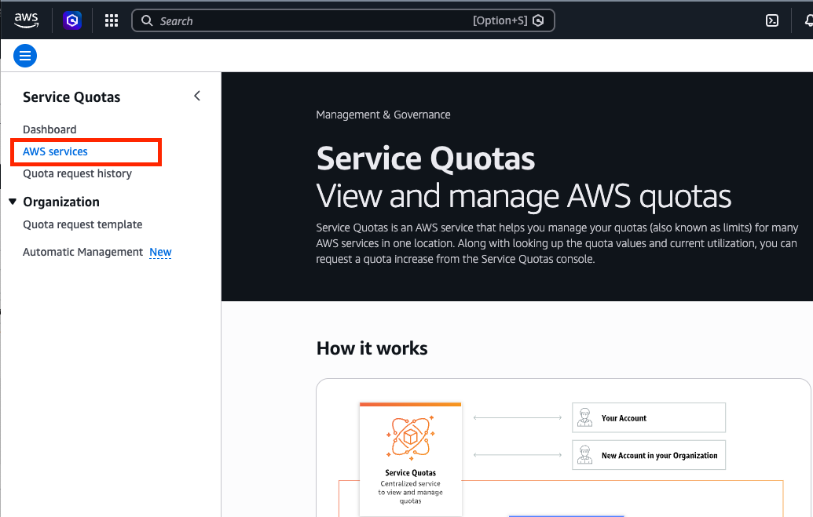
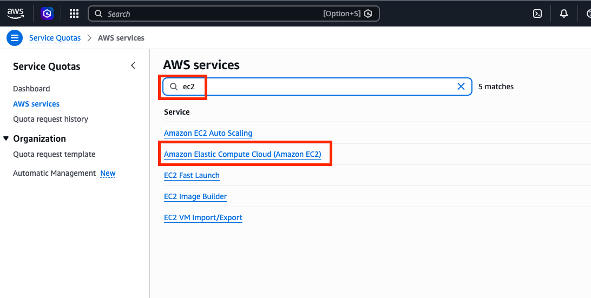
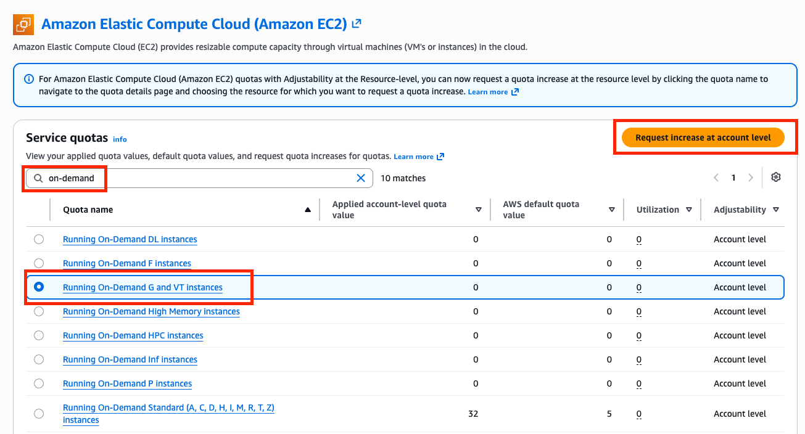
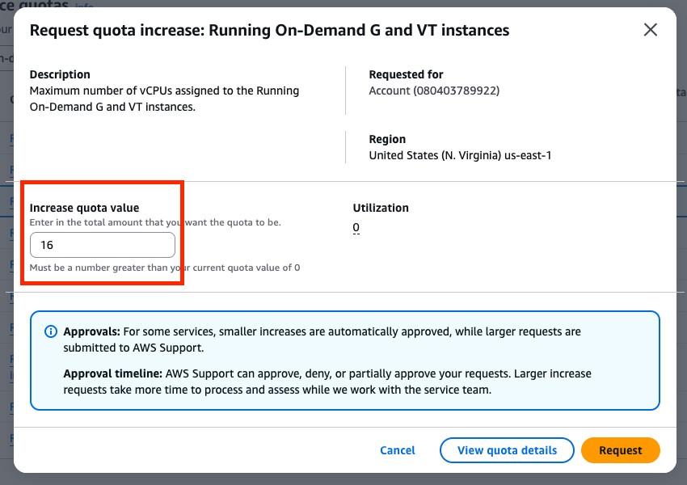
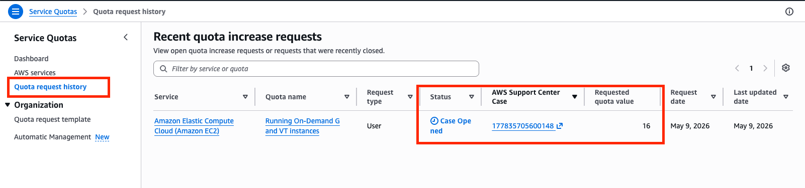

# EC2 Quota Increase Request

## EC2 Instance Type and Quota

The following table shows the maximum number of vCPUs that you can provision for On-Demand Instances by default. Amazon EC2 automatically increases your On-Demand Instance quotas based on your usage. 

| Name | Instances | Purpose | Default Quota |
| :--- | :--- | :--- | :--- |
| Running On-Demand Standard (**A, C, D, H, I, M, R, T, Z**) instances | t3, m5, c5 ... | General purpose | 32 vCPUs |
| Running On-Demand **G** and **VT** instances | g4dn, g5, g6, vt1 | High Performance Deep Learning (NVIDIA A100, H100) | **0 vCPUs** |
| Running On-Demand **P** instances | p3 | Accelerated computing | 0 vCPUs |
| Running On-Demand **F** instances | f1 | FPGA | 0 vCPUs |

---
## Reasons to request EC2 quota

In this lab, we are going to learn how to get started with Large Language Model (LLM) applications and inference on Amazon EKS. We are going to use `g5.xlarge` instances to run LLM applications run. If the quota remains at 0, instances will not be launched even if Terraform creates the Auto Scaling Group (ASG) for the GPU node group.

---
## Verify G/VT On-Demand vCPU Quota

Verify your AWS account identity first:
``` bash
aws sts get-caller-identity --output table

-----------------------------------------------------------------------------------
|                                GetCallerIdentity                                |
+--------------+----------------------------------------+-------------------------+
|    Account   |                  Arn                   |         UserId          |
+--------------+----------------------------------------+-------------------------+
|  080403789922|  arn:aws:iam::080403789922:user/admin  |  AIDARFODQPBRIQGNBK54V  |
+--------------+----------------------------------------+-------------------------+
```

Verify G/VT On-Demand vCPU Quota
``` bash hl_lines="12 18 22"
aws service-quotas get-service-quota \
  --service-code ec2 \
  --quota-code L-DB2E81BA \
  --region us-east-1 \
  --output table

------------------------------------------------------------------------------------------------------------
|                                              GetServiceQuota                                             |
+----------------------------------------------------------------------------------------------------------+
||                                                  Quota                                                 ||
|+---------------------+----------------------------------------------------------------------------------+|
||  Adjustable         |  True # (1)!                                                                           ||
||  Description        |  Maximum number of vCPUs assigned to the Running On-Demand G and VT instances.   ||
||  GlobalQuota        |  False                                                                           ||
||  QuotaAppliedAtLevel|  ACCOUNT                                                                         ||
||  QuotaArn           |  arn:aws:servicequotas:us-east-1:080403789922:ec2/L-DB2E81BA                     ||
||  QuotaCode          |  L-DB2E81BA                                                                      ||
||  QuotaName          |  Running On-Demand G and VT instances                                            ||
||  ServiceCode        |  ec2                                                                             ||
||  ServiceName        |  Amazon Elastic Compute Cloud (Amazon EC2)                                       ||
||  Unit               |  None                                                                            ||
||  Value              |  0.0 # (2)!                                                                            ||
```

1.  `Adjustable: True` indicates that the number of instances can be increased by request.
2.  The default quota is `0`.

---
## Request Quota Increase

In AWS UI, go to the **Service Quota** main page and choose **AWS services** on your left pane.



Type in **ec2** and choose **Amazon Elastic Compute Cloud (Amazon EC2)**.



Type in **on-demand** in the search bar, choose **Running On-Demand G and VT instances**, and click the **Request Increase** button.



Type in **16** for the Increase quota value section and click the **Request** button.



Go to the **Quota request history** on the left pane and wait until the EC2 instance quota is increased to 16. It will take up to 24 hours.




