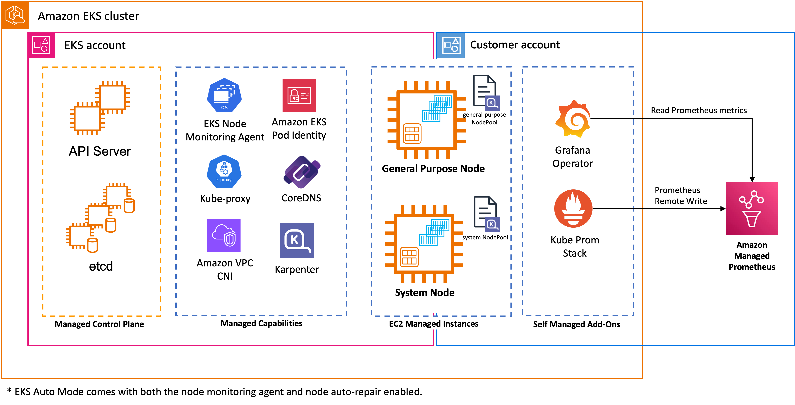
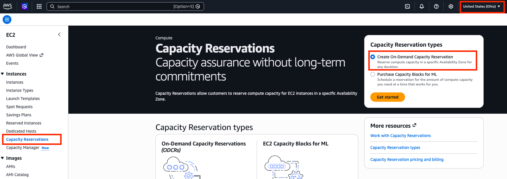
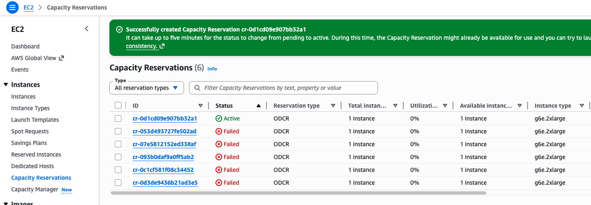

# Exploring the environment

!!! Note

    The following contents are the abbreviated version of the [Generative AI on Amazon EKS](https://catalog.workshops.aws/genai-on-eks/en-US) workshop.

In this section, we'll explore the base workshop environment that has been pre-provisioned for running generative AI workloads.

---
## Workshop Infrastructure

The environment consists of:

- **Amazon VPC**
- **Amazon EKS Auto Mode**
- **Self-Managed Add-ons**: monitoring stack(Prometheus, Grafana) for observability
- **Amazon Managed Prometheus**: a managed service for collecting and storing metrics




---

## Provision the Stack

### 1. Clone the repository

``` bash
git clone https://github.com/aws-samples/sample-genai-on-eks.git
cd sample-genai-on-eks/terraform
```

### 2. Initialize and Deploy

``` bash
terraform init
terraform apply --auto-approve # (1)!
```

1.  To deploy in a different region: `terraform apply --auto-approve -var="region=us-west-2"`

### 3. Configure kubectl

``` bash
aws eks update-kubeconfig --name genai-workshop --region us-east-2
```

``` bash
# Verify your cluster connection.
kubectl get pods --all-namespaces
```

### 4. Restrict Ingress to Your IP

``` bash
kubectl patch ingressclassparams alb --type=merge -p "{\"spec\":{\"inboundCIDRs\":[\"$(curl -s https://checkip.amazonaws.com | tr -d '\n')/32\"]}}"
```


### 5. Create On-Demand Capacity Reservation(ODCR)

After your stack is created, you need to set up an On-Demand Capacity Reservation (ODCR) for the GPU instances required by this workshop:

1. EC2 console in `us-east-2`(or the region your stack is deployed) > Capacity Reservations > Create On-Demand Capacity Reservation
    
1. Configure the reservation with the following settings:
    - **Instance type**: g6e.2xlarge (the GPU instance type used in this workshop)
    - **Platform**: Linux/UNIX
    - **Availability Zone**: Select any available zone in your region
    - **Total capacity**: 1 (minimum required for the workshop)
    - **Capacity Reservation ends**: Select "Manually" if you want to control when to end the reservation
    - **Instance eligibility**: "Open" (allows any account with access to use the reservation)
1. Verify the requested capacity reservation is active.
    

---
## Base Cluster Configuration

To view the nodes in our built-in NodePools:

``` bash
# View General-Purpose NodePool nodes
kubectl get nodes -l karpenter.sh/nodepool=general-purpose
NAME                  STATUS   ROLES    AGE    VERSION
i-0a27c731a9b74978e   Ready    <none>   133m   v1.34.4-eks-f69f56f
```

``` bash
# View System NodePool nodes
kubectl get nodes -l karpenter.sh/nodepool=system
NAME                  STATUS   ROLES    AGE    VERSION
i-0f64de30a77ed76d2   Ready    <none>   142m   v1.34.4-eks-f69f56f
```

---
## EKS Add-ons Overview

``` bash
# Check monitoring stack pods and their node placement
kubectl get pods -n monitoring -o wide
NAME                                                        READY   STATUS    RESTARTS   AGE    IP            NODE                  NOMINATED NODE   READINESS GATES
grafana-operator-85db586b8-s8t27                            1/1     Running   0          132m   10.0.40.150   i-0f64de30a77ed76d2   <none>           <none>
kube-prometheus-stack-grafana-57cbcf9dcc-fhgmc              3/3     Running   0          132m   10.0.40.151   i-0f64de30a77ed76d2   <none>           <none>
kube-prometheus-stack-kube-state-metrics-7885c984b8-qw8nj   1/1     Running   0          134m   10.0.40.147   i-0f64de30a77ed76d2   <none>           <none>
kube-prometheus-stack-operator-75db6fc97-dx8gg              1/1     Running   0          134m   10.0.40.146   i-0f64de30a77ed76d2   <none>           <none>
kube-prometheus-stack-prometheus-node-exporter-5nvfh        1/1     Running   0          134m   10.0.25.59    i-0a27c731a9b74978e   <none>           <none>
kube-prometheus-stack-prometheus-node-exporter-wqg4z        1/1     Running   0          134m   10.0.34.95    i-0f64de30a77ed76d2   <none>           <none>
prometheus-kube-prometheus-stack-prometheus-0               2/2     Running   0          134m   10.0.40.149   i-0f64de30a77ed76d2   <none>           <none>
```

Verify they're running on system nodepool
``` bash
kubectl get pods -n monitoring -o jsonpath='{range .items[*]}{.metadata.name}{"\t"}{.spec.nodeName}{"\n"}{end}' | while read pod node; do
  echo "Pod: $pod -> Node: $node ($(kubectl get node $node -o jsonpath='{.metadata.labels.karpenter\.sh/nodepool}' 2>/dev/null || echo 'unknown'))"
done

# (1)!
Pod: grafana-operator-85db586b8-s8t27 -> Node: i-0f64de30a77ed76d2 (system)
Pod: kube-prometheus-stack-grafana-57cbcf9dcc-fhgmc -> Node: i-0f64de30a77ed76d2 (system)
Pod: kube-prometheus-stack-kube-state-metrics-7885c984b8-qw8nj -> Node: i-0f64de30a77ed76d2 (system)
Pod: kube-prometheus-stack-operator-75db6fc97-dx8gg -> Node: i-0f64de30a77ed76d2 (system)
Pod: kube-prometheus-stack-prometheus-node-exporter-5nvfh -> Node: i-0a27c731a9b74978e (general-purpose) # (2)!
Pod: kube-prometheus-stack-prometheus-node-exporter-wqg4z -> Node: i-0f64de30a77ed76d2 (system)
Pod: prometheus-kube-prometheus-stack-prometheus-0 -> Node: i-0f64de30a77ed76d2 (system)
```

1.  You should see that the core monitoring components (Prometheus, Grafana, AlertManager, Grafana Operator) are scheduled on nodes with the `system` nodepool label, thanks to the node selectors and tolerations configured in their Helm charts.
2.  The node-exporter pods will appear on all nodepools since it's a DaemonSet that runs on every node to collect system metrics. This is expected behavior.

We also have a model download job that runs on the general-purpose nodepool:
``` bash
# Check the model download job
kubectl get job model-download -o wide

NAME             STATUS     COMPLETIONS   DURATION   AGE    CONTAINERS                       IMAGES                                                   SELECTOR
model-download   Complete   1/1           5m21s      142m   validate-pod-identity,download   public.ecr.aws/aws-cli/aws-cli:latest,python:3.11-slim   batch.kubernetes.io/controller-uid=6a291cc9-1f3d-410f-ba87-5c42f5e44c45
```

See which nodepool it ran on

``` bash
kubectl get pod -l job-name=model-download -o jsonpath='{range .items[*]}{.metadata.name}{"\t"}{.spec.nodeName}{"\n"}{end}' | while read pod node; do
  echo "Pod: $pod -> Node: $node ($(kubectl get node $node -o jsonpath='{.metadata.labels.karpenter\.sh/nodepool}' 2>/dev/null || echo 'general-purpose'))"
done
# (1)!
Pod: model-download-htls8 -> Node: i-0a27c731a9b74978e (general-purpose)
Pod: model-download-zg6rn -> Node: i-0a27c731a9b74978e (general-purpose)
```

1.  This job runs on the general-purpose nodepool since it doesn't require GPU resources and doesn't have the system nodepool tolerations.


