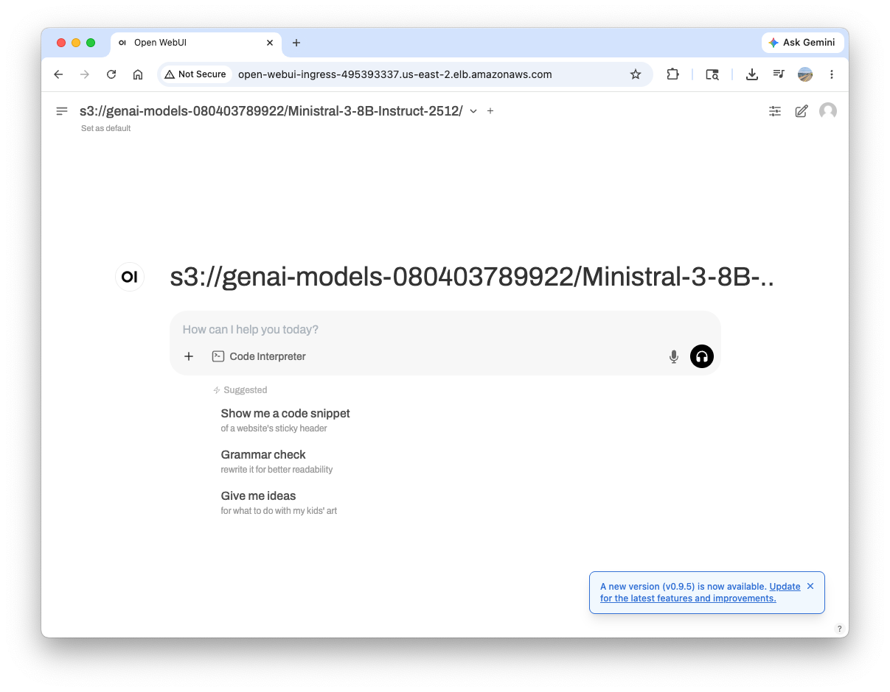

# Interacting with LLM

!!! Note

    The following contents are the abbreviated version of the [Generative AI on Amazon EKS](https://catalog.workshops.aws/genai-on-eks/en-US) workshop.

This guide demonstrates how to interact with the Mistral LLM model that we deployed using vLLM in the previous section.

---
## Setting Up Port Forwarding

To access the model service from your local machine, you need to set up port forwarding from the Kubernetes service to your local environment:
``` bash
kubectl port-forward svc/vllm-serve-svc 8000:8000
```

---
## Testing with a Simple Completion Request

Test the deployed model by sending a completion request using `curl`. Open a new terminal window and execute the following command:

``` bash
export AWS_ACCOUNT_ID=$(aws sts get-caller-identity --query Account --output text)
export S3_BUCKET_NAME="genai-models-${AWS_ACCOUNT_ID}"

curl -s http://localhost:8000/v1/completions \
  -H "Content-Type: application/json" \
  -d "{\"model\": \"s3://${S3_BUCKET_NAME}/Ministral-3-8B-Instruct-2512/\",\"prompt\": \"San Francisco is a city that has\",\"max_tokens\": 7,\"temperature\": 0}" | jq

{
  "id": "cmpl-89eb490b156ad4d9",
  "object": "text_completion",
  "created": 1779156365,
  "model": "s3://genai-models-080403789922/Ministral-3-8B-Instruct-2512/",
  "choices": [
    {
      "index": 0,
      "text": " a lot of history and culture.",
      "logprobs": null,
      "finish_reason": "length",
      "stop_reason": null,
      "token_ids": null,
      "prompt_logprobs": null,
      "prompt_token_ids": null
    }
  ],
  "service_tier": null,
  "system_fingerprint": null,
  "usage": {
    "prompt_tokens": 8,
    "total_tokens": 15,
    "completion_tokens": 7,
    "prompt_tokens_details": null
  },
  "kv_transfer_params": null
}
```

---
## Deploy Open WebUI Application

Let's deploy [Open WebUI](https://openwebui.com/), a feature-rich, self-hosted web interface that serves as your gateway to interacting with Large Language Models (LLMs). This deployment will provide an intuitive and powerful interface to engage with our previously deployed Ministral-3-8B-Instruct-2512 model on EKS.

### Deploy Open WebUI Application

``` bash
curl -o manifests/200-inference/openwebui.yml https://raw.githubusercontent.com/aws-samples/sample-genai-on-eks/refs/tags/v2.3.1/manifests/200-ray/openwebui.yml
cat manifests/200-inference/openwebui.yml
```

To enhance security, you can restrict access to the load balancer by allowing only your public IP address. First, determine your public IP address by visiting https://checkip.amazonaws.com/ in your web browser.

Then, update the load balancer configuration below by modifying the `alb.ingress.kubernetes.io/inbound-cidrs` annotation from line 80. Replace the default value `0.0.0.0/0` (which allows all IP addresses) with `your-ip-address/32` (which specifies only your IP).

``` yaml hl_lines="19"
# openwebui.yml

## ...

apiVersion: networking.k8s.io/v1
kind: Ingress
metadata:
  name: open-webui-ingress
  annotations:
    alb.ingress.kubernetes.io/scheme: internet-facing
    alb.ingress.kubernetes.io/target-type: ip
    alb.ingress.kubernetes.io/healthcheck-path: /
    alb.ingress.kubernetes.io/healthcheck-interval-seconds: '10'
    alb.ingress.kubernetes.io/healthcheck-timeout-seconds: '9'
    alb.ingress.kubernetes.io/healthy-threshold-count: '2'
    alb.ingress.kubernetes.io/unhealthy-threshold-count: '10'
    alb.ingress.kubernetes.io/success-codes: '200-302'
    alb.ingress.kubernetes.io/load-balancer-name: open-webui-ingress
    alb.ingress.kubernetes.io/inbound-cidrs: 0.0.0.0/0
```

Apply the Open WebUI deployment:
``` bash
kubectl apply -f manifests/200-inference/openwebui.yml
```

### Monitor Pod Startup

Monitor the pod status:
``` bash
kubectl get pods -l app=open-webui -w
```

Wait for the pod to show `STATUS: Running` and `READY: 1/1` before proceeding to the next step.

### Access the Application

Wait for the LoadBalancer to become available and get the application URL:
``` bash
export OPENWEBUI_URL=$(kubectl get ingress open-webui-ingress -o jsonpath='{.status.loadBalancer.ingress[0].hostname}')

aws elbv2 wait load-balancer-available --load-balancer-arns $(aws elbv2 describe-load-balancers --query 'LoadBalancers[?DNSName==`'"$OPENWEBUI_URL"'`].LoadBalancerArn' --output text)

echo "Open WebUI is ready and available at: http://${OPENWEBUI_URL}"
```

!!! Note "LoadBalancer Setup time"

    - The LoadBalancer typically takes 2-3 minutes to become fully active
    - The URL will appear once the LoadBalancer is provisioned and healthy



---
## Conclusion

In this session, we have:

1. Learned about downloading model weights to Amazon S3
1. Deployed a Mistral LLM model using vLLM with AWS Deep Learning Containers and Run:ai Model Streamer
1. Tested the deployed model by sending an inference request to the service and deployed Open WebUI to interact with the model