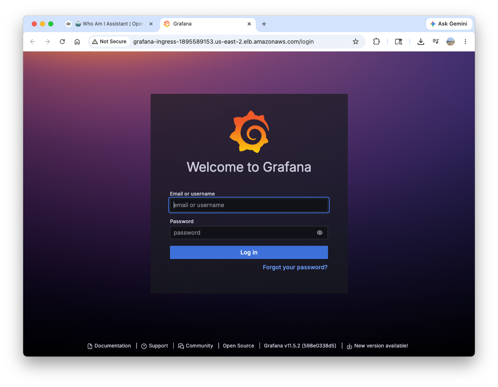
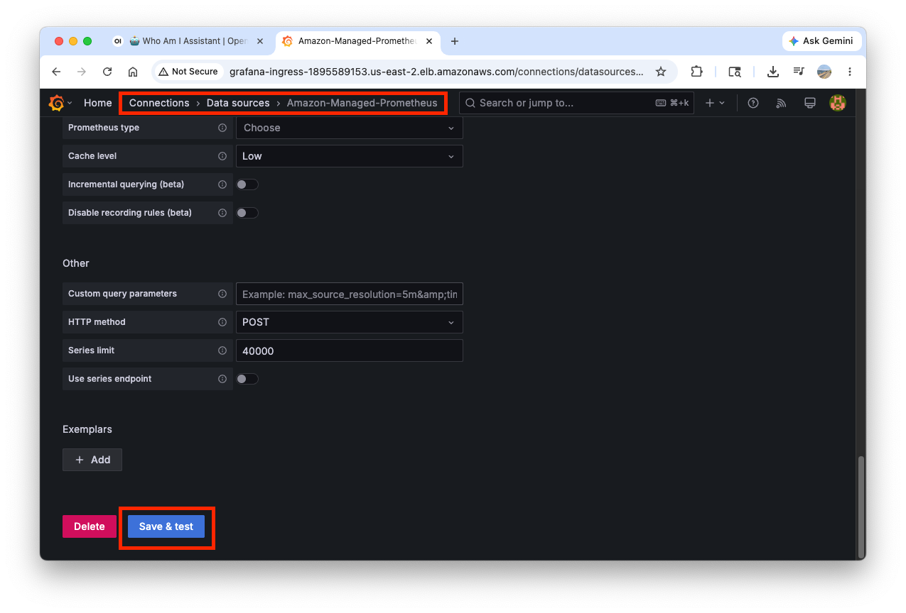
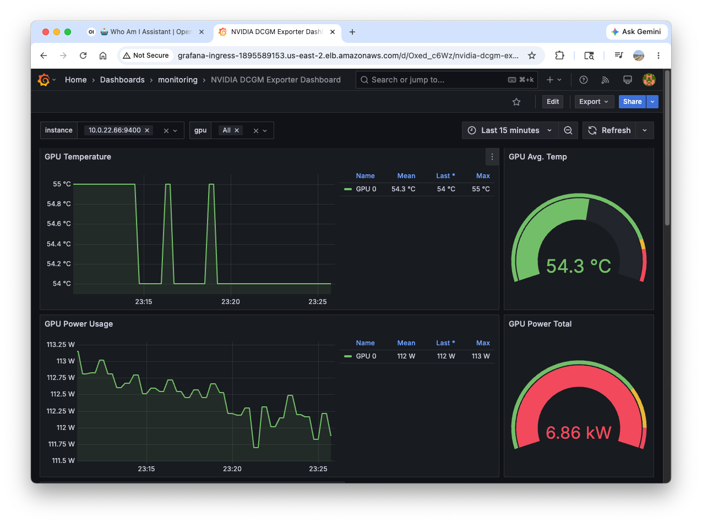

# Configuring NVIDIA DCGM Dashboard

In this section, we'll set up GPU monitoring using the NVIDIA DCGM Exporter Dashboard in Grafana. This will help us visualize important GPU metrics for our vLLM workloads.

---
## Access Grafana Dashboard

In order to reach the Grafana service we will need to create an Ingress. To enhance security, you can restrict access to the load balancer by allowing only your public IP address. First, determine your public IP address by visiting https://checkip.amazonaws.com/ in your web browser.

Then, update the load balancer configuration below by modifying the `alb.ingress.kubernetes.io/inbound-cidrs` annotation from line 17. Replace the default value `0.0.0.0/0` (which allows all IP addresses) with `your-ip-address/32` (which specifies only your IP).

``` bash
mkdir -p manifests/300-observability
```

``` bash hl_lines="17"
cat <<EOF > manifests/300-observability/grafana-ingress.yaml
apiVersion: networking.k8s.io/v1
kind: Ingress
metadata:
  name: grafana-ingress
  namespace: monitoring
  annotations:
    alb.ingress.kubernetes.io/scheme: internet-facing
    alb.ingress.kubernetes.io/target-type: ip
    alb.ingress.kubernetes.io/healthcheck-path: /api/health
    alb.ingress.kubernetes.io/healthcheck-interval-seconds: '10'
    alb.ingress.kubernetes.io/healthcheck-timeout-seconds: '9'
    alb.ingress.kubernetes.io/healthy-threshold-count: '2'
    alb.ingress.kubernetes.io/unhealthy-threshold-count: '10'
    alb.ingress.kubernetes.io/success-codes: '200-302'
    alb.ingress.kubernetes.io/load-balancer-name: grafana-ingress
    alb.ingress.kubernetes.io/inbound-cidrs: 0.0.0.0/0
  labels:
    app: grafana-ingress
spec:
  ingressClassName: alb
  rules:
  - http:
      paths:
      - path: /
        pathType: Prefix
        backend:
          service:
            name: kube-prometheus-stack-grafana
            port:
              number: 3000
EOF
```

Apply the manifest:

``` bash
kubectl apply -f manifests/300-observability/grafana-ingress.yaml
```

!!! Warning "Consider that it takes 2-3 minutes for the load balancer to provision and become active"

Now let's get the load balancer URL:

``` bash
export GRAFANA_URL=$(kubectl get ingress/grafana-ingress -n monitoring -o jsonpath='{.status.loadBalancer.ingress[0].hostname}')

aws elbv2 wait load-balancer-available --load-balancer-arns $(aws elbv2 describe-load-balancers --query 'LoadBalancers[?DNSName==`'"$GRAFANA_URL"'`].LoadBalancerArn' --output text)

echo "Grafana is ready and available at: http://${GRAFANA_URL}"
```

Get the Grafana admin password from the Kubernetes secret:

``` bash
# Get Grafana credentials
export GRAFANA_PASSWORD=$(kubectl get secret -n monitoring kube-prometheus-stack-grafana -o jsonpath="{.data.admin-password}" | base64 --decode)
echo -e "\nGrafana Credentials:"
echo "  Username: admin"
echo "  Password: ${GRAFANA_PASSWORD}"
```



Before viewing any dashboards, you need to verify the Amazon Managed Prometheus datasource configuration. Navigate to **Connections → Data Sources** or access the following page:

``` bash
echo "http://${GRAFANA_URL}/connections/datasources"
```

Open the **Amazon Managed Prometheus** data source, scroll down, then click **Save & Test** at the bottom of the page. This ensures the datasource is properly connected.



Once the datasource test passes, navigate to the pre-provisioned GPU dashboard. In the left sidebar, click **Dashboards**, then open the **monitoring** folder. You'll see the **NVIDIA DCGM Exporter Dashboard** listed — click it to open it.

The dashboard provides a real-time view of GPU health and performance across your cluster:



