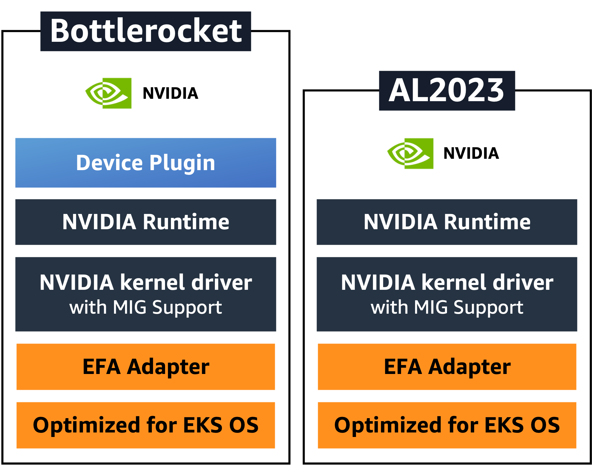
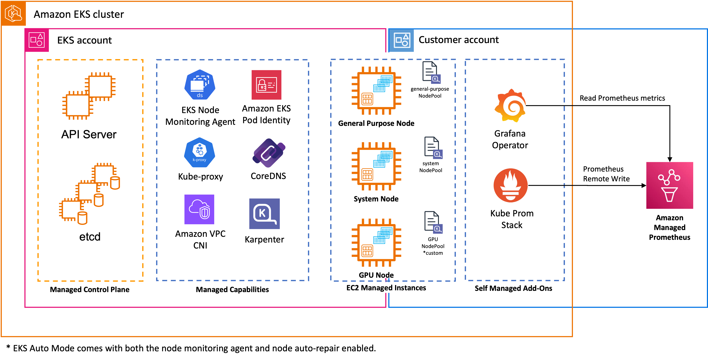

# Optimizing GPU Infrastructure for LLM Inference

This session will guide you through optimizing GPU infrastructure for high-performance LLM inference with EKS Auto Mode. You'll learn to create GPU NodePools, leverage automatic SOCI acceleration, and validate GPU functionality - creating a cost-effective and scalable foundation for production LLM workloads.

---
## EKS Auto Mode GPU Node Provisioning

For LLM inference with GPU workloads, EKS Auto Mode automatically handles GPU node provisioning through custom NodePools. 

Let's explore the GPU NodePool and NodeClass configurations that we pre-created:
``` bash
# Check GPU NodePool configuration
kubectl get nodepool/gpu

NAME   NODECLASS   NODES   READY   AGE
gpu    gpu         0       True    149m

# View the custom GPU NodeClass optimized for SOCI
kubectl get nodeclass/gpu

NAME   ROLE                                                      READY   AGE
gpu    genai-workshop-eks-node-role-20260518223307379500000001   True    150m
```

Our Auto Mode GPU NodePool configuration includes:

- **Instance Types**: GPU-enabled instances (g6e.2xlarge)
- **AMI**: EKS-optimized Bottlerocket with embedded NVIDIA support
- **SOCI Snapshotter**: Automatically enabled for G, P, and Trn family instances
- **Taints**: `nvidia.com/gpu:NoSchedule` to ensure GPU workloads only
- **Labels**: `karpenter.sh/nodepool: gpu` for GPU node identification
- **Architecture**: AMD64 only for GPU instances
- **Custom NodeClass**: Uses optimized storage configuration for SOCI performance

---
## SOCI Snapshotter for Faster Container Download and Startup

EKS Auto Mode automatically enables SOCI (Seekable OCI) snapshotter for G, P, and Trn family instances with local NVMe storage. This significantly accelerates container startup times for large images, which is particularly beneficial for ML workloads with multi-GB container images.

### Bottlerocket with Embedded NVIDIA Device Plugin

As mentioned in the previous section, EKS Auto Mode uses Bottlerocket OS by default. For GPU workloads, Auto Mode automatically selects specialized Bottlerocket AMI variants that include embedded NVIDIA drivers and device plugins, eliminating the need for manual GPU software management. 



---
## Configuring On-Demand Capacity Reservation

Before testing GPU functionality, we need to configure our GPU NodeClass to use On-Demand Capacity Reservations (ODCR). EKS Auto Mode supports ODCR configuration to ensure that GPU workloads have guaranteed capacity when needed.

First, let's get the ODCR ID for our GPU instances:
``` bash
# Extract region from kubectl context
AWS_REGION=$(kubectl config get-contexts | grep '*' | awk '{print $2}' | cut -d':' -f4)
echo "Using AWS Region: $AWS_REGION"

Using AWS Region: us-east-2
```

``` bash
# Get the ODCR ID from the current region
ODCR_ID=$(aws ec2 describe-capacity-reservations --region $AWS_REGION --filters "Name=state,Values=active" --query "CapacityReservations[0].CapacityReservationId" --output text)
echo "Found ODCR ID: $ODCR_ID"

Found ODCR ID: cr-0d1cd09e907bb32a1
```

Let's patch the GPU NodeClass to include the capacity reservation selector:
``` bash
# Create a patch file
mkdir -p manifests/100-introduction
cat <<EOF > manifests/100-introduction/patch-gpu-nodeclass.yaml
apiVersion: eks.amazonaws.com/v1
kind: NodeClass
metadata:
  name: gpu
spec:
  capacityReservationSelectorTerms:
    - id: $ODCR_ID
EOF

# Apply the patch
kubectl patch nodeclass gpu --patch-file manifests/100-introduction/patch-gpu-nodeclass.yaml --type=merge

# Verify the patch was applied
kubectl get nodeclass gpu -o yaml | grep -A 3 capacityReservationSelectorTerms

  capacityReservationSelectorTerms:
  - id: cr-0d1cd09e907bb32a1
  ephemeralStorage:
    iops: 3000
```

This configuration ensures that when Auto Mode provisions GPU nodes, it will use instances from your ODCR, providing guaranteed capacity for your GPU workloads while leveraging the enhanced storage performance of our custom NodeClass.


---
## Testing GPU Functionality and Showcasing EKS Auto Mode

Let's demonstrate how EKS Auto Mode automatically provisions GPU nodes when needed by deploying a GPU workload:

``` bash
# Deploy nvidia-smi test to trigger GPU node provisioning
cat << EOF | kubectl apply -f -
apiVersion: v1
kind: Pod
metadata:
  name: nvidia-smi
spec:
  tolerations:
  - key: "nvidia.com/gpu"
    operator: "Exists"
    effect: "NoSchedule"
  nodeSelector:
    karpenter.sh/nodepool: gpu
  containers:
  - name: nvidia-smi
    image: public.ecr.aws/amazonlinux/amazonlinux:2023-minimal
    command: ["nvidia-smi"]
    resources:
      limits:
        nvidia.com/gpu: 1
  restartPolicy: OnFailure
EOF

pod/nvidia-smi created
```

Now watch Auto Mode provision a GPU node:

``` bash
# Watch node provisioning and GPU availability
kubectl get nodes -w

NAME                  STATUS     ROLES    AGE    VERSION
i-03647fc74efc3c4f4   NotReady   <none>   0s     v1.34.4-eks-f69f56f
i-0a27c731a9b74978e   Ready      <none>   166m   v1.34.4-eks-f69f56f
i-0f64de30a77ed76d2   Ready      <none>   174m   v1.34.4-eks-f69f56f
i-03647fc74efc3c4f4   NotReady   <none>   0s     v1.34.4-eks-f69f56f
i-03647fc74efc3c4f4   NotReady   <none>   0s     v1.34.4-eks-f69f56f
i-03647fc74efc3c4f4   NotReady   <none>   0s     v1.34.4-eks-f69f56f
i-03647fc74efc3c4f4   Ready      <none>   1s     v1.34.4-eks-f69f56f

kubectl get pod nvidia-smi -w

NAME         READY   STATUS              RESTARTS   AGE
nvidia-smi   0/1     ContainerCreating   0          42s
nvidia-smi   1/1     Running             0          47s
nvidia-smi   0/1     Completed           0          49s
nvidia-smi   0/1     Completed           0          50s
```

This typically takes 30 seconds to 1 minute for a new GPU node to become available.

Check the nvidia-smi output:
``` bash
kubectl logs nvidia-smi

Tue May 19 01:38:29 2026       
+-----------------------------------------------------------------------------------------+
| NVIDIA-SMI 580.159.03             Driver Version: 580.159.03     CUDA Version: 13.0     |
+-----------------------------------------+------------------------+----------------------+
| GPU  Name                 Persistence-M | Bus-Id          Disp.A | Volatile Uncorr. ECC |
| Fan  Temp   Perf          Pwr:Usage/Cap |           Memory-Usage | GPU-Util  Compute M. |
|                                         |                        |               MIG M. |
|=========================================+========================+======================|
|   0  NVIDIA L40S                    On  |   00000000:30:00.0 Off |                    0 |
| N/A   36C    P8             25W /  350W |       0MiB /  46068MiB |      0%      Default |
|                                         |                        |                  N/A |
+-----------------------------------------+------------------------+----------------------+

+-----------------------------------------------------------------------------------------+
| Processes:                                                                              |
|  GPU   GI   CI              PID   Type   Process name                        GPU Memory |
|        ID   ID                                                               Usage      |
|=========================================================================================|
|  No running processes found                                                             |
+-----------------------------------------------------------------------------------------+
```

Your cluster architecture with EKS Auto Mode and custom GPU NodePool:

