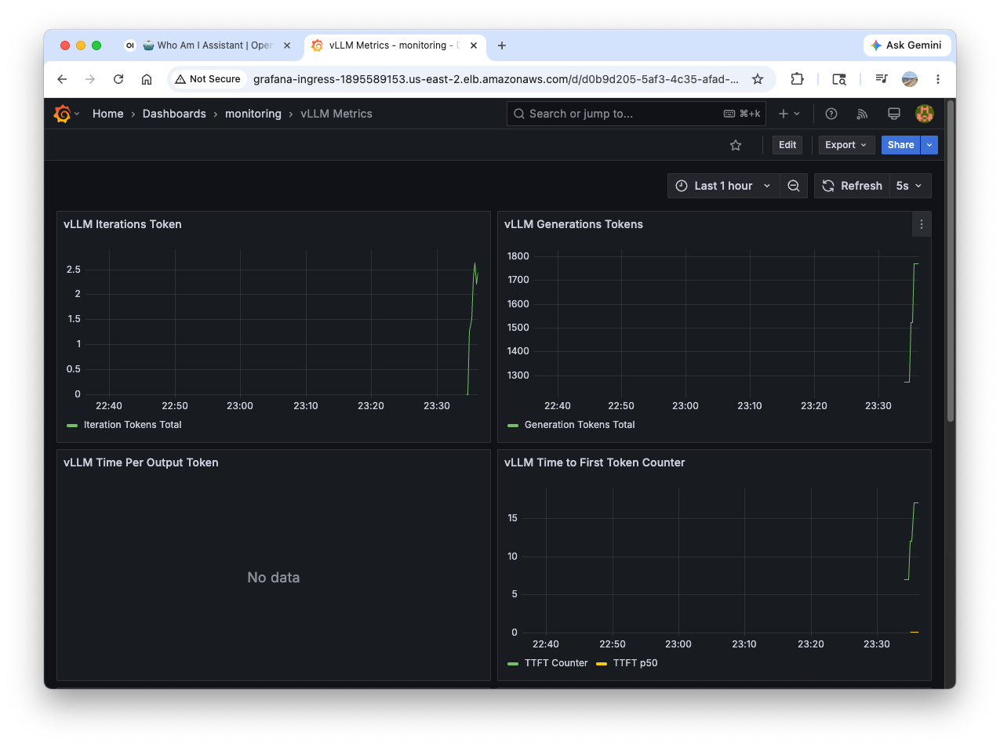

# vLLM Model Monitoring

In this section, we'll implement monitoring dashboards for vLLM inference workloads running on Amazon EKS.

---
## Creating vLLM ServiceMonitor

First, we'll create a ServiceMonitor to collect metrics from our vLLM deployment:
``` bash
cat << EOF | kubectl apply -f -
apiVersion: monitoring.coreos.com/v1
kind: ServiceMonitor
metadata:
  name: mistral-monitor
  namespace: monitoring
  labels:
    release: kube-prometheus-stack  # Important for Prometheus operator discovery
spec:
  namespaceSelector:
    matchNames:
      - default
  selector:
    matchLabels:
      model: mistral
  endpoints:
    - port: http
      interval: 30s
      path: /metrics
EOF
```

The vLLM Grafana dashboard has been pre-provisioned. Verify that it exists:
``` bash
kubectl get grafanadashboard vllm-dashboard -n monitoring
```

---
## Accessing Grafana Dashboard

### Make sure you still have the Grafana URL

``` bash
export GRAFANA_URL=$(kubectl get ingress/grafana-ingress -n monitoring -o jsonpath='{.status.loadBalancer.ingress[0].hostname}')
echo "Your Grafana URL is: $GRAFANA_URL"
```

### Make sure you interact with the model to be able to visualize metrics

1. **Start port fowarding**:

``` bash
kubectl port-forward svc/vllm-serve-svc 8000:8000
```

2. **Generate multiple requests** in a different terminal:

``` bash
# First, get the correct model name
export MODEL_NAME=$(curl -s http://localhost:8000/v1/models | jq -r '.data[0].id')

# Send several requests to populate metrics
for i in {1..10}; do
  curl -s http://localhost:8000/v1/completions \
  -H "Content-Type: application/json" \
  -d "{
      \"model\": \"$MODEL_NAME\",
      \"prompt\": \"Tell me about artificial intelligence in\",
      \"max_tokens\": 50,
      \"temperature\": 0.7
  }" | jq '.choices[0].text' && echo "Request $i completed"
  sleep 2
done
```

3. **Wait 1~2 minutes** for metrics to be scraped and appear in Grafana

You should be able to see a new dashboard `monitoring` > `vLLM Metrics`, click to open it:



---
## Conclusion

Regular monitoring of these metrics enables proactive management of your vLLM deployment and helps maintain optimal performance for your LLM inference workloads.