# In-place Cluster Upgrades

!!! Note

    The following contents are the abbreviated version of the [Amazon EKS Upgrades: Strategies and Best Practices](https://catalog.workshops.aws/eks-upgrades/en-US/010-getting-started) workshop. 

## Control Plane Upgrade

<!-- One can initiate cluster control plane upgrade in following ways:

### Using eksctl upgrade command

You can specify target version in this command but allowed values for --version are the current version of the cluster or one version higher. Upgrades of more than one Kubernetes version are not supported at the moment.

``` bash
eksctl upgrade cluster --name $EKS_CLUSTER_NAME --approve
```

### Using AWS Management Console

- Open the [Amazon EKS console](https://console.aws.amazon.com/eks/home#/clusters).
- Choose the target cluster from the Amazon EKS cluster list.
- Select `Upgrade now` to initiate the upgrade process.
  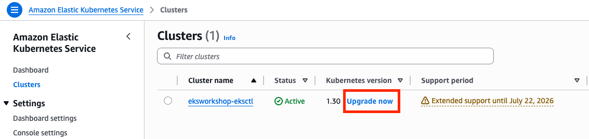
- For Kubernetes version, select the version to update your cluster to and choose Update.


### Using aws eks update-cluster-version

If your cluster has managed node groups attached to it, all of your node groups' Kubernetes versions must match the cluster's Kubernetes version in order to update the cluster to a new Kubernetes version.

``` bash
aws eks update-cluster-version --region ${AWS_REGION} --name $EKS_CLUSTER_NAME  --kubernetes-version 1.31
```


### Using Terraform -->

In this lab we will be using terraform to upgrade our cluster. EKS cluster is already provisioned for this lab via terraform. Do terraform init, plan and apply to refresh the state of resources.

``` bash
cd ~/environment/terraform
terraform init
terraform plan
terraform apply -auto-approve

...
module.eks_blueprints_addons.aws_eks_addon.this["vpc-cni"]: Still modifying... [id=eksworkshop-eksctl:vpc-cni, 01m20s elapsed]
module.eks_blueprints_addons.aws_eks_addon.this["vpc-cni"]: Modifications complete after 1m24s [id=eksworkshop-eksctl:vpc-cni]

Apply complete! Resources: 5 added, 3 changed, 5 destroyed.
```

Let's change the variable `cluster_version` in `variables.tf` from `1.30` to `1.31` and do `terraform plan`.

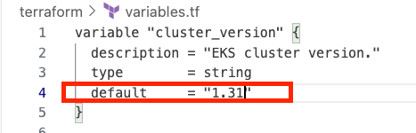

``` bash
terraform plan && terraform apply -auto-approve

...
module.eks.time_sleep.this[0] (deposed object 1d84fc09): Destroying... [id=2026-04-29T08:31:19Z]
module.eks.time_sleep.this[0]: Destruction complete after 0s

Apply complete! Resources: 4 added, 2 changed, 4 destroyed.

Outputs:

configure_kubectl = "aws eks --region us-west-2 update-kubeconfig --name eksworkshop-eksctl"
...
```

Once this get complete, you can verify the changes in [Amazon eks console](https://us-east-1.console.aws.amazon.com/eks/home?region=us-west-2#/clusters)

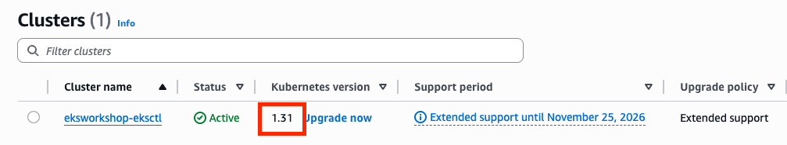

---

## Upgrade EKS Addons

In this section we will be upgrading below add-ons:

- **CoreDNS**
- **kube-proxy**
- **VPC CNI**

View the existing add-ons:
``` bash
eksctl get addon --cluster $CLUSTER_NAME
```

We just need to update the versions of CoreDNS, kube-proxy and VPC CNI in `/home/ec2-user/environment/terraform/addons.tf` file.

Find the compatible `coredns` addon versions for `1.31` using the following command:
``` bash
aws eks describe-addon-versions --addon-name coredns --kubernetes-version 1.31 --output table \
    --query "addons[].addonVersions[:10].{Version:addonVersion,DefaultVersion:compatibilities[0].defaultVersion}"
-------------------------------------------
|          DescribeAddonVersions          |
+-----------------+-----------------------+
| DefaultVersion  |        Version        |
+-----------------+-----------------------+
|  True           |  v1.11.4-eksbuild.33  |
|  False          |  v1.11.4-eksbuild.32  |
|  False          |  v1.11.4-eksbuild.28  |
|  False          |  v1.11.4-eksbuild.24  |
|  False          |  v1.11.4-eksbuild.22  |
|  False          |  v1.11.4-eksbuild.20  |
|  False          |  v1.11.4-eksbuild.14  |
|  False          |  v1.11.4-eksbuild.10  |
|  False          |  v1.11.4-eksbuild.2   |
|  False          |  v1.11.4-eksbuild.1   |
+-----------------+-----------------------+
```

Get the compatible version for `kube-proxy`:
``` bash
aws eks describe-addon-versions --addon-name kube-proxy --kubernetes-version 1.31 --output table \
    --query "addons[].addonVersions[:10].{Version:addonVersion,DefaultVersion:compatibilities[0].defaultVersion}"
--------------------------------------------
|           DescribeAddonVersions          |
+-----------------+------------------------+
| DefaultVersion  |        Version         |
+-----------------+------------------------+
|  False          |  v1.31.14-eksbuild.12  |
|  True           |  v1.31.14-eksbuild.9   |
|  False          |  v1.31.14-eksbuild.6   |
|  False          |  v1.31.14-eksbuild.5   |
|  False          |  v1.31.14-eksbuild.2   |
|  False          |  v1.31.13-eksbuild.2   |
|  False          |  v1.31.10-eksbuild.12  |
|  False          |  v1.31.10-eksbuild.8   |
|  False          |  v1.31.10-eksbuild.6   |
|  False          |  v1.31.10-eksbuild.2   |
+-----------------+------------------------+
```

Pick the latest version from the above output and update it in the `addons.tf` file:

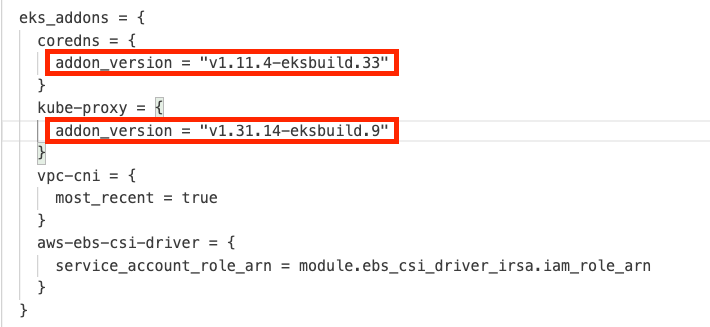

Save the `/home/ec2-user/environment/terraform/addons.tf` and apply the changes.

``` bash
terraform plan
terraform apply -auto-approve
...
module.eks_blueprints_addons.aws_eks_addon.this["kube-proxy"]: Still modifying... [id=eksworkshop-eksctl:kube-proxy, 00m30s elapsed]
module.eks_blueprints_addons.aws_eks_addon.this["kube-proxy"]: Modifications complete after 34s [id=eksworkshop-eksctl:kube-proxy]

Apply complete! Resources: 0 added, 3 changed, 0 destroyed.

Outputs:

configure_kubectl = "aws eks --region us-west-2 update-kubeconfig --name eksworkshop-eksctl"
```

Verify:

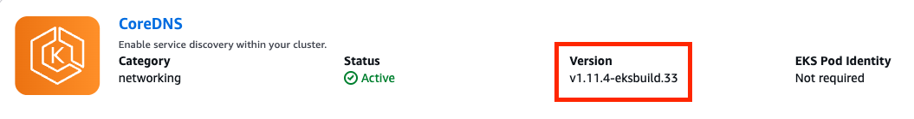
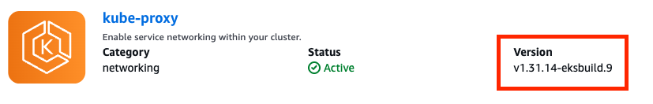

---

## In-Place Managed Node Group Upgrade

We have two managed node group with prefix:

- `initial-<random_identifier>`
- `blue-mng-<random_identifier>`

We can see the configuration of all the two managed node group in `base.tf`

``` tf
  eks_managed_node_groups = {
    initial = {
      instance_types = ["m5.large", "m6a.large", "m6i.large"]
      min_size       = 2
      max_size       = 10
      desired_size   = 2
      update_config = {
        max_unavailable_percentage = 35
      }
    }

    blue-mng = {
      instance_types  = ["m5.large", "m6a.large", "m6i.large"]
      cluster_version = "1.30"
      min_size        = 1
      max_size        = 2
      desired_size    = 1
      update_config = {
        max_unavailable_percentage = 35
      }
      labels = {
        type = "OrdersMNG"
      }
      subnet_ids = [module.vpc.private_subnets[0]]
      taints = [
        {
          key    = "dedicated"
          value  = "OrdersApp"
          effect = "NO_SCHEDULE"
        }
      ]
    }
  }
```

### create a managed node group with custom AMI

retrieve the `ami_id` for kubernetes version `1.30`:
``` bash
aws ssm get-parameter --name /aws/service/eks/optimized-ami/1.30/amazon-linux-2023/x86_64/standard/recommended/image_id \
  --region $AWS_REGION --query "Parameter.Value" --output text

ami-0c42b1f4678fc81d1
```

Replace the variable `ami_id` in `variables.tf` file with the value of result.

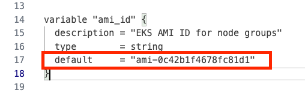

Add following code to `base.tf` to provision the custom managed node group.

``` tf
    custom = {
      instance_types = ["t3.medium"]
      min_size     = 1
      max_size     = 2
      desired_size = 1
      update_config = {
        max_unavailable_percentage = 35
      }
      ami_id                     = try(var.ami_id)
      ami_type                   = "AL2023_x86_64_STANDARD"
      enable_bootstrap_user_data = true
    }
```

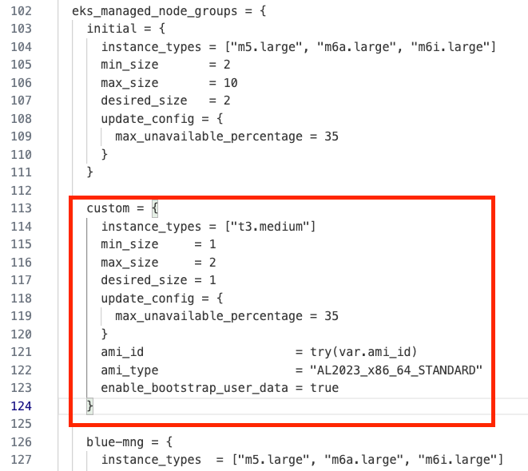

Run terraform plan and apply.

``` bash
terraform plan && terraform apply -auto-approve

...
module.eks_blueprints_addons.module.karpenter.helm_release.this[0]: Still modifying... [id=karpenter, 00m10s elapsed]
module.eks_blueprints_addons.module.karpenter.helm_release.this[0]: Modifications complete after 17s [id=karpenter]

Apply complete! Resources: 10 added, 1 changed, 3 destroyed.
```

custom managed node group is provisioned with kubernetes version 1.30 as can be seen in [Amazon EKS console](https://us-west-2.console.aws.amazon.com/eks/home?region=us-west-2#/clusters/eksworkshop-eksctl?selectedTab=cluster-compute-tab).

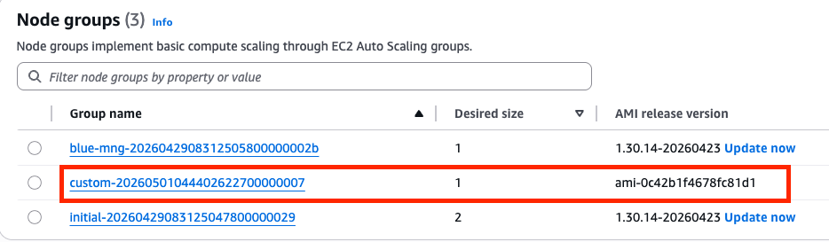

### upgrede the managed node group cluster version

Change variable `mng_cluster_version` in `variables.tf` from `1.30` to `1.31`.

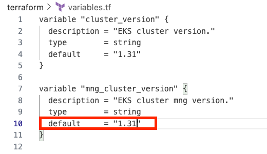

Retrieving `ami_id` for kubernetes version `1.31`:

``` bash
aws ssm get-parameter --name /aws/service/eks/optimized-ami/1.31/amazon-linux-2023/x86_64/standard/recommended/image_id \
  --region $AWS_REGION --query "Parameter.Value" --output text

ami-02b487869ba8cadfd
```

Change ami_id variable from `ami-0c42b1f4678fc81d1` to `ami-02b487869ba8cadfd`

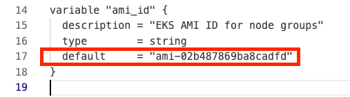

Run terraform plan and apply:
``` bash
terraform plan && terraform apply -auto-approve

...
module.eks_blueprints_addons.module.karpenter.helm_release.this[0]: Still modifying... [id=karpenter, 00m10s elapsed]
module.eks_blueprints_addons.module.karpenter.helm_release.this[0]: Modifications complete after 16s [id=karpenter]

Apply complete! Resources: 3 added, 4 changed, 3 destroyed.
```

verify the changes for initial and custom manage node groups in [Amazon EKS console](https://us-west-2.console.aws.amazon.com/eks/home?region=us-west-2#/clusters/eksworkshop-eksctl?selectedTab=cluster-compute-tab).

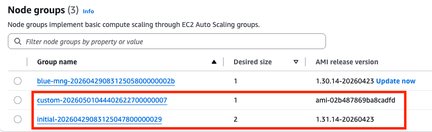

## Cluean up

Make the following changes in `base.tf` and run terraform plan and terraform apply. delete the custom managed node group add to `base.tf`.

``` tf
    custom = {
      instance_types = ["t3.medium"]
      min_size     = 1
      max_size     = 2
      desired_size = 1
      update_config = {
        max_unavailable_percentage = 35
      }
      ami_id                     = try(var.ami_id)
      ami_type                   = "AL2023_x86_64_STANDARD"
      enable_bootstrap_user_data = true
    }
```

``` bash
terraform plan 
terraform apply -auto-approve
```
