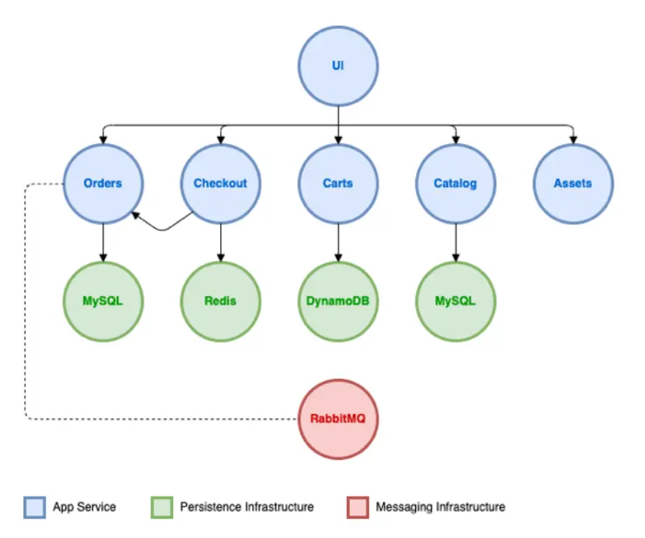
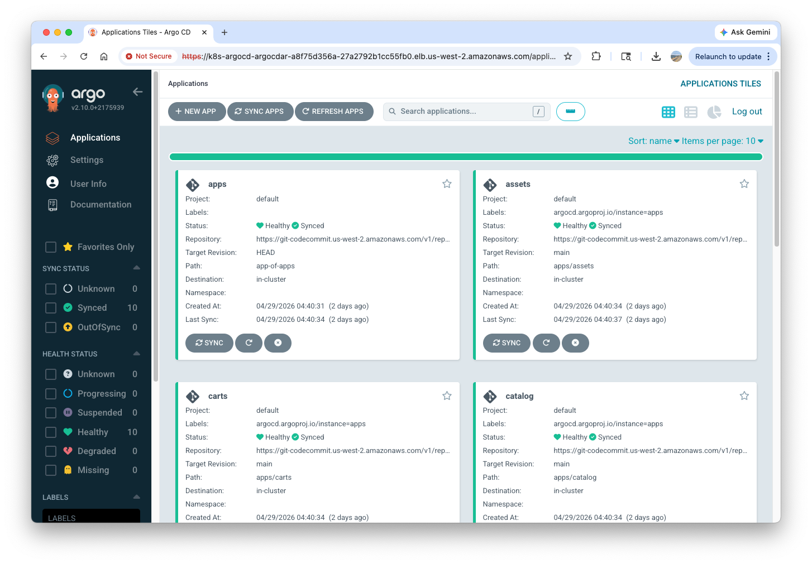

# Lab Environment

!!! Note

    The following contents are the abbreviated version of the [Amazon EKS Upgrades: Strategies and Best Practices](https://catalog.workshops.aws/eks-upgrades/en-US/010-getting-started) workshop. 

## Accessing the environment

Currently there are 7 nodes in the Kubernetes cluster:
``` bash
kubectl get nodes

NAME                                              STATUS   ROLES    AGE   VERSION
fargate-ip-10-0-5-20.us-west-2.compute.internal   Ready    <none>   42h   v1.30.14-eks-d6694b8
ip-10-0-1-17.us-west-2.compute.internal           Ready    <none>   42h   v1.30.14-eks-40737a8
ip-10-0-12-94.us-west-2.compute.internal          Ready    <none>   42h   v1.30.14-eks-40737a8
ip-10-0-2-190.us-west-2.compute.internal          Ready    <none>   37h   v1.30.14-eks-f69f56f
ip-10-0-24-158.us-west-2.compute.internal         Ready    <none>   42h   v1.30.14-eks-f69f56f
ip-10-0-37-244.us-west-2.compute.internal         Ready    <none>   42h   v1.30.14-eks-40737a8
ip-10-0-9-171.us-west-2.compute.internal          Ready    <none>   42h   v1.30.14-eks-f69f56f
```

The AWS APIs are also available. For example, query the state of the EKS cluster:
``` bash
aws eks describe-cluster --name $EKS_CLUSTER_NAME
{
    "cluster": {
        "name": "eksworkshop-eksctl",
        "arn": "arn:aws:eks:us-west-2:046528234412:cluster/eksworkshop-eksctl",
        "createdAt": "2026-04-29T08:21:18.193000+00:00",
        "version": "1.30",
        "endpoint": "https://4AFB6920190D26DC5753DF43BF065482.gr7.us-west-2.eks.amazonaws.com",
        "roleArn": "arn:aws:iam::046528234412:role/eksworkshop-eksctl-cluster-20260429082054302000000003",
        "resourcesVpcConfig": {
```

Examine the initial state of the EKS cluster:
``` bash
kubectl get node -L eks.amazonaws.com/nodegroup,karpenter.sh/nodepool
NAME                                              STATUS   ROLES    AGE   VERSION                NODEGROUP                             NODEPOOL
fargate-ip-10-0-5-20.us-west-2.compute.internal   Ready    <none>   42h   v1.30.14-eks-d6694b8                                         
ip-10-0-1-17.us-west-2.compute.internal           Ready    <none>   42h   v1.30.14-eks-40737a8   initial-20260429083125047800000029    
ip-10-0-12-94.us-west-2.compute.internal          Ready    <none>   42h   v1.30.14-eks-40737a8   blue-mng-2026042908312505800000002b   
ip-10-0-2-190.us-west-2.compute.internal          Ready    <none>   37h   v1.30.14-eks-f69f56f                                         default
ip-10-0-24-158.us-west-2.compute.internal         Ready    <none>   42h   v1.30.14-eks-f69f56f                                         
ip-10-0-37-244.us-west-2.compute.internal         Ready    <none>   42h   v1.30.14-eks-40737a8   initial-20260429083125047800000029    
ip-10-0-9-171.us-west-2.compute.internal          Ready    <none>   42h   v1.30.14-eks-f69f56f 
```

Verify addons:
``` bash
helm list -A
NAME                            NAMESPACE       REVISION        UPDATED                                 STATUS          CHART                                   APP VERSION
argo-cd                         argocd          1               2026-04-29 08:35:09.462949778 +0000 UTC deployed        argo-cd-5.55.0                          v2.10.0    
aws-efs-csi-driver              kube-system     1               2026-04-29 08:35:38.24776014 +0000 UTC  deployed        aws-efs-csi-driver-2.5.6                1.7.6      
aws-load-balancer-controller    kube-system     1               2026-04-29 08:35:38.25336066 +0000 UTC  deployed        aws-load-balancer-controller-1.7.1      v2.7.1     
karpenter                       karpenter       1               2026-04-29 08:35:39.802363254 +0000 UTC deployed        karpenter-1.0.0                         1.0.0      
metrics-server                  kube-system     1               2026-04-29 08:35:09.460816944 +0000 UTC deployed        metrics-server-3.12.0                   0.7.0 
```

Terraform was used to create all this infrastructure:
``` bash
ls -lrt terraform/
total 40
-rw-r--r--. 1 ec2-user ec2-user  282 Nov 16 21:45 outputs.tf
-rw-r--r--. 1 ec2-user ec2-user  625 Nov 17 17:29 vpc.tf
-rw-r--r--. 1 ec2-user ec2-user  556 Dec 12 12:58 versions.tf
-rw-r--r--. 1 ec2-user ec2-user 1292 Dec 12 12:58 gitops-setup.tf
-rw-r--r--. 1 ec2-user ec2-user  353 Apr  7 18:14 variables.tf
-rw-r--r--. 1 ec2-user ec2-user 5045 Apr  7 19:50 base.tf
-rw-r--r--. 1 ec2-user ec2-user 6373 Apr  7 21:11 addons.tf
-rw-r--r--. 1 ec2-user ec2-user   33 Apr 29 08:25 backend_override.tf
```

---

## Sample application

The lab uses a simple web store application backed by several componenets and dependencies:



Initially we'll deploy the application in a manner that is self-contained in the Amazon EKS cluster, without using any AWS services like load balancers or a managed database.

Let's clone the repo:
``` bash
cd ~/environment
git clone codecommit::${REGION}://eks-gitops-repo
```

Login to ArgoCD Console:
``` bash
export ARGOCD_SERVER=$(kubectl get svc argo-cd-argocd-server -n argocd -o json | jq --raw-output '.status.loadBalancer.ingress[0].hostname')
echo "ArgoCD URL: http://${ARGOCD_SERVER}"
export ARGOCD_USER="admin"
export ARGOCD_PWD=$(kubectl -n argocd get secret argocd-initial-admin-secret -o jsonpath="{.data.password}" | base64 -d)
echo "Username: ${ARGOCD_USER}"
echo "Password: ${ARGOCD_PWD}"
```



Verify the application pods:
``` bash
kubectl get pods -A
NAMESPACE     NAME                                                        READY   STATUS    RESTARTS      AGE
argocd        argo-cd-argocd-application-controller-0                     1/1     Running   0             42h
argocd        argo-cd-argocd-applicationset-controller-7b556db7d4-gdlzk   1/1     Running   0             42h
argocd        argo-cd-argocd-dex-server-86bddbd757-n42nc                  1/1     Running   0             42h
argocd        argo-cd-argocd-notifications-controller-7fff4884b6-thtl6    1/1     Running   0             42h
argocd        argo-cd-argocd-redis-6d4d8d884-nd9ft                        1/1     Running   0             42h
argocd        argo-cd-argocd-repo-server-64cbf54678-69fs6                 1/1     Running   0             42h
argocd        argo-cd-argocd-server-575cdd9494-c4tkj                      1/1     Running   0             42h
assets        assets-784b5f5656-cgcg2                                     1/1     Running   0             42h
carts         carts-788776f9d-wx9dc                                       1/1     Running   1 (42h ago)   42h
carts         carts-dynamodb-b9d69767b-7269f                              1/1     Running   0             42h
catalog       catalog-5578f9649b-dhqvm                                    1/1     Running   3 (42h ago)   42h
```

