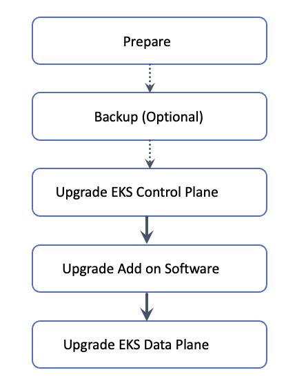

# EKS Upgrade Process

!!! Note

    The following contents are the abbreviated version of the [Amazon EKS Upgrades: Strategies and Best Practices](https://catalog.workshops.aws/eks-upgrades/en-US/010-getting-started) workshop. 

Below is high level workflow of in-place cluster upgrades.

One needs to take below actions to perform in-place upgrade of Amazon EKS cluster:

1. Review the [Kubernetes and EKS release notes](https://docs.aws.amazon.com/eks/latest/best-practices/cluster-upgrades.html#usedocs). Also, check the [Before Upgrading](https://docs.aws.amazon.com/eks/latest/best-practices/cluster-upgrades.html#before-upgrading) section.
1. [Take a backup of the cluster (optional)](https://aws.amazon.com/blogs/aws/secure-eks-clusters-with-the-new-support-for-amazon-eks-in-aws-backup/)
1. [Upgrade the cluster control plane using the AWS console or cli](https://docs.aws.amazon.com/eks/latest/userguide/update-cluster.html)
1. [Review add-on compatibility](https://docs.aws.amazon.com/eks/latest/best-practices/cluster-upgrades.html#upgrade-addons)
1. [Upgrade the cluster data plane](https://docs.aws.amazon.com/eks/latest/userguide/update-managed-node-group.html)