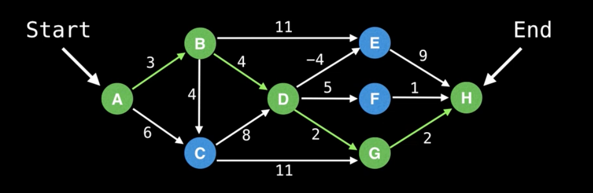
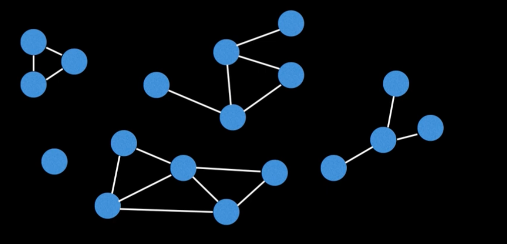
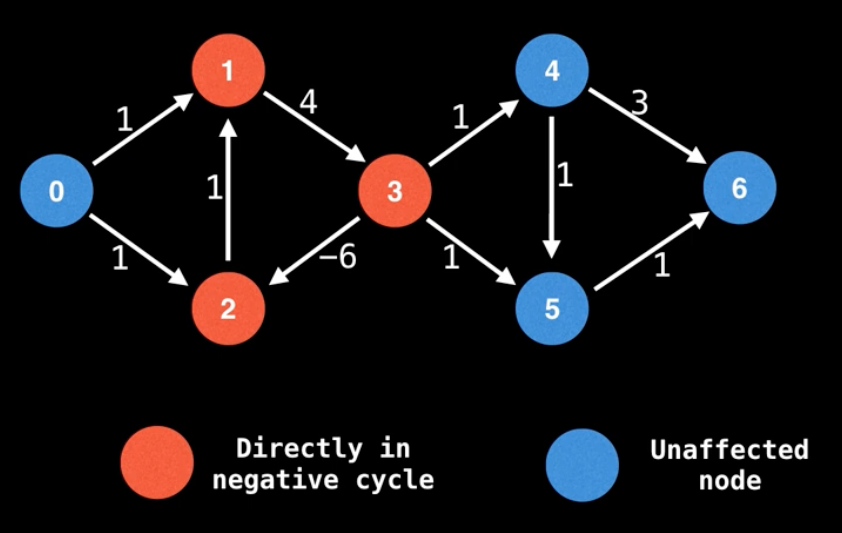
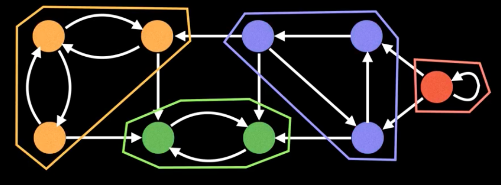
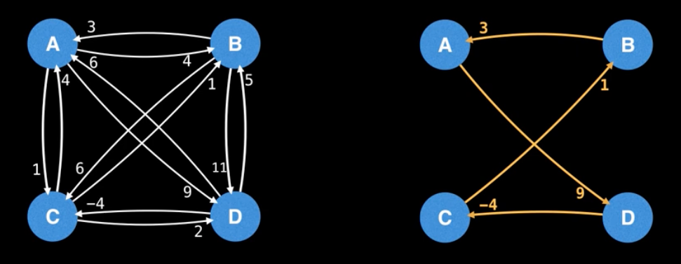
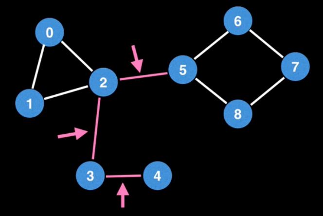
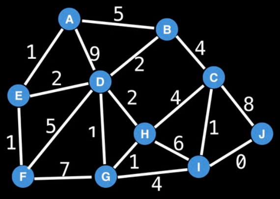
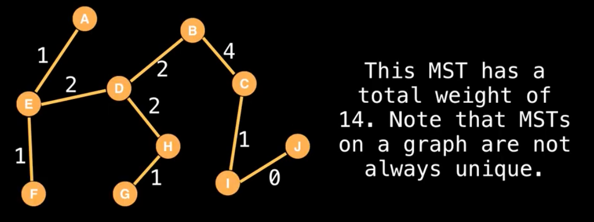
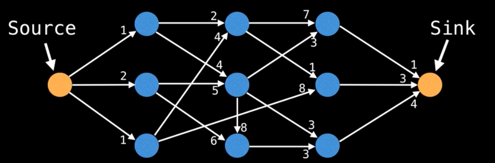

# Common Graph Theory Problems

## Shortest Path Problem

Given a weighted graph, find the shortest path of edges from node A to node B.

### Algorithms

- BFS (unweighted graph)
- Dijkstra's
- Bellman-Ford
- Floyd-Warshall
- A*

---
## Connectivity

Does there exist a path between node A and node B?

### Typical solution

- Union Find
- Any search algorithm (e.g. DFS)

---
## Negative Cycles

Does my weighted digraph have any negative cycles? If so, where? Used for the currency trading.

### Algorithms

- Bellman-ford
- Floyd-Warshall

---
## Strongly Connected Components

Strongly Connected Components (SCCs) can be thought of as **self-contained cycles** within a **directed graph** where every vertex in a given cycle can reach every other vertex in the same cycle.

### Algorithms

- Tarjan's
- Kosaraju's

---
## Traveling Salesman Problem

Given a list of cities and the distances between each pair of cities, what is the shortest possible route that visits each city exactly once and returns to the origin city?

The TSP problem is NP-Heard, meaning it's a very computationally challenging problem. This is unfortunate because the TSP has several very important applications.

### Algorithm

- Held-Karp
- Branch and bound
- many approximation algorithms

---
## Bridges

A **bridge / cut edge** is any edge in a graph whose removal increases the number of connected components.

Bridges are important in graph theory because they often hint at weak points, bottlenecks or vulnerabilities in a graph.

---
## Minimum Spanning Tree (MST)

A **minimum spanning tree (MST)** is a subset of the edges of a connected, edge-weighted graph that connects all the verticies together, without any cycles and with the minimum possible total edge weight.

MSTs are seen in many applications including:

- Designing a least cost network
- Circuit design
- Trasnportation networks

### Algorithms

- Kruskal's
- Prim's & Boruvka's

---
## Network Flow: max flow

With an infinite input source how much "flow" can we push through the network?

Suppose the edges are roads with cars, pipes with water or hallways with packed with people. Flow represents the volume of water allowed to flow through the pipes, the number of cars the roads can sustain in traffic and the maximum amount of people that can navigate through the hallways.

### Algorithms

- Ford-Fulkerson
- Edmonds-Karp
- Dinic's

---
## Reference

<iframe width="560" height="315" src="https://www.youtube.com/embed/87X57ldq1ok?si=n9gJ5zIPjbHgzR_r&amp;start=1231" title="YouTube video player" frameborder="0" allow="accelerometer; autoplay; clipboard-write; encrypted-media; gyroscope; picture-in-picture; web-share" referrerpolicy="strict-origin-when-cross-origin" allowfullscreen></iframe>