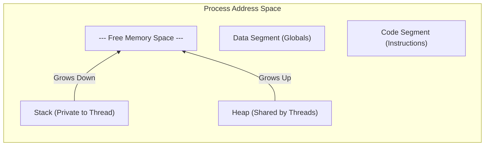
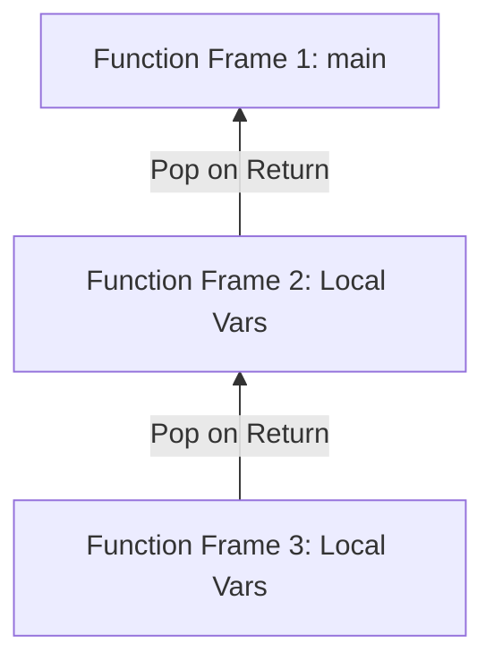
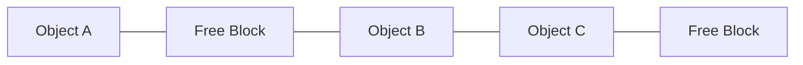

# Stack vs. Heap

- **Stack** - size is {++known++} ahead of time and {++can exist++} within {++one function++}.
- **Heap** - size is {==unknown==} ahead of time or return value {==isn't==} limited to {==one function==}.

<iframe width="560" height="315" src="https://www.youtube.com/embed/ep2xOW52mDY?si=AyjHLyvBjjYxLNAv" title="YouTube video player" frameborder="0" allow="accelerometer; autoplay; clipboard-write; encrypted-media; gyroscope; picture-in-picture; web-share" referrerpolicy="strict-origin-when-cross-origin" allowfullscreen></iframe>

## At a Glance

### Memory Layout
Below is a simplified visualization of how these regions are typically arranged in a process's address space. Notice how the Stack and Heap grow toward each other.

### Key Comparison

| Feature | Stack | Heap |
| :--- | :--- | :--- |
| **Management** | Managed by CPU (Automatic) | Managed by Programmer/GC (Manual) |
| **Access Speed** | Very Fast | Slower (requires pointer following) |
| **Size** | Small & Fixed (e.g., 1-8 MB) | Large & Dynamic (limited by RAM) |
| **Structure** | LIFO (Last-In, First-Out) | Fragmented / Unordered |
| **Thread Safety** | Private to each Thread | Shared by all Threads |
| **Variables** | Local variables only | Global objects, dynamic structures |

---

## Visualizing Allocation

### Stack: Predictable & Ordered
Allocation on the stack is like adding trays to a stack. It is perfectly ordered and follows a strict LIFO pattern.

### Heap: Dynamic & Fragmented
Allocation on the heap is more like finding an empty spot in a large warehouse. It is flexible but can become fragmented over time.

---

## Stack Memory
The stack is a contiguous block of memory managed by the CPU using a **Stack Pointer**.

### How it Works
- When a function is called, a **Stack Frame** is pushed onto the stack.
- When the function returns, the frame is popped, and memory is instantly reclaimed.
- Allocation is as simple as moving the Stack Pointer (a single CPU instruction).

### Pros & Cons
- **Pros**: Extremely fast, no fragmentation, automatic cleanup.
- **Cons**: Limited size, only stores local data, lifetime is strictly tied to function scope.

---

## Heap Memory
The heap is a large, fragmented pool of memory used for objects that need to outlive the function that created them.

### How it Works
- Variables are allocated at runtime using keywords like `malloc`, `new`, or by the runtime (in Go/Java).
- Memory must be explicitly freed by the programmer or reclaimed by a **Garbage Collector**.
- Finding a free block of the right size takes more time than stack allocation.

### Pros & Cons
- **Pros**: Virtually unlimited size (up to RAM limits), data can be shared globally, flexible lifetime.
- **Cons**: Slower access, risk of **Memory Leaks**, risk of **Memory Fragmentation**.

---

## Comparison in the Process/Thread Model

One of the most important architectural differences is how they handle concurrency:

1.  **Thread Private (Stack)**: Each thread gets its own stack. This ensures that function calls in one thread do not overwrite variables in another.
2.  **Process Shared (Heap)**: All threads in a process share the same heap. This makes data sharing easy but requires **Synchronization (Mutexes)** to prevent data corruption.

## Common Failures
- **Stack Overflow**: Occurs when recursion goes too deep or local arrays are too large for the fixed stack size.
- **Out of Memory (OOM)**: Occurs when the heap is full, often due to memory leaks (forgetting to free memory) or simply loading too much data into RAM.
