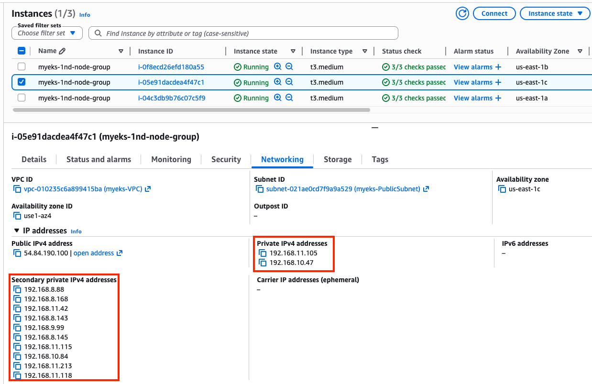
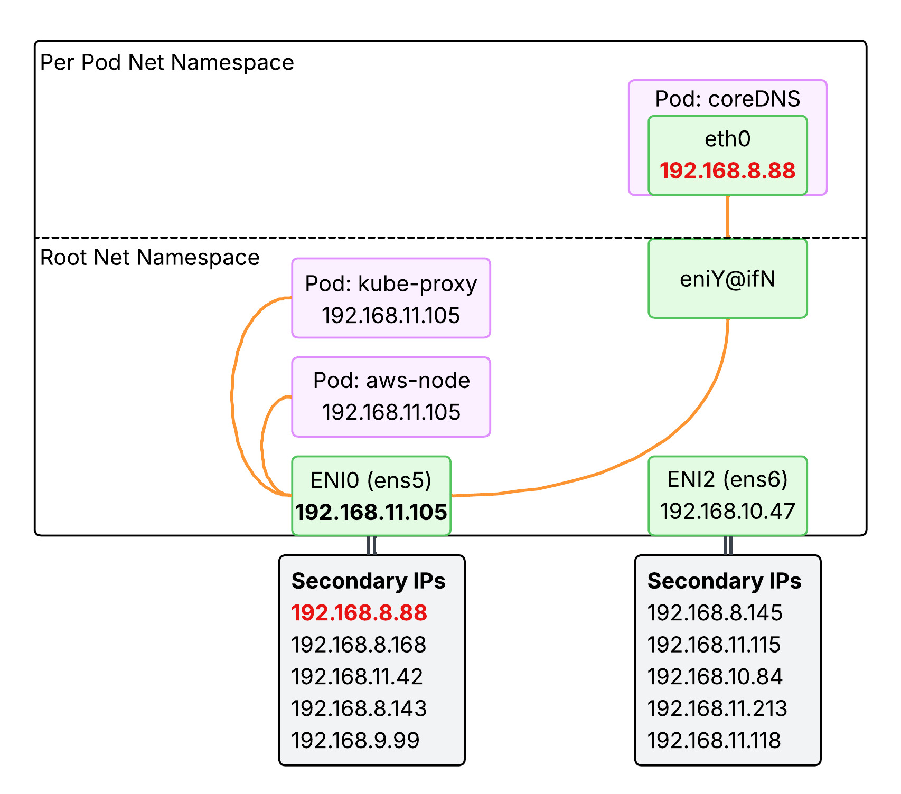
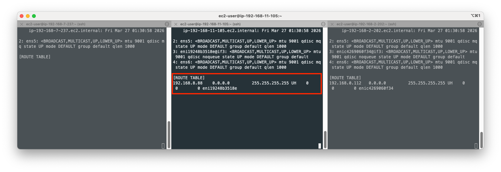
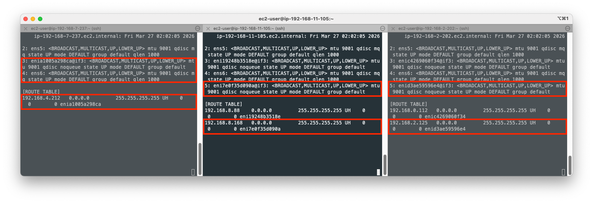
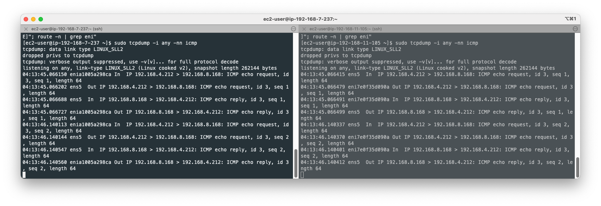
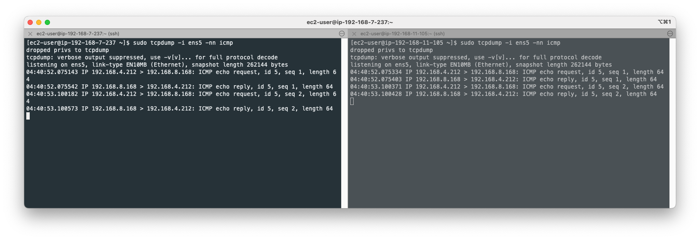
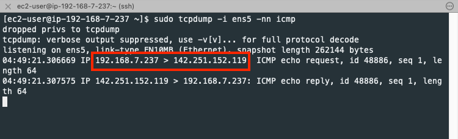

# EKS Networking Lab: Routing and Interfaces

## 1. Cluster Provisioning

Get terraform resources:
```bash
# pull code
git clone https://github.com/gasida/aews.git
cd aews/2w
```

Set terraform variables:
```bash
export TF_VAR_KeyName=$(aws ec2 describe-key-pairs --query "KeyPairs[].KeyName" --output text)
export TF_VAR_ssh_access_cidr=$(curl -s ipinfo.io/ip)/32
echo $TF_VAR_KeyName $TF_VAR_ssh_access_cidr
```

Deploy EKS. Takes about 12 mins.
```bash
terraform init
terraform plan
nohup sh -c "terraform apply -auto-approve" > create.log 2>&1 &
tail -f create.log
```

Confirm your credentials used to provision the EKS cluster and switch kubectl context to your cluster:
```bash
terraform output -raw configure_kubectl
# aws eks update-kubeconfig --region us-east-1 --name myeks

aws eks --region us-east-1 update-kubeconfig --name myeks
kubectl config rename-context $(cat ~/.kube/config | grep current-context | awk '{print $2}') myeks
```

## 2. Browse Cluster Default Setting

### 2.1. Checklist in console

- Overview: API server endpoint, OpenID Connect provider URL
- Compute: Node groups -> `myeks-1nd-node-group` -> Kubernetes labes -> `{tier: primary}` (defined [here](https://github.com/gasida/aews/blob/main/2w/eks.tf#L87))
- Networking: Service IPv4 range(`10.100.0.0/16`), Subnets
- Add-ons: `CoreDNS`, `Amazon VPC CNI`, `kube-proxy` (all defined [here](https://github.com/gasida/aews/blob/main/2w/eks.tf#L142))
- Access: IAM access entries

### 2.2. Cluster Info

Browse cluster info:
```bash
kubectl cluster-info
eksctl get cluster
```

Browse node info:
```bash
kubectl get node --label-columns=node.kubernetes.io/instance-type,eks.amazonaws.com/capacityType,topology.kubernetes.io/zone
kubectl get node -v=6

# get node by label
kubectl get node --show-labels
kubectl get node -l tier=primary
```

Browse pod info:
```bash
kubectl get pod -A
kubectl get pdb -n kube-system
# NAME      MIN AVAILABLE   MAX UNAVAILABLE   ALLOWED DISRUPTIONS   AGE
# coredns   N/A             1                 1                     25h
```

Check node group:
```bash
aws eks describe-nodegroup --cluster-name myeks --nodegroup-name myeks-1nd-node-group | jq
```

Browse addons:
```bash
aws eks list-addons --cluster-name myeks | jq
eksctl get addon --cluster myeks
# NAME            VERSION                 STATUS  ISSUES  IAMROLE UPDATE AVAILABLE        CONFIGURATION VALUES               NAMESPACE       POD IDENTITY ASSOCIATION ROLES
# coredns         v1.13.2-eksbuild.3      ACTIVE  0                                         kube-system
# kube-proxy      v1.34.5-eksbuild.2      ACTIVE  0                                         kube-system
# vpc-cni         v1.21.1-eksbuild.5      ACTIVE  0                                       {"env":{"WARM_ENI_TARGET":"1"}}    kube-system
```

## 3. AWS VPC CNI

Please refer to [2.3.3. Cloud Native (AWS VPC CNI)](02-networking.md#233-cloud-native-aws-vpc-cni) section to understand AWS VPC CNI.

### 3.1. Browse CNI associated files in a worker node
```bash
cat /etc/cni/net.d/10-aws.conflist | jq
# {
#   "cniVersion": "0.4.0",
#   "name": "aws-cni",
#   "disableCheck": true,
#   "plugins": [
#     {
#       "name": "aws-cni",
#       "type": "aws-cni",
#       "vethPrefix": "eni",
#       "mtu": "9001",
#       "podSGEnforcingMode": "strict",
#       "pluginLogFile": "/var/log/aws-routed-eni/plugin.log",
#       "pluginLogLevel": "DEBUG",
#       "capabilities": {
#         "io.kubernetes.cri.pod-annotations": true
#       }
#     },
#     {
#       "name": "egress-cni",
#       "type": "egress-cni",
#       "mtu": "9001",
#       "enabled": "false",
#       "randomizeSNAT": "prng",
#       "nodeIP": "",
#       "ipam": {
#         "type": "host-local",
#         "ranges": [
#           [
#             {
#               "subnet": "fd00::ac:00/118"
#             }
#           ]
#         ],
#         "routes": [
#           {
#             "dst": "::/0"
#           }
#         ],
#         "dataDir": "/run/cni/v4pd/egress-v6-ipam"
#       },
#       "pluginLogFile": "/var/log/aws-routed-eni/egress-v6-plugin.log",
#       "pluginLogLevel": "DEBUG"
#     },
#     {
#       "type": "portmap",
#       "capabilities": {
#         "portMappings": true
#       },
#       "snat": true
#     }
#   ]
# }

tree /opt/cni/bin
# /opt/cni/bin
# ├── LICENSE
# ├── aws-cni
# ├── aws-cni-support.sh
# ├── bandwidth
# ├── bridge
# ├── dhcp
# ├── dummy
# ├── egress-cni
# ├── firewall
# ├── host-device
# ├── host-local
# ├── ipvlan
# ├── loopback
# ├── macvlan
# ├── portmap
# ├── ptp
# ├── sbr
# ├── static
# ├── tap
# ├── tuning
# ├── vlan
# └── vrf
```

### 3.2. Secondary IP mode overview

As mentioned in [2.3.3. Cloud Native (AWS VPC CNI)](02-networking.md#233-cloud-native-aws-vpc-cni), `Secondary IP mode` is the default mode for AWS VPC CNI. It is deployed as a `DaemonSet` named `aws-node`. The following is the IP address allocation process conducted by CNI:

1. When a worker node is provisioned, a primary ENI is attached to the node. 
2. The CNI allocates **a warm pool of ENIs** and **secondary IP addresses** from the subnet attached to the node's primary ENI. 
3. By default, `ipamd` attempts to allocate an additional ENI to the node. `ipamd` allocates this extra ENI as soon as a single Pod is scheduled and assigned a secondary IP address from the primary ENI. This **warm ENI enables faster Pod networking**.
4. When the pool of secondary IP addresses is exhausted, the CNI adds another ENI to allocate more.


The number of ENIs and IP addresses in the pool is configured through environment variables called [WARM_ENI_TARGET, WARM_IP_TARGET, MINIMUM_IP_TARGET](https://github.com/aws/amazon-vpc-cni-k8s/blob/master/docs/eni-and-ip-target.md). Here's what each variable does:

- `WARM_ENI_TARGET`: Specifies the number of **entire ENIs** to keep in the "warm" pool. For example, if set to 1, the CNI will always attempt to have at least one extra ENI (and all its available secondary IPs) pre-attached and ready for new Pods.
- `WARM_IP_TARGET`: Specifies the number of **individual secondary IP addresses** to keep in the "warm" pool. It provides finer control than ENI targets, ensuring that a specific number of free IPs are always available across any attached ENIs. 
- `MINIMUM_IP_TARGET`: Specifies the **minimum total number** of secondary IP addresses that must be present on the node at all times, regardless of how many Pods are currently running. 


| Item | WARM_ENI_TARGET | WARM_IP_TARGET | MINIMUM_IP_TARGET |
| :--- | :--- | :--- | :--- |
| **Control Unit** | ENI | IP | IP |
| **Usage** | Simple / Aggressive | Fine-grained control | Initial allocation |
| **Recommendation** | ❌ (Set to 0 to disable) | ✅ | ✅ |
| **Scaling Response** | Very Fast | Fast | Fast only initially |
| **Resource Efficiency** | Low | High | Medium |

`WARM_ENI_TARGET` is set to 1:
```bash
eksctl get addon --name vpc-cni --cluster myeks
# NAME    VERSION                 STATUS  ISSUES  IAMROLE UPDATE AVAILABLE        CONFIGURATION VALUES            NAMESPACE       POD IDENTITY ASSOCIATION ROLES
# vpc-cni v1.21.1-eksbuild.5      ACTIVE  0                                       {"env":{"WARM_ENI_TARGET":"1"}} kube-system

kubectl get daemonset aws-node --show-managed-fields -n kube-system -o yaml
        # - name: ENABLE_SUBNET_DISCOVERY
        #   value: "true"
        # - name: NETWORK_POLICY_ENFORCING_MODE
        #   value: standard
        # - name: VPC_CNI_VERSION
        #   value: v1.21.1
        # - name: VPC_ID
        #   value: vpc-010235c6a899415ba
        # - name: WARM_ENI_TARGET
        #   value: "1"
        # - name: WARM_PREFIX_TARGET
        #   value: "1"
```

Five secondary IP addresses per ENI are allocated in a warm pool. This matches the behavior where `WARM_ENI_TARGET=1` ensures that at least one extra "warm" ENI is always available with its full capacity of secondary IPs pre-allocated to the node's pool, reducing the latency when a new Pod needs an IP.


## 4. Networking Configuration on a Worker Node

### 4.1. Variable setting
EC2 ENI IP addresses:
```bash
aws ec2 describe-instances --query "Reservations[*].Instances[*].{PublicIPAdd:PublicIpAddress,PrivateIPAdd:PrivateIpAddress,InstanceName:Tags[?Key=='Name']|[0].Value,Status:State.Name}" --filters Name=instance-state-name,Values=running --output table

------------------------------------------------------------------------
|                           DescribeInstances                          |
+-----------------------+------------------+----------------+----------+
|     InstanceName      |  PrivateIPAdd    |  PublicIPAdd   | Status   |
+-----------------------+------------------+----------------+----------+
|  myeks-1nd-node-group |  192.168.7.237   |  54.204.76.91  |  running |
|  myeks-1nd-node-group |  192.168.11.105  |  54.84.190.100 |  running |
|  myeks-1nd-node-group |  192.168.2.202   |  44.201.60.214 |  running |
+-----------------------+------------------+----------------+----------+
```

Set variables:
```bash
N1=54.204.76.91
N2=54.84.190.100
N3=44.201.60.214
```

ssh into worker nodes:
```bash
for i in $N1 $N2 $N3; do echo ">> node $i <<"; ssh -o StrictHostKeyChecking=no ec2-user@$i hostname; echo; done
```

### 4.2. Browse networking configurations

Browse `aws-node` DaemonSet:
```bash
kubectl get daemonset aws-node --namespace kube-system -owide

kubectl get ds aws-node -n kube-system -o json | jq '.spec.template.spec.containers[0].env'
``` 
Check `kube-proxy` config:
```bash
kubectl describe cm -n kube-system kube-proxy-config
# mode: "iptables"

kubectl describe cm -n kube-system kube-proxy-config | grep iptables: -A5
# iptables:
#   masqueradeAll: false
#   masqueradeBit: 14
#   minSyncPeriod: 0s
#   syncPeriod: 30s
# ipvs:
```

Check IPs:
```bash
# Node IPs
aws ec2 describe-instances --query "Reservations[*].Instances[*].{PublicIPAdd:PublicIpAddress,PrivateIPAdd:PrivateIpAddress,InstanceName:Tags[?Key=='Name']|[0].Value,Status:State.Name}" --filters Name=instance-state-name,Values=running --output table

# Pod IPs
kubectl get pod -n kube-system -o=custom-columns=NAME:.metadata.name,IP:.status.podIP,STATUS:.status.phase
```

Browse CNI associated logs with the following commands:
```bash
# /var/log/aws-routed-eni contains log files
for i in $N1 $N2 $N3; do echo ">> node $i <<"; ssh ec2-user@$i tree /var/log/aws-routed-eni ; echo; done

# plugin.log and ipamd.log collects logs about IP address allocation activities
for i in $N1 $N2 $N3; do echo ">> node $i <<"; ssh ec2-user@$i sudo cat /var/log/aws-routed-eni/plugin.log | jq ; echo; done
for i in $N1 $N2 $N3; do echo ">> node $i <<"; ssh ec2-user@$i sudo cat /var/log/aws-routed-eni/ipamd.log | jq ; echo; done
{
  "level": "debug",
  "ts": "2026-03-25T09:23:46.634Z",
  "caller": "ipamd/ipamd.go:1669",
  "msg": "IP pool stats for network card 0: Total IPs/Prefixes = 10/0, AssignedIPs/CooldownIPs: 1/0, c.maxIPsPerENI = 5"
}
```

Browse Network interface on each node.
```bash
for i in $N1 $N2 $N3; do echo ">> node $i <<"; ssh ec2-user@$i sudo ip -br -c addr; echo; done
>> node 54.204.76.91 <<
lo               UNKNOWN        127.0.0.1/8 ::1/128 
ens5             UP             192.168.7.237/22 metric 512 fe80::10dc:96ff:fe8a:51c7/64 

>> node 54.84.190.100 <<
lo               UNKNOWN        127.0.0.1/8 ::1/128 
ens5             UP             192.168.11.105/22 metric 512 fe80::8ff:fdff:fe95:3205/64 
eni19248b3518e@if3 UP             fe80::c055:29ff:fe4a:bf70/64 
ens6             UP             192.168.10.47/22 fe80::8ff:c2ff:fec6:ec69/64 

>> node 44.201.60.214 <<
lo               UNKNOWN        127.0.0.1/8 ::1/128 
ens5             UP             192.168.2.202/22 metric 512 fe80::3b:7aff:fe60:26af/64 
enic4269060f34@if3 UP             fe80::7c29:9cff:feab:7a89/64 
ens6             UP             192.168.0.137/22 fe80::c4:b6ff:feaf:5339/64 

```
Above output indicates that one node has only one ENI while others have multiple ENIs, because the first node has no pod assigned a new IP address. 
```bash
kubectl get pod -n kube-system -l k8s-app=kube-dns -owide
NAME                       READY   STATUS    RESTARTS   AGE   IP              NODE                             NOMINATED NODE   READINESS GATES
coredns-6d58b7d47c-m5mq4   1/1     Running   0          41h   192.168.8.88    ip-192-168-11-105.ec2.internal   <none>           <none>
coredns-6d58b7d47c-njdm8   1/1     Running   0          41h   192.168.0.112   ip-192-168-2-202.ec2.internal    <none>           <none>

k get po -A -owide
NAMESPACE     NAME                       READY   STATUS    RESTARTS   AGE   IP               NODE                             NOMINATED NODE   READINESS GATES
kube-system   aws-node-4m5rm             2/2     Running   0          42h   192.168.2.202    ip-192-168-2-202.ec2.internal    <none>           <none>
kube-system   aws-node-rk8rf             2/2     Running   0          42h   192.168.7.237    ip-192-168-7-237.ec2.internal    <none>           <none>
kube-system   aws-node-w69rz             2/2     Running   0          42h   192.168.11.105   ip-192-168-11-105.ec2.internal   <none>           <none>
kube-system   coredns-6d58b7d47c-m5mq4   1/1     Running   0          42h   192.168.8.88     ip-192-168-11-105.ec2.internal   <none>           <none>
kube-system   coredns-6d58b7d47c-njdm8   1/1     Running   0          42h   192.168.0.112    ip-192-168-2-202.ec2.internal    <none>           <none>
kube-system   kube-proxy-5qmhn           1/1     Running   0          42h   192.168.2.202    ip-192-168-2-202.ec2.internal    <none>           <none>
kube-system   kube-proxy-kfh4m           1/1     Running   0          42h   192.168.7.237    ip-192-168-7-237.ec2.internal    <none>           <none>
kube-system   kube-proxy-q998k           1/1     Running   0          42h   192.168.11.105   ip-192-168-11-105.ec2.internal   <none>           <none>
```
`kubectl get pods` tells you only `core-dns` pods got assigned a new IP address and are running in nodes with multiple ENIs. Other pods such as `aws-node` and `kube-proxy` are configured with `hostNetwork: true` and thus using the node IP address. Why is that so?

- `aws-node` (VPC CNI): It needs to manage the node's Elastic Network Interfaces (ENIs) and assign secondary IPs to other pods. It cannot do this from an isolated network namespace. It needs direct access to the host's hardware and network stack.
- `kube-proxy`: It manages `iptables` or `IPVS` rules directly in the host's Linux kernel to route Service traffic. To modify the host's kernel networking rules, it must run in the host's network namespace.
CoreDNS is a standard application (a DNS server) that doesn't need to modify the underlying host's networking stack.



Check routes on each node:
```bash
for i in $N1 $N2 $N3; do echo ">> node $i <<"; ssh ec2-user@$i sudo ip -c route; echo; done
>> node 54.204.76.91 <<
default via 192.168.4.1 dev ens5 proto dhcp src 192.168.7.237 metric 512 
192.168.0.2 via 192.168.4.1 dev ens5 proto dhcp src 192.168.7.237 metric 512 
192.168.4.0/22 dev ens5 proto kernel scope link src 192.168.7.237 metric 512 
192.168.4.1 dev ens5 proto dhcp scope link src 192.168.7.237 metric 512 

>> node 54.84.190.100 <<
default via 192.168.8.1 dev ens5 proto dhcp src 192.168.11.105 metric 512 
192.168.0.2 via 192.168.8.1 dev ens5 proto dhcp src 192.168.11.105 metric 512 
192.168.8.0/22 dev ens5 proto kernel scope link src 192.168.11.105 metric 512 
192.168.8.1 dev ens5 proto dhcp scope link src 192.168.11.105 metric 512 
192.168.8.88 dev eni19248b3518e scope link 

>> node 44.201.60.214 <<
default via 192.168.0.1 dev ens5 proto dhcp src 192.168.2.202 metric 512 
192.168.0.0/22 dev ens5 proto kernel scope link src 192.168.2.202 metric 512 
192.168.0.1 dev ens5 proto dhcp scope link src 192.168.2.202 metric 512 
192.168.0.2 dev ens5 proto dhcp scope link src 192.168.2.202 metric 512 
192.168.0.112 dev enic4269060f34 scope link 
```

IpamD debugging command to list up assigned ENIs and IPs per node:
```bash
for i in $N1 $N2 $N3; do echo ">> node $i <<"; ssh ec2-user@$i curl -s http://localhost:61679/v1/enis | jq; echo; done
```

### 4.3. Lab - Network Multipool Deployment

#### 4.3.1. Leb Setup
Open your terminal on each node and print the route table:
```bash
ssh ec2-user@$N1
watch -d "ip link | egrep 'ens|eni' ;echo;echo "[ROUTE TABLE]"; route -n | grep eni"

ssh ec2-user@$N2
watch -d "ip link | egrep 'ens|eni' ;echo;echo "[ROUTE TABLE]"; route -n | grep eni"

ssh ec2-user@$N3
watch -d "ip link | egrep 'ens|eni' ;echo;echo "[ROUTE TABLE]"; route -n | grep eni"
```



Note that `192.168.8.88` is the IP for `coredns` pod in the second node and `192.168.0.112` is the IP for `coredns` pod in the third node.
The route entry on the second node is a **Host(Node) Route** used by kernel to direct traffic to the `coredns` pod. Here is the breakdown of what each part means:

* `192.168.8.88`: The destination IP address (`coredns`).
* `0.0.0.0`: The Gateway. `0.0.0.0` means the destination is directly reachable on the local link; no intermediate gateway is needed.
* `255.255.255.255`: The Genmask. This is a `/32` mask, meaning the route applies **only to this single specific IP address**.
* `UH` (Flags):
    * `U` (Up): The route is currently active.
    * `H` (Host): The destination is a single host (not a whole network range).
* `eni19248b3518e`: The specific network interface where this traffic should be sent. The AWS VPC CNI creates **a virtual interface pair for every Pod**. One end of the pair stays in the Pod's network namespace, and the other end (starting with `eni...`) stays in the host node's namespace.

This route tells the node: "If you have a packet for Pod `192.168.8.88`, send it straight into the virtual interface `eni19248b3518e`." Without this route, the host wouldn't know which of its many Pod interfaces to use for that specific IP.

#### 4.3.2. ENI and IPs allocated to new pods
Let's deploy the following pods and see what happens on each node.
```bash
cat <<EOF | kubectl apply -f -
apiVersion: apps/v1
kind: Deployment
metadata:
  name: netshoot-pod
spec:
  replicas: 3
  selector:
    matchLabels:
      app: netshoot-pod
  template:
    metadata:
      labels:
        app: netshoot-pod
    spec:
      containers:
      - name: netshoot-pod
        image: praqma/network-multitool
        ports:
        - containerPort: 80
        - containerPort: 443
        env:
        - name: HTTP_PORT
          value: "80"
        - name: HTTPS_PORT
          value: "443"
      terminationGracePeriodSeconds: 0
EOF
```


With the three pods deployed, new ENIs and route entries are added across nodes. Here's what has happened on each node:

- Node 1
    - A new veth(`enia1005a298ca`) is added to the root net namespace to bridge the existing ENI(`ens5`) and `netshoot-pod`.
    - A new ENI(`ens6`) is added to the node due to the `WARM_ENI_TARGET=1` as a new Pod being scheduled. This is an idle ENI for now.
    - A new route entry is added to the route table to forward traffic to the `netshoot-pod` pod from ENI(`ens5`) via veth(`enia1005a298ca`).
- Node 2
    - A new veth(`eni7e0f35d090a`) is added to the root net namespace to bridge the existing ENI(`ens5`) and `netshoot-pod`.
    - A new route entry is added to the route table to forward traffic to the `netshoot-pod` pod from ENI(`ens5`) via veth(`eni7e0f35d090a`).
- Node 3
    - A new veth(`enid3ae59596e4`) is added to the root net namespace to bridge the existing ENI(`ens5`) and `netshoot-pod`.
    - A new route entry is added to the route table to forward traffic to the `netshoot-pod` pod from ENI(`ens5`) via veth(`enid3ae59596e4`).

> To know more about veth, please refer to [2.2. Communication within a node](02-networking.md#22-communication-within-a-node) section.

You can confirm IP addresses appeared on new routes with the following command:
```bash
kubectl get pod -o=custom-columns=NAME:.metadata.name,IP:.status.podIP
NAME                           IP
netshoot-pod-64fbf7fb5-9zglk   192.168.4.212
netshoot-pod-64fbf7fb5-r6vq2   192.168.2.125
netshoot-pod-64fbf7fb5-v54t4   192.168.8.168
```

#### 4.3.3. Network Interface on Node

Check network interface on the first node. 
```bash
ssh ec2-user@$N1
ip -c addr
...
2: ens5: <BROADCAST,MULTICAST,UP,LOWER_UP> mtu 9001 qdisc mq state UP group default qlen 1000
    link/ether 12:dc:96:8a:51:c7 brd ff:ff:ff:ff:ff:ff
    altname enp0s5
    inet 192.168.7.237/22 metric 512 brd 192.168.7.255 scope global dynamic ens5
       valid_lft 3086sec preferred_lft 3086sec
    inet6 fe80::10dc:96ff:fe8a:51c7/64 scope link proto kernel_ll 
       valid_lft forever preferred_lft forever
...
```
Note that `192.168.7.237/22` is the IP CIDR allocated to `ens5` by CNI, which `netshoot-pod` IP address(`192.168.4.212`) is included in.

Check routes:
```bash
ip -c route
default via 192.168.4.1 dev ens5 proto dhcp src 192.168.7.237 metric 512 
192.168.0.2 via 192.168.4.1 dev ens5 proto dhcp src 192.168.7.237 metric 512 
192.168.4.0/22 dev ens5 proto kernel scope link src 192.168.7.237 metric 512 
192.168.4.1 dev ens5 proto dhcp scope link src 192.168.7.237 metric 512 
192.168.4.212 dev enia1005a298ca scope link 
```

Here's how to read these route entries:

- **`default via 192.168.4.1 dev ens5`**: This is the default gateway. Any traffic destined for an address not covered by more specific rules is sent to `192.168.4.1` through the physical interface `ens5`.
- **`192.168.4.0/22 dev ens5`**: This is the **Link-Local** route for the node's subnet. It tells the kernel that any IP in the `192.168.4.0/22` range is physically connected to the same L2 network as `ens5`.
- **`192.168.4.212 dev enia1005a298ca scope link`**: This is a **Host Route** for the Pod.
    - `192.168.4.212`: The destination Pod's IP address.
    - `dev enia1005a298ca`: This directs traffic into the **veth (virtual ethernet)** interface that connects the host's network namespace to the Pod's network namespace.
    - `scope link`: Indicates the destination is directly reachable on this specific link (no intermediate gateway).

Note that even though the Pod IP (`192.168.4.212`) technically falls within the node's subnet (`192.168.4.0/22`), the host route is **more specific** (/32 vs /22), so the kernel correctly prioritizes sending the traffic through the veth pair instead of out the physical ENI.

## 5. Communication Between Pods on Different Nodes

The goal of the following test is to confirm the direct pod-to-pod communication across nodes **without IP address overlay or NAT**.

Variables setup:
```bash
PODNAME1=$(kubectl get pod -l app=netshoot-pod -o jsonpath='{.items[0].metadata.name}')
PODNAME2=$(kubectl get pod -l app=netshoot-pod -o jsonpath='{.items[1].metadata.name}')
PODNAME3=$(kubectl get pod -l app=netshoot-pod -o jsonpath='{.items[2].metadata.name}')
echo $PODNAME1 $PODNAME2 $PODNAME3
netshoot-pod-64fbf7fb5-9zglk netshoot-pod-64fbf7fb5-v54t4 netshoot-pod-64fbf7fb5-r6vq2


PODIP1=$(kubectl get pod -l app=netshoot-pod -o jsonpath='{.items[0].status.podIP}')
PODIP2=$(kubectl get pod -l app=netshoot-pod -o jsonpath='{.items[1].status.podIP}')
PODIP3=$(kubectl get pod -l app=netshoot-pod -o jsonpath='{.items[2].status.podIP}')
echo $PODIP1 $PODIP2 $PODIP3
192.168.4.212 192.168.8.168 192.168.2.125

# send ping from pod1 to pod2
kubectl exec -it $PODNAME1 -- ping -c 2 $PODIP2
# send ping from pod2 to pod3
kubectl exec -it $PODNAME2 -- ping -c 2 $PODIP3
# send ping from pod3 to pod1
kubectl exec -it $PODNAME3 -- ping -c 2 $PODIP1

# http
kubectl exec -it $PODNAME1 -- curl -s http://$PODIP2
# https
kubectl exec -it $PODNAME1 -- curl -sk https://$PODIP2
```

Open your terminal on node 1 and 2 and set it ready to capture ping(`icmp`) packets:
```bash
ssh ec2-user@$N1
sudo tcpdump -i any -nn icmp

ssh ec2-user@$N2
sudo tcpdump -i any -nn icmp
```

Send ping from pod1 to pod2:
```bash
kubectl exec -it $PODNAME1 -- ping -c 2 $PODIP2
```

Terminals for node 1 and 2 would print `icmp` packets:



As you can see above, both source and destination IP addresses do not change when packets go in and out of the ENIs. Only IP addresses we can find are `netshoot-pod` pod IP addresses(`192.168.4.212` and `192.168.8.168`), indicating that packets are not overlayed or NATed.

Let's set two nodes' terminal to monitor packets on ENIs(`ens5`):
```bash
sudo tcpdump -i ens5 -nn icmp
```

Send ping again from pod1 to pod2:
```bash
kubectl exec -it $PODNAME1 -- ping -c 2 $PODIP2
```



Again, only `netshoot-pod` pod IP addresses appear on the terminal. Physical node IP addresses do not appear.

## 6. Communication from Pod to External Host
When a pod call to the external host, the outbound packet is SNATed on the network interface(`ens5`).

Send ping from pod1 to google.com:
```bash
kubectl exec -it $PODNAME1 -- ping -c 1 www.google.com
```


The source IP address(`192.168.4.212`) is changed to the node IP(`192.168.7.237`) by SNAT on the network interface(`ens5`) in the first node.

Confirm `192.168.7.237` is the node IP address:
```bash
kubecttl get node
NAME                             STATUS   ROLES    AGE    VERSION
ip-192-168-11-105.ec2.internal   Ready    <none>   2d1h   v1.34.4-eks-f69f56f
ip-192-168-2-202.ec2.internal    Ready    <none>   2d1h   v1.34.4-eks-f69f56f
ip-192-168-7-237.ec2.internal    Ready    <none>   2d1h   v1.34.4-eks-f69f56f
```