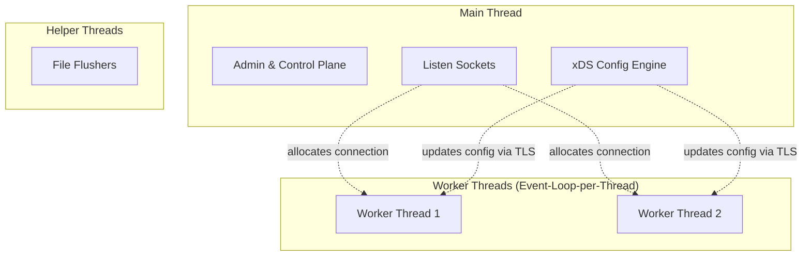
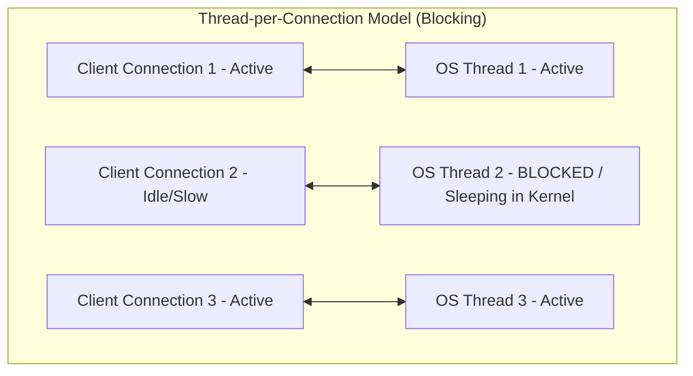
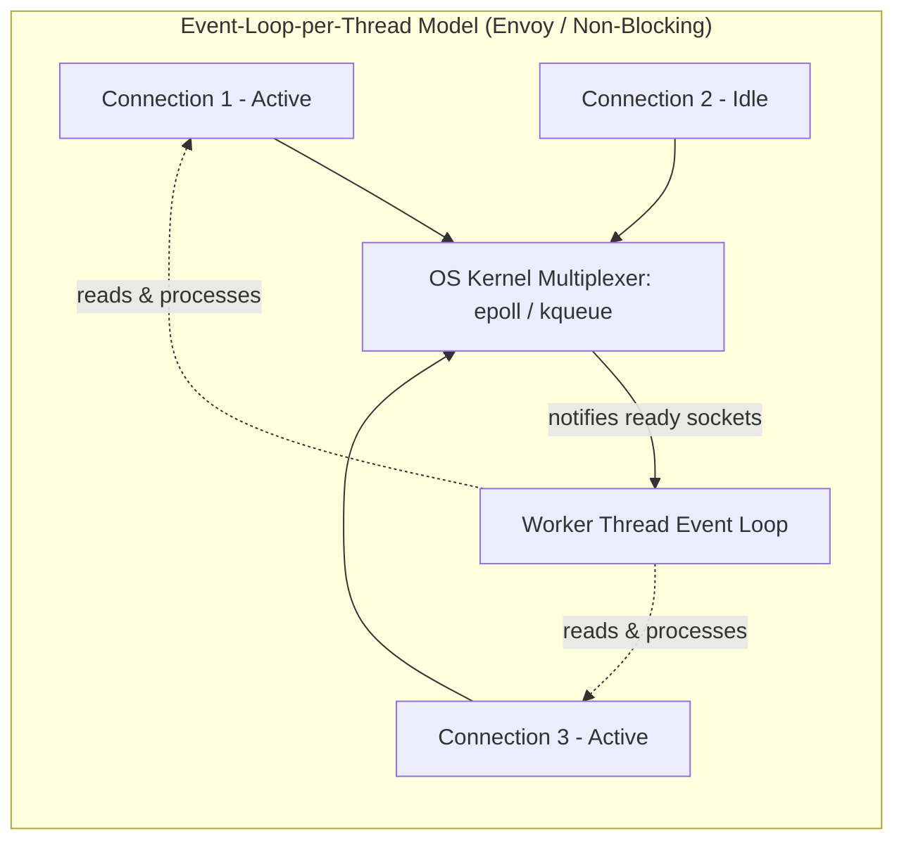

# Envoy Threading Model

Envoy Proxy uses a highly optimized, non-blocking **Event-Loop-per-Thread** model. Instead of allocating a separate thread for each connection or request, Envoy multiplexes many thousands of concurrent connections across a small, fixed pool of worker threads.

---

## 1. The Threading Architecture

Envoy operates with three main types of threads:

### The Main Thread
*   **Role**: Coordinates the proxy's control plane, administration, and runtime updates.
*   **Tasks**:
    *   Handles the Envoy admin console.
    *   Manages configuration updates received from the Control Plane (xDS APIs).
    *   Binds incoming listening ports (sockets) and coordinates connection handoffs.
    *   Processes process-wide statistics and signal handling.

### Worker Threads
*   **Role**: Executes the proxy's data plane, handling all request routing and network traffic.
*   **Event Loop**: Each worker thread runs an independent, non-blocking event loop using the `libevent` library.
*   **Sizing**: Typically, the number of worker threads is configured to match the number of physical CPU cores on the machine.

### File Flushers
*   **Role**: Write log buffers to disk asynchronously.
*   **Tasks**: Worker threads write logs to memory buffers. File flusher threads flush these buffers to disk in the background, preventing worker threads from blocking on disk I/O.

---

## 2. Connection Binding (Worker Thread Lifecycle)

When a client establishes a connection to Envoy:

1.  **Accept and Handoff**: The socket connection is accepted (either directly by a worker thread via `SO_REUSEPORT` or accepted on the main thread and dispatched).
2.  **Thread Binding**: Once assigned, the connection is **permanently bound to a single worker thread** for its entire lifetime.
3.  **Local Processing**: The assigned worker thread executes all network and application layer tasks for the connection:
    *   TLS handshake, decryption, and encryption.
    *   Protocol parsing (HTTP/1.1, HTTP/2, gRPC).
    *   Filter chain execution (RBAC, Rate Limiting, CORS, etc.).
    *   Routing decisions and upstream request dispatching.

---

## 3. Why This Model? (Lock-Free Performance)

Envoy's threading model is designed to minimize thread context switching and lock contention, achieving ultra-low latency and maximum throughput:

*   **Lock-Free Execution**: Because all operations for a specific connection occur on a single thread, there is no need for cross-thread synchronization (locks or mutexes) to process bytes on that connection.
*   **Thread Local Storage (TLS)**: To avoid global locks, Envoy makes extensive use of Thread Local Storage. Configurations, statistics, and upstream connection pools are duplicated across worker threads.
*   **Cache Locality**: Keeping a connection on the same CPU core preserves CPU cache warmth (L1/L2/L3 caches), preventing performance hits from cache invalidations.
*   **Non-blocking updates**: When configuration changes (e.g., adding an upstream cluster), the main thread prepares the new configuration and posts it to each worker thread's event loop queue. Each worker thread updates its own local copy without locking the system.

---

## 4. Comparison of Threading Models

| Model | Mechanics | Pros | Cons |
| :--- | :--- | :--- | :--- |
| **Thread-per-Connection** *(e.g., Apache)* | Spawns a dedicated OS thread for each network connection. | Simple programming model. | High memory overhead; context-switch thrashing under heavy concurrent traffic. |
| **Single Event Loop** *(e.g., Node.js)* | All connections run on a single, non-blocking event loop thread. | Zero lock contention; extremely lightweight. | Cannot scale to utilize multi-core processor architectures. |
| **Event-Loop-per-Thread** *(e.g., Envoy)* | Multiplexes connections across a fixed pool of event-loop threads (usually 1 per CPU core). | Scalability to all CPU cores; true parallel execution; lock-free traffic handling. | High software complexity (requires asynchronous non-blocking design). |

---

## 5. Architectural Comparison: Event-Loop-per-Thread vs. Thread-per-Connection

To understand Envoy's design, it is helpful to contrast the **Event-Loop-per-Thread (Non-Blocking)** model with the traditional **Thread-per-Connection (Blocking)** model.

### Model A: Thread-per-Connection (Blocking I/O)

In a traditional blocking architecture (such as Apache HTTP server or classic Tomcat), **each network connection maps to a dedicated OS thread**. 

*   **Mechanism**:
    *   Thread 2 wants to read data from Client 2, but Client 2 is idle.
    *   Thread 2 calls `read()`. Because the socket is blocking, the **OS Kernel suspends Thread 2** and puts it to sleep.
    *   Thread 2 is frozen and cannot process any other traffic. It remains asleep until Client 2 finally sends bytes.
*   **Bottleneck**: If you have 10,000 concurrent clients, you need 10,000 physical OS threads. Spawning thousands of threads wastes massive memory (call stacks) and forces the CPU to spend most of its time performing heavy thread context switches (thrashing).

---

### Model B: Event-Loop-per-Thread (Non-Blocking Multiplexing)

In Envoy's non-blocking event-loop architecture, **thousands of connections are multiplexed onto a single, highly active OS thread**.

*   **Mechanism**:
    *   The single worker thread registers all sockets (Connection 1, 2, and 3) with the operating system's network multiplexer (e.g., `epoll` on Linux or `kqueue` on macOS).
    *   The worker thread runs a continuous loop. Instead of blocking on a single socket, it asks the OS: *"Which of these thousands of sockets have data ready to be read?"*
    *   The OS immediately returns a list of ready sockets (e.g., Connection 1 and Connection 3). 
    *   The worker thread loops through only the ready sockets, processes their bytes, and then polls the OS again. It **never blocks** waiting for a slow client.
*   **Advantage**: A single thread can handle tens of thousands of connections concurrently with almost zero context switching overhead and a very low, flat memory footprint.

