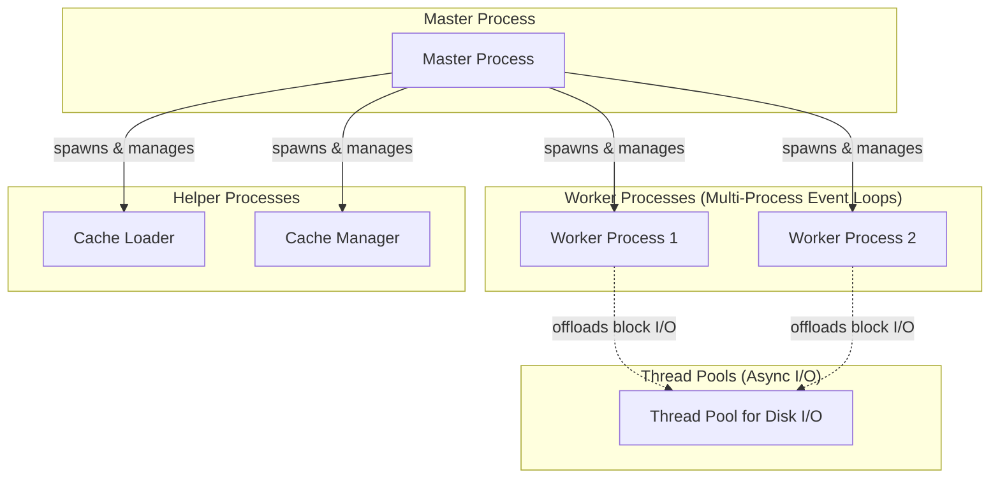

# Nginx Threading and Process Model

Nginx uses a highly scalable **Master-Worker Process** architecture. Instead of relying on a single process with multiple threads (like Envoy), Nginx runs as multiple independent **processes** to handle high-concurrency event-driven network I/O.

---

## 1. The Process Architecture

Nginx operates using a multi-process architecture consisting of one master process, multiple worker processes, and optional cache helper processes:



### The Master Process
*   **Role**: Coordinates the operations of the proxy, reads configurations, and manages the lifecycle of the worker processes.
*   **Tasks**:
    *   Reads and validates configuration files.
    *   Binds to listening sockets (ports) and inherits them down to the worker processes.
    *   Spawns, monitors, and gracefully shuts down worker processes during hot configuration reloads.
    *   *Note*: The Master process **does not** handle network traffic, perform TCP/TLS handshakes, or read packets.

### Worker Processes
*   **Role**: Handle all client connections, request routing, SSL/TLS, and upstream load balancing.
*   **Event Loop**: Each worker runs an independent, non-blocking single-threaded event loop (using kernel multiplexers like `epoll` on Linux or `kqueue` on macOS).
*   **Sizing**: Typically, Nginx spawns a **fixed pool** of workers matching the number of physical CPU cores on startup. These processes remain alive indefinitely (they are not spawned on-demand per request).
*   **Isolation**: Because they are separate OS processes, worker processes have **isolated memory spaces**.

### Helper Processes (Cache Manager & Cache Loader)
*   **Cache Loader**: Runs on startup to scan disk-stored cache items and load metadata into shared memory.
*   **Cache Manager**: Runs periodically in the background to clean up cache folders and enforce cache size limits.

### Optional Thread Pools (For Blocking Disk I/O)
*   By default, Nginx is completely non-blocking for network sockets. However, reading static files from disk can still block a worker process. 
*   Nginx uses optional **Thread Pools** within each worker process to offload blocking read/write I/O operations (like serving large static files), keeping the main worker event loop free to handle network events.

---

## 2. Connection Acceptance & Packet Flow

A common misconception is that the Master process accepts client connections and hands them to workers. In reality, connection acceptance and packet processing are managed directly by the **OS Kernel** and the **Worker processes**:

```
[Client]                      [OS Kernel (TCP Stack)]            [Nginx Workers]
   │                                    │                              │
   │── 1. TCP SYN ─────────────────────>│                              │
   │<── 2. SYN-ACK ─────────────────────│                              │
   │── 3. ACK ─────────────────────────>│                              │
   │   (Handshake complete)             │                              │
   │                                    │── 4. Put in Accept Queue ──> │
   │                                    │                              │
   │                                    │                              │── 5. Worker calls accept()
   │                                    │                              │      (Gets connection socket)
   │                                    │                              │
   │<========= 6. Subsequent Data Packets (Read/Write) ===============>│
   │           (Direct communication; Master process is never involved)│
```

### Step 1: TCP Handshake (OS Kernel)
When a client initiates a connection, the OS Kernel's TCP/IP stack completes the 3-way handshake (`SYN` $\rightarrow$ `SYN-ACK` $\rightarrow$ `ACK`). The established connection descriptor is placed in the kernel's listening socket accept queue.

*   **With `SO_REUSEPORT`**: The kernel hashes the client's 4-tuple (source IP, source port, dest IP, dest port) and routes the handshake directly to the listening socket queue of a specific worker process.
*   **Without `SO_REUSEPORT`**: The connection is placed in a single shared accept queue, and workers contend for it (often coordinated via Nginx's internal `accept_mutex` lock to prevent the "thundering herd" problem).

### Step 2: Connection Retrieve & TLS Handshake (Worker Process)

*   The worker process event loop detects a readable listen socket and calls `accept()` to retrieve the connection.
*   The **Worker process** handles the entire **TLS Handshake** (negotiating cipher suites, exchanging keys, decrypting the client payload). By doing this in the worker, the heavy CPU computation required for cryptography is naturally run in parallel across multiple CPU cores.

### Step 3: Subsequent Data Packets (Direct Route)
Once the connection is established, the kernel associates the connection's 4-tuple with the socket file descriptor owned by the specific worker. 

*   Subsequent data packets bypass load-balancing logic entirely. 
*   The kernel identifies the socket owner using its internal connection table, places the payload in the worker's socket buffer, and wakes up that worker's event loop to process the HTTP data.

---

## 3. Event-Driven Concurrency: Sockets, Kernel, and CPU Scheduling

To understand the raw efficiency of Nginx, it is important to trace how file descriptors (sockets) interact with the OS Kernel and CPU scheduler during active traffic.

### Sockets in Kernel Memory
Every client connection is represented by a **File Descriptor (FD)**. This FD is a pointer to a socket data structure residing entirely in **Kernel Memory Space**. Along with the socket, the kernel allocates:
*   **Receive Buffer (Rx)**: Stores incoming raw packet data.
*   **Send Buffer (Tx)**: Stores outgoing response bytes.

When a client connection is idle (e.g., waiting for the client to send a request), the socket sits passively in memory, consuming **0% CPU**.

### The Event Loop and CPU Scheduling

Instead of dedicating a thread to block on each socket, Nginx workers multiplex FDs using the event loop:

1.  **Sleeping in the Kernel (`epoll_wait`)**:
    When there is no active traffic, the Nginx worker process calls `epoll_wait()` (or `kqueue()`). Because there are no active events, the OS scheduler **puts the worker process to sleep**. The worker yields the CPU so other system tasks can run.
2.  **Hardware Interrupt**:
    When a packet arrives from the network card (NIC), the card uses DMA to write the packet into system RAM and triggers a hardware interrupt.
3.  **Kernel Buffering & Marking Ready**:
    The kernel's TCP/IP stack processes the packet, matches it to the connection's 4-tuple, places the payload into the socket's Receive Buffer, and appends the socket's File Descriptor to the `epoll` instance's internal **Ready List**.
4.  **Worker Scheduling**:
    The kernel detects that the Nginx worker process is sleeping, waiting for events on this `epoll` set. The kernel **wakes up the worker process** and schedules it onto an available CPU core.
5.  **User-Space Processing**:
    `epoll_wait()` returns, handing the worker process a list containing *only* the active, ready file descriptors. The worker loops through this list on the CPU:
    *   It calls `read(fd)` to copy data from the kernel space buffer to user space.
    *   It processes the HTTP request, performs routing, and writes the response.
6.  **Loop Cycle Complete**:
    Once all ready descriptors are processed, the worker process calls `epoll_wait()` again and goes back to sleep until the kernel notifies it of the next network event.

> [!NOTE]
> File descriptors do not "get" CPU time directly. The **user-space worker process** gets CPU scheduling time, but *only* when the kernel marks one or more file descriptors as ready for processing. This ensures that the CPU spends zero cycles polling idle connections.

---

## 4. Comparison: Nginx vs. Envoy

While both proxies achieve extreme scale using non-blocking event-driven architectures, they approach concurrency and state management from fundamentally different paradigms:

| Feature | Nginx | Envoy |
| :--- | :--- | :--- |
| **Concurrency Unit** | **Processes** (`master` and multiple `worker` processes) | **Threads** (`main` and multiple `worker` threads in a single process) |
| **Memory Architecture** | **Shared Memory (SHM)**. Isolated worker address spaces; shared data must reside in explicit SHM zones. | **Shared Heap**. All worker threads share the same process memory space. |
| **Hot Configuration Reload** | **Fork & Spawn**. Spawns new worker processes with the new config; old workers gracefully exit after finishing active connections. | **In-Place Dynamic Updates (xDS)**. Control plane pushes updates directly to worker event loops via Thread Local Storage (TLS) without process restarts. |
| **Fault Isolation** | **High**. If a worker process crashes, other workers continue running. The master process respawns it. | **Low**. A crash in a worker thread (e.g., SEGFAULT) takes down the entire Envoy process. |
| **Upstream Connection Pools** | Per-worker process. Connections to backends cannot easily be shared across workers, leading to higher total upstream connection counts. | Per-worker thread. Mitigated by thread-local connections, but sharing statistics and configurations is easier due to a shared heap. |
| **I/O Offloading** | Worker offloads blocking disk operations to helper **Thread Pools**. | Worker offloads disk logging to asynchronous **File Flusher** threads. |

---

## 5. Architectural Trade-offs: Multi-Process vs. Multi-Threaded

### Multi-Process Architecture (Nginx)

> [!NOTE]
> Nginx's model excels at **robustness, security sandboxing, and stability**.

*   **Pros**:
    *   **High Fault Isolation**: A segmentation fault or memory corruption in one worker process (e.g., inside a third-party C module) only crashes that single worker. The master process automatically detects the crash and spawns a replacement worker immediately. Other active connections remain untouched.
    *   **Security Sandboxing**: The Master process runs as `root` to bind to port 80/443, but Worker processes drop privileges to run as a restricted user (e.g., `nginx`). If a worker is compromised, the attacker has limited host access.
    *   **Memory Leak Protection**: Memory leaks are cleared automatically during configuration reloads because old worker processes are destroyed and replaced.
    *   **Simpler Programming Model**: Developers writing Nginx C modules do not need to manage thread locks, mutexes, or race conditions.
*   **Cons**:
    *   **Complex Shared State**: Since processes do not share a heap, sharing data (like rate-limiting counters, cache keys, or load-balancing metrics) requires allocating explicit Shared Memory (SHM) zones in the kernel and managing inter-process locks.
    *   **Resource Reload Spikes**: Spawning a new set of worker processes during a configuration reload creates a brief period where double the processes are running, causing memory and CPU spikes.
    *   **Connection Pool Fragmentation**: Upstream connection pools cannot be easily shared across processes. If you have 8 workers and want to keep a pool of 10 connections to a backend, each worker keeps its own pool, resulting in up to 80 total connections instead of 10.

---

### Multi-Threaded Architecture (Envoy)

> [!TIP]
> Envoy's model excels at **dynamic cloud-native configurations, low-overhead shared state, and connection pool efficiency**.

*   **Pros**:
    *   **Single Shared Memory Space**: Since all threads share the same heap, sharing configuration, statistics, and upstream connection pools is easy and lightweight.
    *   **Dynamic, In-place Configuration Updates**: Configurations are updated in-place via xDS and propagated to Thread Local Storage (TLS). No new threads or processes are spawned, ensuring a flat, predictable memory and CPU profile during reloads.
    *   **Optimized Upstream Connection Pooling**: Threads can easily coordinate or share connection pooling metrics to minimize idle connections to backend servers.
*   **Cons**:
    *   **Low Fault Isolation (Single Point of Failure)**: A crash in a single worker thread (e.g., a segmentation fault in C++ code) takes down the **entire Envoy process**, dropping all client connections across all CPU cores.
    *   **Security Vulnerability Scope**: If an attacker gains code execution in a thread, they have access to the entire process memory space, including TLS keys and certificates used by other threads.
    *   **High Development Complexity**: Writing extension filters in C++ requires extreme care. Concurrency, lock-free structures, and atomic memory operations are necessary to avoid data races and deadlocks.