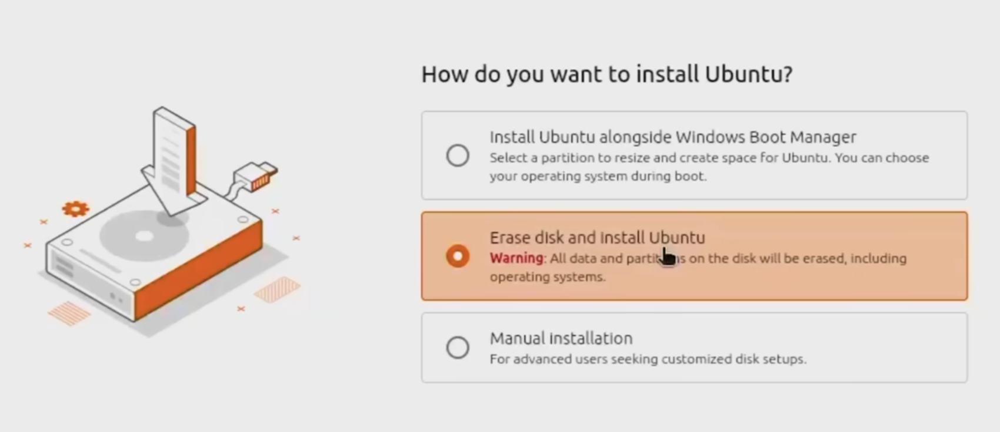

# Ubuntu and Fedora Dual Boot System Installation Guide

## Introduction

This guide outlines the step-by-step process for installing both Ubuntu and Fedora for dual boot on a dedicated machine.

---

## Prerequisites

- **Target Machine**: The computer where the Ubuntu OS will be installed.
- **USB Drive**: A flash drive with sufficient capacity to store the Ubuntu ISO and serve as a bootable medium.

### Recommended Hardware
The following components were utilized for this specific setup:

- **Computer**: [HP EliteDesk 800 G3 Mini (Intel i5-7500 3.40GHz, 16GB RAM, 256GB SSD)](https://www.ebay.com/sch/i.html?_nkw=HP+EliteDesk+800+G3+Mini+Intel+i5-7500+3.40Ghz+16GB+RAM+256GB+Windows+11+Pro&_sacat=0&_from=R40&_trksid=m570.l1313&_odkw=HP+EliteDesk+800+G3+Mini+Intel+i5-7500&_osacat=0)
- **Storage**: [Lexar D40E 128GB Dual USB 3.2 Gen 1 Type-C Jump Drive](https://a.co/d/0bvbH5vn)

---

## Installation Steps

### **1. Create a Bootable USB Drive**

1. Download the latest [Ubuntu Desktop ISO](https://ubuntu.com/download/desktop).
1. Download a reliable flashing utility such as [balenaEtcher](https://www.balena.io/etcher/) or [Rufus](https://rufus.ie/).
1. Insert the USB drive and utilize the flashing tool to write the ISO:
    - Select **Flash from file** and navigate to the downloaded Ubuntu ISO.
    - Click **Select target** and choose the appropriate USB drive.
    - Click **Flash!** to begin the process.

    

!!! warning "Administrative Privileges"

    If prompted by balenaEtcher for privileged access to the USB drive, provide your system password to authorize the operation.
    

### **2. Boot from the Installation Medium**

1. Insert the bootable USB into the target machine and access the BIOS/UEFI interface by pressing the `F2` key (or the key specific to your hardware) during startup.
1. Navigate to the **Boot Menu** and select the entry corresponding to your USB drive under **UEFI**.
    
    
1. Once the Ubuntu installer launches, follow the on-screen prompts to configure your installation preferences.
    
    

    !!! Warning

        In the **Interactive installation** process, you will be given three options for the "How do you want to install Ubuntu"? Choose the **Erase disk and install Ubuntu** option to start from the clean disk. Please ensure all critical data is backed up to an external location, as this operation will permanently erase all existing content on the disk.

        

### **3. Initial System Boot on Ubuntu**

1. After the installation completes, the system may require manual intervention to boot into the new OS. If the machine fails to reboot automatically, re-enter the BIOS interface (`F2`) and manually select the **UEFI - Ubuntu** boot option.
    
1. Upon a successful boot, log in using the credentials established during the installation process.

---

## Preparation for Fedora

### **4. Disk Partitioning**

To install Fedora alongside Ubuntu, you must shrink the existing Ubuntu partition to create unallocated space. **This must be performed from the Ubuntu Live USB**, as you cannot resize a partition that is currently in use ("target is busy").

1. Insert the **Ubuntu Live USB** and boot the machine into the **"Try Ubuntu"** mode.
1. Launch **GParted** from the applications menu.
1. Identify your main Linux partition (e.g., `/dev/sda2` or `/dev/nvme0n1p2`). It should be formatted as `ext4`.
1. Right-click the partition and select **Resize/Move**.
    
1. Enter the desired size in the **New size (MiB)** field. To reduce a 255GB disk to 127GB, enter `130048`.
1. Click **Resize/Move** and then click the **Apply All Operations** (checkmark icon) in the toolbar to commit the changes.
    
1. Once complete, shutdown the machine. You now have the necessary unallocated space to proceed with the Fedora installation.

### **5. Create a Bootable Fedora USB Drive**

1. Download the latest [Fedora Server DVD ISO](https://fedoraproject.org/server/download/).
    
1. Download a reliable flashing utility such as [balenaEtcher](https://www.balena.io/etcher/) or [Rufus](https://rufus.ie/).
1. Insert the USB drive and use the flashing tool to write the ISO image:
    - Select **Flash from file** and navigate to the downloaded Fedora ISO.
    - Click **Select target** and choose your USB drive.
    - Click **Flash!** to initiate the process.

    

### **6. Boot from the Installation Medium**

1. Insert the bootable USB into the target machine and access the BIOS/UEFI interface by pressing the `F2` key (or the hardware-specific key) during the boot sequence.
1. Navigate to the **Boot Menu** and select the entry corresponding to your USB drive under **UEFI**.
    
    
1. On the boot selection screen, choose **Install Fedora 44** (or the version you downloaded).
    
1. Once the Fedora installer initializes, follow the on-screen prompts to configure your installation settings and disk partitioning.
    
    

### **7. Initial System Boot on Fedora**

1. Following the installation, the system may default to booting from an existing drive or partition rather than the new Fedora installation. If this occurs, initiate a system reboot to access the boot configuration.
1. Re-enter the BIOS interface (`F2`), navigate to the **Boot Menu**. You will find that {==both Fedora and Ubuntu options are available==}.
    
1. Following a successful boot, log in using the administrative credentials established during the installation process.
    

