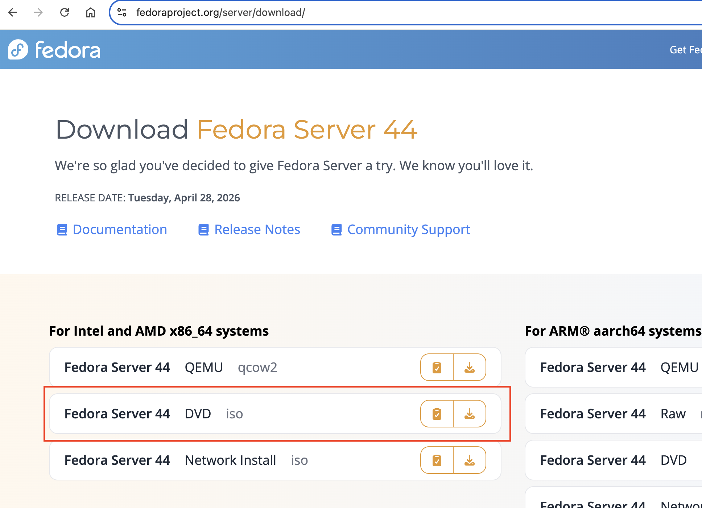
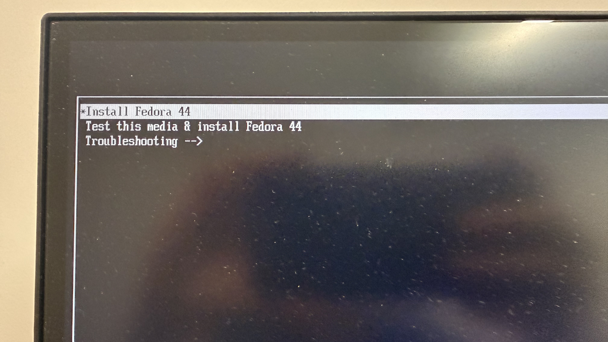
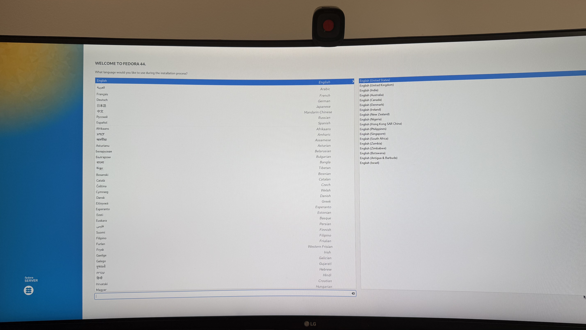
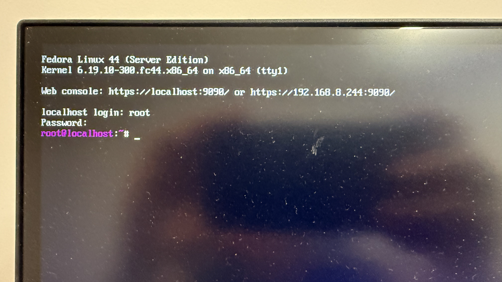

# Fedora Installation Guide

## Introduction

This guide provides a comprehensive, step-by-step procedure for installing Fedora Server on a dedicated machine.

---

## Prerequisites

- **Target Machine**: The computer designated for the Fedora installation.
- **USB Drive**: A flash drive with adequate capacity to hold the Fedora ISO and function as a bootable installation medium.

### Recommended Hardware
The following hardwares were used for this installation:

- **Computer**: [HP EliteDesk 800 G3 Mini (Intel i5-7500 3.40GHz, 16GB RAM, 256GB SSD)](https://www.ebay.com/sch/i.html?_nkw=HP+EliteDesk+800+G3+Mini+Intel+i5-7500+3.40Ghz+16GB+RAM+256GB+Windows+11+Pro&_sacat=0&_from=R40&_trksid=m570.l1313&_odkw=HP+EliteDesk+800+G3+Mini+Intel+i5-7500&_osacat=0)
- **Storage**: [Lexar D40E 128GB Dual USB 3.2 Gen 1 Type-C Jump Drive](https://a.co/d/0bvbH5vn)

---

## Installation Steps

### **1. Create a Bootable USB Drive**

1. Download the latest [Fedora Server DVD ISO](https://fedoraproject.org/server/download/).
    
1. Download a reliable flashing utility such as [balenaEtcher](https://www.balena.io/etcher/) or [Rufus](https://rufus.ie/).
1. Insert the USB drive and use the flashing tool to write the ISO image:
    - Select **Flash from file** and navigate to the downloaded Fedora ISO.
    - Click **Select target** and choose your USB drive.
    - Click **Flash!** to initiate the process.

    

!!! warning "Administrative Privileges"

    If balenaEtcher requests privileged access to the USB drive, provide your system password to authorize the operation.
    

### **2. Boot from the Installation Medium**

1. Insert the bootable USB into the target machine and access the BIOS/UEFI interface by pressing the `F2` key (or the hardware-specific key) during the boot sequence.
1. Navigate to the **Boot Menu** and select the entry corresponding to your USB drive under **UEFI**.
    
    
1. On the boot selection screen, choose **Install Fedora 44** (or the version you downloaded).
    
1. Once the Fedora installer initializes, follow the on-screen prompts to configure your installation settings and disk partitioning.
    
    

### **3. Initial System Boot**

1. Upon completion of the installation, you will reach a command-line interface. Type `reboot` at the prompt to restart the machine.
1. Re-enter the BIOS interface (`F2`), navigate to the **Boot Menu**, and select the **UEFI - Fedora** option to ensure the system boots from the internal drive.
1. Following a successful boot, log in using the administrative credentials established during the installation process.
    
