# 🏠 Kubernetes Homelab Guide

<!-- Add badges here if you like (e.g., License, Build Status, k8s version) -->


## 📖 Introduction

Welcome to my Kubernetes Homelab repository. This project documents the journey of building a bare-metal Kubernetes cluster at home.

**Goal:** To create a highly available cluster using GitOps principles to host personal services.


## 🛠 Tech Stack

- **Hypervisor:** [Proxmox VE](https://www.proxmox.com/) - Type-1 Hypervisor for managing virtual machines and resources.
- **OS:** [Talos Linux](https://www.talos.dev/) - A modern, security-focused, and immutable operating system built specifically for Kubernetes.
- **Provisioning:** [Terraform](https://www.terraform.io/) / [OpenTofu](https://opentofu.org/) - Infrastructure as Code to automate Proxmox VM creation.
- **Management:** `talosctl` - CLI tool for managing the Talos nodes and cluster configuration.

## 🚀 Getting Started

### Prerequisites
- **K8s nodes**: three or more k8s worker machines for running containerized applications. Any desktops or laptops would be fine.
- **Switch**: creating a local network for k8s nodes and allowing them to communicate via ethernet cables. You don't necessarily need it if your nodes have wifi capabilities. 
- **Router**: connecting the local network(k8s nodes and your main desktop or laptop) to the internet, working as a Gateway where Network Address Translation happens from the perspective of k8s nodes.
- **USB**: to store the Proxmox Virtual Environment ISO. K8s nodes will boot from it.

Below is the list of what I actually bought for this project.

- [HP EliteDesk 800 G3 Mini Intel i5-7500 3.40Ghz 16GB RAM 256GB](https://www.ebay.com/sch/i.html?_nkw=HP+EliteDesk+800+G3+Mini+Intel+i5-7500+3.40Ghz+16GB+RAM+256GB+Windows+11+Pro&_sacat=0&_from=R40&_trksid=m570.l1313&_odkw=HP+EliteDesk+800+G3+Mini+Intel+i5-7500&_osacat=0)
- [90W AC Adapter Power Supply For HP EliteDesk Desktop Mini 705 800 G1 G2 G3 P](https://www.ebay.com/itm/184762063863)
- [GL.iNet GL-MT3000 (Beryl AX) Portable Travel Router](https://www.ebay.com/sch/i.html?_nkw=GL.iNet+GL-MT3000+%28Beryl+AX%29+Portable+Travel+Router&_sacat=0&_from=R40&_trksid=p2332490.m570.l1313)
- [TP-Link TL-SG105, 5 Port Gigabit Desktop Switch](https://a.co/d/0cTK4YzR)
- [Ethernet Cable Pack](https://a.co/d/0d0mLgHL)
- [128GB Dual USB](https://a.co/d/0bvbH5vn)


### Deployment Steps

#### **1. Set up the router**

Follow [the official user guide](https://docs.gl-inet.com/router/en/4/user_guide/gl-mt3000/). The key parts are:
    
1. Power on
1. Connect your laptop to the router via wifi
1. Log in to the Beryl AX router web UI(http://192.168.8.1)
1. Connect the Beryl AX router to the ISP's router using either **Ethernet** or **Repeater**. I select the "Repeater" mode because the Beryl AX router is located in the second floor while the ISP's router in the first floor.

The successful setup would look like below:
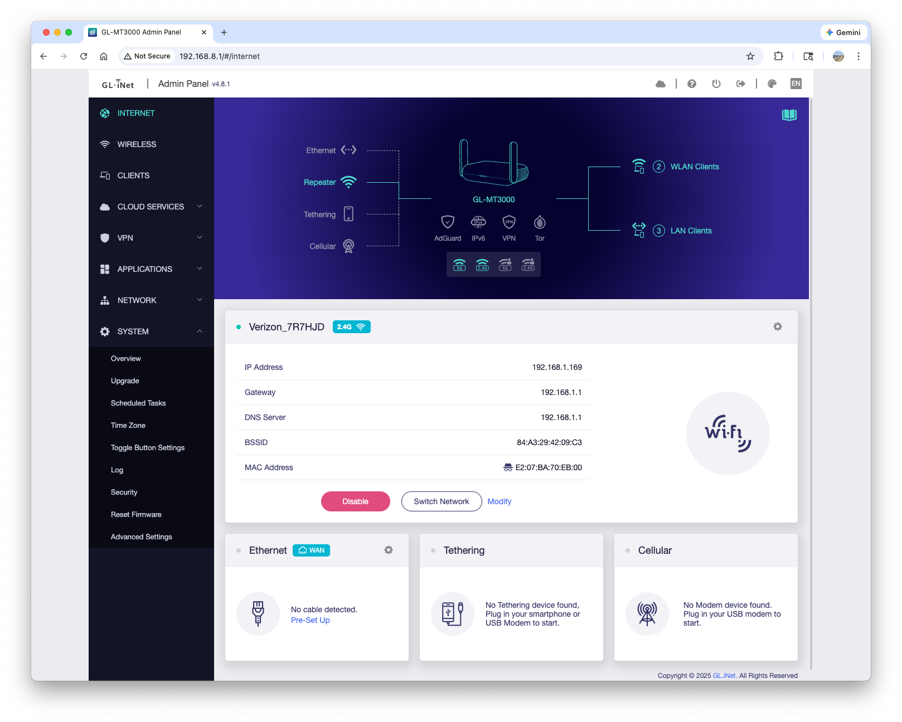


#### **2. Connect k8s nodes to the router**

Connect each k8s node and the Beryl AX router to the switch using the ethernet cable. Please refer to my setup below:


The k8s nodes being connected, go to the Beryl AX router web UI > Clients. You will see your laptop and k8s nodes appear on the list:
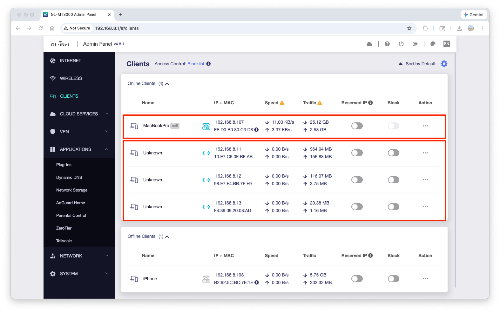

The current network topology should look like below:
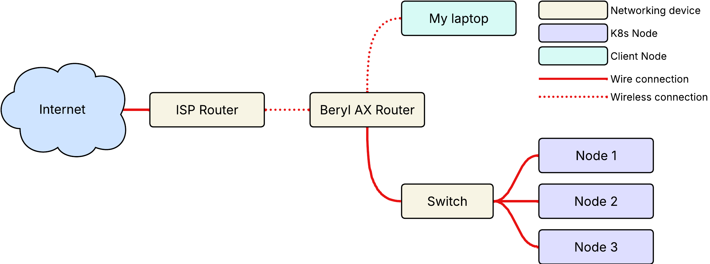


#### **3. Create Bootable Proxmox VE USB**

1. Download the latest [Proxmox VE ISO](https://www.proxmox.com/en/downloads).
1. Download a flashing tool like [BalenaEtcher](https://www.balena.io/etcher/) or [Rufus](https://rufus.ie/).
1. Insert your USB drive and flash the ISO using the tool.
    - click **Flash from file** and select the downloaded Proxmox VE ISO file.
    - click **Select target** and select your USB
    - click **Flash**

    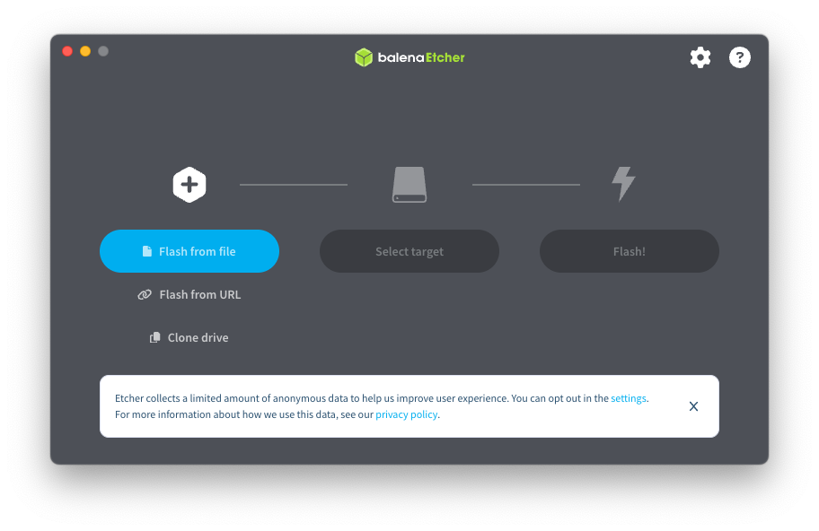


#### **4. Install Proxmox VE on k8s nodes**

1. Plug the USB into your k8s node, boot into BIOS(`F2` in my case), and set the USB as the primary boot device.
1. Follow the Proxmox installation wizard to set up the hypervisor on each node.
    > In `Management Network Configuration` page, enter the following value for each entry:
    > - Hostname (FQDN): 
    >     - node 1: ``pve-01.local`
    >     - node 2: ``pve-02.local`
    >     - node 3: ``pve-03.local`
    > - IP Address (CIDR):
    >     - node 1: `192.168.8.11/24`
    >     - node 2: `192.168.8.12/24`
    >     - node 3: `192.168.8.13/24`
    > - Gateway: `192.168.8.1`
    > - DNS Server: `192.168.8.1`
1. After all the install process is done, you will see the following on your screen. You don't need to log in at this point. Move on to the next node and repeat the install process.

    ```
    Welcome to the Proxmox Virtual Environment. Please use your web browser to configure it - connect to:

    https://192.168.8.11:8006/

    pve-01 login:
    ```


#### **5. Create the Proxmox Cluster**

To manage all three physical nodes from a single interface, we will join them into a Proxmox Datacenter cluster.
1. Open your browser and navigate to the UI of your first node: `https://192.168.8.11:8006` (Bypass the SSL warning).
1. Log in with the username `root` and the password you created during installation.
1. In the left navigation pane, click on Datacenter.
1. In the middle pane, navigate to Cluster and click Create Cluster.
1. Name the cluster (e.g., `k8s-homelab`) and click Create.
    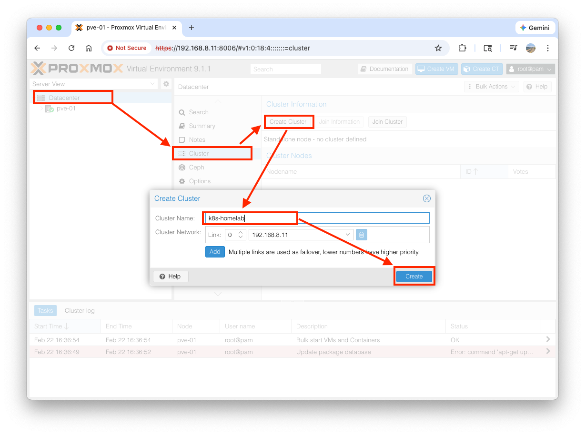
1. Once created, click the `Join Information` first and the `Copy Information` button.
    

Join the other nodes:
1. Open new browser tabs for `https://192.168.8.12:8006` (pve-02) and `https://192.168.8.13:8006` (pve-03).
1. Log into each, navigate to `Datacenter` -> `Cluster`, and click `Join Cluster`.
1. Paste the Join Information string you copied from pve-01. Enter the root password for pve-01 and click Join.
    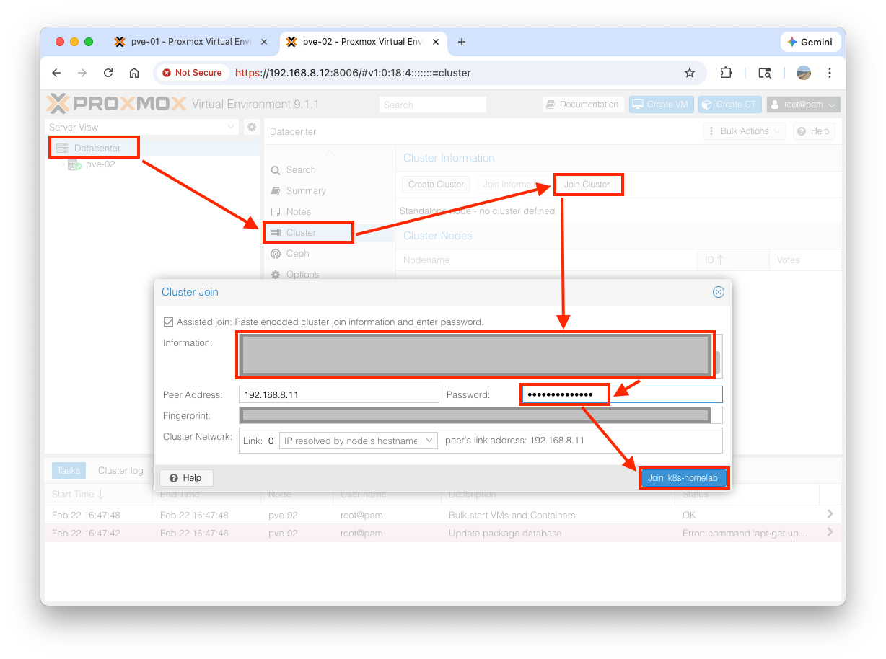
1. After a few seconds, pve-01 will show all three nodes listed under its Datacenter view. You can now close the tabs for pve-02 and pve-03 and manage everything from 192.168.8.11.
    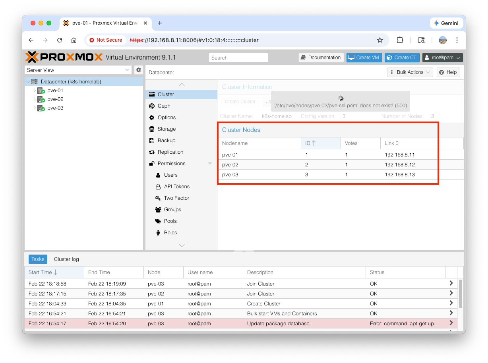


#### **6. Download the Talos Linux ISO**

Before creating the virtual machines, Proxmox needs the Talos operating system image stored locally.

1. Get the latest Talos ISO link. Go to the [Talos GitHub Releases](https://github.com/siderolabs/talos/releases) page, find the latest version, and copy the link for the `metal-amd64.iso` file.
    ```sh
    # Example: Download Talos ISO via CLI or use the URL in Proxmox UI
    chmod +x scripts/get-talos-iso.sh
    ./scripts/get-talos-iso.sh
    ```
1. In your Proxmox UI (pve-01), expand the `pve-01` node on the left panel.
1. Click on the `local (pve-01)` storage drive.
1. In the middle pane, select `ISO Images`.
1. Click `Upload`, select the downloaded Talos ISO file, and click `Upload`.
    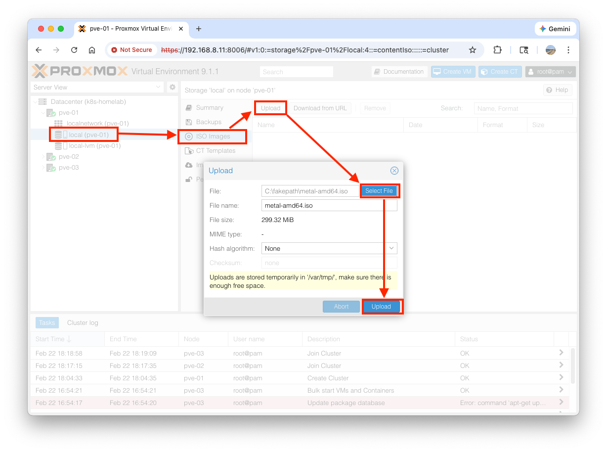
1. Repeat the same process for `pve-02` and `pve-03`.


#### **7. Provision Talos VMs**

We will create one VM on each of our three physical servers (pve-01, pve-02, pve-03) to ensure high availability.

##### Step 7.1: The VM Wizard

1. Log into your Proxmox UI (`https://192.168.8.11:8006`).
1. In the top right corner, click the blue `Create VM` button.
1. Follow these exact settings through the wizard. Before moving forward, check `Advanced` option at the bottom to open up the advanced options on each tab:
    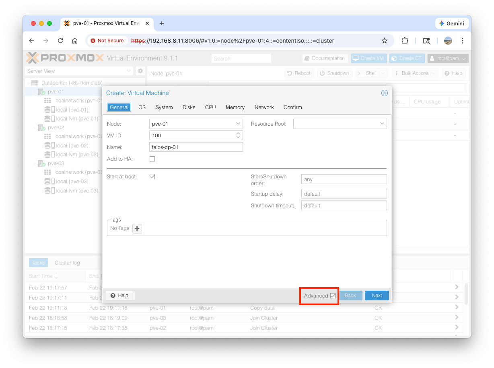
    - **General Tab**
        - Node: `pve-01`
        - VM ID: Leave as default (e.g., `100`)
        - Name: `talos-cp-01` (cp stands for control-plane)
        - Start at boot: Check this box.
    - **OS Tab**
        - ISO image: Select the `metal-amd64.iso` you downloaded earlier.
        - Type: `Linux`
        - Version: `6.x - 2.6 Kernel`
    - **System Tab**
        - Leave everything as default. (Do not check QEMU Guest Agent; Talos handles this natively later).
    - **Disks Tab**
        - Storage: `local-lvm`
        - Disk size (GiB): `32`
        - Advanced: Check **SSD emulation** and **Discard** (this is important for the physical SSD's health).
    - **CPU Tab**
        - Cores: `4` (Passes all 4 cores of the physical CPU to the VM for maximum scheduling performance).
        - Type: `host` (This exposes the actual CPU architecture to Talos, drastically improving cryptographic and networking speeds).
    - **Memory Tab**
        - Memory (MiB): `4096`
        - Advanced: **Uncheck** Ballooning Device. (Kubernetes needs guaranteed memory; ballooning can cause out-of-memory crashes).
    - **Network Tab**
        - Bridge: `vmbr0`
        - Model: `VirtIO (paravirtualized)` (Fastest networking standard).
    - **Confirm Tab**
        - Click `Finish`

##### Step 7.2: Repeat for Node 2 and Node 3
Repeat the exact same wizard two more times to create the other two nodes.
    - Create `talos-cp-02` on the `pve-02` node.
    - Create `talos-cp-03` on the `pve-03` node.

##### Step 7.3: Disable the Proxmox VM Firewall

1. `talos-cp-01` > `Hardware` > Double-click on `Network Device (net0)`
1. **Uncheck** `Firewall` and click `OK`
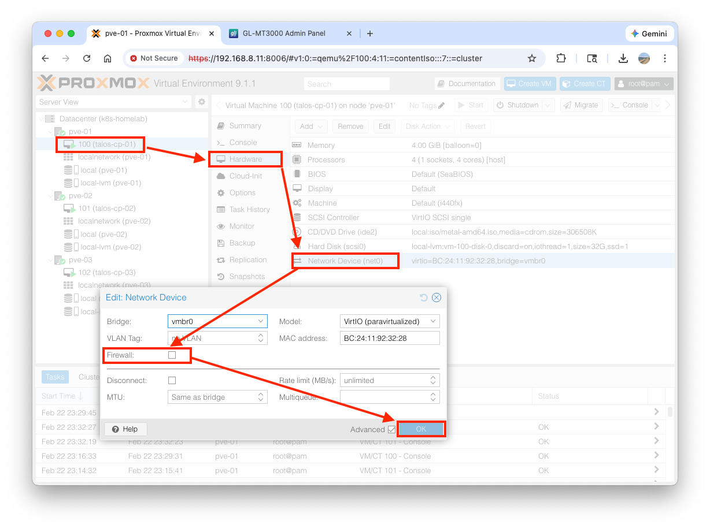 
1. Repeat this process for `talos-cp-02` and `talos-cp-03`


##### Step 7.4: Gather the MAC Addresses and DHCP Lease
Before turning the VMs on, we need to know their hardware network addresses so we can tell our Beryl AX router to assign them permanent, static IP addresses.

1. Click on `talos-cp-01` in the left menu.
1. Go to `Hardware` in the middle menu.
1. Double-click on `Network Device (net0)`.
1. Copy the `MAC address` (it looks like `BC:24:11:XX:XX:XX`).
1. Repeat this for `talos-cp-02` and `talos-cp-03` and write them down.
1. Log into your GL-MT3000 (Beryl AX) router web UI at `http://192.168.8.1`.
1. `NETWORK` > `LAN` > `Address Reservation` > `Add`
1. You will be prompted to enter a MAC address and an IP address.
    - **MAC Address**: Paste the MAC address you copied from `talos-cp-*` in Proxmox.
    - **IP Address**:
        - `talos-cp-01`: `192.168.8.51`
        - `talos-cp-02`: `192.168.8.52`
        - `talos-cp-03`: `192.168.8.53`
    - **Description**: `talos-cp-*`
    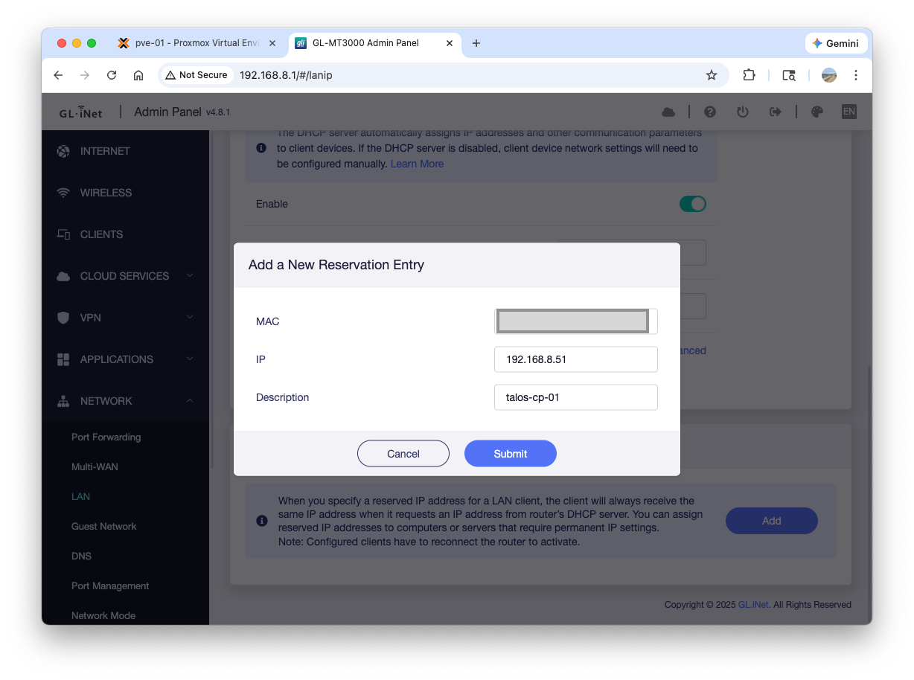

The router is now strictly instructed to intercept any DHCP requests from those specific virtual network cards and hand them those exact IP addresses.

#### **8. Install Talos CLI**

Install `talosctl` with the following command:
```bash
# mac os or linux
brew install siderolabs/tap/talosctl

# windows
curl -sL https://talos.dev/install | sh
```

Once it is installed, you can verify it is ready to go by typing `talosctl version` in your terminal:


#### **9. Generate/Edit Cluster Configuration**

Generate the configuration files that tell Talos how to build your cluster. Use the Virtual IP (VIP) designated for your Control Plane: `192.168.8.60`. Run the following command:
```bash
mkdir -p ./config
talosctl gen config k8s-homelab https://192.168.8.60:6443 --output-dir ./config
```

This will generate three files in your current folder:
- `controlplane.yaml`: The configuration you will apply to your three Proxmox VMs.
- `worker.yaml`: The configuration for any future worker nodes you might add.
- `talosconfig`: The credentials file your laptop uses to securely connect to the cluster.

Edit `controlplane.yaml` file to have the below `network:` block:
```yaml
machine:
  network:
    interfaces:
      - deviceSelector:
          physical: true
        dhcp: true
        vip:
          ip: 192.168.8.60
```

#### **10. Boot the Virtual Machines**

1. Go to your Proxmox Web UI (`https://192.168.8.11:8006`).
1. Right-click on `talos-cp-01`, `talos-cp-02`, and `talos-cp-03` and select Start.
1. Open the **Console** tab for one of them.

You will see the Talos OS boot up and eventually pause, displaying a message that it is in "maintenance mode." It will also print its IP address (which should be your static IPs: `192.168.8.51`, `.52`, or `.53`).

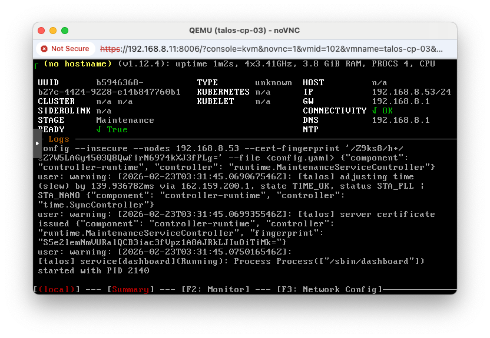

#### **11. Apply the Configuration**


Now we inject the `controlplane.yaml` file into each node. Because the nodes are brand new and don't have cryptographic certificates yet, we use the `--insecure` flag for this very first push.

Run these three commands from your laptop's terminal:
```bash
talosctl apply-config --insecure --nodes 192.168.8.51 --file ./config/controlplane.yaml
talosctl apply-config --insecure --nodes 192.168.8.52 --file ./config/controlplane.yaml
talosctl apply-config --insecure --nodes 192.168.8.53 --file ./config/controlplane.yaml
```

> Note: After receiving the file, the nodes will automatically reboot, apply the configuration, and start pulling the Kubernetes container images.

<!-- If you open up the console, you might see some error messages, such as below:


`dial tcp 192.168.8.60:6443: connect: no route to host` is completely normal at this stage of the installation, with the following reasons:
- The node is trying to communicate with the cluster's main API address, which we defined as the Virtual IP (VIP) `192.168.8.60`.
- However, that VIP does not actually exist on your physical router. It is a "floating" IP that the Talos nodes will create and share among themselves.
- Until the `etcd` database is successfully bootstrapped and the nodes elect a leader, that VIP remains offline, causing this temporary timeout. -->


#### **12. Bootstrap the Cluster**

1. Run the following command to trigger the bootstrap process on your first node:
```bash
talosctl bootstrap --nodes 192.168.8.51 --endpoints 192.168.8.51 --talosconfig=./config/talosconfig
```
1. Download `kubeconfig` from the cluster and save them to `config` directory
```bash
talosctl kubeconfig ./config --nodes 192.168.8.51 --endpoints 192.168.8.51 --talosconfig=./config/talosconfig
```
1. Run the test command
```bash
kubectl --kubeconfig=./config/kubeconfig get nodes
```

It will return nodes info:
```
NAME            STATUS   ROLES           AGE   VERSION
talos-1jp-5xx   Ready    control-plane   21m   v1.35.0
talos-7cb-oml   Ready    control-plane   21m   v1.35.0
talos-ogq-rdt   Ready    control-plane   21m   v1.35.0
```

#### **13. Make `kubeconfig`/`talosconfig` Global**

Run the following commands:
```bash
mkdir -p ~/.kube
cp ./config/kubeconfig ~/.kube/config

mkdir -p ~/.talos
cp ./config/talosconfig ~/.talos/config
```

Verify global access:
```bash
kubectl get nodes
talosctl get nodes
```
