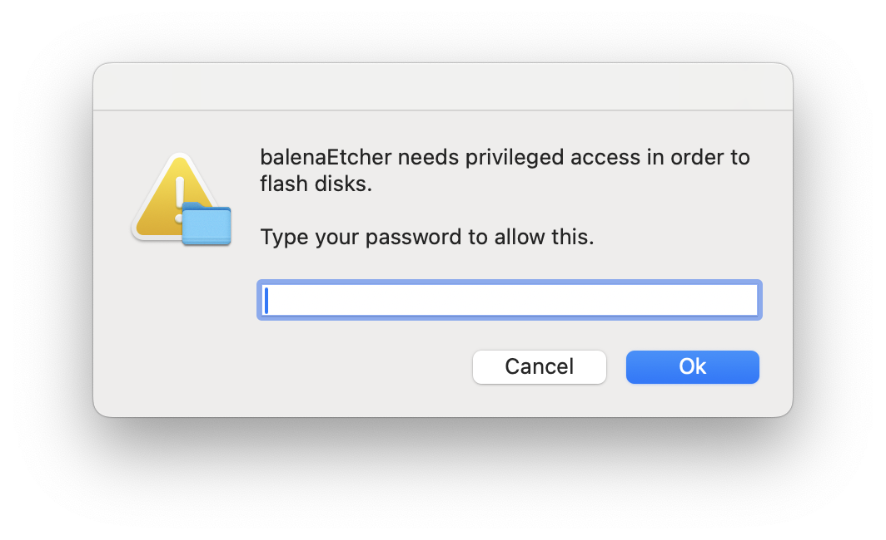

# Ubuntu Installation Guide

## Introduction

This guide outlines the step-by-step process for installing Ubuntu on a dedicated machine. The procedure follows the methodology demonstrated in the "Linux on HP EliteDesk Mini" tutorial.

<iframe width="560" height="315" src="https://www.youtube.com/embed/7EqIbFMmlH8?si=3iuyVIivhT224d8V" title="YouTube video player" frameborder="0" allow="accelerometer; autoplay; clipboard-write; encrypted-media; gyroscope; picture-in-picture; web-share" referrerpolicy="strict-origin-when-cross-origin" allowfullscreen></iframe>

---

## Prerequisites

- **Target Machine**: The computer where the Ubuntu OS will be installed.
- **USB Drive**: A flash drive with sufficient capacity to store the Ubuntu ISO and serve as a bootable medium.

### Recommended Hardware
The following components were utilized for this specific setup:

- **Computer**: [HP EliteDesk 800 G3 Mini (Intel i5-7500 3.40GHz, 16GB RAM, 256GB SSD)](https://www.ebay.com/sch/i.html?_nkw=HP+EliteDesk+800+G3+Mini+Intel+i5-7500+3.40Ghz+16GB+RAM+256GB+Windows+11+Pro&_sacat=0&_from=R40&_trksid=m570.l1313&_odkw=HP+EliteDesk+800+G3+Mini+Intel+i5-7500&_osacat=0)
- **Storage**: [Lexar D40E 128GB Dual USB 3.2 Gen 1 Type-C Jump Drive](https://a.co/d/0bvbH5vn)

---

## Installation Steps

### **1. Create a Bootable USB Drive**

1. Download the latest [Ubuntu Desktop ISO](https://ubuntu.com/download/desktop).
1. Download a reliable flashing utility such as [balenaEtcher](https://www.balena.io/etcher/) or [Rufus](https://rufus.ie/).
1. Insert the USB drive and utilize the flashing tool to write the ISO:
    - Select **Flash from file** and navigate to the downloaded Ubuntu ISO.
    - Click **Select target** and choose the appropriate USB drive.
    - Click **Flash!** to begin the process.

    

!!! warning "Administrative Privileges"

    If prompted by balenaEtcher for privileged access to the USB drive, provide your system password to authorize the operation.
    

### **2. Boot from the Installation Medium**

1. Insert the bootable USB into the target machine and access the BIOS/UEFI interface by pressing the `F2` key (or the key specific to your hardware) during startup.
1. Navigate to the **Boot Menu** and select the entry corresponding to your USB drive under **UEFI**.
    
    
1. Once the Ubuntu installer launches, follow the on-screen prompts to configure your installation preferences.
    
    

### **3. Initial System Boot**

1. After the installation completes, the system may require manual intervention to boot into the new OS. If the machine fails to reboot automatically, re-enter the BIOS interface (`F2`) and manually select the **UEFI - Ubuntu** boot option.
    
1. Upon a successful boot, log in using the credentials established during the installation process.
