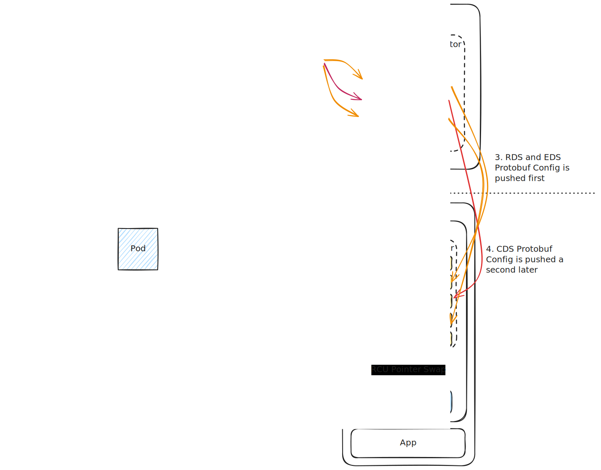
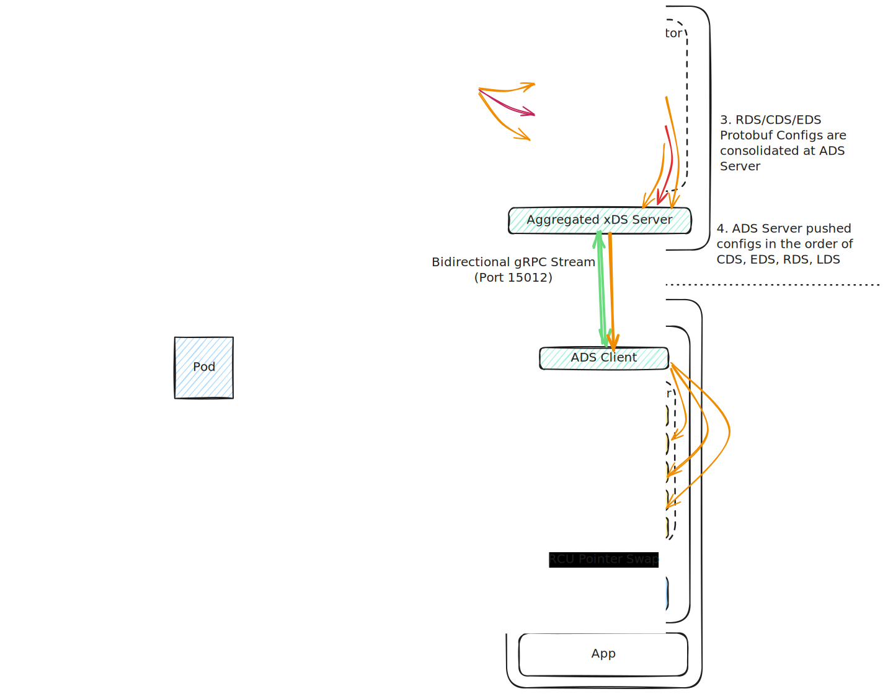

# Aggregated Discovery Service (ADS) in Envoy & Istio

In dynamic microservice environments, configuration updates must be distributed rapidly. However, because Envoy's configuration is split into multiple independent discovery APIs (LDS, RDS, CDS, EDS, SDS), a major architectural challenge arises: **The xDS Race Condition.**

**Aggregated Discovery Service (ADS)** is the key Envoy/Istio feature designed specifically to solve this race condition, ensuring that updates are serialized, sequenced, and applied atomically without dropping a single packet.

---

## 1. The Core Problem: The xDS Race Condition

Historically, when Envoy sidecars subscribed to individual discovery services (LDS, RDS, CDS, EDS) over separate, independent gRPC channels, the updates arrived asynchronously. This lack of coordination caused race conditions when a **new service was deployed** or a **major configuration change occurred**:



### The "Black Hole" Traffic Drop Scenario:

1. **The Service Deployment:** You deploy a brand new service or major routing rule update.
2. **The Control Plane Push:** `istiod` generates updates for the **Cluster (CDS)**, **Endpoints (EDS)**, and the new **Route (RDS)** that directs traffic to it.
3. **Out-of-Order Delivery (The Race):** Because the gRPC streams are independent, the **RDS** route update arrives at the Envoy proxy a few milliseconds *before* the **CDS** cluster update.
4. **The Packet Drop:** Envoy immediately applies the new RDS route rule. An incoming client request matches the new route path, but when Envoy tries to forward it, it finds that the target upstream cluster **does not exist yet** in its memory.
5. **Result:** Envoy is forced to drop the packet, returning an immediate `503 Service Unavailable` or blackholing the TCP connection.


---

## 2. How ADS Solves the Race (Multiplexed Ordering)

ADS resolves this by multiplexing all xDS APIs (LDS, RDS, CDS, EDS, SDS) onto a **single, unified, bidirectional gRPC stream** over a single TCP connection.




By consolidating all updates into one stream, the control plane (`istiod`) can strictly coordinate and sequence the delivery of dependent configurations:

### The Deterministic Dependency Chain:
To prevent traffic drops, the control plane enforces a strict **bottom-up ordering** when pushing updates to Envoy:

1.  **CDS (Cluster) First:** `istiod` pushes the upstream cluster configuration (e.g., `telemetry-db`). Envoy registers the cluster in its memory pool.
2.  **EDS (Endpoints) Second:** `istiod` pushes the physical IP endpoints belonging to that cluster. Envoy associates these IPs with the cluster.
3.  **RDS (Routes) Third:** `istiod` pushes the L7 routing rules (e.g., matching path `/v1/telemetry` to cluster `telemetry-db`). Because the cluster and its endpoints already exist in memory, Envoy can immediately route traffic without any lookup failures.
4.  **LDS (Listeners) Last:** `istiod` pushes the physical port listener configurations. Once the port is opened, the entire backend pipeline is already pre-configured and ready to handle traffic instantly.

---

## 3. Under the Hood: The ADS gRPC Protocol

The ADS stream uses the `envoy.service.discovery.v3.AggregatedDiscoveryService` gRPC service. The communication utilizes a single message type containing a `type_url` field to identify the specific xDS resource type:

```protobuf
// The unified discovery request sent by Envoy
message DiscoveryRequest {
  string version_info = 1;
  string response_nonce = 5;
  string type_url = 4; // e.g., "type.googleapis.com/envoy.config.listener.v3.Listener"
  ...
}

// The unified discovery response pushed by istiod
message DiscoveryResponse {
  string version_info = 1;
  repeated google.protobuf.Any resources = 2;
  string type_url = 4;
  string nonce = 5;
  ...
}
```

### The State Machine (ACK/NACK Handshake):

1.  **Subscription (Request):** Envoy initiates the ADS gRPC stream, sending a `DiscoveryRequest` specifying the `type_url` for **LDS** (with version and nonce fields empty).
2.  **Configuration Push (Response):** `istiod` replies with a `DiscoveryResponse` containing the listener configurations, a `version_info` string, and a unique `nonce` (e.g., `"nonce-1"`).
3.  **Application & RCU:** Envoy applies the configuration in RAM using an atomic pointer swap (RCU). 
4.  **Acknowledgment (ACK):** If the configuration is valid, Envoy sends a new `DiscoveryRequest` back to `istiod` containing the same `"nonce-1"` in the `response_nonce` field. This tells `istiod`: *"I have successfully applied configuration version X."*
5.  **Negative Acknowledgment (NACK):** If the configuration is invalid (e.g., a bad EnvoyFilter configuration), Envoy rejects it and sends a `DiscoveryRequest` containing the error details in the `error_detail` field, the rejected `"nonce-1"`, and the *previous* stable version info. It continues running on the old configuration, preventing a bad update from crashing the proxy.

!!! Warning "Key Protocol Difference: gRPC Streaming vs. HTTP Request-Response"

    The xDS/ADS gRPC protocol is **completely different from the standard HTTP synchronous Request-Response model**. 
    
    *   **The Initial Request is a Subscription, not a Poll:** When Envoy sends its first `DiscoveryRequest`, it is subscribing to updates. If `istiod` has no new configurations, **it remains silent** and does not reply. The connection simply stays open in an idle state.
    *   **The Response is an Unsolicited Push:** When a Kubernetes event occurs (hours or days later), `istiod` spontaneously pushes a `DiscoveryResponse` down the open channel. Envoy did not send a request to trigger this.
    *   **Subsequent Requests are Acknowledgments (ACKs), not Requests for New Data:** When Envoy sends a `DiscoveryRequest` *after* receiving a response, it is a handshake to confirm success (ACK) or failure (NACK). **`istiod` does not reply to this ACK.** If `istiod` replied to every ACK with another response, it would trigger a catastrophic, infinite loop of endless configuration updates!

