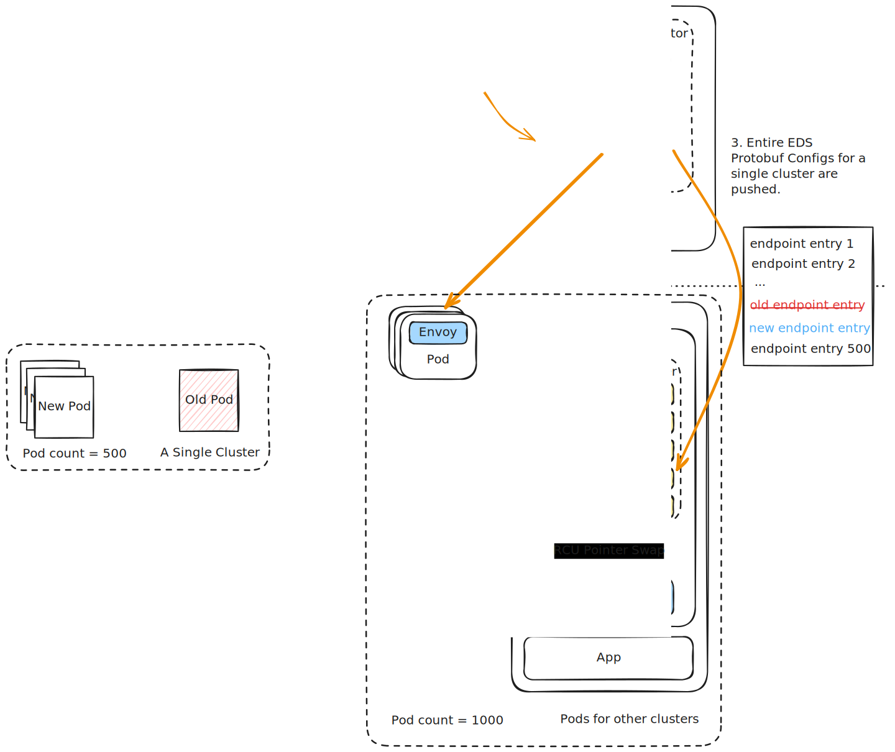
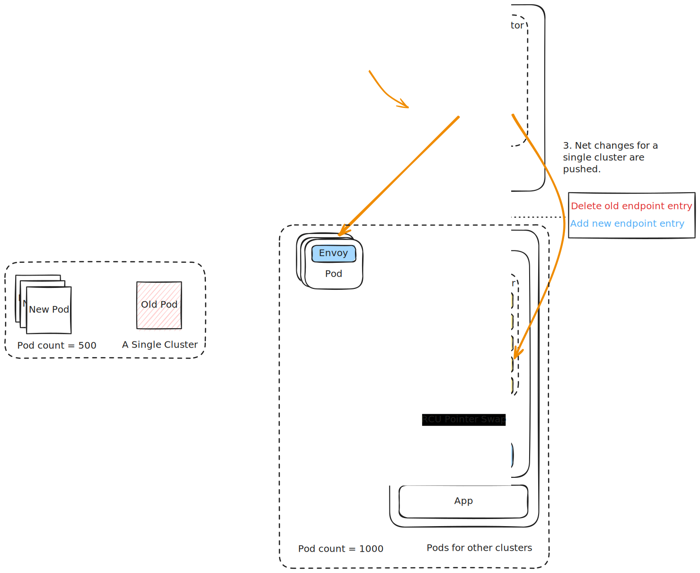

# Delta (Incremental) xDS in Envoy & Istio

At large scale—with thousands of microservices or hundreds of thousands of IoT grid endpoints—distributing configuration updates efficiently becomes a major performance bottleneck. 

**Delta xDS** (also known as Incremental xDS) is an optimization in the Envoy/Istio control-to-data plane protocol. It shifts Envoy's configuration updates from a "State-of-the-World" model to an **incremental difference (delta) model**, drastically reducing control plane CPU load, proxy memory footprint, and network bandwidth.

---

## 1. The Core Problem: State-of-the-World (SotW) Overhead

Historically, the xDS protocol used the **State-of-the-World (SotW)** model. Under SotW, whenever a single resource changed, the control plane was forced to serialize and transmit the **entire list of resources** of that type to the proxy.



### The "O(N × M)" Scale Bottleneck:

1. **The Endpoint Change:** In a cluster of $M = 500$ pods, a single pod dies and gets replaced with a new IP address.
2. **The SotW Push:** Even though 499 endpoints are completely unchanged, `istiod` must serialize the **entire list of all 500 endpoints** into a protobuf payload.
3. **The Broadcast Multiply:** `istiod` must push this full 500-endpoint list to all $N = 1000$ sidecars in the mesh.
4. **The Overhead:** Every single minor pod scaling event triggers the serialization, transmission, and deserialization of $N \times M$ objects across the network.
5. **Result:** Extreme CPU spikes on `istiod`, high network latency, and high proxy memory usage during large deployments or scaling events.

---

## 2. The Solution: Delta xDS (Incremental Pushes)

Delta xDS replaces this massive broadcast with a highly efficient **differential update model**. Instead of sending the entire world, the control plane only transmits the **changes (deltas)**.




When a single pod scales up or down:

1. **Delta Calculation:** `istiod` identifies the exact difference.
2. **Delta Push:** It pushes a microscopic payload to Envoy:
    * *"Delete Endpoint: `10.244.1.45`"*
    * *"Add Endpoint: `10.244.1.99`"*
3. **Local RAM Update:** Envoy receives only these two changes and updates its internal load-balancing memory pool instantly via an RCU pointer swap, without having to rebuild, parse, or validate the other 499 unchanged endpoints.

---

## 3. The Delta xDS Protobuf Protocol

The Delta xDS protocol uses separate gRPC message structures (`DeltaDiscoveryRequest` and `DeltaDiscoveryResponse`) designed for incremental state tracking:

```protobuf
// The incremental discovery request sent by Envoy
message DeltaDiscoveryRequest {
  string client_id = 1;
  string type_url = 2; // e.g., "type.googleapis.com/envoy.config.endpoint.v3.ClusterLoadAssignment"
  
  // Resources Envoy wants to subscribe to (by name)
  repeated string resource_names_subscribe = 3;
  
  // Resources Envoy wants to unsubscribe from (by name)
  repeated string resource_names_unsubscribe = 4;
  
  string response_nonce = 5;
  string error_detail = 6;
  ...
}

// The incremental discovery response pushed by istiod
message DeltaDiscoveryResponse {
  string system_version_info = 1;
  
  // The actual resources added or updated (contains only changed objects)
  repeated Resource resources = 2;
  
  // The names of resources that have been deleted/removed
  repeated string removed_resources = 6;
  
  string nonce = 5;
  ...
}
```

### Protocol Advantages over SotW:
*   **Dynamic Subscription (`resource_names_subscribe`):** Envoy can dynamically tell `istiod` exactly which resources it cares about on the fly. In SotW, subscriptions were static and coarse-grained.
*   **Deletion Support (`removed_resources`):** Envoy is explicitly told which resource names to delete, preventing configuration drift where stale endpoints linger in proxy memory.

---

## 4. Architectural Resource Savings

| Resource Metric | State-of-the-World (SotW) | Delta (Incremental) xDS |
| :--- | :--- | :--- |
| **Control Plane CPU** | High (Continuous full-tree serialization) | **Extremely Low** (Only serializes changed deltas) |
| **Network Bandwidth** | High (Pushes full lists; grows exponentially with scale) | **Microscopic** (Pushes only the delta bytes) |
| **Proxy Memory/CPU** | Spikes during validation of full lists | **Flat & Stable** (Instant, lightweight pointer updates) |
| **Propagation Latency** | Slows down as the cluster size grows | **Sub-millisecond constant** regardless of scale |

