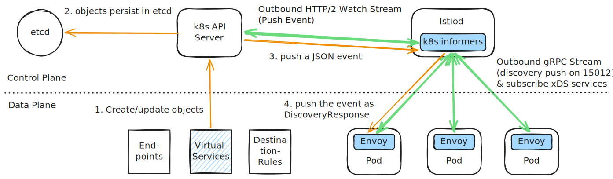

# Control to Data Plane Communication in Istio

A common misconception in service mesh architectures is that proxies periodically poll the control plane for updates, or that the control plane scrapingly polls the Kubernetes API. In reality, modern meshes like Istio use a **fully event-driven, push-based reactive architecture** from end to end.

This guide details the low-level, real-time communication pipeline between the Kubernetes API Server, **`istiod` (the control plane)**, and **Envoy (the data plane sidecars and gateways)**.

---

## 1. End-to-End Reactive Architecture

Instead of wasting network bandwidth and CPU cycles on polling, Istio establishes long-lived persistent streams. Configuration changes propagate like electrical signals: **only when an event occurs, and entirely pushed from the source to the destination.**

---

## 2. Phase 1: K8s API to `istiod` (Watches, Not Scraping)

`istiod` does not query or "scrape" the Kubernetes API Server on a timer. Doing so in a cluster with thousands of pods would overwhelm the API Server.

### The Informer Pattern:
*   **Kubernetes Informers (`client-go`):** Inside `istiod` (written in Go), the controller sets up **Informers** for specific resource types (such as `Endpoints`, `VirtualServices`, `DestinationRules`, and `Pods`).
*   **The Watch Connection:** The Informer establishes a long-lived **HTTP Watch connection** (using HTTP chunked transfer encoding) to the Kubernetes API Server.
*   **Event-Driven Push:** When a resource state changes (e.g., a pod scales up, a service is created, or a readiness probe fails), the API Server pushes a JSON event (e.g., `ADD`, `UPDATE`, `DELETE`) down the watch connection to `istiod` in real-time.
*   **Local Caching:** `istiod` stores these objects in a highly optimized in-memory cache, allowing it to instantly recalculate the routing tree without querying the API Server.

---

## 3. Phase 2: `istiod` to Envoy (Streaming gRPC, Not Polling)

Envoy sidecars and ingress gateways do not poll `istiod` on a timer (e.g., "Check every 5 seconds").

### The Persistent Bidirectional gRPC Stream:
*   **Outbound Client Connection:** When an Envoy proxy starts up, it initiates a **persistent outbound TCP/gRPC connection** to the stable `istiod` service IP on secure port **`15012`**.
*   **Why Outbound?** By having the sidecars connect outbound to `istiod`, the architecture easily traverses firewalls and network policies, and `istiod` never has to track or guess ephemeral pod IPs to establish connections.
*   **Subscription Model:** Envoy registers its interest in configurations (LDS, RDS, CDS, EDS) over this single gRPC stream. 
*   **Silent Connection:** If no events occur in the Kubernetes cluster, **no traffic flows over this connection.** The socket remains idle, preserved by HTTP/2 TCP keep-alives.
*   **Discovery Pushes:** The split-second `istiod` receives an event from the K8s API watch, it translates the change into Envoy Protocol Buffers (`protobuf`) and **pushes** the `DiscoveryResponse` payload down the already-open gRPC stream.
*   **Atomic Pointer Swaps:** Envoy receives the protobuf bytes in RAM, validates the checksum, and swaps its internal configuration pointers atomically via **Read-Copy-Update (RCU)** with zero packet drop and zero proxy restarts.

