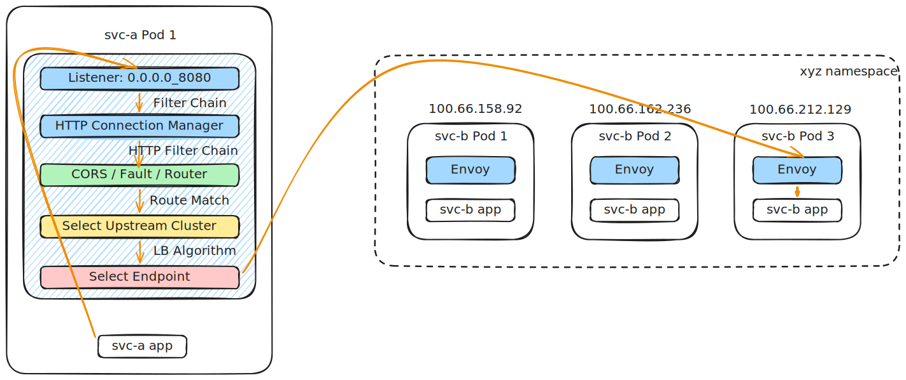
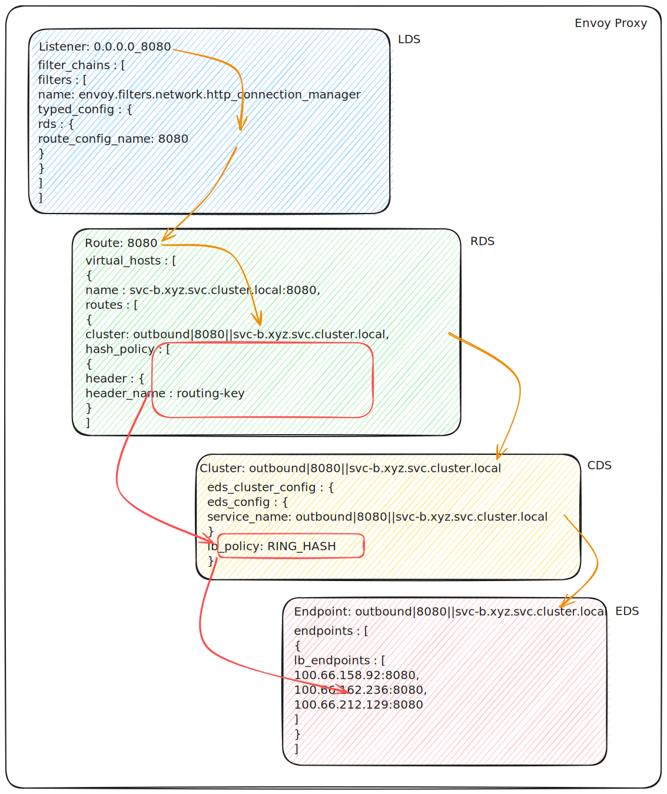

# Layer 7 Load Balancing in Istio & Envoy

In distributed microservice architectures, Layer 7 (L7) load balancing is critical for routing traffic based on the application layer context. 

L7 load balancing operates at the **Application Layer (HTTP/1.1, HTTP/2, gRPC, WebSocket)**. Unlike Layer 4 (L4) load balancing, which only routes based on IP addresses and TCP ports, L7 load balancing inspects request paths, HTTP headers, cookies, query parameters, and gRPC method names to make highly intelligent routing and load-balancing decisions.

---

## 1. The Low-Level Data Plane Flow in Envoy

When Istio configures a sidecar or gateway for L7 traffic (e.g., using `VirtualService` with `http` rules), it generates an Envoy **Listener** that passes connection data into the **HTTP Connection Manager (HCM)** network filter (`envoy.filters.network.http_connection_manager`).



The diagram below provides a detailed view of the L4 connection lifecycle within the client-side Envoy proxy.



### The Request Lifecycle:

1. **Downstream Interception:** A client application initiates an HTTP/gRPC request. The connection is intercepted by Envoy's listener.
2. **HTTP Connection Manager (HCM):** The listener passes the socket to the HCM network filter. HCM handles HTTP-specific protocol parsing (HTTP/1.1 serialization, HTTP/2 frame decoding, or gRPC stream handling).
3. **HTTP Filter Chain:** The request passes through an HTTP-specific filter chain (such as `envoy.filters.http.cors`, `envoy.filters.http.fault`, and ending with `envoy.filters.http.router`).
4. **Route Matching & Cluster Selection:** The HTTP Router filter evaluates the request attributes (e.g., URL path, `:authority`/`Host` header, query params, cookies) against the route table to find a matching route and select the target **Upstream Cluster**.
5. **L7 Load Balancing:** The selected cluster's load balancer selects a specific upstream **Endpoint** (host instance) using the configured L7 load balancing algorithm.
6. **Multiplexed Upstream Connection:** Envoy forwards the request stream over a connection pool to the chosen host. For HTTP/2 or gRPC, Envoy multiplexes multiple request streams over a small number of persistent TCP connections, minimizing connection setup latency.

---

## 2. Advanced L7 Load Balancing Algorithms

Envoy provides several sophisticated L7 load balancing algorithms designed to optimize application routing under dynamic traffic patterns:

### A. Weighted Least Request (L7 Active Requests)
Unlike L4 least request, which tracks TCP connections, L7 **Weighted Least Request** tracks the number of **active HTTP/gRPC requests** currently being processed by each upstream host.

*   **Why it's critical:** In microservice environments, request processing times vary significantly (e.g., a simple read request takes 2ms, while a complex write request takes 200ms). L7 Least Request ensures that a backend replica processing slow requests does not receive additional traffic, even if its total TCP connection count is low.
*   **Envoy C++ Implementation:** Located in `source/common/upstream/round_robin.cc` or `least_request_lb.cc`.

### B. Ring Hash & Consistent Hashing (Session Affinity)
Ring Hash maps upstream hosts onto a 360-degree virtual ring. When a request arrives, Envoy hashes a specific request attribute (such as an HTTP header, session cookie, or query parameter) and performs a binary search on the ring to select the nearest host.

*   **Why it's critical:** Highly useful for **Stateful API Gateways** or caching services where requests from the same user session (e.g., matching a cookie or `x-user-id` header) should consistently land on the same backend pod to maximize local cache hits.
*   **Istio Configuration:** Specified via the `consistentHash` configuration in a `DestinationRule`.

### C. Locality-Weighted Load Balancing
Envoy evaluates the geographical locality (region, zone, sub-zone) of both the client proxy and the backend pods.

*   **Why it's critical:** To reduce inter-zone data transfer costs and network latency, Envoy prioritizes routing requests to backend instances running in the same availability zone. If the local zone becomes unhealthy or overloaded, it gracefully spills traffic over to the next closest zone based on configured weights.

---

## 3. Resolving the gRPC / HTTP/2 Connection Imbalance

One of the most critical reasons for adopting L7 load balancing is the **Multiplexing Imbalance** problem inherent to L4 load balancing for gRPC/HTTP/2 traffic.

!!! Info "L4 vs. L7 gRPC Balancing"

    *   **Under Layer 4:** Envoy treats a gRPC session as a single long-lived TCP connection. It routes the entire connection to a single backend pod. If a client opens a connection and streams 10,000 gRPC requests over it, all 10,000 requests are handled by that single pod, leaving other pods idle.
    *   **Under Layer 7:** Envoy decodes the HTTP/2 frames, reads each stream ID, and routes **each individual gRPC request stream** to different backend pods. This distributes the actual workload evenly across all available replicas, even if all requests originate from a single client connection.

---

## 4. Configuring L7 Load Balancing in Istio

You configure L7 load balancing policies in Istio using the [DestinationRule](https://istio.io/latest/docs/reference/config/networking/destination-rule/) Custom Resource Definition (CRD).

### Example 1: Consistent Hashing based on HTTP Cookie (Session Stickiness)
```yaml
apiVersion: networking.istio.io/v1alpha3
kind: DestinationRule
metadata:
  name: user-profile-lb
spec:
  host: user-profile-service.prod.svc.cluster.local
  trafficPolicy:
    loadBalancer:
      consistentHash:
        httpCookie:
          name: user_session
          ttl: 3600s
```

### Example 2: L7 Least Request Load Balancing
```yaml
apiVersion: networking.istio.io/v1alpha3
kind: DestinationRule
metadata:
  name: billing-service-lb
spec:
  host: billing-service.prod.svc.cluster.local
  trafficPolicy:
    loadBalancer:
      simple: LEAST_REQUEST
```

---

## 5. Low-Level Envoy Code References

For developers looking to inspect the underlying C++ logic inside the Envoy proxy engine:

*   **HTTP Connection Manager (HCM):** The entry point for HTTP processing is located in [`source/common/http/conn_manager_impl.cc`](https://github.com/envoyproxy/envoy/blob/main/source/common/http/conn_manager_impl.cc).
*   **L7 Router Filter:** The routing decision code lives in [`source/common/router/router.cc`](https://github.com/envoyproxy/envoy/blob/main/source/common/router/router.cc).
*   **Least Request Load Balancer:** The selection algorithm is in [`source/common/upstream/least_request_lb.cc`](https://github.com/envoyproxy/envoy/blob/main/source/common/upstream/least_request_lb.cc).
