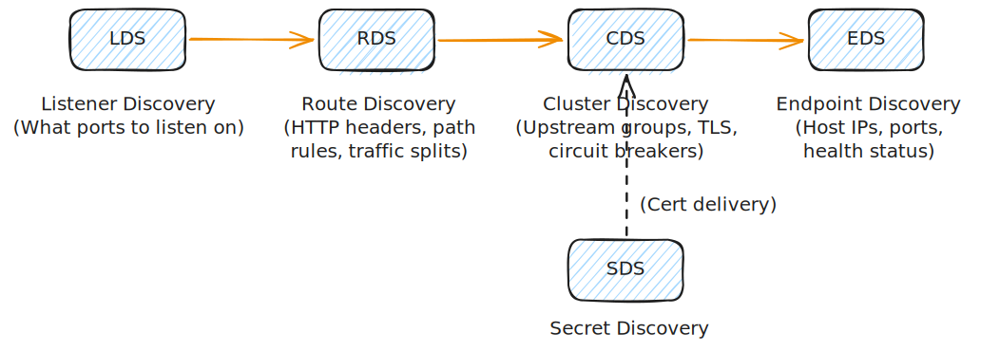
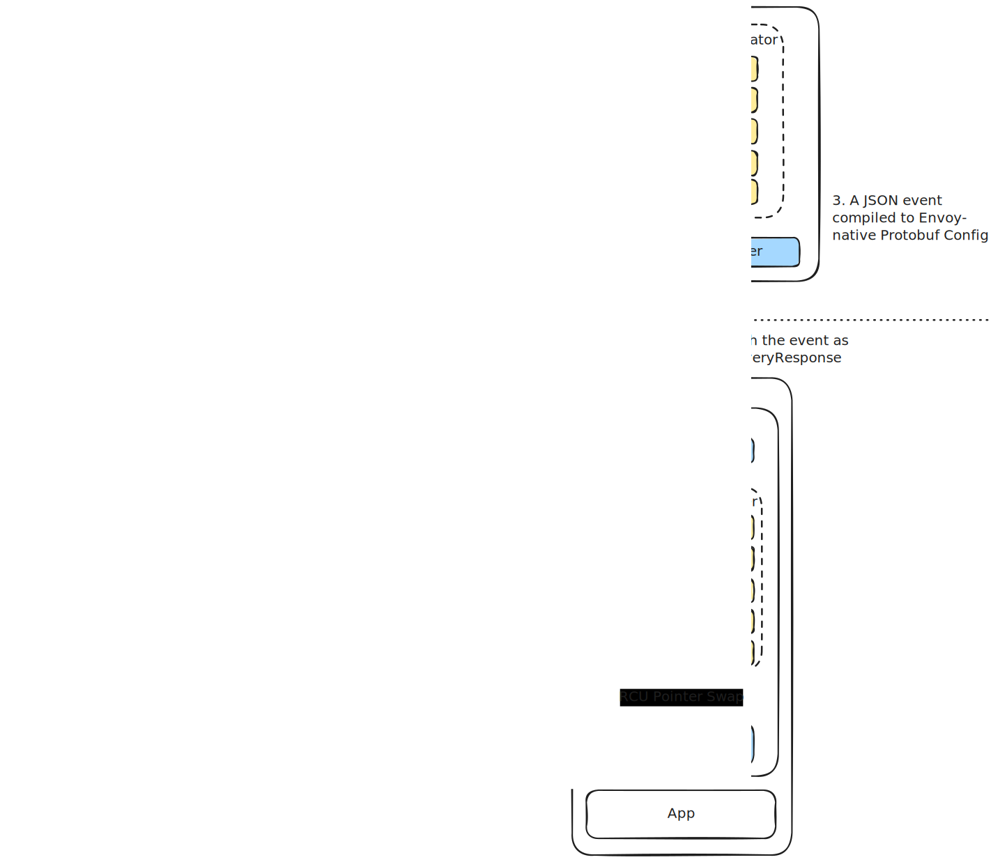

# The xDS Discovery APIs in Istio & Envoy

In modern service mesh architectures, static configuration is obsolete. High-scale environments require proxies to adapt in real-time as endpoints scale, fail, or redeploy.

**xDS** (Discovery Service APIs) is a suite of gRPC-based APIs developed by the Envoy project. It allows the control plane (**[Istio](https://istio.io)/[istiod](https://istio.io/latest/docs/ops/deployment/architecture/#istiod)**) to dynamically update the configuration of data plane proxies (**[Envoy sidecars](https://istio.io/latest/docs/ops/deployment/architecture/#envoy) and [gateways](https://istio.io/latest/docs/tasks/traffic-management/ingress/ingress-control/)**) on the fly, with zero proxy restarts and zero packet drops.

---

## 1. The Core xDS Discovery APIs

Envoy's entire state is modularly split into specialized APIs. When a request flows through Envoy, it is processed based on configurations discovered through these five core services:

!!! Info "Where do these xDS services reside?"

    The xDS Discovery Services exist as a **client-server implementation** on both sides of the mesh:
    
    *   **In `istiod` (The xDS Server):** These are **Generator Services** written in Go. They watch the Kubernetes API and compile K8s resources into the respective Envoy protobuf structures (e.g., `LdsGenerator`, `RdsGenerator`, etc.) before pushing them.
    *   **In the `envoy-proxy` (The xDS Client):** These are **Local In-Memory Configuration Stores** written in C++ (e.g., `ListenerManager`, `RouteConfigProviderManager`). Envoy stores the received configurations in RAM.
    
    The evaluation flow shown in the diagram above (**LDS $\rightarrow$ RDS $\rightarrow$ CDS $\rightarrow$ EDS**) describes the exact **step-by-step path a packet takes inside the `envoy-proxy`** at runtime:
    
    1.  **LDS:** The packet hits an open listener port (e.g., Port `15006`).
    2.  **RDS:** Envoy evaluates HTTP/gRPC route rules to determine which target upstream cluster the request belongs to.
    3.  **CDS:** Envoy inspects the cluster configurations (load-balancing algorithm, TLS, timeouts) for that target group.
    4.  **EDS:** Envoy selects a specific, healthy physical IP address of a backend pod and forwards the packet.

### 1. LDS (Listener Discovery Service)
*   **What it defines:** The network entry points (ports, IP addresses, socket options) where Envoy listens for downstream traffic.
*   **Istio implementation:** `istiod` configures LDS to set up listener ports for incoming sidecar traffic (e.g., intercepting port `15001` or port `15006` via `iptables`) and specific ingress/egress gateway ports.

### 2. RDS (Route Discovery Service)
*   **What it defines:** The Layer 7 routing rules (HTTP/2, gRPC, path matching, header rewriting, traffic shifting percentages).
*   **Istio implementation:** RDS matches the rules defined in Istio [VirtualService](https://istio.io/latest/docs/reference/config/networking/virtual-service/) CRDs to direct incoming traffic on a specific Listener to an upstream Cluster.

### 3. CDS (Cluster Discovery Service)
*   **What it defines:** Upstream "clusters"—logical groups of backend services that can receive traffic. It specifies their load balancing algorithms (e.g., Maglev, Weighted Round Robin), circuit breakers, and upstream TLS settings.
*   **Istio implementation:** Matches Istio [DestinationRule](https://istio.io/latest/docs/reference/config/networking/destination-rule/) configurations to configure upstream backend groupings.

### 4. EDS (Endpoint Discovery Service)
*   **What it defines:** The actual physical IP addresses and ports (endpoints) of the individual containers/pods belonging to a Cluster.
*   **Why it is unique:** EDS is the **most highly dynamic** xDS API. As Kubernetes pods scale up/down, die, or fail readiness probes, only EDS updates are pushed to the proxies.
*   **Under the Hood:** By isolating IP changes to EDS, Envoy avoids rebuilding the entire routing tree (LDS/RDS/CDS), ensuring sub-millisecond propagation times at scale.

### 5. SDS (Secret Discovery Service)
*   **What it defines:** Dynamic delivery of TLS certificates, private keys, and trusted CA certificates.
*   **Istio implementation:** Essential for **[mutual TLS (mTLS)](https://istio.io/latest/docs/tasks/security/authentication/mtls/)**. Instead of mounting secrets as files in a pod (which requires restarts to renew), Envoy requests certificates from `istiod` over the [Secret Discovery Service (SDS)](https://istio.io/latest/docs/ops/configuration/traffic-management/tls-configuration/#sds) gRPC stream. Certificates are rotated seamlessly in RAM.

---

## 2. Low-Level Control Plane to Data Plane Communication

The communication channel between `istiod` (written in Go) and Envoy (written in C++) is a persistent bidirectional gRPC stream.

### The Configuration Update Flow:
1. **Watcher Loop:** Inside `istiod`, the Go controller watches the Kubernetes API Server for changes in resources (e.g., a new pod scales up in a deployment, creating a new `EndpointSlice`).
2. **Translation Engine:** `istiod` compiles the Kubernetes state change into Envoy configuration Protocol Buffers (`protobuf`).
3. **gRPC Push (DiscoveryRequest/DiscoveryResponse):** `istiod` pushes the compiled configuration down the bidirectional gRPC stream (DiscoveryResponse).
4. **RCU (Read-Copy-Update) in Envoy:** Envoy receives the protobuf configuration. Its main thread copies the current configuration, applies the new changes in memory, and swaps the pointer atomically using **Read-Copy-Update (RCU)**.
5. **ACK/NACK:** Envoy validates the configuration. If valid, it applies it and sends an `ACK` (DiscoveryRequest) back to `istiod`. If invalid (e.g., config error), it sends a `NACK` with an error message, preserving the previous configuration to prevent outages.

---

## 3. Advanced Concept: Aggregated xDS (ADS) & Delta xDS

At extreme IoT or microservice scale (thousands of proxy instances), sending full configuration trees introduces severe CPU and bandwidth bottlenecks. Istio utilizes two key Envoy optimizations:

### A. Aggregated Discovery Service (ADS)
*   **The Problem:** Because LDS, RDS, CDS, and EDS are independent APIs, their updates could arrive out of order (e.g., receiving an RDS route pointing to a CDS cluster that hasn't arrived yet), leading to temporary packet drops.
*   **The ADS Solution:** ADS multiplexes all five discovery services (LDS, RDS, CDS, EDS, SDS) over a **single, ordered gRPC stream**. This allows `istiod` to coordinate dependencies, ensuring CDS clusters are pushed *before* RDS routes target them.

### B. Delta (Incremental) xDS
*   **The Problem:** Historically, every time a single endpoint changed, the control plane had to push the *entire* list of clusters and endpoints to every sidecar (State-of-the-World/SotW xDS).
*   **The Delta Solution:** Delta xDS transmits only the **changes (deltas)**. If one pod out of 500 dies, the control plane pushes a tiny protobuf payload saying "Delete IP 10.244.1.45". This reduces Control Plane memory footprint and network serialization overhead by up to 90%.

