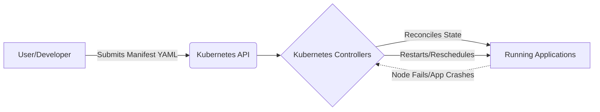
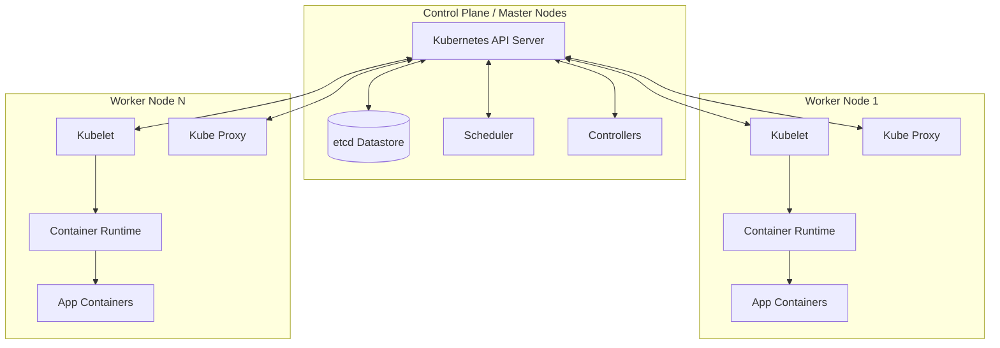
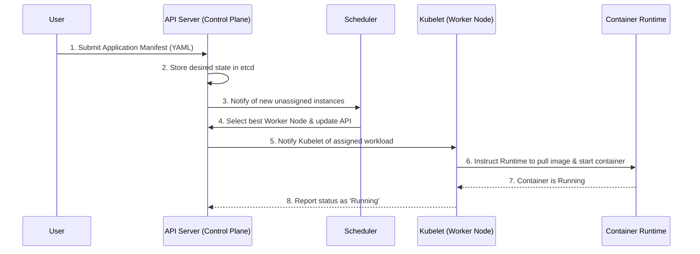

# 01 Introducing Kubernetes

## Executive Summary
This chapter introduces Kubernetes (k8s) as a powerful platform for automating the deployment, scaling, and management of containerized applications. Emerging from Google's internal systems (Borg and Omega), Kubernetes abstracts away underlying hardware infrastructure, allowing developers to treat a cluster of thousands of nodes as a single logical deployment target. By bridging the gap between development and operations through a declarative configuration model, Kubernetes standardizes cloud-native application delivery, ensures high availability via automated self-healing, and vastly improves hardware utilization.

## Key Findings/Sections

### 1.1 Introducing Kubernetes
- **Origins and the Microservices Shift**: As monolithic applications are broken down into hundreds of microservices, manual management becomes impossible. Kubernetes was built to automate this management, drawing on Google's experience running billions of containers a week.
- **Abstracting the Infrastructure**: Kubernetes hides the complexities of individual computers, networks, and storage. Developers can deploy applications without knowing anything about the servers hosting them, treating the entire data center as one large, uniform deployment surface.
- **Bridging Dev and Ops**: By providing a platform that handles scheduling, load balancing, and self-healing, developers can focus on business logic while operations teams configure the overarching cluster policies without needing to babysit individual application instances.
- **The Declarative Model**: Instead of executing imperative commands (e.g., "run this container, then do X"), users provide a description of the desired state. Kubernetes continuously actively reconciles the actual state of the cluster with this desired state.

### 1.2 Understanding Kubernetes
- **The Cluster Operating System**: Just as Linux manages CPU and memory for processes on a single machine, Kubernetes schedules distributed application components onto individual computers in a cluster, acting as an operating system for the data center.
- **Core Benefits**:
  - **Self-Service Deployment**: Developers deploy without system administrator intervention.
  - **Hardware Utilization**: Kubernetes packs applications tightly, reducing infrastructure costs.
  - **Automated Scalability**: It monitors load and adjusts application instances dynamically.
  - **Self-Healing**: If a node fails, Kubernetes automatically moves applications to healthy nodes.
- **Cluster Architecture**: A cluster is split into two main planes:
  1. **Control Plane (The Brain)**: Manages the cluster state.
     - *API Server*: The central RESTful interface that all components communicate with.
     - *etcd*: A distributed, reliable key-value store holding the cluster's configuration and state.
     - *Scheduler*: Assigns new application instances to specific worker nodes based on resource requirements.
     - *Controllers*: Background loops that monitor the cluster and drive it toward the desired state.
  2. **Worker Nodes (The Muscle)**: The machines that actually run the workloads.
     - *Kubelet*: The primary agent on each node that communicates with the API Server and manages containers.
     - *Container Runtime*: The software executing the containers (e.g., Docker, containerd, CRI-O).
     - *Kube-proxy*: Manages network routing and load balancing for services.

- **How an Application is Deployed**:
  When a user deploys an application, a specific sequence of events occurs:

### 1.3 Introducing Kubernetes into your organization
- **Hosting Options**: Kubernetes can run on bare-metal on-premises, on virtual machines, or via cloud-managed services (GKE, EKS, AKS).
- **The Management Burden**: Running the Control Plane for a production cluster is complex and requires specialized operational knowledge (handling etcd backups, highly available setups, and upgrades).
- **Managed Services**: For most organizations, using a managed Kubernetes service (Kubernetes-as-a-Service) is highly recommended over managing vanilla Kubernetes from scratch.
- **When to Use It**: Kubernetes introduces operational overhead. If an organization only has a small monolithic application, Kubernetes is overkill. However, for a system consisting of numerous microservices requiring automated management and high availability, the benefits heavily outweigh the initial learning curve.

## Critical Analysis
The chapter excels at breaking down the immense complexity of Kubernetes into digestable conceptual models, heavily leveraging the "data center as a single computer" analogy. The distinction between the Control Plane (state management) and the Worker Nodes (execution) clarifies how Kubernetes scales dynamically without central bottlenecks. Furthermore, the text candidly acknowledges the steep learning curve and operational costs of self-managing a cluster, providing practical advice to rely on managed cloud offerings unless strict regulatory constraints mandate an on-premises rollout. 

## Conclusion
Kubernetes is a transformative technology that shifts the operational paradigm from imperative script execution to declarative state reconciliation. By deeply understanding the roles of the API Server, Scheduler, Kubelet, and Container Runtime, engineers can leverage Kubernetes not just as an orchestration tool, but as a standardized platform that abstracts infrastructure constraints, paving the way for truly scalable and resilient microservice architectures.

