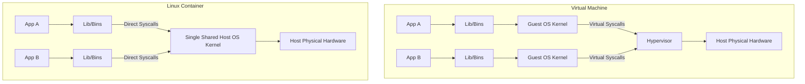

# 02 Understanding Containers and Containerized Applications

## Executive Summary
Chapter 2 provides a comprehensive, low-level exploration of container technology. Rather than treating containers as magic black boxes, it strips away the abstraction to reveal that containers are simply regular Linux processes running directly on the host operating system. The chapter meticulously details how Linux kernel features—specifically Namespaces, Control Groups (cgroups), and advanced security profiles—are combined to create the illusion of a fully isolated environment. It also covers the practical workflow of the Docker platform, including image layering, building with Dockerfiles, and distributing applications via registries. This foundational OS-level knowledge is critical for effectively debugging, securing, and managing containerized applications in Kubernetes.

## Key OS-Level Concepts & Architectural Deep Dive

### 2.1 The Architectural Paradigm Shift: Containers vs. Virtual Machines

Understanding the difference between VMs and containers requires looking at how applications interact with the underlying hardware and kernel.

#### Virtual Machines (Hardware Virtualization)
- **Architecture**: A VM runs a complete "Guest Operating System" on top of virtualized hardware provided by a Hypervisor (like KVM or VMware).
- **Execution Path**: When an application in a VM makes a system call (syscall), it talks to the Guest OS kernel. The Guest OS then translates this to machine instructions, which the Hypervisor intercepts and translates again for the host's physical CPU.
- **Drawbacks**: 
  - **Overhead**: Running multiple Guest OSs on a single physical server consumes massive amounts of RAM and CPU just to keep the OSs running, leaving fewer resources for the actual applications.
  - **Speed**: Booting a VM requires a full OS boot sequence, which can take minutes.

#### Containers (OS-Level Virtualization)
- **Architecture**: Containers completely bypass the need for a Guest OS or a Hypervisor. They run directly on the Host OS.
- **Execution Path**: An application in a container makes syscalls *directly* to the single Host OS kernel. There is no translation or virtualized hardware involved. The Host CPU executes the instructions natively.
- **Advantages**:
  - **Zero Overhead**: A container is just an isolated process. It consumes no more resources than running the application natively on the host.
  - **Instant Startup**: Starting a container is as fast as starting a regular process (milliseconds), because there is no OS to boot.
- **Security Implication**: Because all containers share the exact same kernel, a bug in the host kernel could potentially allow an application in one container to break out and compromise other containers. VMs offer stronger security isolation because they have independent kernels.

---

### 2.3 Under the Hood: How Linux Creates the "Container" Illusion

A container is not a tangible "box." It is an illusion constructed using specific Linux kernel features that restrict what a process can see and what it can use.

#### 1. Customizing the Process Environment with Kernel Namespaces
By default, all processes in a Linux system share the same global resources (filesystems, process IDs, network interfaces). **Linux Namespaces** allow the kernel to partition these resources into separate, isolated buckets. When you create a container, you assign it to a specific set of namespaces. It can only see the resources in its namespace.

- **Mount Namespace (mnt)**: 
  - **Function**: Isolates the filesystem mount points.
  - **Effect**: The container has its own root directory (`/`). When the process lists files, it only sees the files provided by the container image. It cannot see the host's `/etc`, `/var`, or other containers' files. This prevents a compromised app from reading host secrets.
- **Process ID Namespace (pid)**: 
  - **Function**: Isolates the process ID number space. It maintains an independent process tree.
  - **Effect**: Inside the container, the main application thinks it is PID 1. However, from the host OS perspective, that same process might be PID 3175580. A process in a container cannot see or signal (e.g., `SIGKILL`) processes outside its PID namespace.
- **Network Namespace (net)**: 
  - **Function**: Isolates network devices, IP addresses, ports, and routing tables.
  - **Effect**: A container gets its own virtual network interfaces (e.g., `eth0`) and its own IP address. Two different containers can both bind to port 80 simultaneously without collision because they exist in different network namespaces.
- **UTS Namespace**: 
  - **Function**: Isolates the system hostname and domain name.
  - **Effect**: The container can have a completely different hostname (e.g., the container ID) from the host machine, making it feel like an independent server.
- **IPC Namespace**: Isolates Inter-Process Communication (shared memory, message queues), ensuring containers cannot intercept each other's memory.
- **User Namespace**: Allows mapping user IDs (UIDs) inside the container to different UIDs on the host. An application can run as `root` (UID 0) inside the container, but be mapped to an unprivileged user (e.g., UID 1000) on the host OS, drastically reducing security risks.

#### 2. Limiting Resources with Control Groups (cgroups)
While Namespaces limit what a process can *see*, **cgroups** limit what a process can *use*.
- **The Problem**: Without cgroups, a single runaway process (e.g., a memory leak) in one container could consume 100% of the host's RAM or CPU, starving all other containers and potentially crashing the host.
- **The Solution**: The kernel enforces strict accounting and limits. You can allocate a container exactly "0.5 CPUs" or a maximum of "100MB of RAM." If a process attempts to exceed its memory limit, the kernel will invoke the OOM (Out Of Memory) Killer and terminate the process.

#### 3. Strengthening Isolation and Security
Because containers share the host kernel, preventing malicious system calls is critical.
- **Dropping Privileges**: Containers should almost never run in `--privileged` mode, which grants full access to all host devices and kernel features.
- **Linux Capabilities**: Instead of giving a process full `root` access, Linux breaks root privileges down into granular "capabilities." For example, a container might be given `CAP_NET_BIND_SERVICE` (allowed to bind to ports < 1024) but denied `CAP_SYS_TIME` (not allowed to change the system clock).
- **Seccomp (Secure Computing Mode)**: Allows you to create fine-grained profiles that filter exactly which system calls a container is allowed to execute.
- **AppArmor / SELinux**: Mandatory Access Control (MAC) mechanisms that apply labels and strict policies to files and processes, acting as a final line of defense even if a process gains root access.

---

### 2.1.2 The Docker Platform and the Union Filesystem

Docker popularized containers by providing user-friendly tooling to manage these complex kernel features and standardizing how applications are packaged.

#### The Copy-on-Write (CoW) Image Layering System
Unlike VM images, which are massive monolithic files, container images are composed of multiple thin, read-only layers.
- **Efficiency**: If you have 10 containers based on the `node:alpine` image, Docker does not store 10 copies of the Node.js binaries. It stores the `node:alpine` layers exactly once on the host's disk, and all 10 containers share those read-only layers.
- **The Read/Write Layer**: When a container starts, Docker mounts a thin, ephemeral read/write layer on top of the read-only image layers. Any modifications the container makes (writing logs, updating files) happen exclusively in this top layer.
- **Deleting Files**: If a container deletes a file that exists in a lower read-only layer, the file is not actually removed from disk. Instead, a "whiteout" marker is placed in the read/write layer, hiding the file from the container's view. (This is why adding a file in one Dockerfile `RUN` step and deleting it in the next `RUN` step does *not* reduce the final image size).

#### Portability Limitations
While containers solve the "it works on my machine" problem by bundling dependencies, they are not universally portable:
1. **Architecture Dependency**: An image compiled for an x86 CPU cannot run on an ARM CPU natively.
2. **Kernel Module Dependency**: Because containers use the host kernel, if an application specifically requires a specialized kernel module that is not loaded on the host, the container will fail to run, regardless of what is inside the image.

## Conclusion
Chapter 2 fundamentally redefines a container from a "lightweight VM" to its true reality: **a highly configured Linux process**. By combining Namespaces for environmental isolation, cgroups for resource metering, UnionFS for efficient storage, and advanced security profiles, the Linux kernel and container runtimes (like Docker or containerd) provide a fast, efficient, and reproducible execution environment. This deep OS-level understanding is a prerequisite for diagnosing complex networking, storage, and permission issues when deploying applications at scale with Kubernetes.

