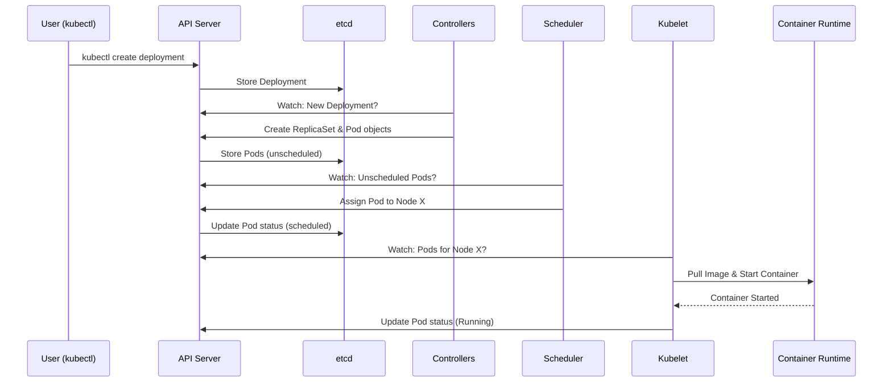
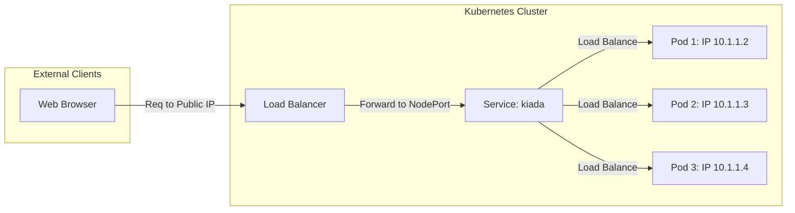

# 03 Deploying Your First Application on Kubernetes

## Executive Summary
Chapter 3 transitions from the theoretical underpinnings of containers to the practical reality of operating a Kubernetes cluster. It guides the reader through the process of setting up a development environment, whether locally (using Minikube, Docker Desktop, or kind) or in the cloud (GKE, EKS). The chapter introduces `kubectl` as the primary interface for cluster management and walks through the entire lifecycle of a first deployment: from creating a Deployment object and Pods to exposing the application via a Service and horizontally scaling the workload. This chapter establishes the "Declarative Model" of Kubernetes—where the user specifies a desired state and Kubernetes works to maintain it.

## Key Findings/Sections

### 3.1 Deploying a Kubernetes Cluster
The chapter evaluates several ways to get a cluster running:
- **Local Solutions**: 
  - **Docker Desktop**: Built-in, single-node cluster (easiest for macOS/Windows).
  - **Minikube**: Runs Kubernetes in a local VM or container; highly configurable.
  - **kind (Kubernetes in Docker)**: Runs a multi-node cluster where each node is a Docker container.
- **Cloud Solutions (Managed)**: 
  - **Google Kubernetes Engine (GKE)**: The original managed service.
  - **Amazon Elastic Kubernetes Service (EKS)** and **Azure Kubernetes Service (AKS)**.
- **Bare Metal/Manual**: Using tools like `kubeadm`.

### 3.2 Interacting with Kubernetes via `kubectl`
`kubectl` is the command-line tool that communicates with the Kubernetes API Server.
- **Key Concepts**:
  - **Contexts**: Defined in the `kubeconfig` file (usually `~/.kube/config`), allowing you to switch between multiple clusters.
  - **API Objects**: Everything in Kubernetes is an object (Node, Pod, Service, Deployment).

```bash
# Basic cluster inspection commands
kubectl cluster-info
kubectl get nodes
kubectl describe node <node-name>
```

### 3.3 The First Deployment: From Command to Running App
The chapter demonstrates deploying the `kiada` demo application.

#### 1. Creating the Deployment
A **Deployment** is a high-level object that manages **Pods**.
```bash
kubectl create deployment kiada --image=luksa/kiada:0.1
```
- **What happens behind the scenes**:
  1. `kubectl` sends an HTTP POST request to the API Server.
  2. The API Server stores the Deployment object in **etcd**.
  3. The **Deployment Controller** notices the new object and creates a **ReplicaSet**.
  4. The **ReplicaSet Controller** creates the specified number of **Pods**.
  5. The **Scheduler** assigns the Pods to healthy **Worker Nodes**.
  6. The **Kubelet** on the assigned nodes instructs the **Container Runtime** (Docker/containerd) to pull the image and start the container.



#### 2. Exposing the Application (Services)
Pods are ephemeral and have internal IP addresses. To make the app reachable from the outside, you must create a **Service**.
```bash
kubectl expose deployment kiada --type=LoadBalancer --port=8080
```
- **Service Types**:
  - **ClusterIP**: Internal only (default).
  - **NodePort**: Exposes the service on a static port on each Node's IP.
  - **LoadBalancer**: Provisions an external load balancer (cloud-specific).



#### 3. Scaling the Application
Scaling is trivial in Kubernetes because of the declarative model.
```bash
kubectl scale deployment kiada --replicas=3
```
Kubernetes detects the difference between the "desired state" (3 replicas) and "current state" (1 replica) and automatically creates 2 more Pods.

### 3.4 Summary of Objects Created
| Object | Role |
| :--- | :--- |
| **Pod** | The smallest unit; contains one or more containers. Shares Network/UTS namespaces. |
| **ReplicaSet** | Ensures exactly N copies of a Pod are running. |
| **Deployment** | Manages ReplicaSets; handles rolling updates and rollbacks. |
| **Service** | Provides a single stable entry point (IP/DNS) for a group of Pods. |

## Critical OS & K8s Insights
- **The Pod Illusion**: Containers in a Pod share the same Network and UTS namespaces. To them, they are running on the "same host" and can communicate via `localhost`.
- **Declarative vs. Imperative**: While we used `kubectl create`, the real power of K8s lies in `kubectl apply -f manifest.yaml`. You don't tell K8s *how* to scale; you tell it *what* the final count should be.
- **Node Independence**: The application is decoupled from the node. If a node fails, the controllers notice the missing Pods and recreate them on a different healthy node.

## Conclusion
Chapter 3 successfully demonstrates that while the underlying machinery is complex, the user experience is streamlined through `kubectl`. The fundamental workflow—Deploy -> Expose -> Scale—forms the basis for almost all Kubernetes operations. Understanding the relationship between Deployments, Pods, and Services is the "Aha!" moment for any new Kubernetes engineer.