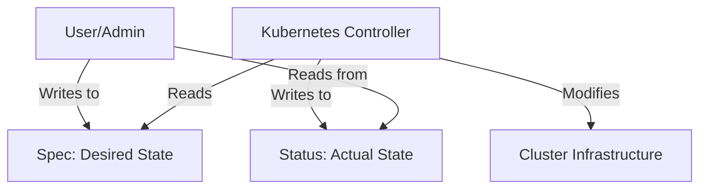

# 04 Navigating the Kubernetes API and Object Model


## Executive Summary
Chapter 4 dives into the foundational structure of the Kubernetes API and its declarative object model. Rather than manipulating infrastructure directly, users and system components interact exclusively through the Kubernetes API by creating, reading, updating, and deleting (CRUD) JSON/YAML objects. This chapter deconstructs the anatomy of these objects—specifically focusing on the `Node` and `Event` objects as examples—to explain how Kubernetes represents the cluster's state. Understanding this structure is essential for debugging and writing manifests, as every object shares a common structural philosophy built around desired state (`spec`) versus actual state (`status`).

## Key Findings/Sections

### 4.1 Getting Familiar with the Kubernetes API
The Kubernetes API is a RESTful API where state is represented by resources. 
- **Resources vs. Objects**: A resource is a REST endpoint (e.g., `/api/v1/pods`), while an object is a distinct instance of a resource (e.g., a specific Pod).
- **The Four Main Object Sections**: Almost every Kubernetes object manifest consists of four primary sections:
  1. **Type Metadata**: Defines what the object is (`apiVersion`, `kind`).
  2. **Object Metadata**: Identifying information (e.g., `name`, `namespace`, `labels`, `annotations`).
  3. **Spec**: The *desired state* of the object. This is where the user configures how the object should look or behave.
  4. **Status**: The *current actual state* of the object. This is constantly updated by Kubernetes controllers to reflect reality.



### 4.2 Examining an Object's Individual Properties (The Node Object)
The chapter uses the `Node` object to illustrate these concepts. Nodes are typically created automatically by the Kubelet daemon running on the worker machine, not by the user.
- **Node Spec**: Contains information like the pod CIDR range assigned to the node.
- **Node Status**: Contains critical diagnostic information:
  - **Addresses**: Internal IP, External IP, Hostname.
  - **Capacity/Allocatable**: CPU, memory, and storage limits.
  - **Conditions**: A list of boolean statuses indicating node health.

#### Status Conditions
Conditions are orthogonal boolean flags used across many Kubernetes objects. For a Node, these include:
- `MemoryPressure`
- `DiskPressure`
- `PIDPressure`
- `Ready` (The most critical condition; if `True`, the node can accept workloads).

```yaml
# Example Node Status Conditions Snippet
status:
  conditions:
  - type: MemoryPressure
    status: "False"
  - type: Ready
    status: "True"
    reason: KubeletReady
    message: kubelet is posting ready status
```

#### Exploring Objects via CLI
The chapter emphasizes using `kubectl explain` to explore the API schema without leaving the terminal.
```bash
# Explore the schema of a Node's spec field
kubectl explain node.spec
```

### 4.3 Observing Cluster Events via Event Objects
Events are a unique type of Kubernetes object. They are not desired states; instead, they are historical records of what controllers have done or state changes that have occurred.
- **Characteristics of Events**:
  - Generated by controllers (e.g., when a Pod is scheduled, or an image fails to pull).
  - Categorized as `Normal` or `Warning`.
  - Ephemeral: They are automatically deleted after a short period (typically 1 hour) to prevent etcd from filling up.
- **Usage**:
  - `kubectl get events --watch` (Streams events in real-time).
  - `kubectl describe <object>` (Appends recent events related to that specific object at the bottom of the output).

## Critical OS & K8s Insights
- **The Reconciliation Loop**: Kubernetes operates on a continuous control loop. A controller observes the `Spec` (desired state), compares it to the actual infrastructure, updates the infrastructure to match the `Spec`, and then writes the result to the `Status`.
- **Stateless API Server**: The Kubernetes API Server itself is stateless. All cluster state, including the manifests and events discussed in this chapter, are persisted in the distributed **etcd** datastore.
- **Event Transience**: Because Kubernetes is highly dynamic, relying on Events for long-term auditing is insufficient; Events are meant for real-time debugging.

## Conclusion
Chapter 4 establishes the language of Kubernetes. By understanding the division between `spec` and `status`, users can properly interact with the declarative system. The chapter provides the necessary tools (`kubectl explain`, `kubectl describe`, and event monitoring) to allow developers to independently navigate and troubleshoot the API without needing to constantly reference external documentation.
