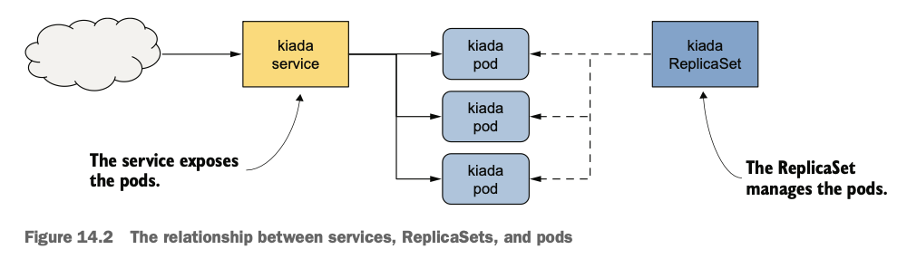
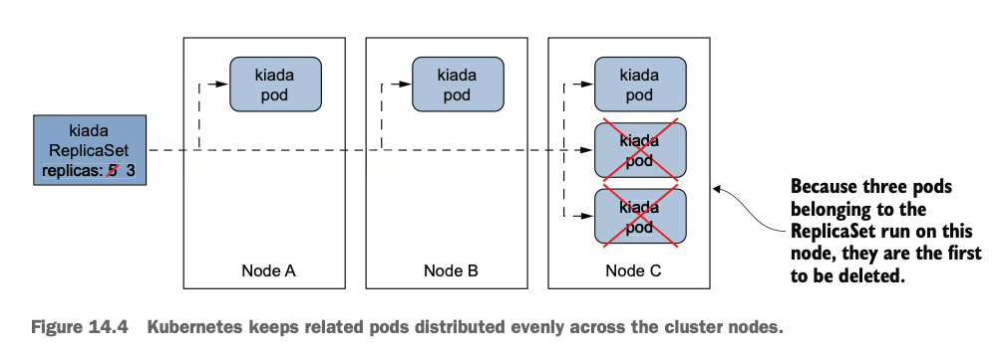
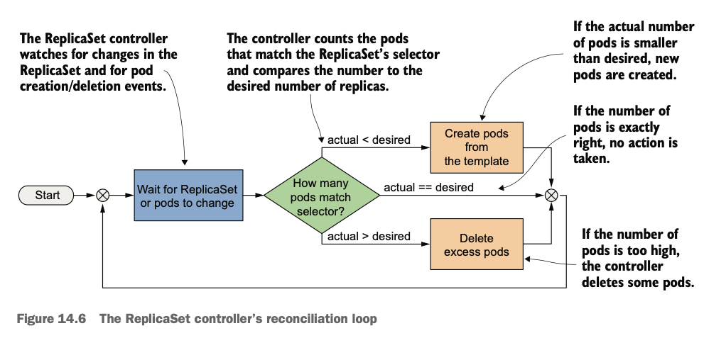
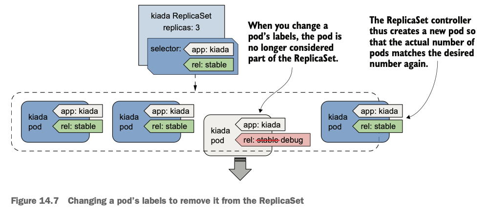

# Scaling and maintaining pods with ReplicaSets

## 1. Introducing ReplicaSes

A **ReplicaSet** represents a group of pod replicas. The ReplicaSet allows you to manage the pods as a single unit. It is the ReplicaSet's label selector to determine which pods belong to the ReplicaSet.

The ReplicaSet guarantees the requested pod(s) is always running. However it is impossible to upgrade the workload to a newer version through ReplicaSet. Deployments provides the upgrade feature for workload on top of what ReplicaSet offers.



## ReplicaSet Spec

Three main fields in the ReplicaSet Spec: **replicas**, **selector**, and **template**.

``` bash hl_lines="6 8-10 12-22" title="The Kiada ReplicaSet object manifest"
apiVersion: apps/v1
kind: ReplicaSet
metadata:
  name: kiada
spec:
  replicas: 5 # (1)!
  selector:
    matchLabels:
      app: kiada
      rel: stable
  template:
    metadata:
      labels:
        app: kiada
        rel: stable
    spec:
      containers:
      - name: kiada
        image: luksa/kiada:0.5
        ...
      volumes:
      - ...
```

1.  :information_source: **replicas** specifies the number of pods this ReplicaSet should contain
2.  :information_source: **selector** to define which pods beling to this ReplicaSet
3.  :information_source: **template** The ReplicaSet creates pod objects from this template.

### Inspecting a ReplicaSet and its pods

``` bash title="Display basic information"
kubectl get rs kiada
# NAME    DESIRED   CURRENT   READY   AGE
# kiada   5         5         5       14s
```

``` bash title="With the -o wide option"
kubectl get rs kiada -o wide
# NAME    DESIRED   CURRENT   READY   AGE   CONTAINERS    IMAGES                                          SELECTOR
# kiada   5         5         5       27s   kiada,envoy   luksa/kiada:0.5,envoyproxy/envoy:v1.31-latest   app=kiada,rel=stable
```

``` bash hl_lines="3-5" title="Listing the pods in a ReplicaSet"
kubectl get po -l app=kiada,rel=stable
# NAME          READY   STATUS    RESTARTS   AGE
# kiada-001     2/2     Running   0          43h
# kiada-002     2/2     Running   0          43h
# kiada-003     2/2     Running   0          43h # (1)!
# kiada-njsbz   2/2     Running   0          72s
# kiada-qjxdc   2/2     Running   0          72s
```

1.  :information_source: The three Kiada pods created beforehand

Use `kubectl logs <workload-name> -c <container-name>` to look up logs from the container. If the ReplicaSet contains only a single pod, enterning `rs/kiada` is enough.

``` bash
kubectl logs rs/kiada -c kiada
```

If the ReplicaSet has multiple pods, you can display the logs from all the pods by specifying the `--all-pods` flag.

``` bash
kubectl logs rs/kiada --all-pods -c envoy
```

Use `--all-containers` option if you want to print the logs from all containers.

``` bash
kubectl logs rs/kiada --all-pods --all-containers
```

Streaming the logs with `-f` option.

``` bash
kubectl logs rs/kiada --all-pods -c kiada -f
```

### Understanding pod ownership

Pod object's metadata section may contain a list of the object's owners.

``` bash hl_lines="11 15-16"
kubectl get po kiada-001 -o yaml
apiVersion: v1
kind: Pod
metadata:
  ...
  labels:
    app: kiada
    rel: stable
  name: kiada-001
  namespace: default
  ownerReferences:
  - apiVersion: apps/v1
    blockOwnerDeletion: true
    controller: true
    kind: ReplicaSet
    name: kiada
    uid: 36585ed1-d5c0-4bf3-ad60-87219e358ff0
  resourceVersion: "362115"
  selfLink: /api/v1/namespaces/default/pods/kiada-001
  uid: 684681ae-5dc4-48a0-9b77-08f35ec1684b
spec:
...
```

Kubernetes has a garbage collector that automatically deletes dependent objects when their owner is deleted. **If an object has multiple owners, the object is deleted when all its owners are gone.** If you delete the ReplicaSet object that owns the `kiada-001` and the other pods, the garbage collector would also delete the pods.


## 2. Updating a ReplicaSet

### Scaling a ReplicaSet
By changing the desired number of replicas, you scale the ReplicaSet.

``` bash
kubectl scale rs kiada --replicas 6
# replicaset.apps/kiada scaled

# check
kubectl get rs kiada
# NAME    DESIRED   CURRENT   READY   AGE
# kiada   6         6         6       9m17s
```

Just as you scale up a ReplicaSet, you can also scale it down with the same command. Run the `kubectl edit rs kiada` command and change `replicas` field value to 4. Verify that you now have four pods:

``` bash
kubectl get pods -l app=kiada,rel=stable
# NAME          READY   STATUS    RESTARTS   AGE
# kiada-001     2/2     Running   0          43h
# kiada-002     2/2     Running   0          43h
# kiada-003     2/2     Running   0          43h
# kiada-qjxdc   2/2     Running   0          12m
```

When you scale down a ReplicaSet, Kubernetes deletes pods in the following order:

1. Pods that aren't yet assigned to a node
1. Pods whose phase is unknown
1. Pods that aren't ready
1. Pods that have a lower deletion cost
1. Pods that are collocated with a greater number of related replicas
1. Pods that have been ready for a shorter time
1. Pods with a greater number of container restarts
1. Pods that were created later than the other pods

!!! note 

    You can influence the pod deletion order by setting the annotation `controller.kubernetes.io/pod-deletion-cost` on your pods. The value must be a string that can be parsed into a 32-bit integer. Pods without this annotation will be deleted before pods with the annotation.

    

    Kubernetes also tries to keep the pods evenly distributed across the cluster nodes. The pods on the node with more workloads are deleted first.

If you need to temporarily shut down all instances of your workload, set the desired number of replicas to zero instead of deleting the ReplicaSet object.

``` bash
kubectl scale rs kiada --replicas 0
# replicaset.apps/kiada scaled

kubectl get po -l app=kiada
# No resources found in default namespace.

kubectl scale rs kiada --replicas 2
# replicaset.apps/kiada scaled

kubectl get po -l app=kiada
# NAME          READY   STATUS    RESTARTS   AGE
# kiada-92shm   2/2     Running   0          16s
# kiada-k7grb   2/2     Running   0          16s
```

### Updating the Pod template

To add a label to the pods that the ReplicaSet creates, you must add the label to its Pod template.

``` yaml hl_lines="16"
apiVersion: apps/v1
kind: ReplicaSet
metadata:
  ...
spec:
  replicas: 2
  selector:
    matchLabels:
      app: kiada
      rel: stable # (1)!
  template:
    metadata:
      labels:
        app: kiada
        rel: stable
        ver: "0.5"
    spec:
...
```

1.  :information_source: Don't add it to the selector as it is immutable, and this would cause the Kubernetes API to reject your update.

!!! warning

    The labels in the selector must be a subset of the labels in the template.

If you look up the `kiada` pod labels, you will see the pods still only have the two labels. It is clear that Kubernetes didn't update the pods.

``` bash
kubectl get pods -l app=kiada --show-labels
# NAME          READY   STATUS    RESTARTS   AGE   LABELS
# kiada-92shm   2/2     Running   0          39m   app=kiada,rel=stable
# kiada-k7grb   2/2     Running   0          39m   app=kiada,rel=stable
```

However, if you now scale the ReplicaSet up by one, the new pod should contain the label you added:

``` bash hl_lines="7"
kubectl scale rs kiada --replicas 3
# replicaset.apps/kiada scaled

kubectl get pods -l app=kiada --show-labels
# NAME          READY   STATUS    RESTARTS   AGE   LABELS
# kiada-92shm   2/2     Running   0          41m   app=kiada,rel=stable
# kiada-ctk6g   2/2     Running   0          13s   app=kiada,rel=stable,ver=0.5
# kiada-k7grb   2/2     Running   0          41m   app=kiada,rel=stable
```

!!! info

    When you change the Pod template, that only affects the pods created afterwards.


## 3. Understanding the operation of the ReplicaSet controller

ReplicaSets are managed by the ReplicaSet controller. Any change you make to a ReplicaSet object is detected and processed by this controller. Each time the controller creates or deletes the pods, it also creates an **Event** object that informs you of what it's done. You can see the events associated with an object at the bottom of the `kubectl describe` or `kubectl get events` command.

``` bash
kubectl describe rs kiada
...
# Events:
#   Type    Reason            Age   From                   Message
#   ----    ------            ----  ----                   -------
#   Normal  SuccessfulDelete  54m   replicaset-controller  Deleted pod: kiada-qjxdc
#   Normal  SuccessfulDelete  54m   replicaset-controller  Deleted pod: kiada-002
#   Normal  SuccessfulDelete  54m   replicaset-controller  Deleted pod: kiada-001
#   Normal  SuccessfulDelete  54m   replicaset-controller  Deleted pod: kiada-003
#   Normal  SuccessfulCreate  53m   replicaset-controller  Created pod: kiada-k7grb
#   Normal  SuccessfulCreate  53m   replicaset-controller  Created pod: kiada-92shm
#   Normal  SuccessfulCreate  11m   replicaset-controller  Created pod: kiada-ctk6g

kubectl get events
# LAST SEEN   TYPE     REASON             OBJECT             MESSAGE
# ...
# 55m         Normal   SuccessfulDelete   replicaset/kiada   Deleted pod: kiada-003
# 54m         Normal   SuccessfulCreate   replicaset/kiada   Created pod: kiada-k7grb
# 54m         Normal   SuccessfulCreate   replicaset/kiada   Created pod: kiada-92shm
# 12m         Normal   SuccessfulCreate   replicaset/kiada   Created pod: kiada-ctk6g
```

### Introducing the reconciliation control loop

The controller's reconciliation control loop:

1. **Observe**: A controller observes the state of both the owner and the dependent objects.
1. **Compare**: After each change in this state, the controller compares the state of the dependent objects with the desired state specified in the owning object.
1. **Update**: If these two states differ, the controller makes changes to the dependent object(s) to reconcile the two states.

The ReplicaSet controller's reconciliation control loop:

1. The ReplicaSet controller watches for changes in the ReplicaSet and for pod creation/deletion events.
1. Each time a ReplicaSet or pod changes, the controller checks the list of pods associated with the ReplicaSet and ensures that the actual number of pods matches the desired number specified in the ReplicaSet.
    - If actual < desired, create pods from the template
    - If actual == desired, no action is taken
    - If actual > desired, delete excess pods



### Understanding how the ReplicaSet controller reacts to pod changes

What the ReplicaSet stays the same, but the actual number of pods changes? The ReplicaSet controller's job is to make sure that the number of pods always matches the specified number. Thus, a new pod will be appeared.

``` bash hl_lines="8"
kubectl delete pod kiada-92shm
# pod "kiada-92shm" deleted from default namespace

kubectl get pods -l app=kiada
# NAME          READY   STATUS    RESTARTS   AGE
# kiada-ctk6g   2/2     Running   0          35m
# kiada-k7grb   2/2     Running   0          77m
# kiada-zv5d2   2/2     Running   0          27s
```

Removing all Kiada pods triggers the controller to deploy three new ones immediately.

If you try to add the pod with labels matching the ReplicaSet's label selector, the ReplicaSet controller deletes the pod as soon as it detects it.

``` bash hl_lines="6"
kubectl get pods -l app=kiada
# NAME                 READY   STATUS        RESTARTS   AGE
# kiada-ctk6g          2/2     Running       0          41m
# kiada-k7grb          2/2     Running       0          83m
# kiada-zv5d2          2/2     Running       0          5m57s
# one-kiada-too-many   0/2     Terminating   0          1s
```

The best reason to create pods via a ReplicaSet instead of directly is that the pods are automatically replaced when your cluster nodes fail. To see what happens when a node stops responding, you can disable its network interface.

Verify which nodes Kiada pods are running on:

``` bash
kubectl get po -l app=kiada -o wide
# NAME          READY   STATUS    RESTARTS   AGE     IP           NODE              NOMINATED NODE   READINESS GATES
# kiada-472dn   2/2     Running   0          8m10s   10.244.2.6   desktop-worker    <none>           <none>
# kiada-6pwb5   2/2     Running   0          8m10s   10.244.2.7   desktop-worker    <none>           <none>
# kiada-mb2vp   2/2     Running   0          8m10s   10.244.1.8   desktop-worker2   <none>           <none>
```

disable the network interface of the `desktop-worker2` node with the following command:

``` bash hl_lines="7"
docker exec desktop-worker2 ip link set eth0 down

kubectl get node
# NAME                    STATUS     ROLES           AGE   VERSION
# desktop-control-plane   Ready      control-plane   21m   v1.34.3
# desktop-worker          Ready      <none>          21m   v1.34.3
# desktop-worker2         NotReady   <none>          21m   v1.34.3
```

Kubernetes realizes that the node is down and marks the pods for deletion. Once the pods are marked for deletion, the ReplicaSet controller creates new pods to replace them:

``` bash hl_lines="5 6"
kubectl get pods -l app=kiada -o wide
# NAME          READY   STATUS        RESTARTS   AGE     IP           NODE              NOMINATED NODE   READINESS GATES
# kiada-472dn   2/2     Running       0          20m     10.244.2.6   desktop-worker    <none>           <none>
# kiada-6pwb5   2/2     Running       0          20m     10.244.2.7   desktop-worker    <none>           <none>
# kiada-llf6g   2/2     Running       0          3m50s   10.244.2.9   desktop-worker    <none>           <none> # (1)!
# kiada-mb2vp   2/2     Terminating   0          20m     10.244.1.8   desktop-worker2   <none>           <none> # (2)!
```

1.  :information_source: A new pod created to replace the ones on the failed node.
2.  :information_source: The pod on the failed node is marked as `Terminating`, and remains in the `Terminating` state until the node comes back online.


In reality, **the containers in those pods are still running because the Kubelet on the node can't communicate with the API server** and therefore doesn't know that they should be terminated. However, when the node's network interface comes back online, the Kubelet terminates the containers, and the pod objects are deleted.

``` bash
docker exec desktop-worker2 ip link set eth0 up

GATEWAY_IP=$(docker network inspect kind -f '{{ (index .IPAM.Config 0).Gateway }}')
docker exec desktop-worker2 ip route add default via $GATEWAY_IP$

k get po -l app=kiada -o wide
# NAME          READY   STATUS    RESTARTS   AGE   IP           NODE             NOMINATED NODE   READINESS GATES
# kiada-472dn   2/2     Running   0          53m   10.244.2.6   desktop-worker   <none>           <none>
# kiada-6pwb5   2/2     Running   0          53m   10.244.2.7   desktop-worker   <none>           <none>
# kiada-llf6g   2/2     Running   0          37m   10.244.2.9   desktop-worker   <none>           <none>
```

!!! warning

    If the above commands do not work, run the following commands:
    ``` bash
    # detach the node
    docker network disconnect kind desktop-worker2

    # reattach the node
    docker network connect kind desktop-worker2

    # restart the kubelet
    docker exec desktop-worker2 systemctl restart kubelet
    ```

Is it possible to get into a state where the number of pods matches the desired replica count, but the pods can't provide the service to their clients?

Be aware that a ReplicaSet doesn't guarantee that you'll always have as many healthy replicas as you specify in the ReplicaSet object, in the case where a container's liveness/readiness probe fails. Let's fail one of the pods' readiness probes with the
following command:

``` bash
kubectl exec rs/kiada -c kiada -- curl -X POST localhost:9901/healthcheck/fail # (1)!
```

1.  :information_source: If you specify the ReplicaSet instead of the Pod name when running the `kubectl exec` command, the specified command is run in one of the pods, not all of them.

After about 30 seconds, the `kubectl get pods` command indicates that one of the pod's containers is no longer ready:

``` bash hl_lines="3"
kubectl get pods -l app=kiada
# NAME          READY   STATUS    RESTARTS   AGE
# kiada-472dn   1/2     Running   0          68m
# kiada-6pwb5   2/2     Running   0          68m
# kiada-llf6g   2/2     Running   0          51m

kubectl get rs
# NAME    DESIRED   CURRENT   READY   AGE
# kiada   3         3         2       70m
```

!!! note

    A ReplicaSet only ensures that the desired number of pods are present. It doesn't ensure that their containers are actually running and ready to handle traffic.

### Removing a pod from the ReplicaSet's control

If you remove a pod from the set of pods that match the selector, the controller replaces it. To do this, you simply change the labels of the faulty pod. Once the label is changed, the controller no longer pays attention to the faulty pod. You can troubleshoot the problem at your own pace while the new pod takes over the traffic.



For a pod to match the ReplicaSet's label selector, it must have the labels `app=kiada` and `rel=stable`. So, to remove the broken pod from the ReplicaSet, you need to remove or change at least one of these two labels.

``` bash
kubectl label po kiada-472dn rel=debug --overwrite
# pod/kiada-472dn labeled
```

the controller immediately creates another pod, as shown in the following output:

``` bash hl_lines="6"
kubectl get pods -l app=kiada -L app,rel
# NAME          READY   STATUS    RESTARTS   AGE   APP     REL
# kiada-472dn   1/2     Running   0          78m   kiada   debug
# kiada-6pwb5   2/2     Running   0          78m   kiada   stable
# kiada-llf6g   2/2     Running   0          61m   kiada   stable
# kiada-xrj6f   2/2     Running   0          37s   kiada   stable
```

## 4. Deleting a ReplicaSet

To delete a ReplicaSet and all pods it controls, run the following command:
``` bash
kubectl delete rs kiada
# replicaset.apps "kiada" deleted from default namespace
```

As expected, this also deletes the pods:
``` bash
kubectl get pods -l app=kiada,rel=stable
# No resources found in default namespace.
```

To preserve the pods when you delete the ReplicaSet object, use the following
command:

``` bash hl_lines="5"
# reapply ReplicaSet
k apply -f rs.kiada.versionLabel.yaml
# replicaset.apps/kiada created

kubectl delete rs kiada --cascade=orphan # (1)!
# replicaset.apps "kiada" deleted from default namespace

kubectl get pods -l app=kiada,rel=stable
# NAME          READY   STATUS    RESTARTS   AGE
# kiada-g4dxz   2/2     Running   0          58s
# kiada-lmsxf   2/2     Running   0          58s
```

1.  :information_source: The `--cascade=orphan` options ensures that only the ReplicaSet is deleted, while the pods are preserved.