# Automating application updates with Deployments


## 1. Introducing Deployments

A Deployment object doesn't manage the Pod objects directly but through a ReplicaSet object that's generated automatically when the Deployment is created.

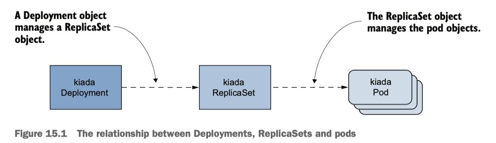

As with ReplicaSets, you specify a Pod template, the desired number of replicas, and a label selector in a Deployment. The pods created based on this Deployment are exact replicas of each other and are fungible. For this and other reasons, Deployments are mainly used for stateless workloads. To run replicated stateful workloads, a StatefulSet is the better option.

### Creating a Deployment

You'll replace the kiada ReplicaSet with a Deployment. Delete the ReplicaSet without deleting the pods:
``` bash
kubectl delete rs kiada --cascade=orphan
```

### Deployment spec

The main fields in a Deployment's `spec` section:

- **replicas**: The desired number of replicas.
- **selector**: Pods that match the label selector are considered part of this Deployment.
- **template**: A pod for the Deployment is created using this template.
- **strategy**: It defines how pods in this Deployment are replaced when you update the Pod template.

### Creating and inspecting the Deployment object

To create the Deployment object from the manifest file, use the `kubectl apply` command. Use `kubectl get deploy` and `kubectl describe deploy` to get information about the Deployment: 

``` bash
kubectl get deploy kiada
# NAME    READY   UP-TO-DATE   AVAILABLE   AGE
# kiada   3/3     3            3           11s
```

The pod number information above is read from the `readyReplicas`, `replicas`, `updatedReplicas` and `availableReplicas` fields in the `status` section:

``` yaml hl_lines="4 19 20 21"
kubectl get deploy kiada -o yaml
...
status:
  availableReplicas: 3
  conditions:
  - lastTransitionTime: "2026-04-17T02:04:47Z"
    lastUpdateTime: "2026-04-17T02:04:47Z"
    message: Deployment has minimum availability.
    reason: MinimumReplicasAvailable
    status: "True"
    type: Available
  - lastTransitionTime: "2026-04-17T02:04:44Z"
    lastUpdateTime: "2026-04-17T02:04:47Z"
    message: ReplicaSet "kiada-b6f6846d8" has successfully progressed.
    reason: NewReplicaSetAvailable
    status: "True"
    type: Progressing
  observedGeneration: 1
  readyReplicas: 3
  replicas: 3
  updatedReplicas: 3
```

To know whether the Deployment rollout was successful, use the following command:
``` bash
kubectl rollout status deployment kiada
# deployment "kiada" successfully rolled out
```

List the pods that belong to the Deployment by using the selector:
``` bash hl_lines="3-5"
kubectl get pods -l app=kiada,rel=stable
# NAME                    READY   STATUS    RESTARTS   AGE
# kiada-b6f6846d8-fwcg6   2/2     Running   0          6m58s
# kiada-b6f6846d8-h8td6   2/2     Running   0          6m58s
# kiada-b6f6846d8-pl9tz   2/2     Running   0          6m58s # (1)!
# kiada-g4dxz             2/2     Running   0          21h
# kiada-lmsxf             2/2     Running   0          21h # (2)!
```

1.  :information_source: The first three pods are created by the Deployment.
2.  :information_source: The last two pods are created by the ReplicaSet from the previous chapter.

Although the label selector in the Deployment matches the two existing pods, they weren't picked up by the Deployment. Let's take a look at the ReplicaSet generated by the Deployment:
``` bash hl_lines="5 8 10 16 21"
kubectl get rs
# NAME              DESIRED   CURRENT   READY   AGE
# kiada-b6f6846d8   3         3         3       33m

kubectl describe rs kiada # (1)!
Name:           kiada-b6f6846d8
Namespace:      default
Selector:       app=kiada,pod-template-hash=b6f6846d8,rel=stable # (2)!
Labels:         app=kiada
                pod-template-hash=b6f6846d8 # (3)!
                rel=stable
                ver=0.5
Annotations:    deployment.kubernetes.io/desired-replicas: 3
                deployment.kubernetes.io/max-replicas: 4
                deployment.kubernetes.io/revision: 1
Controlled By:  Deployment/kiada # (4)!
Replicas:       3 current / 3 desired
Pods Status:    3 Running / 0 Waiting / 0 Succeeded / 0 Failed
Pod Template:
  Labels:  app=kiada
           pod-template-hash=b6f6846d8
           rel=stable
           ver=0.5
```

1.  :information_source: Just typing part of the name suffices.
2.  :information_source: The ReplicaSet's label selector doesn't quite match the one in the Deployment.
3.  :information_source: An additional `pod-template-hash` label appears in both the ReplicaSet's and the pod's labels.
4.  :information_source: The ReplicaSet is owned and controlled by the kiada Deployment.

The `Controlled By` line indicates that this ReplicaSet has been created and is owned and controlled by the `kiada` Deployment. And the Pod template, selector, and the ReplicaSet itself contain an additional label key `pod-template-hash`. The value of this label matches the last part of the ReplicaSet's name. This label explains why the two existing pods weren't acquired by this ReplicaSet.

``` bash
kubectl get pods -l app=kiada,rel=stable --show-labels
NAME                    READY   STATUS    RESTARTS   AGE   LABELS
kiada-b6f6846d8-fwcg6   2/2     Running   0          43m   app=kiada,pod-template-hash=b6f6846d8,rel=stable,ver=0.5
kiada-b6f6846d8-h8td6   2/2     Running   0          43m   app=kiada,pod-template-hash=b6f6846d8,rel=stable,ver=0.5
kiada-b6f6846d8-pl9tz   2/2     Running   0          43m   app=kiada,pod-template-hash=b6f6846d8,rel=stable,ver=0.5
kiada-g4dxz             2/2     Running   0          21h   app=kiada,rel=stable,ver=0.5
kiada-lmsxf             2/2     Running   0          21h   app=kiada,rel=stable,ver=0.5
```

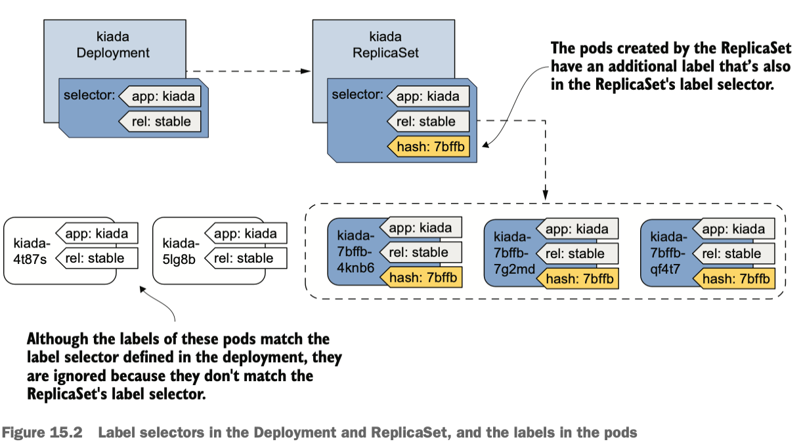


You can now delete the two Kiada pods that aren't part of the Deployment, with the following command:
``` bash
kubectl delete po -l 'app=kiada,rel=stable,!pod-template-hash'
```

### Troubleshooting Deployments that fail to produce any pods

If you apply the manifest file `deploy.where-are-the-pods.yaml`, you will notice that no pods are created for this Deployment. In this case, you can inspect the Deployment object with `kubectl describe`. The Deployment's events don't show anything useful, but its conditions do:

``` bash hl_lines="8"
kubectl describe deploy where-are-the-pods
...
Conditions:
  Type             Status  Reason
  ----             ------  ------
  Progressing      True    NewReplicaSetCreated
  Available        False   MinimumReplicasUnavailable
  ReplicaFailure   True    FailedCreate
OldReplicaSets:    <none>
NewReplicaSet:     where-are-the-pods-847c4b7cd8 (0/3 replicas created)
Events:
  Type    Reason             Age   From                   Message
  ----    ------             ----  ----                   -------
  Normal  ScalingReplicaSet  9s    deployment-controller  Scaled up replica set where-are-the-pods-847c4b7cd8 from 0 to 3
```

The `ReplicaFailure` condition is `True`, indicating an error. If you look at the `conditions` in the `status` section of the Deployment's manifest, you'll notice the `message` field of the `ReplicaFailure` condition tells you exactly what happened.

``` bash hl_lines="8-10"
kubectl get deploy where-are-the-pods -o yaml
...
status:
  conditions:
  ...
  - lastTransitionTime: "2026-04-17T03:25:47Z"
    lastUpdateTime: "2026-04-17T03:25:47Z"
    message: 'pods "where-are-the-pods-847c4b7cd8-" is forbidden: error looking up
      service account default/missing-service-account: serviceaccount "missing-service-account"
      not found'
    reason: FailedCreate
    status: "True"
    type: ReplicaFailure
  observedGeneration: 1
  unavailableReplicas: 3
```

Alternatively, you can examine the ReplicaSet and its events:
``` bash
kubectl describe rs where-are-the-pods
...
Events:
  Type     Reason        Age                   From                   Message
  ----     ------        ----                  ----                   -------
  Warning  FailedCreate  71s (x17 over 6m39s)  replicaset-controller  Error creating: pods "where-are-the-pods-847c4b7cd8-" is forbidden: error looking up service account default/missing-service-account: serviceaccount "missing-service-account" not found
```

There are many possible reasons why the ReplicaSet controller can't create a pod, but they're usually related to user privileges.

### Scaling a Deployment

You can scale a Deployment by editing the object with the `kubectl edit` command and changing the value of the `replicas` field:
``` bash
kubectl scale deploy kiada --replicas 5
# deployment.apps/kiada scaled

kubectl describe deploy kiada
...
Events:
  Type    Reason             Age   From                   Message
  ----    ------             ----  ----                   -------
  Normal  ScalingReplicaSet  23s   deployment-controller  Scaled up replica set kiada-b6f6846d8 from 3 to 5
```

What happens when you scale a ReplicaSet object owned and controlled by a Deployment? Let's start watching ReplicaSets by running:

``` bash
kubectl get rs -w
```

Now scale the `kiada` ReplicaSet in the new terminal:

``` bash
kubectl scale rs kiada-b6f6846d8 --replicas 7
replicaset.apps/kiada-b6f6846d8 scaled
```

If you look at the output of the first command, you will see the desired number of replicas goes up to seven but is soon reverted to five.

``` bash
kubectl get rs -w
NAME              DESIRED   CURRENT   READY   AGE
kiada-b6f6846d8   5         5         5       137m
kiada-b6f6846d8   7         5         5       138m
kiada-b6f6846d8   5         5         5       138m
kiada-b6f6846d8   5         5         5       138m
kiada-b6f6846d8   5         7         5       138m
kiada-b6f6846d8   5         5         5       138m
```

This happens because the Deployment controller detects that the desired number of replicas in the ReplicaSet no longer matches the number in the Deployment object and so it changes it back.

### Deleting a Deployment

When you delete a Deployment object, the underlying ReplicaSet and pods are also deleted. If you want to keep the pods, run the `kubectl delete` command with the `--cascade=orphan` option, as you can with a ReplicaSet. This will preserve both the pods and the ReplicaSet. The pods still belong to and are controlled by that ReplicaSet.

If you recreate the Deployment, it picks up the existing ReplicaSet, assuming you haven't changed the Deployment's Pod template in the meantime. This happens because the Deployment controller finds an existing ReplicaSet with a name that matches the ReplicaSet that the controller would otherwise create.


## 2. Updating a Deployment

When you update the Pod template to use the new container image, the Deployment controller stops the pods running with the old image and replaces them with the new pods. The way the pods are replaced depends on the update strategy configured in the Deployment. Currently, Kubernetes supports the two strategies:

- `Recreate`: All pods are deleted simultaneously, and then, the new pods are created simultaneously. The service is unavailable for a short time. Use this strategy if **your application doesn't allow to run the old and new versions at the same time** and **service downtime isn't a problem**.
- `RollingUpdate`: It causes old pods to be gradually removed and replaced with new ones. This is the default strategy.

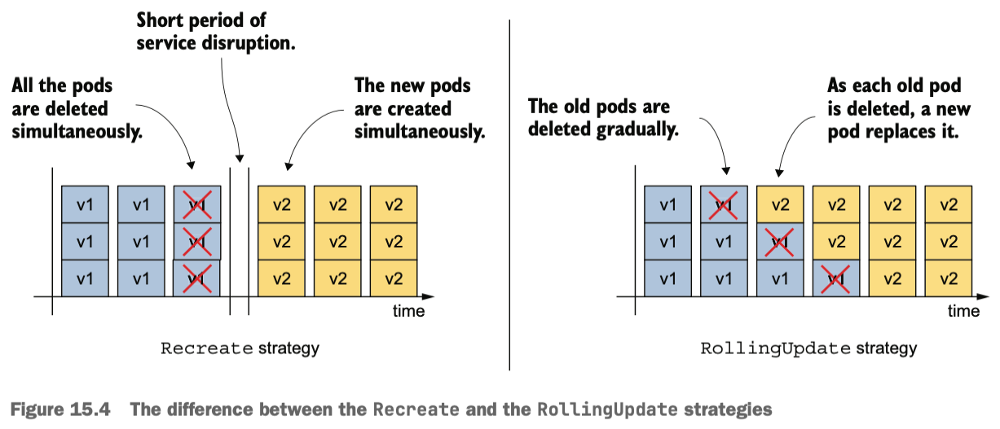

### The Recreate strategy

To use the `Recreate` update strategy, include the highlighted lines below in your Deployment manifest:

``` yaml hl_lines="2-3"
spec:
  strategy:
    type: Recreate
  replicas: 3
  ...
```

To update the pods to the new version of the Kiada container image, you need to update the `image` field in the `kiada` container definition within the Pod template. For a simple image change, use the `kubectl set image` command:
``` bash
kubectl set image deployment kiada kiada=luksa/kiada:0.6
```

!!! warning

    Since the Pod template in your Deployment also specifies the application version in the pod labels, changing the image without also changing the label value would result in an inconsistency.

To change the image name and label value at the same time, you can use the `kubectl patch` command:

``` bash
kubectl patch deploy kiada --patch '{"spec": {"template": {"metadata":
{"labels": {"ver": "0.6"}}, "spec": {"containers": [{"name": "kiada",
"image": "luksa/kiada:0.6"}]}}}}'
```

``` bash
kubectl patch deploy kiada --patch '
spec:
  template:
    metadata:
      labels:
        ver: "0.6"
    spec:
      containers:
      - name: kiada
        image: luksa/kiada:0.6'
```

To look at `ver` label value in the `kiada` Pods, use `-L ver` option in `kubectl get po` command:

``` bash
kubectl get po -l app=kiada -L ver
NAME                     READY   STATUS    RESTARTS   AGE     VER
kiada-84f595fc84-ff7v4   2/2     Running   0          6m47s   0.6
kiada-84f595fc84-n264x   2/2     Running   0          6m47s   0.6
kiada-84f595fc84-sfpcm   2/2     Running   0          6m47s   0.6
```

The names of the pods with version 0.5 are different from those with version 0.6. Recall that **pods created by a ReplicaSet get their names from that ReplicaSet**. The name change indicates that these new pods belong to a different ReplicaSet. List the ReplicaSets to confirm this as follows:
``` bash hl_lines="3-4"
kubectl get rs -L ver
NAME               DESIRED   CURRENT   READY   AGE     VER
kiada-65b874db47   0         0         0       14m     0.5
kiada-84f595fc84   3         3         3       13m     0.6
```

When you update the Deployment, a new ReplicaSet is created, and all the pods of this Deployment are controlled by this ReplicaSet. Note that **the old ReplicaSet is not removed, but with zero replicas**. The pod transition process would look like below:

1. At the beginning, only the old ReplicaSet was present with the three available replicas.
1. The Deployment controller then scaled the ReplicaSet to zero replicas, causing the ReplicaSet controller to delete all the pods.
1. Next, the Deployment controller created the new ReplicaSet and configured it with three replicas.
1. The ReplicaSet controller creates the three new pods. When the containers in these pods start and begin accepting connections, the value in the `READY` column also changes to three.

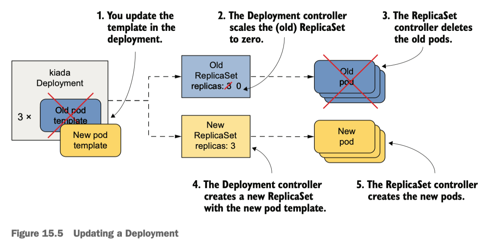

### The RollingUpdate strategy

With this strategy, the pods are replaced gradually, by scaling down the old ReplicaSet and simultaneously scaling up the new ReplicaSet by the same number of replicas.

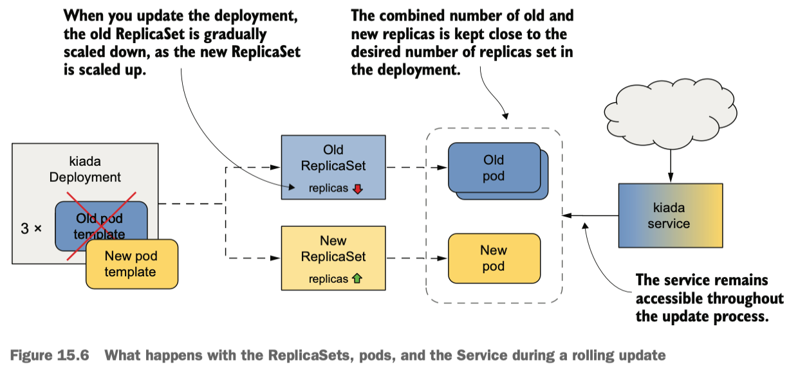

Refer to the following manifest with the `RollingUpdate` strategy(`deploy.kiada.0.7.rollingUpdate.yaml`):

``` yaml hl_lines="7-12"
apiVersion: apps/v1
kind: Deployment
metadata:
  name: kiada
...
spec:
  strategy:
    type: RollingUpdate
    rollingUpdate:
      maxSurge: 0
      maxUnavailable: 1
  minReadySeconds: 10 # (1)!
  replicas: 3
  selector:
  ...
```

1.  :information_source: rollingUpdate parameters and `minReadySeconds` will be covered later.

Let's apply the manifest file `deploy.kiada.0.7.rollingUpdate.yaml`. Track the progress of the rollout with the `kubectl rollout status` command:

``` bash
kubectl rollout status deploy kiada
# Waiting for deployment "kiada" rollout to finish: 1 out of 3 new replicas have been updated...
# Waiting for deployment "kiada" rollout to finish: 1 out of 3 new replicas have been updated...
# Waiting for deployment "kiada" rollout to finish: 1 out of 3 new replicas have been updated...
# Waiting for deployment "kiada" rollout to finish: 2 out of 3 new replicas have been updated...
# Waiting for deployment "kiada" rollout to finish: 2 out of 3 new replicas have been updated...
# Waiting for deployment "kiada" rollout to finish: 2 out of 3 new replicas have been updated...
# Waiting for deployment "kiada" rollout to finish: 2 out of 3 new replicas have been updated...
# Waiting for deployment "kiada" rollout to finish: 2 of 3 updated replicas are available...
# Waiting for deployment "kiada" rollout to finish: 2 of 3 updated replicas are available...
# deployment "kiada" successfully rolled out
```

The state of the underlying ReplicaSets changes with the following steps:

The initial state of 0.6 ReplicaSet: 
``` bash
NAME               DESIRED   CURRENT   READY   AGE     VER
kiada-84f595fc84   3         3         3       23h     0.6
```

When the update begins, the ReplicaSet running ver 0.6 is scaled down by one pod, while the ReplicaSet for ver 0.7 is created:
``` bash
NAME               DESIRED   CURRENT   READY   AGE     VER
kiada-84d6dcc7dd   1         1         0       2s      0.7
kiada-84f595fc84   2         2         2       23h     0.6
```

The two old pods with `READY` state take over all the service traffic. The Deployment controller waits until this new pod is ready before resuming the update process. When this happens the state of the ReplicaSets is as follows:
``` bash
NAME               DESIRED   CURRENT   READY   AGE     VER
kiada-84d6dcc7dd   1         1         1       6s      0.7
kiada-84f595fc84   2         2         2       23h     0.6
```

At this point, traffic is handled by three pods. Because of `minReadySeconds: 10`, the Deployment controller waits 10 seconds before proceeding with the update. After 10 seconds have passed, the Deployment controller scales the old ReplicaSet down by one replica, while scaling the new ReplicaSet up by one replica:

``` bash
NAME               DESIRED   CURRENT   READY   AGE     VER
kiada-84d6dcc7dd   2         2         1       16s     0.7
kiada-84f595fc84   1         1         1       23h     0.6
```

The service load is now handled by one old and one new pod. Ten seconds after the pod is ready, the Deployment controller makes the final changes to the two ReplicaSets:

``` bash
NAME               DESIRED   CURRENT   READY   AGE     VER
kiada-84d6dcc7dd   3         3         2       29s     0.7
kiada-84f595fc84   0         0         0       23h     0.6
```

All client traffic is now handled by the new version of the application. When the third new pod is ready, the rolling update is complete.

During the update process, **there were always at least two replicas handling the traffic**.

### Configuring how many pods are replaced at a time

In the previous rolling update example, the pods were replaced one by one. You can change this by changing `maxSurge` and `maxUnavailable` rolling update parameters.

``` yaml hl_lines="5-6"
spec:
  strategy:
    type: RollingUpdate
    rollingUpdate:
      maxSurge: 0
      maxUnavailable: 1
```

- `maxSurge`: The max number of pods above the desired number of replicas during the rolling update. Either an absolute number or a percentage of the desired number of replicas.
- `maxUnavailable`: The max number of pods relative to the desired replica count that can be unavailable during the rolling update. Either an absolute number or a percentage of the desired number of replicas.

Let's look at how these two parameters affect how the Deployment controller performs the update.

#### MaxSurge=0, maxUnavailable=1

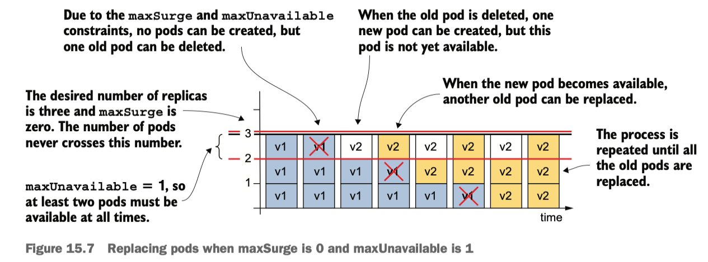

- `maxSurge: 0`: the Deployment controller wasn't allowed to add pods beyond the desired number of replicas.
- `maxUnavailable: 1`: the Deployment controller had to keep the number of available replicas above two and therefore could only delete one old pod at a time.

#### MaxSurge=1, maxUnavailable=0


- `maxSurge: 1`: there should be more than four pods total.
- `maxUnavailable: 0`: there must be at least three replicas available throughout the process.

Because of `maxUnavailable: 0` condition, the update process starts by scaling the new ReplicaSet up by one pod.

!!! note

    You can't set both `maxSurge` and `maxUnavailable` to zero, as this wouldn't allow the Deployment to exceed the desired number of replicas or remove pods, as one pod would then be unavailable.

#### MaxSurge=1, maxUnavailable=1

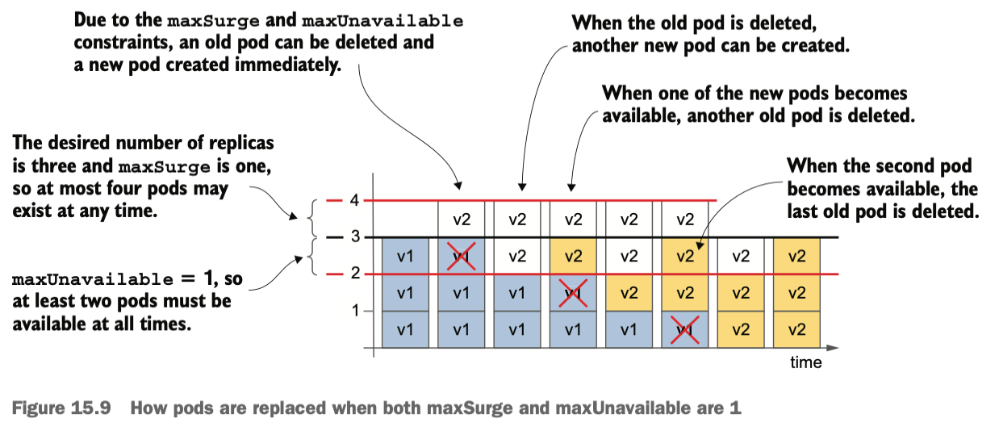

- `maxSurge: 1`: the total number of replicas in the Deployment can be up to four.
- `maxUnavailable: 1`: two pods must always be available.


The Deployment controller immediately scales the new ReplicaSet up by one replica and the old ReplicaSet down the same amount. As soon as the old ReplicaSet reports that it has marked one of the old pods for deletion, the Deployment controller scales the new ReplicaSet up by another pod.

#### Using higher values of maxSurge and maxUnavailable

If `maxSurge` is set to a value higher than one, the Deployment controller is allowed to add even more Pods at a time. If `maxUnavailable` is higher than one, the controller is allowed to remove more pods.

#### Using percentages

The controller calculates the absolute `maxSurge` number by **rounding up**, and `maxUnavailable` by **rounding down**.

### Pausing the rollout process

To pause an update in the middle of the rolling update process, use:
``` bash
kubectl rollout pause deployment kiada
```

This command sets the value of the `paused` field in the Deployment's `spec` section to `true`. The Deployment controller checks this field before any change to the underlying ReplicaSets.

To resume a paused rollout, execute the following command:
``` bash
kubectl rollout resume deployment kiada
```

### minReadySeconds

During a rolling update, you might see the following output:
``` bash
kubectl get deploy kiada
NAME    READY   UP-TO-DATE   AVAILABLE   AGE
kiada   3/3     1            2           50m
```

Although three pods are ready, not all three are available. What's the distinction between **READY** and **AVAILABLE** states?

A pod is considered **Ready** when all of its containers have successfully passed their **readiness probes**.

* **Significance**: When the `Ready` condition in the pod status becomes `True`, Kubernetes adds the pod's IP to the endpoints list of any associated Services.
* **Traffic**: The pod can now begin receiving traffic from users or other services.

A pod is considered **Available** only after it has been **Ready** for a minimum duration specified by the `minReadySeconds` field in a Deployment or ReplicaSet.

* **Significance**: This is a higher-level state used by the Deployment controller to determine if a rolling update can proceed.
* **Formula**: `Available = Ready + minReadySeconds` elapsed.
* **Default**: If `minReadySeconds` is 0 (the default), a pod becomes **Available** as soon as it is **Ready**.

In practice, you can set `minReadySeconds` to much higher value(e.g. `3600`) to automatically pause the rollout for a longer period after the new pods are created, to ensure that **the update won't continue until the first pods with the new version prove that they can operate for a full hour without problems**.


#### Lab - minReadySeconds save you from rolling out a faulty app

??? warning "Ensure the kiada app is accessible via http://kiada.example.com"

    If your Kubernetes cluster does not have any objects but those in `/Chapter15` directory, you can't access to the kiada workload via `http://kiada.example.com`. Test if `kiada.example.com` gets you to the kiada application:

    ``` bash
    curl -s http://kiada.example.com -v
    # * Could not resolve host: kiada.example.com
    # * Closing connection
    ```

    Two main reasons:

    - **no Ingress Controller**(like NGINX) running in your cluster
    - `kiada.example.com` does not resolve to `localhost`

    To fix the access issue, deploy the nginx ingress controller as the first step:
    ``` bash
    # Add Execute Permission
    chmod +x ./Chapter12/install-ingress-nginx-kind.sh

    # Run the script to install nginx
    ./Chapter12/install-ingress-nginx-kind.sh
    ```

    Next, update your existing Ingress by applying that file or by running this command:
    ``` bash
    kubectl patch ingress kiada --type='json' -p='[{"op": "replace", "path": "/spec/ingressClassName", "value":"nginx"}]'
    ```

    Verify that `kiada` ingress object is wired to `nginx` ingress controller:
    ``` bash
    kubectl get ingress kiada
    # NAME    CLASS   HOSTS                               ADDRESS     PORTS     AGE
    # kiada   nginx   kiada.example.com,api.example.com   localhost   80, 443   2d12h
    ```

    Update your local `/etc/hosts` file so your computer knows where to send requests for `kiada.example.com`:
    ``` bash
    echo "127.0.0.1 kiada.example.com api.example.com" | sudo tee -a /etc/hosts

    # verify
    cat /etc/hosts | grep kiada
    # 127.0.0.1 kiada.example.com api.example.com
    ```

    Verify the kiada app is accessible:
    ``` bash
    curl -s http://kiada.example.com -v
    # * Host kiada.example.com:80 was resolved.
    # * IPv6: (none)
    # * IPv4: 127.0.0.1
    # *   Trying 127.0.0.1:80...
    # * Connected to kiada.example.com (127.0.0.1) port 80
    # > GET / HTTP/1.1
    # > Host: kiada.example.com
    # > User-Agent: curl/8.7.1
    # > Accept: */*
    ...
    ```

You will deploy version 0.8 of the Kiada service. This is a special version that starts to return `500 Internal Server Error` responses after the specified seconds have been passed. This time is configurable via the `FAIL_AFTER_SECONDS` env var. Apply `deploy.kiada.0.8.minReadySeconds60.yaml` manifest file:

``` bash hl_lines="12 18 21-22 24-31" title="deploy.kiada.0.8.minReadySeconds60.yaml"
apiVersion: apps/v1
kind: Deployment
metadata:
  name: kiada
...
spec:
  strategy:
    type: RollingUpdate
    rollingUpdate:
      maxSurge: 0
      maxUnavailable: 1
  minReadySeconds: 60 # (1)!
  ...
    spec:
      containers:
      - name: kiada
        image: luksa/kiada:0.8
        imagePullPolicy: IfNotPresent
        env:
        - name: FAIL_AFTER_SECONDS
          value: "30" # (2)!
        ...
        readinessProbe: # (3)!
          initialDelaySeconds: 0
          periodSeconds: 10
          failureThreshold: 1
          httpGet:
            port: 8080
            path: /healthz/ready
            scheme: HTTP
...
```

1.  :information_source: Each pod must be ready for 60 seconds before it is considered available.
2.  :information_source: The application reads the environment variable and fails after this many seconds.
3.  :information_source: The readiness probe is configured to run on startup and then every 10 seconds.

To peek the Deployment rollout progress, look up the `Progressing` part in the object's `status.conditions` list. After the specified `progressDeadlineSeconds` value in the Deployment `spec`, the status of `Progressing` condition changes to `False` and the reason changes to `ProgressDeadlineExceeded`. 

``` bash hl_lines="7"
kubectl describe deploy kiada
# ...
# Conditions:
#   Type           Status  Reason
#   ----           ------  ------
#   Available      True    MinimumReplicasAvailable
#   Progressing    False   ProgressDeadlineExceeded


kubectl get deploy kiada -o yaml
# ...
# status:
#   availableReplicas: 2
#   conditions:
#   ...
#   - lastTransitionTime: "2026-04-18T13:11:43Z"
#     lastUpdateTime: "2026-04-18T13:11:43Z"
#     message: ReplicaSet "kiada-5c984655d7" has timed out progressing.
#     reason: ProgressDeadlineExceeded
#     status: "False"
#     type: Progressing
```

`kubectl rollout status` command prints the following message:

``` bash
kubectl rollout status deploy kiada
# Waiting for deployment "kiada" rollout to finish: 1 out of 3 new replicas have been updated...
# error: deployment "kiada" exceeded its progress deadline
```

Other than reporting that the rollout has stalled, Kubernetes takes no further action. The rollout process never stops completely. If the pod becomes ready and remains so for the duration of `minReadySeconds`, the rollout process continues. **If the pod never becomes ready again, the rollout process simply doesn't continue**.

`kubectl rollout undo` command rolls back the Deployment to the previous version:
``` bash
kubectl rollout undo deployment kiada
# deployment.apps/kiada rolled back
```

!!! note

    When a Deployment is paused with the `kubectl pause` command, the `kubectl rollout undo` command does nothing until you resume the Deployment with `kubectl rollout resume`.

We can even revert to one of the previous versions. To do that, run `kubectl rollout history` command to get the revision number:

``` bash
kubectl rollout history deploy kiada
# deployment.apps/kiada 
# REVISION  CHANGE-CAUSE
# 2         <none>
# 4         <none>
# 5         <none>
# 9         <none>
# 10        <none>
```

Then you can inspect each revision individually by running the `kubectl rollout history` command with the `--revision` option:
``` bash hl_lines="4-7 10"
kubectl rollout history deploy kiada --revision 2
deployment.apps/kiada with revision #2
Pod Template:
  Labels:       app=kiada
        pod-template-hash=65b874db47
        rel=stable
        ver=0.5
  Containers:
   kiada:
    Image:      luksa/kiada:0.6
    Port:       8080/TCP (http)
    Host Port:  0/TCP (http)
    Readiness:  http-get http://:8080/healthz/ready delay=0s timeout=1s period=10s #success=1 #failure=3
...
```

the history of a Deployment is represented by the ReplicaSets associated with the Deployment. Each ReplicaSet represents one revision. This is the reason why the Deployment controller doesn't delete the old ReplicaSet object after the update process is complete.

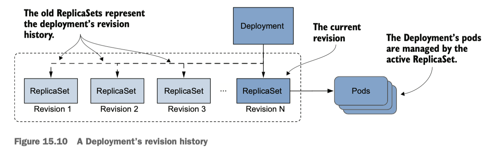

!!! note

    The size of the revision history is determined by the `spec.revisionHistoryLimit` field in the Deployment. The default vaule is `10`. 

!!! tip

    Instead of using `kubectl rollout history` to view the history of a Deployment, listing ReplicaSets with `-o wide` is a better option, because it shows the image tags used in the pod.

    ``` bash
    # k get rs -o wide
    # NAME               DESIRED   CURRENT   READY   AGE   CONTAINERS    IMAGES                                          SELECTOR
    # kiada-5c984655d7   0         0         0       85m   kiada,envoy   luksa/kiada:0.8,envoyproxy/envoy:v1.31-latest   app=kiada,pod-template-hash=5c984655d7,rel=stable
    # kiada-65b874db47   0         0         0       33h   kiada,envoy   luksa/kiada:0.6,envoyproxy/envoy:v1.31-latest   app=kiada,pod-template-hash=65b874db47,rel=stable
    # kiada-84d6dcc7dd   3         3         3       10h   kiada,envoy   luksa/kiada:0.7,envoyproxy/envoy:v1.31-latest   app=kiada,pod-template-hash=84d6dcc7dd,rel=stable
    # kiada-84f595fc84   0         0         0       33h   kiada,envoy   luksa/kiada:0.6,envoyproxy/envoy:v1.31-latest   app=kiada,pod-template-hash=84f595fc84,rel=stable
    # kiada-b6f6846d8    0         0         0       36h   kiada,envoy   luksa/kiada:0.5,envoyproxy/envoy:v1.31-latest   app=kiada,pod-template-hash=b6f6846d8,rel=stable
    ```

    ``` bash hl_lines="7"
    kubectl get rs kiada-65b874db47 -o yaml
    # kind: ReplicaSet
    # metadata:
    #   annotations:
    #     deployment.kubernetes.io/desired-replicas: "3"
    #     deployment.kubernetes.io/max-replicas: "3"
    #     deployment.kubernetes.io/revision: "2"
    ```

Let's roll back the kiada workloads to version 0.6, using `kubectl rollout undo` command:
``` bash hl_lines="7 18"
# find the ReplicaSet name for version 0.6
kubectl get rs -L ver
NAME               DESIRED   CURRENT   READY   AGE     VER
kiada-5c984655d7   0         0         0       3h40m   0.8
kiada-65b874db47   0         0         0       35h     0.5
kiada-84d6dcc7dd   3         3         3       12h     0.7
kiada-84f595fc84   0         0         0       35h     0.6
kiada-b6f6846d8    0         0         0       38h     0.5

# find the revision number for version 0.6
kubectl get rs kiada-84f595fc84 -o yaml
apiVersion: apps/v1
kind: ReplicaSet
metadata:
  annotations:
    deployment.kubernetes.io/desired-replicas: "3"
    deployment.kubernetes.io/max-replicas: "3"
    deployment.kubernetes.io/revision: "5"

# revert to the revision number 5
kubectl rollout undo deployment kiada --to-revision=5
deployment.apps/kiada rolled back

# verify
kubectl get po -L ver
NAME                     READY   STATUS    RESTARTS      AGE     VER
kiada-84f595fc84-g4pld   2/2     Running   0             40m     0.6
kiada-84f595fc84-rrldp   2/2     Running   1 (41m ago)   42m     0.6
kiada-84f595fc84-vmxrk   2/2     Running   0             43m     0.6
...
```

!!! note

    The `kubectl rollout undo` to revert to the previous version of the Deployment manifest is different from the `kubectl apply` command. It **reverts only the Pod template** and preserves any changes made to the Deployment manifest, including the update strategy and the desired number of replicas. The `kubectl apply` command, however, overwrites these changes.

!!! tip

    To restart all the pods that belong to a Deployment, use `kubectl rollout restart` command. This command deletes and replaces the pods using the same strategy used for updates.


## 3. Implementing other deployment strategies

There are more update strategies other than `Recreate` and `RollingUpdate` that Kubernetes native Deployment controller does not support(requiring to install a third-party controller):

- **Recreate**: Stop all pods running the previous version, then create all pods with the new version.
- **Rolling update**: Gradually replace the old pods with the new ones.
- **Canary**: Create one or very small number of new pods, and redirect a small amount of traffic to those pods. Then replace all the remaining pods.
- **A/B testing**: Create a small number of new pods and redirect a subset of users to those pods based on some condition. Use this strategy to collect data on how effective each version is at achieving certain goals.
- **Blue/Green**: Deploy the new version of the pods in parallel with the old version. Wait until the new pods are ready and then switch all traffic to the new pods.
- **Shadowing**: Deploy the new version of the pods alongside the old version. Forward each request to both versions, but return only the old version's response to the user, while discarding the new version's response. This way, you can see how the new version behaves without affecting users.

### Canary deployment

Three ways to accomplish the canary strategy:

- **Set the `minReadySeconds` to a high enough value**
  - The update process is paused until the first new pods prove their worthiness.
  - The difference with a true Canary deployment is that this pause applies not only to the first pod(s), but to every step of the update process.
- **Use the `kubectl rollout pause` command**
  - Run `kubectl rollout pause` command immediately after creating the first pod(s) and manually check those canary pods.
  - After checking the canary pods, continue the update with the `kubectl rollout resume` command.
- **Create a separate Deployment for the canary pods with a much lower number than the desired**
  - Configure the Service to forward traffic to the pods in both Deployments.
  - Because the canary Deployment has much fewer pods than the stable Deployment, only a small amount of traffic is sent to the canary pods, while the majority is sent to the stable pods.

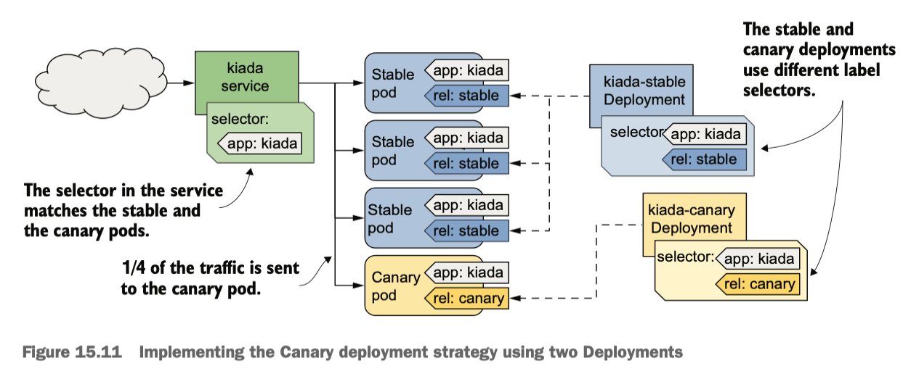

#### The A/B strategy

Configure the Ingress object to route traffic to one Service or the other based on the selected condition. Kubernetes doesn't provide a native way to implement this deployment strategy, but some Ingress implementations do.

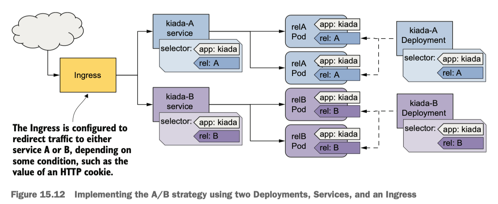

#### The Blue/Green strategy

Another Deployment(Green) is created alongside the first Deployment(Blue). The Service is configured to forward traffic only to the Blue Deployment until you decide to switch all traffic to the Green Deployment. **The two groups of pods use different labels, and the label selector in the Service matches one group at a time**.

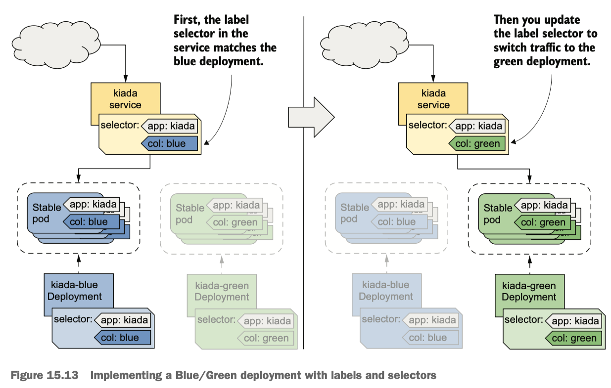

#### Traffic shadowing

Sometimes you're not quite sure if the new version of your application will work properly in the actual production environment, or if it can handle the load. In this case, you can deploy the new version alongside the existing version by creating another Deployment object with a different label. Then you configure **the Ingress or proxy that sits in front of the pods to send traffic to the existing pods, but also mirror it to the new pods**. The proxy sends the response from the existing pods to the client and discards the response from the new pods. Kubernetes doesn't natively provide the necessary functionality to implement it.

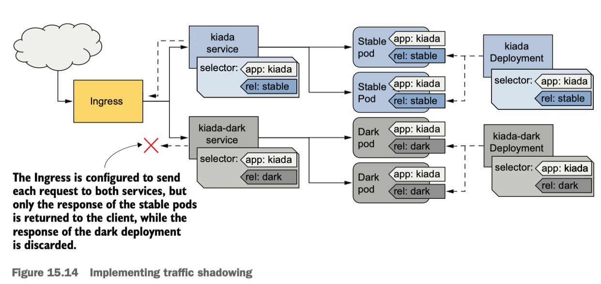