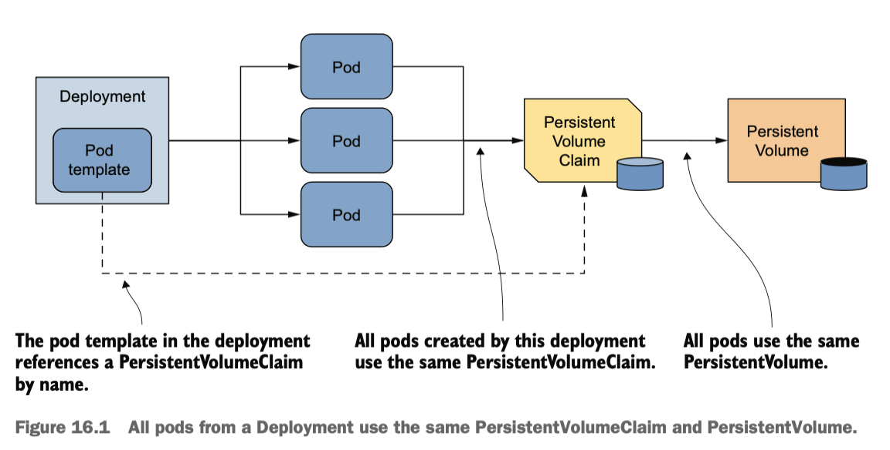
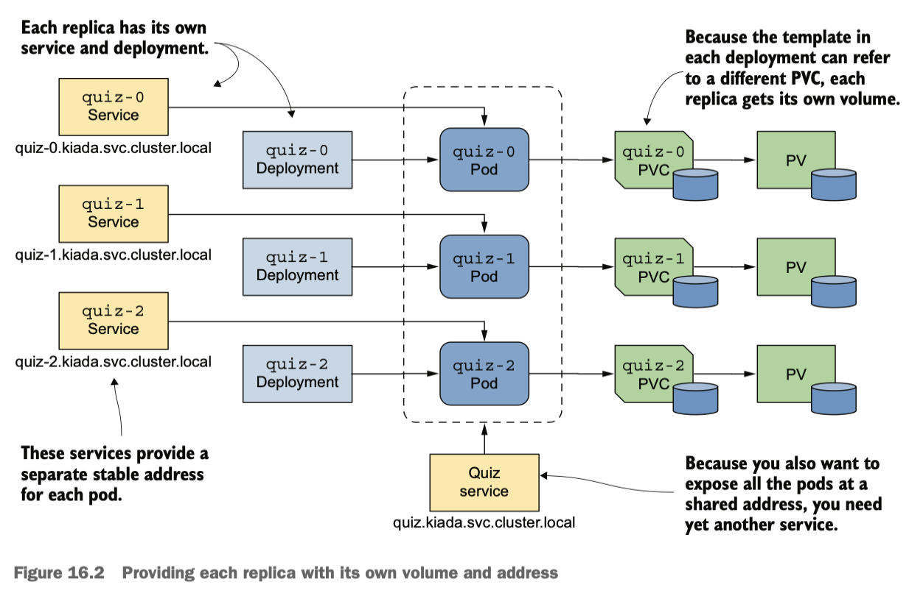
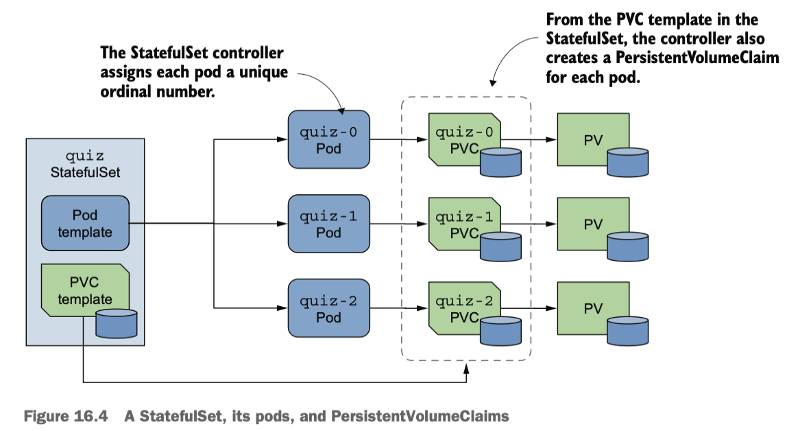
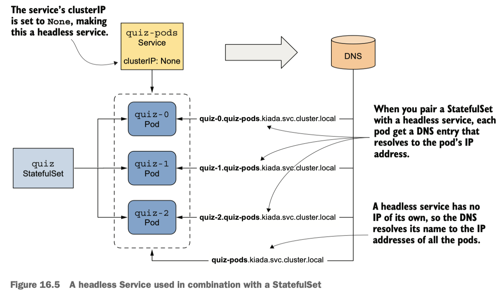
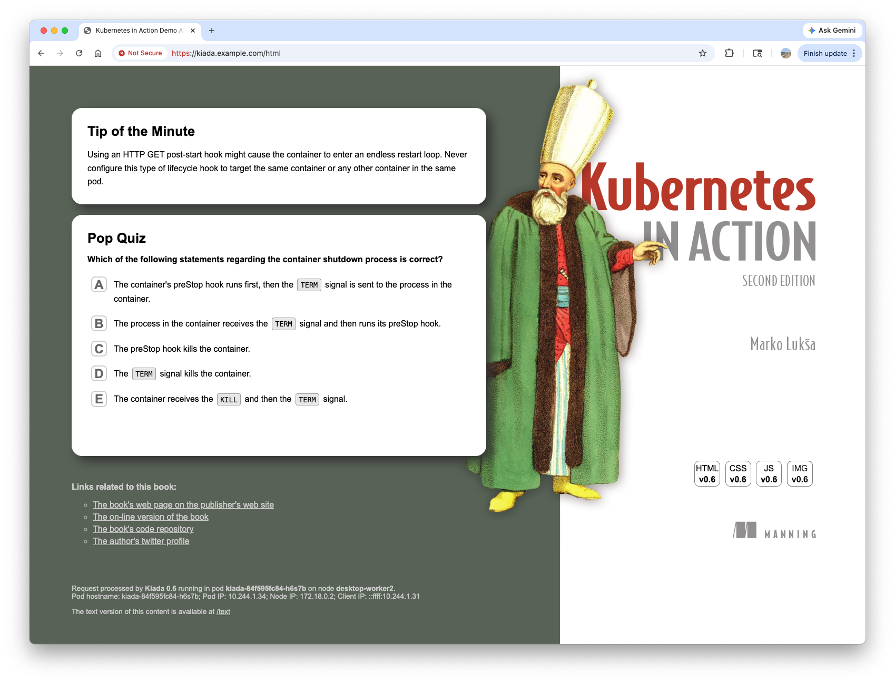
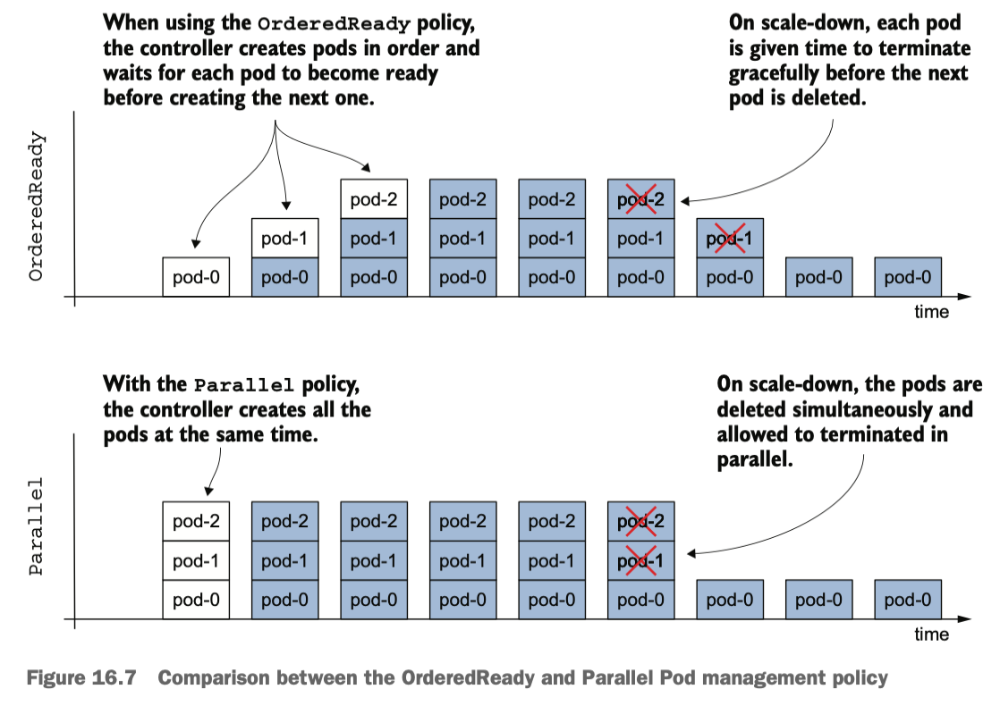
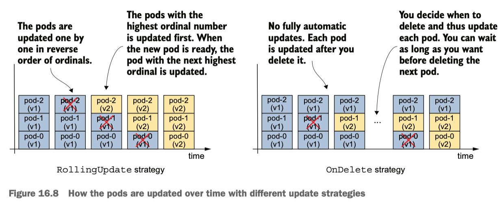
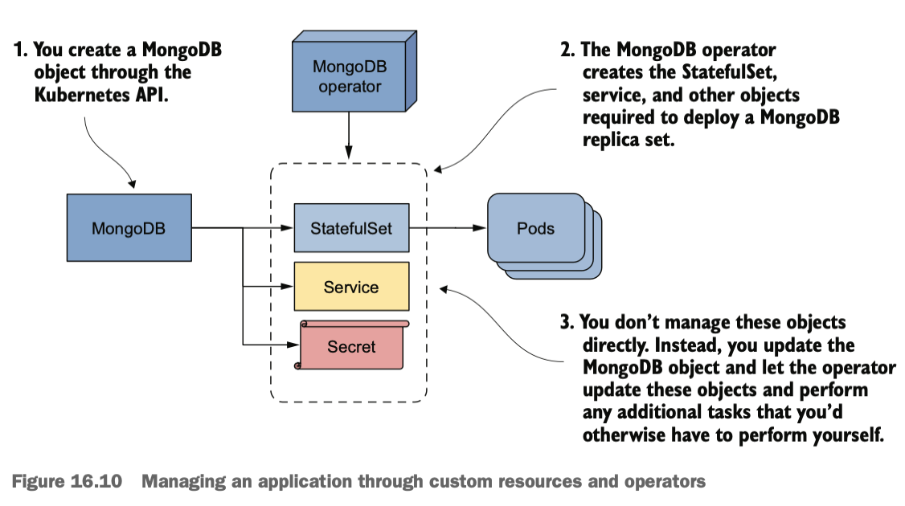

# Handling stateful applications with StatefulSets

For the exercises, create `kiada` namespace and apply all manifests in the `Chapter16/SETUP/` directory with the following command:
``` bash
kubectl create namespace kiada
kubectl apply -n kiada -f SETUP -R
```

Update the Ingress object:
``` bash
kubectl patch ingress kiada --type='json' -p='[{"op": "replace", "path": "/spec/ingressClassName", "value":"nginx"}]'
```

## 1. Introducing StatefulSets

A stateful workload is a piece of software that must store and maintain state to function. This state must be maintained when the workload is restarted or relocated, which makes stateful workloads much more difficult to operate. If each replica stores its state in its own files, you'll need to allocate a separate volume for each replica.

In most cloud environments, pods on different nodes can't read and write to the same PersistentVolume.

### Lab 1 - PersistentVolume not shared by pods on different nodes

Let's demonstrate this problem using the Quiz service. 
Scale the `quiz` deployment to three replicas:
``` bash
kubectl scale deploy quiz --replicas 3
deployment.apps/quiz scaled
```

check the pods:
``` bash hl_lines="4-5"
kubectl get pods -l app=quiz
NAME                   READY   STATUS             RESTARTS      AGE
quiz-5f6ffdc55-25wcc   2/2     Running            0             30m
quiz-5f6ffdc55-cfb44   0/2     CrashLoopBackOff   1 (17s ago)   19s
quiz-5f6ffdc55-hnctl   0/2     CrashLoopBackOff   1 (17s ago)   19s
```

Only the pod existed before the scale-up is running, because the PersistentVolume can't be attached to the new pods as its access mode is `ReadWriteOnce` and the volume can't be attached to multiple nodes at once. In kind clusters, the mongo container fails with the following message:
``` bash
kubectl logs quiz-5f6ffdc55-cfb44 -c mongo | grep error
{"t":{"$date":"2026-04-18T19:48:59.990+00:00"},"s":"E",  "c":"CONTROL",  "id":20557,   "ctx":"initandlisten","msg":"DBException in initAndListen, terminating","attr":{"error":"DBPathInUse: Unable to lock the lock file: /data/db/mongod.lock (Resource temporarily unavailable). Another mongod instance is already running on the /data/db directory"}}
```

The error message indicates that you can't use the same data directory in multiple instances of MongoDB. The three `quiz` Pods use the same directory because they all use the same PersistentVolumeClaim and therefore the same PersistentVolume.



MongoDB only supports a single instance by default. To deploy a MongoDB replica set in Kubernetes:

- Each pod has its own PersistentVolume
- Each pod is addressable by its own unique address
- When a pod is deleted and replaced, the new pod is assigned the same address and PersistentVolume

You can do it by **creating a separate Deployment, Service, and PersistentVolumeClaim for each replica**.



There are two problems with the above architecture:

- If you need to increase the number of replicas, you can't use the kubectl scale command; you have to create additional Deployments, Services, and PersistentVolumeClaims, which adds to the complexity.
- It's complex and difficult to operate this system.

Fortunately, Kubernetes provides a better way to do this with a single Service and a single StatefulSet object.

!!! note

    You don't need the quiz Deployment and the quiz-data PersistentVolumeClaim anymore, so please delete them using `kubectl delete deploy/quiz pvc/quiz-data`.

### StatefulSet vs Deployment

A StatefulSet is similar to a Deployment, but is specifically tailored to stateful workloads. As with Deployments, in a StatefulSet you specify **a Pod template**, **the desired number of replicas**, and **a label selector**. However, you can also specify **a PersistentVolumeClaim template**. Each time the StatefulSet controller creates a new replica, it **creates not only a new Pod object, but also one or more PersistentVolumeClaim objects**.

In StatefulSet, a pod is paired with PersistentVolumeClaims by the same unique ordinal number.



The pods of a StatefulSet are created one at a time, similar to a rolling update of a Deployment. 

### Creating a StatefulSet

Let's replace the `quiz` Deployment with a StatefulSet. First, note that **headless** Service is used for workloads deployed by a StatefulSet. When using a headless Service with a StatefulSet, an additional DNS record is created for each pod so that the IP address of each pod can be looked up by its name. This is how stateful pods maintain their stable network identity.



Create the headless service for `quiz` StatefulSet with the following command:

``` bash hl_lines="8 9 12-14" title="svc.quiz-pods.yaml"
apiVersion: v1
kind: Service
metadata:
  name: quiz-pods
  labels:
    app: quiz
spec:
  clusterIP: None # (1)!
  publishNotReadyAddresses: true # (2)!
  selector:
    app: quiz
  ports: # (3)!
  - name: mongodb
    port: 27017
```

1.  :information_source: the Service becomes headless.
2.  :information_source: a DNS record is created for each pod, whether the pod is ready or not.
3.  :information_source: It provides SRV entries for the pods. The MongoDB client uses them to connect to each individual MongoDB server.

``` bash
kubectl apply -f svc.quiz-pods.yaml
# service/quiz-pods created
```

Let's review the StatefulSet manifest:

``` bash hl_lines="7 8 19-22 30-31 33-42" title="sts.quiz.yaml"
apiVersion: apps/v1
kind: StatefulSet
metadata:
  name: quiz
  ...
spec:
  serviceName: quiz-pods # (1)!
  podManagementPolicy: Parallel # (2)!
  replicas: 3
  selector:
    matchLabels:
      app: quiz
  template:
    metadata:
      labels:
        app: quiz
        ver: "0.1"
    spec:
      volumes: # (3)!
      - name: db-data
        persistentVolumeClaim:
          claimName: db-data
      containers:
      - name: quiz-api
        ...
      - name: mongo
        image: mongo:7
        ...
        volumeMounts: 
        - name: db-data 
          mountPath: /data/db # (4)!
  volumeClaimTemplates:
  - metadata: # (5)!
      name: db-data
      labels:
        app: quiz
    spec:
      resources:
        requests:
          storage: 1Gi
      accessModes:
      - ReadWriteOnce
```

1.  :information_source: The name of the headless Service that governs this StatefulSet.
2.  :information_source: Tells the StatefulSet controller to create all pods at the same time.
3.  :information_source: A single volume is defined in the pod. The volume refers to a PersistentVolumeClaim with the specified name.
4.  :information_source: The PersistentVolumeClaim volume is mounted here.
5.  :information_source: The template used to create the PersistentVolumeClaims

Important fields in the StatefulSet `spec`:

- `replicas`
- `selector`
- `template`
- `serviceName`: specify the name of the headless Service that governs this StatefulSet
- `podManagementPolicy`: With `Parallel`, the StatefulSet controller creates all pods simultaneously. The default behavior is to create one pod at a time.
- `volumeClaimTemplates`: the templates for the PersistentVolumeClaims for each replica. The name must be specified and must match the name in the `volumes` section of the Pod template. 

Create the StatefulSet:
``` bash
kubectl apply -f sts.quiz.yaml
# statefulset.apps/quiz created
```

### Inspecting the StatefulSet, Pods, and PVC

Monitor the rollout status:
``` bash
kubectl rollout status sts quiz
# Waiting for 3 pods to be ready...
```

The rollout does not continue. Check the StatefulSet status:
``` bash
kubectl get sts
NAME   READY   AGE
quiz   0/3     3m17s
```

List the pods:
``` bash
kubectl get pods -l app=quiz
NAME     READY   STATUS    RESTARTS   AGE
quiz-0   1/2     Running   0          3m53s
quiz-1   1/2     Running   0          3m53s
quiz-2   1/2     Running   0          3m53s
```

!!! note

    Notice the pod names? They don't include a template hash or random characters. Instead, each pod name consists of the StatefulSet name followed by an ordinal index.

!!! tip

    You can specify a custom starting value for the ordinal index by setting the `spec.ordinals.start` field in the StatefulSet manifest.

The output of the `kubectl describe` command indicates the `quiz-api` container is not ready due to the readiness check failure. If you check the `quiz-api` container logs, you'll see why:

``` bash
kubectl logs quiz-0 -c quiz-api
...
2026/04/18 21:54:46 INTERNAL ERROR: connected to mongo, but couldn't execute the ping command: server selection error: server selection timeout, current topology: { Type: Unknown, Servers: [{ Addr: 127.0.0.1:27017, Type: RSGhost, Average RTT: 17948544 }, ] }
```

The above error message says the connection to MongoDB has been established but the server doesn't allow the ping command to be executed. The reason is that the server was started with the `--replSet` option configuring it to use replication, but the MongoDB replica set hasn't been initiated yet. To do this, run the following command:

``` bash
kubectl exec -it quiz-0 -c mongo -- mongosh --quiet --eval 'rs.initiate({
_id: "quiz",
members: [
{_id: 0, host: "quiz-0.quiz-pods.kiada.svc.cluster.local:27017"},
{_id: 1, host: "quiz-1.quiz-pods.kiada.svc.cluster.local:27017"},
{_id: 2, host: "quiz-2.quiz-pods.kiada.svc.cluster.local:27017"}]})'
# { ok: 1 }
```

!!! note

    Instead of typing this long command, you can also run the `initiate-mongo-replicaset.sh` shell script.


All three `quiz` Pods should be ready shortly after the replica set is initiated. Verify with the following command:
``` bash
kubectl rollout status sts quiz
# partitioned roll out complete: 3 new pods have been updated...
```

Examine the `quiz` StatefulSet:
``` bash hl_lines="14-20"
kubectl describe sts quiz
Name:               quiz
Namespace:          kiada
CreationTimestamp:  Sat, 18 Apr 2026 17:45:54 -0400
Selector:           app=quiz
Labels:             app=quiz
Annotations:        <none>
Replicas:           3 desired | 3 total
Update Strategy:    RollingUpdate
  Partition:        0
Pods Status:        3 Running / 0 Waiting / 0 Succeeded / 0 Failed
Pod Template:
...
Volume Claims:
  Name:          db-data
  StorageClass:  
  Labels:        app=quiz
  Annotations:   <none>
  Capacity:      1Gi
  Access Modes:  [ReadWriteOnce]
Events:
  Type    Reason            Age   From                    Message
  ----    ------            ----  ----                    -------
  Normal  SuccessfulCreate  17m   statefulset-controller  create Claim db-data-quiz-0 Pod quiz-0 in StatefulSet quiz success
  Normal  SuccessfulCreate  17m   statefulset-controller  create Pod quiz-0 in StatefulSet quiz successful
  Normal  SuccessfulCreate  17m   statefulset-controller  create Claim db-data-quiz-1 Pod quiz-1 in StatefulSet quiz success
  Normal  SuccessfulCreate  17m   statefulset-controller  create Claim db-data-quiz-2 Pod quiz-2 in StatefulSet quiz success
  Normal  SuccessfulCreate  17m   statefulset-controller  create Pod quiz-1 in StatefulSet quiz successful
  Normal  SuccessfulCreate  17m   statefulset-controller  create Pod quiz-2 in StatefulSet quiz successful
```

The most noticeable difference in StatefulSet compared to ReplicaSet and Deployment is the presence of the PersistentVolumeClaim template.

Let's inspect the Pod manifest:
``` bash hl_lines="6-10 13-18 20-21 23-25"
kubectl get pod quiz-0 -o yaml
apiVersion: v1
kind: Pod
metadata:
  labels:
    app: quiz
    apps.kubernetes.io/pod-index: "0"
    controller-revision-hash: quiz-c5cd4d99f
    statefulset.kubernetes.io/pod-name: quiz-0
    ver: "0.1"
  name: quiz-0
  namespace: kiada
  ownerReferences:
  - apiVersion: apps/v1
    blockOwnerDeletion: true
    controller: true
    kind: StatefulSet
    name: quiz
spec:
  containers:
  ...
  volumes:
  - name: db-data
    persistentVolumeClaim:
      claimName: db-data-quiz-0
  ...
status:
...
```

Four parts to focus on:

- `labels`: The only label defined in the pod template in the StatefulSet manifest was `app` and `ver`, but the StatefulSet controller added two additional labels:
  - `controller-revision-hash` allows the controller to identify which revision of the StatefulSet a particular pod belongs to.
  - `statefulset.kubernetes.io/pod-name` specifies the pod name and allows you to create a Service for a specific Pod instance by using this label.
- `ownerReferences` indicates this Pod object is managed by the StatefulSet. StatefulSets own the pods directly.
- `containers` match the containers defined in the StatefulSet's Pod template.
- `volumes`: In the template you specified the `claimName` as `db-data` but here in the pod it's been changed to `db-data-quiz-0`. This is because each Pod instance gets its own PersistentVolumeClaim. 

The StatefulSet controller creates a PersistentVolumeClaim for each pod:
``` bash
kubectl get pvc -l app=quiz
NAME             STATUS   VOLUME                                     CAPACITY   ACCESS MODES   STORAGECLASS   VOLUMEATTRIBUTESCLASS   AGE
db-data-quiz-0   Bound    pvc-fe1c80e6-d195-470a-90ef-22eb859a7112   1Gi        RWO            standard       <unset>                 57m
db-data-quiz-1   Bound    pvc-f75b6351-1ea2-426d-b607-33eddba0f868   1Gi        RWO            standard       <unset>                 57m
db-data-quiz-2   Bound    pvc-8ff2f341-e3a7-4c34-931e-861c9f9ed853   1Gi        RWO            standard       <unset>                 57m
```

Each claim is bound to a PersistentVolume that's been dynamically provisioned.

### Understanding the role of the headless Service

A client connecting to a MongoDB replica set must know the addresses of all the replicas, so it can find the primary replica when it needs to write data. For the three `quiz` Pods, the following connection URI can be used:

``` text
mongodb://quiz-0.quiz-pods.kiada.svc.cluster.local:27017,quiz-1.quiz-pods.kiada.svc.cluster.local:27017,quiz-2.quiz-pods.kiada.svc.cluster.local:27017
```

The problem with the above URI is you have to manually update the URI whenever an additional pod is added. This is brittle and annoying. The solution is to use **SRV (Service) Records**. An **SRV record** is a type of DNS record that specifies the **hostname** and **port number** for a specific service(mongodb in this case). 

``` yaml hl_lines="3" title="spec.ports in svc.quiz-pods.yaml"
spec:
  ports:
  - name: mongodb
    port: 27017
```

Since we name the port `mongo` in the `quiz-pods` headless Service, Kubernetes(CoreDNS) creates a DNS record starting with `_mongodb`. Therefore, the SRV record for `mongodb` would be:

``` text
_mongodb._tcp.quiz-pods.kiada.svc.cluster.local
```

If you execute the `nslookup _mongodb._tcp.quiz-pods.kiada.svc.cluster.local` command inside a pod in the current cluster, the expected output would be:

``` text
Server:    10.96.0.10
Address:   10.96.0.10#53

_mongodb._tcp.quiz-pods.kiada.svc.cluster.local  service = 0 33 27017 quiz-0.quiz-pods.kiada.svc.cluster.local.
_mongodb._tcp.quiz-pods.kiada.svc.cluster.local  service = 0 33 27017 quiz-1.quiz-pods.kiada.svc.cluster.local.
_mongodb._tcp.quiz-pods.kiada.svc.cluster.local  service = 0 33 27017 quiz-2.quiz-pods.kiada.svc.cluster.local.
```

As you can see above, the SRV look up is resolved to the hostnames and port number for every pods managed by the `quiz` StatefulSet. From the MongoDB client's perspective, this is very useful because it doesn't need to keep watching a new replica and add its endpoint in the connection URI. The list of endpoints for each replicas can be acquired by performing the simple SRV look up. In the end, you will **use the followng connection string to import the quiz data into MongoDB**.

``` text
mongodb+srv://quiz-pods.kiada.svc.cluster.local
```

Review the Pod manifest `pod.quiz-data-importer.yaml`:

``` yaml hl_lines="6 16" title="pod.quiz-data-importer.yaml"
apiVersion: v1
kind: Pod
metadata:
  name: quiz-data-importer
spec:
  restartPolicy: OnFailure # (1)!
  volumes:
  - name: quiz-questions
    configMap:
      name: quiz-questions
  containers:
  - name: mongoimport
    image: mongo:7
    command:
    - mongoimport
    - mongodb+srv://quiz-pods.kiada.svc.cluster.local/kiada?tls=false # (2)!
    - --collection
    - questions
    - --file
    - /questions.json
    - --drop
    volumeMounts:
    - name: quiz-questions
      mountPath: /questions.json
      subPath: questions.json
      readOnly: true
---
apiVersion: v1
kind: ConfigMap
metadata:
  name: quiz-questions
  labels:
    app: quiz
data:
  questions.json: ...
```

1.  :information_source: This pod's container needs to run to completion only once.
2.  :information_source: The client uses the SRV lookup to find the MongoDB replicas' endpoints.

When the pod's container starts, it runs the `mongoimport` command, which connects to the primary MongoDB replica and imports the data from the `quiz-questions` volume. The data is then replicated to the secondary replicas. Deploy the pod using the `kubectl apply` command and verify the success:

``` bash
kubectl get pod quiz-data-importer
NAME                 READY   STATUS      RESTARTS   AGE
quiz-data-importer   0/1     Completed   0          10s
```

The `STATUS` marked with `Completed` indicates that the container exited without errors. You should now be able to access the Kiada UI and see that the Quiz service returns the imported questions.



Now answer a few quiz questions and use the following command to check if your answers are stored in MongoDB:
``` bash
kubectl exec quiz-0 -c mongo -- mongosh kiada --quiet --eval 'db.responses.find()'
[
  {
    _id: ObjectId('69e43b43196dea5a66ef9921'),
    timestamp: ISODate('2026-04-19T02:17:39.570Z'),
    questionId: 5,
    answerIndex: 1,
    correctanswerindex: 0,
    correct: false
  },
  {
    _id: ObjectId('69e43b8b3971d45c61f3d6d0'),
    timestamp: ISODate('2026-04-19T02:18:51.897Z'),
    questionId: 6,
    answerIndex: 1,
    correctanswerindex: 1,
    correct: true
  }
]
```

## 2. Understanding StatefulSet behavior

### Replacing missing pods

If a StatefulSet Pod is deleted and replaced by the controller with a new instance, the replica retains the same identity and is associated with the same PersistentVolumeClaim. Try deleting the `quiz-1` Pod:
``` bash
kubectl delete po quiz-1
pod "quiz-1" deleted from kiada namespace
```

The regenerated pod has the same name:
``` bash hl_lines="4"
kubectl get po -l app=quiz
NAME     READY   STATUS    RESTARTS        AGE
quiz-0   2/2     Running   1 (4h15m ago)   4h44m
quiz-1   2/2     Running   0               15s
quiz-2   2/2     Running   1 (3h26m ago)   4h44m
```

### Lab - Handling node failures

When you run a group of pods via a **ReplicaSet** and **one of the nodes stops reporting to the Kubernetes control plane**, the ReplicaSet controller determines that the node and the pods are gone and **creates replacement pods on the remaining nodes, even though the pods on the original node may still be running**. How would the StatefulSet controller react to the node failure scenario? 

Find the node running the `quiz-1` pod:
``` bash hl_lines="4"
kubectl get po -l app=quiz -o wide
NAME     READY   STATUS    RESTARTS        AGE   IP            NODE              NOMINATED NODE   READINESS GATES
quiz-0   2/2     Running   1 (4h31m ago)   5h    10.244.2.31   desktop-worker    <none>           <none>
quiz-1   2/2     Running   0               16m   10.244.1.41   desktop-worker2   <none>           <none>
quiz-2   2/2     Running   1 (3h41m ago)   5h    10.244.2.30   desktop-worker    <none>           <none>
```

Turn off the node's network interface as follows:
``` bash
docker exec desktop-worker2 ip link set eth0 down
```

The Kubelet running on the `desktop-worker2` node can no longer contact the Kubernetes API server:
``` bash hl_lines="5"
kubectl get nodes
NAME                    STATUS     ROLES           AGE     VERSION
desktop-control-plane   Ready      control-plane   2d23h   v1.34.3
desktop-worker          Ready      <none>          2d23h   v1.34.3
desktop-worker2         NotReady   <none>          2d23h   v1.34.3
```

As a result, the status of the `quiz-1` Pod changes to `Terminating`:
``` bash hl_lines="4"
kubectl get pods -l app=quiz
NAME     READY   STATUS        RESTARTS        AGE
quiz-0   2/2     Running       1 (4h47m ago)   5h17m
quiz-1   2/2     Terminating   0               32m
quiz-2   2/2     Running       1 (3h58m ago)   5h17m
```

``` bash hl_lines="8"
kubectl describe po quiz-1
Events:
  Type     Reason        Age                From               Message
  ----     ------        ----               ----               -------
  ...
  Warning  Unhealthy     36m (x2 over 36m)  kubelet            spec.containers{quiz-api}: Readiness probe failed: Get "http://10.244.1.41:8080/healthz/ready": context deadline exceeded (Client.Timeout exceeded while awaiting headers)
  Warning  NodeNotReady  18m                node-controller    Node is not ready
```

At this point, the node isn't down, it **only lost network connectivity**. In this situation, **the StatefulSet controller does not delete and recreate the pod**. If it did, there would then be two instances of the same workload running with the same identity. **If you want the pod to be recreated elsewhere, manual intervention is required**. 

``` bash
kubectl delete pod quiz-1 --force --grace-period 0
Warning: Immediate deletion does not wait for confirmation that the running resource has been terminated. The resource may continue to run on the cluster indefinitely.
pod "quiz-1" force deleted from kiada namespace
```

After you delete the pod, it's replaced by the StatefulSet controller, but the pod may not start. If the PersistentVolume is a local volume on the failed node, the pod can't be scheduled and its `STATUS` remains `Pending`, as shown here:
``` bash
kubectl get pod quiz-1 -o wide
NAME     READY   STATUS    RESTARTS   AGE     IP       NODE     NOMINATED NODE   READINESS GATES
quiz-1   0/2     Pending   0          2m27s   <none>   <none>   <none>           <none>
```

The pod's events show why the pod can't be scheduled:
``` bash
kubectl describe pod quiz-1
...
Events:
  Type     Reason            Age    From               Message
  ----     ------            ----   ----               -------
  Warning  FailedScheduling  3m16s  default-scheduler  0/3 nodes are available: 
  1 node(s) didn't match PersistentVolume's node affinity, # (1)!
  2 node(s) had untolerated taint(s). # (2)!
  no new claims to deallocate, preemption: 0/3 nodes are available: 3 Preemption is not helpful for scheduling.
```

1.  :information_source: The PersistentVolume can't be attached there.
2.  :information_source: One node(`desktop-worker2`) is unreachable. The other node is the control plane node, which accepts only Kubernetes system workloads.

To rebuild the pod, we can delete the PersistentVolumeClaim so that a new one can be created and bound to a new PersistentVolume. Delete both the pod and PersistentVolumeClaim as follows:
``` bash
kubectl delete pvc/db-data-quiz-1 pod/quiz-1
persistentvolumeclaim "db-data-quiz-1" deleted from kiada namespace
pod "quiz-1" deleted from kiada namespace
```

Verify the `quiz-1` pod is up:
``` bash hl_lines="4"
kubectl get po -l app=quiz -o wide
NAME     READY   STATUS    RESTARTS        AGE     IP            NODE             NOMINATED NODE   READINESS GATES
quiz-0   2/2     Running   1 (5h17m ago)   5h46m   10.244.2.31   desktop-worker   <none>           <none>
quiz-1   2/2     Running   0               3m4s    10.244.2.39   desktop-worker   <none>           <none>
quiz-2   2/2     Running   1 (4h27m ago)   5h46m   10.244.2.30   desktop-worker   <none>           <none>
```

Restore the node by following commands:

``` bash
# detach the node
docker network disconnect kind desktop-worker2

# reattach the node
docker network connect kind desktop-worker2

# restart the kubelet
docker exec desktop-worker2 systemctl restart kubelet
```

Verify the status of the `desktop-worker2` node is READY:
``` bash hl_lines="5"
kubectl get nodes
NAME                    STATUS   ROLES           AGE     VERSION
desktop-control-plane   Ready    control-plane   2d23h   v1.34.3
desktop-worker          Ready    <none>          2d23h   v1.34.3
desktop-worker2         Ready    <none>          2d23h   v1.34.3
```

### Lab - Scaling a StatefulSet

When you scale up a StatefulSet, the controller **creates both a new pod and a new PersistentVolumeClaim**. But what happens when you scale it down?

Use the `kubectl scale` command to scale a StatefulSet:
``` bash
kubectl scale sts quiz --replicas 1
statefulset.apps/quiz scaled
```

As expected, only one pod is left after the process of termination:
``` bash
kubectl get pods -l app=quiz
NAME     READY   STATUS    RESTARTS        AGE
quiz-0   2/2     Running   1 (5h28m ago)   5h57m
```

when you scale down a StatefulSet, the pod with the highest ordinal number is deleted first. But their PersistentVolumeClaims are preserved:
``` bash
kubectl get pvc -l app=quiz
NAME             STATUS   VOLUME                                     CAPACITY   ACCESS MODES   STORAGECLASS   VOLUMEATTRIBUTESCLASS   AGE
db-data-quiz-0   Bound    pvc-fe1c80e6-d195-470a-90ef-22eb859a7112   1Gi        RWO            standard       <unset>                 6h
db-data-quiz-1   Bound    pvc-89b9c019-0a28-4718-8c1c-d39e4e1767a0   1Gi        RWO            standard       <unset>                 16m
db-data-quiz-2   Bound    pvc-8ff2f341-e3a7-4c34-931e-861c9f9ed853   1Gi        RWO            standard       <unset>                 6h
```

Retaining PersistentVolumeClaims is the default behavior, but you can configure the StatefulSet to delete them via the `persistentVolumeClaimRetentionPolicy` field. The other option is to delete the claims manually.

Since PersistentVolumeClaims are preserved when you scale down a StatefulSet, they can be reattached when you scale back up. 


``` bash
kubectl scale sts quiz --replicas 3
statefulset.apps/quiz scaled
```

Let's scale the StatefulSet to five replicas:
``` bash
kubectl scale sts quiz --replicas 5
```

The controller creates two additional pods and PersistentVolumeClaims, but the pods aren't ready:
``` bash
kubectl get pods quiz-3 quiz-4
NAME     READY   STATUS    RESTARTS   AGE
quiz-3   1/2     Running   0          44s
quiz-4   1/2     Running   0          44s
```

Both new pods are not ready. There's nothing wrong with these replicas except that they haven't been added to the MongoDB
replica set. You could add them by adding new entries to `initiate-mongo-replicaset.sh` and executing it.

``` bash title="initiate-mongo-replicaset2.sh"
#!/usr/bin/env bash

kubectl exec -it quiz-0 -c mongo -- mongosh --eval 'rs.reconfig({
  _id: "quiz",
  members: [
    {_id: 0, host: "quiz-0.quiz-pods.kiada.svc.cluster.local:27017"},
    {_id: 1, host: "quiz-1.quiz-pods.kiada.svc.cluster.local:27017"},
    {_id: 2, host: "quiz-2.quiz-pods.kiada.svc.cluster.local:27017"},
    {_id: 3, host: "quiz-3.quiz-pods.kiada.svc.cluster.local:27017"},
    {_id: 4, host: "quiz-4.quiz-pods.kiada.svc.cluster.local:27017"}]}, {force: true})'
```
``` bash
chmod +x ./initiate-mongo-replicaset2.sh
./initiate-mongo-replicaset2.sh
{
  ok: 1,
  '$clusterTime': {
    clusterTime: Timestamp({ t: 1776572194, i: 1 }),
    signature: {
      hash: Binary.createFromBase64('AAAAAAAAAAAAAAAAAAAAAAAAAAA=', 0),
      keyId: Long('0')
    }
  },
  operationTime: Timestamp({ t: 1776572194, i: 1 })
}
```

Verify:
``` bash
kubectl get pods quiz-3 quiz-4
NAME     READY   STATUS    RESTARTS   AGE
quiz-3   2/2     Running   0          18m
quiz-4   2/2     Running   0          18m
```

### Lab - Changing the PersistentVolumeClaim retention policy

By default, StatefulSets preserve the PersistentVolumeClaims when you scale them down. However, if the workload managed by the StatefulSet never requires data to be preserved, you can configure the StatefulSet to auto-delete the PersistentVolumeClaim by setting the `persistentVolumeClaimRetentionPolicy` field:

``` bash hl_lines="8-10" title="sts.quiz.pvcRetentionPolicy.yaml"
apiVersion: apps/v1
kind: StatefulSet
metadata:
  name: quiz
  labels:
    app: quiz
spec:
  persistentVolumeClaimRetentionPolicy:
    whenScaled: Delete
    whenDeleted: Retain
```

Apply this manifest file:
``` bash
kubectl apply -f sts.quiz.pvcRetentionPolicy.yaml
statefulset.apps/quiz configured
```

Scale the StatefulSet to three replicas:
``` bash
kubectl scale sts quiz --replicas 3
statefulset.apps/quiz scaled
```

List the PVCs to confirm there are only three left:
``` bash
kubectl get pvc
NAME             STATUS   VOLUME                                     CAPACITY   ACCESS MODES   STORAGECLASS   VOLUMEATTRIBUTESCLASS   AGE
db-data-quiz-0   Bound    pvc-fe1c80e6-d195-470a-90ef-22eb859a7112   1Gi        RWO            standard       <unset>                 6h42m
db-data-quiz-1   Bound    pvc-89b9c019-0a28-4718-8c1c-d39e4e1767a0   1Gi        RWO            standard       <unset>                 58m
db-data-quiz-2   Bound    pvc-8ff2f341-e3a7-4c34-931e-861c9f9ed853   1Gi        RWO            standard       <unset>                 6h42m
```

Now let's see if the `whenDeleted` policy is followed:
``` bash
kubectl delete sts quiz
statefulset.apps "quiz" deleted from kiada namespace
```

List the PersistentVolumeClaims to confirm that all three are present. The MongoDB data files are therefore preserved.
``` bash
kubectl get pvc
NAME             STATUS   VOLUME                                     CAPACITY   ACCESS MODES   STORAGECLASS   VOLUMEATTRIBUTESCLASS   AGE
db-data-quiz-0   Bound    pvc-fe1c80e6-d195-470a-90ef-22eb859a7112   1Gi        RWO            standard       <unset>                 6h43m
db-data-quiz-1   Bound    pvc-89b9c019-0a28-4718-8c1c-d39e4e1767a0   1Gi        RWO            standard       <unset>                 59m
db-data-quiz-2   Bound    pvc-8ff2f341-e3a7-4c34-931e-861c9f9ed853   1Gi        RWO            standard       <unset>                 6h43m
```

### Theory - Using the OrderedReady Pod management policy

- `podManagementPolicy: OrderedReady`: create pods one at a time(Default).
- `podManagementPolicy: Parallel`: create all pods simultaneously. 



## 3. Updating a StatefulSet

Two `updateStrategy` for StatefulSet:

- `RollingUpdate`: the pods are replaced one by one. The pod with the highest ordinal number is deleted first.
- `OnDelete`: The StatefulSet controller waits for each pod to be manually deleted. you can replace pods in any order and at any rate.



## 4. Managing stateful app with Kubernetes Operators

Managing stateful applications is difficult. StatefulSets do a good job of automating some basic tasks, but much of the work still has to be done manually. A **Kubernetes operator** is an application-specific controller that automates the deployment and management of an application running on Kubernetes.




