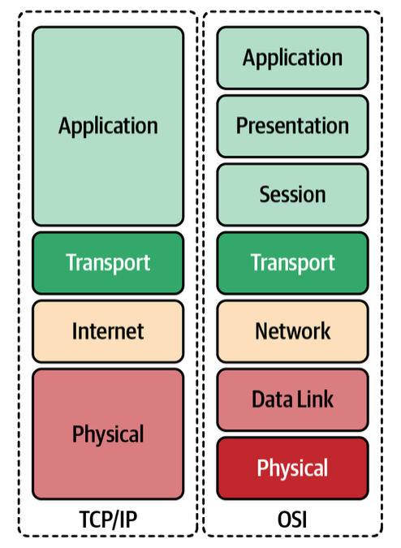
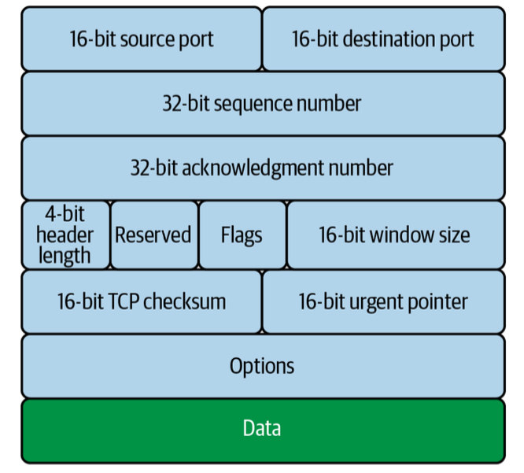
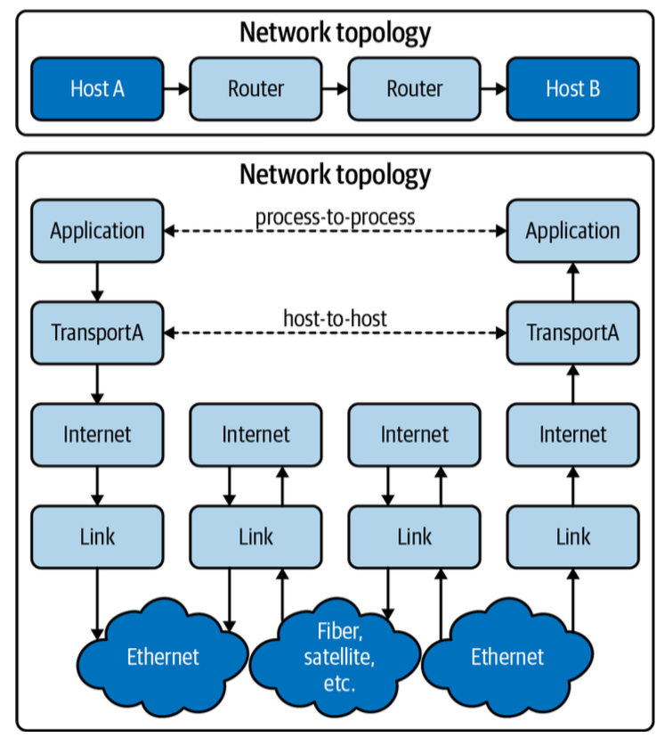
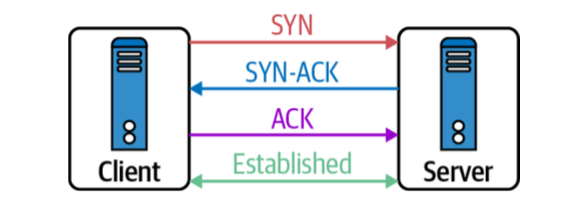
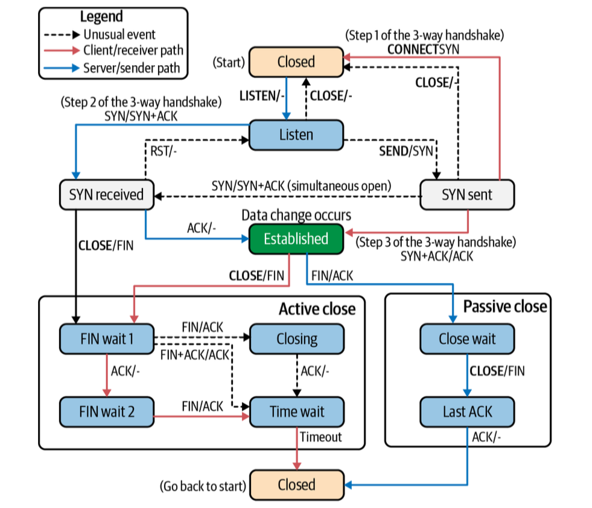
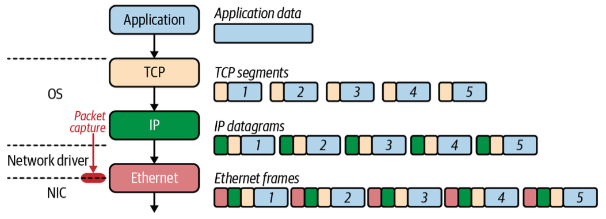
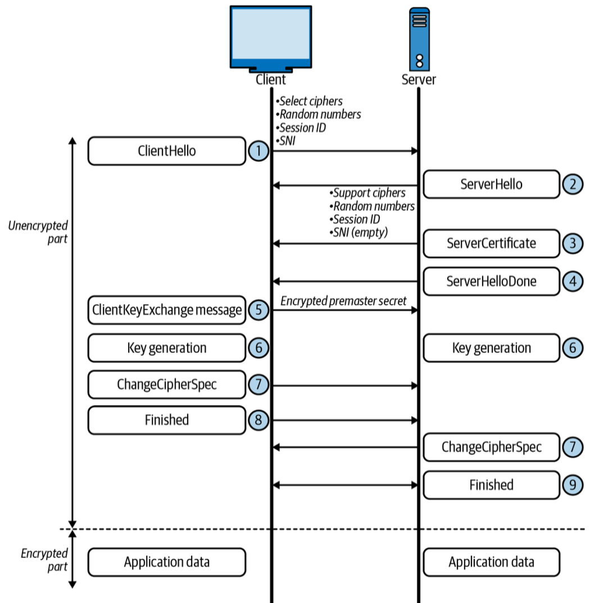
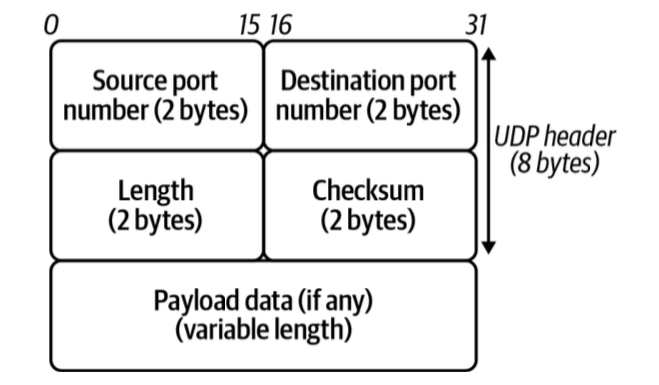
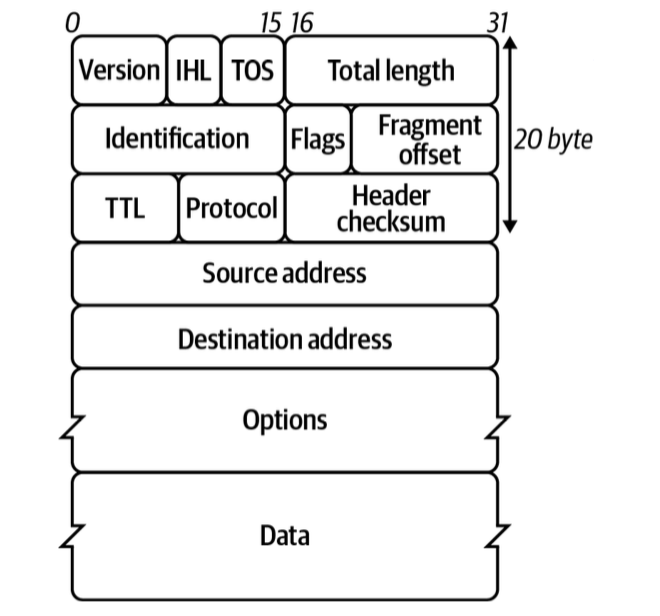

# 1. Networking Introduction

!!! info "Source Attribution"

    The primary source and original content for this page originate from [the **Networking & Kubernetes - A Layered Approach** by James Strong and Vallery Lancey](https://www.oreilly.com/library/view/networking-and-kubernetes/9781492081647/). Please refer to [the Networking and Kubernetes Code Examples repo](https://github.com/strongjz/Networking-and-Kubernetes) to follow code examples.

## Networking History

The purpose of a network is to exchange information from one system to another system.

A brief history of networking is following:

1. In **1969**, the Department of Defense sponsored the **Advanced Research Projects Agency Network (ARPANET)** was deployed at the UCLA, the Augementation Research Center at Stanford Research Institute, the UC Santa Barbara, and the University of Utah School of Computing.
1. In **1970**, communication between these nodes began using the **Network Control Protocol(NCP)**. NCP led to the development and use of the first computer-to-computer protocols like **Telnet** and **File Transfer Protocol(FTP)**.
1. In **1974**, [Vint Cerf](https://en.wikipedia.org/wiki/Vint_Cerf), [Yogen Dalal](https://en.wikipedia.org/wiki/List_of_Internet_pioneers#Yogen_Dalal), and [Carl Sunshine](https://en.wikipedia.org/wiki/List_of_Internet_pioneers#Carl_Sunshine) began drafting RFC 675 for **Transmission Control Protocol (TCP)**. TCP allowed for exchanging packets across different types of networks.
1. In **1981**, the **Internet Protocol (IP)**, defined in RFC 791, helped break out the responsibilities of TCP into a separate protocol, increasing the modularity of the network.
1. In **1983**, TCP/IP had become the only approved protocol on ARPANET, replacing the earlier NCP.
1. In **1991**, [Al Gore](https://en.wikipedia.org/wiki/Al_Gore) helped pass the National Information Infrastructure(NII) bill, inventing the internet. The Internet Engineering Task Force (IETF) was created accordingly. Nowadays standards for the internet are under the
management of the IETF. RFCs are published by the Internet Society and the IETF.

---
## OSI Model



| Layer number | Layer name | Protocol data unit | Function overview |
| :--- | :--- | :--- | :--- |
| 7 | Application | Data | provides the interface for applications like HTTP, DNS, and SSH. |
| 6 | Presentation | Data | character encoding, data compression, and encryption/decryption. |
| 5 | Session | Data | manages the connections between the local and remote applications. |
| 4 | Transport | Segment, datagram | provides **reliable data transfer services** to the upper layers through flow control, segmentation, and error control by TCP or UDP. |
| 3 | Network | Packet | transfer data flows from a host on **one network** to a host on **another network**. |
| 2 | Data Link | Frame | responsible for the host-to-host transfers on the same network. |
| 1 | Physical | Bit | sending and receiving of bitstreams over the medium. |

---
## TCP/IP

| Layer number | Layer name | Protocol data unit | Function overview |
| :--- | :--- | :--- | :--- |
| 5-7 | Application | Data | standardizes **process-to-process communication** by protocols like HTTPS |
| 4 | Transport | Segment, datagram | provides **reliable data transfer services** to the upper layers through flow control, segmentation, and error control by TCP or UDP. |
| 3 | Internet | Packet | responsible for transmitting data **between networks**. |
| 2 | Link | Frame | host-to-host transfers on the same network. Hosts are **identified by MAC addresses** on their network interface cards, and **determinted by** the host using **Address Resolution Protocol 9 (ARP)**. |
| 1 | Physical | Bit | details hardware standards such as IEEE 802.3. |

### Application

??? Warning "For the Apple Silicon mac users"

    [The official instruction to start up the Vagrant host](https://github.com/strongjz/Networking-and-Kubernetes/tree/master/chapter-1) is designed for the `x86` architecture. For the Apple Silicon mac users, please follow the below steps:

    1. Install `vagrant`, `qemu` and `vagrant-qemu` vagrant plugin:

        ``` bash
        # install vagrant
        brew tap hashicorp/tap
        brew install hashicorp/tap/hashicorp-vagrant

        # install qemu
        brew install qemu

        # install vagrant plugin
        vagrant plugin install vagrant-qemu
        ```

    2. Create your directory and initialize a known-good ARM64 box:

        ``` bash
        mkdir my-project && cd my-project
        vagrant init bento/ubuntu-22.04
        ```

    3. Open your `Vagrantfile` and replace the content with the following:

        ``` ruby
        Vagrant.configure("2") do |config|
          config.vm.box = "bento/ubuntu-22.04"

          # Use rsync to avoid the "SMB NT-compatible password" error
          config.vm.synced_folder ".", "/vagrant", type: "rsync"

          config.vm.provider "qemu" do |qe|
            qe.arch = "aarch64"
            qe.machine = "virt,accel=hvf" # Uses Apple's Hypervisor.framework for speed
            qe.cpu = "host"
            qe.net_device = "virtio-net-pci"
          end
        end
        ```

    4. Enter the VM:

        ``` bash
        vagrant up --provider qemu
        ```

#### HTTP

On the server side, start the web server:

``` go
cd chapter-1
go run web-server.go
```

On the client side, start the vm and make the following cURL request. 

``` bash
curl -vvv localhost:8080 # (1)!

* Host localhost:8080 was resolved.
* IPv6: ::1
* IPv4: 127.0.0.1
*   Trying [::1]:8080...
* Connected to localhost (::1) port 8080 # (2)!
> GET / HTTP/1.1 # (3)!
> Host: localhost:8080 # (4)!
> User-Agent: curl/8.7.1 # (5)!
> Accept: */* # (6)!
>
* Request completely sent off
< HTTP/1.1 200 OK # (7)!
< Date: Tue, 05 May 2026 12:30:44 GMT
< Content-Length: 5 # (8)!
< Content-Type: text/plain; charset=utf-8 # (9)!
<
* Connection #0 to host localhost left intact
Hello% # (10)!
```

1.  :information_source: opens a connection to the `localhost` on TCP port `8080`. `-vvv` is to print out everythign happening with the request. `TCP_NODELAY` instructs the TCP connection to send the data without delay.
2.  :information_source: cURL connected to the web server on `localhost` and over port `8080`.
3.  :information_source: performing an HTTP GET to the `/` Uniform Resource Locator (URL) using the HTTP 1.1 version.
4.  :information_source: the cURL process has set the HTTP Host header.
5.  :information_source: indicates the cURL program making the HTTP request on behalf of the end user.
6.  :information_source: instructs the web server what content types the client understands.
7.  :information_source: This is the server response to our request. 1XX means informational, 2XX means successful, 3XX means redirects, 4XX responses indicate there are issues with the requests, and 5XX generally refers to issues from the server.
8.  :information_source: the size of the message body, in bytes, sent to the recipient.
9.  :information_source: indicate the resource's media type.
10.  :information_source: the response from our web server


### Transport

The Transport layer protocols are responsible for connection-oriented communication, reliability, flow control, and multiplexing. Our Golang web server is a layer 7 application using HTTP; the Transport layer that HTTP relies on is TCP. 

#### TCP

Each port identifies the host process responsible for processing the information from the network communication. Clients requesting a new connection create a source port local in the range of 0-65534.

The following HTML page retrieval process represents what **multiplexing** means:

1. In a web browser, type in a web page address.
1. The browser opens a connection to transfer the page.
1. The browser opens connections for each image on the page.
1. The browser opens another connection for the external CSS.
1. Each of these connections uses a different set of virtual ports.
1. All the page's assets download simultaneously.
1. The browser reconstructs the page.

TCP manages multiplexing with the information provided in the TCP segment headers:




- `Sequence number` (32 bits)
    - Data consists of a continuous stream of bytes. The sequence number identifies the **position of the first data byte** in that specific segment within the overall stream. Because IP packets can take different paths and arrive out of order, the receiver uses sequence numbers to reorder segments correctly before passing the data to the application layer. If the `SYN` flag is set, this is the initial sequence number.
- `Acknowledgment number` (32 bits)
    - It indicates **the sequence number of the next byte the receiver expects to receive**. If the `Acknowledgment Number` is $X$, it implies that every byte up to $X-1$ has been successfully received. This field is only valid if the `ACK` control flag is set to 1. In almost all segments sent after the initial `SYN` packet of the 3-way handshake, this flag is always set.

    !!! Question "How sequence and acknowledgment number work together?"

        - **Sender** send a segement with `Seq = 100, Length = 50`.
        - **Receiver** receives it and sends back a segment with `Ack = 150` (100 + 50), signaling: "I got everything up to 149. Please send byte 150 next."

- `Reserved` (3 bits) - This is for future use and should be set to zero.
- `Flags` (9 bits) - There are nine 1-bit fields:
    - `NS (Nonce Sum)`: used for concealment protection. In 2017, RFC 8311 officially moved the ECN-nonce (and the NS bit) to Historic status, meaning it is no longer recommended for use in modern TCP implementations.
    - `CWR (Congestion Window Reduced)`: When a sender receives a TCP segment with the ECE (ECN-Echo) flag set, it knows that a router in the network path experienced congestion. In response, the sender reduces its Congestion Window (the amount of data it sends before waiting for an ACK) to help clear the bottleneck. After the sender has reduced its window size, it sets the CWR flag in the next packet it sends to the receiver. The CWR flag tells the receiver: "I have received your congestion warning and have slowed down." Upon receiving the CWR flag, the receiver stops setting the ECE flag in its subsequent acknowledgments.
    - `ECE (ECN Echo)`: used for **Explicit Congestion Notification (ECN)**. A router along the path becomes congested. Instead of dropping a packet, it marks the IP header of a packet with a "Congestion Experienced" (CE) bit. The receiver sees the mark in the IP header. It then sets the `ECE` flag in its next TCP Acknowledgment (ACK) to "echo" this warning back to the sender. The sender receives the `ECE` flag, realizes there is a bottleneck, and reduces its transmission rate (its Congestion Window). The receiver will continue setting the `ECE` flag in every ACK until it receives a `CWR` (Congestion Window Reduced) flag from the sender.

        !!! Info

            - `ECE`: "I received a packet that was marked by a router as **Congested**. Please slow down!"
            - `CWR`: "I got your ECE message and have reduced my speed."

    - `URG (Urgent)`: the Urgent Pointer field is valid, but this is rarely used.
    - `ACK (Acknowledgment)`: the Acknowledgment Number field is valid and is always on after a connection is established.
    - `PSH (Push)`: Normally, TCP is designed to be efficient by "batching" data. It collects small amounts of data into a larger buffer until it has enough to form a full-sized segment before sending it. Similarly, on the receiving end, TCP may wait until it has a significant amount of data before notifying the application. When the `PSH` flag is set:
        - **On the Sender side**: It tells the sending TCP implementation to send all data currently in its buffer immediately, without waiting for more.
        - **On the Receiver side**: It tells the receiving TCP implementation to pass the data to the application immediately rather than waiting for more segments to arrive or for the receiving buffer to reach a certain threshold.
    - `RST (Reset)`: Reset the connection or connection abort, usually because of an error.
    - `SYN (Synchronize)`: used during the initiation of a TCP connection to synchronize the **Sequence Numbers** between the sender and the receiver. The client sends a packet with the SYN flag set and its own Initial Sequence Number (e.g., `Seq=1000`).
    - `FIN (Finish)`: used to gracefully terminate a TCP connection, signaling that the sender has no
  more data to transmit.

    !!! Note "The Graceful Termination (4-Way Handshake)"

        Closing a connection usually involves four steps to ensure both sides have finished their work
        
        1. **FIN**: Side A sends a segment with the `FIN` flag set. It says, "I'm done sending data."
        1. **ACK**: Side B acknowledges the request. Side A is now in `FIN_WAIT` state, but Side B can still send data if it needs to.
        1. **FIN**: Once Side B is also finished, it sends its own `FIN` flag.
        1. **ACK**: Side A acknowledges Side B's FIN. The connection is now fully `CLOSED`.

- `Window size` (16 bits) - The total amount of data (potentially many segments) that can be "in-flight" at once without an acknowledgement. used to tell the sender: "I have $X$ bytes of space left in my buffer. You can send this much data before you must stop and wait for me to acknowledge it."
- `Ur
        



#### TCP handshake

TCP uses a three-way han







#### tcpdump



#### TLS



#### UDP



### Network




### Internet Protocol

### Link Layer

### Revisiting Our Web Server

---
## Conclusion
