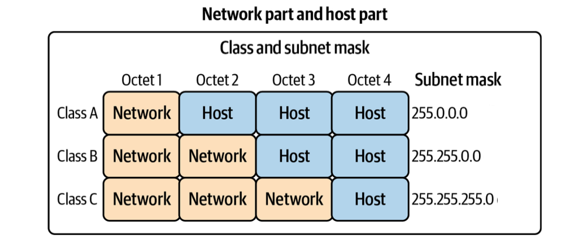
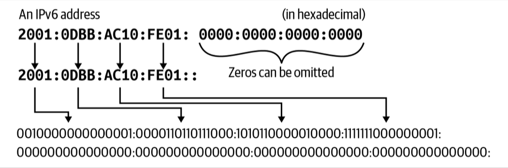
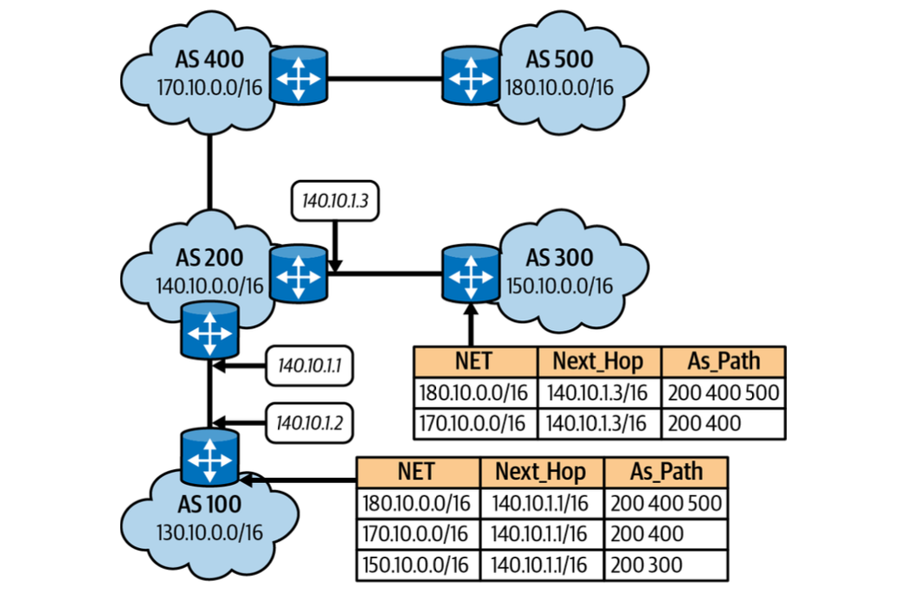
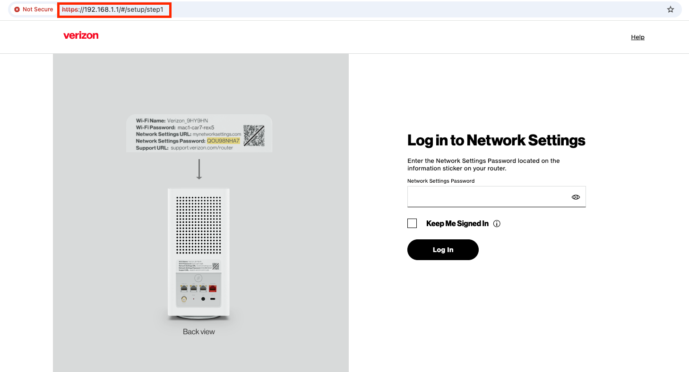
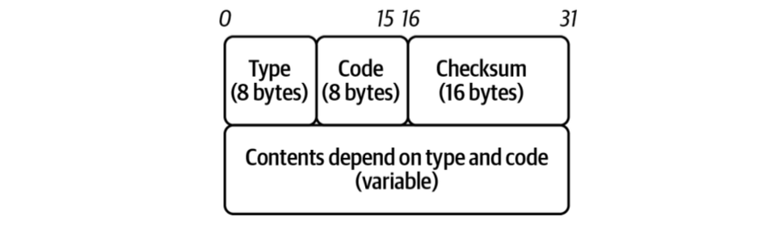
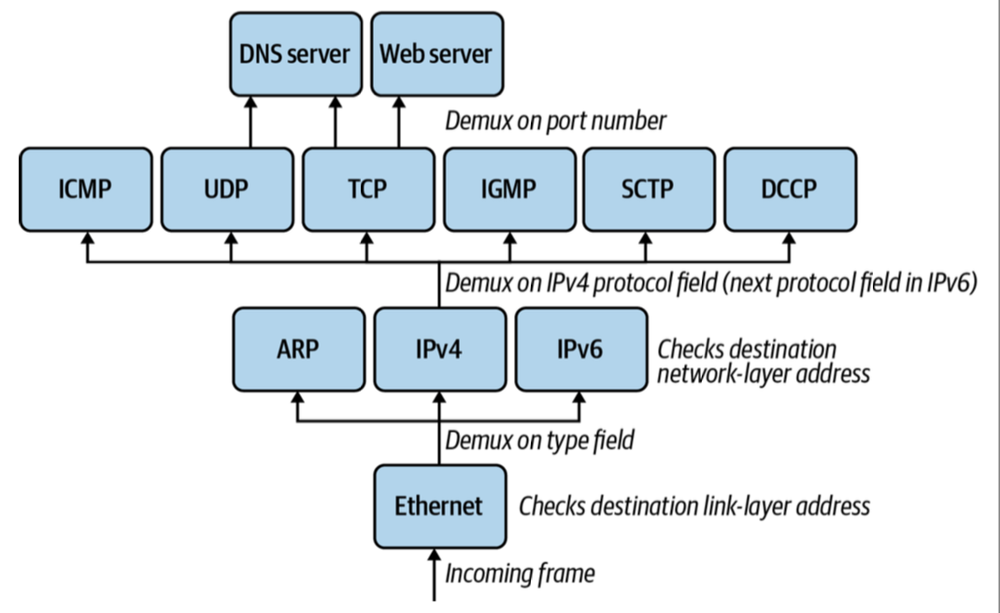
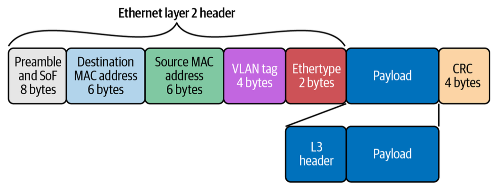
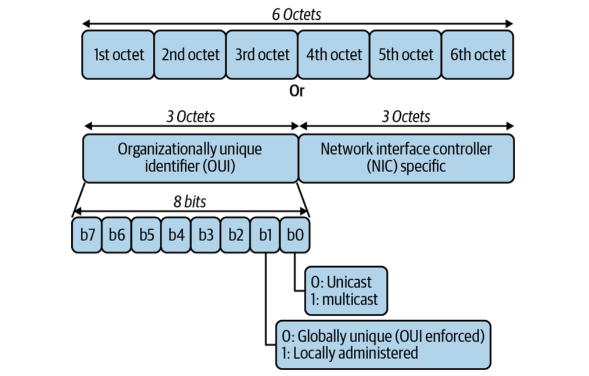
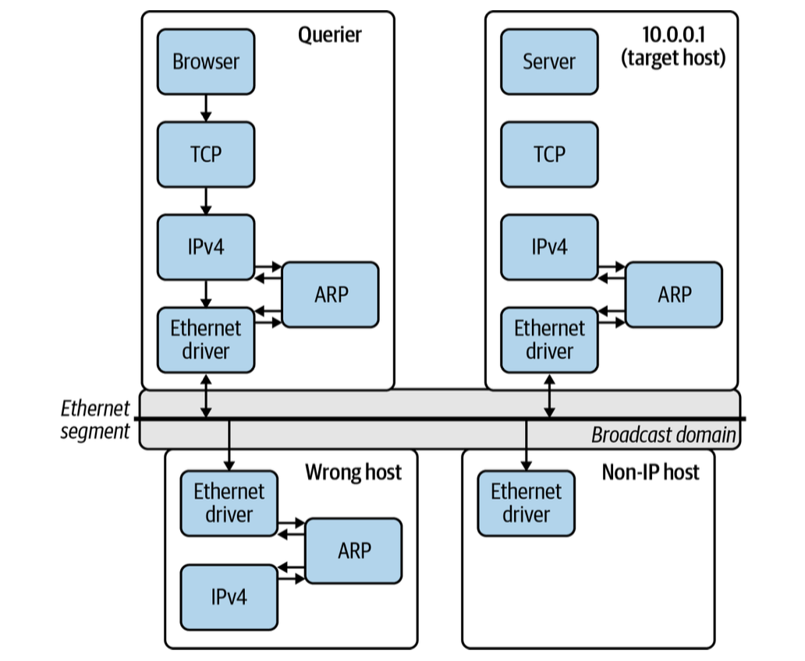
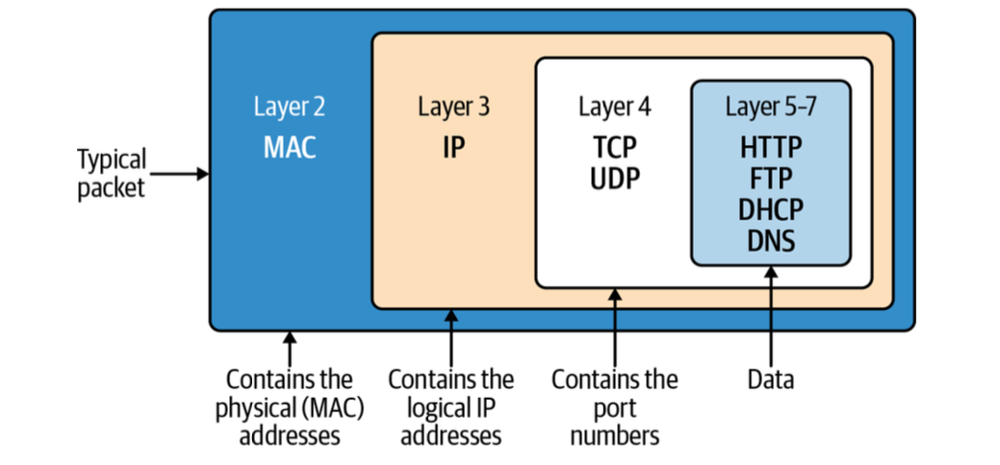

# 1. Networking Introduction

!!! info "Source Attribution"

    The primary source and original content for this page originate from [the **Networking & Kubernetes - A Layered Approach** by James Strong and Vallery Lancey](https://www.oreilly.com/library/view/networking-and-kubernetes/9781492081647/). Please refer to [the Networking and Kubernetes Code Examples repo](https://github.com/strongjz/Networking-and-Kubernetes) to follow code examples.

## Networking History

The purpose of a network is to exchange information from one system to another system.

A brief history of networking is following:

1. In **1969**, the Department of Defense sponsored the **Advanced Research Projects Agency Network (ARPANET)** was deployed at the UCLA, the Augementation Research Center at Stanford Research Institute, the UC Santa Barbara, and the University of Utah School of Computing.
1. In **1970**, communication between these nodes began using the **Network Control Protocol(NCP)**. NCP led to the development and use of the first computer-to-computer protocols like **Telnet** and **File Transfer Protocol(FTP)**.
1. In **1974**, [Vint Cerf](https://en.wikipedia.org/wiki/Vint_Cerf), [Yogen Dalal](https://en.wikipedia.org/wiki/List_of_Internet_pioneers#Yogen_Dalal), and [Carl Sunshine](https://en.wikipedia.org/wiki/List_of_Internet_pioneers#Carl_Sunshine) began drafting RFC 675 for **Transmission Control Protocol (TCP)**. TCP allowed for exchanging packets across different types of networks.
1. In **1981**, the **Internet Protocol (IP)**, defined in RFC 791, helped break out the responsibilities of TCP into a separate protocol, increasing the modularity of the network.
1. In **1983**, TCP/IP had become the only approved protocol on ARPANET, replacing the earlier NCP.
1. In **1991**, [Al Gore](https://en.wikipedia.org/wiki/Al_Gore) helped pass the National Information Infrastructure(NII) bill, inventing the internet. The Internet Engineering Task Force (IETF) was created accordingly. Nowadays standards for the internet are under the
management of the IETF. RFCs are published by the Internet Society and the IETF.

---
## OSI Model


| Layer number | Layer name | Protocol data unit | Function overview |
| :--- | :--- | :--- | :--- |
| 7 | Application | Data | provides the interface for applications like HTTP, DNS, and SSH. |
| 6 | Presentation | Data | character encoding, data compression, and encryption/decryption. |
| 5 | Session | Data | manages the connections between the local and remote applications. |
| 4 | Transport | Segment, datagram | provides **reliable data transfer services** to the upper layers through flow control, segmentation, and error control by TCP or UDP. |
| 3 | Network | Packet | transfer data flows from a host on **one network** to a host on **another network**. |
| 2 | Data Link | Frame | responsible for the host-to-host transfers on the same network. |
| 1 | Physical | Bit | sending and receiving of bitstreams over the medium. |

---
## TCP/IP

| Layer number | Layer name | Protocol data unit | Function overview |
| :--- | :--- | :--- | :--- |
| 5-7 | Application | Data | standardizes **process-to-process communication** by protocols like HTTPS |
| 4 | Transport | Segment, datagram | provides **reliable data transfer services** to the upper layers through flow control, segmentation, and error control by TCP or UDP. |
| 3 | Internet | Packet | responsible for transmitting data **between networks**. |
| 2 | Link | Frame | host-to-host transfers on the same network. Hosts are **identified by MAC addresses** on their network interface cards, and **determinted by** the host using **Address Resolution Protocol 9 (ARP)**. |
| 1 | Physical | Bit | details hardware standards such as IEEE 802.3. |

### Application

??? Warning "For the Apple Silicon mac users"

    [The official instruction to start up the Vagrant host](https://github.com/strongjz/Networking-and-Kubernetes/tree/master/chapter-1) is designed for the `x86` architecture. For the Apple Silicon mac users, please follow the below steps:

    1. Install `vagrant`, `qemu` and `vagrant-qemu` vagrant plugin:

        ``` bash
        # install vagrant
        brew tap hashicorp/tap
        brew install hashicorp/tap/hashicorp-vagrant

        # install qemu
        brew install qemu

        # install vagrant plugin
        vagrant plugin install vagrant-qemu
        ```

    2. Create your directory and initialize a known-good ARM64 box:

        ``` bash
        mkdir my-project && cd my-project
        vagrant init bento/ubuntu-22.04
        ```

    3. Open your `Vagrantfile` and replace the content with the following:

        ``` ruby
        Vagrant.configure("2") do |config|
          config.vm.box = "bento/ubuntu-22.04"

          # Use rsync to avoid the "SMB NT-compatible password" error
          config.vm.synced_folder ".", "/vagrant", type: "rsync"

          config.vm.provider "qemu" do |qe|
            qe.arch = "aarch64"
            qe.machine = "virt,accel=hvf" # Uses Apple's Hypervisor.framework for speed
            qe.cpu = "host"
            qe.net_device = "virtio-net-pci"
          end
        end
        ```

    4. Enter the VM:

        ``` bash
        vagrant up --provider qemu
        ```

#### HTTP

On the server side, start the web server:

``` go
cd chapter-1
go run web-server.go
```

On the client side, start the vm and make the following cURL request. 

``` bash
curl -vvv localhost:8080 # (1)!

* Host localhost:8080 was resolved.
* IPv6: ::1
* IPv4: 127.0.0.1
*   Trying [::1]:8080...
* Connected to localhost (::1) port 8080 # (2)!
> GET / HTTP/1.1 # (3)!
> Host: localhost:8080 # (4)!
> User-Agent: curl/8.7.1 # (5)!
> Accept: */* # (6)!
>
* Request completely sent off
< HTTP/1.1 200 OK # (7)!
< Date: Tue, 05 May 2026 12:30:44 GMT
< Content-Length: 5 # (8)!
< Content-Type: text/plain; charset=utf-8 # (9)!
<
* Connection #0 to host localhost left intact
Hello% # (10)!
```

1.  :information_source: opens a connection to the `localhost` on TCP port `8080`. `-vvv` is to print out everythign happening with the request. `TCP_NODELAY` instructs the TCP connection to send the data without delay.
2.  :information_source: cURL connected to the web server on `localhost` and over port `8080`.
3.  :information_source: performing an HTTP GET to the `/` Uniform Resource Locator (URL) using the HTTP 1.1 version.
4.  :information_source: the cURL process has set the HTTP Host header.
5.  :information_source: indicates the cURL program making the HTTP request on behalf of the end user.
6.  :information_source: instructs the web server what content types the client understands.
7.  :information_source: This is the server response to our request. 1XX means informational, 2XX means successful, 3XX means redirects, 4XX responses indicate there are issues with the requests, and 5XX generally refers to issues from the server.
8.  :information_source: the size of the message body, in bytes, sent to the recipient.
9.  :information_source: indicate the resource's media type.
10.  :information_source: the response from our web server


### Transport

The Transport layer protocols are responsible for connection-oriented communication, reliability, flow control, and `multiplexing` (1). Our Golang web server is a layer 7 application using HTTP; the Transport layer that HTTP relies on is TCP. 
{ .annotate }

1.  The following HTML page retrieval process represents what **multiplexing** means:

    1. In a web browser, type in a web page address.
    1. The browser opens a connection to transfer the page.
    1. The browser opens connections for each image on the page.
    1. The browser opens another connection for the external CSS.
    1. Each of these connections uses a different set of virtual ports.
    1. All the page's assets download simultaneously.
    1. The browser reconstructs the page.

#### TCP

Each port identifies the host process responsible for processing the information from the network communication. Clients requesting a new connection create a source port local in the range of `0-65,534` (1). 
{ .annotate }

1.  Key port ranges and types:

    - `0 ~ 1,023` (well-known ports): reserved for system services and authorized protocols(e.g. HTTP:80, HTTPS:443)
    - `1,024 ~ 49,151` (registered ports): used by vendors for specific applications(e.g. MySQL: 3306, PostgreSQL: 5432)
    - `49,152 ~ 65,535` (dynamic/private ports): used for ephemeral, temporary connections.


**Core Fields of the TCP Header**

The header is organized into 32-bit (4-byte) rows. Here is the breakdown of each component:

1. **Port Address (row 1)**
    - **`Source Port` (16 bits)**
    - **`Destination Port` (16 bits)**
2. **Ordering and Reliability (row 2 & 3)**
    - **`Sequence number` (32 bits)**
        - Data consists of a continuous stream of bytes. {==The sequence number identifies the **position of the first data byte** in that specific segment within the overall stream==}. Because IP packets can take different paths and arrive out of order, the receiver uses sequence numbers to reorder segments correctly before passing the data to the application layer. If the `SYN` flag is set, this is the initial sequence number.
    - **`Acknowledgment number` (32 bits)**
        - It indicates {==the sequence number of the next byte the receiver expects to receive==}. If the `Acknowledgment Number` is $X$, it implies that every byte up to $X-1$ has been successfully received. {==This field is only valid if the `ACK` control flag is set to 1==}. In almost all segments sent after the initial `SYN` packet of the 3-way handshake, this flag is always set.

        !!! Question "How sequence and acknowledgment number work together?"

            - **Sender** send a segement with `Seq = 100, Length = 50`.
            - **Receiver** receives it and sends back a segment with `Ack = 150` (100 + 50), signaling: "I got everything up to 149. Please send byte 150 next."

3. **Control and Management (row 4)**
    - **`Data Offset` (4 bits)** - specifies the size of the TCP header in 32-bit words. {==This tells the receiver where the actual data starts==}.
    - **`Reserved` (3 bits)** - set to zero. reserved for future use.
    - **`Flags` (9 bits)** - nine 1-bit fields that manages the state of the connection:
        - `NS (Nonce Sum)`: used for concealment protection. No longer recommended for use in modern TCP implementations.
        - `CWR (Congestion Window Reduced)`: When a sender receives a TCP segment with the `ECE` flag set, it knows that a router in the network path experienced congestion. In response, the sender reduces its Congestion Window (the amount of data it sends before waiting for an `ACK`) to help clear the bottleneck. After the sender has reduced its window size, it sets the `CWR` flag in the next packet it sends to the receiver. {==The `CWR` flag tells the receiver: "I have received your congestion warning and have slowed down."==} Upon receiving the `CWR` flag, the receiver stops setting the `ECE` flag in its subsequent acknowledgments.
        - `ECE (ECN Echo)`: used for **Explicit Congestion Notification (ECN)**. A router along the path becomes congested. Instead of dropping a packet, it marks the IP header of a packet with a "Congestion Experienced" (CE) bit. The receiver sees the mark in the IP header. {==It then sets the `ECE` flag in its next TCP Acknowledgment (ACK) to echo this warning back to the sender. The sender receives the `ECE` flag, realizes there is a bottleneck, and reduces its transmission rate (its Congestion Window)==}. The receiver will continue setting the `ECE` flag in every `ACK` until it receives a `CWR` (Congestion Window Reduced) flag from the sender.

            !!! Info

                - `ECE`: "I received a packet that was marked by a router as **Congested**. Please slow down!"
                - `CWR`: "I got your ECE message and have reduced my speed."

        - `URG (Urgent)`: the Urgent Pointer field is valid, but this is rarely used.
        - `ACK (Acknowledgment)`: the Acknowledgment Number field is valid and is always on after a connection is established.
        - `PSH (Push)`: Normally, TCP is designed to be efficient by batching data. It collects small amounts of data into a larger buffer until it has enough to form a full-sized segment before sending it. Similarly, on the receiving end, TCP may wait until it has a significant amount of data before notifying the application. When the `PSH` flag is set:
            - **On the Sender side**: It tells the sending TCP implementation to {==send all data currently in its buffer immediately, without waiting for more==}.
            - **On the Receiver side**: It tells the receiving TCP implementation to {==pass the data to the application immediately rather than waiting for more segments to arrive==} or for the receiving buffer to reach a certain threshold.
        - `RST (Reset)`: Reset the connection or connection abort, usually because of an error.
        - `SYN (Synchronize)`: {==used during the initiation of a TCP connection to synchronize the **Sequence Numbers** between the sender and the receiver==}. The client sends a packet with the `SYN` flag set and its own Initial Sequence Number (e.g., `Seq=1000`).
        - `FIN (Finish)`: used to gracefully terminate a TCP connection, signaling that the sender has no
    more data to transmit.

        !!! Note "The Graceful Termination (4-Way Handshake)"

            Closing a connection usually involves four steps to ensure both sides have finished their work
            
            1. **FIN**: Side A sends a segment with the `FIN` flag set. It says, "I'm done sending data."
            1. **ACK**: Side B acknowledges the request. Side A is now in `FIN_WAIT` state, but Side B can still send data if it needs to.
            1. **FIN**: Once Side B is also finished, it sends its own `FIN` flag.
            1. **ACK**: Side A acknowledges Side B's FIN. The connection is now fully `CLOSED`.

    - **`Window size` (16 bits)** - The total amount of data (potentially many segments) that can be "in-flight" at once without an acknowledgement. used to tell the sender: "I have $X$ bytes of space left in my buffer. You can send this much data before you must stop and wait for me to acknowledge it."

4. **Integrity and Urgency (row 5)**
    - **`Checksum` (16 bits)** - Used for error-checking the header, the payload, and a "pseudo-header" of IP addresses to ensure the segment arrived intact.
    - **`Urgent pointer` (16 bits)** - Only valid if the `URG` flag is set. It is an offset from the sequence number that indicates where the "urgent" data ends. It was originally designed to allow users to send interrupt signals (like `Ctrl+C`), but due to inconsistent implementations between operating systems, it is largely ignored in modern networking.
5. **Flexibility (row 6+)**
    - **`Options` (0~40 bytes)** - optional fields used for advanced features like Maximum Segment Size (MSS), Window Scaling, or Selective Acknowledgments (SACK).
    - **`Padding`** - used to ensure the TCP header ends on a 32-bit boundary.

        
The below diagram shows how each step of the TCP/IP stack sends data from one application on one host, through a network communicating at layers 1 and 2, to get data to the destination host.


#### TCP handshake


TCP uses a three-way handshake to create a connection:

1. The requesting node sends a connection request via a `SYN` packet.
1. The receiving node replies with a `SYN-ACK`, acknowledging that it has heard the requesting node.
1. The requesting node returns an `ACK` packet, letting them know the nodes are good to send each other information.


The TCP connection states are:

- `LISTEN` (server): waiting for a connection request
- `SYN-SENT` (client): waiting for a matching connection request after sending a connection request
- `SYN_RECEIVED` (server): waiting for a confirming connection request acknowledgment after having both received and sent a connection request
- `ESTABLISHED` (both): represents an open connection
- `FIN-WAIT-1` (both): waiting for a connection termination request from the remote host
- `FIN-WAIT-2` (both): waiting for a connection termination request from the remote TCP
- `CLOSE-WAIT` (both): waiting for a local user's connection termination request
- `CLOSING` (both): waiting for a connection termination request acknowledgment from the remote TCP
- `LAST-ACK` (both): waiting for an acknowledgment of the connection termination request previously sent to the remote host
- `TIME-WAIT` (both): waiting for enough time to pass to ensure the remote host received the acknowledgment of its connection termination request
- `CLOSED` (both): no connection state at all

`netstat -ap TCP` prints out the TCP connection states:
``` bash
netstat -ap TCP
Active Internet connections (including servers)
Proto Recv-Q Send-Q  Local Address          Foreign Address        (state)
tcp4       0      0  macbookpro.lan.56647   ec2-52-204-16-18.https ESTABLISHED
tcp4       0      0  macbookpro.lan.56643   207.164.110.34.b.https ESTABLISHED
tcp4       0      0  localhost.49419        localhost.56613        ESTABLISHED
tcp4       0      0  localhost.56613        localhost.49419        ESTABLISHED
tcp4       0      0  macbookpro.lan.56592   208.103.161.2.https    ESTABLISHED
tcp4      24      0  macbookpro.lan.56584   170.114.52.83.https    CLOSE_WAIT
tcp4      24      0  macbookpro.lan.56583   170.114.52.5.https     CLOSE_WAIT
tcp4      24      0  macbookpro.lan.56582   170.114.52.5.https     CLOSE_WAIT
tcp4      24      0  macbookpro.lan.56581   170.114.52.5.https     CLOSE_WAIT
tcp4      24      0  macbookpro.lan.55839   170.114.52.5.https     CLOSE_WAIT
tcp4       0      0  macbookpro.lan.54748   208.103.161.1.https    ESTABLISHED
tcp4       0      0  macbookpro.lan.54691   ec2-54-83-207-16.https ESTABLISHED
tcp4       0      0  macbookpro.lan.54168   104.20.41.79.https     ESTABLISHED
tcp4       0      0  macbookpro.lan.52428   134.224.4.77.https     ESTABLISHED
tcp4       0      0  macbookpro.lan.52421   134.224.4.141.https    ESTABLISHED
tcp6       0      0  *.52418                *.*                    LISTEN
tcp4       0      0  *.52418                *.*                    LISTEN
tcp4       0      0  macbookpro.lan.52415   208.103.161.1.https    ESTABLISHED
...
```

#### tcpdump

`tcpdump` displays all the packets processed on the system and filter them out based on many TCP segment header details. The below image shows where `tcpdump` is collecting data in reference to the full TCP/IP stack, between the network interface card(NIC) driver and layter 2.


The `tcpdump` output will contain the following fields:

- `tos`: the type of service field
- `TTL`: Time-To-Live. It is not reported if it is zero.
- `id`: the IP identification field.
- `offset`: it is pritned whether this is part of a fragmented datagram or not.
- `flags`: 
    - `DF`: *Don't Fragment* flag indicates that the packet cannot be fragmented for transmission. When unset, it indicates that the packet can be fragmented.
    - `MF`: *More Fragments* flag indicates there are packets that contain more fragments and when unset, it indicates that no more fragments remain.
- `proto`: the proptocol ID field.
- `length`: the total length field.
- `options`: the IP options.

Open another terminal and start a `tcpdump` trace by running the following command:
``` bash
sudo tcpdump -i lo0 tcp port 8080 -vvv # (1)!
Password:
tcpdump: listening on lo0, link-type NULL (BSD loopback), snapshot length 524288 bytes
```

1.  `-i lo0` is the interface from which we want to capture packets. We are matching on all packets destined for TCP port 8080, which is the port the web service is listening to for requests. `-vvv` is the verbose option.

On your vm, execute the `curl -vvv localhost:8080` again to allow `tcpdump` to capture packets as below:

``` bash
17:03:27.781496 IP6 (flowlabel 0x60a00, hlim 64, next-header TCP (6) payload length: 44) localhost.54840 > localhost.http-alt: Flags [S], cksum 0x0034 (incorrect -> 0x25e6), seq 2902869904, win 65535, options [mss 16324,nop,wscale 6,nop,nop,TS val 1062645070 ecr 0,sackOK,eol], length 0
# (1)!
17:03:27.781590 IP6 (flowlabel 0x50f00, hlim 64, next-header TCP (6) payload length: 44) localhost.http-alt > localhost.54840: Flags [S.], cksum 0x0034 (incorrect -> 0x78d7), seq 2890314817, ack 2902869905, win 65535, options [mss 16324,nop,wscale 6,nop,nop,TS val 771497593 ecr 1062645070,sackOK,eol], length 0
# (2)!
17:03:27.781613 IP6 (flowlabel 0x60a00, hlim 64, next-header TCP (6) payload length: 32) localhost.54840 > localhost.http-alt: Flags [.], cksum 0x0028 (incorrect -> 0xd9d3), seq 1, ack 1, win 6372, options [nop,nop,TS val 1062645070 ecr 771497593], length 0 
# (3)!
17:03:27.781627 IP6 (flowlabel 0x50f00, hlim 64, next-header TCP (6) payload length: 32) localhost.http-alt > localhost.54840: Flags [.], cksum 0x0028 (incorrect -> 0xd9d3), seq 1, ack 1, win 6372, options [nop,nop,TS val 771497593 ecr 1062645070], length 0 
# (4)!
17:03:27.781672 IP6 (flowlabel 0x60a00, hlim 64, next-header TCP (6) payload length: 109) localhost.54840 > localhost.http-alt: Flags [P.], cksum 0x0075 (incorrect -> 0x563e), seq 1:78, ack 1, win 6372, options [nop,nop,TS val 1062645070 ecr 771497593], length 77: HTTP, length: 77
        GET / HTTP/1.1
        Host: localhost:8080
        User-Agent: curl/8.7.1
        Accept: */*
# (5)!
17:03:27.781689 IP6 (flowlabel 0x50f00, hlim 64, next-header TCP (6) payload length: 32) localhost.http-alt > localhost.54840: Flags [.], cksum 0x0028 (incorrect -> 0xd987), seq 1, ack 78, win 6371, options [nop,nop,TS val 771497593 ecr 1062645070], length 0
# (6)!
17:03:27.791275 IP6 (flowlabel 0x50f00, hlim 64, next-header TCP (6) payload length: 153) localhost.http-alt > localhost.54840: Flags [P.], cksum 0x00a1 (incorrect -> 0xd520), seq 1:122, ack 78, win 6371, options [nop,nop,TS val 771497602 ecr 1062645070], length 121: HTTP, length: 121
        HTTP/1.1 200 OK
        Date: Sat, 09 May 2026 21:03:27 GMT
        Content-Length: 5
        Content-Type: text/plain; charset=utf-8

        Hello [|http]
# (7)!
17:03:27.791318 IP6 (flowlabel 0x60a00, hlim 64, next-header TCP (6) payload length: 32) localhost.54840 > localhost.http-alt: Flags [.], cksum 0x0028 (incorrect -> 0xd8fc), seq 78, ack 122, win 6371, options [nop,nop,TS val 1062645079 ecr 771497602], length 0
# (8)!
17:03:27.791431 IP6 (flowlabel 0x60a00, hlim 64, next-header TCP (6) payload length: 32) localhost.54840 > localhost.http-alt: Flags [F.], cksum 0x0028 (incorrect -> 0xd8fa), seq 78, ack 122, win 6371, options [nop,nop,TS val 1062645080 ecr 771497602], length 0
# (9)!
17:03:27.791449 IP6 (flowlabel 0x50f00, hlim 64, next-header TCP (6) payload length: 32) localhost.http-alt > localhost.54840: Flags [.], cksum 0x0028 (incorrect -> 0xd8f9), seq 122, ack 79, win 6371, options [nop,nop,TS val 771497603 ecr 1062645080], length 0
# (10!)
17:03:27.791462 IP6 (flowlabel 0x50f00, hlim 64, next-header TCP (6) payload length: 32) localhost.http-alt > localhost.54840: Flags [F.], cksum 0x0028 (incorrect -> 0xd8f8), seq 122, ack 79, win 6371, options [nop,nop,TS val 771497603 ecr 1062645080], length 0
# (11)!
17:03:27.791495 IP6 (flowlabel 0x60a00, hlim 64, next-header TCP (6) payload length: 32) localhost.54840 > localhost.http-alt: Flags [.], cksum 0x0028 (incorrect -> 0xd8f8), seq 79, ack 123, win 6371, options [nop,nop,TS val 1062645080 ecr 771497603], length 0
# (12)!
``` 

1.  **SYN** from client: This is the first packet in the TCP handshake, flagged with SYN(`[S]`). The sequence number is `2902869904` randomly generated by cURL, with the localhost process number being `54840`.
2.  **SYN-ACK** from server: This is the SYN-ACK packet(`[S.]`) sent by the Golang web server. 
    - `seq 2890314817` is the sequence number randomly generated by the web server.
    - `ack 2902869905` is calculated as {==the sequence number(`2902869904`) in the previous packet + 1==} to acknowledge the previous packet.
3.  **ACK** from client: This is the final ACK packet(`[.]`) sent by cURL to complete the three-way handshake. 
    In this packet,
    
    - `seq 1` is actually `2902869904+1`(absolute), saying "cURL is ready to send my 1st byte of data." 
    - `ack 1` is actually `2890314817+1`(absolute), saying "cURL has received the web server's SYN(the 0th byte) and I'm ready for your 1st byte."
4.  **ACK** from server: The acknowledgment number is set to 1 to indicate the client's SYN flag's receipt in the opening data push.
5.  **PSH-ACK** from client: This is the first HTTP data transmission packet after the TCP connection is established.
    - `[P.]` indicates ACK to the previous packet and a data push.
    - `length: 77`: the HTTP request is 77 bytes long. The previous three-handshake packets had a length of zero.
    - `seq 1:78`: Since this packet is 77 bytes long, thus the sequence number on the server side is re-set from 1 to 78.
6.  **ACK** from server: The server acknowledges the receipt of the data transmission with the ACK flag(`[.]`), by sending the `ack 78`.
7.  **PSH-ACK** from server: This packet is the server's response to the cURL request. 
    - `[P.]` indicates that ACK to the previous packet and a data push.
    - `ack 78`: the client acknowledges the previous packet (again).
    - `length: 121`: this data is 121 bytes long.
    - `seq 1:122`: a new sequence number on the client side is set to 122.
8.  **ACK** from client: 
    - `[.]`: the cURL client acknowledges the receipt of the packet.
    - `ack 122`: thus sets the acknowledgment number to 122.
    - `seq 78`: and sets the sequence number to 78.
9.  **FIN-ACK** from client: The start of closing the TCP connection.
    - `[F.]`: acknowledges the receipt of the previous packet.
    - `ack 122`: sets again the acknowledgment number to 122.
    - `seq 78`: sets again the sequence number to 78.
10.  **ACK** from server: The server increments the ack number to `79` and sets the ACK flag.
11.  **FIN-ACK** from server: TCP requires that both the sender and the receiver set the FIN packet for closing
the connection. This is the packet where the FIN and ACK flags are set.
12.  **ACK** from client: This is the final ACK from the client, with acknowledgment number 123. The
connection is closed now.


#### TLS

TLS adds encryption to TCP. 


The following steps detail the TLS handshake between the client and the server:

1. `ClientHello`: This contains the cipher suites supported by the client and a random number.
2. `ServerHello`: This message contains the cipher it supports and a random number.
3. `ServerCertificate`: This contains the **server's certificate and its server public key**.
4. `ServerHelloDone`: This is the end of the `ServerHello`. If the client receives a request for its certificate, it sends a `ClientCertificate` message.
5. `ClientKeyExchange`: Based on the server's random number, our client **generates a random premaster secret**, encrypts it with the server's public key certificate, and sends it to the server.
6. `Key Generation`: The client and server **generate a master secret from the premaster secret** and exchange random values.
7. `ChangeCipherSpec`: Now the client and server swap their ChangeCipherSpec to begin using the new keys for encryption.
8. `Finished Client`: The client sends the finished message to confirm that the key exchange and authentication were successful.
9. `Finished Server`: Now, the server sends the finished message to the client to end the handshake.

#### UDP

UDP is an excellent choice for applications that can withstand packet loss such as voice and DNS. It is transaction-oriented, suitable for simple query and response protocols like the Domain Name System (DNS) and Simple Network Management Protocol (SNMP).


**UDP Header Fields**

- `Source port number` (2 bytes)
- `Destination port number` (2 bytes)
- `Length` (2 bytes): the length in bytes of the UDP header and UDP data. The minimum length is 8 bytes, the length of the header.
- `Checksum` (2 bytes): Used for error checking. Optional in IPv4, but mandatory in IPv6.

### Network

All TCP and UDP data gets transmitted as IP packets in TCP/IP in the Network layer. The Internet or Network layer is responsible for transferring data between networks. Outgoing packets select the next-hop host and send the data to that host by passing it the appropriate Link layer details. 

IP makes no guarantees about packets' proper arrival. Providing service reliability is a function of the Transport layer.


### Internet Protocol


**IPv4 Header Format**

- `Version` (4 bits): For IPv4, this is always equal to four.
- `Internet Header Length (IHL)`: The IPv4 header has a variable size due to the optional 14th field option.
- `Type of Service(TOS)`/`Differentiated Services Code Point(DSCP)`: DSCP allows for routers and networks to make decisions on packet priority during times of congestion. Technologies such as Voice over IP use DSCP to ensure calls take precedence over other traffic.
- `Total Length`: The entire packet size in bytes.
- `Identification`: used for uniquely identifying the group of fragments of a single IP datagram. When a router receives a packet that is too large for the next network link's **Maximum Transmission Unit (MTU)**, it must break that packet into smaller pieces called fragments. The Identification field ensures that the receiving host knows which fragments belong to which original packet.
    - **Fragmentation**: If a 4,000-byte packet is split into three smaller fragments by a router, all three fragments will carry the **exact same Identification number**.
    - **Reassembly**: The destination host looks at the Identification field, along with the **Source IP**, **Destination IP**, and **Protocol** fields. If all four match, the host knows these pieces are part of the same "puzzle." It then uses the `Fragment Offset` field to put them back in the correct order.
- `Flags`: used to control and identify fragmentation behavior for the packet. In modern networking, fragmentation is often avoided to improve performance.
    | Bit | Name | Description |
    | :--- | :--- | :--- |
    | Bit 0 | Reserved | Must be zero. |
    | Bit 1 | DF (Don't Fragment) | If set to 1, the packet cannot be fragmented. If fragmentation is required to route the packet, it is discarded. |
    | Bit 2 | MF (More Fragments) | If set to 1, it indicates that this is a fragment of a larger packet and more fragments follow. If set to 0, it is the last fragment or the only one. |

- `Fragment Offset`: This specifies the offset of a distinct fragment relative to the first unfragmented IP packet. The first fragment always has an offset of zero.
- `TTL`: An 8-bit time to live field prevents datagrams from going in circles on a network.
- `Protocol`: `1` for ICMP, `6` for TCP, `17` for UDP, etc.
- `Header Checksum`: used for error checking. When a packet arrives, a router computes the header's checksum; the router drops the packet if the two values do not match.
- `Source address`: The source address may be changed in transit by a network address translation(NAT) device.
- `Destination address`: the IPv4 address of the receiver of the packet. As with the source address, a NAT device can change the destination IP address.
- `Options`

The crucial component here is the source and destination address. 

``` bash
ifconfig en0
en0: flags=8863<UP,BROADCAST,SMART,RUNNING,SIMPLEX,MULTICAST> mtu 1500
	options=6460<TSO4,TSO6,CHANNEL_IO,PARTIAL_CSUM,ZEROINVERT_CSUM>
	ether fe:d0:b0:80:c3:d8
	inet6 fe80::40:7edb:9b1f:3079%en0 prefixlen 64 secured scopeid 0xb
	inet 192.168.8.107 netmask 0xffffff00 broadcast 192.168.8.255
	nd6 options=201<PERFORMNUD,DAD>
	media: autoselect
	status: active
```

`ifconfig en0` prints the output of the computer's IP address for its network interface card. We can see that:

- Its IPv4 address is `192.168.8.107`
- The subnet is `netmask 0xffffff00`, which is `255.255.255.0`

The subnet brings up the idea of **classful addressing**:



Under classful addressing, you could only buy addresses in three fixed sizes. This created a massive supply-and-demand mismatch. 

- **Class A (/8)**: 16.7 million addresses. Most companies were too small for this, so these were often underutilized by a few large organizations.
- **Class B (/16)**: 65,536 addresses. 
- **Class C (/24)**: 254 addresses. This was too small for many mid-sized businesses, forcing them to request multiple Class C blocks or a single Class B they didn't fully need.

**Classless Inter-Domain Routing (CIDR)** allows for Variable Length Subnet Masking. Instead of a /16 or a /24, an ISP can give you exactly what you need—like a **/20** (4,096 addresses) or a **/22** (1,024 addresses), which promotes a more efficient network allocation.

Even this practice of using CIDR to extend the range of an IPv4 address led to an exhaustion of address spaces, leading network engineers and IETF to develop the IPv6 standard. IPv4 has 32 bits (8 x 4), while IPv6 has 128 bits (16 x 8) to produce its addresses.



#### Getting round the network

To get our packets from our host on our network to the intended host on another network, the internet relies on **Border Gateway Protocol (BGP)**. Each network on the internet is assigned a BGP autonomous system number (**ASN**) to designate a single administrative entity or corporation that represents a common and clearly defined routing policy on the internet.



When a host on `130.10.1.200` wants to reach a host destined on `150.10.2.300`:

1. The local router or default gateway(`AS 100`) for the host `130.10.1.200` receives the packet.
1. The router for `AS 100` determines the packet belongs to `AS 300`.
1. And the preferred path is out interface `140.10.1.1`.
1. Repeat the same process on `AS 200` until the local router for `150.10.2.300` on `AS 300` receives that packet.


``` bash hl_lines="6 11 12 16"
netstat -nr
Routing tables

Internet:
Destination        Gateway            Flags               Netif Expire
default            192.168.1.1        UGScg                 en0
127                127.0.0.1          UCS                   lo0
127.0.0.1          127.0.0.1          UH                    lo0
169.254            link#11            UCS                   en0      !
192.168.1          link#11            UCS                   en0      !
192.168.1.1/32     link#11            UCS                   en0      !
192.168.1.1        84:a3:29:42:9:c2   UHLWIir               en0   1193
192.168.1.161/32   link#11            UCS                   en0      !
192.168.1.255      ff:ff:ff:ff:ff:ff  UHLWbI                en0      !
224.0.0/4          link#11            UmCS                  en0      !
224.0.0.251        1:0:5e:0:0:fb      UHmLWI                en0
255.255.255.255/32 link#11            UCS                   en0      !
```

`netstat -nr` prints a local route table. What we learn from the table is:

- Networking Context
    - My VM's local IP: `192.168.1.161`(indicated by the `/32` host route).
    - My VM's Router (Default Gateway): `192.168.1.1`.
    - Subnet mask: `192.168.1` implies a `/24`(255.255.255.0) network.
    - Primary Interface: `en0` (typically Wi-Fi), which is mapped to the kernel index `link#11`.
- Key Routing Entries
    - `default  192.168.1.1  UGScg en0`
        - This is the **catch-all** route. Any packet destined for an IP address outside your local network is sent to the router at `192.168.1.1`. The `G` flag confirms this is a Gateway, and `en0` is the exit path.
    - `192.168.1.255  ff:ff:ff:ff:ff:ff  UHLWbI  en0 !`
        - This is a classic IPv4 broadcast entry. `192.168.1.255` is the shout address for this route. `ff:ff:ff:ff:ff:ff` is the Ethernet MAC address for everyone. Flag `b` marks the route as a **broadcast** route.
    - `192.168.1.1  84:a3:29:42:9:c2  UHLWIir  en0  1193` 
        - this entry (1) shows that your computer has already resolved the MAC address (`84:a3:29:42:9:c2`) for that router. The Expire timer (`1193`) tells you how long until this entry is refreshed in the ARP cache.
            { .annotate }

            1.  This is my verizon router IP address.
                

    - `224.0.0.251  1:0:5e:0:0:fb  UHmLWI  en0`
        - This is the route for Multicast DNS. If you've ever wondered how your Mac "just finds" a printer or a Apple TV on the network without you typing an IP, it's because of this route. It maps the multicast IP to a specific multicast MAC address prefix (`01:00:5e`).
- Understanding the Flags
    - **U(Up)**: Route is active.
    - **G(Gateway)**: Sent to an external destination (router).
    - **H(Host)**: This route is for one specific IP, not a range.
    - **S(Static)**: Manually or automatically configured (not dynamically learned via protocols like RIP/OSPF).
    - **W (WasCloned)**: The route was generated from a more general "protocol" route.
    - **L (Link)**: The gateway is a hardware link address.


??? Note "What does the `link#11` gateway represent in the routing table?"

    `link#11` is a direct reference to a **physical or logical network interface** at the Data Link Layer(Layer 2). It is in your immediate neighborhood on the local wire, and your computer doesn't need to go through a router (Layer 3 gateway) to reach it.

    `link#11` identifies that the 11th interface in my system's internal list is the one responsible for that route. In the above route table, `link#11` corresponds to `en0`.

    `link#11` is the OS saying: **"I can reach this destination directly through my 11th hardware interface without jumping through a router."**

#### ICMP

`ping` is a network utility that **uses ICMP for testing connectivity between hosts on the network**.

=== "ICMP echo request"

    ``` bash
    ping 192.168.1.1 -c 5
    PING 192.168.1.1 (192.168.1.1): 56 data bytes
    64 bytes from 192.168.1.1: icmp_seq=0 ttl=64 time=14.275 ms
    64 bytes from 192.168.1.1: icmp_seq=1 ttl=64 time=11.847 ms
    64 bytes from 192.168.1.1: icmp_seq=2 ttl=64 time=10.496 ms
    64 bytes from 192.168.1.1: icmp_seq=3 ttl=64 time=14.475 ms
    64 bytes from 192.168.1.1: icmp_seq=4 ttl=64 time=11.839 ms

    --- 192.168.1.1 ping statistics ---
    5 packets transmitted, 5 packets received, 0.0% packet loss
    round-trip min/avg/max/stddev = 10.496/12.586/14.475/1.542 ms
    ```

=== "ICMP echo request failed"

    ``` bash
    ping 192.168.1.2 -c 5
    PING 192.168.1.2 (192.168.1.2): 56 data bytes
    ping: sendto: No route to host
    Request timeout for icmp_seq 0
    ping: sendto: Host is down
    Request timeout for icmp_seq 1
    ping: sendto: Host is down
    Request timeout for icmp_seq 2
    ping: sendto: Host is down
    Request timeout for icmp_seq 3
    ^C
    --- 192.168.1.2 ping statistics ---
    5 packets transmitted, 0 packets received, 100.0% packet loss
    ```



The ICMP header fields are:

- `Type` (8 bits): It tells the receiving host what kind of message it is looking at. Common examples are:
    - `Type 0`: Echo Reply (used for Ping).
    - `Type 3`: Destination Unreachable.
    - `Type 8`: Echo Request (used for Ping).
    - `Type 11`: Time Exceeded (used for Traceroute).
- `Code` (8 bits): provides specific sub-details for the `Type`. Examples are:
    - `Code 0`: Network unreachable.
    - `Code 1`: host unreachable.
    - `Code 3`: Port unreachable (common when a service isn't running).
- `Checksum` (16 bits): The sender calculates a value based on the entire ICMP message. The receiver performs the same calculation; if the numbers don't match, the packet is discarded as damaged.
- `Contents` / `Rest of Header` (4 bits): Contents vary based on the ICMP type and code.

Total fixed header size is always **8 bytes** (64 bits).


### Link Layer

The Link layer is responsible for **connectivity to the local network**.

- **Media Access Control(MAC)**, the first sublayer, is responsible for access to the physical medium.
- **Logical Link Control(LLC)** sublayer has the privilege of managing flow control and multiplexing protocols over the MAC layer to transmit and demultiplexing when receiving, as shown below:

    

**IEEE standard 802.3**, Ethernet, defines the protocols for sending and receiving frames to encapsulate IP packets.



The Ethernet header fields are:

- `Preamble` (8 bytes): Alternating string of ones and zeros to signal the receiving hardware that a frame is incoming.
- `Destination MAC Address` (6 bytes): the Ethernet frame recipient.
- `Source MAC address` (6 bytes): the Ethernet frame source.
- `VLAN tag` (4 bytes): Optional 802.1Q tag to differentiate traffic on the network segments.
- `EtherType` (2 bytes): indicates which protocol is encapsulated in the payload of the frame. Common EtherType protocols are:
    - `0x0800`: IPv4
    - `0x0806`: ARP
    - `0x8035`: Reverse ARP
    - `0x86DD`: IPv6
- `Payload` (variable length): The encapsulated IP packet.
- `CRC` (4 bytes): a four-octet cyclic redundancy check (CRC) that allows the detection of corrupted data within the entire frame as received on the receiver side.




The above image shows that MAC addresses get assigned to network interface hardware at the time of manufacture. MAC addresses have two parts:

- `Organization Unit Identifier(OUI)`
- `NIC-specific`

The Address Resolution Protocol must manage address traslation from internet addresses to Link layer addresses on Ethernet networks. The ARP table is for fast lookups for those known hosts, so it does not have to send an ARP request for every frame. All devices on the network keep a cache of ARP addresses for this purpose.

``` bash
arp -a
cr1000b.mynetworksettings.com (192.168.1.1) at 84:a3:29:42:9:c2 on en0 ifscope [ethernet]
? (192.168.1.2) at (incomplete) on en0 ifscope [ethernet]
iphone (192.168.1.163) at 3e:e7:65:fe:f:c6 on en0 ifscope [ethernet]
mac (192.168.1.165) at 8a:5d:bf:5:ff:d8 on en0 ifscope [ethernet]
mdns.mcast.net (224.0.0.251) at 1:0:5e:0:0:fb on en0 ifscope permanent [ethernet]
```


**ARP request**:



Assuming the browser makes an HTTP request for a website hosted by the target server. Through DNS, it
determines that the server has the IP address `10.0.0.1`. To continue to send the HTTP request, it also requires the server's MAC address.

1. First, the requesting computer consults a cached ARP table to look up `10.0.0.1` for any existing records of the
server's MAC address.
    - If the MAC address is found, it sends an Ethernet frame with the destination address of the server's MAC address, containing the IP packet addressed to `10.0.0.1` onto the link.
    - If the cache did not produce a hit for `10.0.0.1`, the requesting computer must send a broadcast ARP request message with a destination MAC address of `FF:FF:FF:FF:FF:FF`, which is accepted by all hosts on the local network, requesting an answer for `10.0.0.1`.
2. The requesting computer receives and caches the response information in its ARP table and can now send the HTTP packets.


Use `tcpdump arp` to view all the ARP requests happening on the local network:
``` bash
sudo tcpdump -i en0 arp -vvv
Password:
tcpdump: listening on en0, link-type EN10MB (Ethernet), snapshot length 524288 bytes
15:05:03.793881 ARP, Ethernet (len 6), IPv4 (len 4), Request who-has 192.168.1.169 (Broadcast) tell cr1000b.mynetworksettings.com, length 28
15:05:06.859992 ARP, Ethernet (len 6), IPv4 (len 4), Request who-has macbookpro (Broadcast) tell cr1000b.mynetworksettings.com, length 28
15:05:06.860112 ARP, Ethernet (len 6), IPv4 (len 4), Reply macbookpro is-at b6:0a:4e:e6:dc:e6 (oui Unknown), length 28
15:05:06.860147 ARP, Ethernet (len 6), IPv4 (len 4), Request who-has tesla (Broadcast) tell cr1000b.mynetworksettings.com, length 28
15:05:07.788607 ARP, Ethernet (len 6), IPv4 (len 4), Request who-has 192.168.1.169 (Broadcast) tell cr1000b.mynetworksettings.com, length 28
15:05:09.012209 ARP, Ethernet (len 6), IPv4 (len 4), Request who-has brw2c98110dc34b (Broadcast) tell cr1000b.mynetworksettings.com, length 28
15:05:13.004703 ARP, Ethernet (len 6), IPv4 (len 4), Request who-has 192.168.1.169 (Broadcast) tell cr1000b.mynetworksettings.com, length 28
15:05:13.624040 ARP, Ethernet (len 6), IPv4 (len 4), Request who-has iphone (Broadcast) tell cr1000b.mynetworksettings.com, length 28
^C
8 packets captured
349 packets received by filter
0 packets dropped by kernel
```

- `cr1000b.mynetworksettings.com`: This is my Verizon Fios router. It is the one asking the questions.
- `macbookpro`: my current computer.
- `tesla` and `iphone`: Other devices on my home network that the router is checking on.
- `Request who-has macbookpro (Broadcast) tell cr1000b.mynetworksettings.com`
    - The router needs to send a packet to your MacBook, but it doesn't know your hardware MAC address. 
    - It sends this to every device on the wire. Effectively, it's shouting: "Hey everyone, if your name is 'macbookpro', tell me your hardware ID!"
- `Reply macbookpro is-at b6:0a:4e:e6:dc:e6 (oui Unknown)`
    - Your MacBook hears its name and responds directly to the router.
    - It says, "That's me! You can find me at this hardware address: `b6:0a:4e:e6:dc:e6`."
- Notice there are no "Reply" lines for the `tesla`, the `iphone`, or the device at `.169`.
    - This usually means those devices are currently asleep, out of range, or have their Wi-Fi turned off. The router keeps asking (retrying) to see if they've come back online.
    

---
## Conclusion

We have covered the following:

- History of networking
- OSI model
- TCP/IP

The below image outlines all the headers and footers each layer of the TCP/IP model produces to send data across the internet. 



