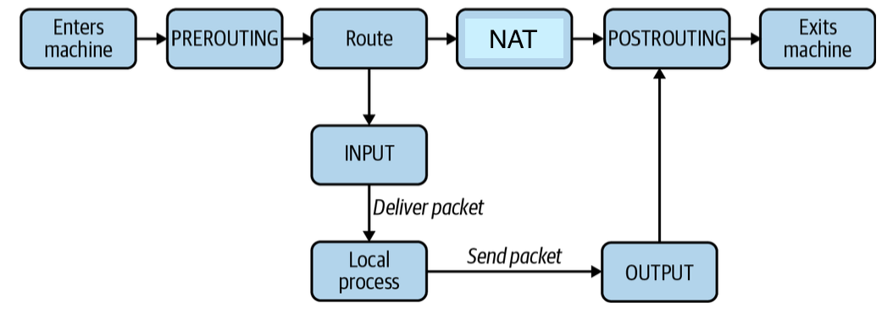
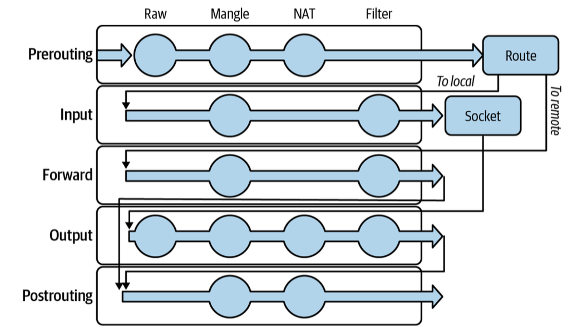
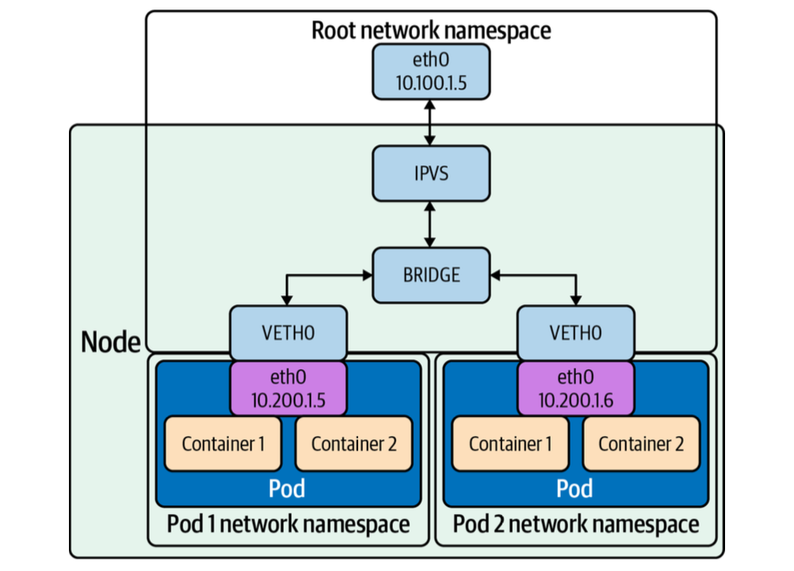
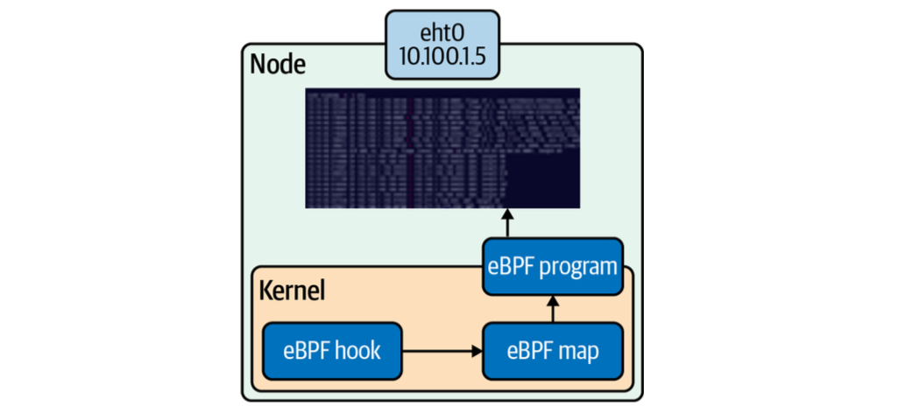

# 2. Linux Networking

!!! info "Source Attribution"

    The primary source and original content for this page originate from [the **Networking & Kubernetes - A Layered Approach** by James Strong and Vallery Lancey](https://www.oreilly.com/library/view/networking-and-kubernetes/9781492081647/). Please refer to [the Networking and Kubernetes Code Examples repo](https://github.com/strongjz/Networking-and-Kubernetes) to follow code examples.

This chapter will provide an overview of the Linux networking stack, with a focus on areas of note in Kubernetes.

## Basics

In [the first chapter](./01-networking-introduction.md), the Golang web server is running on the local machine. To run this server on an external Linux machine, this program needs to:

- listen to an address and port
- create a socket for that address and port and binds them to the program
- The socket will receive requests addressed to both the specified address and port - 8080 with any IP address in our case (1).
    { .annotate }

    1.  `0.0.0.0` in IPv4 and `[::]` in IPv6 are wildcard addresses, allowing the program to listen on all available IP addresses when used for a socket binding. This is **useful to expose a service, without prior knowledge of what IP addresses the machines running it will have**. Most network exposed services bind this way.

The kernel maps a given packet to a specific connection and uses an internal state machine to manage the connection state. {==Linux represents each connection with a file==}. Accepting a connection entails a notification from the
kernel to our program, which is then able to {==stream content to and from the file==}.

Use `strace` command to inspect what the server is doing. `strace` captures all the system calls made by our server, there is a lot of output. Run the below command on the server side:

``` bash
go build web-server.go
strace ./web-server
```

Then send a cURL request from the client:
``` bash
curl -vvv 192.168.8.149:8080
*   Trying 192.168.8.149:8080...
* Connected to 192.168.8.149 (192.168.8.149) port 8080
> GET / HTTP/1.1
> Host: 192.168.8.149:8080
> User-Agent: curl/8.7.1
> Accept: */*
>
* Request completely sent off
< HTTP/1.1 200 OK
< Date: Sun, 10 May 2026 22:46:29 GMT
< Content-Length: 5
< Content-Type: text/plain; charset=utf-8
<
* Connection #0 to host 192.168.8.149 left intact
Hello%
```

You will see `strace` logs on the server side (scroll to the left on the code block to find the annotation button):

``` bash hl_lines="5 7 9 13 16 19 33"
execve("./web-server", ["./web-server"], 0x7ffe39a09850 /* 65 vars */) = 0
brk(NULL)                               = 0x117c7000
... 
uname({sysname="Linux", nodename="clicknam-HP-EliteDesk-800-G3-DM-35W", ...}) = 0
socket(AF_INET6, SOCK_STREAM|SOCK_CLOEXEC|SOCK_NONBLOCK, IPPROTO_MPTCP) = 3 #(1)!
setsockopt(3, SOL_IPV6, IPV6_V6ONLY, [0], 4) = 0
openat(AT_FDCWD, "/proc/sys/net/core/somaxconn", O_RDONLY|O_CLOEXEC) = 4 # (3)!
...
eventfd2(0, EFD_CLOEXEC|EFD_NONBLOCK)   = 6 # (5)!
epoll_ctl(5, EPOLL_CTL_ADD, 6, {events=EPOLLIN, data=0x9af3c0}) = 0
...
epoll_ctl(5, EPOLL_CTL_DEL, 4, 0x3f8284ff0964) = 0
close(4)                                = 0 # (4)!
setsockopt(3, SOL_SOCKET, SO_REUSEADDR, [1], 4) = 0
bind(3, {sa_family=AF_INET6, sin6_port=htons(8080), sin6_flowinfo=htonl(0), inet_pton(AF_INET6, "::", &sin6_addr), sin6_scope_id=0}, 28) = 0
listen(3, 4096)                         = 0 # (2)!
epoll_ctl(5, EPOLL_CTL_ADD, 3, {events=EPOLLIN|EPOLLOUT|EPOLLRDHUP|EPOLLET, data=0x3880536177000002}) = 0
...
accept4(3, {sa_family=AF_INET6, sin6_port=htons(64455), sin6_flowinfo=htonl(0), inet_pton(AF_INET6, "::ffff:192.168.8.107", &sin6_addr), sin6_scope_id=0}, [112 => 28], SOCK_CLOEXEC|SOCK_NONBLOCK) = 4 # (6)!
epoll_ctl(5, EPOLL_CTL_ADD, 4, {events=EPOLLIN|EPOLLOUT|EPOLLRDHUP|EPOLLET, data=0x3880536176000001}) = 0
getsockname(4, {sa_family=AF_INET6, sin6_port=htons(8080), sin6_flowinfo=htonl(0), inet_pton(AF_INET6, "::ffff:192.168.8.149", &sin6_addr), sin6_scope_id=0}, [112 => 28]) = 0
setsockopt(4, SOL_TCP, TCP_NODELAY, [1], 4) = 0
setsockopt(4, SOL_SOCKET, SO_KEEPALIVE, [1], 4) = 0
setsockopt(4, SOL_TCP, TCP_KEEPIDLE, [15], 4) = 0
setsockopt(4, SOL_TCP, TCP_KEEPINTVL, [15], 4) = 0
setsockopt(4, SOL_TCP, TCP_KEEPCNT, [9], 4) = 0
futex(0x3f8285080160, FUTEX_WAKE_PRIVATE, 1) = 1
accept4(3, 0x3f8284ff0afc, [112], SOCK_CLOEXEC|SOCK_NONBLOCK) = -1 EAGAIN (Resource temporarily unavailable)
epoll_pwait(5, [{events=EPOLLOUT, data=0x3880536176000001}], 128, 0, NULL, 0) = 1
epoll_pwait(5, [{events=EPOLLIN|EPOLLOUT|EPOLLRDHUP, data=0x3880536176000001}], 128, -1, NULL, 0) = 1
futex(0x990cc0, FUTEX_WAKE_PRIVATE, 1)  = 1
futex(0x3f8284fe6d38, FUTEX_WAKE_PRIVATE, 1) = 1
read(4, "", 4096)                       = 0 # (7)!
epoll_ctl(5, EPOLL_CTL_DEL, 4, 0x3f828512b92c) = 0
close(4)                                = 0
epoll_pwait(5, [], 128, 0, NULL, 0)     = 0
```

1.  `socket(...) = 3`: Your Go server creates a socket to listen for incoming connections. The kernel assigns **FD 3** to this socket. This remains open as long as your server is running.
2.  `listen(3, 4096) = 0`: The main listener associated with the `FD 3` socket.
3.  `openat(...) = 4`: The Go runtime opens a system file to check the maximum connection limit. It gets **FD 4**, reads the value ("4096").
4.  `close(4) = 0` The `somaxconn` file is immediately closed to free up the file descriptor 4.
5.  - `epoll_create1(EPOLL_CLOEXEC) = 5`
    - `eventfd2(0, EFD_CLOEXEC|EFD_NONBLOCK) = 6`
    Go sets up its "Netpoller" (high-performance event loop). **FD 5** is used to monitor all other sockets, and **FD 6** is a tiny internal counter used for cross-thread notifications.
6.  `accept4(...) = 4`: A client at `192.168.8.107` connected. The server accepted it and assigned it **FD 4** (reusing the number that was previously freed from the `somaxconn` file).
7.  `read(4, "", 4096) = 0`: a read of **0 bytes** means the client has **closed the connection**.


When we make a request to our listening server, we see the following from our server process:

``` bash
accept4(3, {sa_family=AF_INET6, sin6_port=htons(64455), sin6_flowinfo=htonl(0), inet_pton(AF_INET6, "::ffff:192.168.8.107", &sin6_addr), sin6_scope_id=0}, [112 => 28], SOCK_CLOEXEC|SOCK_NONBLOCK) = 4
epoll_ctl(5, EPOLL_CTL_ADD, 4, {events=EPOLLIN|EPOLLOUT|EPOLLRDHUP|EPOLLET, data=0x3880536176000001}) = 0
getsockname(4, {sa_family=AF_INET6, sin6_port=htons(8080), sin6_flowinfo=htonl(0), inet_pton(AF_INET6, "::ffff:192.168.8.149", &sin6_addr), sin6_scope_id=0}, [112 => 28]) = 0
setsockopt(4, SOL_TCP, TCP_NODELAY, [1], 4) = 0
setsockopt(4, SOL_SOCKET, SO_KEEPALIVE, [1], 4) = 0
setsockopt(4, SOL_TCP, TCP_KEEPIDLE, [15], 4) = 0
setsockopt(4, SOL_TCP, TCP_KEEPINTVL, [15], 4) = 0
setsockopt(4, SOL_TCP, TCP_KEEPCNT, [9], 4) = 0
futex(0x3f8285080160, FUTEX_WAKE_PRIVATE, 1) = 1
accept4(3, 0x3f8284ff0afc, [112], SOCK_CLOEXEC|SOCK_NONBLOCK) = -1 EAGAIN (Resource temporarily unavailable)
```

To summarize what the server is doing when it receives a request:

1. Epoll returns and causes the program to resume.
1. The server sees a connection from `::ffff:192.168.8.107`, the client IP address in this example.
1. The server inspects the socket.
1. The server changes `KEEPALIVE` options: it turns `KEEPALIVE` on, and sets a 180-second interval between `KEEPALIVE` probes.

---
## The Network Inferface

Computers use a **network interface to communicate with the outside world**. Network interfaces can be physical (e.g., an Ethernet network controller) or virtual. IP addresses are assigned to network interfaces. A typical interface may have one IPv4 address and one IPv6 address, but multiple addresses can be assigned. The **loopback interface** is a special interface for **same-host communication**. `127.0.0.1` is the standard IP address for the loopback interface.

Run `ifconfig` to see a list of all network interfaces and their configurations:
``` bash
ifconfig

eno1: flags=4163<UP,BROADCAST,RUNNING,MULTICAST>  mtu 1500 # (1)!
        inet 192.168.8.104  netmask 255.255.255.0  broadcast 192.168.8.255
        inet6 fe80::12e7:c6ff:fe0f:bfab  prefixlen 64  scopeid 0x20<link>
        ether 10:e7:c6:0f:bf:ab  txqueuelen 1000  (Ethernet)
        RX packets 427243  bytes 462530820 (462.5 MB)
        RX errors 0  dropped 2  overruns 0  frame 0
        TX packets 125259  bytes 33247553 (33.2 MB)
        TX errors 0  dropped 0 overruns 0  carrier 0  collisions 0
        device interrupt 16  memory 0xdca00000-dca20000

lo: flags=73<UP,LOOPBACK,RUNNING>  mtu 65536 # (3)!
        inet 127.0.0.1  netmask 255.0.0.0
        inet6 ::1  prefixlen 128  scopeid 0x10<host>
        loop  txqueuelen 1000  (Local Loopback)
        RX packets 2057  bytes 258483 (258.4 KB)
        RX errors 0  dropped 0  overruns 0  frame 0
        TX packets 2057  bytes 258483 (258.4 KB)
        TX errors 0  dropped 0 overruns 0  carrier 0  collisions 0

wlp1s0: flags=4163<UP,BROADCAST,RUNNING,MULTICAST>  mtu 1500 # (2)!
        inet 192.168.8.149  netmask 255.255.255.0  broadcast 192.168.8.255
        inet6 fe80::7048:a239:3307:10eb  prefixlen 64  scopeid 0x20<link>
        ether d4:6d:6d:70:f3:00  txqueuelen 1000  (Ethernet)
        RX packets 3391  bytes 565850 (565.8 KB)
        RX errors 0  dropped 1  overruns 0  frame 0
        TX packets 2928  bytes 299000 (299.0 KB)
        TX errors 0  dropped 0 overruns 0  carrier 0  collisions 0
```

1.  `eno1`
    - `e` stands for **Ethernet**.
    - `no` stands for **onboard**. This is usually refers to the built-in port on the motherboard.
    - `1` is the index number of the port.
2.  `wlp1s0`
    - `w` stands for **Wireless**.
    - `l` stands for **Lan**.
    - `p1s0` refers to the physical location of the Wi-Fi card on the PCI bus(**p**us **1**, **s**lot **0**).
3.  `lo`: The lookback interface. It allows the computer to talk to itself at `127.0.0.1` or `::1`.


---
## The Bridge Interface


The bridge functions like a network switch between network interfaces on a host, seamlessly connecting them. Bridges allow pods, with their individual network interfaces, to interact with the broader network via the node's network interface.

### Creating bridge interface and connecting veth pair

Add a new bridge interface named `br0`:
``` bash
sudo ip link add br0 type bridge
```

Verify `br0` is created:
``` bash
ip link show br0

4: br0: <BROADCAST,MULTICAST> mtu 1500 qdisc noop state DOWN mode DEFAULT group default qlen 1000
    link/ether 06:a2:b1:32:ee:2a brd ff:ff:ff:ff:ff:ff
```

Connect `wlp1s0` and `veth` to the bridge `br0`:
``` bash
ip link set eth0 master br0
ip link set veth master br0
```

The veth device is a local Ethernet tunnel. Veth devices are created in pairs. In the above image, the pod sees an `eth0` interface from the veth. Packets transmitted on one device in the pair are immediately received on the other device. 

Follow the below `ip` commands to create veth devices:
``` bash
ip netns add net1 # (1)!
ip netns add net2 # (2)!
ip link add veth1 netns net1 type veth peer name veth2 netns net2 # (3)!
```

1.  create a namespace named `net1`
2.  create a namespace named `net2`
3.  create a pair of veth devices
    - `veth1` is assigned to namespace `net1`
    - `veth2` is assigned to namespace `net2`
    - These two namespaces are connected with this veth pair.

Assign a pair of IP addresses, and you can ping and communicate between the two namespaces. Kubernetes uses this in concert with the CNI project to manage container network namespaces, interfaces, and IP addresses. We will cover more of this in the next chapter.


---
## Packet Handling in the Kernel

The Linux kernel is responsible for translating between packets, and a coherent stream of data for programs.

### Netfilter

Netfilter is a framework of kernel hooks, which allow userspace programs to handle packets on behalf of the kernel. 

The way Netfilter works is:

- A program registers to a specific Netfilter hook.
- The kernel calls that program on applicable packets.
- That program could tell the kernel to do something with the packet(e.g. drop it), or it could send back a modified packet to the kernel.

Netfilter has **five hooks**, as shown below:

| Netfilter hook | Iptables chain name | Description |
| :--- | :--- | :--- |
| `NF_IP_PRE_ROUTING` | `PREROUTING` | Triggers when a packet arrives from an external system. |
| `NF_IP_LOCAL_IN` | `INPUT` | Triggers when a packet's destination IP address matches this machine. |
| `NF_IP_FORWARD` | `FORWARD` | Triggers for packets where neither source nor destination matches the machine's IP addresses (in other words, packets that this machine is routing on behalf of other machines). |
| `NF_IP_LOCAL_OUT` | `OUTPUT` | Triggers when a packet, originating from the machine, is leaving the machine. |
| `NF_IP_POST_ROUTING` | `POSTROUTING` | Triggers when any packet (regardless of origin) is leaving the machine. |

Netfilter triggers each hook during a specific phase of packet handling, and under specific conditions:


Below table shows the Netfliter hook order for various packet sources and destinations.=:

| Packet source | Packet destination | Hooks (in order) |
| :--- | :--- | :--- |
| Local machine | Local machine | `NF_IP_LOCAL_OUT` -> `NF_IP_POST_ROUTING` -> `NF_IP_PRE_ROUTING` ->  `NF_IP_LOCAL_IN` |
| Local machine | External machine | `NF_IP_LOCAL_OUT` -> `NF_IP_POST_ROUTING`  |
| External machine | Local machine | `NF_IP_PRE_ROUTING` -> `NF_IP_LOCAL_IN` |
| External machine | External machine | `NF_IP_PRE_ROUTING` -> `NF_IP_FORWARD` -> `NF_IP_POST_ROUTING` |

Programs can register a hook by calling `NF_REGISTER_NET_HOOK` with a handling function. The hook will be called every time a
packet matches. This is how programs like `iptables` integrate with Netfilter.

**Actions** that a Netfilter hook can trigger:

- `Accept`: Continue packet handling.
- `Drop`: Drop the packet, without further processing.
- `Queue`: Pass the packet to a userspace program.
- `Stolen`: Doesn't execute further hooks, and allows the userspace program to take ownership of the packet.
- `Repeat`: Make the packet reenter the hook and be reprocessed.

Hooks can also return **mutated packets**. This allows programs to do things such as reroute or masquerade packets, adjust packet TTLs, etc.

### Conntrack

Conntrack is a component of Netfilter used to **track the state of connections** to (and from) the machine. Conntrack identifies connections by a tuple - (`source address`, `source port`, `destination address`, `destination port`, `L4 protocol(TCP||UDP)`), the minimal identifiers needed to identify any given L4 connection. Conntrack refers to these connections as *flows*. A flow contains metadata about the connection and its state.


The above diagram illustrates how the Linux kernel organizes the Conntrack table in memory using a **hash table with chaining**.

1. **Hash Keyspace(The Buckets)**
    - The vertical column of squares represents the Hash Table.
    - The number of squares(buckets) is determined by the `hashsize` parameter (normally set in `/sys/module/nf_conntrack/parameters/hashsize`).
    - When a packet arrives, the kernel takes the tuple and runs it through a hash fuction. This function returns a number that corresponds to one of these buckets.
2. **Linked List of Flows (The Chaining)**
    - The horizontal boxes labeled flow represent the actual connection records.
    - Because the hash keyspace is limited, two completely different connections might occasionally hash to the exact same bucket.
    - Instead of overwriting the old connection, the kernel simply chains the new connection to the existing one using a **Linked List**.

The total number of concurrent connections is normally set in `/proc/sys/net/nf_conntrack_max`. A system that experiences a huge number of connections will run out of space. If your host runs directly exposed to the internet, overwhelming Conntrack with short-lived or incomplete connections is an easy way to cause a denial of service (DOS).

Conntrack entries contain a connection state, which is one of four states.

| State | Description | Example |
| :--- | :--- | :--- |
| NEW | A valid packet is sent or received, with no response seen.  | TCP SYN received. |
| ESTABLISHED | Packets observed in both directions.   | TCP SYN received, and TCP SYN/ACK sent. |
| RELATED | An additional connection is opened, where metadata indicates that it is "related" to an original connection. Related connection handling is complex.  | An FTP program, with an ESTABLISHED connection, opens additional data connections. |
| INVALID | The packet itself is invalid, or does not properly match another Conntrack connection state.  | TCP RST received, with no prior connection. |

Conntrack serves as the foundational source of truth for both **firewalls** and **NAT**. Without it, modern networking would be significantly more complex and less secure.

1. **Conntrack for Firewalls (Stateful Inspection)**
    - When a packet hits a firewall rule, the kernel checks the Conntrack table to see if this packet belongs to a "Flow" that has already been validated.
2. **Conntrack for NAT**
    - When the router changes a Source IP (SNAT) or a Destination IP (DNAT), it must apply that exact same change to every subsequent packet in that flow.
    - When a response comes back from the internet, the router needs to know which internal machine to send it to.
        - The router looks at the incoming packet.
        - It checks the Conntrack table for a matching entry.
        - It **finds the original mapping and un-does the NAT**, restoring the original IP so your computer can understand the packet.

In the Kubernetes, `kube-proxy` uses `iptables` and Conntrack to handle Service load balancing. When a Pod talks to a Service ClusterIP, Conntrack is used to ensure that all packets for that specific request go to the same backend Pod.

### Routing

When handling any packet, the kernel must decide where to send that packet. The route table tells you where the packet is passed to as the next hop. 

``` bash
route -n

Kernel IP routing table
Destination     Gateway         Genmask         Flags Metric Ref    Use Iface
0.0.0.0         192.168.8.1     0.0.0.0         UG    100    0        0 eno1
0.0.0.0         192.168.8.1     0.0.0.0         UG    600    0        0 wlp1s0
192.168.8.0     0.0.0.0         255.255.255.0   U     100    0        0 eno1
192.168.8.0     0.0.0.0         255.255.255.0   U     600    0        0 wlp1s0
```

For example, a request to `1.2.3.4` would be sent to `192.168.8.1` on the `eno1` or `wlp1s0` interface.

!!! Question "What does a Gateway of `0.0.0.0` mean?"

    In a routing table, a gateway of `0.0.0.0` (often shown as `*`) indicates that the destination is **directly connected** to the local network segment.

    - **No Next-Hop Router:** The kernel does not need to forward the packet to an intermediate gateway to reach the destination.
    - **Direct Delivery:** The system will use **ARP** (Address Resolution Protocol) to find the MAC address of the destination IP directly on the local link and deliver the frame straight to it.

---
## High-Level Routing

This section will cover the three tools that are most commonly seen in Kubernetes. All Kubernetes setups will make some use of `iptables`, but there are many ways that services can be managed. We will also cover `IPVS`
(which has built-in support in `kube-proxy`), and `eBPF`, which is used by Cilium (a `kube-proxy` alternative).

### iptables

`iptables` uses **Netfilter**, which allows `iptables` intercept and mutate packets. Understanding `iptables` is important to understand access and routing for pods and nodes in most clusters.

In `iptables`, these three concepts work together like a hierarchy to manage how your Linux kernel handles network traffic.

- **Chains** are a specific path or **checkpoint** in the network stack where packets must stop. Each table contains several built-in chains that correspond to different stages of a packet's journey.
- **Tables** are used to group rules based on their purpose. The three most commonly applicable tables are: **Filter** (for accepting/dropping packets), **NAT** (for chaning source or destination IPs/ports), and **Mangle** (for specialized packet mutations).
- **Rules** are the actual instruction that tells the kernel what to look for and what to do.

#### iptables chains

The built-in, "top-level" chains are `PREROUTING`, `INPUT`, `NAT`, `OUTPUT`, and `POSTROUTING`. These are powered by Netfilter hooks.

| iptables chain | Netfilter hook |
| :--- | :--- |
| `PREROUTING` | `NF_IP_PRE_ROUTING` |
| `INPUT` | `NF_IP_LOCAL_IN` |
| `NAT` | `NF_IP_FORWARD` |
| `OUTPUT` | `NF_IP_LOCAL_OUT` |
| `POSTROUTING` | `NF_IP_POST_ROUTING` |


Returning to our diagram of Netfilter hook ordering, we can infer the equivalent diagram of `iptables` chain execution and ordering for a given packet.



Below table shows some routing scenarios from the perspective of machine with IP address `10.0.0.1`:

| Packet description | Source | Destination | Chains processed |
| :--- | :--- | :--- | :--- |
| An inbound packet, from another machine. | `10.0.0.2` | `10.0.0.1` | `PREROUTING`, `INPUT` |
| An inbound packet, not destined for this machine. | `10.0.0.2` | `10.0.0.3` | `PREROUTING`, `NAT`, `POSTROUTING` |
| An outbound packet, originating locally, destined for another machine.  | `10.0.0.1` | `10.0.0.2` | `OUTPUT`, `POSTROUTING` |
| A packet from a local program, destined for the same machine.  | `127.0.0.1` | `127.0.0.1` | `OUTPUT`, `POSTROUTING`, `PREROUTING`, `INPUT` |

#### iptables tables

A table in `iptables` maps to a particular capability set, where each table is responsible for a specific type of action.

| Table | Purpose |
| :--- | :--- |
| Filter | handles acceptance and rejection of packets. |
| NAT | used to modify the source or destination IP addresses. |
| Mangle | can perform editing of packet headers, but it is not intended for NAT. |
| Raw | allows for packet mutation before connection tracking. The most common use is to disable connection tracking for some packets. |
| Security | for packet handling. SELinux only. |

{==`iptables` executes tables in a particular order: Raw, Mangle, NAT, Filter.==}

You can list the chains that correspond to a table yourself, with `iptables -L -t <table>`:
``` bash
sudo iptables -L -t filter

[sudo: authenticate] Password:
Chain INPUT (policy ACCEPT)
target     prot opt source               destination

Chain FORWARD (policy ACCEPT)
target     prot opt source               destination

Chain OUTPUT (policy ACCEPT)
```

The flow of a packet through `iptables` looks like below:



If we trace the flow of a packet originating from the local host, we see the following table/chains pairs evaluated, in order:

1. `Raw/OUTPUT`
1. `Mangle/OUTPUT`
1. `NAT/OUTPUT`
1. `Filter/OUTPUT`
1. `Mangle/POSTROUTING`
1. `NAT/POSTROUTING`

#### Subchains

The aforementioned chains are the top-level, or entry-point, chains. Users can define their own subchains and execute them with the JUMP target. `iptables` is, effectively, running tens or hundreds or thousands of *if* statements against every single packet that goes in or out of your system. `iptables`s performance given a service with many pods is still a problem in Kubernetes, which makes other solutions
with less or no iptables use, such as IPVS or eBPF, more appealing.

Sample `iptables` chain for SSH firewalling:
``` bash
# Create incoming-ssh chain.
$ iptables -N incoming-ssh
# Allow packets from specific IPs.
$ iptables -A incoming-ssh -s 10.0.0.1 -j ACCEPT
$ iptables -A incoming-ssh -s 10.0.0.2 -j ACCEPT
# Log the packet.
$ iptables -A incoming-ssh -j LOG --log-level info --log-prefix "ssh-failure"
# Drop packets from all other IPs.
$ iptables -A incoming-ssh -j DROP
# Evaluate the incoming-ssh chain,
# if the packet is an inbound TCP packet addressed to port 22.
$ iptables -A INPUT -p tcp --dport 22 -j incoming-ssh
```

#### iptables rules

Rules have two parts: a **match condition** and an **action** (called a *target*). Below table shows some common match types:

| Match type | Flags | Description |
| :--- | :--- | :--- |
| Source | `-s`, `--src`, `--source` | Matches packets the the specified source address. |
| Destination | `-d`, `--dest`, `--destination` | Matches packets the the destination address. |
| Protocol | `-p`, `--protocol` | Matches packets with the specified protocol. |
| In interface | `-i`, `--in-interface` | Matches packets that entered via the specified interface. |
| Out interface | `-o`, `--out-interface` | Matches packets that are leaving the specified interface. |
| State | `--state` <states> | Matches packets from connections that are in one of the comma-separated states. This uses the Conntrack states (`NEW`, `ESTABLISHED`, `RELATED`, `INVALID`). |

There are two kinds of target actions: **terminating** and **nonterminating**. 

- A terminating target will stop iptables from checking subsequent targets in the chain, essentially acting as a final decision.
    - `ACCEPT`, `DROP`, `REJECT`, and `RETURN`
    - Note that `ACCEPT` and `RETURN` are terminating only *within their chain*.
-  A nonterminating target will allow iptables to continue checking subsequent targets in the chain.

Common iptables target types and behavior:

| Target type | Applicable tables | Description |
| :--- | :--- | :--- |
| AUDIT | All | Records data about accepted, dropped, or rejected packets. |
| ACCEPT | Filter | Allows the packet to continue unimpeded and without further modification. |
| DNAT | NAT | Modifies the destination address. |
| DROPs | Filter | Discards the packet. To an external observer, it will appear as though the packet was never received. |
| JUMP | All | Executes another chain. Once that chain finishes executing, execution of the parent chain will continue. |
| LOG | All | Logs the packet contents, via the kernel log. |
| MARK | All | Sets a special integer for the packet, used as an identifier by Netfilter. The integer can be used in other `iptables` decisions and is not written to the packet itself. |
| MASQUERADE | NAT | Modifies the source address of the packet, replacing it with the address of a specified network interface. This is similar to SNAT, but does not require the machine's IP address to be known in advance. |
| REJECT | Filter | Discards the packet and sends a rejection reason. |
| RETURN | All | Stops processing the current chain (or subchain). Note that this is not a terminating target, and if there is a parent chain, that chain will continue to be processed. |
| SNAT | NAT | Modifies the source address of the packet, replacing it with a fixed address. |


Each target type may have specific options, such as ports or log strings, that apply to the rule. Below table shows some example commands and explanations.

| Command | Explanation |
| :--- | :--- |
| iptables -A INPUT -s 10.0.0.1 | Accepts an inbound packet if the source address is `10.0.0.1`. |
| iptables -A INPUT -p ICMP | Accepts all inbound ICMP packets. |
| iptables -A INPUT -p tcp --dport 443 | Accepts all inbound TCP packets to port 443. |
| iptables -A INPUT -p tcp --dport 22 -j DROP | Drops all inbound TCP ports to port 22. |

#### Practical iptables

You can show current `iptables` chains with `iptables -L`:
``` bash
sudo iptables -L
[sudo: authenticate] Password:
Chain INPUT (policy ACCEPT)
target     prot opt source               destination

Chain FORWARD (policy ACCEPT)
target     prot opt source               destination

Chain OUTPUT (policy ACCEPT)
```

`--line-numbers` shows numbers for each rule in a chain. This can be helpful when inserting or deleting rules. 
``` bash
sudo iptables -L --line-numbers
[sudo: authenticate] Password:
Chain INPUT (policy ACCEPT)
num  target     prot opt source               destination

Chain FORWARD (policy ACCEPT)
num  target     prot opt source               destination

Chain OUTPUT (policy ACCEPT)
```

`-I <chain> <line>` inserts a rule at the specified line number, before the previous rule at that line.

The typical format of a command to interact with `iptables` rules is:
    `iptables [-t table] {-A|-C|-D} chain rule-specification`
where `-A` for *append*, `-C` for *check*, and `-D` for *delete*.


In Kubernetes, masquerading can make pods use their node's IP address, despite the fact that pods have unique IP addresses. This is necessary to communicate outside the cluster in many setups, where pods have internal IP addresses that cannot communicate directly with the internet.

The MASQUERADE target is similar to SNAT; however, it does not require a `--source-address` to be known and specified in advance. Instead, it uses the address of a specified interface.

``` bash
iptables -t nat -A POSTROUTING -o eth0 -j MASQUERADE
```

`iptables` can perform connection-level load balancing or more accurately, connection fan-out. This technique relies on DNAT rules and random selection (to prevent every connection from being routed to the first DNAT target):

``` bash
iptables -t nat -A OUTPUT -p tcp --dport 80 -d $FRONT_IP -m statistic \
--mode random --probability 0.5 -j DNAT --to-destination $BACKEND1_IP:80

iptables -t nat -A OUTPUT -p tcp --dport 80 -d $FRONT_IP \
-j DNAT --to-destination $BACKEND2_IP:80
```

In the above example, there is a 50% chance of routing to the first backend. Otherwise, the packet proceeds to the next rule, which is guaranteed to route the connection to the second backend.

``` bash
Chain KUBE-SVC-I7EAKVFJLYM7WH25 (1 references)
target prot opt source destination
KUBE-SEP-LXP5RGXOX6SCIC6C all -- anywhere anywhere
    statistic mode random probability 0.25000000000
KUBE-SEP-XRJTEP3YTXUYFBMK all -- anywhere anywhere
    statistic mode random probability 0.33332999982
KUBE-SEP-OMZR4HWUSCJLN33U all -- anywhere anywhere
    statistic mode random probability 0.50000000000
KUBE-SEP-EELL7LVIDZU4CPY6 all -- anywhere anywhere
```

When Kubernetes uses `iptables` load balancing for a service, it creates a chain as shown above. 

Although `iptables` is widely used in Linux, it can become slow in the presence of a huge number of rules and offers limited load balancing functionality. Next we'll look at IPVS, an alternative that is more purpose-built for load balancing.


### IPVS



IP Virtual Server (IPVS) is a Linux connection (L4) load balancer. `iptables` can do simple L4 load balancing by randomly routing connections, with the randomness shaped by the weights on individual DNAT rules. IPVS supports multiple load balancing modes, outlined in the below table.

| Name | Shortcode | Description |
| :--- | :--- | :--- |
| Round-robin | `rr` | Sends subsequent connections to the "next" host in a cycle. |
| Least connection | `lc` | Sends connections to the host that currently has the least open connections. |
| Destination hashing | `dh` | Sends connections deterministically to a specific host, based on the connections' destination addresses. |
| Source hashing | `sh` | Sends connections deterministically to a specific host, based on the connections' source addresses. |
| Shortest expected delay | `sed` | Sends connections to the host with the lowest connections to weight ratio. |
| never queue | `nq` | Sends connections to any host with no existing connections, otherwise uses "shortest expected delay" strategy. |

#### IPVS's three packet forwarding mode

1. **NAT(Network Address Translation)**
    - **How it works**: When a packet arrives for the Virtual IP (VIP), the Load Balancer changes the **Destination IP** to the private IP of a backend server. On the way back, it changes the **Source IP** back to the VIP.
    - **The Catch**: All traffic (inbound and outbound) must pass through the Load Balancer. This can become a bottleneck because the Load Balancer has to process every single byte of the response.
1. **DR(Direct Routing)**
    - **How it works**: The Load Balancer and the backend servers must be in the **same Layer 2 network** (connected to the same switch). The Load Balancer changes the **Destination MAC address** of the frame to the MAC of the chosen backend server but leaves the **IP address untouched**.
    - **The Secret**: The backend server is configured to have the VIP address on its own `loopback` interface. It "sees" the packet, realizes it's the intended recipient, and processes it.
    - **The Benefit**: The backend server sends the response **directly back to the client**, bypassing the Load Balancer. This is much faster for heavy-traffic apps.
1. **IP tunneling(IPIP)**
    - **How it works**: The Load Balancer takes the original packet (Client $\to$ VIP) and wraps it inside a new packet (Load Balancer $\to$ Backend Server).
    - **Why use it?** Unlike DR mode, the servers do not need to be on the same physical switch. They can be in different data centers or subnets across the internet.
    - **The Result**: The backend server "unwraps" the envelope, sees the original request, and—just like in DR mode—sends the response **directly back to the client**.

| Mode | Technique | Requirement | Response path |
| :--- | :--- | :--- | :--- |
| **NAT** | Rewrite IP/PORT | None | Through Load Balancer |
| **DR** | Rewrite MAC | Same L2 Network | **Direct to Client** |
| **Tunneling** | Encapsulate IP | Support for IPIP | **Direct to Client** |

#### Issues with `iptables` as a load balancer

- Number of nodes in the cluster
    - `kube-proxy` with `iptables` is a bottleneck to scal the cluster to 5,000 nodes.
    - With a `NodePort` service in a 5,000-node cluster, if we have 2,000 services and each service has 10 pods, this will cause at least 20,000 `iptables` records on each worker node, which can make the kernel pretty busy.
- Time
    - The time spent to add one rule when there are 5,000 services (40,000 rules) is 11 minutes.
- Latency
    - each packet must traverse the `iptables` list until a match is made.

IPVS also supports session affinity, which is exposed as an option in services (`Service.spec.sessionAffinity` and `Service.spec.sessionAffinityConfig`). Repeated connections, within the session affinity time window, will route to the same host.


### eBPF

eBPF is a programming system that allows special sandboxed programs to run in the kernel **without passing back and forth between kernel and user space**, like we saw with Netfilter and `iptables`.

??? Question "What is the example of passing back and forth between kernel and user space?"

    The best example of the "back and forth" problem is the **Envoy Sidecar** redirection. In a standard Netfilter-based Mesh, a single request from a client to your app crosses the boundary **four times**:

    1. **Kernel $\to$ User (Inbound)**: The packet arrives at the NIC (Kernel). Netfilter redirects it to the Envoy Sidecar. The data is copied from the Kernel to **Envoy's memory** (User Space) so Envoy can check the HTTP headers.
    1. **User $\to$ Kernel (Inbound)**: Envoy finishes its check and sends the data back to the **Socket** (Kernel) to be delivered to your actual Go application.
    1. **Kernel $\to$ User (Inbound)**: Your **Go Application** (User Space) calls `read()` to finally get the data from the socket.
    1. **User $\to$ Kernel (Outbound)**: Your App sends a response, which goes back into the **Kernel** to be processed by the network stack.

Before eBPF, there was the Berkeley Packet Filter (BPF). BPF is a technology used in the kernel to analyzie and filter packets, which allows a userspace process to supply a filter that specifies which packets it wants to inspect. One of BPF's use case is `tcpdump`, shown below:

``` bash
sudo tcpdump -n -i any
[sudo: authenticate] Password:
tcpdump: WARNING: any: That device doesn't support promiscuous mode
(Promiscuous mode not supported on the "any" device)
tcpdump: verbose output suppressed, use -v[v]... for full protocol decode
listening on any, link-type LINUX_SLL2 (Linux cooked v2), snapshot length 262144 bytes
01:34:25.707701 eno1  Out IP 192.168.8.104.34562 > 162.159.61.4.443: Flags [P.], seq 298521758:298521814, ack 1958927586, win 1010, options [nop,nop,TS val 4059227541 ecr 312081489], length 56
01:34:25.707728 eno1  Out IP 192.168.8.104.34562 > 162.159.61.4.443: Flags [P.], seq 56:215, ack 1, win 1010, options [nop,nop,TS val 4059227541 ecr 312081489], length 159
01:34:25.708027 lo    In  IP 127.0.0.1.39027 > 127.0.0.53.53: 48559+ [1au] A? mozilla.cloudflare-dns.com. (55)
01:34:25.708049 lo    In  IP 127.0.0.1.39027 > 127.0.0.53.53: 1962+ [1au] AAAA? mozilla.cloudflare-dns.com. (55)
01:34:25.708303 eno1  Out IP 192.168.8.104.34562 > 162.159.61.4.443: Flags [P.], seq 215:271, ack 1, win 1010, options [nop,nop,TS val 4059227542 ecr 312081489], length 56
01:34:25.708324 eno1  Out IP 192.168.8.104.34562 > 162.159.61.4.443: Flags [P.], seq 271:430, ack 1, win 1010, options [nop,nop,TS val 4059227542 ecr 312081489], length 159
01:34:25.708417 eno1  Out IP 192.168.8.104.34562 > 162.159.61.4.443: Flags [P.], seq 430:486, ack 1, win 1010, options [nop,nop,TS val 4059227542 ecr 312081489], length 56
```

eBPF programs can directly watch and block syscalls, without the usual approach of adding kernel hooks to a userspace program. 

#### eBPF attach points comparison

| Attach Point | Location / Level | Stability | Best Use Case |
| :--- | :--- | :--- | :--- |
| **Kprobes** | Kernel (Dynamic) | **Low** (Can break on kernel updates) | Deep debugging of internal kernel functions where no tracepoint exists. |
| **Uprobes** | User-space (Dynamic) | **Low** (Depends on app binary) | Profiling user-space apps (e.g., tracing a Go function or a SSL library call). |
| **Tracepoints** | Kernel (Static) | **High** (API-like stability) | Stable observability and performance monitoring of common kernel events. |
| **perf_events** | Kernel (Sampling) | **High** | CPU profiling and hardware counter monitoring (e.g., ""Where is my CPU spending time?""). |
| **XDP** | Network Driver (NIC) | **Medium**  | High-performance packet filtering, DDoS protection, and load balancing. |


The below diagram shows a simplified rendition of `tcpdump`'s interactions with eBPF:



Suppose we run `tcpdump -i any`. The string is compiled by `pcap_compile` into a BPF program. The kernel will then use
this BPF program to filter all packets that go through all the network devices. It will make this data available to `tcpdump` via a map.

#### eBPF with Kubernetes

There are many reasons to use eBPF with Kubernetes:

- Performance
    - For every service added to Kubernetes, the list of `iptables` rules that have to be traversed grows exponentially. The
entire list of rules has to be replaced each time a new rule is added.
- Tracing
    - Using BPF, we can gather pod and container-level network statistics.
- Auditing `kubectl exec` with eBPF
    - With eBPF, you can attach a program that will record any commands executed in the `kubectl exec` session and pass those commands to a userspace program that logs those events.
- Security 
    - Seccomp: Secured computing that restricts what syscalls are allowed.
    - Falco: Open source container-native runtime security that uses eBPF.

The most common use of eBPF in Kubernetes is Cilium, CNI and service implementation. Cilium replaces `kube-proxy`, which writes `iptables` rules to map a service's IP address to its corresponding pods.

---
## Network Troubleshooting Tools

Cheat sheet of common debugging cases and tools:
| Case | Tools | 
| :--- | :--- |
| Checking connectivity | `traceroute`, `ping`, `telnet`, `netcat` |
| Port scanning | `nmap` |
| Checking DNS records | `dig` |
| Checking HTTP/1 | `cURL`, `telnet`, `netcat` |
| Checking HTTPS | `OpenSSL`, `cURL` |
| Checking listening programs | `netstat` |


### Security Warning

Linux file permissions include something called the `setuid bit` that is sometimes used by networking tools. If a file has the setuid bit set, executing said file causes the file to be executed *as the user who owns the file*, rather than the current user. You can
observe this by looking for an `s` rather than an `x` in the permission readout of a file:

``` bash
ls -la /etc/passwd
-rwsr-xr-x 1 root root 2778 Apr 28 22:39 /etc/passwd
```

This allows programs to expose limited, privileged capabilities (for example, `passwd` uses this ability to allow a user to update their password, without allowing arbitrary writes to the password file). A number of networking tools (`ping`, `nmap`, etc.) may use the setuid bit on some systems to send raw packets, sniff packets, etc. {==If an attacker downloads their own copy of a tool and cannot gain root privileges, they will be able to do less with said tool.==}

### ping

`ping` is a simple program that sends `ICMP ECHO_REQUEST` packets to networked devices. It is a common, simple way to test network connectivity from one host to another.

!!! Warning "Kubernetes services do not support ICMP."

    ICMP is a layer 4 protocol, like TCP and UDP. Kubernetes services support TCP and UDP, but not ICMP. Use `telnet` or a higher-level tool such as `cURL` to check connectivity to a service.

The basic use of ping is simply `ping <address>`. The address can be an IP address or a domain. 

``` bash
 ping -c 2 k8s.io
PING k8s.io (34.107.204.206): 56 data bytes
64 bytes from 34.107.204.206: icmp_seq=0 ttl=118 time=10.514 ms
64 bytes from 34.107.204.206: icmp_seq=1 ttl=118 time=15.873 ms

--- k8s.io ping statistics ---
2 packets transmitted, 2 packets received, 0.0% packet loss
round-trip min/avg/max/stddev = 10.514/13.194/15.873/2.679 ms
```

#### Useful `ping` options

| Option | Description | 
| :--- | :--- |
| `-c <count>` | Sends the specified number of packets. Exits after the final packet is received or times out. |
| `-i <seconds>` | Sets the wait interval between sending packets. Defaults to 1 second. |
| `-o` | Exit after receiving 1 packet. Equivalent to `-c 1`. |
| `-S <source address>` | Uses the specified source address for the packet. |
| `-W <milliseconds>` | Sets the wait interval to receive a packet. If ping receives the packet later than the wait time, it will still count toward the final summary. |


### traceroute

`traceroute` shows the network route taken from one host to another.

#### working principles

- A packet travels over multiple hosts to arrive at the destination host. 
- Each host that decrements the time-to-live (TTL) value on packets by 1.
- When a host receives a packet and decrements the TTL to 0, it sends a `TIME_EXCEEDED` packet and discards the original packet.
- The `TIME_EXCEEDED` response packet contains the source address of the machine where the packet timed out.
- **By starting with a TTL of 1 and raising the TTL by 1 for each packet, traceroute is able to get a response from each host along the route to the destination address.**

``` bash
traceroute k8s.io
traceroute to k8s.io (34.107.204.206), 64 hops max, 40 byte packets
 1  console.gl-inet.com (192.168.8.1)  3.457 ms  3.186 ms  4.135 ms
 2  192.168.1.1 (192.168.1.1)  5.156 ms  5.931 ms  4.315 ms
 3  lo0-100.washdc-vfttp-340.verizon-gni.net (71.163.33.1)  6.487 ms  7.786 ms  8.421 ms
 4  ae1340-21.artnvafc-mse01-aa-ie1.verizon-gni.net (100.41.23.70)  6.976 ms  6.683 ms  7.686 ms
 5  * * *
 6  206.204.107.34.bc.googleusercontent.com (34.107.204.206)  15.203 ms  8.296 ms  8.499 ms
```

If traceroute receives no response from a given hop before timing out, it prints a `*`. Some hosts may refuse to send a `TIME_EXCEEDED` packet, or a firewall along the way may prevent successful delivery.

#### useful traceroute options

| Option | Syntax | Description | 
| :--- | :--- | :--- |
| First TTL | `-f <TTL>`, `-M <TTL>` | Set the starting IP TTL (default value: 1). Setting the TTL to n will cause `traceroute` to not report the first n-1 hosts en route to the destination. |
| Max TTL | `-m <TTL>` | Set the maximum TTL. |
| Protocol | `-P <protocol>` | Send packets of the specified protocol (TCP, UDP, ICMP, and sometimes other options). UDP is default. |
| Source address | `-s <address>` | Specify the source IP address of outgoing packets. |
| Wait | `-w <seconds>` | Set the time to wait for a probe response. |


### dig

dig is a DNS lookup tool. The general form of a dig command is `dig [options] <domain>`. By default, dig will display the CNAME, A, and AAAA records:

``` bash
dig kubernetes.io

; <<>> DiG 9.10.6 <<>> kubernetes.io
;; global options: +cmd
;; Got answer:
;; ->>HEADER<<- opcode: QUERY, status: NOERROR, id: 51539
;; flags: qr rd ra; QUERY: 1, ANSWER: 2, AUTHORITY: 0, ADDITIONAL: 1

;; OPT PSEUDOSECTION:
; EDNS: version: 0, flags:; udp: 512
;; QUESTION SECTION:
;kubernetes.io.			IN	A

;; ANSWER SECTION:
kubernetes.io.		3600	IN	A	15.197.167.90
kubernetes.io.		3600	IN	A	3.33.186.135

;; Query time: 35 msec
;; SERVER: 192.168.8.1#53(192.168.8.1)
;; WHEN: Fri May 15 12:11:01 EDT 2026
;; MSG SIZE  rcvd: 74
```

To display a particular type of DNS record, run `dig <domain> <type>` (or `dig -t <type> <domain>`).

``` bash
dig kubernetes.io TXT

; <<>> DiG 9.10.6 <<>> kubernetes.io TXT
;; global options: +cmd
;; Got answer:
;; ->>HEADER<<- opcode: QUERY, status: NOERROR, id: 63024
;; flags: qr rd ra; QUERY: 1, ANSWER: 4, AUTHORITY: 0, ADDITIONAL: 1

;; OPT PSEUDOSECTION:
; EDNS: version: 0, flags:; udp: 512
;; QUESTION SECTION:
;kubernetes.io.			IN	TXT

;; ANSWER SECTION:
kubernetes.io.		3600	IN	TXT	"google-site-verification=qmfDqvHjWJBL78F9saApyW0VFRyymuSMpqMn8gtGmd0"
kubernetes.io.		3600	IN	TXT	"1password-site-verification=SOZCTQ66DFFXVGPOWOHMVDIBVI"
kubernetes.io.		3600	IN	TXT	"v=spf1 include:_spf.google.com mail.kubernetes.io ~all"
kubernetes.io.		3600	IN	TXT	"google-site-verification=oPORCoq9XU6CmaR7G_bV00CLmEz-wLGOL7SXpeEuTt8"

;; Query time: 29 msec
;; SERVER: 192.168.8.1#53(192.168.8.1)
;; WHEN: Fri May 15 12:12:15 EDT 2026
;; MSG SIZE  rcvd: 338
```

#### useful dig options

| Option | Syntax | Description | 
| :--- | :--- | :--- |
| IPv4 | `-4` | Use IPv4 only | 
| IPv6 | `-6` | Use IPv6 only | 
| Address | `-b <address>[#<port>]` | Specify the address to make a DNS query to. Port can optionally be included, preceded by #. | 
| Port | `-p <port>` | Specify the port to query, in case DNS is exposed on a nonstandard port. The default is 53, the DNS standard. | 
| Domain | `-q <domain>` | The domain name to query. The domain name is usually specified as a positional argument. | 
| Record Type | `-t <type>` | The DNS record type to query. The record type can alternatively be specified as a positional argument. | 


### telnet

`telnet` is both a network protocol and a tool for using said protocol. `telnet` was once used for remote login, in a manner similar to SSH. 

The basic syntax of telnet is `telnet <address> <port>`. This establishes a connection and provides an interactive command-line interface. To make full use of telnet, you will need to understand how the application protocol that you are using works. 

### nmap

`nmap` is a port scanner, which allows you to explore and examine services on your network. The general syntax of nmap is `nmap [options] <target>`, where target is a domain, IP address, or IP CIDR.

``` bash
nmap example.com
Starting Nmap 7.92 ( https://nmap.org ) at 2026-05-15 12:24 EDT
Nmap scan report for example.com (172.66.147.243)
Host is up (0.033s latency).
Other addresses for example.com (not scanned): 104.20.23.154
Not shown: 996 filtered tcp ports (no-response)
PORT     STATE SERVICE
80/tcp   open  http
443/tcp  open  https
8080/tcp open  http-proxy
8443/tcp open  https-alt
```

#### useful nmap options

| Option | Syntax | Description | 
| :--- | :--- | :--- |
| Additional detection | `-A` | Enable OS detection, version detection, and more. | 
| Decrease verbosity | `-d` | Decrease the command verbosity. Using multiple d's (e.g., `-dd`) increases the effect. | 
| Increase verbosity | `-v` | Increase the command verbosity. Using multiple v's (e.g., `-vv`) increases the effect. | 


### netstat

`netstat` can display a wide range of information about a machine's network stack and connections:

``` bash
netstat
Active Internet connections (w/o servers)
Proto Recv-Q Send-Q Local Address           Foreign Address         State
tcp        0      0 clicknam-HP-Elite:45542 123.208.120.34.bc:https ESTABLISHED
tcp        0      0 clicknam-HP-Elite:42656 93.243.107.34.bc.:https ESTABLISHED
tcp        0      0 clicknam-HP-Elite:39956 hz16gb0.beacondb.:https ESTABLISHED
tcp        0      0 clicknam-HP-Elite:35032 yuiadrs-in-f95.1e:https ESTABLISHED
tcp        0      0 clicknam-HP-Elite:37074 MacBookPro.lan:4444     ESTABLISHED
tcp        0      0 clicknam-HP-Elite:41376 172.64.41.4:https       ESTABLISHED
tcp        0      0 clicknam-HP-Elite:57492 hz16gb0.beacondb.:https TIME_WAIT
tcp        0      0 clicknam-HP-Elite:40706 151.101.193.91:https    ESTABLISHED
tcp        0      0 clicknam-HP-Elite:49046 13.89.179.13:https      ESTABLISHED
tcp        0      0 clicknam-HP-Elite:45004 151.101.129.91:https    ESTABLISHED
tcp        0      0 clicknam-HP-Elite:45012 151.101.129.91:https    ESTABLISHED
tcp        0      0 clicknam-HP-Elite:58918 151.101.1.91:https      ESTABLISHED
udp        0      0 clicknam-HP-Elit:bootpc console.gl-inet.:bootps ESTABLISHED
udp        0      0 clicknam-HP-Elit:bootpc console.gl-inet.:bootps ESTABLISHED
Active UNIX domain sockets (w/o servers)
Proto RefCnt Flags       Type       State         I-Node   Path
unix  3      [ ]         STREAM     CONNECTED     41799    /run/systemd/journal/stdout
unix  3      [ ]         SEQPACKET  CONNECTED     30962
unix  3      [ ]         STREAM     CONNECTED     29939    /run/dbus/system_bus_socket
unix  3      [ ]         STREAM     CONNECTED     27502    /run/user/1000/pipewire-0
unix  3      [ ]         STREAM     CONNECTED     25588
```

Invoking netstat with no additional arguments will display *all connected sockets* on the machine. We can use the `-a` flag to show all connections or `-l` to show only listening connections:

``` bash
netstat -l
Active Internet connections (only servers)
Proto Recv-Q Send-Q Local Address           Foreign Address         State
tcp        0      0 _localdnsproxy:domain   0.0.0.0:*               LISTEN
tcp        0      0 _localdnsstub:domain    0.0.0.0:*               LISTEN
tcp        0      0 localhost:ipp           0.0.0.0:*               LISTEN
tcp6       0      0 ip6-localhost:ipp       [::]:*                  LISTEN
udp        0      0 _localdnsproxy:domain   0.0.0.0:*
udp        0      0 _localdnsstub:domain    0.0.0.0:*
```

A common use of netstat is to check which process is listening on a specific port. To do that, we run `sudo netstat -lp` (`-l` for "listening" and `p` for "program.")


#### useful netstat commands

| Option | Syntax | Description | 
| :--- | :--- | :--- |
| Show all sockets | `netstat -a` | Shows all sockets, not only open connections. | 
| Show statistics | `netstat -s` | Shows networking statistics. By default, `netstat` shows stats from all protocols. | 
| Show listening sockets | `netstat -l` | Shows sockets that are listening. This is an easy way to find running services. | 
| TCP | `netstat -t` | The `-t` flag shows only TCP data. It can be used with other flags, e.g., `-lt` (show sockets listening with TCP). | 
| UDP | `netstat -u` | The `-u` flag shows only uDP data. It can be used with other flags, e.g., `-lu` (show sockets listening with UDP). | 


### netcat

`netcat` can connect to a server when invoked as `netcat <address> <port>`. 

On the server side, listen the port `4444`
``` bash
nc -l 4444
```

On the client side, try to connect to the server:
``` bash
nc 192.168.8.107 4444
```

Whatever is typed on the client side will be delieved to the server side.

### Openssl

The OpenSSL technology powers a substantial chunk of the world's HTTPS connections. `openssl` can do things such as creating
keys and certificates, signing certificates, and, most relevant to us, testing TLS/SSL connections.

Commands usually take the form `openssl [sub-command] [arguments] [options]`. 
`openssl s_client -connect` will connect to a server and display detailed information about the server's certificate.

``` bash
openssl s_client -connect k8s.io:443
Connecting to 34.107.204.206
CONNECTED(00000005)
depth=2 C=US, O=Google Trust Services LLC, CN=GTS Root R1
verify return:1
depth=1 C=US, O=Google Trust Services, CN=WR3
verify return:1
depth=0 CN=k8s.io
verify return:1
---
Certificate chain
 0 s:CN=k8s.io
   i:C=US, O=Google Trust Services, CN=WR3
   a:PKEY: RSA, 2048 (bit); sigalg: sha256WithRSAEncryption
   v:NotBefore: Apr 25 17:58:07 2026 GMT; NotAfter: Jul 24 18:35:04 2026 GMT
 1 s:C=US, O=Google Trust Services, CN=WR3
   i:C=US, O=Google Trust Services LLC, CN=GTS Root R1
   a:PKEY: RSA, 2048 (bit); sigalg: sha256WithRSAEncryption
   v:NotBefore: Dec 13 09:00:00 2023 GMT; NotAfter: Feb 20 14:00:00 2029 GMT
 2 s:C=US, O=Google Trust Services LLC, CN=GTS Root R1
   i:C=BE, O=GlobalSign nv-sa, OU=Root CA, CN=GlobalSign Root CA
   a:PKEY: RSA, 4096 (bit); sigalg: sha256WithRSAEncryption
   v:NotBefore: Jun 19 00:00:42 2020 GMT; NotAfter: Jan 28 00:00:42 2028 GMT
---
Server certificate
-----BEGIN CERTIFICATE-----
MIIJTTCCCDWgAw<REDACTED>
-----END CERTIFICATE-----
subject=CN=k8s.io
issuer=C=US, O=Google Trust Services, CN=WR3
---
No client certificate CA names sent
Peer signing digest: SHA256
Peer signature type: rsa_pss_rsae_sha256
Peer Temp Key: X25519, 253 bits
---
SSL handshake has read 5566 bytes and written 1617 bytes
Verification: OK
---
New, TLSv1.3, Cipher is TLS_AES_256_GCM_SHA384
Protocol: TLSv1.3
Server public key is 2048 bit
This TLS version forbids renegotiation.
Compression: NONE
Expansion: NONE
No ALPN negotiated
Early data was not sent
Verify return code: 0 (ok)
---
```

### cURL

`cURL` is a data transfer tool that supports multiple protocols, notably HTTP and HTTPS.
`cURL` commands are of the form `curl [options] <URL>`.

``` bash
curl example.org

<!doctype html>
<html>
<head>
# Truncated
<title>Ex
```

By default, cURL does not follow redirects, such as HTTP 301s or protocol upgrades. The `-L` flag (or `--location`) will enable redirect following:

``` bash
curl kubernetes.io
Redirecting to https://kubernetes.io/%

curl -L kubernetes.io
<!doctype html><html lang=en class=no-js dir=ltr><head class=live-site><meta charset=utf-8><meta name=viewport content="width=device-width,initial-scale=1,shrink-to-fit=no">
...
```

Use the `-X` option to perform a specific HTTP verb; e.g., use `curl -X DELETE foo/bar` to make a `DELETE` request.

You can supply data (for a POST, PUT, etc.) in a few ways:

- URL encoded: `-d "key1=value1&key2=value2"`
- JSON: `-d '{"key1":"value1", "key2":"value2"}'`
- As a file in either format: `-d @data.txt`

The -H option adds an explicit header, although basic headers such as `Content-Type` are added automatically:

`-H "Content-Type: application/x-www-form-urlencoded"`

Here are some examples:

``` bash
curl -d "key1=value1" -X PUT localhost:8080

curl -H "X-App-Auth: xyz" -d "key1=value1&key2=value2" -X POST https://localhost:8080/demo
```

---
## Conclusion

We focused primarily on concepts that are required to understand Kubernetes' implementation, cluster setup constraints, and debugging Kubernetes-related networking problems (in workloads on Kubernetes, or Kubernetes itself). Next, we will start to look at containers in Linux and how containers interact with the network.