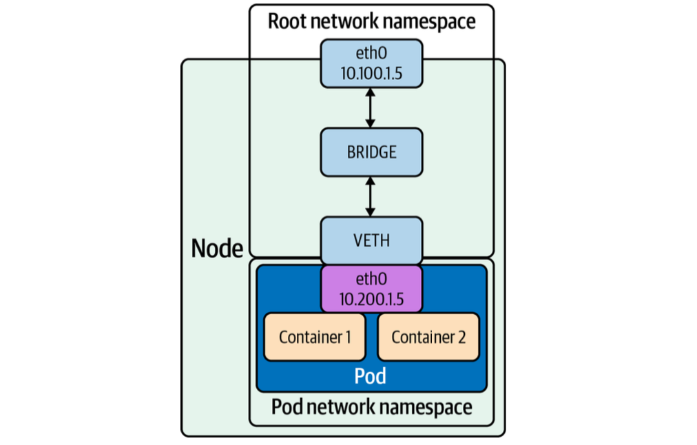
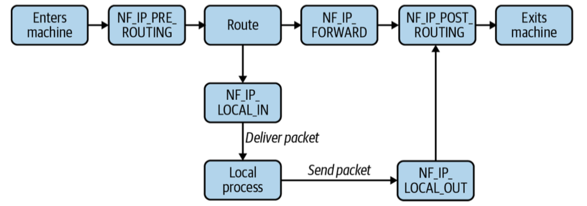
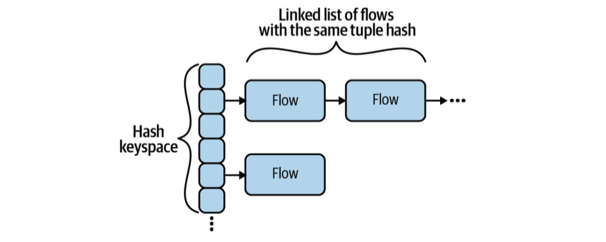

# 2. Linux Networking

!!! info "Source Attribution"

    The primary source and original content for this page originate from [the **Networking & Kubernetes - A Layered Approach** by James Strong and Vallery Lancey](https://www.oreilly.com/library/view/networking-and-kubernetes/9781492081647/). Please refer to [the Networking and Kubernetes Code Examples repo](https://github.com/strongjz/Networking-and-Kubernetes) to follow code examples.

This chapter will provide an overview of the Linux networking stack, with a focus on areas of note in Kubernetes.

## Basics

In [the first chapter](./01-networking-introduction.md), the Golang web server is running on the local machine. To run this server on an external Linux machine, this program needs to:

- listen to an address and port
- create a socket for that address and port and binds them to the program
- The socket will receive requests addressed to both the specified address and port - 8080 with any IP address in our case (1).
    { .annotate }

    1.  `0.0.0.0` in IPv4 and `[::]` in IPv6 are wildcard addresses, allowing the program to listen on all available IP addresses when used for a socket binding. This is **useful to expose a service, without prior knowledge of what IP addresses the machines running it will have**. Most network exposed services bind this way.

The kernel maps a given packet to a specific connection and uses an internal state machine to manage the connection state. {==Linux represents each connection with a file==}. Accepting a connection entails a notification from the
kernel to our program, which is then able to {==stream content to and from the file==}.

Use `strace` command to inspect what the server is doing. `strace` captures all the system calls made by our server, there is a lot of output. Run the below command on the server side:

``` bash
go build web-server.go
strace ./web-server
```

Then send a cURL request from the client:
``` bash
curl -vvv 192.168.8.149:8080
*   Trying 192.168.8.149:8080...
* Connected to 192.168.8.149 (192.168.8.149) port 8080
> GET / HTTP/1.1
> Host: 192.168.8.149:8080
> User-Agent: curl/8.7.1
> Accept: */*
>
* Request completely sent off
< HTTP/1.1 200 OK
< Date: Sun, 10 May 2026 22:46:29 GMT
< Content-Length: 5
< Content-Type: text/plain; charset=utf-8
<
* Connection #0 to host 192.168.8.149 left intact
Hello%
```

You will see `strace` logs on the server side (scroll to the left on the code block to find the annotation button):

``` bash hl_lines="5 7 9 13 16 19 33"
execve("./web-server", ["./web-server"], 0x7ffe39a09850 /* 65 vars */) = 0
brk(NULL)                               = 0x117c7000
... 
uname({sysname="Linux", nodename="clicknam-HP-EliteDesk-800-G3-DM-35W", ...}) = 0
socket(AF_INET6, SOCK_STREAM|SOCK_CLOEXEC|SOCK_NONBLOCK, IPPROTO_MPTCP) = 3 #(1)!
setsockopt(3, SOL_IPV6, IPV6_V6ONLY, [0], 4) = 0
openat(AT_FDCWD, "/proc/sys/net/core/somaxconn", O_RDONLY|O_CLOEXEC) = 4 # (3)!
...
eventfd2(0, EFD_CLOEXEC|EFD_NONBLOCK)   = 6 # (5)!
epoll_ctl(5, EPOLL_CTL_ADD, 6, {events=EPOLLIN, data=0x9af3c0}) = 0
...
epoll_ctl(5, EPOLL_CTL_DEL, 4, 0x3f8284ff0964) = 0
close(4)                                = 0 # (4)!
setsockopt(3, SOL_SOCKET, SO_REUSEADDR, [1], 4) = 0
bind(3, {sa_family=AF_INET6, sin6_port=htons(8080), sin6_flowinfo=htonl(0), inet_pton(AF_INET6, "::", &sin6_addr), sin6_scope_id=0}, 28) = 0
listen(3, 4096)                         = 0 # (2)!
epoll_ctl(5, EPOLL_CTL_ADD, 3, {events=EPOLLIN|EPOLLOUT|EPOLLRDHUP|EPOLLET, data=0x3880536177000002}) = 0
...
accept4(3, {sa_family=AF_INET6, sin6_port=htons(64455), sin6_flowinfo=htonl(0), inet_pton(AF_INET6, "::ffff:192.168.8.107", &sin6_addr), sin6_scope_id=0}, [112 => 28], SOCK_CLOEXEC|SOCK_NONBLOCK) = 4 # (6)!
epoll_ctl(5, EPOLL_CTL_ADD, 4, {events=EPOLLIN|EPOLLOUT|EPOLLRDHUP|EPOLLET, data=0x3880536176000001}) = 0
getsockname(4, {sa_family=AF_INET6, sin6_port=htons(8080), sin6_flowinfo=htonl(0), inet_pton(AF_INET6, "::ffff:192.168.8.149", &sin6_addr), sin6_scope_id=0}, [112 => 28]) = 0
setsockopt(4, SOL_TCP, TCP_NODELAY, [1], 4) = 0
setsockopt(4, SOL_SOCKET, SO_KEEPALIVE, [1], 4) = 0
setsockopt(4, SOL_TCP, TCP_KEEPIDLE, [15], 4) = 0
setsockopt(4, SOL_TCP, TCP_KEEPINTVL, [15], 4) = 0
setsockopt(4, SOL_TCP, TCP_KEEPCNT, [9], 4) = 0
futex(0x3f8285080160, FUTEX_WAKE_PRIVATE, 1) = 1
accept4(3, 0x3f8284ff0afc, [112], SOCK_CLOEXEC|SOCK_NONBLOCK) = -1 EAGAIN (Resource temporarily unavailable)
epoll_pwait(5, [{events=EPOLLOUT, data=0x3880536176000001}], 128, 0, NULL, 0) = 1
epoll_pwait(5, [{events=EPOLLIN|EPOLLOUT|EPOLLRDHUP, data=0x3880536176000001}], 128, -1, NULL, 0) = 1
futex(0x990cc0, FUTEX_WAKE_PRIVATE, 1)  = 1
futex(0x3f8284fe6d38, FUTEX_WAKE_PRIVATE, 1) = 1
read(4, "", 4096)                       = 0 # (7)!
epoll_ctl(5, EPOLL_CTL_DEL, 4, 0x3f828512b92c) = 0
close(4)                                = 0
epoll_pwait(5, [], 128, 0, NULL, 0)     = 0
```

1.  `socket(...) = 3`: Your Go server creates a socket to listen for incoming connections. The kernel assigns **FD 3** to this socket. This remains open as long as your server is running.
2.  `listen(3, 4096) = 0`: The main listener associated with the `FD 3` socket.
3.  `openat(...) = 4`: The Go runtime opens a system file to check the maximum connection limit. It gets **FD 4**, reads the value ("4096").
4.  `close(4) = 0` The `somaxconn` file is immediately closed to free up the file descriptor 4.
5.  - `epoll_create1(EPOLL_CLOEXEC) = 5`
    - `eventfd2(0, EFD_CLOEXEC|EFD_NONBLOCK) = 6`
    Go sets up its "Netpoller" (high-performance event loop). **FD 5** is used to monitor all other sockets, and **FD 6** is a tiny internal counter used for cross-thread notifications.
6.  `accept4(...) = 4`: A client at `192.168.8.107` connected. The server accepted it and assigned it **FD 4** (reusing the number that was previously freed from the `somaxconn` file).
7.  `read(4, "", 4096) = 0`: a read of **0 bytes** means the client has **closed the connection**.


When we make a request to our listening server, we see the following from our server process:

``` bash
accept4(3, {sa_family=AF_INET6, sin6_port=htons(64455), sin6_flowinfo=htonl(0), inet_pton(AF_INET6, "::ffff:192.168.8.107", &sin6_addr), sin6_scope_id=0}, [112 => 28], SOCK_CLOEXEC|SOCK_NONBLOCK) = 4
epoll_ctl(5, EPOLL_CTL_ADD, 4, {events=EPOLLIN|EPOLLOUT|EPOLLRDHUP|EPOLLET, data=0x3880536176000001}) = 0
getsockname(4, {sa_family=AF_INET6, sin6_port=htons(8080), sin6_flowinfo=htonl(0), inet_pton(AF_INET6, "::ffff:192.168.8.149", &sin6_addr), sin6_scope_id=0}, [112 => 28]) = 0
setsockopt(4, SOL_TCP, TCP_NODELAY, [1], 4) = 0
setsockopt(4, SOL_SOCKET, SO_KEEPALIVE, [1], 4) = 0
setsockopt(4, SOL_TCP, TCP_KEEPIDLE, [15], 4) = 0
setsockopt(4, SOL_TCP, TCP_KEEPINTVL, [15], 4) = 0
setsockopt(4, SOL_TCP, TCP_KEEPCNT, [9], 4) = 0
futex(0x3f8285080160, FUTEX_WAKE_PRIVATE, 1) = 1
accept4(3, 0x3f8284ff0afc, [112], SOCK_CLOEXEC|SOCK_NONBLOCK) = -1 EAGAIN (Resource temporarily unavailable)
```

To summarize what the server is doing when it receives a request:

1. Epoll returns and causes the program to resume.
1. The server sees a connection from `::ffff:192.168.8.107`, the client IP address in this example.
1. The server inspects the socket.
1. The server changes `KEEPALIVE` options: it turns `KEEPALIVE` on, and sets a 180-second interval between `KEEPALIVE` probes.

---
## The Network Inferface

Computers use a **network interface to communicate with the outside world**. Network interfaces can be physical (e.g., an Ethernet network controller) or virtual. IP addresses are assigned to network interfaces. A typical interface may have one IPv4 address and one IPv6 address, but multiple addresses can be assigned. The **loopback interface** is a special interface for **same-host communication**. `127.0.0.1` is the standard IP address for the loopback interface.

Run `ifconfig` to see a list of all network interfaces and their configurations:
``` bash
ifconfig

eno1: flags=4163<UP,BROADCAST,RUNNING,MULTICAST>  mtu 1500 # (1)!
        inet 192.168.8.104  netmask 255.255.255.0  broadcast 192.168.8.255
        inet6 fe80::12e7:c6ff:fe0f:bfab  prefixlen 64  scopeid 0x20<link>
        ether 10:e7:c6:0f:bf:ab  txqueuelen 1000  (Ethernet)
        RX packets 427243  bytes 462530820 (462.5 MB)
        RX errors 0  dropped 2  overruns 0  frame 0
        TX packets 125259  bytes 33247553 (33.2 MB)
        TX errors 0  dropped 0 overruns 0  carrier 0  collisions 0
        device interrupt 16  memory 0xdca00000-dca20000

lo: flags=73<UP,LOOPBACK,RUNNING>  mtu 65536 # (3)!
        inet 127.0.0.1  netmask 255.0.0.0
        inet6 ::1  prefixlen 128  scopeid 0x10<host>
        loop  txqueuelen 1000  (Local Loopback)
        RX packets 2057  bytes 258483 (258.4 KB)
        RX errors 0  dropped 0  overruns 0  frame 0
        TX packets 2057  bytes 258483 (258.4 KB)
        TX errors 0  dropped 0 overruns 0  carrier 0  collisions 0

wlp1s0: flags=4163<UP,BROADCAST,RUNNING,MULTICAST>  mtu 1500 # (2)!
        inet 192.168.8.149  netmask 255.255.255.0  broadcast 192.168.8.255
        inet6 fe80::7048:a239:3307:10eb  prefixlen 64  scopeid 0x20<link>
        ether d4:6d:6d:70:f3:00  txqueuelen 1000  (Ethernet)
        RX packets 3391  bytes 565850 (565.8 KB)
        RX errors 0  dropped 1  overruns 0  frame 0
        TX packets 2928  bytes 299000 (299.0 KB)
        TX errors 0  dropped 0 overruns 0  carrier 0  collisions 0
```

1.  `eno1`
    - `e` stands for **Ethernet**.
    - `no` stands for **onboard**. This is usually refers to the built-in port on the motherboard.
    - `1` is the index number of the port.
2.  `wlp1s0`
    - `w` stands for **Wireless**.
    - `l` stands for **Lan**.
    - `p1s0` refers to the physical location of the Wi-Fi card on the PCI bus(**p**us **1**, **s**lot **0**).
3.  `lo`: The lookback interface. It allows the computer to talk to itself at `127.0.0.1` or `::1`.


---
## The Bridge Interface



The bridge functions like a network switch between network interfaces on a host, seamlessly connecting them. Bridges allow pods, with their individual network interfaces, to interact with the broader network via the node's network interface.

### Creating bridge interface and connecting veth pair

Add a new bridge interface named `br0`:
``` bash
sudo ip link add br0 type bridge
```

Verify `br0` is created:
``` bash
ip link show br0

4: br0: <BROADCAST,MULTICAST> mtu 1500 qdisc noop state DOWN mode DEFAULT group default qlen 1000
    link/ether 06:a2:b1:32:ee:2a brd ff:ff:ff:ff:ff:ff
```

Connect `wlp1s0` and `veth` to the bridge `br0`:
``` bash
ip link set eth0 master br0
ip link set veth master br0
```

The veth device is a local Ethernet tunnel. Veth devices are created in pairs. In the above image, the pod sees an `eth0` interface from the veth. Packets transmitted on one device in the pair are immediately received on the other device. 

Follow the below `ip` commands to create veth devices:
``` bash
ip netns add net1 # (1)!
ip netns add net2 # (2)!
ip link add veth1 netns net1 type veth peer name veth2 netns net2 # (3)!
```

1.  create a namespace named `net1`
2.  create a namespace named `net2`
3.  create a pair of veth devices
    - `veth1` is assigned to namespace `net1`
    - `veth2` is assigned to namespace `net2`
    - These two namespaces are connected with this veth pair.

Assign a pair of IP addresses, and you can ping and communicate between the two namespaces. Kubernetes uses this in concert with the CNI project to manage container network namespaces, interfaces, and IP addresses. We will cover more of this in the next chapter.


---
## Packet Handling in the Kernel

The Linux kernel is responsible for translating between packets, and a coherent stream of data for programs.

### Netfilter

Netfilter is a framework of kernel hooks, which allow userspace programs to handle packets on behalf of the kernel. 

The way Netfilter works is:

- A program registers to a specific Netfilter hook.
- The kernel calls that program on applicable packets.
- That program could tell the kernel to do something with the packet(e.g. drop it), or it could send back a modified packet to the kernel.

Netfilter has **five hooks**, as shown below:

| Netfilter hook | Iptables chain name | Description |
| :--- | :--- | :--- |
| `NF_IP_PRE_ROUTING` | `PREROUTING` | Triggers when a packet arrives from an external system. |
| `NF_IP_LOCAL_IN` | `INPUT` | Triggers when a packet's destination IP address matches this machine. |
| `NF_IP_FORWARD` | `FORWARD` | Triggers for packets where neither source nor destination matches the machine's IP addresses (in other words, packets that this machine is routing on behalf of other machines). |
| `NF_IP_LOCAL_OUT` | `OUTPUT` | Triggers when a packet, originating from the machine, is leaving the machine. |
| `NF_IP_POST_ROUTING` | `POSTROUTING` | Triggers when any packet (regardless of origin) is leaving the machine. |

Netfilter triggers each hook during a specific phase of packet handling, and under specific conditions:



Below table shows the Netfliter hook order for various packet sources and destinations.=:

| Packet source | Packet destination | Hooks (in order) |
| :--- | :--- | :--- |
| Local machine | Local machine | `NF_IP_LOCAL_OUT` -> `NF_IP_POST_ROUTING` -> `NF_IP_PRE_ROUTING` ->  `NF_IP_LOCAL_IN` |
| Local machine | External machine | `NF_IP_LOCAL_OUT` -> `NF_IP_POST_ROUTING`  |
| External machine | Local machine | `NF_IP_PRE_ROUTING` -> `NF_IP_LOCAL_IN` |
| External machine | External machine | `NF_IP_PRE_ROUTING` -> `NF_IP_FORWARD` -> `NF_IP_POST_ROUTING` |

Programs can register a hook by calling `NF_REGISTER_NET_HOOK` with a handling function. The hook will be called every time a
packet matches. This is how programs like `iptables` integrate with Netfilter.

**Actions** that a Netfilter hook can trigger:

- `Accept`: Continue packet handling.
- `Drop`: Drop the packet, without further processing.
- `Queue`: Pass the packet to a userspace program.
- `Stolen`: Doesn't execute further hooks, and allows the userspace program to take ownership of the packet.
- `Repeat`: Make the packet reenter the hook and be reprocessed.

Hooks can also return **mutated packets**. This allows programs to do things such as reroute or masquerade packets, adjust packet TTLs, etc.

### Conntrack

Conntrack is a component of Netfilter used to **track the state of connections** to (and from) the machine. Conntrack identifies connections by a tuple - (`source address`, `source port`, `destination address`, `destination port`, `L4 protocol(TCP||UDP)`), the minimal identifiers needed to identify any given L4 connection. Conntrack refers to these connections as *flows*. A flow contains metadata about the connection and its state.



The above diagram illustrates how the Linux kernel organizes the Conntrack table in memory using a **hash table with chaining**.

1. **Hash Keyspace(The Buckets)**
    - The vertical column of squares represents the Hash Table.
    - The number of squares(buckets) is determined by the `hashsize` parameter (normally set in `/sys/module/nf_conntrack/parameters/hashsize`).
    - When a packet arrives, the kernel takes the tuple and runs it through a hash fuction. This function returns a number that corresponds to one of these buckets.
2. **Linked List of Flows (The Chaining)**
    - The horizontal boxes labeled flow represent the actual connection records.
    - Because the hash keyspace is limited, two completely different connections might occasionally hash to the exact same bucket.
    - Instead of overwriting the old connection, the kernel simply chains the new connection to the existing one using a **Linked List**.

The total number of concurrent connections is normally set in `/proc/sys/net/nf_conntrack_max`. A system that experiences a huge number of connections will run out of space. If your host runs directly exposed to the internet, overwhelming Conntrack with short-lived or incomplete connections is an easy way to cause a denial of service (DOS).

Conntrack entries contain a connection state, which is one of four states.

| State | Description | Example |
| :--- | :--- | :--- |
| NEW | A valid packet is sent or received, with no response seen.  | TCP SYN received. |
| ESTABLISHED | Packets observed in both directions.   | TCP SYN received, and TCP SYN/ACK sent. |
| RELATED | An additional connection is opened, where metadata indicates that it is "related" to an original connection. Related connection handling is complex.  | An FTP program, with an ESTABLISHED connection, opens additional data connections. |
| INVALID | The packet itself is invalid, or does not properly match another Conntrack connection state.  | TCP RST received, with no prior connection. |

Conntrack serves as the foundational source of truth for both **firewalls** and **NAT**. Without it, modern networking would be significantly more complex and less secure.

1. **Conntrack for Firewalls (Stateful Inspection)**
    - When a packet hits a firewall rule, the kernel checks the Conntrack table to see if this packet belongs to a "Flow" that has already been validated.
2. **Conntrack for NAT**
    - When the router changes a Source IP (SNAT) or a Destination IP (DNAT), it must apply that exact same change to every subsequent packet in that flow.
    - When a response comes back from the internet, the router needs to know which internal machine to send it to.
        - The router looks at the incoming packet.
        - It checks the Conntrack table for a matching entry.
        - It **finds the original mapping and un-does the NAT**, restoring the original IP so your computer can understand the packet.

In the Kubernetes, `kube-proxy` uses `iptables` and Conntrack to handle Service load balancing. When a Pod talks to a Service ClusterIP, Conntrack is used to ensure that all packets for that specific request go to the same backend Pod.

### Routing

When handling any packet, the kernel must decide where to send that packet. The route table tells you where the packet is passed to as the next hop. 

``` bash
route -n

Kernel IP routing table
Destination     Gateway         Genmask         Flags Metric Ref    Use Iface
0.0.0.0         192.168.8.1     0.0.0.0         UG    100    0        0 eno1
0.0.0.0         192.168.8.1     0.0.0.0         UG    600    0        0 wlp1s0
192.168.8.0     0.0.0.0         255.255.255.0   U     100    0        0 eno1
192.168.8.0     0.0.0.0         255.255.255.0   U     600    0        0 wlp1s0
```

For example, a request to `1.2.3.4` would be sent to `192.168.8.1` on the `eno1` or `wlp1s0` interface.

!!! Question "What does a Gateway of `0.0.0.0` mean?"

    In a routing table, a gateway of `0.0.0.0` (often shown as `*`) indicates that the destination is **directly connected** to the local network segment.

    - **No Next-Hop Router:** The kernel does not need to forward the packet to an intermediate gateway to reach the destination.
    - **Direct Delivery:** The system will use **ARP** (Address Resolution Protocol) to find the MAC address of the destination IP directly on the local link and deliver the frame straight to it.

---
## High-Level Routing

This section will cover the three tools that are most commonly seen in Kubernetes. All Kubernetes setups will make some use of `iptables`, but there are many ways that services can be managed. We will also cover `IPVS`
(which has built-in support in `kube-proxy`), and `eBPF`, which is used by Cilium (a `kube-proxy` alternative).

### iptables


You can list the chains that correspond to a table yourself, with `iptables -L -t <table>`:
``` bash
sudo iptables -L -t filter

[sudo: authenticate] Password:
Chain INPUT (policy ACCEPT)
target     prot opt source               destination

Chain FORWARD (policy ACCEPT)
target     prot opt source               destination

Chain OUTPUT (policy ACCEPT)
```

### IPVS


### eBPF


---
## Network Troubleshooting Tools


### Security Warning

### ping

### traceroute

### dig

### telnet

### nmap


### netstat


### netcat


### Openssl


### cURL


---
## Conclusion