# 3. Container Networking Basics


## Introduction to Containers

In this section, we will discuss the evolution of running applications that has led us to containers.

### Applications

There is the historical and operational friction between developers and system admins when deploying and operating multiple applications in a single OS.

**The Core Conflict: Stability vs Agility**

- **Deployment Friction**: Fragmented workflows, library version conflicts, and custom Bash scripts make application deployments inconsistent and difficult for new developers to learn.
- **Organizational Tension**: SysAdmins prioritize **system stability** and high resource utilization, while developers prioritize **feature velocity**.

**The Networking & Infra Bottleneck**

- **The Single Stack Problem**: A general-purpose OS has only one TCP/IP stack. When multiple applications are hosted on one machine to increase efficiency, they inevitably clash over **port availability**.
- **Coordination Overhead**: Managing these port conflicts requires constant, manual coordination between developers, sysadmins, and network engineers.

**The Evolution of the Solution**

- **The Shared Kernel**: Because a general-purpose kernel tries to support everything (drivers, protocols, schedulers), it becomes a crowded environment for competing applications.
- **The Shift to Virtualization**: **Hypervisors** emerged as the primary solution to these problems, allowing a single physical host to run multiple independent operating systems and networking stacks, thereby eliminating port conflicts and improving overall machine utilization.

### Hypervisor

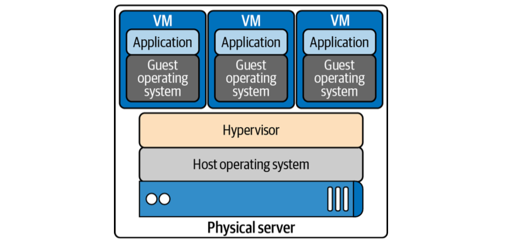

A hypervisor allows system administrators to share the underlying hardware with multiple guest operating systems. This resource sharing **increases the host machine's efficiency**, alleviating one of the sysadmins issues. Hypervisors also gave each application development team a separate networking stack, **removing the port conflict issues**. 

**Library versions, deployment, and other issues remain for the application developer**. How can they package and deploy everything their application needs while maintaining the efficiency introduced by the hypervisor and virtual machines? This concern led to the development of containers.

### Containers

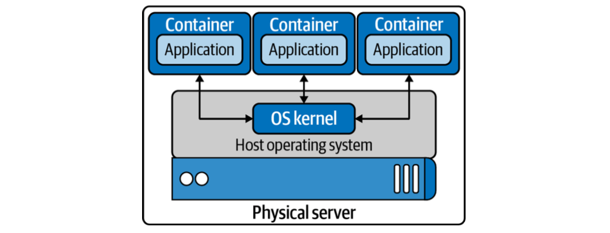

each container is independent. 

- Application developers can use whatever they need to run their application **without relying on underlying libraries** or host operating systems. 
- Each container also has **its own network stack**.

#### Terms associated with container

- **Container**: A running container image
- **Image**: A container image is the file that is pulled down from a registry server and used locally as a mount point when starting a container.
- **Container engine**: A container engine accepts user requests via command-line options to pull images and run a container.
- **Container runtime**: The container runtime is the low-level piece of software in a container engine that deals with running a container.
- **Base image**: A starting point for container images; to reduce build image sizes and complexity, users can start with a base image and make incremental changes on top of it.
- **Image layer**: Repositories are often referred to as images or container images, but actually they are made up of one or more layers. Image layers in a repository are connected in a parent-child relationship. Each image layer represents changes between itself and the parent layer.
- **Image format**: Container engines have their own container image format, such as LXD, RKT, and Docker.
- **Registry**: A registry stores container images and allows for users to upload, download, and update container images.
- **Repository**: Repositories can be equivalent to a container image. The important distinction is
that repositories are made up of layers and metadata about the image; this is the manifest.
- **Tag**: A tag is a user-defined name for different versions of a container image.
- **Container host**: The container host is the system that runs the container with a container engine.
- **Container orchestration**: This is what Kubernetes does! It dynamically schedules container workloads for a cluster of container hosts.

#### A list of high and low functionality

Low-level container runtime functionality:

- Creating containers
- Running containers
- examples: *LXC*, *runC*

High-level container runtime functionality:

- Formatting container images
- Building container images
- Managing container images
- Managing instances of containers
- Sharing container images
- examples: *containerd*, *CRI-O*, *Docker*, *lmctfy*, *rkt*

#### OCI

**The Open Container Initiative (OCI) promotes common, minimal, open standards, and specifications for container technology**. The idea for creating a formal specification for container image formats and runtimes **allows a container to be portable across all major operating systems and platforms** to ensure no undue technical barriers.

#### Docker

Docker, released in 2013, solved many of the problems that developers had running containers end to end. It has all this functionality for developers to create, maintain, and deploy containers. 

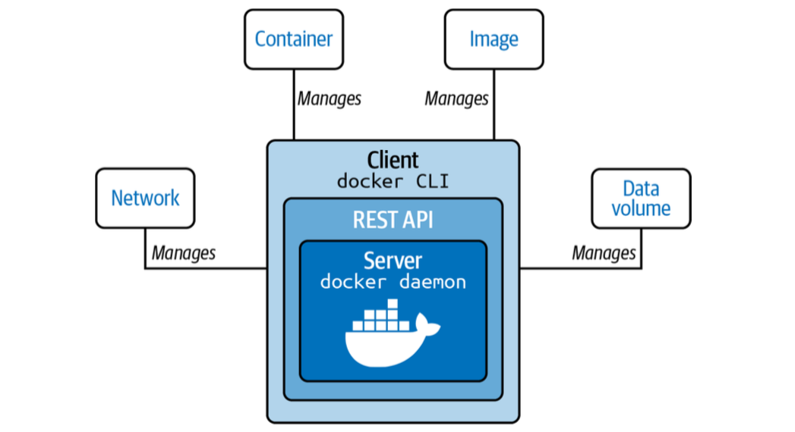

Docker began as a monolith application, building all the previous functionality into a single binary known as the Docker engine. The engine contained the Docker client or CLI that allows developers to build, run, and push containers and images. In the past few years, Docker has broken apart this monolith into separate components. It allows the developers to focus on building their apps, and system admins focus on deployment.

#### CRI-O

CRI-O is an OCI-based implementation of the Kubernetes Container Runtime Interface(CRI). The CRI-O is a lightweight CRI runtime made as a Kubernetes-specific high-level runtime built on gRPC and Protobuf over a UNIX socket. The below diagram points out where the CRI fits into the whole picture with the Kubernetes architecture.

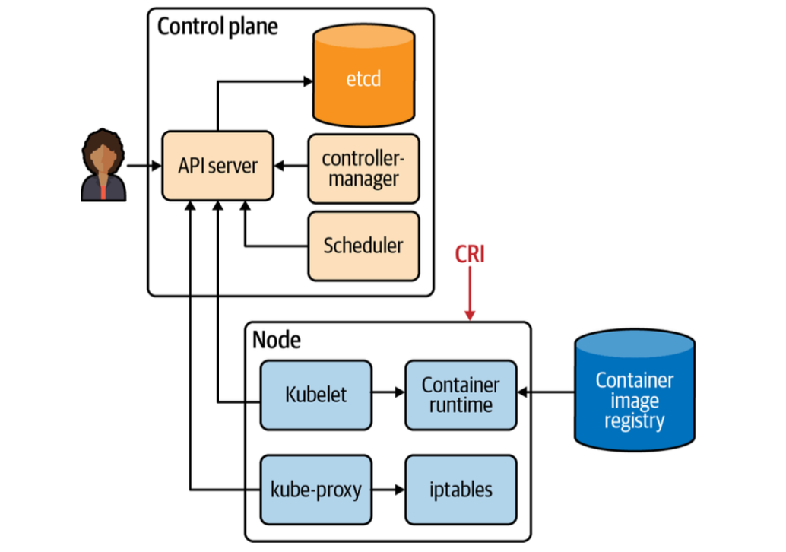

---

## Container Primitives

No matter if you are using Docker or containerd, runC starts and manages the actual containers for them. In this section, we will review what runC takes care of for developers from a container perspective. Each of our containers has Linux primitives known as *control groups* and *namespaces*.

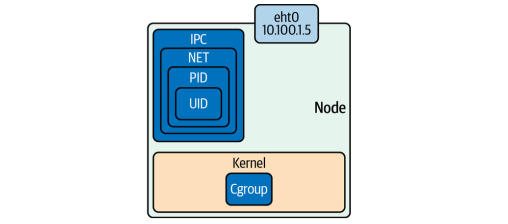

cgroups control access to resources in the kernel for our containers, and namespaces are individual slices of resources to manage separately from the root namespaces, i.e., the host.

### Control Groups

In short, a cgroup is a Linux kernel feature that limits, accounts for, and **isolates resource usage**. cgroups allow administrators to control different CPU systems and memory for particulate processes. These separate subsystems maintain various cgroups in the kernel:

- CPU: The process can be guaranteed a minimum number of CPU shares.
- Memory: set up memory limits for a process.
- Disk I/O: This and other devices are controlled via the device's cgroup subsystem.
- Network: This is maintained by the `net_cls` and marks packets leaving the cgroup.

`lscgroup` is a command-line tool that lists all the cgroups currently in the system. runC will create the cgroups for the container at creation time. **A cgroup controls how much of a resource a container can use**, while **namespaces control what processes inside the container can see**.

### Namespaces

Namespaces are features of the Linux kernel that isolate and virtualize system resources of a collection of processes. Here are examples of virtualized resources:

- **PID namespace(pid)**: Processes ID, for process isolation
- **Network namespace(net)**: Manages network interfaces and a separate networking stack
- **IPC namespace(ipc)**: Manages access to interprocess communication (IPC) resources
- **Mount namespace(mnt)**: Manages filesystem mount points
- **UTS namespace(uts)**: UNIX time-sharing; allows single hosts to have different host and domain names for different processes
- **UID namespaces(user)**: User ID; isolates process ownership with separate user and group assignments

Below commands are an example of how to inspect the namespaces for a process:

``` bash
sudo ps -p 1 -o pid,pidns
[sudo: authenticate] Password:
    PID      PIDNS
      1 4026531836

sudo ls -l /proc/1/ns
total 0
lrwxrwxrwx 1 root root 0 May 16 16:44 cgroup -> 'cgroup:[4026531835]'
lrwxrwxrwx 1 root root 0 May 16 16:44 ipc -> 'ipc:[4026531839]'
lrwxrwxrwx 1 root root 0 May 10 17:33 mnt -> 'mnt:[4026531832]'
lrwxrwxrwx 1 root root 0 May 16 16:44 net -> 'net:[4026531833]'
lrwxrwxrwx 1 root root 0 May 10 17:33 pid -> 'pid:[4026531836]'
lrwxrwxrwx 1 root root 0 May 16 16:45 pid_for_children -> 'pid:[4026531836]'
lrwxrwxrwx 1 root root 0 May 16 16:44 time -> 'time:[4026531834]'
lrwxrwxrwx 1 root root 0 May 16 16:45 time_for_children -> 'time:[4026531834]'
lrwxrwxrwx 1 root root 0 May 10 17:33 user -> 'user:[4026531837]'
lrwxrwxrwx 1 root root 0 May 16 16:44 uts -> 'uts:[4026531838]'
```

- All information for a process is on the `/proc` filesystem in Linux.
- **Direct check**: The first command (`ps -p 1 -o pid,pidns`) explicitly asked the kernel for the PID Namespace ID associated with process 1. The result was `4026531836`.
- **Cross-Reference**: The second command (`ls -l /proc/1/ns`) lists the **Namespace Inodes** that define the isolation boundaries for PID 1. A number in the squared bracket is called inode. The target of the `pid ` link matches the previous result exactly: `pid:[4026531836]`.

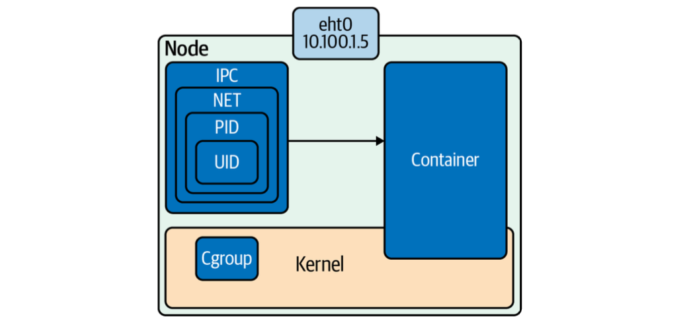

The above illustrates how a container is constructed within a Linux node by using **namespaces** (IPC, NET, PID, UID) to provide an isolated environment and **cgroups** to manage and limit its resource consumption at the kernel level.


### Setting Up Namespaces

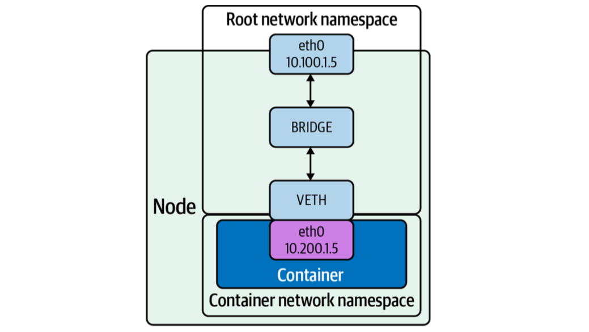

The above diagram outlines a basic container network setup. The following steps show how to create the networking setup shown in the above diagram:

1. Create a host with a root network namespace.
1. Create two new network namespaces.
1. Create veth pairs.
1. Move one side of the veth pair into a new network namespace.
1. Assign IP to one end of the virtual devices(veth).
1. Create a bridge interface.
1. Attach bridge to the host interface.
1. Attach one side of the veth pair to the bridge interface.
1. Test connectivity.


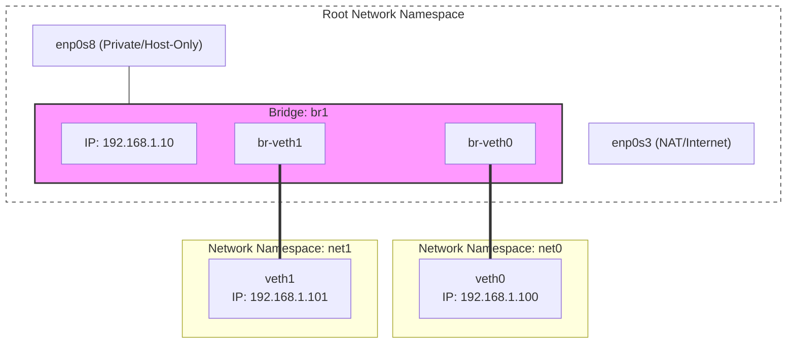

#### 1. Create a host with a root network namespace

!!! Warning

    Please refer to [the "Installation Guide for the Linux users" section in the "1. Networking Introduction" page](01-networking-introduction.md/#application) to set up the `ubuntu/xenial64` Virtual Machine to walk through the following instructions.


Access the command line of the VM via ssh connection:
``` bash
vagrant ssh
Welcome to Ubuntu 16.04.7 LTS (GNU/Linux 4.4.0-210-generic x86_64)
...
New release '18.04.6 LTS' available.
Run 'do-release-upgrade' to upgrade to it.


vagrant@ubuntu-xenial:~$
```

Verify the existing network interfaces in the root network namespace:
``` bash
$ ip link list
1: lo: <LOOPBACK,UP,LOWER_UP> mtu 65536 qdisc noqueue state UNKNOWN mode DEFAULT group default qlen 1
    link/loopback 00:00:00:00:00:00 brd 00:00:00:00:00:00
2: enp0s3: <BROADCAST,MULTICAST,UP,LOWER_UP> mtu 1500 qdisc pfifo_fast state UP mode DEFAULT group default qlen 1000
    link/ether 02:be:82:6b:cc:1d brd ff:ff:ff:ff:ff:ff
3: enp0s8: <BROADCAST,MULTICAST,UP,LOWER_UP> mtu 1500 qdisc pfifo_fast state UP mode DEFAULT group default qlen 1000
    link/ether 08:00:27:62:d1:bd brd ff:ff:ff:ff:ff:ff
```

- `enp0s3`: working as a NAT. This is the interface Vagrant uses to communicate with the VM from your host (e.g., via `vagrant ssh`). It also provides the VM with internet access so you can run `apt install` or `curl`.
- `enp0s8`: Private Network (Host-Only). This is a secondary interface you manually added to your `Vagrantfile`. Its goal is to create a private communication channel between your host machine and the VM (and potentially other VMs in the same group).


#### 2. Create two new network namespaces

``` bash
$ sudo ip netns list
$ sudo ip netns add net0
$ sudo ip netns add net1
$ sudo ip netns list
net1
net0
```

#### 3. Create veth pairs

``` bash
$ sudo ip link add veth0 type veth peer name br-veth0
$ sudo ip link add veth1 type veth peer name br-veth1
```

- `ip link add`: The instruction to create a new virtual network interface.
- `type veth`: Tells the kernel that this isn't a bridge or a VLAN, but specifically a **Virtual Ethernet pair**.
- `peer name`: A mandatory keyword for veth types. It tells the kernel, "I am about to define the other end of this cable."

``` bash
$ ip link list veth1
7: veth1@br-veth1: <BROADCAST,MULTICAST> mtu 1500 qdisc noop state DOWN mode DEFAULT group default qlen 1000
    link/ether a6:14:47:1f:86:0b brd ff:ff:ff:ff:ff:ff

$ ip link list veth0
5: veth0@br-veth0: <BROADCAST,MULTICAST> mtu 1500 qdisc noop state DOWN mode DEFAULT group default qlen 1000
    link/ether ce:e1:33:6f:b1:0a brd ff:ff:ff:ff:ff:ff
```

``` bash hl_lines="8-10 12-14"
$ ip link list
1: lo: <LOOPBACK,UP,LOWER_UP> mtu 65536 qdisc noqueue state UNKNOWN mode DEFAULT group default qlen 1
    link/loopback 00:00:00:00:00:00 brd 00:00:00:00:00:00
2: enp0s3: <BROADCAST,MULTICAST,UP,LOWER_UP> mtu 1500 qdisc pfifo_fast state UP mode DEFAULT group default qlen 1000
    link/ether 02:be:82:6b:cc:1d brd ff:ff:ff:ff:ff:ff
3: enp0s8: <BROADCAST,MULTICAST,UP,LOWER_UP> mtu 1500 qdisc pfifo_fast state UP mode DEFAULT group default qlen 1000
    link/ether 08:00:27:62:d1:bd brd ff:ff:ff:ff:ff:ff
4: br-veth0@veth0: <BROADCAST,MULTICAST,M-DOWN> mtu 1500 qdisc noop state DOWN mode DEFAULT group default qlen 1000
    link/ether de:6b:ef:ea:0f:e6 brd ff:ff:ff:ff:ff:ff
5: veth0@br-veth0: <BROADCAST,MULTICAST,M-DOWN> mtu 1500 qdisc noop state DOWN mode DEFAULT group default qlen 1000
    link/ether ce:e1:33:6f:b1:0a brd ff:ff:ff:ff:ff:ff # (1)!
6: br-veth1@veth1: <BROADCAST,MULTICAST,M-DOWN> mtu 1500 qdisc noop state DOWN mode DEFAULT group default qlen 1000
    link/ether 86:e6:af:fc:d7:66 brd ff:ff:ff:ff:ff:ff
7: veth1@br-veth1: <BROADCAST,MULTICAST,M-DOWN> mtu 1500 qdisc noop state DOWN mode DEFAULT group default qlen 1000
    link/ether a6:14:47:1f:86:0b brd ff:ff:ff:ff:ff:ff # (2)!
```

1.  Both sides of the virtual ethernet cable(`veth0@br-veth0` and `br-veth0@veth0` interfaces) appear in the root network namepsaces.
2.  Both sides of the virtual ethernet cable(`veth1@br-veth1` and `br-veth1@veth1` interfaces) appear in the root network namepsaces.

#### 4. Move one side of the veth pair into a new network namespace

Move `veth0` into `net0` namespace, and `veth1` into `net1`:
``` bash
$ sudo ip link set veth0 netns net0
$ sudo ip link set veth1 netns net1
```

Examine the `net1` and `net0` network namespaces. 

``` bash
$ sudo ip netns exec net1 ip link list veth1
7: veth1@if6: <BROADCAST,MULTICAST> mtu 1500 qdisc noop state DOWN mode DEFAULT group default qlen 1000
    link/ether a6:14:47:1f:86:0b brd ff:ff:ff:ff:ff:ff link-netnsid 0

$ sudo ip netns exec net0 ip link list veth0
5: veth0@if4: <BROADCAST,MULTICAST> mtu 1500 qdisc noop state DOWN mode DEFAULT group default qlen 1000
    link/ether ce:e1:33:6f:b1:0a brd ff:ff:ff:ff:ff:ff link-netnsid 0
```

``` bash hl_lines="8-11"
$ ip link list
1: lo: <LOOPBACK,UP,LOWER_UP> mtu 65536 qdisc noqueue state UNKNOWN mode DEFAULT group default qlen 1
    link/loopback 00:00:00:00:00:00 brd 00:00:00:00:00:00
2: enp0s3: <BROADCAST,MULTICAST,UP,LOWER_UP> mtu 1500 qdisc pfifo_fast state UP mode DEFAULT group default qlen 1000
    link/ether 02:be:82:6b:cc:1d brd ff:ff:ff:ff:ff:ff
3: enp0s8: <BROADCAST,MULTICAST,UP,LOWER_UP> mtu 1500 qdisc pfifo_fast state UP mode DEFAULT group default qlen 1000
    link/ether 08:00:27:62:d1:bd brd ff:ff:ff:ff:ff:ff
4: br-veth0@if5: <BROADCAST,MULTICAST> mtu 1500 qdisc noop state DOWN mode DEFAULT group default qlen 1000
    link/ether de:6b:ef:ea:0f:e6 brd ff:ff:ff:ff:ff:ff link-netnsid 0
6: br-veth1@if7: <BROADCAST,MULTICAST> mtu 1500 qdisc noop state DOWN mode DEFAULT group default qlen 1000
    link/ether 86:e6:af:fc:d7:66 brd ff:ff:ff:ff:ff:ff link-netnsid 1
```

- Since `veth0` and `veth1` are moved out of the root network namespace, you no longer see `veth0@br-veth0` and `veth1@br-veth1` interfaces in the root network namespace. 
- But the other end of the virtual ethernet cables(`br-veth0@if5` and `br-veth1@if7`) still exist there.
- Note the interface naming has been chagned from `br-veth0@veth0` to `br-veth0@if5`. Since `veth0` is moved to `net0` network namespace, the root namespace no longer has a device named `veth0`. Even though the name `veth0` is now hidden inside a namespace, its unique ID in the kernel's master table is still **5**. The notation `br-veth0@if5` is the kernel saying: "I am connected to an interface that has index 5, but I can't tell you its name because it's in another namespace."


#### 5. Assign IP to one end of the virtual devices(veth)

Gives the `veth0` and `veth1` interface its IP address:

``` bash
$ sudo ip netns exec net0 ip addr add "192.168.1.100/24" dev veth0
$ sudo ip netns exec net1 ip addr add "192.168.1.101/24" dev veth1
```

- `ip netns exec net0`: "Run the following command inside the `net0` network namespace.
- `ip addr add "192.168.1.100/24"`: Assign `192.168.1.100/24` to the network interface.
- `dev veth0`: Specifies the **dev**ice (interface) to which the IP should be attached.

Turn on the `veth0` and `veth1`:
``` bash
$ sudo ip netns exec net0 ip link set dev veth0 up
$ sudo ip netns exec net1 ip link set dev veth1 up
```

- `ip link set`: The command used to modify the properties or state of a network link/interface.

Verify the changed state for both `veth0` and `veth1` interfaces:
``` bash
$ sudo ip netns exec net0 ip link list
1: lo: <LOOPBACK> mtu 65536 qdisc noop state DOWN mode DEFAULT group default qlen 1
    link/loopback 00:00:00:00:00:00 brd 00:00:00:00:00:00
5: veth0@if4: <NO-CARRIER,BROADCAST,MULTICAST,UP> mtu 1500 qdisc noqueue state LOWERLAYERDOWN mode DEFAULT group default qlen 1000
    link/ether ce:e1:33:6f:b1:0a brd ff:ff:ff:ff:ff:ff link-netnsid 0

$ sudo ip netns exec net1 ip link list
1: lo: <LOOPBACK> mtu 65536 qdisc noop state DOWN mode DEFAULT group default qlen 1
    link/loopback 00:00:00:00:00:00 brd 00:00:00:00:00:00
7: veth1@if6: <NO-CARRIER,BROADCAST,MULTICAST,UP> mtu 1500 qdisc noqueue state LOWERLAYERDOWN mode DEFAULT group default qlen 1000
    link/ether a6:14:47:1f:86:0b brd ff:ff:ff:ff:ff:ff link-netnsid 0
```

#### 6. Create a bridge interface

Create a bridge interface, turn it on, and assign the IP address:
``` bash hl_lines="12"
# create a bridge
$ sudo ip link add name br1 type bridge

# verify br1 interface
$ ip link list br1
8: br1: <BROADCAST,MULTICAST> mtu 1500 qdisc noop state DOWN mode DEFAULT group default qlen 1000
    link/ether 82:71:a4:f8:98:53 brd ff:ff:ff:ff:ff:ff

# turn on br1
$ sudo ip link set br1 up

# verify the changed br1 status
8: br1: <BROADCAST,MULTICAST,UP,LOWER_UP> mtu 1500 qdisc noqueue state UNKNOWN mode DEFAULT group default qlen 1000

$ sudo ip addr add 192.168.1.10/24 brd + dev br1
```

What does `sudo ip addr add 192.168.1.10/24 brd + dev br1` command do?

- `ip addr add 192.168.1.10/24`: This assigns the IP address `192.168.1.10` to the interface. The subnet mask(`/24`) tells the kernel that this bridge belongs to the `192.168.1.x` network.
- `brd +`: `brd` stands for **Broadcast Address**, used to send a packet to every device on the subnet. `+` tells the kernel to automatically calculate the correct broadcast address based on your IP and subnet mask.
    - For `192.168.1.10/24`, the `+` will automatically set the broadcast to `192.168.1.255`.
- `dev br1`: the target device this IP address should be pinned to.
- Without an IP address, the bridge can move traffic between `net0` and `net1` (like a switch), but the Host machine wouldn't be able to talk to them.
    - In a real-world container setup, this IP (`192.168.1.10`) would **act as the Default Gateway for your containers**. If the containers want to reach the internet, they send their packets to the bridge's IP first.


#### 7. Attach bridge to the host interface

``` bash
$ sudo ip link set enp0s8 master br1
```

Turn up each side of the veth pair that will attach to the bridge:
``` bash
$ sudo ip link set br-veth0 up
$ sudo ip link set br-veth1 up
```

#### 8. Attach one side of the veth pair to the bridge interface

``` bash
$ sudo ip link set br-veth0 master br1
$ sudo ip link set br-veth1 master br1
```

#### 9. Test connectivity

=== "host to bridge"

    From the host, ping the bridge (`.10`):
    ``` bash
    $ ping 192.168.1.10
    PING 192.168.1.10 (192.168.1.10) 56(84) bytes of data.
    64 bytes from 192.168.1.10: icmp_seq=1 ttl=64 time=0.041 ms
    64 bytes from 192.168.1.10: icmp_seq=2 ttl=64 time=0.102 ms
    64 bytes from 192.168.1.10: icmp_seq=3 ttl=64 time=0.054 ms
    64 bytes from 192.168.1.10: icmp_seq=4 ttl=64 time=0.056 ms
    64 bytes from 192.168.1.10: icmp_seq=5 ttl=64 time=0.056 ms
    64 bytes from 192.168.1.10: icmp_seq=6 ttl=64 time=0.054 ms
    64 bytes from 192.168.1.10: icmp_seq=7 ttl=64 time=0.055 ms
    ^C
    --- 192.168.1.10 ping statistics ---
    7 packets transmitted, 7 received, 0% packet loss, time 6000ms
    rtt min/avg/max/mdev = 0.041/0.059/0.102/0.020 ms
    ```

=== "host to `veth0`"

    From the host, ping `veth0`(`.100`):
    ``` bash
    $ ping 192.168.1.100
    PING 192.168.1.100 (192.168.1.100) 56(84) bytes of data.
    64 bytes from 192.168.1.100: icmp_seq=1 ttl=64 time=0.063 ms
    64 bytes from 192.168.1.100: icmp_seq=2 ttl=64 time=0.061 ms
    64 bytes from 192.168.1.100: icmp_seq=3 ttl=64 time=0.067 ms
    64 bytes from 192.168.1.100: icmp_seq=4 ttl=64 time=0.029 ms
    64 bytes from 192.168.1.100: icmp_seq=5 ttl=64 time=0.066 ms
    ^C
    --- 192.168.1.100 ping statistics ---
    5 packets transmitted, 5 received, 0% packet loss, time 3997ms
    rtt min/avg/max/mdev = 0.029/0.057/0.067/0.015 ms
    ```

=== "host to `veth1`"

    From the host, ping `veth1`(`.101`):
    ``` bash
    $ ping 192.168.1.101
    PING 192.168.1.101 (192.168.1.101) 56(84) bytes of data.
    64 bytes from 192.168.1.101: icmp_seq=1 ttl=64 time=0.067 ms
    64 bytes from 192.168.1.101: icmp_seq=2 ttl=64 time=0.061 ms
    64 bytes from 192.168.1.101: icmp_seq=3 ttl=64 time=0.100 ms
    ^C
    --- 192.168.1.101 ping statistics ---
    3 packets transmitted, 3 received, 0% packet loss, time 1998ms
    rtt min/avg/max/mdev = 0.061/0.076/0.100/0.017 ms
    ```

=== "`net0` to `veth1`"

    From the `net0`, ping `veth1`(`.101`):
    ``` bash
    $ sudo ip netns exec net0 ping -c 4 192.168.1.101
    PING 192.168.1.101 (192.168.1.101) 56(84) bytes of data.
    64 bytes from 192.168.1.101: icmp_seq=1 ttl=64 time=0.175 ms
    64 bytes from 192.168.1.101: icmp_seq=2 ttl=64 time=0.069 ms
    64 bytes from 192.168.1.101: icmp_seq=3 ttl=64 time=0.117 ms
    64 bytes from 192.168.1.101: icmp_seq=4 ttl=64 time=0.108 ms

    --- 192.168.1.101 ping statistics ---
    4 packets transmitted, 4 received, 0% packet loss, time 3034ms
    rtt min/avg/max/mdev = 0.069/0.117/0.175/0.038 ms
    ```

=== "`net1` to `veth0`"

    From the `net1`, ping `veth0`(`.100`):
    ``` bash
    $ sudo ip netns exec net1 ping -c 4 192.168.1.100
    PING 192.168.1.100 (192.168.1.100) 56(84) bytes of data.
    64 bytes from 192.168.1.100: icmp_seq=1 ttl=64 time=0.040 ms
    64 bytes from 192.168.1.100: icmp_seq=2 ttl=64 time=0.069 ms
    64 bytes from 192.168.1.100: icmp_seq=3 ttl=64 time=0.062 ms
    64 bytes from 192.168.1.100: icmp_seq=4 ttl=64 time=0.063 ms

    --- 192.168.1.100 ping statistics ---
    4 packets transmitted, 4 received, 0% packet loss, time 3072ms
    rtt min/avg/max/mdev = 0.040/0.058/0.069/0.013 ms
    ```


---

## Container Network Basics

This section will deploy several Docker containers and examine their networking and explain how containers communicate externally to the host and with each other.

**Netowrk modes used for containers**

- **None**
    - disables networking for the container. Use this mode when the container does not need network access.
- **Bridge**
    - In bridge networking, the container runs in a private network internal to the host.
    - Communication with services outside the host goes through Network Address Translation (NAT) before exiting the host.
    - the default mode of networking when the `--net` option is not specified.
- **Host**
    - the container shares the same IP address and the network namespace as that of the host.
    - This mode is useful if the container needs access to network resources on the hosts.
    - Whoever is deploying the containers will have to manage and contend with the ports of services running this node.
    - works only on Linux hosts.
- **Macvlan**
    - Allows assigning a unique MAC address to each container, making it appear as a physical device directly on the network.
    - Containers communicate directly with the physical network segment without using the host's bridge or NAT.
    - This mode is useful for legacy applications that expect to be directly connected to the physical network or require specific MAC addresses.
    - It requires the host's physical network interface to support promiscuous mode.
- **IPvlan**
    - IPvlan is similar to Macvlan, with a significant difference: IPvlan does not assign MAC addresses to created subinterfaces.
    - All subinterfaces share the parent's interface MAC address but use different IP addresses. 
- **Overlay**
    - Overlay allows for the extension of the same network across hosts in a container cluster.
    - The overlay network virtually sits on top of the underlay/physical networks.
- **Custom**
    - Custom bridge networking is the same as bridge networking but uses a bridge explicitly created for that container.
    - An example of using this would be a container that runs on a database bridge network.


To set up the virtual machine to test the above modes, go to [the `chapter-3/vagrant-docker` directory in the official github repo](https://github.com/strongjz/Networking-and-Kubernetes/tree/master/chapter-3/vagrant-docker) and run `vagrant up`:

``` bash hl_lines="11"
$ vagrant up
Bringing machine 'default' up with 'virtualbox' provider...
==> default: Checking if box 'ubuntu/xenial64' version '20211001.0.5' is up to date...
==> default: Clearing any previously set network interfaces...
==> default: Available bridged network interfaces:
1) eno1
2) wlp1s0
==> default: When choosing an interface, it is usually the one that is
==> default: being used to connect to the internet.
==> default:
    default: Which interface should the network bridge to? 1
==> default: Preparing network interfaces based on configuration...
    default: Adapter 1: nat
    default: Adapter 2: bridged
...
```

!!! Warning

    You will be asked to choose which of your physical network cards should be used to "bridge" your VM to your actual home network. By selecting one of these, you are telling VirtualBox to attach the VM's virtual network card directly to your physical hardware.


Access the command line of the VM via ssh connection:
``` bash
$ vagrant ssh
Welcome to Ubuntu 16.04.7 LTS (GNU/Linux 4.4.0-210-generic x86_64)
...
New release '18.04.6 LTS' available.
Run 'do-release-upgrade' to upgrade to it.


vagrant@ubuntu-xenial:~$
```


If you query the list of network interfaces in the VM, you see that the Docker install creates the `docker0` bridge interface for the host.

``` bash hl_lines="2 8 16 22"
$ ip a
1: lo: <LOOPBACK,UP,LOWER_UP> mtu 65536 qdisc noqueue state UNKNOWN group default qlen 1
    link/loopback 00:00:00:00:00:00 brd 00:00:00:00:00:00
    inet 127.0.0.1/8 scope host lo
       valid_lft forever preferred_lft forever
    inet6 ::1/128 scope host
       valid_lft forever preferred_lft forever
2: enp0s3: <BROADCAST,MULTICAST,UP,LOWER_UP> mtu 1500 qdisc pfifo_fast state UP group default qlen 1000
    link/ether 02:be:82:6b:cc:1d brd ff:ff:ff:ff:ff:ff
    inet 10.0.2.15/24 brd 10.0.2.255 scope global enp0s3
       valid_lft forever preferred_lft forever
    inet6 fd17:625c:f037:2:be:82ff:fe6b:cc1d/64 scope global mngtmpaddr dynamic
       valid_lft 85877sec preferred_lft 13877sec
    inet6 fe80::be:82ff:fe6b:cc1d/64 scope link
       valid_lft forever preferred_lft forever
3: enp0s8: <BROADCAST,MULTICAST,UP,LOWER_UP> mtu 1500 qdisc pfifo_fast state UP group default qlen 1000
    link/ether 08:00:27:4c:6d:dd brd ff:ff:ff:ff:ff:ff
    inet 192.168.8.179/24 brd 192.168.8.255 scope global enp0s8
       valid_lft forever preferred_lft forever
    inet6 fe80::a00:27ff:fe4c:6ddd/64 scope link
       valid_lft forever preferred_lft forever
4: docker0: <NO-CARRIER,BROADCAST,MULTICAST,UP> mtu 1500 qdisc noqueue state DOWN group default
    link/ether 02:42:90:51:e0:88 brd ff:ff:ff:ff:ff:ff
    inet 172.17.0.1/16 brd 172.17.255.255 scope global docker0
       valid_lft forever preferred_lft forever
    inet6 fe80::42:90ff:fe51:e088/64 scope link
       valid_lft forever preferred_lft forever
```

**What each network interface represents:**

- `enp0s3` is the Vagrant default NAT interface. The primary ethernet interface created by VirtualBox/Vagrant.
- `enp0s8` is a secondary ethernet interface. This is typically a host-only or bridged interface to the private network.
- `docker0` is a virtual ethernet switch created entirely by the Docker daemon.
    - It is used for the default bridge network mode.
    - The container with the default mode will get an IP in the `172.17.0.0/16` range, and `172.17.0.1` (the VM) will act as its gateway to the outside world.


There are three network modes to choose for a newly created container - **bridge**(default), **host**, and **none**. You can see those modes as below:
``` bash
$ sudo docker network ls
NETWORK ID     NAME      DRIVER    SCOPE
4b8663f2594f   bridge    bridge    local
8c365c5bc9c0   host      host      local
83b335b5af9e   none      null      local
```

In the following, we will see what the networking architecture looks like for each mode.

### bridge mode

Let's start a busybox container with the `docker run` command with the **bridge** network mode(omitting `--net` option is regarded choosing the **bridge** mode).

``` bash
$ sudo docker run -it busybox ip a
Unable to find image 'busybox:latest' locally
latest: Pulling from library/busybox
481282afbc43: Pull complete
Digest: sha256:1487d0af5f52b4ba31c7e465126ee2123fe3f2305d638e7827681e7cf6c83d5e
Status: Downloaded newer image for busybox:latest
1: lo: <LOOPBACK,UP,LOWER_UP> mtu 65536 qdisc noqueue qlen 1
    link/loopback 00:00:00:00:00:00 brd 00:00:00:00:00:00
    inet 127.0.0.1/8 scope host lo
       valid_lft forever preferred_lft forever
7: eth0@if8: <BROADCAST,MULTICAST,UP,LOWER_UP,M-DOWN> mtu 1500 qdisc noqueue
    link/ether 02:42:ac:11:00:02 brd ff:ff:ff:ff:ff:ff
    inet 172.17.0.2/16 brd 172.17.255.255 scope global eth0
       valid_lft forever preferred_lft forever
```

In the `bridge` network mode, **Docker will create a virtual wire (a `veth` pair). One end of the virtual wire plugs into the container(`eth0` interface in the container namspace), and the other end plugs into this `docker0` switch**, as shown below:

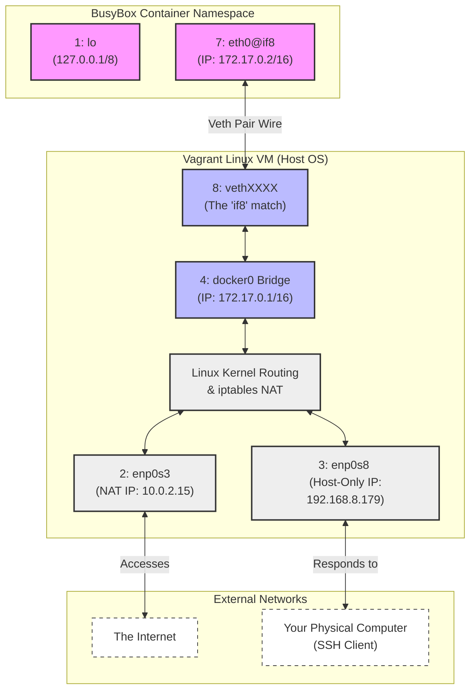

Running the `ip r` inside the container's network namespace, we can see that the container's route table is automatically set up as well:

``` bash hl_lines="3-4"
$ sudo docker run -it busybox /bin/sh
/ # ip r
default via 172.17.0.1 dev eth0
172.17.0.0/16 dev eth0 scope link  src 172.17.0.2
```

If we open a new terminal, `vagrant ssh` into our Vagrant Ubuntu instance, and run the `ip a` command, we can see the veth interface(`veth7fb4b93@if9`) Docker set up for the container on the same host's networking namespace:

``` bash hl_lines="9-12"
$ ip a
...
4: docker0: <BROADCAST,MULTICAST,UP,LOWER_UP> mtu 1500 qdisc noqueue state UP group default
    link/ether 02:42:90:51:e0:88 brd ff:ff:ff:ff:ff:ff
    inet 172.17.0.1/16 brd 172.17.255.255 scope global docker0
       valid_lft forever preferred_lft forever
    inet6 fe80::42:90ff:fe51:e088/64 scope link
       valid_lft forever preferred_lft forever
10: veth7fb4b93@if9: <BROADCAST,MULTICAST,UP,LOWER_UP> mtu 1500 qdisc noqueue master docker0 state UP group default
    link/ether b6:b6:08:ae:17:4b brd ff:ff:ff:ff:ff:ff link-netnsid 0
    inet6 fe80::b4b6:8ff:feae:174b/64 scope link
       valid_lft forever preferred_lft forever
```

The Ubuntu host's route table shows Docer's routes for reaching containers running on the host:

``` bash
$ ip r
default via 192.168.8.1 dev enp0s8 # (1)!
10.0.2.0/24 dev enp0s3  proto kernel  scope link  src 10.0.2.15 # (2)!
172.17.0.0/16 dev docker0  proto kernel  scope link  src 172.17.0.1 # (3)!
192.168.8.0/24 dev enp0s8  proto kernel  scope link  src 192.168.8.179 # (4)!
```

1.  **The Default Gateway (The Fallback)**
      - If traffic is destined for an IP that does not match any of the three specific rules above (e.g., a public website like `8.8.8.8`), the kernel throws the traffic over to the default gateway at `192.168.8.1` using the `enp0s8` interface.
2.  **The Vagrant Default NAT Network**
      - Any traffic destined for an IP starting with `10.0.2.x` is forwarded to the `enp0s3` interface.
3.  **The Container Network (`docker0`)**
      - Any traffic destined for an IP address starting with `172.17.x.x` (like the BusyBox container at `172.17.0.2`) will be sent directly to the `docker0` virtual bridge interface.
4.  **The Host-Only Network (`enp0s8`)**
      - Any traffic destined for an IP starting with `192.168.8.x` (like your physical laptop/host machine) is sent directly to `enp0s8`.


### host mode

In the `host` networking mode, **the container shares the same network namespace as the host**.

``` bash
$ sudo docker run -it --net=host busybox ip a
1: lo: <LOOPBACK,UP,LOWER_UP> mtu 65536 qdisc noqueue qlen 1
    link/loopback 00:00:00:00:00:00 brd 00:00:00:00:00:00
    inet 127.0.0.1/8 scope host lo
       valid_lft forever preferred_lft forever
    inet6 ::1/128 scope host
       valid_lft forever preferred_lft forever
2: enp0s3: <BROADCAST,MULTICAST,UP,LOWER_UP> mtu 1500 qdisc pfifo_fast qlen 1000
    link/ether 02:be:82:6b:cc:1d brd ff:ff:ff:ff:ff:ff
    inet 10.0.2.15/24 brd 10.0.2.255 scope global enp0s3
       valid_lft forever preferred_lft forever
    inet6 fd17:625c:f037:2:be:82ff:fe6b:cc1d/64 scope global dynamic flags 100
       valid_lft 86328sec preferred_lft 14328sec
    inet6 fe80::be:82ff:fe6b:cc1d/64 scope link
       valid_lft forever preferred_lft forever
3: enp0s8: <BROADCAST,MULTICAST,UP,LOWER_UP> mtu 1500 qdisc pfifo_fast qlen 1000
    link/ether 08:00:27:4c:6d:dd brd ff:ff:ff:ff:ff:ff
    inet 192.168.8.179/24 brd 192.168.8.255 scope global enp0s8
       valid_lft forever preferred_lft forever
    inet6 fe80::a00:27ff:fe4c:6ddd/64 scope link
       valid_lft forever preferred_lft forever
4: docker0: <NO-CARRIER,BROADCAST,MULTICAST,UP> mtu 1500 qdisc noqueue
    link/ether 02:42:90:51:e0:88 brd ff:ff:ff:ff:ff:ff
    inet 172.17.0.1/16 brd 172.17.255.255 scope global docker0
       valid_lft forever preferred_lft forever
    inet6 fe80::42:90ff:fe51:e088/64 scope link
       valid_lft forever preferred_lft forever
```

The network architecture would look like below:

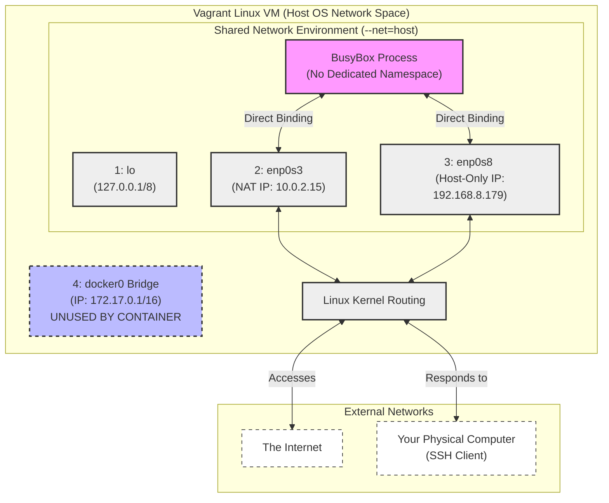


### Docker Networking Model

The**Container Network Model (CNM)** is a formal design specification created by Docker to standardize how containers are networked.

**Three core components of CNM**:

- **Sandbox**
    - An isolated network stack configuration for a single container.
    - It encapsulates the container's virtual interfaces (`eth0`), routing tables, and DNS settings.
    - Under the hood, a Sandbox is implemented directly as a **Linux Network Namespace**.
- **Endpoint**
    - The logical network interface that connects a Sandbox to a Network.
    - Think of an Endpoint as a virtual network port on a container. It belongs to exactly one Sandbox, and it represents one specific connection.
    - It is typically implemented as **one end of a Virtual Ethernet (veth) pair**.
- **Network**
    - A collection of Endpoints that are logically capable of communicating with each other.
    - It acts as a broadcast domain or virtual switch.
    - It is implemented using a Linux **network bridge** (`docker0` or custom bridges), a VLAN, or an overlay mesh network.

The CNM has **four conceptual network mode**:

- **Bridge**: Default Docker bridge(the `docker0` interface). for containers running on the same host.
- **Custom or Remote**: User-defined bridge, or allows users to create or use their plugin
- **Overlay**: for communicating with containers running on different hosts.
- **Null**: No networking options.

### Overlay Networking

One technology that helps with routing between hosts for containers is a VXLAN. In the below image, we can see a layer 2 overlay network created with a VXLAN running over the physical L3 network.


A VXLAN is an extension of the VLAN protocol creating 16 million unique identifiers. VXLAN defines a MAC-in-UDP encapsulation scheme where the original layer 2 frame has a VXLAN header added wrapped in a UDP IP packet. The below image shows the IP packet encapsulated in the UDP packet and its headers.

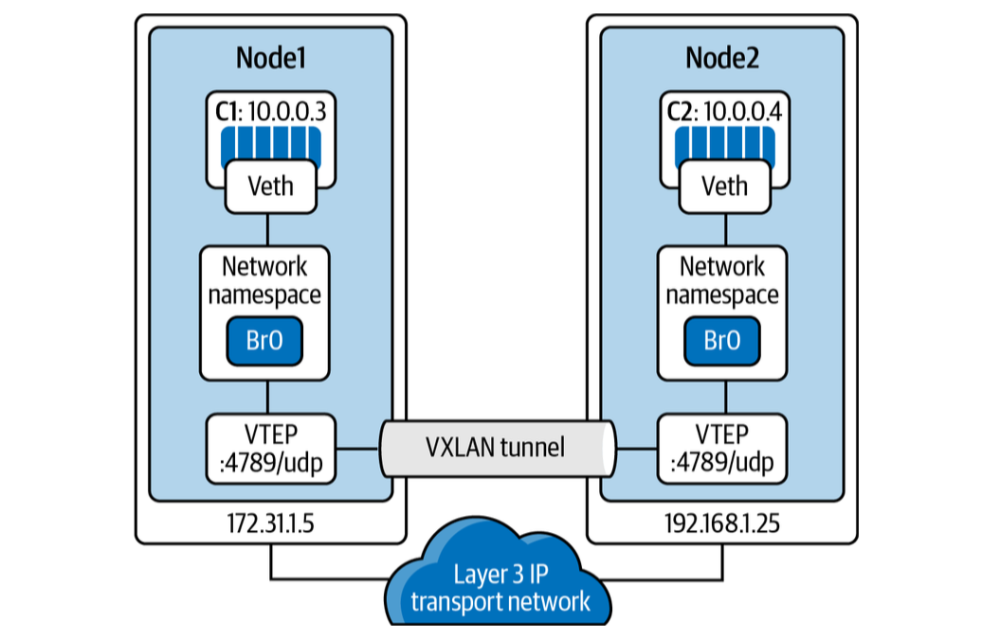


### Container Network Interface

---

## Container Connectivity

### Container to Container


### Container to Container Separate Hosts

---

## Conclusion