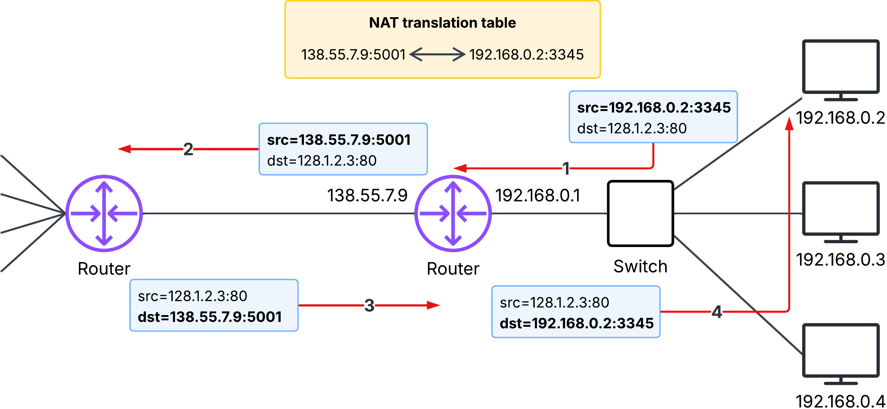

# 05 Network Address Translation(NAT)

## Summary
Network Address Translation (NAT) is a technique used by routers to map multiple private IP addresses in a local network to a single public IP address. This approach was developed to mitigate the scarcity of IPv4 addresses by allowing local hosts to share one public IP for internet access. NAT works by transparently switching IP addresses and port numbers in packet headers, maintaining a translation table to ensure that incoming responses are correctly routed back to the original host in the local network.

## 1. What is Network Address Translation(NAT)?
NAT refers to a IP header manipulation in packets conducted by a router. The source private IP of the outgoing packet is switched to the router's public IP address at the router. In the same manner, the router switches the destination IP address of the incoming packet to the destination host's private IP.

- For outgoing packets, switch source IP from private to pubilc.
- For incoming packets, switch destination IP from public to private.

## 2. Why is NAT used at the router?

### Limited number of IP addresses
There are exactly **2^32** or **4,294,967,296** total IPv4 addresses. If the number of devices(hosts) existing at this moment is less than this number in the internet, each devices can be assigned a public IP address and devices can communicate each other with the assigned IP address.

### Private vs public IP address
The reality is the number of devices that wants to connect to the internet keeps growing, making the IP address scarce. To overcome the limited supply of IP address, people have decided to divide IP addresses into two types:

- **Private IP address**: assigned to hosts in a Local Area Network(LAN), used to communicate between hosts within the same LAN. Any private IP address in the below blocks is considered **private**:
    - 10.0.0.0/8 (`10.x.x.x`)
    - 172.16.0.0/12 (`172.16.x.x`)
    - 192.168.0.0/16 (`192.168.x.x`)
- **Public IP address**: assigned to hosts in a Wide Area Network(WAN). Hosts with the public IP is able to communicate in the internet. Any IP address outside of the private IP range is considered **public**.

### Router - represents local network with public IP
To make use of scarce public IP address as efficiently as possible, people have decided to assign a public IP addresses to the router in a local network and let it represent other hosts when connecting to the internet. In other words, the router is the only device assigned with a public IP in a local network.

## 3. How does NAT work?

1. Host `192.168.0.2` request a web page on some web server (port `80`) with `128.1.2.3`. The host `192.168.0.2` assigns the (arbitary) source port number `3345` and sends the datagram into the LAN.
2. The NAT router receives the datagram, generates a new source port `5001`, and replaces the original source port number `3345` with the new source port number `5001`. The NAT router also adds an entry to its NAT translation table.
3. The web server responds with a datagram whose destination address is the IP address of the NAT router and the port `5001`.
4. When this datagram arrives at the NAT router, the router indexes the NAT translation table, obtains the corresponding IP address(`192.168.0.2`) and port (`3345`) for the browser in the home netowrk, then rewrites the datagram's destination address and port, and forwards it into the home network.