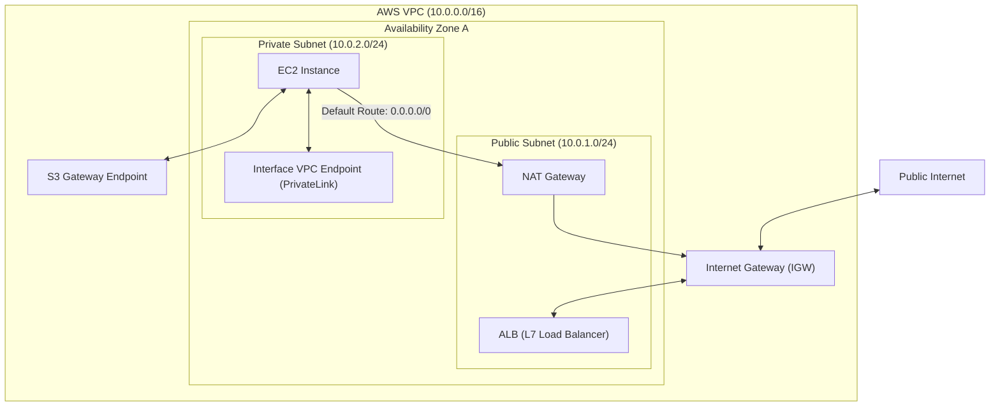

# AWS Networking Fundamentals

AWS Virtual Private Cloud (VPC) provides a software-defined networking (SDN) layer that lets you provision a logically isolated section of the AWS Cloud. Within this virtual network, you can define subnets, route tables, security policies, and gateways to manage packet flow.

---

## 1. Virtual Private Cloud (VPC) & Subnets

### Virtual Private Cloud (VPC)
A VPC is a regional resource that acts as your private network in the cloud.

*   **CIDR Block Assignment**: When creating a VPC, you assign an IPv4 Classless Inter-Domain Routing (CIDR) block (e.g., `10.0.0.0/16`). Recommended sizes range from `/16` (65,536 IPs) to `/28` (16 IPs).
*   **Secondary CIDRs**: You can associate secondary CIDR blocks if you run out of IP addresses.
*   **Tenancy**: Can be configured as `Default` (shared hardware) or `Dedicated` (single-tenant hardware).

### Subnets
Subnets partition the VPC CIDR block into smaller IP ranges allocated to specific **Availability Zones (AZs)**. A single subnet cannot span multiple AZs.

*   **Public Subnets**: Have a route in their route table that points to an **Internet Gateway (IGW)**. Resources in a public subnet can be assigned public IPs.
*   **Private Subnets**: Do not have a route to an IGW. They rely on NAT devices for outbound internet access and cannot receive unsolicited inbound connections from the internet.

!!! note

    **AWS Reserved IP Addresses**
    AWS reserves **5 IP addresses** in every subnet. For a subnet with CIDR `10.0.0.0/24`, the following IPs are reserved:

    1.  `10.0.0.0`: Network address.
    2.  `10.0.0.1`: Reserved by AWS for the VPC router.
    3.  `10.0.0.2`: Reserved by AWS for the DNS server (the IP is always VPC CIDR + 2, mapping to `AmazonProvidedDNS`).
    4.  `10.0.0.3`: Reserved by AWS for future use.
    5.  `10.0.0.255`: Network broadcast address (broadcast is not supported in a VPC, but the address is still reserved).

---

## 2. Routing & Traffic Flow

Every subnet must be associated with a **Route Table**, which controls where network traffic is directed.

### Route Table Rules

*   **Local Route**: Every route table contains a default local route (e.g., `10.0.0.0/16 -> local`) that enables all subnets inside the VPC to communicate with each other. This route cannot be deleted or modified.
*   **Longest Prefix Match**: If multiple routes match a packet's destination IP, the VPC router uses the most specific route (the one with the longest subnet mask).
*   **Main Route Table**: The default table associated with new subnets if they are not explicitly associated with another table.

### Internet Gateway (IGW)

An IGW is a redundant, horizontally scaled VPC component that enables communication between resources in your VPC and the internet. It performs two roles:
1.  Provides a target in the route table for internet-routable traffic (`0.0.0.0/0 -> igw-id`).
2.  Performs Network Address Translation (NAT) 1:1 for instances assigned public IPv4 addresses.

---

## 3. Network Access Control & Security

AWS provides two layers of firewalls to secure traffic: **Security Groups** (stateful, at the ENI level) and **Network ACLs** (stateless, at the subnet level).

| Feature | Security Group (SG) | Network ACL (NACL) |
| :--- | :--- | :--- |
| **Level** | Elastic Network Interface (ENI) | Subnet boundary |
| **Statefulness** | **Stateful**: Return traffic is automatically allowed regardless of rules. | **Stateless**: Return traffic must be explicitly allowed by inbound/outbound rules. |
| **Rule Order** | Evaluates all rules before deciding to allow traffic. | Evaluates rules in numbered order (lowest first). |
| **Supported Rules** | Allows only **Allow** rules (everything else is denied by default). | Supports both **Allow** and **Deny** rules. |
| **Reference Capacity** | Can reference other Security Groups as a source/destination. | Can only specify CIDR blocks as source/destination. |

---

## 4. Network Address Translation (NAT)

NAT devices allow resources in private subnets to initiate outbound IPv4 connections to the internet or other AWS services while blocking inbound connections from the internet.

### NAT Gateway

*   **Managed Service**: AWS manages the availability, scaling, and patching.
*   **Public NAT Gateway**: Resides in a public subnet, is assigned an Elastic IP (EIP), and routes traffic to the IGW.
*   **Private NAT Gateway**: Routes traffic to other VPCs or on-premises networks (no EIP or IGW required).
*   **High Availability**: Must be deployed per Availability Zone to prevent AZ-wide failures.

### NAT Instance

*   **Self-Managed**: A standard EC2 instance configured to perform NAT.
*   **Configuration**: You must disable the **Source/Destination Check** on the instance's ENI so it can forward packets that are not destined for itself.
*   **Performance**: Limited by the instance type's network bandwidth.

---

## 5. Load Balancing (ALB vs. NLB)

AWS Elastic Load Balancing (ELB) distributes incoming application traffic across multiple targets, such as EC2 instances, containers, and IP addresses.

### Application Load Balancer (ALB)

*   **OSI Layer**: Layer 7 (Application).
*   **Traffic Types**: HTTP, HTTPS, gRPC.
*   **Routing Decisions**: Can route traffic based on URL path (`/api`), hostname (`api.domain.com`), HTTP headers, query parameters, or source IP.
*   **Features**: Supports SSL/TLS termination, integration with AWS WAF, and redirection (HTTP to HTTPS).
*   **IP Mapping**: IPs allocated to the ALB nodes change dynamically; clients should resolve the ALB's DNS name.

### Network Load Balancer (NLB)

*   **OSI Layer**: Layer 4 (Transport).
*   **Traffic Types**: TCP, UDP, TLS.
*   **Performance**: Designed to handle millions of requests per second with ultra-low latency (sub-millisecond).
*   **Static IPs**: You can assign a static **Elastic IP (EIP)** per Availability Zone to the NLB, providing a stable IP address target for clients.
*   **Source IP Preservation**: Preserves the client's original source IP address when forwarding packets to backend targets.

---

## 6. Private Connectivity & VPC Endpoints (PrivateLink)

VPC Endpoints allow you to privately connect your VPC to supported AWS services and VPC endpoint services powered by AWS PrivateLink without requiring an Internet Gateway, NAT Gateway, VPN, or AWS Direct Connect.

### Gateway Endpoints

*   **Mechanism**: Modifies the subnet's route table to add a route target pointing to the service prefix list (`pl-xxxxxxx -> vpce-xxxxxxx`).
*   **Cost**: Free of charge.
*   **Supported Services**: Available only for **Amazon S3** and **Amazon DynamoDB**.

### Interface Endpoints (AWS PrivateLink)

*   **Mechanism**: Provisions an Elastic Network Interface (ENI) with a private IP address from your subnet's pool. This ENI acts as an entry point for traffic destined for the service.
*   **DNS Resolution**: Utilizes Route 53 private hosted zones to map public service endpoints (e.g., `sqs.us-east-1.amazonaws.com`) to the private IP of the ENI.
*   **Cost**: Billed hourly per endpoint, plus data processing fees per GB.
*   **Supported Services**: Most AWS services (SQS, SNS, Kinesis, ECS, etc.), marketplace services, and custom services hosted by other VPCs.
