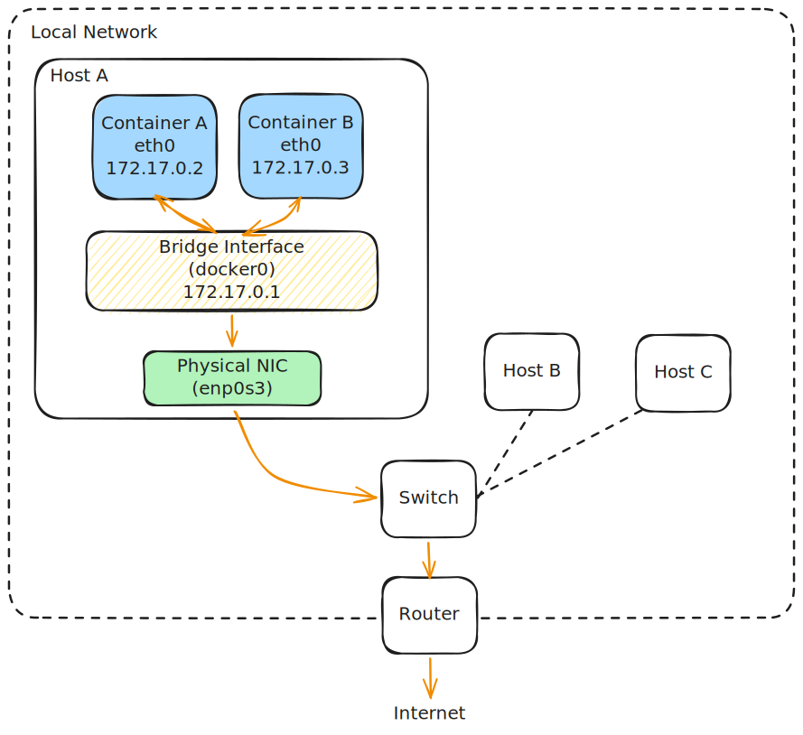

# Container Bridge Interface

In containerized environments (like Docker and Kubernetes), a **Bridge Interface** (e.g., `docker0` or `br0`) is a virtual, software-defined device that connects local containers to each other and to the host's physical network.

---

## The Dual Role of a Bridge Interface

To understand a bridge, you must realize it plays two distinct roles simultaneously inside the operating system kernel's memory:

1.  **At Layer 2 (Data Link):** It acts as a **Virtual Switch** (connecting local containers together so they can communicate directly).
2.  **At Layer 3 (Network):** It acts as a **Virtual Gateway** (providing an IP address that containers use as their default gateway to reach external networks).

---

## Architectural Visualization

The bridge sits in the host's memory, connecting container virtual cables (`veth` pairs) to the host's physical network adapter (`enp0s3` or `eno1`):



---

## How It Operates Step-by-Step

### Scenario 1: Container-to-Container (The Layer 2 Switch)
When **Container A** (`172.17.0.2`) wants to talk to **Container B** (`172.17.0.3`):

1. **ARP Request:** Container A broadcasts an ARP request to find Container B's MAC address.
2. **Switch Forwarding:** The bridge (`docker0`) acts as a standard Layer 2 switch. It receives the broadcast, floods it to all local ports, and learns which port is connected to which MAC address.
3. **Direct Delivery:** Once Container B replies, the bridge records the MAC mappings in its internal MAC/CAM table. Subsequent frames are forwarded directly between Container A's virtual port and Container B's virtual port.
4. **Key Note:** **The packet never leaves the local bridge subnet and is never routed by the Layer 3 stack.**

### Scenario 2: Container-to-Internet (The Layer 3 Gateway)
When **Container A** (`172.17.0.2`) wants to talk to an external public server (e.g., `8.8.8.8`):

1. **The Default Gateway:** Inside Container A, the local routing table contains a default gateway route pointing to the bridge's IP:
   ```bash
   $ ip route
   default via 172.17.0.1 dev eth0
   ```
2. **Gateway Delivery:** Container A realizes `8.8.8.8` is on a different network, so it encapsulates the packet in a Layer 2 frame addressed to the bridge interface's MAC address and transmits it.
3. **Host Routing & NAT (Masquerading):** 
    * The bridge interface receives the packet on its IP address `172.17.0.1`.
    * The host operating system's kernel intercepts this packet, looks up the host's main routing table, and determines it must go out via the physical interface (`enp0s3`).
    * The kernel performs **Source NAT (MASQUERADE)**, overwriting the container's private source IP (`172.17.0.2`) with the host's public/physical IP, and routes it out to the physical gateway.
4. **Return Path:** When the response returns to the host's physical IP, the kernel's connection tracking table (`conntrack`) matches it, translates the destination back to `172.17.0.2`, and forwards it across the bridge to Container A.
